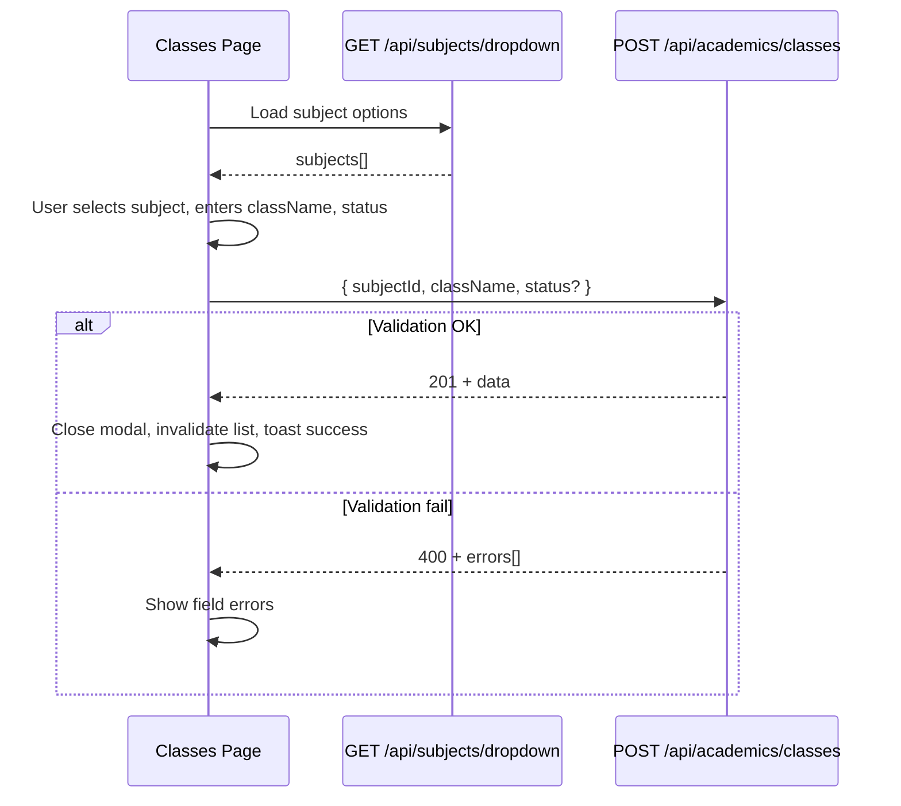
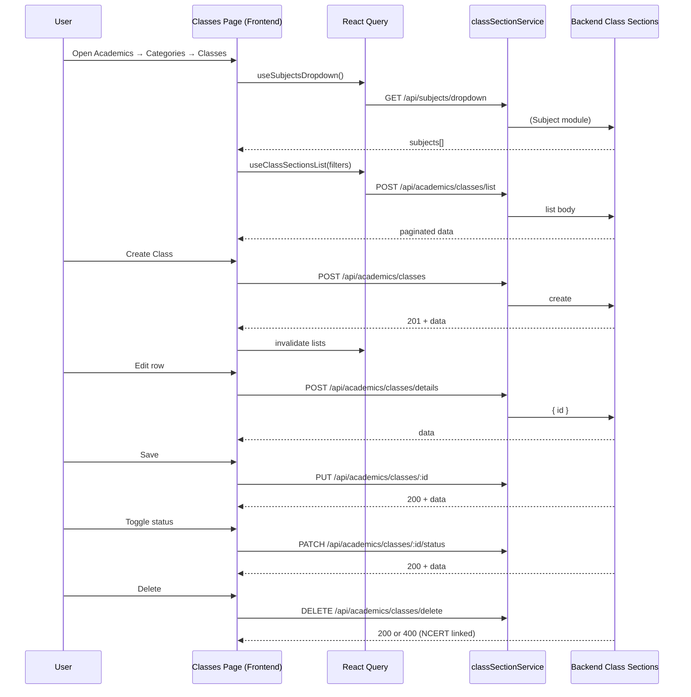

# Academics → Categories → Classes (Frontend) — Class Sections (Backend) Integration Guide

**Audience:** React + Vite frontend developers integrating the **Classes** page under **Academics → Categories**.

**Backend module:** **Class Sections** (`ClassSection` model, `classSectionController`, `classSectionRoutes`).

**Base path:** `{VITE_API_BASE_URL}/api/academics/classes`

**Auth:** `Authorization: Bearer <token>` — **Super Admin only**

---

## Critical naming distinction

| Layer | Name | Notes |
|-------|------|-------|
| Frontend page | **Classes** | UI route: `Academics → Categories → Classes` |
| Backend module | **Class Sections** | MongoDB model `ClassSection`, fields like `classSectionId` |
| Backend mount URL | `/api/academics/classes` | URL says "classes" but serves **Class Sections** only |
| ❌ Do not use | **Classrooms** | Mounted at `/api/classrooms` — different module |
| ❌ Do not use | Legacy **Classes** APIs | No separate legacy Classes CRUD module exists in this codebase |

The frontend **Classes** page must consume **only** the Class Sections APIs documented here.

---

## 1. Module Overview

### Purpose

**Class Sections** represent academic class levels (e.g. "Class 6", "Class 10", "Class 12") scoped to a **Subject**. Each record ties one `className` to one `subject` and carries a system-generated `classSectionId` (format `CLSEC001`, `CLSEC002`, …).

Class Sections are used downstream by content modules (e.g. NCERT Free Resources link to a class section). Deletion is blocked when NCERT books are linked.

### Relationship with Subjects

- Every Class Section **requires** a valid, non-deleted **Subject** (`subjectId` → `Subject._id`).
- Uniqueness is enforced per subject: the same `className` cannot exist twice for the same subject (case-insensitive).
- List search matches **class name** or **subject name**.
- List filter supports filtering by `subjectId`.

There is **no** direct relationship to Courses, Programs, Faculty, Batch, or Center in the Class Sections module.

### Why the frontend page is called "Classes"

The product UI uses the user-friendly label **"Classes"** (what admins think of as school class levels). The backend stores these as **Class Sections** to distinguish them from **Classrooms** (physical rooms) and other "class" concepts.

### Expected frontend workflow

1. **Load list** — `POST /api/academics/classes/list` with pagination, optional search, status filter, subject filter.
2. **Load subject dropdown** (create/edit/filter) — `GET /api/subjects/dropdown` (Subject module).
3. **Create** — open form → select subject + enter class name + optional status → `POST /api/academics/classes`.
4. **View / Edit** — fetch one record → `POST /api/academics/classes/details` → populate form → `PUT /api/academics/classes/:id`.
5. **Change status** — toggle → `PATCH /api/academics/classes/:id/status`.
6. **Delete** — confirm → `DELETE /api/academics/classes/delete` (soft delete).

---

## 2. Complete API Inventory

All Class Sections routes apply middleware: `protect` → `requireSuperAdmin`.

| # | Method | Endpoint | Purpose |
|---|--------|----------|---------|
| 1 | `POST` | `/api/academics/classes` | Create class section |
| 2 | `POST` | `/api/academics/classes/list` | List with search, filters, pagination, sort |
| 3 | `POST` | `/api/academics/classes/details` | Get single class section by MongoDB `_id` |
| 4 | `PUT` | `/api/academics/classes/:id` | Update class section |
| 5 | `PATCH` | `/api/academics/classes/:id/status` | Update status only |
| 6 | `DELETE` | `/api/academics/classes/delete` | Soft delete class section |
| 7 | `POST` | `/api/academics/classes/dropdown` | Active class sections for a subject (dropdown) |

### Supporting dropdown (Subject module — not Class Sections)

| Method | Endpoint | Purpose |
|--------|----------|---------|
| `GET` | `/api/subjects/dropdown` | Active subjects for create/edit/filter forms |

---

### 2.1 Create Class Section

| Property | Value |
|----------|-------|
| **HTTP Method** | `POST` |
| **URL** | `/api/academics/classes` |
| **Purpose** | Create a new class section under a subject |
| **Authentication** | Required — Bearer token |
| **Permission** | Super Admin only (`roleCode === 'SUPER_ADMIN'` or legacy `user.role === 'super_admin'`) |

**Headers**

| Header | Required | Value |
|--------|----------|-------|
| `Authorization` | Yes | `Bearer <token>` |
| `Content-Type` | Yes | `application/json` |

**Path parameters:** None

**Query parameters:** None

**Request body**

| Field | Type | Required | Validation |
|-------|------|----------|------------|
| `subjectId` | `string` | Yes | Valid MongoDB ObjectId; subject must exist and not be deleted |
| `className` | `string` | Yes | Trimmed, min 1, max 100 chars; unique per subject (case-insensitive) |
| `status` | `string` | No | `"ACTIVE"` or `"INACTIVE"`; default `"ACTIVE"` |

**Success response — `201 Created`**

```json
{
  "success": true,
  "message": "Class created successfully",
  "data": {
    "_id": "674a1b2c3d4e5f6789012345",
    "classSectionId": "CLSEC001",
    "subjectId": "674a1b2c3d4e5f6789012340",
    "subject": {
      "_id": "674a1b2c3d4e5f6789012340",
      "subjectId": "SUB001",
      "subjectName": "Mathematics"
    },
    "subjectName": "Mathematics",
    "className": "Class 10",
    "status": "ACTIVE",
    "createdBy": { "name": "Admin", "email": "admin@example.com" },
    "updatedBy": { "name": "Admin", "email": "admin@example.com" },
    "createdAt": "2026-06-26T10:00:00.000Z",
    "updatedAt": "2026-06-26T10:00:00.000Z"
  }
}
```

**Error responses:** See [§13 Error Handling](#13-error-handling).

---

### 2.2 List Class Sections

| Property | Value |
|----------|-------|
| **HTTP Method** | `POST` |
| **URL** | `/api/academics/classes/list` |
| **Purpose** | Paginated list with search, status filter, subject filter, sorting |
| **Authentication** | Required |
| **Permission** | Super Admin only |

**Headers:** Same as create.

**Request body**

| Field | Type | Required | Default | Validation |
|-------|------|----------|---------|------------|
| `search` | `string` | No | `""` | Matches `className` or related `subjectName` (case-insensitive) |
| `status` | `string` | No | — | `"ACTIVE"`, `"INACTIVE"`, or `""` (empty = all statuses) |
| `subjectId` | `string` | No | — | Valid ObjectId or `""`; filters by subject |
| `page` | `number` | No | `1` | Integer ≥ 1 |
| `limit` | `number` | No | `10` | Integer 1–100 |
| `sortBy` | `string` | No | `"createdAt"` | One of: `createdAt`, `className`, `status`, `classSectionId` |
| `sortOrder` | `string` | No | `"desc"` | `"asc"` or `"desc"` |

**Success response — `200 OK`**

```json
{
  "success": true,
  "total": 42,
  "page": 1,
  "limit": 10,
  "totalPages": 5,
  "count": 10,
  "data": [
    {
      "_id": "674a1b2c3d4e5f6789012345",
      "classSectionId": "CLSEC001",
      "subjectId": "674a1b2c3d4e5f6789012340",
      "subject": {
        "_id": "674a1b2c3d4e5f6789012340",
        "subjectId": "SUB001",
        "subjectName": "Mathematics"
      },
      "subjectName": "Mathematics",
      "className": "Class 10",
      "status": "ACTIVE",
      "createdBy": null,
      "updatedBy": null,
      "createdAt": "2026-06-26T10:00:00.000Z",
      "updatedAt": "2026-06-26T10:00:00.000Z"
    }
  ]
}
```

---

### 2.3 Get Class Section Details

| Property | Value |
|----------|-------|
| **HTTP Method** | `POST` |
| **URL** | `/api/academics/classes/details` |
| **Purpose** | Fetch one class section for view/edit form |
| **Authentication** | Required |
| **Permission** | Super Admin only |

**Request body**

| Field | Type | Required | Validation |
|-------|------|----------|------------|
| `id` | `string` | Yes | Valid MongoDB ObjectId (Class Section `_id`) |

**Success response — `200 OK`**

```json
{
  "success": true,
  "data": { /* same shape as single item in create response */ }
}
```

**Error — `404`:** `{ "success": false, "message": "Class not found" }`

---

### 2.4 Update Class Section

| Property | Value |
|----------|-------|
| **HTTP Method** | `PUT` |
| **URL** | `/api/academics/classes/:id` |
| **Purpose** | Update subject, class name, and/or status |
| **Authentication** | Required |
| **Permission** | Super Admin only |

**Path parameters**

| Param | Type | Required | Description |
|-------|------|----------|-------------|
| `id` | `string` | Yes | Class Section MongoDB `_id` |

**Request body** — at least one field required

| Field | Type | Required | Validation |
|-------|------|----------|------------|
| `subjectId` | `string` | No | Valid ObjectId; subject must exist |
| `className` | `string` | No | Trimmed, min 1, max 100; unique per subject |
| `status` | `string` | No | `"ACTIVE"` or `"INACTIVE"` |

**Success response — `200 OK`**

```json
{
  "success": true,
  "message": "Class updated successfully",
  "data": { /* formatted class section */ }
}
```

---

### 2.5 Change Status

| Property | Value |
|----------|-------|
| **HTTP Method** | `PATCH` |
| **URL** | `/api/academics/classes/:id/status` |
| **Purpose** | Update status only (ACTIVE ↔ INACTIVE) |
| **Authentication** | Required |
| **Permission** | Super Admin only |

**Path parameters:** `id` — Class Section MongoDB `_id`

**Request body**

| Field | Type | Required | Validation |
|-------|------|----------|------------|
| `status` | `string` | Yes | `"ACTIVE"` or `"INACTIVE"` |

**Success response — `200 OK`**

```json
{
  "success": true,
  "message": "Class status updated successfully",
  "data": { /* formatted class section */ }
}
```

---

### 2.6 Delete Class Section

| Property | Value |
|----------|-------|
| **HTTP Method** | `DELETE` |
| **URL** | `/api/academics/classes/delete` |
| **Purpose** | Soft delete (sets `isDeleted: true`, `status: INACTIVE`) |
| **Authentication** | Required |
| **Permission** | Super Admin only |

**Request body**

| Field | Type | Required | Validation |
|-------|------|----------|------------|
| `id` | `string` | Yes | Valid MongoDB ObjectId |

**Success response — `200 OK`**

```json
{
  "success": true,
  "message": "Class deleted successfully",
  "data": {
    "_id": "674a1b2c3d4e5f6789012345",
    "classSectionId": "CLSEC001",
    "isDeleted": true
  }
}
```

**Business rule error — `400`:** Cannot delete if linked to NCERT books:

```json
{
  "success": false,
  "message": "Cannot delete class linked to NCERT books. Remove or reassign books first."
}
```

---

### 2.7 Class Sections Dropdown (by Subject)

| Property | Value |
|----------|-------|
| **HTTP Method** | `POST` |
| **URL** | `/api/academics/classes/dropdown` |
| **Purpose** | Active class sections for a given subject (used by dependent dropdowns) |
| **Authentication** | Required |
| **Permission** | Super Admin only |

**Request body**

| Field | Type | Required | Validation |
|-------|------|----------|------------|
| `subjectId` | `string` | Yes | Valid ObjectId; subject must exist |

**Success response — `200 OK`**

```json
{
  "success": true,
  "count": 3,
  "data": [
    {
      "id": "674a1b2c3d4e5f6789012345",
      "classSectionId": "CLSEC001",
      "className": "Class 6"
    }
  ]
}
```

Items are sorted numerically by digits in `className`, then alphabetically.

---

## 3. Request Body Documentation

### POST `/api/academics/classes` (Create)

| Field | Type | Required | Validation | Description | Example |
|-------|------|----------|------------|-------------|---------|
| `subjectId` | `string` | Yes | Valid ObjectId; subject exists | Subject this class belongs to | `"674a1b2c3d4e5f6789012340"` |
| `className` | `string` | Yes | 1–100 chars after trim; unique per subject | Display name of the class | `"Class 10"` |
| `status` | `string` | No | `ACTIVE` \| `INACTIVE`; default `ACTIVE` | Record status | `"ACTIVE"` |

### PUT `/api/academics/classes/:id` (Update)

| Field | Type | Required | Validation | Description | Example |
|-------|------|----------|------------|-------------|---------|
| `subjectId` | `string` | No* | Valid ObjectId; subject exists | Change linked subject | `"674a1b2c3d4e5f6789012340"` |
| `className` | `string` | No* | 1–100 chars; unique per subject | Change class name | `"Class 12"` |
| `status` | `string` | No* | `ACTIVE` \| `INACTIVE` | Change status | `"INACTIVE"` |

\*At least one of `subjectId`, `className`, or `status` must be present in the body.

### POST `/api/academics/classes/list` (List)

| Field | Type | Required | Validation | Description | Example |
|-------|------|----------|------------|-------------|---------|
| `search` | `string` | No | Any string | Search class name or subject name | `"Class 10"` |
| `status` | `string` | No | `ACTIVE`, `INACTIVE`, or empty | Filter by status | `"ACTIVE"` |
| `subjectId` | `string` | No | ObjectId or empty | Filter by subject | `"674a1b2c3d4e5f6789012340"` |
| `page` | `number` | No | ≥ 1 | Page number | `1` |
| `limit` | `number` | No | 1–100 | Page size | `10` |
| `sortBy` | `string` | No | See sort fields | Sort column | `"className"` |
| `sortOrder` | `string` | No | `asc` \| `desc` | Sort direction | `"asc"` |

### POST `/api/academics/classes/details` & DELETE `/api/academics/classes/delete`

| Field | Type | Required | Validation | Description | Example |
|-------|------|----------|------------|-------------|---------|
| `id` | `string` | Yes | Valid ObjectId | Class Section `_id` | `"674a1b2c3d4e5f6789012345"` |

### PATCH `/api/academics/classes/:id/status`

| Field | Type | Required | Validation | Description | Example |
|-------|------|----------|------------|-------------|---------|
| `status` | `string` | Yes | `ACTIVE` \| `INACTIVE` | New status | `"INACTIVE"` |

### POST `/api/academics/classes/dropdown`

| Field | Type | Required | Validation | Description | Example |
|-------|------|----------|------------|-------------|---------|
| `subjectId` | `string` | Yes | Valid ObjectId | Subject to list classes for | `"674a1b2c3d4e5f6789012340"` |

---

## 4. Response Documentation

### Formatted Class Section object (`data` / list items)

Returned by create, update, status change, details, and list endpoints (via `formatClassSection`).

| Property | Type | Description |
|----------|------|-------------|
| `_id` | `string` | MongoDB ObjectId — **use this for details, update, delete, status API calls** |
| `classSectionId` | `string` | Human-readable sequential ID (e.g. `CLSEC001`) — display only |
| `subjectId` | `string` | Subject MongoDB `_id` (convenience duplicate of `subject._id`) |
| `subject` | `object \| string` | Populated subject object or raw id if not populated |
| `subject._id` | `string` | Subject MongoDB `_id` |
| `subject.subjectId` | `string` | Subject code (e.g. `SUB001`) |
| `subject.subjectName` | `string` | Subject display name |
| `subjectName` | `string` | Flattened subject name for table display |
| `className` | `string` | Class label (e.g. `"Class 10"`) |
| `status` | `string` | `"ACTIVE"` or `"INACTIVE"` |
| `createdBy` | `object \| null` | Populated user `{ name, email }` or `null` |
| `updatedBy` | `object \| null` | Populated user `{ name, email }` or `null` |
| `createdAt` | `string` (ISO date) | Creation timestamp |
| `updatedAt` | `string` (ISO date) | Last update timestamp |

**Not returned** in normal responses (internal fields): `isDeleted`, `deletedAt`.

### List envelope

| Property | Type | Description |
|----------|------|-------------|
| `success` | `boolean` | Always `true` on success |
| `total` | `number` | Total matching records (all pages) |
| `page` | `number` | Current page (1-based) |
| `limit` | `number` | Page size |
| `totalPages` | `number` | `Math.ceil(total / limit)` |
| `count` | `number` | Number of items in current `data` array |
| `data` | `array` | Array of formatted class sections |

### Delete response `data`

| Property | Type | Description |
|----------|------|-------------|
| `_id` | `string` | Deleted record id |
| `classSectionId` | `string` | Display id |
| `isDeleted` | `boolean` | Always `true` |

### Dropdown item

| Property | Type | Description |
|----------|------|-------------|
| `id` | `string` | Class Section `_id` — **value field for selects** |
| `classSectionId` | `string` | Display/reference code |
| `className` | `string` | **Label field for selects** |

---

## 5. Dropdown APIs

### 5.1 Subjects dropdown (required for Classes page forms/filters)

**Not part of Class Sections module** — lives on Subject routes. Documented here because create/edit/filter require it.

| Property | Value |
|----------|-------|
| **Method** | `GET` |
| **URL** | `/api/subjects/dropdown` |
| **Auth** | Super Admin |
| **Query / Body** | None |

**Response**

```json
{
  "success": true,
  "count": 5,
  "data": [
    {
      "_id": "674a1b2c3d4e5f6789012340",
      "subjectId": "SUB001",
      "subjectName": "Mathematics"
    }
  ]
}
```

| UI use | Field |
|--------|-------|
| **Label** | `subjectName` |
| **Value** | `_id` (pass as `subjectId` to Class Sections APIs) |

Only **ACTIVE**, non-deleted subjects are returned.

### 5.2 Class Sections dropdown (by subject)

| Property | Value |
|----------|-------|
| **Method** | `POST` |
| **URL** | `/api/academics/classes/dropdown` |
| **Body** | `{ "subjectId": "<ObjectId>" }` |

| UI use | Field |
|--------|-------|
| **Label** | `className` |
| **Value** | `id` |

Only **ACTIVE**, non-deleted class sections for the given subject.

### Dropdowns not used by Class Sections module

The following are **not** referenced by Class Sections backend code: Course, Program, Faculty, Batch, Center.

---

## 6. Search & Filters

| Feature | Supported | Details |
|---------|-----------|---------|
| **Search** | Yes | Field: `search` in POST body. Matches `className` OR `subjectName` (case-insensitive partial match). |
| **Status filter** | Yes | `status`: `"ACTIVE"`, `"INACTIVE"`, or omit/`""` for all. |
| **Subject filter** | Yes | `subjectId`: valid ObjectId filters to that subject only. |
| **Pagination** | Yes | `page` (default 1), `limit` (default 10, max 100). |
| **Sorting** | Yes | `sortBy`: `createdAt` (default), `className`, `status`, `classSectionId`. `sortOrder`: `asc` or `desc` (default `desc`). |

---

## 7. Create Flow



**Steps**

1. Fetch subjects: `GET /api/subjects/dropdown`.
2. User fills: `subjectId` (required), `className` (required), `status` (optional, default ACTIVE).
3. Submit: `POST /api/academics/classes`.
4. On **201**: show success message `"Class created successfully"`, refresh list, close dialog.
5. On **400**: map `errors[].field` → form fields (`subjectId`, `className`).

---

## 8. Edit Flow

**Steps**

1. User clicks edit on row → take row `_id`.
2. Fetch: `POST /api/academics/classes/details` with `{ "id": "<_id>" }`.
3. Populate form:
   - Subject select → `data.subjectId` or `data.subject._id`
   - Class name → `data.className`
   - Status → `data.status`
4. Load subjects dropdown if not cached: `GET /api/subjects/dropdown`.
5. Submit: `PUT /api/academics/classes/:id` with changed fields (at least one).
6. On **200**: toast `"Class updated successfully"`, invalidate list + detail cache.
7. On **404**: show `"Class not found"`, redirect to list.

---

## 9. Delete Flow

**Steps**

1. User confirms delete.
2. Call: `DELETE /api/academics/classes/delete` with body `{ "id": "<_id>" }`.
3. On **200**: toast `"Class deleted successfully"`, remove from list / invalidate queries.
4. On **404**: `"Class not found"`.
5. On **400** (NCERT linked): show `"Cannot delete class linked to NCERT books. Remove or reassign books first."` — do not remove row from UI.

Deletion is **soft delete** — record is hidden from all list/detail queries (`isDeleted: false` filter).

---

## 10. Status Flow

| Property | Value |
|----------|-------|
| **Endpoint** | `PATCH /api/academics/classes/:id/status` |
| **Body** | `{ "status": "ACTIVE" \| "INACTIVE" }` |
| **Enum values** | `ACTIVE`, `INACTIVE` |
| **Default on create** | `ACTIVE` |

**Frontend behaviour**

- Toggle or status dropdown on list/detail → call PATCH endpoint (not full PUT unless editing other fields too).
- On success: update local row status from `data.status`, show `"Class status updated successfully"`.
- INACTIVE records still appear in list unless filtered out; dropdown endpoint excludes INACTIVE items.

---

## 11. Pagination

Backend list response fields (actual implementation):

| Field | Type | Description |
|-------|------|-------------|
| `page` | `number` | Current page (1-based) — equivalent to "currentPage" |
| `limit` | `number` | Items per page |
| `total` | `number` | Total matching records — equivalent to "totalRecords" |
| `totalPages` | `number` | Total pages |
| `count` | `number` | Items returned in this response |

**Note:** The API returns `total`, not `totalRecords`, and `page`, not `currentPage`. Map in the frontend if your table component expects different names:

```typescript
const currentPage = response.page;
const totalRecords = response.total;
```

---

## 12. Validation Rules

### Joi schema (middleware — runs before controller)

| Endpoint | Rule |
|----------|------|
| Create | `subjectId` required, valid ObjectId |
| Create | `className` required, trim, min 1, max 100 |
| Create | `status` optional, `ACTIVE` \| `INACTIVE`, default `ACTIVE` |
| Update | At least one of `subjectId`, `className`, `status` |
| Update | `subjectId` if present: valid ObjectId |
| Update | `className` if present: trim, min 1, max 100 |
| List | `page` ≥ 1; `limit` 1–100 |
| List | `sortBy` ∈ `createdAt`, `className`, `status`, `classSectionId` |
| List | `sortOrder` ∈ `asc`, `desc` |
| List | `status` ∈ `ACTIVE`, `INACTIVE`, `""` |
| Details / Delete | `id` required, valid ObjectId |
| Dropdown | `subjectId` required, valid ObjectId |
| Status | `status` required, `ACTIVE` \| `INACTIVE` |

### Controller-level business rules

| Rule | Error |
|------|-------|
| Subject must exist and not be deleted | 400 — `{ field: "subjectId", message: "Subject not found" }` |
| Invalid subject ObjectId | 400 — `{ field: "subjectId", message: "Invalid subject id" }` |
| Duplicate class name for same subject (case-insensitive) | 400 — `{ field: "className", message: "This class already exists for the selected subject" }` |
| Update with empty class name | 400 — `{ field: "className", message: "Class name cannot be empty" }` |
| Record not found | 404 — `"Class not found"` |
| Delete with linked NCERT books | 400 — business message (no `errors` array) |
| Database unique index violation | Handled by duplicate check before save |

### Model constraints

- `status` enum: `ACTIVE`, `INACTIVE`
- Compound unique index: `(subject + className)` where `isDeleted: false`

---

## 13. Error Handling

Class Sections controllers return a simplified JSON shape (no `statusCode` field). Auth middleware responses include `statusCode` from the unified API response helper.

### 400 Bad Request — Validation failed (Joi)

```json
{
  "success": false,
  "message": "Validation failed",
  "errors": [
    { "field": "className", "message": "Class name is required" }
  ]
}
```

### 400 Bad Request — Business rule

```json
{
  "success": false,
  "message": "Validation failed",
  "errors": [
    { "field": "className", "message": "This class already exists for the selected subject" }
  ]
}
```

Or delete guard:

```json
{
  "success": false,
  "message": "Cannot delete class linked to NCERT books. Remove or reassign books first."
}
```

### 401 Unauthorized (auth middleware)

Missing/invalid token:

```json
{
  "success": false,
  "statusCode": 11001,
  "message": "Not authorized, no token",
  "data": null,
  "error": null
}
```

Other 401 messages: `"Not authorized, token failed"`, `"Not authorized, admin not found"`, `"User not found"`, `"Not authenticated"`.

### 403 Forbidden

Super Admin required:

```json
{
  "success": false,
  "message": "Access denied. Super Admin only."
}
```

Account disabled/deactivated (auth middleware) includes `statusCode: 11002`.

### 404 Not Found

```json
{
  "success": false,
  "message": "Class not found"
}
```

### 409 Conflict

**Not used** by Class Sections module. Duplicate names return **400**.

### 422 Unprocessable Entity

**Not used** by Class Sections module. Validation errors return **400**.

### 500 Server Error

```json
{
  "success": false,
  "message": "Server error",
  "error": "<error message>"
}
```

---

## 14. Authentication

### Authorization header

```http
Authorization: Bearer <JWT_TOKEN>
```

Obtain token via your existing admin login flow (`protect` accepts both legacy `User` JWT and `AdminAccess` JWT with `authType: 'admin_access'`).

### Required permission

All Class Sections routes use:

```javascript
router.use(protect, requireSuperAdmin);
```

Only **Super Admin** may access these endpoints:

- Legacy user: `req.user.role === 'super_admin'`
- Admin access: `req.adminAccess.roleId.roleCode === 'SUPER_ADMIN'`

No granular permission matrix check is applied on this module — it is entirely Super Admin gated.

---

## 15. React + Vite Frontend Integration Guide

### Recommended file layout

```
src/
 ├── services/
 │    ├── api.ts
 │    ├── classSectionService.ts
 ├── hooks/
 │    ├── useClassSections.ts
 ├── providers/
 │    ├── QueryProvider.tsx
 ├── utils/
 │    ├── errorHandler.ts
 ├── pages/
 │    └── Academics/
 │          └── Categories/
 │                └── Classes/
```

### Service method → API mapping

| Service method | HTTP | Endpoint | React Query |
|----------------|------|----------|-------------|
| `getSubjectsDropdown()` | GET | `/api/subjects/dropdown` | `useQuery` |
| `getClassSections(params)` | POST | `/api/academics/classes/list` | `useQuery` |
| `getClassSectionById(id)` | POST | `/api/academics/classes/details` | `useQuery` |
| `createClassSection(payload)` | POST | `/api/academics/classes` | `useMutation` |
| `updateClassSection(id, payload)` | PUT | `/api/academics/classes/${id}` | `useMutation` |
| `updateClassSectionStatus(id, status)` | PATCH | `/api/academics/classes/${id}/status` | `useMutation` |
| `deleteClassSection(id)` | DELETE | `/api/academics/classes/delete` | `useMutation` |
| `getClassSectionsDropdown(subjectId)` | POST | `/api/academics/classes/dropdown` | `useQuery` |

### Query keys

```typescript
export const classSectionKeys = {
  all: ['classSections'] as const,
  lists: () => [...classSectionKeys.all, 'list'] as const,
  list: (filters: ClassSectionListParams) =>
    [...classSectionKeys.lists(), filters] as const,
  details: () => [...classSectionKeys.all, 'detail'] as const,
  detail: (id: string) => [...classSectionKeys.details(), id] as const,
  dropdown: (subjectId: string) =>
    [...classSectionKeys.all, 'dropdown', subjectId] as const,
};

export const subjectKeys = {
  dropdown: ['subjects', 'dropdown'] as const,
};
```

### Cache invalidation

| Mutation | Invalidate |
|----------|------------|
| Create | `classSectionKeys.lists()` |
| Update | `classSectionKeys.lists()`, `classSectionKeys.detail(id)` |
| Status change | `classSectionKeys.lists()`, `classSectionKeys.detail(id)` |
| Delete | `classSectionKeys.lists()` |

### Refetch strategy

- List: refetch on window focus optional; always invalidate after mutations.
- Subject dropdown: `staleTime: 5 * 60 * 1000` (subjects change infrequently).
- Class section dropdown: key by `subjectId`; refetch when subject selection changes.

### Loading strategy

- List page: skeleton/spinner on `isLoading`; keep previous data with `placeholderData: keepPreviousData` during pagination/filter changes.
- Forms: disable submit while mutation pending.
- Subject dropdown: disable class name submit until subject loaded.

### Error handling strategy

- Centralize in `errorHandler.ts`: parse `errors[]` for 400 validation, show toast for generic messages.
- 401 → redirect to login / refresh token.
- 403 → show "Super Admin access required".
- 404 on edit → navigate back to list.

---

## 16. Frontend Mapping

```
Frontend Route:  Academics → Categories → Classes
                         ↓
              classSectionService.ts
                         ↓
Backend Resource:  Class Sections
                         ↓
API Base Path:     /api/academics/classes
```

### Recommended service API

```typescript
// classSectionService.ts
import api from './api';

export interface ClassSectionListParams {
  search?: string;
  status?: 'ACTIVE' | 'INACTIVE' | '';
  subjectId?: string;
  page?: number;
  limit?: number;
  sortBy?: 'createdAt' | 'className' | 'status' | 'classSectionId';
  sortOrder?: 'asc' | 'desc';
}

export const getClassSections = (params: ClassSectionListParams) =>
  api.post('/api/academics/classes/list', params);

export const getClassSectionById = (id: string) =>
  api.post('/api/academics/classes/details', { id });

export const createClassSection = (payload: {
  subjectId: string;
  className: string;
  status?: 'ACTIVE' | 'INACTIVE';
}) => api.post('/api/academics/classes', payload);

export const updateClassSection = (
  id: string,
  payload: Partial<{
    subjectId: string;
    className: string;
    status: 'ACTIVE' | 'INACTIVE';
  }>
) => api.put(`/api/academics/classes/${id}`, payload);

export const updateClassSectionStatus = (
  id: string,
  status: 'ACTIVE' | 'INACTIVE'
) => api.patch(`/api/academics/classes/${id}/status`, { status });

export const deleteClassSection = (id: string) =>
  api.delete('/api/academics/classes/delete', { data: { id } });

export const getClassSectionsDropdown = (subjectId: string) =>
  api.post('/api/academics/classes/dropdown', { subjectId });

// Subject module — required for forms
export const getSubjectsDropdown = () =>
  api.get('/api/subjects/dropdown');
```

**Important ID rule:** Always use MongoDB `_id` for `id` path/body parameters. Use `classSectionId` (`CLSEC001`) for display columns only.

---

## 17. Axios Integration

### Base URL

```typescript
// services/api.ts
import axios from 'axios';

const api = axios.create({
  baseURL: import.meta.env.VITE_API_BASE_URL,
  headers: { 'Content-Type': 'application/json' },
});

// Request interceptor — attach token
api.interceptors.request.use((config) => {
  const token = localStorage.getItem('token'); // or your auth store
  if (token) {
    config.headers.Authorization = `Bearer ${token}`;
  }
  return config;
});

// Response interceptor — normalize errors
api.interceptors.response.use(
  (response) => response,
  (error) => {
    // Pass to errorHandler.ts
    return Promise.reject(error);
  }
);

export default api;
```

### Rules

- **Never** call `axios` or `fetch` directly inside React components.
- All Class Sections calls go through `classSectionService.ts`.
- DELETE with body uses Axios `{ data: { id } }` option.
- List/details use **POST** with JSON body (not GET query params).

---

## 18. React Query

### Example hook

```typescript
// hooks/useClassSections.ts
import { useQuery, useMutation, useQueryClient } from '@tanstack/react-query';
import {
  getClassSections,
  getClassSectionById,
  createClassSection,
  updateClassSection,
  updateClassSectionStatus,
  deleteClassSection,
  getSubjectsDropdown,
  classSectionKeys,
  subjectKeys,
} from '../services/classSectionService';

export function useClassSectionsList(filters: ClassSectionListParams) {
  return useQuery({
    queryKey: classSectionKeys.list(filters),
    queryFn: () => getClassSections(filters).then((r) => r.data),
    placeholderData: (prev) => prev,
  });
}

export function useClassSectionDetail(id: string, enabled = true) {
  return useQuery({
    queryKey: classSectionKeys.detail(id),
    queryFn: () => getClassSectionById(id).then((r) => r.data.data),
    enabled: Boolean(id) && enabled,
  });
}

export function useSubjectsDropdown() {
  return useQuery({
    queryKey: subjectKeys.dropdown,
    queryFn: () => getSubjectsDropdown().then((r) => r.data.data),
    staleTime: 5 * 60 * 1000,
  });
}

export function useCreateClassSection() {
  const qc = useQueryClient();
  return useMutation({
    mutationFn: createClassSection,
    onSuccess: () => {
      qc.invalidateQueries({ queryKey: classSectionKeys.lists() });
    },
  });
}
```

### Retry

- Queries: default retry 1–2 times; **do not retry** 400/403/404.
- Mutations: `retry: false`.

### Success callbacks

- Create/update/delete/status: show backend `message` in toast.
- Optimistic updates optional for status toggle; invalidate on error rollback.

---

## 19. Environment Variables

| Variable | Required | Description |
|----------|----------|-------------|
| `VITE_API_BASE_URL` | Yes | Backend origin without trailing slash |

**Example `.env`**

```env
VITE_API_BASE_URL=https://your-api-host.example.com
```

Do **not** hardcode `localhost` or Render URLs in source code. Use the env variable in `api.ts` only.

---

## 20. UI Behaviour

| Action | Expected UI behaviour |
|--------|----------------------|
| **Create** | Close modal/drawer; toast success; list refetches; new row appears (respecting current filters) |
| **Edit** | Close modal; toast success; row updates in list |
| **Delete** | Confirm dialog; on success remove row + toast; on NCERT error show blocking message |
| **Search** | Debounce 300–500ms; reset `page` to 1; POST list with `search` |
| **Status filter** | Reset `page` to 1; pass `status` or omit for all |
| **Subject filter** | Reset `page` to 1; pass `subjectId` |
| **Pagination** | Update `page`/`limit` in list params; keep filters |
| **Sort** | Update `sortBy`/`sortOrder`; reset `page` to 1 |
| **Status change** | Toggle/switch updates immediately after PATCH success |

### Suggested table columns

| Column | Source field |
|--------|--------------|
| ID | `classSectionId` |
| Class Name | `className` |
| Subject | `subjectName` |
| Status | `status` |
| Created | `createdAt` |
| Actions | Edit, Delete, Status toggle |

---

## 21. Sequence Diagram



---

## 22. Final Integration Checklist

### API coverage

- [x] All Class Sections APIs documented (7 endpoints)
- [x] Subject dropdown documented (supporting API for forms/filters)
- [x] Every endpoint includes method, URL, auth, body, responses
- [x] Create, list, details, update, status, delete, dropdown covered

### Data contracts

- [x] Request payloads documented with types and validation
- [x] Response shapes documented (`formatClassSection`, list envelope, delete, dropdown)
- [x] Enum values documented (`ACTIVE`, `INACTIVE`)
- [x] ID usage clarified (`_id` for API, `classSectionId` for display)

### Features

- [x] Search documented (`className`, `subjectName`)
- [x] Filters documented (status, subjectId)
- [x] Pagination documented (`page`, `limit`, `total`, `totalPages`, `count`)
- [x] Sorting documented

### Security

- [x] Bearer token authentication documented
- [x] Super Admin requirement documented

### Frontend integration

- [x] React Query keys and invalidation documented
- [x] Axios / `VITE_API_BASE_URL` documented
- [x] Service method mapping documented
- [x] Frontend **Classes** page → backend **Class Sections** mapping documented
- [x] Classrooms APIs explicitly excluded
- [x] No legacy Classes APIs referenced

### Production readiness

- [x] Create / update / delete / status / search / filter / pagination persist via backend
- [x] Error handling for 400, 401, 403, 404, 500 documented
- [x] Delete guard for NCERT-linked books documented
- [x] Soft delete behaviour documented

---

## Backend source files (reference)

| File | Role |
|------|------|
| `routes/classSectionRoutes.js` | Route definitions |
| `controllers/classSectionController.js` | Request handlers |
| `models/ClassSection.js` | Mongoose schema |
| `validations/classSectionValidation.js` | Joi validators |
| `utils/classSectionHelpers.js` | Response formatting, sort helper |
| `middleware/authMiddleware.js` | JWT `protect` |
| `middleware/requireSuperAdmin.js` | Super Admin gate |
| `app.js` | Mount: `app.use('/api/academics/classes', classSectionRoutes)` |

---

*Generated from backend implementation. Do not use `/api/classrooms` or any module other than Class Sections for the Academics → Categories → Classes page.*
