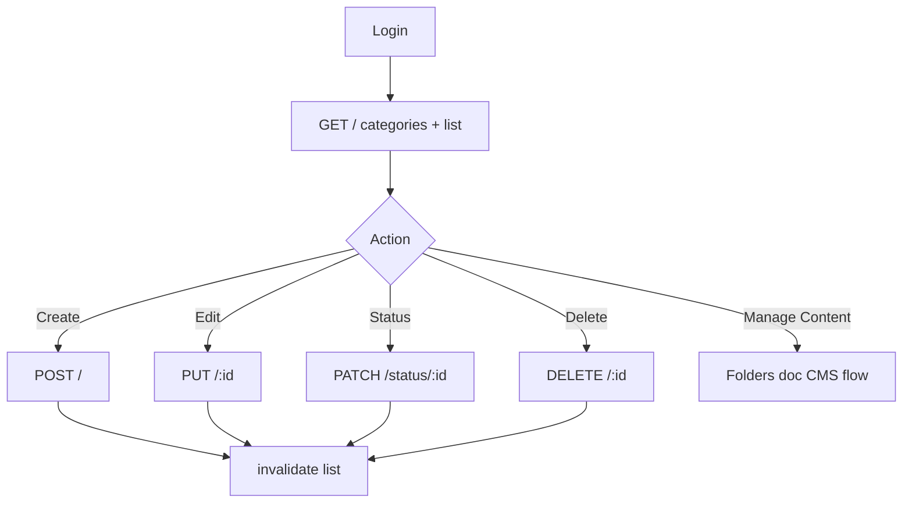

# Academics → Faculty Subjects — CRUD Frontend Integration

**Base path:** `{VITE_API_BASE_URL}/api/faculty-subjects`

**Auth:** Super Admin — `Authorization: Bearer <token>`

**Related docs:** [Index](./ACADEMICS_FACULTY_SUBJECTS_FRONTEND_INTEGRATION_README.md) · [Subject Content Folders](./ACADEMICS_SUBJECT_CONTENT_FOLDERS_FRONTEND_INTEGRATION_README.md) · [Shared](./ACADEMICS_FACULTY_SUBJECTS_SHARED_FRONTEND_INTEGRATION_README.md)

This document covers **Faculty Subject list and CRUD only**. Folder/CMS endpoints are in the Folders doc.

---

## 1. Module overview

A **Faculty Subject** binds:

- One **Subject** (`subjectId`)
- One **Teacher** (`teacherId`)
- Optional **Topics** (`topicIds[]`)
- One or more **delivery categories** (`categories[]`)
- Display name (`subjectName`)
- Status: `ACTIVE` | `INACTIVE`
- Code: `facultySubjectId` (e.g. `FSU001`)

Batches link via `Batch.facultySubjects[]`.

---

## 2. API inventory (CRUD scope)

Mount: `app.use('/api/faculty-subjects', ...superAdminAuth, facultySubjectRoutes)`

| # | Method | Endpoint | Purpose |
|---|--------|----------|---------|
| 1 | `GET` | `/create-form` | Form dropdowns |
| 2 | `GET` | `/categories` | Delivery category options |
| 3 | `GET` / `POST` | `/dropdown` | Lightweight picker |
| 4 | `GET` | `/summary/:id` | Minimal single record |
| 5 | `PATCH` | `/status/:id` | Status toggle |
| 6 | `POST` | `/` | Create |
| 7 | `GET` | `/` | Paginated list |
| 8 | `GET` | `/:id` | Full detail |
| 9 | `PUT` | `/:id` | Update |
| 10 | `DELETE` | `/:id` | Hard delete + cascade |

---

## 3. User flow — list page

```text
POST /api/auth/login-super-admin
        ↓
GET /api/faculty-subjects/categories (cache)
GET /api/faculty-subjects?page=1&limit=10
        ↓
Search (debounce 300ms) → ?search= or ?q=
Filter status/category → refetch
Pagination/sort → refetch
        ↓
Add: GET /create-form → select subject → GET /create-form?subjectId=
     → POST /api/faculty-subjects
Edit: GET /:id → PUT /:id
Status: PATCH /status/:id
Delete: DELETE /:id (handle 409 batch link)
        ↓
Manage Content → FacultySubjectContentPage (Folders doc)
```

No bulk delete or bulk status endpoints — loop per row if needed.

---

## 4. Endpoint reference

### 4.1 GET `/api/faculty-subjects` — List

| Property | Value |
|----------|-------|
| **Purpose** | Paginated list with search, filters, sort |
| **Authentication** | Super Admin |

**Query parameters**

| Param | Default | Validation |
|-------|---------|------------|
| `search` / `q` | `""` | Regex on `subjectName` |
| `status` | — | `ACTIVE` or `INACTIVE` |
| `category` | — | Must match `FACULTY_CATEGORIES` value |
| `page` | `1` | ≥ 1 |
| `limit` | `10` | 1–100 |
| `sortBy` | `createdAt` | `createdAt`, `subjectName`, `facultySubjectId`, `status` |
| `sortOrder` | `desc` | `asc` or `desc` |

**Success — `200 OK`**

```json
{
  "success": true,
  "total": 42,
  "page": 1,
  "limit": 10,
  "totalPages": 5,
  "count": 10,
  "data": [
    {
      "_id": "674a1b2c3d4e5f6789012345",
      "facultySubjectId": "FSU001",
      "subjectName": "Indian Polity – Live & Test",
      "subject": "674a1b2c3d4e5f6789012340",
      "teacher": "674a1b2c3d4e5f6789012341",
      "teacherDetails": {
        "_id": "674a1b2c3d4e5f6789012341",
        "teacherId": "TCH001",
        "teacherName": "Dr Rajesh Kumar",
        "centerId": "674a1b2c3d4e5f6789012342"
      },
      "topics": [
        { "_id": "674a...", "topicId": "TOP001", "topicName": "Fundamental Rights" }
      ],
      "categories": ["LIVE_CLASS", "PRELIMS_TEST"],
      "status": "ACTIVE",
      "createdAt": "2026-06-26T10:00:00.000Z",
      "updatedAt": "2026-06-26T10:00:00.000Z"
    }
  ]
}
```

**Errors:** `401`, `403`, `500`

---

### 4.2 GET `/api/faculty-subjects/:id` — Detail

| Property | Value |
|----------|-------|
| **Path param** | Mongo `_id` **only** (not `FSU###` code) |

**Success:** `{ "success": true, "data": { ...formatFacultySubject } }`

**Errors:** `404`, `401`, `403`, `500`

---

### 4.3 POST `/api/faculty-subjects` — Create

**Request body**

| Field | Required | Validation |
|-------|----------|------------|
| `subjectName` | **Yes** | Non-empty trimmed string |
| `subjectId` | **Yes** | Valid ACTIVE Subject ObjectId |
| `teacherId` | **Yes** | Valid ACTIVE Teacher ObjectId |
| `topicIds` | No | Each valid; must belong to subject |
| `categories` | **Yes** | Min 1; enum values |
| `status` | No | `ACTIVE` (default) or `INACTIVE` |

**Success — `201 Created`**

```json
{
  "success": true,
  "message": "FacultySubject created successfully",
  "data": { "...formatFacultySubject" }
}
```

**Errors:** `400` validation · `500`

---

### 4.4 PUT `/api/faculty-subjects/:id` — Update

Partial body — omitted fields keep existing values. Same validation as create.

**Success — `200 OK`:** `{ "success": true, "message": "FacultySubject updated successfully", "data": {...} }`

**Errors:** `400`, `404`, `500`

---

### 4.5 PATCH `/api/faculty-subjects/status/:id`

**Body:** `{ "status": "ACTIVE" | "INACTIVE" }` (required)

**Errors:** `400` invalid status · `404`

---

### 4.6 DELETE `/api/faculty-subjects/:id`

| Property | Value |
|----------|-------|
| **Path param** | Mongo `_id` **or** `facultySubjectId` code |
| **Type** | Hard delete with cascade |

**Cascade:** folders, live classes, recordings, PDFs, prelims tests, mains AW, activity logs.

**Success — `200 OK`**

```json
{
  "success": true,
  "message": "FacultySubject permanently deleted",
  "data": { "_id": "...", "facultySubjectId": "FSU001", "subjectName": "..." }
}
```

**Errors**

| Code | Message |
|------|---------|
| `404` | FacultySubject not found |
| `409` | `Cannot delete faculty subject linked to N batch(es). Remove it from batches first.` |

---

### 4.7 GET `/api/faculty-subjects/create-form`

| Query | Effect |
|-------|--------|
| *(none)* | `subjects[]` only |
| `subjectId` | Also `topics[]`, `teachers[]`, `selectedSubject` |
| `centerId` | With `subjectId`, filters teachers by center |

**Errors:** `400` Invalid or inactive subject

**Loading order:** Step 1 without `subjectId` → Step 2 with `subjectId` on subject select.

---

### 4.8 GET `/api/faculty-subjects/categories`

```json
{
  "success": true,
  "message": "Faculty subject categories loaded",
  "data": [
    { "value": "LIVE_CLASS", "label": "Live Class" },
    { "value": "RECORDING", "label": "Recording" },
    { "value": "PRELIMS_TEST", "label": "Prelims Test" },
    { "value": "MAINS_ANSWER_WRITING", "label": "Mains Answer Writing" },
    { "value": "PDF", "label": "PDF" }
  ]
}
```

---

### 4.9 GET / POST `/api/faculty-subjects/dropdown`

| Param | Default | Notes |
|-------|---------|-------|
| `search` | `""` | Regex on `subjectName` |
| `status` | `ACTIVE` | `ACTIVE` or `INACTIVE` |
| `category` | — | Filter by delivery category |
| `page` | `1` | |
| `limit` | `100` | Max 200 |

**Response item:** `{ _id, facultySubjectId, subjectName, teacherName }`

---

### 4.10 GET `/api/faculty-subjects/summary/:id`

**Path:** Mongo `_id` or `facultySubjectId` code.

**Response:** `{ _id, facultySubjectId, subjectName, teacherName }`

---

## 5. Service layer

```typescript
// src/services/facultySubjectService.ts
import api from './api';

const BASE = '/api/faculty-subjects';

export const facultySubjectService = {
  getFacultySubjects: (params) => api.get(BASE, { params }),
  getFacultySubject: (id: string) => api.get(`${BASE}/${id}`),
  createFacultySubject: (payload) => api.post(BASE, payload),
  updateFacultySubject: (id: string, payload) => api.put(`${BASE}/${id}`, payload),
  deleteFacultySubject: (id: string) => api.delete(`${BASE}/${id}`),
  changeStatus: (id: string, status: 'ACTIVE' | 'INACTIVE') =>
    api.patch(`${BASE}/status/${id}`, { status }),
  getCreateForm: (params?: { subjectId?: string; centerId?: string }) =>
    api.get(`${BASE}/create-form`, { params }),
  getCategories: () => api.get(`${BASE}/categories`),
  getDropdown: (params?) => api.get(`${BASE}/dropdown`, { params }),
  getSummary: (id: string) => api.get(`${BASE}/summary/${id}`),
};
```

CMS methods (`getContentTree`, `createFolder`, etc.) live in services used by the [Folders doc](./ACADEMICS_SUBJECT_CONTENT_FOLDERS_FRONTEND_INTEGRATION_README.md).

---

## 6. React Query

### Query keys

```typescript
export const facultySubjectKeys = {
  all: ['facultySubjects'] as const,
  lists: () => [...facultySubjectKeys.all, 'list'] as const,
  list: (params) => [...facultySubjectKeys.lists(), params] as const,
  detail: (id: string) => [...facultySubjectKeys.all, 'detail', id] as const,
  categories: () => [...facultySubjectKeys.all, 'categories'] as const,
  createForm: (subjectId?: string, centerId?: string) =>
    [...facultySubjectKeys.all, 'createForm', { subjectId, centerId }] as const,
  dropdown: (params) => [...facultySubjectKeys.all, 'dropdown', params] as const,
};
```

### Hooks

| Hook | Type | staleTime | Invalidate on |
|------|------|-----------|---------------|
| `useFacultySubjects(params)` | `useQuery` | `0` | create/update/delete/status |
| `useFacultySubject(id)` | `useQuery` | `30_000` | update/delete |
| `useFacultySubjectCategories()` | `useQuery` | `Infinity` | — |
| `useFacultySubjectCreateForm(subjectId?)` | `useQuery` | `60_000` | — |
| `useCreateFacultySubject()` | `useMutation` | — | lists + dropdown |
| `useUpdateFacultySubject()` | `useMutation` | — | lists + detail |
| `useDeleteFacultySubject()` | `useMutation` | — | lists |
| `useToggleFacultySubjectStatus()` | `useMutation` | — | lists |

### Optimistic update (status toggle)

Safe for `PATCH /status/:id` — rollback on error, invalidate on settle.

---

## 7. UI mapping

| UI element | Backend |
|------------|---------|
| Search | `?search=` (debounce 300ms, reset page to 1) |
| Status filter | `?status=ACTIVE\|INACTIVE` |
| Category filter | `?category=LIVE_CLASS` |
| Pagination | `?page=` & `?limit=` (max 100) |
| Sort | `?sortBy=` & `?sortOrder=` |
| Add button | `GET /create-form` + `GET /categories` |
| Subject select | `GET /create-form?subjectId=` |
| Create submit | `POST /` |
| Edit | `GET /:id` (if needed) → `PUT /:id` |
| Status toggle | `PATCH /status/:id` |
| Delete | `DELETE /:id` — show `409` message |
| Batch picker (other modules) | `GET /dropdown?status=ACTIVE` |

**No server-side faculty name filter** — filter client-side on `teacherDetails.teacherName` if needed.

---

## 8. Form validation

### Required on create

| Field | API key |
|-------|---------|
| Faculty Subject Name | `subjectName` |
| Master Subject | `subjectId` |
| Faculty / Teacher | `teacherId` |
| Delivery Categories | `categories` (≥ 1) |

### Do not send on create

`facultySubjectId`, `_id` — server-generated.

### Backend validation messages

| Condition | `message` |
|-----------|-----------|
| Missing name | `subjectName is required` |
| Invalid subject | `Invalid subject id` / `Invalid or inactive subject` |
| Invalid teacher | `Invalid faculty id` / `Invalid or inactive faculty` |
| Invalid topic | `Invalid topic id in topics array` |
| No categories | `At least one category is required` |
| Invalid category | `Invalid categories. Allowed: LIVE_CLASS, RECORDING, ...` |
| Invalid status | `status must be ACTIVE or INACTIVE` |

---

## 9. Flow diagram



---

## 10. Types

```typescript
type FacultyCategory =
  | 'LIVE_CLASS'
  | 'RECORDING'
  | 'PRELIMS_TEST'
  | 'MAINS_ANSWER_WRITING'
  | 'PDF';

interface FacultySubject {
  _id: string;
  facultySubjectId: string;
  subjectName: string;
  subject: string;
  teacher: string;
  teacherDetails?: {
    _id: string;
    teacherId: string;
    teacherName: string;
    centerId: string;
  };
  topics: Array<{ _id: string; topicId: string; topicName: string }>;
  categories: FacultyCategory[];
  status: 'ACTIVE' | 'INACTIVE';
  createdAt: string;
  updatedAt: string;
}
```

---

## Integration checklist

- [ ] List with pagination
- [ ] Search (`search` / `q`)
- [ ] Status filter
- [ ] Category filter
- [ ] Sorting
- [ ] Create with create-form two-step dropdowns
- [ ] Update
- [ ] Delete with `409` batch-link handling
- [ ] Status toggle
- [ ] Categories multi-select
- [ ] Dropdown for other modules
- [ ] React Query keys + invalidation
- [ ] Loading / empty / error states

---

## Backend files

| File | Role |
|------|------|
| `routes/facultySubjectRoutes.js` | Route definitions |
| `controllers/facultySubjectController.js` | Handlers |
| `models/FacultySubject.js` | Schema |
| `services/facultySubjectDeleteService.js` | Hard delete + batch guard |
| `utils/batchFacultyHelpers.js` | `validateFacultySubjectPayload` |
| `utils/batchFacultyConstants.js` | Category enums |

---

*CRUD doc aligned with `facultySubjectController.js` and `facultySubjectRoutes.js`.*
