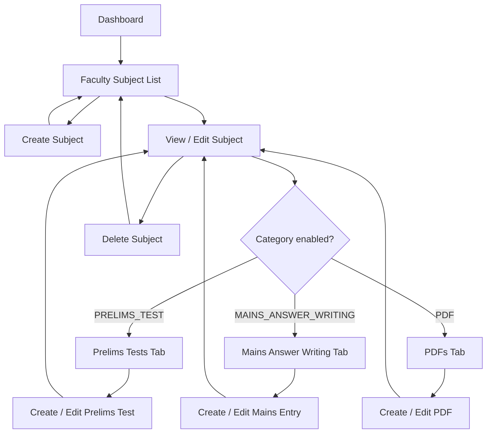
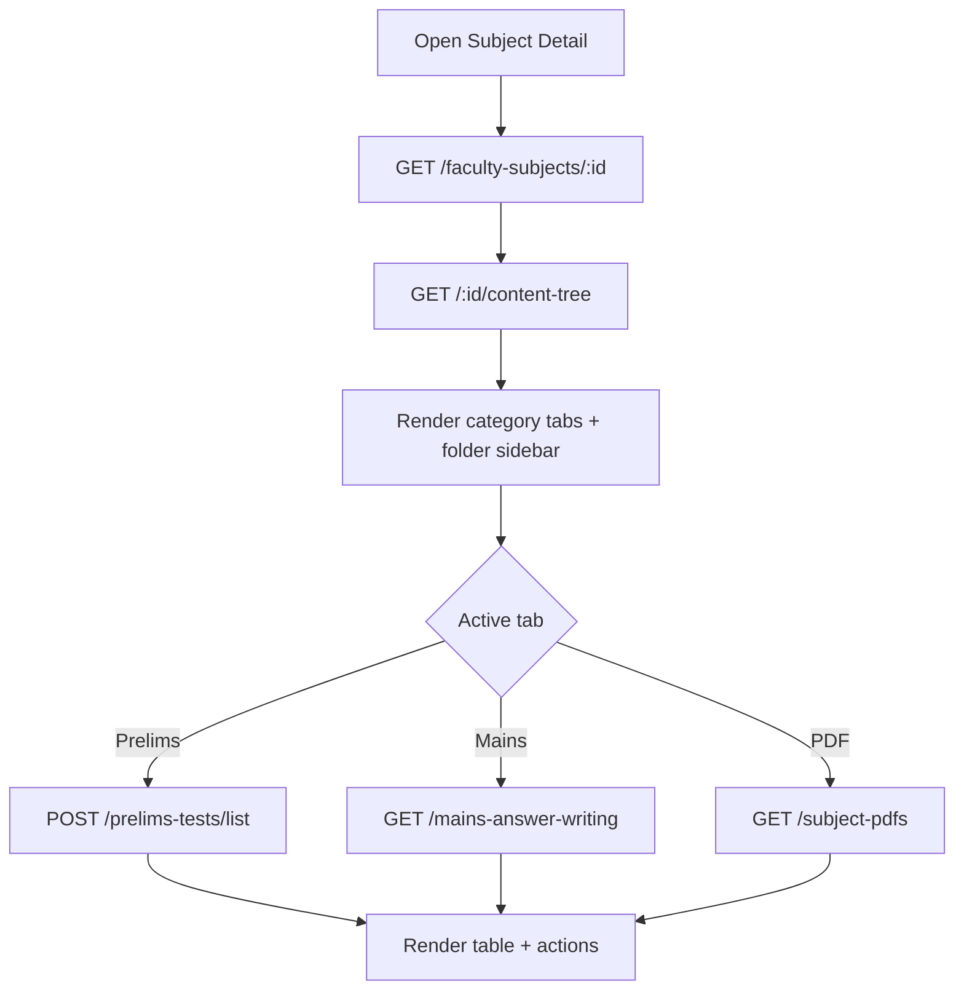
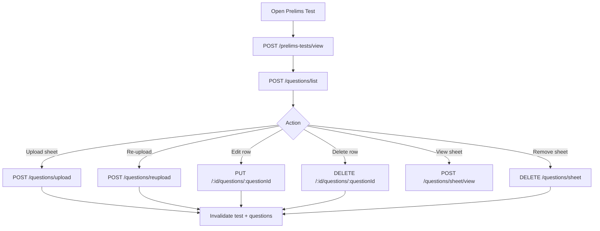
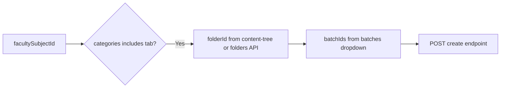

# Academics → Faculty Subjects — Complete Frontend Integration Guide

**Audience:** Frontend engineers implementing the Super Admin **Faculty Subjects** section (list, CRUD, and child content tabs).

**Backend source of truth:** This document is derived entirely from the current backend implementation. Do not invent routes, payloads, or enums beyond what is documented here.

**Base URL:** `{VITE_API_BASE_URL}/api`

**Authentication (all endpoints in this guide):** Super Admin — `Authorization: Bearer <JWT>`

| Middleware | Applied on |
|------------|------------|
| `protect` + `requireSuperAdmin` | `/api/faculty-subjects`, `/api/subject-pdfs`, `/api/prelims-tests` |
| `protect` + `requireSuperAdmin` (inside router) | `/api/mains-answer-writing` CMS routes only |

**401:** Missing/invalid token — `{ success: false, message: "Not authorized, no token" }`  
**403:** Authenticated but not Super Admin — `{ success: false, message: "Access denied. Super Admin only." }`

---

## Table of contents

1. [Resource hierarchy](#1-resource-hierarchy)
2. [Shared enums and constants](#2-shared-enums-and-constants)
3. [Module 1 — Faculty Subjects](#3-module-1--faculty-subjects)
4. [Module 2 — Subject Prelims Tests](#4-module-2--subject-prelims-tests)
5. [Module 3 — Subject Mains Answer Writings](#5-module-3--subject-mains-answer-writings)
6. [Module 4 — Subject PDFs](#6-module-4--subject-pdfs)
7. [Frontend data flow](#7-frontend-data-flow)
8. [Screen flow (Mermaid)](#8-screen-flow-mermaid)
9. [API dependency flow](#9-api-dependency-flow)
10. [Frontend folder structure](#10-frontend-folder-structure)
11. [Service layer mapping](#11-service-layer-mapping)
12. [React Query mapping](#12-react-query-mapping)
13. [Axios integration](#13-axios-integration)
14. [UI state flow](#14-ui-state-flow)
15. [Validation reference](#15-validation-reference)
16. [File uploads](#16-file-uploads)
17. [Table integration](#17-table-integration)
18. [Integration checklist](#18-integration-checklist)

---

## 1. Resource hierarchy

Faculty Subjects are the **parent**. Child content is **not nested under `/api/faculty-subjects/:id/...`** — each child module has its own top-level route and references `facultySubjectId` + `folderId`.

```text
FacultySubject (_id, facultySubjectId)
├── categories[]  → enables content tabs (PRELIMS_TEST, MAINS_ANSWER_WRITING, PDF, …)
├── SubjectContentFolder (per category)  → folderId
│   ├── SubjectPrelimsTest      → facultySubjectId + folderId + batchIds[]
│   ├── SubjectMainsAnswerWriting → facultySubjectId + folderId + batchIds[] + topicId?
│   └── SubjectPdf              → facultySubjectId + folderId + batchIds[]
└── Batch.facultySubjects[]     → link enforced on create; blocks hard delete if linked
```

**Category → tab mapping**

| Category value | Admin tab | Child API base |
|----------------|-----------|----------------|
| `PRELIMS_TEST` | Prelims Tests | `/api/prelims-tests` |
| `MAINS_ANSWER_WRITING` | Mains Answer Writing | `/api/mains-answer-writing` |
| `PDF` | PDFs | `/api/subject-pdfs` |

A faculty subject must include the relevant category in `categories[]` before child content can be created for that tab.

**Supporting APIs (referenced by create forms, not owned by this module)**

| Purpose | Route |
|---------|-------|
| Content folders list | `GET /api/folders?facultySubjectId={id}&category={CATEGORY}` |
| Create folder | `POST /api/faculty-subjects/content/folders` |
| Batch picker | `POST /api/batches/dropdown` body `{ facultySubjectId }` |
| Test languages | `POST /api/test-configuration/languages/dropdown` |
| Exam patterns | `POST /api/test-configuration/exam-patterns/dropdown` |

---

## 2. Shared enums and constants

### Faculty subject categories (`categories[]`)

`LIVE_CLASS` | `RECORDING` | `PRELIMS_TEST` | `MAINS_ANSWER_WRITING` | `PDF`

Legacy alias: `TEST` → normalized to `PRELIMS_TEST`.

### Faculty subject status

`ACTIVE` | `INACTIVE`

### Publish status (Prelims Tests & Mains Answer Writing)

`DRAFT` | `PUBLISHED` | `UNPUBLISHED`

### PDF visibility (Subject PDFs)

`VISIBILITY` | `PUBLISHED` | `DRAFT` | `PRIVATE`

### Pagination (all list endpoints)

| Param | Default | Range |
|-------|---------|-------|
| `page` | `1` | ≥ 1 |
| `limit` | `10` | 1–100 (dropdown: up to 200) |
| `sortBy` | `createdAt` | Per-endpoint allowed fields |
| `sortOrder` | `desc` | `asc` or `desc` |

### Batch IDs in requests

Accept either:

- `batchIds`: array of Mongo `_id` strings, **or**
- `batchId`: single Mongo `_id` string

At least one batch is required on create for all child resources.

### Structured validation errors (child modules)

CMS child modules return structured 400/404 bodies:

```json
{
  "success": false,
  "errorCode": "FACULTY_SUBJECT_NOT_ACTIVE",
  "message": "Invalid or inactive faculty subject",
  "reason": "...",
  "field": "facultySubjectId",
  "httpStatus": 400,
  "suggestions": ["..."]
}
```

Faculty Subject CRUD uses simpler `{ success: false, message: "..." }` for most 400s.

---

## 3. Module 1 — Faculty Subjects

**Base route:** `/api/faculty-subjects`  
**Mount:** `app.use('/api/faculty-subjects', ...superAdminAuth, facultySubjectRoutes)`

### 3.1 GET `/api/faculty-subjects` — List

| | |
|---|---|
| **Method** | GET |
| **Auth** | Super Admin, Bearer token |
| **Content-Type** | `application/json` |

**Query parameters**

| Param | Required | Description |
|-------|----------|-------------|
| `search` / `q` | No | Case-insensitive regex on `subjectName` |
| `status` | No | `ACTIVE` or `INACTIVE` |
| `category` | No | Filter subjects that include this delivery category |
| `page` | No | Default `1` |
| `limit` | No | Default `10`, max `100` |
| `sortBy` | No | `createdAt`, `subjectName`, `facultySubjectId`, `status` |
| `sortOrder` | No | `asc` or `desc` |

**Response `200`**

```json
{
  "success": true,
  "total": 42,
  "page": 1,
  "limit": 10,
  "totalPages": 5,
  "count": 10,
  "data": [
    {
      "_id": "665a1b2c3d4e5f6789012345",
      "facultySubjectId": "FSU001",
      "subjectName": "Polity — Dr. Sharma",
      "subject": "665a00000000000000000001",
      "teacher": "665a00000000000000000002",
      "teacherDetails": {
        "_id": "665a00000000000000000002",
        "teacherId": "TCH001",
        "teacherName": "Dr. Sharma",
        "centerId": "665a00000000000000000003"
      },
      "topics": [
        { "_id": "665a00000000000000000004", "topicId": "TOP001", "topicName": "Constitution" }
      ],
      "categories": ["PRELIMS_TEST", "PDF"],
      "status": "ACTIVE",
      "createdAt": "2026-01-15T10:00:00.000Z",
      "updatedAt": "2026-01-15T10:00:00.000Z"
    }
  ]
}
```

---

### 3.2 POST `/api/faculty-subjects` — Create

| | |
|---|---|
| **Method** | POST |
| **Content-Type** | `application/json` |

**Request body**

| Field | Required | Type | Validation |
|-------|----------|------|------------|
| `subjectName` | Yes | string | Non-empty trim |
| `subjectId` | Yes | ObjectId | Active, non-deleted Subject |
| `teacherId` | Yes | ObjectId | Active, non-deleted Teacher |
| `topicIds` | No | ObjectId[] | Each topic active and belongs to `subjectId` |
| `categories` | Yes | string[] | At least one valid category |
| `status` | No | string | `ACTIVE` (default) or `INACTIVE` |

**Example**

```json
{
  "subjectName": "Polity — Dr. Sharma",
  "subjectId": "665a00000000000000000001",
  "teacherId": "665a00000000000000000002",
  "topicIds": ["665a00000000000000000004"],
  "categories": ["PRELIMS_TEST", "MAINS_ANSWER_WRITING", "PDF"],
  "status": "ACTIVE"
}
```

**Response `201`**

```json
{
  "success": true,
  "message": "FacultySubject created successfully",
  "data": { /* same shape as list item */ }
}
```

`facultySubjectId` (e.g. `FSU001`) is auto-generated server-side.

---

### 3.3 GET `/api/faculty-subjects/:id` — Get by ID

**Path param:** `id` — FacultySubject Mongo `_id`

**Response `200`:** `{ success: true, data: { /* full faculty subject */ } }`  
**Response `404`:** `{ success: false, message: "FacultySubject not found" }`

---

### 3.4 PUT `/api/faculty-subjects/:id` — Update

Partial update supported — only send changed fields.

| Field | Required | Notes |
|-------|----------|-------|
| `subjectName` | No | Non-empty if sent |
| `subjectId` | No | Re-validates subject |
| `teacherId` | No | Re-validates teacher |
| `topicIds` | No | Replaces entire topics array |
| `categories` | No | Re-validates categories |
| `status` | No | `ACTIVE` or `INACTIVE` |

**Response `200`:** `{ success: true, message: "FacultySubject updated successfully", data: { ... } }`

---

### 3.5 PATCH `/api/faculty-subjects/status/:id` — Update status only

**Request body**

```json
{ "status": "INACTIVE" }
```

Must be exactly `ACTIVE` or `INACTIVE`.

**Response `200`:** `{ success: true, message: "FacultySubject status updated", data: { ... } }`

---

### 3.6 DELETE `/api/faculty-subjects/:id` — Hard delete (cascade)

Permanently deletes the faculty subject and **all** linked content (folders, prelims tests, mains entries, PDFs, live classes, recordings, submissions, etc.).

**Response `200`**

```json
{
  "success": true,
  "message": "FacultySubject permanently deleted",
  "data": { "_id": "...", "facultySubjectId": "FSU001", "subjectName": "..." }
}
```

**Response `409`** — linked to batches:

```json
{
  "success": false,
  "message": "Cannot delete faculty subject linked to 3 batch(es). Remove it from batches first."
}
```

---

### 3.7 GET `/api/faculty-subjects/create-form` — Create/edit form dropdowns

**Query parameters**

| Param | Required | Behavior |
|-------|----------|----------|
| `subjectId` | No | Without: returns `subjects` only. With: adds `topics`, `teachers`, `selectedSubject` |
| `centerId` | No | When `subjectId` set, filters teachers by center |

**Response `200`**

```json
{
  "success": true,
  "message": "Form options loaded (subjects)",
  "data": {
    "subjects": [{ "_id": "...", "subjectId": "SUB001", "subjectName": "Polity" }],
    "topics": [],
    "teachers": [],
    "selectedSubject": null
  }
}
```

With `?subjectId=...`:

```json
{
  "data": {
    "subjects": [ /* all active subjects */ ],
    "topics": [{ "_id": "...", "topicId": "TOP001", "topicName": "Constitution" }],
    "teachers": [{
      "_id": "...", "teacherId": "TCH001", "teacherName": "Dr. Sharma",
      "centerId": "...", "centerName": "Delhi"
    }],
    "selectedSubject": { "_id": "...", "subjectId": "SUB001", "subjectName": "Polity" }
  }
}
```

---

### 3.8 GET `/api/faculty-subjects/categories` — Delivery category options

**Response `200`**

```json
{
  "success": true,
  "message": "Faculty subject categories loaded",
  "data": [
    { "value": "LIVE_CLASS", "label": "Live Class" },
    { "value": "PRELIMS_TEST", "label": "Prelims Test" },
    { "value": "MAINS_ANSWER_WRITING", "label": "Mains Answer Writing" },
    { "value": "PDF", "label": "PDF" }
  ]
}
```

---

### 3.9 GET or POST `/api/faculty-subjects/dropdown` — Lightweight picker

Used by child-module create forms. Accepts params via **query (GET)** or **body (POST)**.

| Param | Default | Description |
|-------|---------|-------------|
| `category` | — | Filter by delivery category (e.g. `PRELIMS_TEST`) |
| `search` | `""` | Regex on `subjectName` |
| `status` | `ACTIVE` | `ACTIVE` or `INACTIVE` |
| `page` | `1` | |
| `limit` | `100` | Max `200` |

**Response `200`**

```json
{
  "success": true,
  "count": 5,
  "total": 5,
  "page": 1,
  "limit": 100,
  "totalPages": 1,
  "data": [
    {
      "_id": "665a1b2c3d4e5f6789012345",
      "facultySubjectId": "FSU001",
      "subjectName": "Polity — Dr. Sharma",
      "teacherName": "Dr. Sharma"
    }
  ]
}
```

---

### 3.10 GET `/api/faculty-subjects/summary/:id` — Minimal single record

**Path param:** `id` — Mongo `_id` **or** `facultySubjectId` code (e.g. `FSU001`)

**Response `200`:** `{ success: true, data: { _id, facultySubjectId, subjectName, teacherName } }`

---

### 3.11 GET `/api/faculty-subjects/:id/content-tree` — Left nav content tree

**Path param:** `id` — Mongo `_id` or `facultySubjectId` code

**Response `200`**

```json
{
  "success": true,
  "facultySubjectId": "665a1b2c3d4e5f6789012345",
  "subjectName": "Polity — Dr. Sharma",
  "categories": ["PRELIMS_TEST", "PDF"],
  "data": {
    "PRELIMS_TEST": [
      { "_id": "...", "folderId": "FLD001", "folderName": "Mock Tests" }
    ],
    "MAINS_ANSWER_WRITING": [],
    "PDF": [],
    "LIVE_CLASS": [],
    "RECORDING": []
  }
}
```

---

### 3.12 POST `/api/faculty-subjects/content/categories` — List content in a category tab

**Request body**

| Field | Required | Description |
|-------|----------|-------------|
| `facultySubjectId` | Yes | Mongo `_id` |
| `category` | Yes | e.g. `PRELIMS_TEST` |
| `folderId` | No | Filter to one folder |
| `page`, `limit`, `sortBy`, `sortOrder` | No | Pagination |

**Response `200`:** Returns folder list + paginated content items for the category (delegates to `listContentCategories` service). Use this on the **Subject detail → category tab** view to render folder sidebar + content table without calling each child list API separately when browsing by folder.

---

### 3.13 POST `/api/faculty-subjects/content/folders` — Create folder

**Request body:** `{ facultySubjectId, folderName, category }`  
Category must match an enabled faculty-subject category.

---

### 3.14 PUT `/api/faculty-subjects/content/folders/:id` — Update folder

**Path param:** `id` — folder Mongo `_id`  
**Body:** `{ folderName?, status? }` — `status`: `ACTIVE` | `INACTIVE`

---

## 4. Module 2 — Subject Prelims Tests

**Base route:** `/api/prelims-tests`  
**Mount:** `app.use('/api/prelims-tests', ...superAdminAuth, subjectPrelimsTestRoutes)`

> **Important:** Most **read** operations use **POST with JSON body** (not GET query strings). Only create/update/delete/publish use path params as documented.

### 4.1 POST `/api/prelims-tests/create-form` — Create form metadata

**Request body (optional)**

```json
{
  "facultySubjectId": "665a1b2c3d4e5f6789012345",
  "folderId": "665a1b2c3d4e5f6789012346"
}
```

When `facultySubjectId` is provided, response includes `facultySubject`, `folders`, `batches`, and optionally `selectedFolder`.

**Response `200` — key fields in `data`**

| Key | Purpose |
|-----|---------|
| `defaults` | Default values for new test |
| `enums.publishStatuses` | `DRAFT`, `PUBLISHED`, `UNPUBLISHED` |
| `enums.durationMinutesPresets` | `[30, 60, 90, 120, 180]` |
| `enums.negativeMarkingPresets` | `0.25`, `0.50`, `1.00`, `CUSTOM` |
| `enums.attemptRestrictionTypes` | `LIFETIME`, `DAILY`, `WEEKLY` |
| `enums.duplicateModes` | `SKIP`, `REPLACE`, `ALLOW` |
| `enums.reuploadModes` | `REPLACE_ALL`, `MERGE`, `REPLACE` |
| `allowedUpload` | File field rules (see [File uploads](#16-file-uploads)) |
| `dependencyFlow` | Ordered API steps for the form |
| `dropdownApis` | Paths for faculty subjects, folders, batches, languages, exam patterns |
| `listFilters` | Documented filter fields for list API |

---

### 4.2 POST `/api/prelims-tests/dashboard-summary` — Dashboard counts

**Request body (optional filters)**

```json
{
  "facultySubjectId": "665a1b2c3d4e5f6789012345",
  "folderId": "665a1b2c3d4e5f6789012346"
}
```

**Response `200`**

```json
{
  "success": true,
  "data": {
    "totalTests": 12,
    "publishedCount": 8,
    "draftCount": 3,
    "unpublishedCount": 1,
    "totalQuestions": 450
  }
}
```

---

### 4.3 POST `/api/prelims-tests/list` — Paginated list

**Request body**

| Field | Required | Description |
|-------|----------|-------------|
| `facultySubjectId` | No | Filter by faculty subject |
| `folderId` | No | Filter by folder |
| `batchId` | No | Match any assigned `batchIds[]` |
| `language` | No | Tests containing this language |
| `publishStatus` | No | `DRAFT`, `PUBLISHED`, `UNPUBLISHED` |
| `search` | No | Matches `testName`, `prelimsTestId` |
| `scheduleDateFrom` | No | ISO date, `scheduleDate >=` |
| `scheduleDateTo` | No | ISO date, `scheduleDate <=` |
| `page`, `limit`, `sortBy`, `sortOrder` | No | Pagination |

**Sort fields:** `createdAt`, `testName`, `prelimsTestId`, `scheduleDate`, `resultDate`, `totalQuestions`

**Response `200`**

```json
{
  "success": true,
  "total": 12,
  "page": 1,
  "limit": 10,
  "totalPages": 2,
  "count": 10,
  "data": [
    {
      "_id": "665b...",
      "prelimsTestId": "SPT001",
      "facultySubjectId": "665a...",
      "folderId": "665c...",
      "batchIds": ["665d..."],
      "batches": [{ "_id": "665d...", "batchId": "BAT001", "batchName": "GS Batch A" }],
      "assignedBatches": [ /* same as batches */ ],
      "batchNamesLabel": "GS Batch A (+1 More)",
      "testName": "Polity Mock 1",
      "languages": ["English", "Hindi"],
      "durationPreset": "60",
      "durationMinutes": 60,
      "durationLabel": "1 hr",
      "totalMarks": 100,
      "marksPerCorrectAnswer": 2,
      "negativeMarking": { "enabled": true, "preset": "0.25", "value": 0.5 },
      "scheduleDate": "2026-07-01T00:00:00.000Z",
      "scheduleTime": "10:00",
      "resultDate": "2026-07-02T00:00:00.000Z",
      "rankingEnabled": false,
      "examPatternId": null,
      "instructionsHtml": "",
      "attemptSettings": {
        "enabled": false,
        "attempts": 1,
        "restrictionType": "LIFETIME",
        "showRemainingAttempts": false
      },
      "shuffleQuestions": false,
      "shuffleOptions": false,
      "totalQuestions": 50,
      "languageStats": [
        {
          "language": "English",
          "questionCount": 50,
          "uploadFile": {
            "url": "https://...",
            "publicId": "...",
            "viewUrl": "https://...",
            "downloadUrl": "https://..."
          }
        }
      ],
      "publishStatus": "DRAFT",
      "folderName": "Mock Tests",
      "facultySubjectName": "Polity — Dr. Sharma",
      "createdAt": "...",
      "updatedAt": "..."
    }
  ]
}
```

---

### 4.4 POST `/api/prelims-tests/view` — Get single test

**Request body**

```json
{ "id": "665b1b2c3d4e5f6789012345" }
```

Also accepts `prelimsTestId` field name.

**Response `200`:** `{ success: true, data: { /* test row + optional examPattern */ } }`

When `examPatternId` is set, `data.examPattern`:

```json
{
  "instructionId": "EP001",
  "instructionDescription": "..."
}
```

---

### 4.5 POST `/api/prelims-tests` — Create (multipart)

**Content-Type:** `multipart/form-data`

**Required metadata fields**

| Field | Required | Validation |
|-------|----------|------------|
| `facultySubjectId` | Yes | Active FS with `PRELIMS_TEST` category |
| `folderId` | Yes | Active folder for FS + `PRELIMS_TEST` |
| `batchIds` | Yes | ≥1 active/upcoming batch |
| `testName` | Yes | Non-empty |
| `languages` | Yes | JSON array string or array; each language active in test config |
| `scheduleDate` | Yes | Valid date |
| `scheduleTime` | Yes | `HH:mm` or `HH:mm:ss` |
| `durationMinutes` | Yes | Positive integer; presets 30/60/90/120/180 auto-set `durationPreset` |
| `totalMarks` | Yes | ≥ 1 |
| `marksPerCorrectAnswer` | Yes | ≥ 0 |
| `resultDate` | Yes | ≥ `scheduleDate` |
| `questionFile` | Yes | One sheet per selected language (see uploads) |

**Optional fields**

| Field | Default | Notes |
|-------|---------|-------|
| `publishStatus` | `DRAFT` | `PUBLISHED` requires questions for all languages |
| `duplicateMode` | `SKIP` | `SKIP`, `REPLACE`, `ALLOW` |
| `negativeMarking` | `{ enabled: false, preset: "0.25", value: 0 }` | JSON string in form |
| `attemptSettings` | see defaults | JSON string in form |
| `rankingEnabled` | `false` | |
| `examPatternId` | `null` | Active exam pattern ObjectId |
| `instructionsHtml` | `""` | |
| `shuffleQuestions` | `false` | |
| `shuffleOptions` | `false` | |

**Response `201`**

```json
{
  "success": true,
  "message": "Prelims test created with questions for all languages",
  "languageUploads": [
    {
      "language": "English",
      "sheetStats": { "totalRows": 50, "validRows": 50 },
      "uploadStats": { "inserted": 50, "replaced": 0, "skipped": 0 }
    }
  ],
  "data": { /* full test object */ }
}
```

On validation failure during create, the test is **rolled back** (soft-deleted).

---

### 4.6 PUT `/api/prelims-tests/:id` — Update metadata

**Content-Type:** `application/json`

Partial update — send only changed fields. Same validation as create (partial mode). Does **not** accept question file uploads; use question upload endpoints separately.

Removing a language soft-deletes its questions.

**Response `200`:** `{ success: true, message: "Prelims test updated successfully", data: { ... } }`

---

### 4.7 PATCH `/api/prelims-tests/:id/publish-status` — Publish toggle

**Request body**

```json
{ "publishStatus": "PUBLISHED" }
```

Publishing requires active questions for **every** configured language.

**Response `200`:** `{ success: true, message: "Publish status set to PUBLISHED", data: { ... } }`

---

### 4.8 DELETE `/api/prelims-tests/:id` — Soft delete

Soft-deletes test and all its questions.

**Response `200`:** `{ success: true, message: "Prelims test deleted successfully" }`

---

### 4.9 POST `/api/prelims-tests/:id/duplicate` — Duplicate as draft

**Request body (optional)**

```json
{ "testName": "Copy of Polity Mock 1" }
```

Default name: `Copy of {source.testName}`. Copies questions; upload file metadata is **not** copied. New test always `DRAFT`.

**Response `201`:** `{ success: true, message: "Prelims test duplicated as draft", data: { ... } }`

---

### 4.10 POST `/api/prelims-tests/questions/upload` — Upload questions

**Content-Type:** `multipart/form-data`

| Field | Required |
|-------|----------|
| `questionFile` | Yes — `.xlsx` or `.csv`, max 10 MB |
| `prelimsTestId` | Yes |
| `language` | Yes — must match a test language |
| `duplicateMode` | No — default `SKIP` |

**Response `200`**

```json
{
  "success": true,
  "message": "Questions uploaded successfully",
  "valid": true,
  "stats": { "totalRows": 50, "validRows": 50 },
  "uploadStats": { "inserted": 10, "replaced": 0, "skipped": 40 },
  "data": { /* updated test */ }
}
```

Sheet validation failure `400`:

```json
{
  "success": false,
  "message": "Question sheet validation failed",
  "valid": false,
  "errors": [{ "row": 5, "field": "correctAnswer", "message": "..." }],
  "stats": { ... }
}
```

---

### 4.11 POST `/api/prelims-tests/questions/reupload` — Re-upload questions

Same as upload plus:

| Field | Required | Values |
|-------|----------|--------|
| `reuploadMode` | No | `REPLACE_ALL` (wipe language), `MERGE` (skip dupes), `REPLACE` (replace dupes) |

---

### 4.12 POST `/api/prelims-tests/questions/list` — List questions

**Request body**

| Field | Required |
|-------|----------|
| `prelimsTestId` | Yes |
| `language` | No |
| `search` | No — regex on `questionText` |
| `page`, `limit` | No |

**Response `200`:** Paginated array of question documents sorted by `language`, `questionNo`.

**Question shape**

```json
{
  "_id": "...",
  "prelimsTestQuestionId": "SPQ001",
  "prelimsTestId": "...",
  "language": "English",
  "questionNo": 1,
  "questionText": "...",
  "option1": "...",
  "option2": "...",
  "option3": "...",
  "option4": "...",
  "correctAnswer": 2,
  "explanation": "...",
  "status": "ACTIVE"
}
```

---

### 4.13 POST `/api/prelims-tests/questions/view` — Get single question

**Body:** `{ "prelimsTestId": "...", "questionId": "..." }`

---

### 4.14 PUT `/api/prelims-tests/:id/questions/:questionId` — Update question

**Body (all optional):** `questionText`, `option1`–`option4`, `correctAnswer` (1–4), `explanation`

---

### 4.15 DELETE `/api/prelims-tests/:id/questions/:questionId` — Delete question

Soft-deletes question; syncs test `totalQuestions`.

---

### 4.16 POST `/api/prelims-tests/questions/sheet/view` — View uploaded sheet

**Body:** `{ "prelimsTestId": "...", "language": "English" }`

**Response `200`**

```json
{
  "success": true,
  "data": {
    "prelimsTestId": "...",
    "language": "English",
    "questionCount": 50,
    "uploadFile": { "url": "...", "viewUrl": "...", "downloadUrl": "..." },
    "viewUrl": "...",
    "downloadUrl": "...",
    "questionsCount": 50,
    "questions": [ /* full question array */ ]
  }
}
```

---

### 4.17 DELETE `/api/prelims-tests/questions/sheet` — Remove sheet + all questions for language

**Body:** `{ "prelimsTestId": "...", "language": "English" }`

Removes Cloudinary file and soft-deletes all questions for that language.

---

## 5. Module 3 — Subject Mains Answer Writings

**Base route:** `/api/mains-answer-writing`  
Super Admin CMS routes require `protect` + `requireSuperAdmin` (applied per-route inside the router).

> Student-facing routes (`/published`, `/my-submissions`, etc.) exist on the same base path but are **out of scope** for this admin integration guide.

### 5.1 GET `/api/mains-answer-writing/create-form` — Create form metadata

**Query:** `facultySubjectId`, `folderId` (optional)

Returns `defaults`, `enums`, `allowedUpload`, `dependencyFlow`, `dropdownApis`, `listFilters`, and when `facultySubjectId` is set: `facultySubject`, `folders`, `topics`, `batches`.

---

### 5.2 GET `/api/mains-answer-writing/dashboard-summary` — Dashboard counts

**Query (optional):** `facultySubjectId`, `folderId`

**Response `200`**

```json
{
  "success": true,
  "data": {
    "totalEntries": 8,
    "publishedCount": 5,
    "draftCount": 2,
    "unpublishedCount": 1
  }
}
```

---

### 5.3 GET `/api/mains-answer-writing` — Paginated list

**Query parameters**

| Param | Description |
|-------|-------------|
| `facultySubjectId` | Mongo `_id` |
| `folderId` | Folder filter |
| `batchId` | Match assigned batch |
| `topicId` | Topic Mongo `_id` |
| `topicName` | Partial topic name |
| `subjectId` | Master subject Mongo `_id` |
| `subjectName` | Partial faculty subject name |
| `publishStatus` | `DRAFT`, `PUBLISHED`, `UNPUBLISHED` |
| `search` | `testName`, folder, subject, topic |
| `page`, `limit`, `sortBy`, `sortOrder` | Pagination |

**Sort fields:** `createdAt`, `testName`, `mainsAnswerWritingId`, `scheduleDate`, `resultDate`

**Response row shape**

```json
{
  "_id": "...",
  "mainsAnswerWritingId": "SMAW001",
  "facultySubjectId": "...",
  "folderId": "...",
  "batchIds": ["..."],
  "batches": [{ "_id": "...", "batchId": "BAT001", "batchName": "GS Batch A" }],
  "batchNamesLabel": "GS Batch A",
  "topicId": "...",
  "topicName": "Constitution",
  "testName": "Essay Test 1",
  "scheduleDate": "2026-07-01T00:00:00.000Z",
  "durationPreset": "60",
  "durationMinutes": 60,
  "durationLabel": "1 hr",
  "totalMarks": 200,
  "resultDate": "2026-07-05T00:00:00.000Z",
  "questionsText": "Q1. Discuss...",
  "pdf": { "url": "https://...", "publicId": "...", "format": "pdf", "bytes": 102400 },
  "publishStatus": "DRAFT",
  "folderName": "Answer Writing",
  "facultySubjectName": "Polity — Dr. Sharma",
  "createdAt": "...",
  "updatedAt": "..."
}
```

Note: `passMarks` is stored but not included in list row format; available on detail/update responses via model.

---

### 5.4 GET `/api/mains-answer-writing/:id` — Get by ID

**Response `200`:** `{ success: true, data: { /* row + folderName, facultySubjectName, topicName */ } }`

---

### 5.5 POST `/api/mains-answer-writing` — Create

**Content-Type:** `multipart/form-data`

| Field | Required | Validation |
|-------|----------|------------|
| `pdf` | Yes | PDF only, max 20 MB |
| `facultySubjectId` | Yes | Active FS with `MAINS_ANSWER_WRITING` |
| `folderId` | Yes | Active folder for category |
| `batchIds` | Yes | ≥1 batch |
| `testName` | Yes | Non-empty |
| `scheduleDate` | Yes | Valid date |
| `durationPreset` | Yes | `30`, `60`, `90`, `120`, `180`, or `CUSTOM` |
| `durationMinutes` | Yes* | Required if `CUSTOM`; derived from preset otherwise |
| `totalMarks` | Yes | ≥ 1 |
| `resultDate` | Yes | ≥ `scheduleDate` |
| `questionsText` | Yes | Non-empty |
| `topicId` | No | Must belong to faculty subject topics |
| `passMarks` | No | ≥ 0, ≤ `totalMarks`; null = no pass marks |
| `publishStatus` | No | Default `DRAFT` |

**Response `201`:** `{ success: true, message: "Mains answer writing entry created successfully", data: { ... } }`

---

### 5.6 PUT `/api/mains-answer-writing/:id` — Update

**Content-Type:** `multipart/form-data` (if replacing PDF) or `application/json`

All create fields optional. New `pdf` file replaces existing (old Cloudinary asset deleted).

---

### 5.7 PATCH `/api/mains-answer-writing/:id/publish-status` — Publish toggle

**Body:** `{ "publishStatus": "PUBLISHED" }`

---

### 5.8 DELETE `/api/mains-answer-writing/:id` — Soft delete

Deletes Cloudinary PDF and soft-deletes record.

**Response `200`:** `{ success: true, message: "Mains answer writing entry deleted successfully", data: { _id } }`

---

### 5.9 GET `/api/mains-answer-writing/filter/subjects-dropdown` — Subjects filter

Faculty subjects with `MAINS_ANSWER_WRITING` category.

**Response `200`**

```json
{
  "success": true,
  "count": 3,
  "data": [
    {
      "_id": "...",
      "facultySubjectId": "FSU001",
      "subjectName": "Polity — Dr. Sharma",
      "masterSubjectId": "...",
      "masterSubjectName": "Polity"
    }
  ]
}
```

---

### 5.10 GET `/api/mains-answer-writing/filter/topics-dropdown` — Topics filter

**Query:** `facultySubjectId` (required)

**Response `200`**

```json
{
  "success": true,
  "facultySubject": { "_id": "...", "facultySubjectId": "FSU001", "subjectName": "..." },
  "count": 2,
  "data": [{ "_id": "...", "topicId": "TOP001", "topicName": "Constitution" }]
}
```

---

## 6. Module 4 — Subject PDFs

**Base route:** `/api/subject-pdfs`  
**Mount:** `app.use('/api/subject-pdfs', ...superAdminAuth, subjectPdfRoutes)`

### 6.1 GET `/api/subject-pdfs/create-form` — Create form metadata

**Query:** `facultySubjectId`, `folderId` (optional)

Returns `defaults`, `enums.visibility`, `allowedUpload`, `dependencyFlow`, `dropdownApis`, and scoped `folders`/`batches` when `facultySubjectId` provided.

---

### 6.2 GET `/api/subject-pdfs/dashboard-summary` — Dashboard counts

**Query (optional):** `facultySubjectId`, `folderId`, `batchId`

**Response `200`**

```json
{
  "success": true,
  "data": {
    "totalPdfs": 15,
    "totalViews": 320,
    "visibilityCount": 2,
    "publishedCount": 10,
    "draftCount": 2,
    "privateCount": 1
  }
}
```

---

### 6.3 GET `/api/subject-pdfs` — Paginated list

**Query parameters**

| Param | Description |
|-------|-------------|
| `facultySubjectId` | Mongo `_id` |
| `folderId` | Folder filter |
| `batchId` | Match assigned batch |
| `visibility` | `VISIBILITY`, `PUBLISHED`, `DRAFT`, `PRIVATE` |
| `search` | `pdfTitle`, folder name, subject name, batch name |
| `page`, `limit`, `sortBy`, `sortOrder` | Pagination |

**Sort fields:** `createdAt`, `pdfTitle`, `subjectPdfId`, `viewCount`

**Response row shape**

```json
{
  "_id": "...",
  "subjectPdfId": "SPD001",
  "facultySubjectId": "...",
  "folderId": "...",
  "batchIds": ["..."],
  "batches": [{ "_id": "...", "batchId": "BAT001", "batchName": "GS Batch A" }],
  "batchNamesLabel": "GS Batch A",
  "pdfTitle": "Polity Notes Ch. 1",
  "tags": ["notes", "polity"],
  "visibility": "PUBLISHED",
  "pdf": { "url": "https://...", "publicId": "...", "format": "pdf", "bytes": 512000 },
  "description": "Chapter 1 summary",
  "viewCount": 42,
  "folderName": "Study Material",
  "facultySubjectName": "Polity — Dr. Sharma",
  "createdAt": "...",
  "updatedAt": "..."
}
```

---

### 6.4 GET `/api/subject-pdfs/:id` — Get by ID

---

### 6.5 POST `/api/subject-pdfs` — Create

**Content-Type:** `multipart/form-data`

| Field | Required | Validation |
|-------|----------|------------|
| `pdf` | Yes | PDF only, max 10 MB |
| `facultySubjectId` | Yes | Active FS with `PDF` category |
| `folderId` | Yes | Active PDF folder |
| `batchIds` | Yes | ≥1 batch |
| `pdfTitle` | Yes | Non-empty |
| `visibility` | Yes | Valid visibility enum |
| `tags` | No | Array or JSON string |
| `description` | No | String |

**Response `201`:** `{ success: true, message: "PDF created successfully", data: { ... } }`

---

### 6.6 PUT `/api/subject-pdfs/:id` — Update

Multipart if replacing file; JSON otherwise. Optional `pdf` file replaces existing.

---

### 6.7 PATCH `/api/subject-pdfs/:id/visibility` — Visibility toggle

**Body:** `{ "visibility": "PUBLISHED" }`

---

### 6.8 POST `/api/subject-pdfs/:id/download` — Track download / get URL

Increments `viewCount` by 1.

**Response `200`**

```json
{
  "success": true,
  "data": {
    "subjectPdfId": "SPD001",
    "pdfTitle": "Polity Notes Ch. 1",
    "pdfUrl": "https://res.cloudinary.com/.../file.pdf",
    "viewCount": 43
  }
}
```

Use `pdfUrl` to open/download in the browser.

---

### 6.9 DELETE `/api/subject-pdfs/:id` — Soft delete

Deletes Cloudinary asset and soft-deletes record.

---

## 7. Frontend data flow

### 7.1 Faculty Subject list page load

```text
Login (Super Admin JWT)
        ↓
GET /api/faculty-subjects/categories        → cache enum labels
GET /api/faculty-subjects?page=1&limit=10   → render table
        ↓
User searches/filters/sorts                 → refetch list
User clicks row                             → navigate to detail
```

### 7.2 Create faculty subject

```text
GET /api/faculty-subjects/create-form
        ↓
User selects subject
GET /api/faculty-subjects/create-form?subjectId={id}&centerId={optional}
        ↓
Populate topics (multi-select) + teachers + categories checkboxes
        ↓
POST /api/faculty-subjects
        ↓
Invalidate facultySubjects list → redirect to detail or list
```

### 7.3 View faculty subject + content tabs

```text
GET /api/faculty-subjects/:id               → header (name, teacher, categories, status)
GET /api/faculty-subjects/:id/content-tree  → left folder nav per category
        ↓
User selects category tab (e.g. PRELIMS_TEST)
        ↓
Option A — unified CMS list:
  POST /api/faculty-subjects/content/categories
  { facultySubjectId, category, folderId?, page, limit }
        ↓
Option B — dedicated module list (recommended for full CRUD features):
  POST /api/prelims-tests/list { facultySubjectId, folderId?, ... }
  GET  /api/mains-answer-writing?facultySubjectId=...&folderId=...
  GET  /api/subject-pdfs?facultySubjectId=...&folderId=...
```

### 7.4 Create prelims test (within subject context)

```text
POST /api/prelims-tests/create-form { facultySubjectId, folderId? }
        ↓
Load dropdowns: batches (from response), languages, exam patterns
        ↓
User fills form + uploads questionFile per language
        ↓
POST /api/prelims-tests (multipart)
        ↓
Invalidate prelimsTests list + dashboard summary
```

### 7.5 Create mains answer writing

```text
GET /api/mains-answer-writing/create-form?facultySubjectId={id}
        ↓
Select folder, batches, topic, fill fields, attach pdf
        ↓
POST /api/mains-answer-writing (multipart)
        ↓
Invalidate mains list + dashboard summary
```

### 7.6 Create subject PDF

```text
GET /api/subject-pdfs/create-form?facultySubjectId={id}
        ↓
Select folder, batches, attach pdf, set visibility
        ↓
POST /api/subject-pdfs (multipart)
        ↓
Invalidate pdfs list + dashboard summary
```

### 7.7 Edit / delete / refresh pattern (all child modules)

```text
Load detail (GET or POST view)
        ↓
Edit → PUT (multipart if file change)
        ↓
Toggle publish/visibility → PATCH
        ↓
Delete → DELETE → confirm modal
        ↓
invalidateQueries + refetch list
```

---

## 8. Screen flow (Mermaid)

### 8.1 Top-level navigation



### 8.2 Subject detail — tab content load



### 8.3 Prelims test — question management



### 8.4 Create child content dependency chain



---

## 9. API dependency flow

### 9.1 IDs required across modules

| Step | ID obtained from | Used in |
|------|------------------|---------|
| 1 | Faculty subject list or dropdown | `facultySubjectId` on all child APIs |
| 2 | Content tree or folders API | `folderId` on child create/list |
| 3 | Batches dropdown | `batchIds[]` on child create |
| 4 | Prelims create-form | `languages[]`, `examPatternId` |
| 5 | Mains topics dropdown | `topicId` (optional) |
| 6 | Child create response | `_id` for edit/delete/publish |

### 9.2 Prelims test create — ordered calls

```text
1. POST /api/faculty-subjects/dropdown          { category: "PRELIMS_TEST" }
2. POST /api/folders/list OR GET /api/folders   { facultySubjectId, category: "PRELIMS_TEST" }
3. POST /api/batches/dropdown                   { facultySubjectId }
4. POST /api/test-configuration/languages/dropdown
5. POST /api/test-configuration/exam-patterns/dropdown
6. POST /api/prelims-tests/create-form          { facultySubjectId, folderId? }  ← validate selections
7. POST /api/prelims-tests                      multipart create
```

### 9.3 Mains answer writing create — ordered calls

```text
1. GET /api/faculty-subjects/dropdown?category=MAINS_ANSWER_WRITING
2. GET /api/mains-answer-writing/filter/topics-dropdown?facultySubjectId={id}
3. GET /api/folders?facultySubjectId={id}&category=MAINS_ANSWER_WRITING
4. POST /api/batches/dropdown                   { facultySubjectId }
5. POST /api/mains-answer-writing               multipart create
```

### 9.4 Subject PDF create — ordered calls

```text
1. GET /api/faculty-subjects/dropdown?category=PDF
2. GET /api/folders?facultySubjectId={id}&category=PDF
3. POST /api/batches/dropdown                   { facultySubjectId }
4. POST /api/subject-pdfs                       multipart create
```

### 9.5 Filtering child lists from subject detail

When user picks folder `F` on subject `S`:

| Tab | API | Filter body/query |
|-----|-----|-------------------|
| Prelims | `POST /prelims-tests/list` | `{ facultySubjectId: S, folderId: F }` |
| Mains | `GET /mains-answer-writing` | `?facultySubjectId=S&folderId=F` |
| PDF | `GET /subject-pdfs` | `?facultySubjectId=S&folderId=F` |

---

## 10. Frontend folder structure

Recommended React + Vite architecture:

```text
src/
  services/
    api.ts                              # Axios instance + interceptors
    facultySubjectService.ts
    subjectPrelimsTestService.ts
    subjectMainsAnswerWritingService.ts
    subjectPdfService.ts
  hooks/
    useFacultySubjects.ts
    useSubjectPrelimsTests.ts
    useSubjectMainsAnswerWriting.ts
    useSubjectPDFs.ts
  types/
    facultySubject.types.ts
    prelimsTest.types.ts
    mainsAnswerWriting.types.ts
    subjectPdf.types.ts
    api.types.ts                        # PaginatedResponse, ApiError
  pages/
    Academics/
      FacultySubjects/
        FacultySubjectListPage.tsx
        FacultySubjectCreatePage.tsx
        FacultySubjectDetailPage.tsx
        tabs/
          PrelimsTestsTab.tsx
          MainsAnswerWritingTab.tsx
          SubjectPdfsTab.tsx
  components/
    Academics/
      FacultySubjects/
        FacultySubjectTable.tsx
        FacultySubjectForm.tsx
        ContentTreeSidebar.tsx
        modals/
          DeleteFacultySubjectModal.tsx
          PublishStatusModal.tsx
        tables/
          PrelimsTestTable.tsx
          MainsAnswerWritingTable.tsx
          SubjectPdfTable.tsx
        forms/
          PrelimsTestForm.tsx
          MainsAnswerWritingForm.tsx
          SubjectPdfForm.tsx
          QuestionSheetUpload.tsx
  routes/
    academicsRoutes.tsx
  providers/
    QueryProvider.tsx
    AuthProvider.tsx
  utils/
    formatDate.ts
    parseApiError.ts
    buildMultipartFormData.ts
```

---

## 11. Service layer mapping

### facultySubjectService.ts

| Method | HTTP | Route |
|--------|------|-------|
| `getFacultySubjects(params)` | GET | `/faculty-subjects` |
| `getFacultySubject(id)` | GET | `/faculty-subjects/:id` |
| `getFacultySubjectSummary(id)` | GET | `/faculty-subjects/summary/:id` |
| `getFacultySubjectCreateForm(params)` | GET | `/faculty-subjects/create-form` |
| `getFacultySubjectCategories()` | GET | `/faculty-subjects/categories` |
| `getFacultySubjectsDropdown(params)` | GET/POST | `/faculty-subjects/dropdown` |
| `getContentTree(id)` | GET | `/faculty-subjects/:id/content-tree` |
| `listContentCategories(body)` | POST | `/faculty-subjects/content/categories` |
| `createFolder(body)` | POST | `/faculty-subjects/content/folders` |
| `updateFolder(id, body)` | PUT | `/faculty-subjects/content/folders/:id` |
| `createFacultySubject(body)` | POST | `/faculty-subjects` |
| `updateFacultySubject(id, body)` | PUT | `/faculty-subjects/:id` |
| `updateFacultySubjectStatus(id, status)` | PATCH | `/faculty-subjects/status/:id` |
| `deleteFacultySubject(id)` | DELETE | `/faculty-subjects/:id` |

### subjectPrelimsTestService.ts

| Method | HTTP | Route |
|--------|------|-------|
| `getCreateForm(body)` | POST | `/prelims-tests/create-form` |
| `getDashboardSummary(body)` | POST | `/prelims-tests/dashboard-summary` |
| `getPrelimsTests(body)` | POST | `/prelims-tests/list` |
| `getPrelimsTestById(id)` | POST | `/prelims-tests/view` |
| `createPrelimsTest(formData)` | POST | `/prelims-tests` |
| `updatePrelimsTest(id, body)` | PUT | `/prelims-tests/:id` |
| `updatePublishStatus(id, publishStatus)` | PATCH | `/prelims-tests/:id/publish-status` |
| `deletePrelimsTest(id)` | DELETE | `/prelims-tests/:id` |
| `duplicatePrelimsTest(id, body?)` | POST | `/prelims-tests/:id/duplicate` |
| `uploadQuestions(formData)` | POST | `/prelims-tests/questions/upload` |
| `reuploadQuestions(formData)` | POST | `/prelims-tests/questions/reupload` |
| `getQuestions(body)` | POST | `/prelims-tests/questions/list` |
| `getQuestion(body)` | POST | `/prelims-tests/questions/view` |
| `updateQuestion(testId, questionId, body)` | PUT | `/prelims-tests/:testId/questions/:questionId` |
| `deleteQuestion(testId, questionId)` | DELETE | `/prelims-tests/:testId/questions/:questionId` |
| `getQuestionSheet(body)` | POST | `/prelims-tests/questions/sheet/view` |
| `removeQuestionSheet(body)` | DELETE | `/prelims-tests/questions/sheet` |

### subjectMainsAnswerWritingService.ts

| Method | HTTP | Route |
|--------|------|-------|
| `getCreateForm(params)` | GET | `/mains-answer-writing/create-form` |
| `getDashboardSummary(params)` | GET | `/mains-answer-writing/dashboard-summary` |
| `getMainsAnswerWritings(params)` | GET | `/mains-answer-writing` |
| `getMainsAnswerWritingById(id)` | GET | `/mains-answer-writing/:id` |
| `getSubjectsDropdown()` | GET | `/mains-answer-writing/filter/subjects-dropdown` |
| `getTopicsDropdown(facultySubjectId)` | GET | `/mains-answer-writing/filter/topics-dropdown` |
| `createMainsAnswerWriting(formData)` | POST | `/mains-answer-writing` |
| `updateMainsAnswerWriting(id, formData)` | PUT | `/mains-answer-writing/:id` |
| `updatePublishStatus(id, publishStatus)` | PATCH | `/mains-answer-writing/:id/publish-status` |
| `deleteMainsAnswerWriting(id)` | DELETE | `/mains-answer-writing/:id` |

### subjectPdfService.ts

| Method | HTTP | Route |
|--------|------|-------|
| `getCreateForm(params)` | GET | `/subject-pdfs/create-form` |
| `getDashboardSummary(params)` | GET | `/subject-pdfs/dashboard-summary` |
| `getSubjectPdfs(params)` | GET | `/subject-pdfs` |
| `getSubjectPdfById(id)` | GET | `/subject-pdfs/:id` |
| `createSubjectPdf(formData)` | POST | `/subject-pdfs` |
| `updateSubjectPdf(id, formData)` | PUT | `/subject-pdfs/:id` |
| `updateVisibility(id, visibility)` | PATCH | `/subject-pdfs/:id/visibility` |
| `downloadSubjectPdf(id)` | POST | `/subject-pdfs/:id/download` |
| `deleteSubjectPdf(id)` | DELETE | `/subject-pdfs/:id` |

---

## 12. React Query mapping

### Recommended query keys

```typescript
// Faculty subjects
['facultySubjects', 'list', filters]
['facultySubjects', 'detail', id]
['facultySubjects', 'createForm', subjectId?]
['facultySubjects', 'categories']
['facultySubjects', 'dropdown', filters]
['facultySubjects', 'contentTree', id]

// Prelims tests
['prelimsTests', 'list', filters]
['prelimsTests', 'detail', id]
['prelimsTests', 'createForm', facultySubjectId, folderId?]
['prelimsTests', 'dashboard', filters]
['prelimsTests', 'questions', testId, filters]

// Mains answer writing
['mainsAnswerWriting', 'list', filters]
['mainsAnswerWriting', 'detail', id]
['mainsAnswerWriting', 'createForm', facultySubjectId?]
['mainsAnswerWriting', 'dashboard', filters]
['mainsAnswerWriting', 'topicsDropdown', facultySubjectId]

// Subject PDFs
['subjectPdfs', 'list', filters]
['subjectPdfs', 'detail', id]
['subjectPdfs', 'createForm', facultySubjectId?]
['subjectPdfs', 'dashboard', filters]
```

### useQuery vs useMutation

| Endpoint | Hook | Notes |
|----------|------|-------|
| All GET / POST-read list & detail | `useQuery` | `staleTime: 30_000` for lists; `enabled: !!id` for detail |
| Create / Update / Delete / PATCH | `useMutation` | Invalidate related list + detail + dashboard keys |
| Prelims POST-read (`/list`, `/view`) | `useQuery` with POST fn | Use `queryFn` calling POST; pass filters as query key |
| Dropdowns / create-form | `useQuery` | Long `staleTime` (5 min) — enums rarely change |

### Invalidation matrix

| Mutation | Invalidate |
|----------|------------|
| Create/update/delete faculty subject | `['facultySubjects']`, `['facultySubjects', 'contentTree', id]` |
| Create/update/delete prelims test | `['prelimsTests']`, `['prelimsTests', 'dashboard']` |
| Upload/reupload/remove questions | `['prelimsTests', 'detail', id]`, `['prelimsTests', 'questions', id]` |
| Publish prelims test | `['prelimsTests', 'list']`, `['prelimsTests', 'detail', id]` |
| Mains CRUD / publish | `['mainsAnswerWriting']` |
| PDF CRUD / visibility / download | `['subjectPdfs']` (download: optional optimistic viewCount +1) |

### Loading / error / refetch

- **Loading:** Show skeleton on `isLoading` / `isFetching` for tables; disable submit on `isPending` for mutations.
- **Error:** Map `error.response.data` — check `errorCode`, `field`, `suggestions` for child modules.
- **Refetch:** Expose manual refresh button calling `refetch()` on list queries.
- **Optimistic updates:** Not recommended for file uploads; use pessimistic + invalidate on success.
- **Cache:** Keep `facultySubjectId` in detail page context so tab switches reuse cached subject query.

---

## 13. Axios integration

### Central instance (`api.ts`)

```typescript
import axios from 'axios';

const api = axios.create({
  baseURL: import.meta.env.VITE_API_BASE_URL + '/api',
  timeout: 60_000, // 60s — multipart uploads may be slow
  headers: { Accept: 'application/json' }
});

api.interceptors.request.use((config) => {
  const token = localStorage.getItem('accessToken');
  if (token) config.headers.Authorization = `Bearer ${token}`;
  return config;
});

api.interceptors.response.use(
  (res) => res,
  async (error) => {
    const status = error.response?.status;
    if (status === 401) {
      // Clear token, redirect to login
    }
    if (status === 403) {
      // Show "Super Admin only" toast
    }
    if (status >= 500) {
      // Show generic server error toast
    }
    return Promise.reject(error);
  }
);
```

### Environment variables

| Variable | Purpose |
|----------|---------|
| `VITE_API_BASE_URL` | Backend origin without `/api` suffix |

### Multipart requests

Do **not** set `Content-Type` manually for `FormData` — browser sets boundary.

For JSON fields inside multipart (prelims create):

```typescript
formData.append('languages', JSON.stringify(['English', 'Hindi']));
formData.append('negativeMarking', JSON.stringify({ enabled: true, preset: '0.25', value: 0.5 }));
formData.append('batchIds', JSON.stringify([batchId1, batchId2]));
```

### Retry strategy

| Scenario | Retry? |
|----------|--------|
| Network error / timeout | Yes — 1 retry with backoff for GET/POST-read |
| 400 validation | No |
| 401 / 403 | No — redirect/forbidden |
| 409 faculty subject delete | No — show batch link message |
| 500 | No — show error; optional 1 retry for idempotent GET |

---

## 14. UI state flow

| State | Trigger | UI behavior |
|-------|---------|-------------|
| **Loading** | Query `isLoading` | Table skeleton; disable filters; form spinner on submit |
| **Empty** | `success && total === 0` | Illustration + "No faculty subjects" / "No tests in this folder" + CTA create |
| **Success** | `success: true` | Render data; show pagination footer |
| **Validation error** | HTTP 400 | Inline field errors from `field` + `message`; show `suggestions[]` as helper text |
| **Unauthorized** | HTTP 401 | Redirect to login; clear token |
| **Forbidden** | HTTP 403 | Full-page or modal: "Super Admin access required" |
| **Conflict** | HTTP 409 on delete FS | Modal: "Remove from N batches first" with link to batch management |
| **Not found** | HTTP 404 | Toast + redirect to list |
| **Server error** | HTTP 500 | Toast with `message`; log `error` field if present |
| **Network error** | No response | Retry button; offline banner |
| **Sheet validation** | Prelims upload 400 with `valid: false` | Render `errors[]` table with row numbers |

### Publish / visibility guards

- **Prelims `PUBLISHED`:** Block publish UI until all languages have `questionCount > 0`; show backend message listing missing languages.
- **PDF visibility:** Use PATCH visibility endpoint for quick toggle without full edit form.

---

## 15. Validation reference

### Faculty Subject

| Field | Rules |
|-------|-------|
| `subjectName` | Required, non-empty trim |
| `subjectId` | Valid ObjectId; subject ACTIVE, not deleted |
| `teacherId` | Valid ObjectId; teacher ACTIVE, not deleted |
| `topicIds` | Each valid ObjectId; topic ACTIVE; belongs to subject |
| `categories` | Array length ≥ 1; values ∈ `FACULTY_CATEGORIES` |
| `status` | `ACTIVE` or `INACTIVE` |

### Prelims Test

| Field | Rules |
|-------|-------|
| `facultySubjectId` | Active FS; must include `PRELIMS_TEST` |
| `folderId` | Active folder; category `PRELIMS_TEST`; belongs to FS |
| `batchIds` | ≥1; each batch ACTIVE or UPCOMING |
| `testName` | Required non-empty |
| `languages` | ≥1; each active in test configuration |
| `scheduleDate` | Valid date |
| `scheduleTime` | Regex `HH:mm` or `HH:mm:ss` |
| `durationMinutes` | Integer ≥ 1 |
| `totalMarks` | Number ≥ 1 |
| `marksPerCorrectAnswer` | Number ≥ 0 |
| `resultDate` | Valid date ≥ `scheduleDate` |
| `negativeMarking.preset` | `0.25`, `0.50`, `1.00`, `CUSTOM` |
| `attemptSettings.restrictionType` | `LIFETIME`, `DAILY`, `WEEKLY` |
| `attemptSettings.attempts` | Integer ≥ 1 |
| `publishStatus` | `DRAFT`, `PUBLISHED`, `UNPUBLISHED` |
| `examPatternId` | Optional; active pattern |
| Question `correctAnswer` | Integer 1–4 |
| `duplicateMode` | `SKIP`, `REPLACE`, `ALLOW` |
| `reuploadMode` | `REPLACE_ALL`, `MERGE`, `REPLACE` |

**Question sheet columns (required):** `language`, `questionNo`, `questionText`, `option1`, `option2`, `option3`, `option4`, `correctAnswer`, `explanation`

### Mains Answer Writing

| Field | Rules |
|-------|-------|
| `facultySubjectId` | Active FS; `MAINS_ANSWER_WRITING` category |
| `folderId` | Active folder; category `MAINS_ANSWER_WRITING` |
| `batchIds` | ≥1 active/upcoming batch |
| `testName` | Required non-empty |
| `scheduleDate` | Valid date |
| `durationPreset` | `30`, `60`, `90`, `120`, `180`, `CUSTOM` |
| `durationMinutes` | ≥ 1 |
| `totalMarks` | ≥ 1 |
| `passMarks` | Optional; ≥ 0; ≤ `totalMarks` |
| `resultDate` | ≥ `scheduleDate` |
| `questionsText` | Required non-empty |
| `topicId` | Optional; must be in FS topics |
| `pdf` | Required on create; PDF mime; max 20 MB |
| `publishStatus` | `DRAFT`, `PUBLISHED`, `UNPUBLISHED` |

### Subject PDF

| Field | Rules |
|-------|-------|
| `facultySubjectId` | Active FS; `PDF` category |
| `folderId` | Active PDF folder for FS |
| `batchIds` | ≥1 batch |
| `pdfTitle` | Required non-empty |
| `visibility` | `VISIBILITY`, `PUBLISHED`, `DRAFT`, `PRIVATE` |
| `tags` | String array (parsed from JSON or comma-separated) |
| `description` | Optional string |
| `pdf` | Required on create; PDF mime; max 10 MB |

---

## 16. File uploads

### Subject PDF — field `pdf`

| Property | Value |
|----------|-------|
| Content-Type | `multipart/form-data` |
| Field name | `pdf` |
| MIME | `application/pdf` |
| Max size | 10 MB |
| Create | Required |
| Update | Optional — replaces file, deletes old Cloudinary asset |
| Preview | Use `data.pdf.url` from response |
| Download (tracked) | `POST /subject-pdfs/:id/download` → `pdfUrl` |

### Mains Answer Writing — field `pdf`

| Property | Value |
|----------|-------|
| Field name | `pdf` |
| MIME | `application/pdf` |
| Max size | 20 MB |
| Cloudinary folder | `faculty-subject/mains-answer-writing` |

### Prelims Test — field `questionFile`

| Property | Value |
|----------|-------|
| Create field | `questionFile` (repeat per language) or legacy `questionFile_English`, etc. |
| Upload/reupload field | `questionFile` (single) |
| MIME | `.xlsx`, `.csv` |
| Max size | 10 MB per file |
| Max files on create | 15 |
| Language detection | From `language` column inside sheet |
| Duplicate handling | `duplicateMode` on create/upload; `reuploadMode` on reupload |
| Sheet removal | `DELETE /questions/sheet` — removes file + all questions for language |
| Preview | `POST /questions/sheet/view` → `viewUrl`, `downloadUrl` |

**Prelims create multipart example (two languages):**

```javascript
const fd = new FormData();
fd.append('facultySubjectId', fsId);
fd.append('folderId', folderId);
fd.append('batchIds', JSON.stringify([batchId]));
fd.append('testName', 'Polity Mock 1');
fd.append('languages', JSON.stringify(['English', 'Hindi']));
fd.append('scheduleDate', '2026-07-01');
fd.append('scheduleTime', '10:00');
fd.append('durationMinutes', '60');
fd.append('totalMarks', '100');
fd.append('marksPerCorrectAnswer', '2');
fd.append('resultDate', '2026-07-02');
fd.append('questionFile', englishFile); // file 1
fd.append('questionFile', hindiFile);   // file 2 — same field name
```

---

## 17. Table integration

### Supported features by module

| Feature | Faculty Subjects | Prelims Tests | Mains AW | PDFs |
|---------|------------------|---------------|----------|------|
| Pagination | ✅ query | ✅ body | ✅ query | ✅ query |
| Search | ✅ `search`/`q` | ✅ `search` | ✅ `search` | ✅ `search` |
| Sort | ✅ `sortBy`/`sortOrder` | ✅ body | ✅ query | ✅ query |
| Status filter | ✅ `status` | ✅ `publishStatus` | ✅ `publishStatus` | ✅ `visibility` |
| Category filter | ✅ `category` | — | — | — |
| Faculty filter | — | ✅ `facultySubjectId` | ✅ `facultySubjectId` | ✅ `facultySubjectId` |
| Folder filter | — | ✅ `folderId` | ✅ `folderId` | ✅ `folderId` |
| Batch filter | — | ✅ `batchId` | ✅ `batchId` | ✅ `batchId` |
| Date range | — | ✅ schedule from/to | — | — |
| Language filter | — | ✅ `language` | — | — |
| Topic filter | — | — | ✅ `topicId`/`topicName` | — |
| Bulk delete | ❌ | ❌ | ❌ | ❌ |
| Row selection | Frontend only | Frontend only | Frontend only | Frontend only |
| Quick status toggle | ✅ PATCH status | ✅ PATCH publish | ✅ PATCH publish | ✅ PATCH visibility |
| Refresh | `refetch()` | `refetch()` | `refetch()` | `refetch()` |
| Dashboard cards | — | ✅ POST dashboard-summary | ✅ GET dashboard-summary | ✅ GET dashboard-summary |

### Recommended table columns

**Faculty Subjects:** `facultySubjectId`, `subjectName`, `teacherDetails.teacherName`, `categories` (badges), `status`, actions (view, edit, delete)

**Prelims Tests:** `prelimsTestId`, `testName`, `languages`, `totalQuestions`, `scheduleDate` + `scheduleTime`, `publishStatus`, `batchNamesLabel`, actions

**Mains AW:** `mainsAnswerWritingId`, `testName`, `topicName`, `scheduleDate`, `publishStatus`, `batchNamesLabel`, actions

**PDFs:** `subjectPdfId`, `pdfTitle`, `visibility`, `viewCount`, `batchNamesLabel`, actions (view, download, edit, delete)

---

## 18. Integration checklist

## Checklist

- [ ] **API Connected** — All 4 module base paths wired to `VITE_API_BASE_URL/api`
- [ ] **Axios Service Created** — `facultySubjectService`, `subjectPrelimsTestService`, `subjectMainsAnswerWritingService`, `subjectPdfService`
- [ ] **React Query Hook Created** — List, detail, create-form, and mutation hooks per module
- [ ] **Types Added** — TypeScript interfaces match response shapes in this doc
- [ ] **Validation Added** — Client-side mirrors required fields; server `errorCode`/`field` mapped to form
- [ ] **Loading Added** — Skeleton/spinner for lists, forms, and file uploads
- [ ] **Error Added** — 400/401/403/404/409/500 handled per [UI state flow](#14-ui-state-flow)
- [ ] **Empty State Added** — Zero-row states for list and folder-filtered views
- [ ] **CRUD Working** — Faculty subject create/read/update/delete + status patch
- [ ] **Prelims CRUD Working** — Create with multipart sheets, edit metadata, duplicate, publish, question CRUD
- [ ] **Mains CRUD Working** — Create/update with PDF, publish toggle, delete
- [ ] **PDF CRUD Working** — Create/update with PDF, visibility toggle, tracked download, delete
- [ ] **Pagination Working** — Page/limit controls on all four list endpoints
- [ ] **Search Working** — Debounced search wired to correct param/body field
- [ ] **Filters Working** — Status, category, folder, batch, publish/visibility filters
- [ ] **Authorization Working** — Bearer token on every request; 401 → login; 403 → forbidden UI
- [ ] **Upload Working** — PDF (10/20 MB) and question sheets (10 MB) with field names `pdf` / `questionFile`
- [ ] **Delete Working** — Confirm modals; handle FS 409 batch-link conflict
- [ ] **Refresh Working** — Manual refresh + query invalidation after mutations
- [ ] **Content tree integrated** — Subject detail loads folders per category before child tabs
- [ ] **Dependency flow** — Create forms call dropdown APIs in documented order

---

## Appendix — Quick API index

### Faculty Subjects (`/api/faculty-subjects`)

| Method | Route |
|--------|-------|
| GET | `/` |
| POST | `/` |
| GET | `/create-form` |
| GET | `/categories` |
| GET, POST | `/dropdown` |
| GET | `/summary/:id` |
| GET | `/:id/content-tree` |
| POST | `/content/categories` |
| POST | `/content/folders` |
| PUT | `/content/folders/:id` |
| PATCH | `/status/:id` |
| GET | `/:id` |
| PUT | `/:id` |
| DELETE | `/:id` |

### Prelims Tests (`/api/prelims-tests`)

| Method | Route |
|--------|-------|
| POST | `/create-form` |
| POST | `/dashboard-summary` |
| POST | `/list` |
| POST | `/view` |
| POST | `/` |
| PUT | `/:id` |
| PATCH | `/:id/publish-status` |
| DELETE | `/:id` |
| POST | `/:id/duplicate` |
| POST | `/questions/upload` |
| POST | `/questions/reupload` |
| POST | `/questions/list` |
| POST | `/questions/view` |
| POST | `/questions/sheet/view` |
| DELETE | `/questions/sheet` |
| PUT | `/:id/questions/:questionId` |
| DELETE | `/:id/questions/:questionId` |

### Mains Answer Writing — CMS (`/api/mains-answer-writing`)

| Method | Route |
|--------|-------|
| GET | `/create-form` |
| GET | `/dashboard-summary` |
| GET | `/filter/subjects-dropdown` |
| GET | `/filter/topics-dropdown` |
| GET | `/` |
| GET | `/:id` |
| POST | `/` |
| PUT | `/:id` |
| PATCH | `/:id/publish-status` |
| DELETE | `/:id` |

### Subject PDFs (`/api/subject-pdfs`)

| Method | Route |
|--------|-------|
| GET | `/create-form` |
| GET | `/dashboard-summary` |
| GET | `/` |
| GET | `/:id` |
| POST | `/` |
| PUT | `/:id` |
| PATCH | `/:id/visibility` |
| POST | `/:id/download` |
| DELETE | `/:id` |

---

*Generated from backend sources: `routes/facultySubjectRoutes.js`, `routes/subjectPrelimsTestRoutes.js`, `routes/subjectMainsAnswerWritingRoutes.js`, `routes/subjectPdfRoutes.js`, corresponding controllers, models, middleware, and `utils/facultyContentHelpers.js`.*
