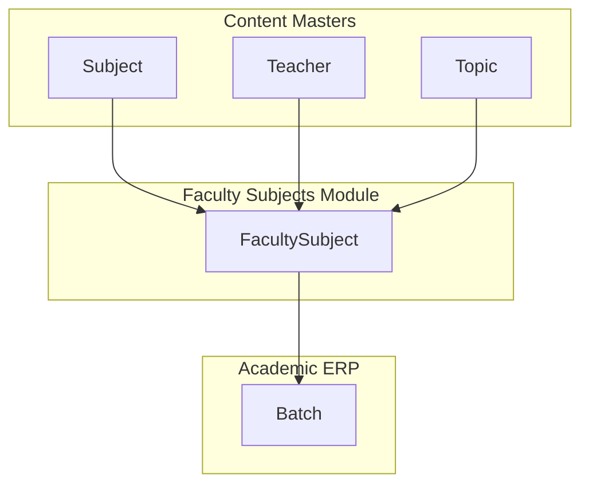

# Academics → Faculty Subjects — Frontend Integration Guide

**Audience:** React + Vite frontend developers integrating the **Faculty Subjects** module in the LMS Admin Panel.

**Backend module:** `FacultySubject` model · `facultySubjectController` · `facultySubjectRoutes`

**Base path:** `{VITE_API_BASE_URL}/api/faculty-subjects`

**Auth:** `Authorization: Bearer <token>` — **Super Admin only**

**Document status:** Official integration reference. Backend is the source of truth — do not change API contracts from the frontend.

---

## Critical naming distinction

| Layer | Name | Notes |
|-------|------|-------|
| Admin navigation | **Academics → Faculty Subjects** | Product label in sidebar |
| Backend model | **FacultySubject** | MongoDB collection `facultysubjects` |
| Backend URL | `/api/faculty-subjects` | All CRUD + CMS helper routes |
| Display code | `facultySubjectId` | Auto-generated, e.g. `FSU001` |
| Master catalog | **Subject** (`/api/subjects`) | Dependency — not Faculty Subjects |
| Instructor record | **Teacher** (`Teacher` model) | Form label "Faculty"; API field `teacherId` |
| Marketing profiles | **Faculty** (`/api/centers/:id/faculty`) | **Different module — do not use here** |

A **Faculty Subject** is **not** a Course. It links one master Subject + one Teacher + optional Topics + delivery categories. Batches reference Faculty Subjects via `Batch.facultySubjects[]`.

---

## 1. Module Overview

### What is Faculty Subjects?

A **Faculty Subject** is a CMS content assignment that binds:

- One **master Subject** (`Subject._id`)
- One **Teacher / Faculty** (`Teacher._id`)
- Zero or more **Topics** (`Topic._id[]`) — must belong to the selected subject
- One or more **delivery categories** — flags for enabled content modules
- A display name (`subjectName`) — e.g. "Indian Polity – Dr Kumar"
- Lifecycle **status**: `ACTIVE` | `INACTIVE`
- Server-generated code (`facultySubjectId`, format `FSU001`, `FSU002`, …)

### Why does it exist?

| Business need | How Faculty Subjects solve it |
|---------------|-------------------------------|
| Same subject taught by different faculty | Separate row per teacher assignment |
| Different delivery modes per assignment | `categories[]` controls which CMS tabs appear |
| Batch composition | `Batch.facultySubjects[]` references Faculty Subject `_id` |
| Content organization | Folders and items live under Faculty Subject + category |
| Operational control | `INACTIVE` hides from dropdowns without deleting data |

### How is it used in the LMS?

```text
Subject (master) + Teacher + Topics
              ↓
        FacultySubject  ← categories[] (LIVE_CLASS, RECORDING, …)
              ↓
   SubjectContentFolder (per category)
              ↓
   Content items (Live Class, Recording, PDF, Prelims Test, Mains AW)
              ↓
        Batch.facultySubjects[] → student enrollment
```

### Navigation

```text
Admin Panel
└── Academics
    ├── Batch                          ← consumes Faculty Subjects via dropdown
    ├── Faculty Subjects               ← THIS MODULE
    ├── Live Classes / Recordings / …  ← content modules scoped by Faculty Subject
    └── Categories
        ├── Subject                    ← master catalog (form dependency)
        ├── Topic                      ← form dependency
        └── Faculty                    ← Teacher records (form dependency)
```

**Suggested frontend route:** `/academics/faculty-subjects` or `/academics/subjects` (match existing admin routing).

### Delivery categories (`categories[]`)

| API value | UI label | Purpose |
|-----------|----------|---------|
| `LIVE_CLASS` | Live Class | Live class CMS under this assignment |
| `RECORDING` | Recording | Recorded sessions |
| `PRELIMS_TEST` | Prelims Test | CBT / prelims tests |
| `MAINS_ANSWER_WRITING` | Mains Answer Writing | Mains answer writing content |
| `PDF` | PDF | PDF resources |

Legacy stored value `TEST` is auto-mapped to `PRELIMS_TEST` on save via `normalizeFacultyCategories()`.

### Data hierarchy



---

## 2. User Flow

Complete frontend journey from page open through CRUD:

```text
Super Admin logs in (POST /api/auth/login-super-admin)
        ↓
Opens sidebar → Academics → Faculty Subjects
        ↓
Page mounts — parallel prefetch (optional):
  GET /api/faculty-subjects/categories
        ↓
List hook fires:
  GET /api/faculty-subjects?page=1&limit=10&sortBy=createdAt&sortOrder=desc
        ↓
Table renders rows (or skeleton while loading)
        ↓
[Search] User types in search box (debounce ~300ms)
        ↓
Refetch with ?search=<term>  (also accepts ?q=)
        ↓
[Filter] User selects Status and/or Category
        ↓
Refetch with ?status=ACTIVE&category=LIVE_CLASS
        ↓
[Pagination] User changes page or page size
        ↓
Refetch with ?page=2&limit=25
        ↓
[Sort] User clicks column header
        ↓
Refetch with ?sortBy=subjectName&sortOrder=asc
        ↓
[Add] User clicks "Add Faculty Subject"
        ↓
Modal opens → GET /api/faculty-subjects/create-form
        ↓
User selects master Subject
        ↓
GET /api/faculty-subjects/create-form?subjectId=<id>
  → loads topics[] + teachers[] for that subject
        ↓
User fills subjectName, topics, teacher, categories, status
        ↓
POST /api/faculty-subjects
        ↓
Toast success → invalidate list cache → table refreshes
        ↓
[View] User clicks View on row
        ↓
GET /api/faculty-subjects/:id (if row not fully hydrated)
        ↓
Read-only detail modal / drawer
        ↓
[Edit] User clicks Edit
        ↓
Populate form from row or GET /api/faculty-subjects/:id
        ↓
Reload create-form for selected subject (topics + teachers)
        ↓
PUT /api/faculty-subjects/:id
        ↓
Toast success → invalidate cache → table refreshes
        ↓
[Status] User toggles Active / Inactive
        ↓
PATCH /api/faculty-subjects/status/:id { "status": "INACTIVE" }
        ↓
Toast success → table refreshes
        ↓
[Delete] User confirms delete
        ↓
DELETE /api/faculty-subjects/:id
        ↓
200 → toast + refresh
409 → toast: linked to N batch(es) — cannot delete
        ↓
[Manage Content] User navigates to content CMS
        ↓
GET /api/faculty-subjects/:id/content-tree
  → left nav grouped by category + folders
```

**Note:** There is **no bulk delete** or **bulk status** endpoint. Bulk UI must loop individual `PATCH` / `DELETE` calls or be omitted.

---

## 3. Folder Structure (Frontend)

Recommended React + Vite module layout:

```text
src/
├── modules/
│   └── academics/
│       └── facultySubjects/
│           ├── components/
│           │   ├── FacultySubjectsTable.tsx
│           │   ├── FacultySubjectFilters.tsx
│           │   ├── FacultySubjectModal.tsx
│           │   ├── FacultySubjectForm.tsx
│           │   ├── FacultySubjectDeleteDialog.tsx
│           │   ├── FacultySubjectDetails.tsx
│           │   ├── FacultySubjectStatusBadge.tsx
│           │   ├── FacultySubjectActions.tsx
│           │   └── FacultySubjectEmptyState.tsx
│           ├── pages/
│           │   ├── FacultySubjectsPage.tsx
│           │   └── FacultySubjectContentPage.tsx   ← optional CMS shell
│           ├── hooks/
│           │   ├── useFacultySubjects.ts
│           │   ├── useFacultySubject.ts
│           │   ├── useFacultySubjectManagement.ts
│           │   ├── useFacultySubjectFormOptions.ts
│           │   ├── useCreateFacultySubject.ts
│           │   ├── useUpdateFacultySubject.ts
│           │   ├── useDeleteFacultySubject.ts
│           │   └── useToggleFacultySubjectStatus.ts
│           ├── services/
│           │   └── facultySubjectService.ts
│           ├── types/
│           │   └── facultySubject.types.ts
│           ├── utils/
│           │   └── facultySubjectHelpers.ts
│           ├── constants/
│           │   └── facultySubject.constants.ts
│           └── validators/
│               └── facultySubject.schema.ts
├── services/
│   └── api.ts                          ← shared Axios instance
└── hooks/
    └── queryKeys.ts                    ← facultySubjectKeys
```

| Folder | Responsibility |
|--------|----------------|
| `components/` | Presentational UI — table, filters, modals, badges. No direct HTTP. |
| `pages/` | Route entry — orchestrates hooks and modals. |
| `hooks/` | TanStack Query wrappers, list management, form option loading. |
| `services/` | Pure HTTP functions — one function per backend endpoint. |
| `types/` | TypeScript interfaces for API payloads, table rows, filters. |
| `utils/` | Mappers (`mapApiToRow`), payload builders, formatters. |
| `constants/` | Status enums, sort fields, column defs, UI copy. |
| `validators/` | Zod/Yup schemas mirroring backend validation rules. |

---

## 4. API Inventory

All routes mount at `app.use('/api/faculty-subjects', ...superAdminAuth, facultySubjectRoutes)`.

Middleware chain: `protect` → `requireSuperAdmin`.

### Summary table

| # | Method | Endpoint | Purpose |
|---|--------|----------|---------|
| 1 | `GET` | `/api/faculty-subjects/create-form` | Form dropdowns (subjects; topics + teachers when `subjectId` set) |
| 2 | `GET` | `/api/faculty-subjects/categories` | Delivery category options for multi-select |
| 3 | `GET` | `/api/faculty-subjects/dropdown` | Lightweight picker list |
| 4 | `POST` | `/api/faculty-subjects/dropdown` | Same as GET — params in body |
| 5 | `GET` | `/api/faculty-subjects/summary/:id` | Lightweight single record |
| 6 | `GET` | `/api/faculty-subjects/:id/content-tree` | CMS left-nav folder tree by category |
| 7 | `POST` | `/api/faculty-subjects/content/categories` | List folder content for a category |
| 8 | `POST` | `/api/faculty-subjects/content/folders` | Create content folder |
| 9 | `PUT` | `/api/faculty-subjects/content/folders/:id` | Update content folder |
| 10 | `PATCH` | `/api/faculty-subjects/status/:id` | Update status only |
| 11 | `POST` | `/api/faculty-subjects` | Create faculty subject |
| 12 | `GET` | `/api/faculty-subjects` | Paginated list with search, filter, sort |
| 13 | `GET` | `/api/faculty-subjects/:id` | Full detail by MongoDB `_id` |
| 14 | `PUT` | `/api/faculty-subjects/:id` | Update faculty subject |
| 15 | `DELETE` | `/api/faculty-subjects/:id` | Hard delete (cascade) |

**Auth login (prerequisite):**

| Method | Endpoint | Purpose |
|--------|----------|---------|
| `POST` | `/api/auth/login-super-admin` | Obtain JWT for Super Admin |

---

### 4.1 GET `/api/faculty-subjects` — List

| Property | Value |
|----------|-------|
| **Purpose** | Paginated list with search, status filter, category filter, sorting |
| **Authentication** | Required — Bearer token |
| **Permission** | Super Admin only |

**Headers:** `Authorization: Bearer <token>`

**Query parameters**

| Param | Type | Required | Default | Validation |
|-------|------|----------|---------|------------|
| `search` | string | No | `""` | Case-insensitive regex on `subjectName`. Alias: `q` |
| `status` | string | No | — | `ACTIVE` or `INACTIVE` |
| `category` | string | No | — | Must match a `FACULTY_CATEGORIES` value (uppercased server-side) |
| `page` | number | No | `1` | Integer ≥ 1 |
| `limit` | number | No | `10` | Integer 1–100 |
| `sortBy` | string | No | `createdAt` | One of: `createdAt`, `subjectName`, `facultySubjectId`, `status` |
| `sortOrder` | string | No | `desc` | `asc` or `desc` |

**Success — `200 OK`**

```json
{
  "success": true,
  "total": 42,
  "page": 1,
  "limit": 10,
  "totalPages": 5,
  "count": 10,
  "data": [
    {
      "_id": "674a1b2c3d4e5f6789012345",
      "facultySubjectId": "FSU001",
      "subjectName": "Indian Polity – Live & Test",
      "subject": "674a1b2c3d4e5f6789012340",
      "teacher": "674a1b2c3d4e5f6789012341",
      "teacherDetails": {
        "_id": "674a1b2c3d4e5f6789012341",
        "teacherId": "TCH001",
        "teacherName": "Dr Rajesh Kumar",
        "centerId": "674a1b2c3d4e5f6789012342"
      },
      "topics": [
        { "_id": "674a1b2c3d4e5f6789012343", "topicId": "TOP001", "topicName": "Fundamental Rights" }
      ],
      "categories": ["LIVE_CLASS", "PRELIMS_TEST"],
      "status": "ACTIVE",
      "createdAt": "2026-06-26T10:00:00.000Z",
      "updatedAt": "2026-06-26T10:00:00.000Z"
    }
  ]
}
```

**Errors:** `401`, `403`, `500`

**Frontend usage:** Primary table data source. Refetch on search/filter/pagination/sort change.

**Loading:** Show table skeleton. **Error:** Banner + retry. **Success:** Render rows + pagination footer.

---

### 4.2 GET `/api/faculty-subjects/:id` — Detail

| Property | Value |
|----------|-------|
| **Purpose** | Full record for view/edit forms |
| **Path param** | `:id` — MongoDB ObjectId of FacultySubject |

**Success — `200 OK`:** `{ "success": true, "data": { ...formatFacultySubject } }`

**Errors:** `404` FacultySubject not found · `401` · `403` · `500`

**When to call:** Edit modal if list row lacks populated topics/categories; view detail drawer.

---

### 4.3 POST `/api/faculty-subjects` — Create

| Property | Value |
|----------|-------|
| **Purpose** | Create a new faculty subject |
| **Content-Type** | `application/json` |

**Request body**

| Field | Type | Required | Validation |
|-------|------|----------|------------|
| `subjectName` | string | **Yes** | Trimmed, non-empty |
| `subjectId` | string | **Yes** | Valid ObjectId; ACTIVE, non-deleted Subject |
| `teacherId` | string | **Yes** | Valid ObjectId; ACTIVE, non-deleted Teacher |
| `topicIds` | string[] | No | Each valid ObjectId; must belong to selected subject; ACTIVE |
| `categories` | string[] | **Yes** | Min 1; allowed enum values (legacy `TEST` → `PRELIMS_TEST`) |
| `status` | string | No | `ACTIVE` (default) or `INACTIVE` |

**Success — `201 Created`**

```json
{
  "success": true,
  "message": "FacultySubject created successfully",
  "data": { "...full formatted record..." }
}
```

**Errors — `400`:** Validation messages (see §10). **`500`:** Server error.

**Dependencies:** Call `GET /create-form` and `GET /categories` before showing form.

---

### 4.4 PUT `/api/faculty-subjects/:id` — Update

| Property | Value |
|----------|-------|
| **Purpose** | Partial or full update |
| **Path param** | `:id` — MongoDB ObjectId |

**Request body** (all optional — omitted fields retain existing values)

| Field | Type | Validation |
|-------|------|------------|
| `subjectName` | string | Same as create |
| `subjectId` | string | Same as create |
| `teacherId` | string | Same as create |
| `topicIds` | string[] | Same as create |
| `categories` | string[] | Same as create |
| `status` | string | `ACTIVE` or `INACTIVE` |

**Success — `200 OK`:** `{ "success": true, "message": "FacultySubject updated successfully", "data": {...} }`

**Errors:** `400`, `404`, `401`, `403`, `500`

---

### 4.5 PATCH `/api/faculty-subjects/status/:id` — Status Update

| Property | Value |
|----------|-------|
| **Purpose** | Toggle Active / Inactive without full edit |

**Request body**

| Field | Type | Required |
|-------|------|----------|
| `status` | string | **Yes** — `ACTIVE` or `INACTIVE` |

**Success — `200 OK`:** `{ "success": true, "message": "FacultySubject status updated", "data": {...} }`

**Errors:** `400` invalid status · `404` not found

**Frontend:** Status toggle, bulk enable/disable (loop per id — no bulk endpoint).

---

### 4.6 DELETE `/api/faculty-subjects/:id` — Delete

| Property | Value |
|----------|-------|
| **Purpose** | **Hard delete** with cascade (folders, live classes, recordings, tests, PDFs, etc.) |
| **Path param** | `:id` — MongoDB ObjectId |

**Success — `200 OK`**

```json
{
  "success": true,
  "message": "FacultySubject permanently deleted",
  "data": {
    "_id": "...",
    "facultySubjectId": "FSU001",
    "subjectName": "Indian Polity – Live & Test"
  }
}
```

**Errors**

| Code | Message pattern |
|------|-----------------|
| `404` | FacultySubject not found |
| `409` | `Cannot delete faculty subject linked to N batch(es). Remove it from batches first.` |

**Frontend:** Show backend `message` on 409. Do not auto-retry.

---

### 4.7 GET `/api/faculty-subjects/create-form` — Form Dropdowns

| Property | Value |
|----------|-------|
| **Purpose** | Single endpoint for create/edit dependent dropdowns |

**Query parameters**

| Param | Required | Effect |
|-------|----------|--------|
| *(none)* | — | Returns `subjects[]` only |
| `subjectId` | No | Also returns `topics[]`, `teachers[]`, `selectedSubject` |
| `centerId` | No | When set with `subjectId`, filters teachers by center |

**Success — `200 OK`**

```json
{
  "success": true,
  "message": "Form options loaded (subjects)",
  "data": {
    "subjects": [{ "_id": "...", "subjectId": "SUB001", "subjectName": "Indian Polity" }],
    "topics": [],
    "teachers": [],
    "selectedSubject": null
  }
}
```

With `?subjectId=...`:

```json
{
  "data": {
    "subjects": [...],
    "topics": [{ "_id": "...", "topicId": "TOP001", "topicName": "..." }],
    "teachers": [{
      "_id": "...",
      "teacherId": "TCH001",
      "teacherName": "Dr Kumar",
      "centerId": "...",
      "centerName": "Delhi Center"
    }],
    "selectedSubject": { "_id": "...", "subjectId": "SUB001", "subjectName": "Indian Polity" }
  }
}
```

**Errors:** `400` Invalid or inactive subject · `401` · `403` · `500`

**Loading order:** Step 1 — call without `subjectId`. Step 2 — on subject select, call with `subjectId`.

---

### 4.8 GET `/api/faculty-subjects/categories` — Delivery Categories

| Property | Value |
|----------|-------|
| **Purpose** | Options for categories multi-select in create/edit forms |

**Success — `200 OK`**

```json
{
  "success": true,
  "message": "Faculty subject categories loaded",
  "data": [
    { "value": "LIVE_CLASS", "label": "Live Class" },
    { "value": "RECORDING", "label": "Recording" },
    { "value": "PRELIMS_TEST", "label": "Prelims Test" },
    { "value": "MAINS_ANSWER_WRITING", "label": "Mains Answer Writing" },
    { "value": "PDF", "label": "PDF" }
  ]
}
```

---

### 4.9 GET / POST `/api/faculty-subjects/dropdown` — Picker Dropdown

| Property | Value |
|----------|-------|
| **Purpose** | Lightweight list for Batch forms and other pickers |
| **Methods** | `GET` (query params) or `POST` (body params — same fields) |

**Parameters** (query or body)

| Param | Default | Notes |
|-------|---------|-------|
| `search` | `""` | Regex on `subjectName` |
| `status` | `ACTIVE` | `ACTIVE` or `INACTIVE`; defaults to ACTIVE if invalid |
| `category` | — | Filter by delivery category |
| `page` | `1` | |
| `limit` | `100` | Max 200 |

**Success — `200 OK`**

```json
{
  "success": true,
  "count": 10,
  "total": 45,
  "page": 1,
  "limit": 100,
  "totalPages": 1,
  "data": [
    {
      "_id": "...",
      "facultySubjectId": "FSU001",
      "subjectName": "Indian Polity – Live",
      "teacherName": "Dr Kumar"
    }
  ]
}
```

---

### 4.10 GET `/api/faculty-subjects/summary/:id` — Lightweight Summary

| Property | Value |
|----------|-------|
| **Purpose** | Minimal record — no topics/categories |
| **Path param** | `:id` — MongoDB `_id` **or** `facultySubjectId` code (e.g. `FSU001`) |

**Success:** `{ "success": true, "data": { "_id", "facultySubjectId", "subjectName", "teacherName" } }`

**Errors:** `404`

---

### 4.11 GET `/api/faculty-subjects/:id/content-tree` — Content Tree

| Property | Value |
|----------|-------|
| **Purpose** | CMS left navigation — folders grouped by category |
| **Path param** | MongoDB `_id` or `facultySubjectId` code |

**Success — `200 OK`**

```json
{
  "success": true,
  "facultySubjectId": "...",
  "subjectName": "Indian Polity – Live",
  "categories": ["LIVE_CLASS", "PDF"],
  "data": {
    "LIVE_CLASS": [{ "_id": "...", "folderId": "FLD001", "folderName": "Module 1" }],
    "RECORDING": [],
    "PRELIMS_TEST": [],
    "MAINS_ANSWER_WRITING": [],
    "PDF": []
  }
}
```

---

### 4.12 POST `/api/faculty-subjects/content/categories` — List Folder Content

| Property | Value |
|----------|-------|
| **Purpose** | List content items inside a folder for a delivery category |
| **Content-Type** | `application/json` |

**Request body**

| Field | Required | Validation |
|-------|----------|------------|
| `facultySubjectId` | **Yes** | Valid ObjectId |
| `folderId` | **Yes** | Valid ObjectId; must belong to faculty subject |
| `category` | **Yes** | Valid `FACULTY_CATEGORIES` value; must be enabled on faculty subject |
| `page` | No | Pagination |
| `limit` | No | Pagination |
| `sortBy` | No | Passed to content list service |
| `sortOrder` | No | `asc` / `desc` |

**Success — `200 OK`:** Returns `folders`, `content.data[]`, pagination metadata, `selectedFolder`, etc.

**Errors:** `400`, `404`

**Scope:** Content CMS page — not required for main Faculty Subjects list CRUD.

---

### 4.13 POST `/api/faculty-subjects/content/folders` — Create Folder

**Request body**

| Field | Required | Validation |
|-------|----------|------------|
| `facultySubjectId` | **Yes** | ACTIVE faculty subject with matching category enabled |
| `category` | **Yes** | Valid enum |
| `folderName` | **Yes** | Non-empty; unique per faculty subject + category |
| `description` | No | String |

**Success — `201 Created`**

**Errors:** `400` validation · `409` duplicate folder name

---

### 4.14 PUT `/api/faculty-subjects/content/folders/:id` — Update Folder

**Request body** (optional fields)

| Field | Validation |
|-------|------------|
| `folderName` | Non-empty; unique per category |
| `description` | String |
| `status` | `ACTIVE` or `INACTIVE` |

**Errors:** `400`, `404`, `409`

---

## 5. API Integration Order

Integrate in this sequence for the main list page:

```text
Step 1 — Auth
  POST /api/auth/login-super-admin → store JWT

Step 2 — Configure Axios
  Authorization: Bearer <token> on all requests

Step 3 — Categories (prefetch, cache long TTL)
  GET /api/faculty-subjects/categories

Step 4 — List (primary table)
  GET /api/faculty-subjects?page=1&limit=10

Step 5 — Render table + pagination + empty/loading states

Step 6 — Wire search / filters / sort → refetch list

Step 7 — Create form dropdowns (on modal open)
  GET /api/faculty-subjects/create-form
  GET /api/faculty-subjects/categories

Step 8 — Dependent dropdowns (on subject select)
  GET /api/faculty-subjects/create-form?subjectId=<id>

Step 9 — Create mutation
  POST /api/faculty-subjects

Step 10 — Edit flow
  GET /api/faculty-subjects/:id (if needed)
  PUT /api/faculty-subjects/:id

Step 11 — Status toggle
  PATCH /api/faculty-subjects/status/:id

Step 12 — Delete
  DELETE /api/faculty-subjects/:id

Step 13 — Content CMS (optional separate page)
  GET /api/faculty-subjects/:id/content-tree
  POST /api/faculty-subjects/content/folders
  POST /api/faculty-subjects/content/categories
```

For **Batch module integration** (separate page): use `GET /api/faculty-subjects/dropdown?status=ACTIVE&category=LIVE_CLASS` after list page is stable.

---

## 6. API Service Layer

Recommended file: `src/services/facultySubjectService.ts`

Use exact backend paths — do not rename endpoints.

```typescript
// src/services/facultySubjectService.ts
import api from './api';

const BASE = '/api/faculty-subjects';

export const facultySubjectService = {
  /** GET / — paginated list */
  getFacultySubjects: (params: FacultySubjectListParams) =>
    api.get(BASE, { params }),

  /** GET /:id — full detail */
  getFacultySubject: (id: string) =>
    api.get(`${BASE}/${id}`),

  /** POST / — create */
  createFacultySubject: (payload: CreateFacultySubjectPayload) =>
    api.post(BASE, payload),

  /** PUT /:id — update */
  updateFacultySubject: (id: string, payload: UpdateFacultySubjectPayload) =>
    api.put(`${BASE}/${id}`, payload),

  /** DELETE /:id — hard delete */
  deleteFacultySubject: (id: string) =>
    api.delete(`${BASE}/${id}`),

  /** PATCH /status/:id */
  changeStatus: (id: string, status: 'ACTIVE' | 'INACTIVE') =>
    api.patch(`${BASE}/status/${id}`, { status }),

  /** GET /create-form — form dropdowns */
  getCreateForm: (params?: { subjectId?: string; centerId?: string }) =>
    api.get(`${BASE}/create-form`, { params }),

  /** GET /categories */
  getCategories: () =>
    api.get(`${BASE}/categories`),

  /** GET or POST /dropdown */
  getDropdown: (params?: FacultySubjectDropdownParams) =>
    api.get(`${BASE}/dropdown`, { params }),

  /** GET /summary/:id */
  getSummary: (id: string) =>
    api.get(`${BASE}/summary/${id}`),

  /** GET /:id/content-tree */
  getContentTree: (id: string) =>
    api.get(`${BASE}/${id}/content-tree`),

  /** POST /content/categories */
  listContentCategories: (body: ContentCategoriesPayload) =>
    api.post(`${BASE}/content/categories`, body),

  /** POST /content/folders */
  createFolder: (body: CreateFolderPayload) =>
    api.post(`${BASE}/content/folders`, body),

  /** PUT /content/folders/:id */
  updateFolder: (id: string, body: UpdateFolderPayload) =>
    api.put(`${BASE}/content/folders/${id}`, body),
};
```

| Method | Backend endpoint | Notes |
|--------|------------------|-------|
| `getFacultySubjects` | `GET /` | Supports search, status, category, pagination, sort |
| `getFacultySubject` | `GET /:id` | Use Mongo `_id` |
| `createFacultySubject` | `POST /` | Returns `201` |
| `updateFacultySubject` | `PUT /:id` | Partial body supported |
| `deleteFacultySubject` | `DELETE /:id` | Handle `409` for batch links |
| `changeStatus` | `PATCH /status/:id` | Not `PUT` |
| `getCreateForm` | `GET /create-form` | Two-step dependent loading |
| `getCategories` | `GET /categories` | Static-ish — cache aggressively |
| `getDropdown` | `GET /dropdown` | For pickers / other modules |
| `getSummary` | `GET /summary/:id` | Accepts `_id` or `FSU###` code |
| `getContentTree` | `GET /:id/content-tree` | CMS navigation |
| `listContentCategories` | `POST /content/categories` | CMS content list |
| `createFolder` / `updateFolder` | folder routes | CMS folder management |

**Not available in backend:** `bulkDelete()`, `bulkChangeStatus()` — implement client-side loops if bulk UI is required, or omit bulk actions.

---

## 7. React Query Integration

### Query keys

```typescript
export const facultySubjectKeys = {
  all: ['facultySubjects'] as const,
  lists: () => [...facultySubjectKeys.all, 'list'] as const,
  list: (params: FacultySubjectListParams) =>
    [...facultySubjectKeys.lists(), params] as const,
  details: () => [...facultySubjectKeys.all, 'detail'] as const,
  detail: (id: string) => [...facultySubjectKeys.details(), id] as const,
  categories: () => [...facultySubjectKeys.all, 'categories'] as const,
  createForm: (subjectId?: string, centerId?: string) =>
    [...facultySubjectKeys.all, 'createForm', { subjectId, centerId }] as const,
  dropdown: (params: FacultySubjectDropdownParams) =>
    [...facultySubjectKeys.all, 'dropdown', params] as const,
  contentTree: (id: string) =>
    [...facultySubjectKeys.all, 'contentTree', id] as const,
};
```

### Recommended hooks

| Hook | Type | Service call | staleTime suggestion |
|------|------|--------------|---------------------|
| `useFacultySubjects(params)` | query | `getFacultySubjects` | `0` (list — always fresh on mount) |
| `useFacultySubject(id)` | query | `getFacultySubject` | `30_000` |
| `useFacultySubjectCategories()` | query | `getCategories` | `Infinity` |
| `useFacultySubjectCreateForm(subjectId?)` | query | `getCreateForm` | `60_000` |
| `useFacultySubjectDropdown(params)` | query | `getDropdown` | `30_000` |
| `useCreateFacultySubject()` | mutation | `createFacultySubject` | — |
| `useUpdateFacultySubject()` | mutation | `updateFacultySubject` | — |
| `useDeleteFacultySubject()` | mutation | `deleteFacultySubject` | — |
| `useToggleFacultySubjectStatus()` | mutation | `changeStatus` | — |

### Cache invalidation

```typescript
// After create / update / delete / status change:
queryClient.invalidateQueries({ queryKey: facultySubjectKeys.lists() });
queryClient.invalidateQueries({ queryKey: facultySubjectKeys.dropdown({}) });

// After delete or update of specific row:
queryClient.removeQueries({ queryKey: facultySubjectKeys.detail(id) });
```

### Mutations — success / error

```typescript
useCreateFacultySubject({
  onSuccess: () => {
    toast.success('Faculty subject created');
    queryClient.invalidateQueries({ queryKey: facultySubjectKeys.lists() });
  },
  onError: (err) => toast.error(getApiErrorMessage(err)),
});
```

### Optimistic updates (optional — status toggle only)

```typescript
onMutate: async ({ id, status }) => {
  await queryClient.cancelQueries({ queryKey: facultySubjectKeys.lists() });
  // snapshot + patch list cache row.status
},
onError: (_e, _v, context) => { /* rollback from context */ },
onSettled: () => {
  queryClient.invalidateQueries({ queryKey: facultySubjectKeys.lists() });
},
```

---

## 8. UI Mapping

| UI Element | Backend integration |
|------------|---------------------|
| **Search box** | `GET /api/faculty-subjects?search=` (debounced 300ms). Alias `q` also works. |
| **Status filter tabs** | `?status=ACTIVE` or `?status=INACTIVE`. Omit for all. |
| **Category filter** | `?category=LIVE_CLASS` (etc.) |
| **Faculty filter** | **No backend param** — filter client-side on `teacherDetails.teacherName` or extend UI to filter loaded page only |
| **Pagination** | `?page=` and `?limit=` (max 100) |
| **Sort column click** | `?sortBy=` + `?sortOrder=asc\|desc` |
| **Add button** | Opens modal → `GET /create-form` + `GET /categories` |
| **Subject select (form)** | Triggers `GET /create-form?subjectId=` |
| **Create submit** | `POST /api/faculty-subjects` |
| **Edit button** | `GET /:id` (if needed) → `PUT /:id` |
| **View button** | `GET /:id` or use list row data |
| **Status toggle** | `PATCH /status/:id` |
| **Delete button** | `DELETE /:id` — handle `409` |
| **Manage Content link** | Navigate → `GET /:id/content-tree` |
| **Refresh button** | `queryClient.invalidateQueries` or `refetch()` on list query |
| **Batch picker (other module)** | `GET /dropdown?status=ACTIVE` |
| **Page load** | `GET /` list + optional `GET /categories` |

---

## 9. Table Integration

### Recommended columns

| Column | Source field | Sortable (`sortBy`) |
|--------|--------------|---------------------|
| ID | `facultySubjectId` | `facultySubjectId` |
| Faculty Subject Name | `subjectName` | `subjectName` |
| Master Subject | `teacherDetails` N/A — use populated subject ref or separate column from list | No |
| Faculty | `teacherDetails.teacherName` | No |
| Status | `status` | `status` |
| Topics | `topics[]` — chip popover | No |
| Categories | `categories[]` — chips with labels from `/categories` | No |
| Created | `createdAt` | `createdAt` |
| Actions | — | No |

> List response returns `subject` as ObjectId string when not fully expanded in `formatFacultySubject` — use `teacherDetails` for faculty name. For master subject name, rely on populated data in list response or add client mapping if subject name is needed (backend populates `subject` with `subjectId subjectName` in query).

### Searching

- Server-side on `subjectName` only
- Debounce input 300ms before updating query key
- Reset `page` to `1` on search change

### Filtering

- **Status / Category:** server-side query params
- **Faculty / Date:** client-side on current result set unless backend is extended (not in scope)

### Pagination

```typescript
{
  page: response.page,
  limit: response.limit,
  total: response.total,
  totalPages: response.totalPages,
  count: response.count,
}
```

Default `limit: 10`. Options: `[10, 25, 50, 100]`.

### States

| State | UX |
|-------|-----|
| **Loading** | 8-row skeleton; disable actions |
| **Empty (no filters)** | Illustration + "Add Faculty Subject" CTA |
| **Empty (filtered)** | "No faculty subjects match your filters" + reset |
| **Error** | Alert banner with retry; preserve filter state |
| **Refreshing** | Subtle `isFetching` indicator; keep existing rows visible |

### Selection / bulk actions

Backend has **no bulk endpoints**. If UI supports multi-select:

- Bulk status → sequential `PATCH /status/:id` per selected row
- Bulk delete → sequential `DELETE /:id`; stop or continue on `409` per product decision

---

## 10. Form Integration

### Required fields (create)

| Field | API key | Backend rule |
|-------|---------|----------------|
| Faculty Subject Name | `subjectName` | Non-empty trimmed string |
| Master Subject | `subjectId` | Valid ACTIVE Subject ObjectId |
| Faculty / Teacher | `teacherId` | Valid ACTIVE Teacher ObjectId |
| Delivery Categories | `categories` | Array with ≥ 1 valid enum value |

### Optional fields

| Field | API key | Notes |
|-------|---------|-------|
| Topics | `topicIds` | Empty array allowed; each topic must belong to subject |
| Status | `status` | Defaults to `ACTIVE` |

### Do not send on create

`facultySubjectId`, `_id` — auto-generated server-side.

### Dependent dropdowns

```text
Modal opens
  → GET /create-form (subjects)
  → GET /categories
User selects subjectId
  → GET /create-form?subjectId=<id>
  → populate topicIds multi-select + teacherId select
  → clear incompatible topic selections
Optional: append ?centerId= to filter teachers by center
```

### Reset / cancel

- **Cancel:** close modal; reset RHF; do not invalidate list cache
- **Re-open create:** reset form; refetch create-form without subjectId

### Success / error toasts

| Action | Success message | Error |
|--------|-----------------|-------|
| Create | "Faculty subject created" | Show `response.data.message` from `400` |
| Update | "Faculty subject updated" | Same |
| Status | "Status updated" | Same |
| Delete | "Faculty subject deleted" | `409`: show full backend message |

### Duplicate handling

- **Folder names:** `409` on duplicate folder per category (CMS)
- **Faculty Subject rows:** no uniqueness constraint on subject+teacher combo in backend — duplicates allowed unless business rules added later

### Backend validation messages (mirror in frontend)

| Condition | Backend `message` |
|-----------|-------------------|
| Missing name | `subjectName is required` |
| Invalid subject | `Invalid subject id` / `Invalid or inactive subject` |
| Invalid teacher | `Invalid faculty id` / `Invalid or inactive faculty` |
| Invalid topic | `Invalid topic id in topics array` / topics don't belong to subject |
| No categories | `At least one category is required` |
| Invalid category | `Invalid categories. Allowed: LIVE_CLASS, RECORDING, ...` |
| Invalid status (PATCH) | `status must be ACTIVE or INACTIVE` |

### Field mapping (form → API)

```typescript
{
  subjectName: form.subjectName.trim(),
  subjectId: form.subjectId,       // from create-form subjects
  teacherId: form.teacherId,       // from create-form teachers
  topicIds: form.topicIds ?? [],   // from create-form topics
  categories: form.categories,     // from /categories
  status: form.status ?? 'ACTIVE',
}
```

---

## 11. Dropdown Dependencies

### Primary form dropdowns (Faculty Subjects create/edit)

| Dropdown | Source API | When to load |
|----------|------------|--------------|
| Master Subjects | `GET /api/faculty-subjects/create-form` → `data.subjects` | Modal open |
| Topics | `GET /api/faculty-subjects/create-form?subjectId=` → `data.topics` | After subject selected |
| Teachers / Faculty | Same → `data.teachers` | After subject selected |
| Delivery Categories | `GET /api/faculty-subjects/categories` → `data[]` | Modal open (cache) |

### Optional center filter for teachers

| Dropdown | Source | When |
|----------|--------|------|
| Center (optional) | Separate Centers module if UI needs center-scoped faculty | Before or with subject select |
| Teachers filtered | `GET /create-form?subjectId=&centerId=` | When center selected |

### Picker dropdown (other modules — Batch, CMS)

| Dropdown | Source API |
|----------|------------|
| Faculty Subject picker | `GET /api/faculty-subjects/dropdown?status=ACTIVE&category=LIVE_CLASS` |

### Loading order diagram

```text
GET /categories ────────────────┐
GET /create-form ───────────────┤ parallel on modal open
                                ↓
                    User picks subjectId
                                ↓
              GET /create-form?subjectId=<id>
                                ↓
              Enable topics + teacher fields
```

**Note:** Backend bundles subjects/topics/teachers in **one** create-form endpoint — do not call separate `/api/subjects/dropdown` or `/api/teachers/dropdown` unless your UI already uses them elsewhere; create-form is the canonical source for this module.

---

## 12. Environment Variables

```env
# .env / .env.local (Vite — must be prefixed VITE_)
VITE_API_BASE_URL=http://localhost:5000
```

Usage:

```typescript
const api = axios.create({
  baseURL: import.meta.env.VITE_API_BASE_URL,
  timeout: 30_000,
});
```

Never hardcode `http://localhost:5000` in components or services.

---

## 13. Centralized API Layer

```text
src/services/
├── api.ts                    ← Axios instance + interceptors
└── facultySubjectService.ts  ← Faculty Subjects HTTP functions
```

### `api.ts` pattern

```typescript
import axios from 'axios';

const api = axios.create({
  baseURL: import.meta.env.VITE_API_BASE_URL,
  timeout: 30_000,
  headers: { 'Content-Type': 'application/json' },
});

// Request interceptor — attach Bearer token
api.interceptors.request.use((config) => {
  const token = localStorage.getItem('authToken'); // or your auth store
  if (token) {
    config.headers.Authorization = `Bearer ${token}`;
  }
  return config;
});

// Response interceptor — global error handling
api.interceptors.response.use(
  (res) => res,
  (error) => {
    if (error.response?.status === 401) {
      // redirect to login — backend does not expose refresh token
    }
    return Promise.reject(error);
  }
);

export default api;
```

| Concern | Implementation |
|---------|----------------|
| Bearer token | Request interceptor |
| 401 handling | Clear session → redirect to Super Admin login |
| Timeout | 30s default |
| Global errors | Response interceptor + `getApiErrorMessage()` helper |
| Refresh token | **Not supported by backend** — re-login on expiry |

---

## 14. Custom Hooks

### `useFacultySubjectManagement.ts`

Orchestrates list page state:

```typescript
export function useFacultySubjectManagement() {
  const [page, setPage] = useState(1);
  const [limit, setLimit] = useState(10);
  const [search, setSearch] = useState('');
  const [statusFilter, setStatusFilter] = useState<'all' | 'ACTIVE' | 'INACTIVE'>('all');
  const [categoryFilter, setCategoryFilter] = useState<string>('all');
  const [sortBy, setSortBy] = useState('createdAt');
  const [sortOrder, setSortOrder] = useState<'asc' | 'desc'>('desc');

  const debouncedSearch = useDebouncedValue(search, 300);

  const listParams = useMemo(() => ({
    page,
    limit,
    search: debouncedSearch,
    status: statusFilter === 'all' ? undefined : statusFilter,
    category: categoryFilter === 'all' ? undefined : categoryFilter,
    sortBy,
    sortOrder,
  }), [page, limit, debouncedSearch, statusFilter, categoryFilter, sortBy, sortOrder]);

  const query = useFacultySubjects(listParams);

  return {
    ...query,
    page, setPage, limit, setLimit,
    search, setSearch,
    statusFilter, setStatusFilter,
    categoryFilter, setCategoryFilter,
    sortBy, setSortBy, sortOrder, setSortOrder,
    facultySubjects: query.data?.data ?? [],
    total: query.data?.total ?? 0,
    totalPages: query.data?.totalPages ?? 0,
  };
}
```

### `useFacultySubjectFormOptions.ts`

```typescript
export function useFacultySubjectFormOptions(open: boolean, subjectId?: string) {
  const categories = useFacultySubjectCategories({ enabled: open });
  const createForm = useFacultySubjectCreateForm(subjectId, { enabled: open });

  return {
    subjectOptions: createForm.data?.data.subjects ?? [],
    topicOptions: createForm.data?.data.topics ?? [],
    teacherOptions: createForm.data?.data.teachers ?? [],
    categoryOptions: categories.data?.data ?? [],
    isLoading: categories.isLoading || createForm.isLoading,
  };
}
```

---

## 15. Error Handling

| HTTP | When | Frontend action |
|------|------|-----------------|
| **400** | Validation failure | Show `message` inline on form fields or toast |
| **401** | Missing/invalid/expired JWT | Redirect to login; message: `Not authorized, no token` or `Not authorized, token failed` |
| **403** | Non–Super Admin | Show: `Access denied. Super Admin only.` Hide create/edit/delete actions |
| **404** | Record not found | Toast + close modal; refresh list |
| **409** | Delete blocked by batch links; duplicate folder | Show exact backend `message`; do not retry delete |
| **422** | Not used by this module | Handle generically if proxied |
| **500** | Server error | Toast: "Something went wrong" + optional `error` field in dev |
| **Network** | Offline / timeout | Toast + retry button |

### Helper

```typescript
export function getApiErrorMessage(error: unknown): string {
  if (axios.isAxiosError(error)) {
    return error.response?.data?.message ?? error.message ?? 'Request failed';
  }
  return 'Request failed';
}
```

### Validation failure vs permission error

- **400** on submit → field-level or form-level errors; keep modal open
- **403** on page load → full-page "Access denied" with link home
- **409** on delete → dialog stays open briefly showing reason, then close

---

## 16. Loading States

| Context | Indicator | Notes |
|---------|-----------|-------|
| **Page initial load** | Full-width table skeleton (8 rows) | `isLoading && !data` |
| **Table refetch** | Opacity overlay or top progress bar | `isFetching && data` — keep rows |
| **Search typing** | Debounce — no spinner per keystroke | Show subtle loading after debounce fires |
| **Dropdown (form)** | Disabled selects + spinner in label | While create-form loading |
| **Create/Edit submit** | Primary button `loading` + disabled form | `mutation.isPending` |
| **Delete confirm** | Confirm button spinner | Disable cancel during pending |
| **Status toggle** | Row-level spinner on toggle control | Track `statusChangingId` |
| **Refresh button** | Icon spin while `isFetching` | Manual `refetch()` |

---

## 17. Authentication

### Login

```http
POST {VITE_API_BASE_URL}/api/auth/login-super-admin
Content-Type: application/json

{
  "email": "<SUPER_ADMIN_EMAIL>",
  "password": "<SUPER_ADMIN_PASSWORD>"
}
```

Store returned JWT (field may be `token` or `data.token` — inspect login response shape in your environment).

### Authorization header

```http
Authorization: Bearer <jwt>
```

Required on **every** `/api/faculty-subjects/*` request.

### Token expiry

Backend uses `jwt.verify` with `JWT_SECRET`. **No refresh-token endpoint exists.** On `401`:

1. Clear stored token
2. Redirect to Super Admin login
3. Preserve intended return URL if desired

### Auth types accepted by `protect` middleware

- Legacy `User` with `role === 'super_admin'`
- `AdminAccess` with populated `roleId.roleCode === 'SUPER_ADMIN'`

---

## 18. Role-Based Access

All Faculty Subjects routes use `superAdminAuth`:

```javascript
// app.js
app.use('/api/faculty-subjects', ...superAdminAuth, facultySubjectRoutes);
```

| Role | List | Create | Edit | Delete | Status | Content CMS |
|------|------|--------|------|--------|--------|-------------|
| **SUPER_ADMIN** (`roleCode`) | ✅ | ✅ | ✅ | ✅ | ✅ | ✅ |
| Legacy `super_admin` user role | ✅ | ✅ | ✅ | ✅ | ✅ | ✅ |
| **All other roles** | ❌ 403 | ❌ 403 | ❌ 403 | ❌ 403 | ❌ 403 | ❌ 403 |

**403 response:**

```json
{
  "success": false,
  "message": "Access denied. Super Admin only."
}
```

Frontend: wrap the Faculty Subjects route with a Super Admin guard. Do not rely on hiding buttons alone — backend enforces access.

Permission matrix features (`hasFeaturePermission`) are **not** applied to this module — only Super Admin check.

---

## 19. Complete Frontend Flow Diagram

```text
┌─────────────────────────────────────────────────────────────────┐
│                     OPEN FACULTY SUBJECTS PAGE                   │
└───────────────────────────────┬─────────────────────────────────┘
                                ↓
                    ┌───────────────────────┐
                    │  JWT present?         │
                    └───────────┬───────────┘
                          No    │    Yes
                    ┌───────────┴───────────┐
                    ↓                       ↓
            Redirect to login        GET /categories (cache)
                    │                       ↓
                    │               GET / (list)
                    │                       ↓
                    │               Render table / skeleton
                    └───────────────────────┘
                                ↓
        ┌───────────────────────┼───────────────────────┐
        ↓                       ↓                       ↓
    Search/filter           Pagination              Sort
        ↓                       ↓                       ↓
    Refetch GET /         Refetch GET /           Refetch GET /
        └───────────────────────┼───────────────────────┘
                                ↓
        ┌───────────┬───────────┼───────────┬───────────┐
        ↓           ↓           ↓           ↓           ↓
     Create       Edit        View       Status      Delete
        ↓           ↓           ↓           ↓           ↓
  POST /      PUT /:id    GET /:id   PATCH /status  DELETE /:id
        └───────────┴───────────┴───────────┴───────────┘
                                ↓
                    invalidateQueries (list)
                                ↓
                         Table refreshed
                                ↓
              [Optional] Manage Content
                                ↓
                    GET /:id/content-tree
                                ↓
                    CMS sub-flow (folders)
```

---

## 20. Best Practices

1. **Centralized services** — All HTTP in `facultySubjectService.ts`; components use hooks only.
2. **TanStack Query** — Server state in queries; UI state (modals, filters) in React `useState`.
3. **Query key stability** — Serialize `listParams` object for consistent cache keys.
4. **Debounced search** — Avoid API call per keystroke; reset page on filter change.
5. **Environment variables** — Single `VITE_API_BASE_URL`; no hardcoded hosts.
6. **Error helper** — One `getApiErrorMessage()` used by all mutations.
7. **Super Admin guard** — Route-level check before rendering page.
8. **409 delete handling** — Surface batch-link message; guide admin to Batch module.
9. **Create-form two-step** — Never load topics/teachers before subject is selected.
10. **Use Mongo `_id` in URLs** — For `GET/PUT/PATCH/DELETE /:id`; `facultySubjectId` code is display-only (except summary/content-tree which accept both).
11. **No invented endpoints** — No bulk delete, no soft delete, no refresh token flow.
12. **Categories cache** — `staleTime: Infinity` for `/categories` — enum rarely changes.
13. **Reusable form validation** — Zod schema aligned with backend messages for consistent UX.
14. **Loading UX** — Distinguish initial load (`isLoading`) from background refetch (`isFetching`).

---

## 21. Frontend Checklist

Use this before marking the module production-ready:

### API & data

- [ ] `VITE_API_BASE_URL` configured for all environments
- [ ] Axios instance with Bearer interceptor
- [ ] Super Admin login flow stores JWT correctly
- [ ] `GET /api/faculty-subjects` list connected with pagination
- [ ] Search debounced and mapped to `search` query param
- [ ] Status filter mapped to `status` query param
- [ ] Category filter mapped to `category` query param
- [ ] Column sorting mapped to `sortBy` + `sortOrder`
- [ ] `GET /categories` connected for form multi-select
- [ ] `GET /create-form` two-step dependent dropdowns working
- [ ] `POST /` create working with validation error display
- [ ] `GET /:id` detail for view/edit when needed
- [ ] `PUT /:id` update working
- [ ] `PATCH /status/:id` status toggle working
- [ ] `DELETE /:id` working with `409` batch-link handling

### React Query

- [ ] Query keys defined in `facultySubjectKeys`
- [ ] List invalidates after all mutations
- [ ] Dropdown cache invalidated after create/update/status/delete
- [ ] `isLoading` vs `isFetching` handled in UI

### UI states

- [ ] Table skeleton on initial load
- [ ] Empty state (no data)
- [ ] Empty state (filters active)
- [ ] Error state with retry
- [ ] Button loading on submit/delete/status
- [ ] Toast messages on success and error

### Auth & access

- [ ] 401 redirects to login
- [ ] 403 shows access denied for non–Super Admin
- [ ] Route guarded for Super Admin

### Forms

- [ ] Required fields validated before submit
- [ ] Topics cleared when subject changes
- [ ] Categories multi-select uses `/categories` labels
- [ ] Cancel resets form without side effects

### Optional CMS

- [ ] Content tree page uses `GET /:id/content-tree`
- [ ] Folder create/update uses content folder endpoints

### Production

- [ ] No hardcoded API URLs
- [ ] Responsive table (horizontal scroll on mobile)
- [ ] Accessible form labels and error announcements
- [ ] Manual QA against Postman collection: `BATCH_FACULTY_SUBJECT_POSTMAN_COLLECTION.json`

---

## Appendix A — Response shape reference

### `formatFacultySubject` (full record)

```typescript
interface FacultySubject {
  _id: string;
  facultySubjectId: string;       // e.g. FSU001
  subjectName: string;
  subject: string;                // Subject ObjectId (or populated in some contexts)
  teacher: string;                // Teacher ObjectId
  teacherDetails?: {
    _id: string;
    teacherId: string;
    teacherName: string;
    centerId: string;
  };
  topics: Array<{
    _id: string;
    topicId: string;
    topicName: string;
  }>;
  categories: Array<
    'LIVE_CLASS' | 'RECORDING' | 'PRELIMS_TEST' | 'MAINS_ANSWER_WRITING' | 'PDF'
  >;
  status: 'ACTIVE' | 'INACTIVE';
  createdAt: string;
  updatedAt: string;
}
```

### Dropdown summary shape

```typescript
interface FacultySubjectDropdownItem {
  _id: string;
  facultySubjectId: string;
  subjectName: string;
  teacherName: string;
}
```

---

## Appendix B — Backend file reference

| File | Role |
|------|------|
| `routes/facultySubjectRoutes.js` | Route definitions |
| `controllers/facultySubjectController.js` | CRUD, create-form, dropdown, content-tree |
| `models/FacultySubject.js` | Mongoose schema |
| `services/facultySubjectDeleteService.js` | Hard delete + batch guard + cascade |
| `services/facultySubjectCategoryService.js` | Content category listing |
| `utils/batchFacultyHelpers.js` | `validateFacultySubjectPayload` |
| `utils/batchFacultyConstants.js` | Category enums + labels |
| `utils/contentMastersHelpers.js` | Pagination, sort, search helpers |
| `middleware/superAdminAuth.js` | `protect` + `requireSuperAdmin` |
| `app.js` | Mounts `/api/faculty-subjects` |

---

## Appendix C — Related Postman / specs

| Asset | Purpose |
|-------|---------|
| `BATCH_FACULTY_SUBJECT_POSTMAN_COLLECTION.json` | Faculty Subject CRUD smoke tests |
| `FACULTY_SUBJECT_COMPLETE.md` | Full backend reference including CMS |
| `FACULTY_SUBJECT_CMS_POSTMAN_COLLECTION.json` | Folder + live class flows |

---

*Generated from backend source of truth. Last aligned with: `facultySubjectRoutes.js`, `facultySubjectController.js`, `FacultySubject` model, `batchFacultyHelpers.js`, `superAdminAuth` middleware.*
