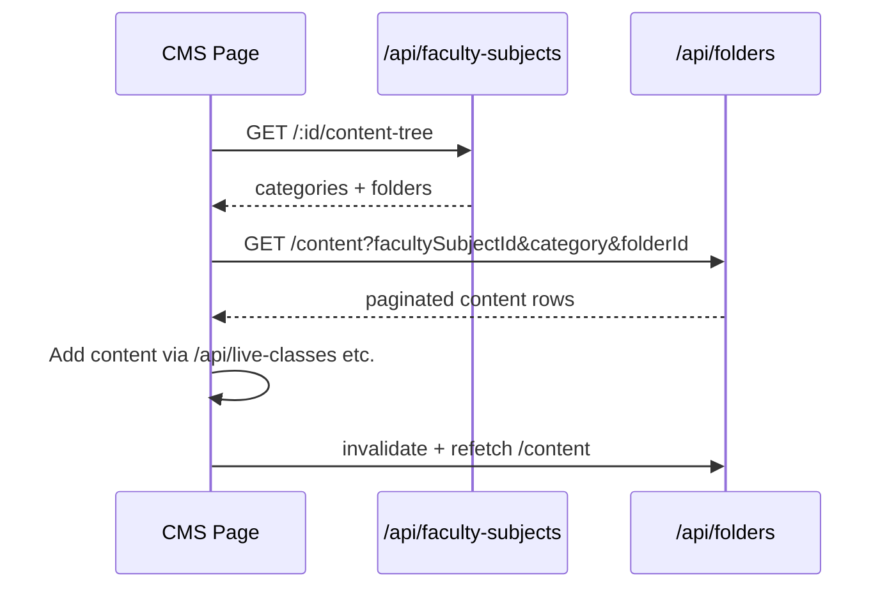
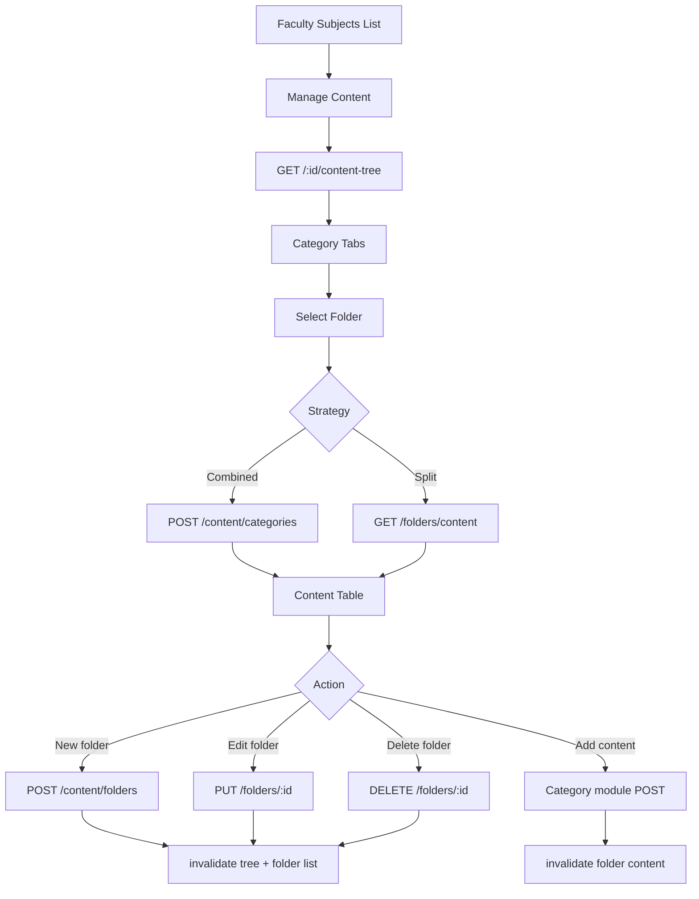
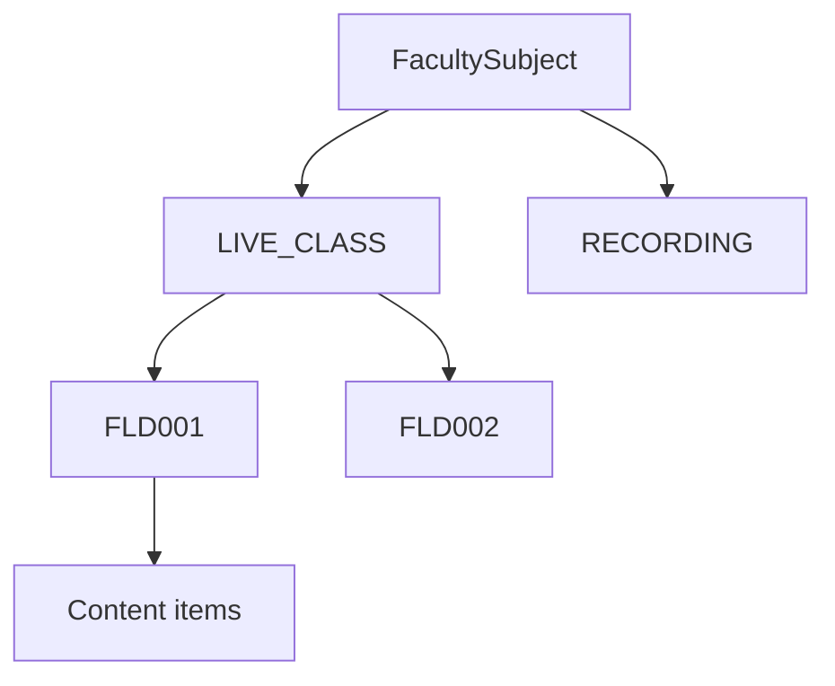
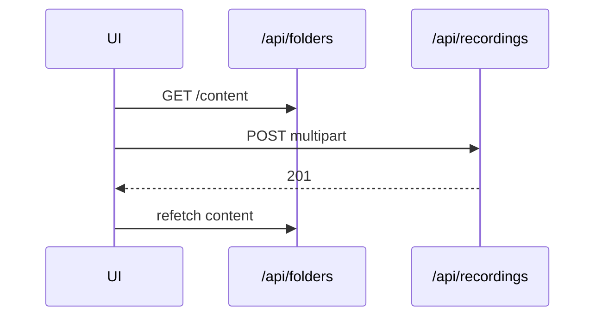
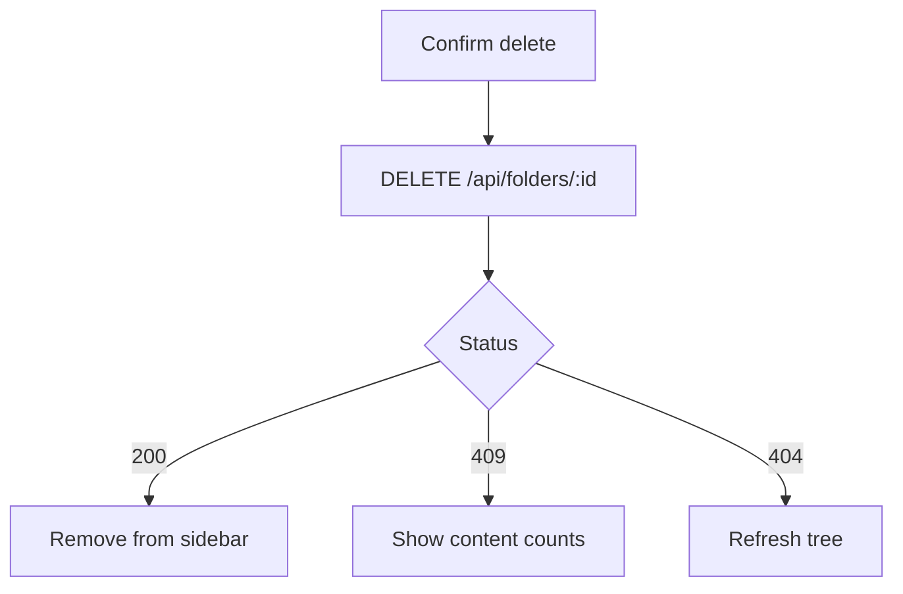

# Academics → Subject Content Folders — Frontend Integration

**Base paths:**

- Folders: `{VITE_API_BASE_URL}/api/folders`
- Folder create + CMS helpers: `{VITE_API_BASE_URL}/api/faculty-subjects/...`

**Auth:** Super Admin — `Authorization: Bearer <token>`

**Related docs:** [Index](./ACADEMICS_FACULTY_SUBJECTS_FRONTEND_INTEGRATION_README.md) · [Faculty Subjects CRUD](./ACADEMICS_FACULTY_SUBJECTS_CRUD_FRONTEND_INTEGRATION_README.md) · [Shared](./ACADEMICS_FACULTY_SUBJECTS_SHARED_FRONTEND_INTEGRATION_README.md)

---

## 1. Overview

**Subject Content Folders** group content items within one **Faculty Subject** and one **delivery category**.

| Property | Notes |
|----------|-------|
| Model | `SubjectContentFolder` |
| Display code | `folderId` → `FLD001` |
| Structure | **Flat** — no `parentFolderId`, no nested hierarchy |
| Uniqueness | `(facultySubjectId, category, folderName)` among non-deleted rows |
| Delete | Soft delete; blocked if folder contains content (`409`) |

Content items (live classes, recordings, PDFs, prelims tests, mains AW) reference `facultySubjectId` + `folderId` (Mongo `_id`).

---

## 2. API inventory

### `/api/folders` (8 routes)

| # | Method | Endpoint | Purpose |
|---|--------|----------|---------|
| 1 | `GET` | `/api/folders` | List folders |
| 2 | `POST` | `/api/folders/list` | Same — filters in body |
| 3 | `GET` | `/api/folders/:id` | Get folder |
| 4 | `PUT` | `/api/folders/:id` | Update folder |
| 5 | `DELETE` | `/api/folders/:id` | Soft delete |
| 6 | `GET` | `/api/folders/content` | List items in folder |
| 7 | `POST` | `/api/folders/content` | Same — params in body |
| 8 | `GET` | `/api/folders/:id/content-summary` | Aggregate counts |

### `/api/faculty-subjects` (CMS routes)

| # | Method | Endpoint | Purpose |
|---|--------|----------|---------|
| 1 | `GET` | `/:id/content-tree` | Left-nav folder map by category |
| 2 | `POST` | `/content/categories` | Sidebar folders + content table (combined) |
| 3 | `POST` | `/content/folders` | **Create folder** (only create path) |
| 4 | `PUT` | `/content/folders/:id` | Update folder (same handler as `/api/folders/:id`) |

---

## 3. Subject Content Folder Flow

### How folders work

1. **Flat structure** — siblings under `(facultySubjectId, category)`; no parent/child.
2. **Category scoping** — one category per folder; same name allowed across categories.
3. **Category must be enabled** — must appear in `FacultySubject.categories[]`.
4. **Navigation** — `content-tree` and `content/categories` show only `ACTIVE`, non-deleted folders.

### Creating folders

```http
POST /api/faculty-subjects/content/folders
Content-Type: application/json

{
  "facultySubjectId": "<FacultySubject Mongo _id>",
  "category": "LIVE_CLASS",
  "folderName": "Module 1",
  "description": "Optional"
}
```

→ `201` — use returned `data._id` as `folderId` in all content APIs.

### Loading the CMS UI

**Option A — Two-step**

1. `GET /api/faculty-subjects/:id/content-tree`
2. On folder click: `GET /api/folders/content?facultySubjectId=&category=&folderId=&page=1&limit=10`

**Option B — Combined (sidebar + table)**

1. `POST /api/faculty-subjects/content/categories` with `{ facultySubjectId, folderId, category, page, limit, sortBy, sortOrder }`

### Tree rendering

```text
Category tabs (facultySubject.categories[])
  └── Flat folder list (folderName ASC)
        └── Content table when folder selected
```

Do **not** implement nested folder lazy-load — backend does not support it.

### Lazy loading

| Data | Lazy? | API |
|------|-------|-----|
| Category tabs | No | `GET /:id/content-tree` |
| Folder list | On tab select | `GET /api/folders?facultySubjectId=&category=` |
| Folder contents | Yes — paginate | `GET /api/folders/content` |
| Summary cards | On folder select | `GET /api/folders/:id/content-summary` |

### Breadcrumbs

```text
Academics → Faculty Subjects → {subjectName} → {categoryLabel} → {folderName}
```

### Uploads

Folder APIs do **not** accept files. Upload via content modules:

| Category | Endpoint | Upload field |
|----------|----------|--------------|
| `RECORDING` | `POST /api/recordings` | `recording` (multipart) |
| `PDF` | `POST /api/subject-pdfs` | `pdf` (multipart) |
| `MAINS_ANSWER_WRITING` | `POST /api/mains-answer-writing` | `pdf` (multipart) |
| `LIVE_CLASS` | `POST /api/live-classes` | JSON |
| `PRELIMS_TEST` | `POST /api/prelims-tests` | JSON + question routes |

All require `facultySubjectId` + `folderId` (Mongo `_id`).

### Folder deletion

- `DELETE /api/folders/:id` — soft delete (`isDeleted: true`, `status: INACTIVE`)
- Blocked if content exists — `409` / `FOLDER_HAS_CONTENT` with per-type counts
- No cascade — delete content first
- No child folders to affect

### Editing folders

```text
PUT /api/faculty-subjects/content/folders/:id
PUT /api/folders/:id
```

Updatable: `folderName`, `description`, `status`. `INACTIVE` hides from content-tree sidebar.

### Moving content

No dedicated move API. Reassign via content module PUT (if supported) or delete + recreate.

### Sequence diagram



---

## 4. Endpoint reference — `/api/faculty-subjects` CMS routes

### 4.1 GET `/api/faculty-subjects/:id/content-tree`

**Path:** Mongo `_id` or `facultySubjectId` code.

```json
{
  "success": true,
  "facultySubjectId": "674a...",
  "subjectName": "Indian Polity – Live",
  "categories": ["LIVE_CLASS", "PDF"],
  "data": {
    "LIVE_CLASS": [{ "_id": "...", "folderId": "FLD001", "folderName": "Module 1" }],
    "RECORDING": [],
    "PRELIMS_TEST": [],
    "MAINS_ANSWER_WRITING": [],
    "PDF": []
  }
}
```

All five category keys always present. Only ACTIVE folders.

---

### 4.2 POST `/api/faculty-subjects/content/categories`

**Body**

| Field | Required |
|-------|----------|
| `facultySubjectId` | **Yes** — Mongo ObjectId |
| `folderId` | **Yes** — Mongo ObjectId |
| `category` | **Yes** — must match folder + be enabled on faculty subject |
| `page`, `limit`, `sortBy`, `sortOrder` | No |

**Success — `200 OK`**

```json
{
  "success": true,
  "facultySubjectId": "...",
  "facultySubjectCode": "FSU001",
  "subjectName": "Indian Polity",
  "category": "LIVE_CLASS",
  "categoryLabel": "Live Class",
  "selectedFolder": {
    "_id": "...",
    "folderId": "FLD001",
    "folderName": "Module 1",
    "category": "LIVE_CLASS",
    "description": "",
    "status": "ACTIVE",
    "lastUpdated": "2026-06-26T12:00:00.000Z"
  },
  "folderCount": 3,
  "folders": [
    { "_id": "...", "folderId": "FLD001", "folderName": "Module 1", "category": "LIVE_CLASS" }
  ],
  "content": {
    "total": 15,
    "page": 1,
    "limit": 10,
    "totalPages": 2,
    "count": 10,
    "facultySubjectName": "Indian Polity",
    "teacherName": "Dr Kumar",
    "folder": { "_id": "...", "folderId": "FLD001", "folderName": "Module 1", "category": "LIVE_CLASS" },
    "data": []
  }
}
```

**Errors:** `400` scope mismatch · `404` not found

---

### 4.3 POST `/api/faculty-subjects/content/folders` — Create

| Field | Required | Validation |
|-------|----------|------------|
| `facultySubjectId` | **Yes** | ACTIVE; category enabled |
| `category` | **Yes** | Enum |
| `folderName` | **Yes** | Unique per faculty subject + category |
| `description` | No | String |

**Success — `201 Created`**

**Errors:** `400` (may include `errorCode`, `field`, `suggestions`) · `409` duplicate name

---

### 4.4 PUT `/api/faculty-subjects/content/folders/:id`

Same as §5.4 below.

---

## 5. Endpoint reference — `/api/folders`

### 5.1 GET `/api/folders` — List

| Param | Required | Notes |
|-------|----------|-------|
| `facultySubjectId` | **Yes** | Mongo ObjectId |
| `category` | No | Enum |
| `search` | No | Regex on `folderName` |
| `status` | No | `ACTIVE` or `INACTIVE` |
| `page`, `limit` | No | Default 1 / 10, max limit 100 |

**Quirk:** `POST /api/folders/list` accepts filters in body but **`page` and `limit` must be in query string**.

```json
{
  "success": true,
  "total": 5,
  "page": 1,
  "limit": 10,
  "totalPages": 1,
  "count": 5,
  "data": [
    {
      "_id": "674b...",
      "folderId": "FLD001",
      "facultySubjectId": "674a...",
      "category": "LIVE_CLASS",
      "folderName": "Module 1",
      "description": "Week 1",
      "status": "ACTIVE",
      "createdAt": "...",
      "updatedAt": "..."
    }
  ]
}
```

---

### 5.2 POST `/api/folders/list`

Identical to GET — merges query + body for filters.

---

### 5.3 GET `/api/folders/:id`

**Success:** `{ "success": true, "data": formatFolder }`

**Errors:** `404`

---

### 5.4 PUT `/api/folders/:id` — Update

| Field | Validation |
|-------|------------|
| `folderName` | Non-empty; unique per category |
| `description` | String |
| `status` | `ACTIVE` or `INACTIVE` |

**Errors:** `400`, `404`, `409`

---

### 5.5 DELETE `/api/folders/:id`

**Success — `200`:** `{ "success": true, "message": "Folder deleted successfully", "data": { "_id": "..." } }`

**Errors — `409`**

```json
{
  "success": false,
  "errorCode": "FOLDER_HAS_CONTENT",
  "message": "Cannot delete folder: 12 item(s) still exist in this folder. Remove them first.",
  "field": "folderId",
  "details": {
    "liveClassCount": 5,
    "recordingCount": 3,
    "mainsAnswerWritingCount": 2,
    "subjectPdfCount": 1,
    "prelimsTestCount": 1,
    "contentCount": 12
  },
  "suggestions": ["Delete or move all content in this folder first.", "..."]
}
```

---

### 5.6 GET / POST `/api/folders/content`

| Param | Required |
|-------|----------|
| `facultySubjectId` | **Yes** |
| `category` | **Yes** |
| `folderId` | **Yes** — folder Mongo `_id` |
| `page`, `limit`, `sortBy`, `sortOrder` | No |

**Scope errors (`400`):**

- `Valid facultySubjectId is required`
- `Valid folderId is required`
- `folderId does not belong to the given facultySubjectId`
- `Folder category is X, expected Y`

**Sort fields by category**

| Category | `sortBy` options |
|----------|------------------|
| `LIVE_CLASS` | `createdAt`, `scheduledDate`, `classTitle`, `liveClassId` |
| `RECORDING` | `createdAt`, `lessonName`, `recordingId`, `viewCount` |
| `MAINS_ANSWER_WRITING` | `createdAt`, `testName`, `mainsAnswerWritingId`, `scheduleDate`, `resultDate` |
| `PDF` | `createdAt`, `pdfTitle`, `subjectPdfId`, `viewCount` |
| `PRELIMS_TEST` | `createdAt`, `testName`, `prelimsTestId`, `scheduleDate`, `resultDate`, `totalQuestions` |

**Content row key fields**

- **LIVE_CLASS:** `_id`, `liveClassId`, `classTitle`, `scheduledDate`, `publishStatus`, `classStatus`, `batches[]`, …
- **RECORDING:** `_id`, `recordingId`, `lessonName`, `visibility`, `recording`, `durationLabel`, `viewCount`, …
- **PDF:** `_id`, `subjectPdfId`, `pdfTitle`, `visibility`, `pdf`, `viewCount`, …
- **MAINS_ANSWER_WRITING:** `_id`, `mainsAnswerWritingId`, `testName`, `scheduleDate`, `publishStatus`, `pdf`, …
- **PRELIMS_TEST:** `_id`, `prelimsTestId`, `testName`, `totalQuestions`, `publishStatus`, `languageStats`, …

---

### 5.7 GET `/api/folders/:id/content-summary`

Category-specific counts. Example (RECORDING):

```json
{
  "success": true,
  "data": {
    "folderId": "FLD002",
    "folderName": "Recorded Lectures",
    "category": "RECORDING",
    "recordingCount": 24,
    "totalViews": 1580,
    "visibilityCount": 2,
    "publishedCount": 18,
    "draftCount": 3,
    "privateCount": 1
  }
}
```

LIVE_CLASS / MAINS / PRELIMS: `*Count`, `publishedCount`, `draftCount`, `unpublishedCount`. PRELIMS adds `totalQuestions`.

---

## 6. CMS page flow



---

## 7. Service layer

```typescript
// src/services/facultySubjectCmsService.ts (or extend facultySubjectService)
import api from './api';

const FS = '/api/faculty-subjects';

export const facultySubjectCmsService = {
  getContentTree: (id: string) => api.get(`${FS}/${id}/content-tree`),
  listContentCategories: (body) => api.post(`${FS}/content/categories`, body),
  createFolder: (body) => api.post(`${FS}/content/folders`, body),
  updateFolder: (id: string, body) => api.put(`${FS}/content/folders/${id}`, body),
};
```

```typescript
// src/services/subjectContentFolderService.ts
import api from './api';

const BASE = '/api/folders';

export const subjectContentFolderService = {
  listFolders: (params) => api.get(BASE, { params }),
  listFoldersPost: (body, pagination?: { page?: number; limit?: number }) =>
    api.post(`${BASE}/list`, body, { params: pagination }),
  getFolder: (id: string) => api.get(`${BASE}/${id}`),
  updateFolder: (id, body) => api.put(`${BASE}/${id}`, body),
  deleteFolder: (id: string) => api.delete(`${BASE}/${id}`),
  listFolderContent: (params) => api.get(`${BASE}/content`, { params }),
  listFolderContentPost: (body) => api.post(`${BASE}/content`, body),
  getContentSummary: (id: string) => api.get(`${BASE}/${id}/content-summary`),
};
```

---

## 8. React Query

### Query keys

```typescript
export const folderKeys = {
  all: ['subjectContentFolders'] as const,
  lists: () => [...folderKeys.all, 'list'] as const,
  list: (params) => [...folderKeys.lists(), params] as const,
  detail: (id: string) => [...folderKeys.all, 'detail', id] as const,
  content: (params) => [...folderKeys.all, 'content', params] as const,
  summary: (id: string) => [...folderKeys.all, 'summary', id] as const,
};

export const facultySubjectKeys = {
  // ... see CRUD doc
  contentTree: (id: string) => ['facultySubjects', 'contentTree', id] as const,
  contentCategories: (payload) => ['facultySubjects', 'contentCategories', payload] as const,
};
```

### Hooks

| Hook | Type | Invalidate on |
|------|------|---------------|
| `useContentTree(id)` | `useQuery` | folder create/update/delete |
| `useSubjectContentFolders(params)` | `useQuery` | folder mutations |
| `useFolderContent(params)` | `useQuery` | content module mutations |
| `useContentCategories(payload)` | `useQuery` | folder or content mutations |
| `useFolderContentSummary(id)` | `useQuery` | content mutations |
| `useCreateFolder()` | `useMutation` | contentTree + folderKeys.lists |
| `useUpdateFolder()` | `useMutation` | same + folderKeys.detail |
| `useDeleteFolder()` | `useMutation` | same; handle 409 counts |

Use `useQuery` + page state — not `useInfiniteQuery`.

---

## 9. Flow diagrams

### Flat folder hierarchy



### Upload flow



### Delete flow



---

## 10. Types

```typescript
interface SubjectContentFolder {
  _id: string;
  folderId: string;
  facultySubjectId: string;
  category: FacultyCategory;
  folderName: string;
  description: string;
  status: 'ACTIVE' | 'INACTIVE';
  createdAt: string;
  updatedAt: string;
}
```

---

## Integration checklist

- [ ] Content tree (`GET /:id/content-tree`)
- [ ] List folders (`GET /api/folders`)
- [ ] POST list with query pagination quirk
- [ ] Create folder (`POST /content/folders`)
- [ ] Update folder (either PUT path)
- [ ] Delete folder + `FOLDER_HAS_CONTENT` UI
- [ ] List folder content (`GET /folders/content`)
- [ ] Combined load (`POST /content/categories`)
- [ ] Content summary cards
- [ ] Flat folder sidebar (no nesting)
- [ ] Category tab gating
- [ ] Breadcrumbs
- [ ] Deep-link to content create with `folderId`
- [ ] React Query invalidation across tree + content

---

## Backend files

| File | Role |
|------|------|
| `routes/subjectContentFolderRoutes.js` | `/api/folders` routes |
| `routes/facultySubjectRoutes.js` | CMS + folder create routes |
| `controllers/subjectContentFolderController.js` | Folder handlers |
| `models/SubjectContentFolder.js` | Schema |
| `services/folderContentListService.js` | Content listing by category |
| `services/facultySubjectCategoryService.js` | Combined content/categories |
| `services/scheduleConflictService.js` | `assertFolderCanBeDeleted` |
| `utils/facultyContentHelpers.js` | `validateFolderPayload` |

---

*Folders doc aligned with `subjectContentFolderController.js`, `subjectContentFolderRoutes.js`, `folderContentListService.js`.*
