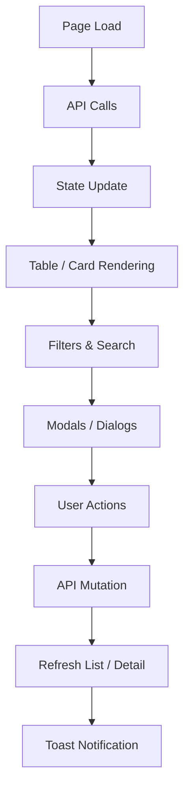
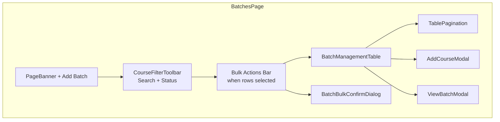
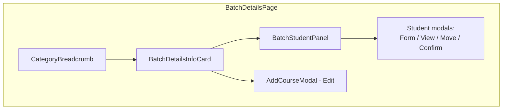
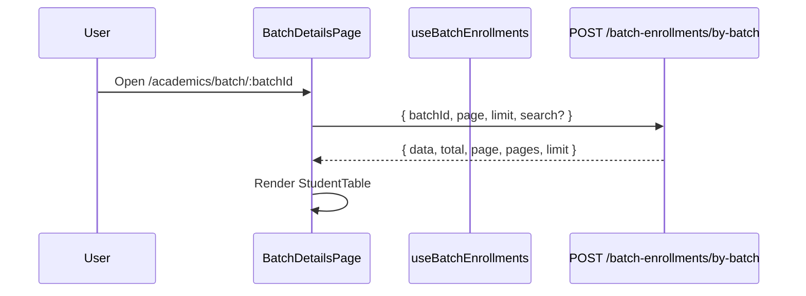
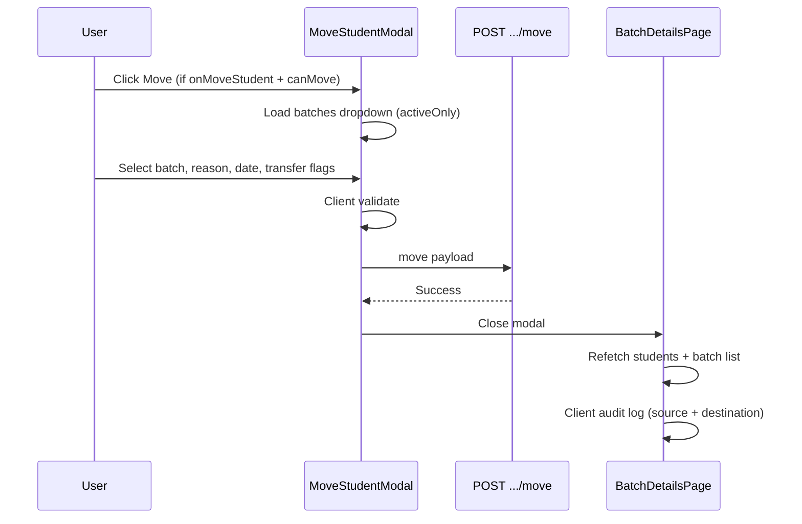
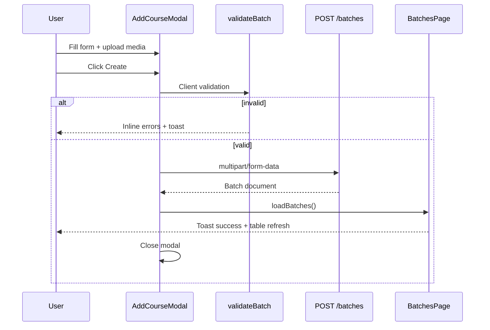

# Batch Module — Frontend Integration README

**Audience:** Frontend and backend developers integrating the Batch module with APIs  
**Source of truth:** `docs/BATCH_FRONTEND_COMPLETE_DOCUMENTATION.md` (current React implementation)  
**Scope:** Academics → Batch Management (list, create/edit, quick view, batch details, student management)  
**Last reviewed:** June 2026

---

## Table of Contents

1. [Overview](#1-overview)
2. [Frontend Architecture](#2-frontend-architecture)
3. [API Requirements](#3-api-requirements)
4. [Dropdown Requirements](#4-dropdown-requirements)
5. [Table Integration](#5-table-integration)
6. [Form Integration](#6-form-integration)
7. [Student Management API Flow](#7-student-management-api-flow)
8. [File Upload Requirements](#8-file-upload-requirements)
9. [Validation Requirements](#9-validation-requirements)
10. [Search & Filter Integration](#10-search--filter-integration)
11. [Error Handling](#11-error-handling)
12. [Response Mapping](#12-response-mapping)
13. [Complete Integration Flow](#13-complete-integration-flow)
14. [Backend Implementation Checklist](#14-backend-implementation-checklist)
15. [Frontend Integration Checklist](#15-frontend-integration-checklist)

---

## 1. Overview

### Purpose of the Batch module

The **Batch Manager** is an admin-panel module for creating and operating academic **batches** — scheduled cohorts linked to a catalog **course**, a **mentor**, **faculty subjects**, **fees**, **banner/brochure media**, and **student enrollments**.

Batches are the operational layer on top of courses (marketing/catalog content lives under Academics → Categories → Courses). The UI label is **Batch Manager**; routes use `/academics/batch`.

### Scope

| Area | In scope |
|------|----------|
| Batch list | Search, status filter, pagination, row selection, bulk activate/deactivate |
| Batch CRUD | Add, edit, duplicate, status toggle (Active ↔ Deactivated) |
| Media | Banner image, PDF brochure (required on create) |
| Fees | Currency, discount, online/offline amounts, bullet points |
| Subjects | Multi-select faculty subjects from Academics |
| Students | Table with payment, attendance, progress, status; add/edit/view/disable/enable/move |
| Audit | Local batch activity log (client-side storage only — **not** a backend audit API) |

**Out of scope in current frontend:**

- Batch delete (API exists; no UI trigger)
- Student delete (handler exists; no UI button)
- Demo video on batches (data model fields exist; no batch UI or multipart payload)
- Drawers, export/import, bulk student operations
- Course/Program/Center/Faculty/Mode/Language/date-range filters on batch list

### Integration goals

1. Backend APIs must return shapes and identifiers the frontend already maps (`mapBatchFromApi`, enrollment services).
2. Frontend developers wire existing components to live APIs without changing UI behaviour documented in the source doc.
3. Both teams align on Mongo `_id` vs human `batchId`/`batchCode` and enrollment `_id` vs display `enrollmentId`.
4. Student enrollment on Batch Details is **designed** but **not fully wired** in the current frontend — APIs should still be implemented per this guide.

### Overall frontend workflow

```
Login (JWT) → Batch List → [Filter/Search] → Table
                    ↓
        Add / Edit / Duplicate / Quick View / Details
                    ↓
        Batch Details → Student Management → Enrollment APIs
```

### Routes

| Route | Page | Component |
|-------|------|-----------|
| `/academics/batch` | Batch list | `BatchesPage` |
| `/academics/batch/:batchId` | Batch details + students | `BatchDetailsPage` |

**Legacy redirects:** `/academics/batches`, `/academics/batches/:batchId`, `/courses` → batch routes.

Navigation: **Academics → Batch** (details breadcrumb: Academics → Batch → Batch Details).

---

## 2. Frontend Architecture

### High-level flow



### Batch List Page (`/academics/batch`)



**Data hook:** `useBatchesData({ page, limit, search, status })` → `GET /api/batches`

### Batch Details Page (`/academics/batch/:batchId`)



**Data:** `GET /api/batches/:batchId` for detail; `useBatchEnrollments` for students (**currently `enabled: false`** — falls back to `DEMO_BATCH_STUDENTS`).

### Add/Edit Batch Modal

Three-step full-screen modal (`AddCourseModal`):

1. **Batch Details** — `BatchDetailsSection` (name, code, mentor, course, dates, status, banner, brochure)
2. **Fee Details** — `BatchFeeDetailsSection`
3. **Subject Details** — `BatchSubjectDetailsSection` (faculty subjects)

Footer: **Reset** | **Create / Update / Create Duplicate**

### State management

- **No Redux** — React local state + `BatchManagementContext`
- **List state restored** via router `location.state` (`listState`: search, status, page, pageSize) when navigating list ↔ details
- **Optimistic status** map during `PATCH /batches/status/:id`
- **Client-only audit:** `batchAuditStorage` (localStorage)

### Component hierarchy (summary)

```
BatchManagementLayout (BatchManagementProvider)
├── BatchesPage → table, filters, bulk bar, AddCourseModal, ViewBatchModal
└── BatchDetailsPage → info card, BatchStudentPanel, student modals, AddCourseModal
```

---

## 3. API Requirements

**Base path:** `/api` (via `axiosInstance`)  
**Authentication:** `Authorization: Bearer <JWT>` on all requests (unless `isFrontendOnly` mode).

---

### 3.1 Batch Listing

| Item | Detail |
|------|--------|
| **Purpose** | Paginated batch list for `BatchManagementTable` |
| **HTTP Method** | `GET` |
| **Suggested Endpoint** | `/api/batches` |
| **Headers** | `Authorization: Bearer <JWT>` |
| **Authentication** | Required |

**Query parameters:**

| Param | Type | Required | Notes |
|-------|------|----------|-------|
| `page` | number | No | Default `1` |
| `limit` | number | No | Default `10` on list page |
| `search` | string | No | Same trimmed value as below when search active |
| `batchId` | string | No | Duplicate of search string |
| `batchName` | string | No | Duplicate of search string |
| `courseName` | string | No | Duplicate of search string |
| `mentorName` | string | No | Duplicate of search string |
| `status` | string | No | `ACTIVE` or `INACTIVE`; omitted when filter is "All" |
| `courseId` | string | No | Optional |

**Request validation (backend):** Valid pagination; `status` enum if present.

**Expected success response:**

```json
{
  "data": [ /* Batch[] */ ],
  "total": 100,
  "page": 1,
  "limit": 10,
  "totalPages": 10
}
```

Flexible response unwrapping is supported by the frontend.

**Expected error response:** JSON with `message` (or axios-standard shape). 401/403/429/500 surfaced via toast.

**Frontend behaviour:**

| State | Behaviour |
|-------|-----------|
| **Loading** | Skeleton rows (`skeletonRowCount=8`) |
| **Empty** | Empty state CTA when no filters; "No batches match your filters." when filtered |
| **Error** | Toast + empty table |
| **Refresh** | After create/update/duplicate/status/bulk actions via `loadBatches()` |

**Dependencies:** `mapBatchFromApi`, `enrichBatchRow`, optional client `matchesBatchSearch()` filter after response.

---

### 3.2 Batch Details (Full)

| Item | Detail |
|------|--------|
| **Purpose** | Batch Details page info card; edit modal prefetch |
| **HTTP Method** | `GET` |
| **Suggested Endpoint** | `/api/batches/:batchId` |
| **Param** | Mongo `_id` or human `batchId` / `batchCode` |

**Expected success response:** Full batch document with nested `course`/`linkedCourse`, `mentor`, `fees`/`feesJson`, `facultySubjects`, optional embedded students, `totalStudents`.

**Expected error response:** 404 → redirect to list (may use cached nav row if available).

**Frontend behaviour:**

| State | Behaviour |
|-------|-----------|
| **Loading** | `BatchDetailsSkeleton` |
| **Empty/404** | Redirect to `/academics/batch` |
| **Refresh** | `refetchBatchDetails` after edit or enrollment mutations |

---

### 3.3 Batch Quick View

| Item | Detail |
|------|--------|
| **Purpose** | Read-only summary in `ViewBatchModal` |
| **HTTP Method** | `GET` |
| **Suggested Endpoint** | `/api/batches/:batchId/quick-view` |
| **Fallback** | Full `GET /batches/:id` on 404/500 |

**Expected success response:** Lighter payload with batch details, fees, subjects, banner URL, brochure URL, mentor, course names, created/modified dates.

**Not included in Quick View:** Student list, demo video, SEO, audit history, capacity, center.

**Frontend behaviour:**

| State | Behaviour |
|-------|-----------|
| **Loading** | Modal opens with list row data; overlay spinner while fetching |
| **Refresh** | Per open (no cache beyond modal session) |

---

### 3.4 Add Batch (Create)

| Item | Detail |
|------|--------|
| **Purpose** | Create new batch from `AddCourseModal` |
| **HTTP Method** | `POST` |
| **Suggested Endpoint** | `/api/batches` |
| **Content-Type** | `multipart/form-data` |

**Request payload (form fields):**

| Field | Type | Required |
|-------|------|----------|
| `batchName` | string | Yes |
| `batchCode` | string | Yes |
| `mentorId` | string | Yes |
| `courseId` | string | Yes (`academicCourseId \|\| courseId`) |
| `durationInMonths` | number | Yes (parsed from duration label) |
| `facultySubjects` | JSON string (array of subject IDs) | Yes |
| `feesJson` | JSON string | Yes |
| `status` | string | Yes (`ACTIVE` / `INACTIVE`) |
| `commencementDate` | date `YYYY-MM-DD` | Yes |
| `batchStartDate` | date | Yes |
| `batchEndDate` | date | Yes |
| `bannerImage` | File | Yes |
| `brochure` | File | Yes |

**Expected success response:** Batch document with Mongo `_id` + human `batchId`/`batchCode`.

**Expected error response:** 4xx with `message` for validation; 409 for duplicate name/code.

**Frontend behaviour:**

| State | Behaviour |
|-------|-----------|
| **Loading** | Submit disabled while `submitting`, `brochureUploading` |
| **Success** | Toast "Batch Created Successfully"; modal close; `loadBatches()`; local audit log |
| **Error** | Toast `err.message` or `Failed to save batch` |

---

### 3.5 Edit Batch (Update)

| Item | Detail |
|------|--------|
| **Purpose** | Update existing batch |
| **HTTP Method** | `PUT` |
| **Suggested Endpoint** | `/api/batches/:batchId` |
| **Content-Type** | `multipart/form-data` (same fields as create; files optional if unchanged) |

**Note:** `batchCode` is read-only in UI but may be sent on create/duplicate only.

**Frontend behaviour:** Additional `GET /batches/:mongoId` on modal open (edit only). Success → toast → `loadBatches()` (list) or `refetchBatchDetails` (details page).

---

### 3.6 Duplicate Batch

| Item | Detail |
|------|--------|
| **Purpose** | Clone batch with new name/code |
| **HTTP Method** | `POST` |
| **Suggested Endpoint** | `/api/batches/:sourceId/duplicate` |
| **Content-Type** | `multipart/form-data` (same as create) |

**Optional body field (not exposed in UI):** `includeStudents` (`true`/`false`).

**Frontend behaviour:** Form pre-filled from source; `batchId`/`batchCode` cleared; name suffixed `(Copy)`; footer label **Create Duplicate**.

---

### 3.7 Delete Batch

| Item | Detail |
|------|--------|
| **Purpose** | Remove batch |
| **HTTP Method** | `DELETE` |
| **Suggested Endpoint** | `/api/batches/:batchId` |

**Frontend behaviour:** API layer implemented; **no delete button** in list table or bulk bar. Handler exists on page but `BatchTableActions` ignores `onDelete`.

---

### 3.8 Batch Status Update (Single Row)

| Item | Detail |
|------|--------|
| **Purpose** | Toggle Active ↔ Deactivated |
| **HTTP Method** | `PATCH` |
| **Suggested Endpoint** | `/api/batches/status/:batchId` |

**Request body:**

```json
{ "status": "ACTIVE" | "INACTIVE" }
```

**Expected success response:** Updated batch document.

**Frontend behaviour:**

| State | Behaviour |
|-------|-----------|
| **Loading** | Row actions disabled while id in `statusUpdatingIds` |
| **Optimistic** | Status flipped immediately; reverted on failure |
| **Success** | `loadBatches()` + success toast |
| **Error** | Revert optimistic state + error toast |

---

### 3.9 Bulk Batch Status Update

| Item | Detail |
|------|--------|
| **Purpose** | Activate/deactivate multiple selected batches |
| **HTTP Method** | `PATCH` (sequential per batch) |
| **Suggested Endpoint** | `/api/batches/status/:batchId` (one call per selected row) |

**Frontend behaviour:** `BatchBulkConfirmDialog` → loop PATCH → clear selection → `loadBatches()` → toast. Buttons disabled while `bulkActionLoading`. **Bulk delete:** code path exists (`type: 'delete'`) but **no UI trigger**.

---

### 3.10 Brochure Upload (via Create/Update)

Handled as multipart field `brochure` on `POST`/`PUT` `/batches`. See [§8 File Upload Requirements](#8-file-upload-requirements).

**Download/Preview:** Uses URL from API (`brochureUrl`) — `window.open` (view) or `<a download>` (download). Not a separate download API in frontend.

---

### 3.11 Banner Image Upload (via Create/Update)

Handled as multipart field `bannerImage` on `POST`/`PUT` `/batches`. See [§8](#8-file-upload-requirements).

---

### 3.12 Demo Video

**Not integrated in Batch UI.** Form model includes `demoVideoUrl` etc., but:

- No upload component in batch forms
- `buildCreateBatchFormData` / `buildUpdateBatchFormData` do **not** append demo video
- Quick View does **not** display demo video

If API returns `demoVideoUrl`, frontend stores it in `formData` only. Demo video upload exists on **Categories → Courses**, not batches.

---

### 3.13 Batches Dropdown (Move Student)

| Item | Detail |
|------|--------|
| **Purpose** | Target batch options in `MoveStudentModal` |
| **HTTP Method** | `GET` |
| **Suggested Endpoint** | `/api/batches/dropdown` |

**Query:** `activeOnly=true`, optional `facultySubjectId`

**Response:** `{ data: Batch[] }`

**Also available (not used in move modal UI):** `POST /api/batches/dropdown` with `{ facultySubjectId, centerId }`.

---

### 3.14 Student List (by Batch)

| Item | Detail |
|------|--------|
| **Purpose** | Student Management table on Batch Details |
| **HTTP Method** | `POST` |
| **Suggested Endpoint** | `/api/batch-enrollments/by-batch` |

**Request body:**

```json
{
  "batchId": "<Mongo ObjectId>",
  "page": 1,
  "limit": 10,
  "search": "optional",
  "paymentStatus": "optional",
  "status": "optional"
}
```

**Requires:** `batchId` = valid Mongo ObjectId (human batch codes must be resolved first).

**Expected success response:**

```json
{
  "data": [ /* Enrollment[] */ ],
  "total": 50,
  "page": 1,
  "pages": 5,
  "limit": 10
}
```

**Frontend behaviour (when wired):**

| State | Behaviour |
|-------|-----------|
| **Loading** | `StudentTableSkeleton` |
| **Empty** | Empty state with Add Student CTA |
| **Error 404/502/503** | Empty list (no error toast in hook) |
| **Current gap** | `useBatchEnrollments` has `enabled: false` — demo data shown |

---

### 3.15 Student Detail (View/Edit Prefetch)

| Item | Detail |
|------|--------|
| **Purpose** | Single enrollment for `StudentViewModal` / edit prefetch |
| **HTTP Method** | `POST` |
| **Suggested Endpoint** | `/api/batch-enrollments/detail` |

**Request body:** `{ "id": "<mongoId>", "enrollmentId": "<displayId>" }` (either identifier)

---

### 3.16 Add Student (Create Enrollment)

| Item | Detail |
|------|--------|
| **Purpose** | Enroll student in batch |
| **HTTP Method** | `POST` |
| **Suggested Endpoint** | `/api/batch-enrollments` |

**Request body:**

```json
{
  "studentName": "string",
  "email": "string",
  "mobileNumber": "string",
  "batchId": "<Mongo ObjectId>",
  "paymentStatus": "PAID|PENDING|PARTIAL|OVERDUE|FAILED",
  "attendancePercentage": 0,
  "courseProgressPercentage": 0
}
```

**Frontend behaviour (when wired):** Refetch enrollment list + batch detail (`totalStudents`) + toast.

**Current gap:** `handleAddStudent` implemented but **not passed** to `BatchStudentPanel`.

---

### 3.17 Edit Student (Update Enrollment)

| Item | Detail |
|------|--------|
| **Purpose** | Update enrollment fields |
| **HTTP Method** | `PUT` |
| **Suggested Endpoint** | `/api/batch-enrollments/:enrollmentId` |

**Request body (partial):**

```json
{
  "studentName": "optional",
  "email": "optional",
  "mobileNumber": "optional",
  "paymentStatus": "PAID|PENDING|PARTIAL|OVERDUE|FAILED",
  "attendancePercentage": 0,
  "courseProgressPercentage": 0
}
```

**Note:** `:enrollmentId` is Mongo `_id` (`enrollmentApiId`), not display `enrollmentId`.

---

### 3.18 Disable / Enable Student

| Item | Detail |
|------|--------|
| **Purpose** | Toggle enrollment account status |
| **HTTP Method** | `PATCH` |
| **Suggested Endpoint** | `/api/batch-enrollments/status/:enrollmentId` |

**Request body:**

```json
{ "status": "ACTIVE" | "INACTIVE" }
```

**UI mapping:** Disable sends `INACTIVE`; Enable sends `ACTIVE`. Disable requires confirm dialog (`BatchConfirmDialog`).

---

### 3.19 Move Student to Another Batch

| Item | Detail |
|------|--------|
| **Purpose** | Transfer enrollment to destination batch |
| **HTTP Method** | `POST` |
| **Suggested Endpoint** | `/api/batch-enrollments/:enrollmentId/move` |

**Request body:**

```json
{
  "toBatchId": "<Mongo or human batch id>",
  "transferReason": "string (max 500)",
  "effectiveTransferDate": "YYYY-MM-DD",
  "transferAttendanceRecords": true,
  "transferFeeRecords": true,
  "transferTestRecords": true,
  "paymentStatus": "optional",
  "attendancePercentage": "optional",
  "courseProgressPercentage": "optional"
}
```

**Note:** Page handler always sends `transferTestRecords: true`. Notify-student is stored as text suffix in `remarks` when used in move modal (not a separate API field from page handler).

**Pre-checks (client before API):**

- Target ≠ current batch
- Target status Active
- Target has available seats (`capacity` default 50 minus current strength)
- User has move role (Super Admin, Operation Admin, or Center Admin)
- Valid Mongo enrollment id

**Frontend after success:** Refetch students, refetch batch list, client audit log on source + destination batches.

**Current gap:** `onMoveStudent` passed as **no-op** when user **can** move; `undefined` when user **cannot** move (inverted wiring).

---

### 3.20 Delete Student Enrollment

| Item | Detail |
|------|--------|
| **Purpose** | Remove enrollment |
| **HTTP Method** | `DELETE` |
| **Suggested Endpoint** | `/api/batch-enrollments/:enrollmentId` |

**Frontend behaviour:** Handler exists; confirm dialog exists; **no delete button** in student row actions.

---

### 3.21 Mentor Dropdown

| Item | Detail |
|------|--------|
| **Purpose** | Mentor picker in Add/Edit batch form |
| **HTTP Method** | `GET` |
| **Suggested Endpoint** | `/api/admin/admin-access/mentors/dropdown` |

See [§4 Dropdown Requirements](#4-dropdown-requirements).

---

### 3.22 Course Catalog (Batch Form)

| Item | Detail |
|------|--------|
| **Purpose** | Course picker (`CourseCatalogSelect`) |
| **Source** | Academic courses catalog API (via academics module) |

Stored: `academicCourseId` (Mongo), `courseId` (human code), `courseName`.

---

### 3.23 Faculty Subjects Dropdown

| Item | Detail |
|------|--------|
| **Purpose** | Subject multi-select in batch form |
| **Source** | `getFacultySubjectsDropdown` (faculty subjects API module); local academics fallback |

Excludes subjects with status `In Active`.

---

## 4. Dropdown Requirements

Only dropdowns **actually used** in the Batch module frontend are documented below.

---

### 4.1 Status (Batch List Filter)

| Item | Detail |
|------|--------|
| **Purpose** | Filter batches by operational status |
| **Expected API** | `GET /api/batches?status=` |
| **Options (UI)** | `all` → "All Statuses"; `Active`; `Deactivated` |
| **API mapping** | `all` → no param; `Active` → `ACTIVE`; `Deactivated` → `INACTIVE` |
| **Display label** | All Statuses / Active / Deactivated |
| **Stored value** | `all` \| `Active` \| `Deactivated` |
| **Default** | `all` |
| **Sorting** | Fixed order in UI |
| **Filtering** | Server-side via query param |
| **Search support** | No |
| **Dependencies** | Resets page to 1 and clears row selection on change |

---

### 4.2 Status (Batch Add/Edit Form)

| Item | Detail |
|------|--------|
| **Purpose** | Set batch operational status on create/update |
| **Expected API** | Sent in multipart as `status`: `ACTIVE` / `INACTIVE` |
| **Options** | `Active`, `Deactivated` |
| **Display label** | Active / Deactivated |
| **Stored value** | `Active` \| `Deactivated` (UI) → `ACTIVE` \| `INACTIVE` (API) |
| **Default** | `Active` |
| **Required** | Yes |

---

### 4.3 Mentor (Batch Form)

| Item | Detail |
|------|--------|
| **Purpose** | Assign batch mentor |
| **Expected API** | `GET /api/admin/admin-access/mentors/dropdown` |
| **Expected response** | Array of mentor employee records |
| **Required fields** | `mentorId` or `mentorEmail` (at least one) |
| **Stored fields** | `mentorId`, `mentorEmail`, `mentorEmployeeId`, `mentorName`, `mentorRoleId`, `mentorRoleLabel`, `trainerName` |
| **Display label** | Mentor name from API |
| **Stored value** | `mentorId` (primary) |
| **Search support** | Yes (searchable select) |
| **Dependencies** | Fallback option if edit-row mentor not in list |

---

### 4.4 Course (Batch Form)

| Item | Detail |
|------|--------|
| **Purpose** | Link batch to academic course |
| **Expected API** | Academic courses catalog (`CourseCatalogSelect`) |
| **Required fields** | `academicCourseId` (Mongo), `courseId` (human code), `courseName` |
| **Display label** | Course name |
| **Stored value** | `academicCourseId`; API multipart `courseId` = `academicCourseId \|\| courseId` |
| **Search support** | Yes |
| **Required** | Yes |

---

### 4.5 Faculty Subject (Batch Form)

| Item | Detail |
|------|--------|
| **Purpose** | Add faculty subjects to batch |
| **Expected API** | Faculty subjects dropdown API |
| **Required fields** | `subjectId`, `subjectName`, `facultyId`, `facultyName` in `linkedSubjects[]` |
| **Display label** | Subject name (+ faculty label on chips) |
| **Stored value** | `subjectId`; API sends `facultySubjects` JSON array of IDs |
| **Filtering** | Excludes `In Active` subjects |
| **Search support** | Yes (`FacultySubjectSearchSelect`) |
| **Required** | At least one subject |
| **Dependencies** | Local academics fallback if API unavailable |

---

### 4.6 Currency (Batch Fee Form)

| Item | Detail |
|------|--------|
| **Purpose** | Fee currency for online/offline amounts |
| **Expected API** | Part of `feesJson` on create/update (not a separate dropdown API) |
| **Options** | INR (₹), USD ($), EUR (€) |
| **Display label** | Currency code with symbol |
| **Stored value** | `INR` \| `USD` \| `EUR` |
| **Default** | `INR` |

---

### 4.7 Payment Status (Student Form)

| Item | Detail |
|------|--------|
| **Purpose** | Enrollment payment state |
| **Expected API** | Field on `POST`/`PUT` batch-enrollments |
| **UI values** | `Paid`, `Pending`, `Partial`, `Overdue` |
| **API values** | `PAID`, `PENDING`, `PARTIAL`, `OVERDUE`, `FAILED` |
| **Display label** | `PaymentStatusBadge` in table |
| **Default** | `Pending` |

---

### 4.8 Target Batch (Move Student Modal)

| Item | Detail |
|------|--------|
| **Purpose** | Select destination batch for transfer |
| **Expected API** | `GET /api/batches/dropdown?activeOnly=true` merged with prop list |
| **Required fields** | Batch id (Mongo or human), status, capacity/strength for seat check |
| **Display label** | Batch name / id from dropdown |
| **Stored value** | `targetBatchId` → API `toBatchId` |
| **Filtering** | Active batches only; excludes current batch; must have available seats |
| **Search support** | Per select component behaviour |
| **Dependencies** | `canTransferToBatch` client validation |

---

### Not present on batch list UI

The following are **not** used as batch list filters: Batch, Course, Program, Faculty, Center, Mentor (dedicated), Mode, Language, Start/End date range, Accounts.

---

## 5. Table Integration

### 5.1 Batch List Table (`BatchManagementTable`)

**Pagination:** Server-controlled. Default page size **10**. No column sorting. No per-column filters beyond global search/status.

| Column | API / Data Field | Formatting | Sort | Filter | Search |
|--------|------------------|------------|------|--------|--------|
| **Select** | Row `id` (Mongo/human string) | Checkbox, 44px column | — | — | — |
| **Batch ID** | `batchId` or `batchCode` | Mono, bold, blue link; truncated + tooltip | — | Global search | Yes |
| **Batch Name** | `batchName` or `name` | Semibold; sub-line **Merged Into: {name}** if `mergedIntoName` | — | Global search | Yes |
| **Mentor Name** | `mentorName`, `trainerName`, mentor record | Gray medium; `—` if empty | — | Global search | Yes |
| **Start Date** | `batchStartFrom` / `commencement` | `DD Mon YYYY` (en-IN); `—` if empty | — | — | No |
| **End Date** | `batchEndTo` | Same as Start Date | — | — | No |
| **Students** | `totalStudents` | Pill button + Users icon + count | — | — | No |
| **Status** | Normalized `Active` / `Deactivated` | `StatusBadge` green/amber | — | Status dropdown | No |
| **Actions** | — | View, Edit, Duplicate, Activate/Deactivate | — | — | — |

**Empty state:**

- No batches, no filters → empty state with **Add Batch** CTA
- Filters active, no matches → "No batches match your filters."

**Row actions disabled** while row id is in `statusUpdatingIds`.

---

### 5.2 Student Management Table (`BatchStudentPanel`)

| Column | API / Data Field | Formatting | Example |
|--------|------------------|------------|---------|
| **Student ID** | `enrollmentId` | Mono blue | `ENR-2025-1001` |
| **Student Name** | `name` | Avatar initials + semibold | `Priya Sharma` |
| **Phone Number** | `phone` / `mobileNumber` | Plain text | `9876543210` |
| **Email** | `email` | Plain text | `priya@email.com` |
| **Enrollment Date** | `enrolledAt` | Date or `—` | `2025-06-15` |
| **Fee Status** | `paymentStatus` | `PaymentStatusBadge` | `Paid` |
| **Attendance %** | `attendancePercentage` (0–100) | Bold centered `%` | `92%` |
| **Progress** | `courseProgressPercentage` (0–100) | `ProgressBar` | Bar at 80% |
| **Status** | `Active` / `Deactivated` | `StudentEnrollmentStatusBadge` | `Active` |
| **Actions** | — | View, Edit, Disable/Enable, Move | — |

**Pagination:** Server mode — `page`, `pageSize` (default 10), `totalItems` from API meta. Client/demo mode — `usePagination` on filtered list.

**Row styling:** Inactive students — reduced opacity, gray background. Hover — blue left accent.

**Empty state:** Add Student CTA when no students.

**No** column sorting or multi-select bulk operations on student table.

---

## 6. Form Integration

### 6.1 Add Batch / Edit Batch Form

#### Batch Details section

| Frontend Field | Backend Field | Type | Required | Validation | Default | Notes |
|----------------|---------------|------|----------|------------|---------|-------|
| `batchName` | `batchName` | string | Yes | Non-empty; unique (client) | — | Placeholder: `e.g. UPSC Batch 1` |
| `batchCode` | `batchCode` | string | Yes | Non-empty; unique; **read-only on edit** | — | Placeholder: `e.g. UPSC-B01` |
| Mentor select | `mentorId` | string | Yes | `mentorId` or `mentorEmail` | — | Searchable select |
| Course select | `courseId` | string | Yes | `academicCourseId` or `courseId` | — | Mongo id sent as `courseId` in multipart |
| `commencement` | `commencementDate` | date `YYYY-MM-DD` | Yes | Non-empty | — | Label: Date of Commencement |
| `durationLabel` | `durationInMonths` | string → number | Yes | Non-empty; `6 Months`→6, `1 Year`→12 | — | Free-form label in UI |
| `batchStartFrom` | `batchStartDate` | date | Yes | Non-empty; end ≥ start | — | |
| `batchEndTo` | `batchEndDate` | date | Yes | Non-empty; ≥ start | — | |
| `status` | `status` | enum | Yes | `ACTIVE`/`INACTIVE` | `Active` | |
| `bannerFile` / preview | `bannerImage` | File | Yes* | JPG/PNG/WEBP, max 5 MB | — | *URL, fileName, or file |
| `brochureFile` / url | `brochure` | File (PDF) | Yes* | PDF only, max 10 MB | — | *URL, fileName, or file |

#### Fee Details section

| Frontend Field | Backend Field (`feesJson`) | Type | Required | Validation | Default |
|----------------|---------------------------|------|----------|------------|---------|
| `feeDetails.currency` | `currency` | enum | Yes | INR/USD/EUR | `INR` |
| `feeDetails.discountFee` | `discountAmount` | number | No | min 0 | — |
| `feeDetails.onlinePaymentAmount` | `onlineAmount` | number | Yes | min 0 | — |
| `feeDetails.offlinePaymentAmount` | `offlineAmount` | number | Yes | min 0 | — |
| `feeDetails.onlinePaymentBullets` | `onlineBulletPoints` | string[] | Yes | ≥1 non-empty line | — |
| `feeDetails.offlinePaymentBullets` | `offlineBulletPoints` | string[] | Yes | ≥1 non-empty line | — |

**Not in batch fee UI:** Installments, scholarship, registration fee.

#### Subject Details section

| Frontend Field | Backend Field | Type | Required | Validation |
|----------------|---------------|------|----------|------------|
| `linkedSubjects[]` | `facultySubjects` | JSON array of subject IDs | Yes | ≥1 subject; exclude In Active |

Each chip: `{ subjectId, subjectName, facultyId, facultyName }`.

#### Duplicate mode extras

- `batchId` and `batchCode` cleared; name suffixed `(Copy)` if not already
- Submit → `POST /batches/:sourceId/duplicate`
- Footer: **Create Duplicate**

---

### 6.2 Student Form (`StudentFormModal`)

| Frontend Field | Backend Field | Type | Required | Validation | Default |
|----------------|---------------|------|----------|------------|---------|
| `name` | `studentName` | string | Yes | HTML `required` | — |
| `email` | `email` | email | Yes | `type="email"` + `required` | — |
| `phone` | `mobileNumber` | string | Yes | HTML `required` | — |
| Course (read-only) | — | string | — | From parent batch | — |
| Batch (read-only) | `batchId` | string | Yes | Mongo id on submit | Current batch |
| `paymentStatus` | `paymentStatus` | enum | No | UI enum | `Pending` |
| `attendance` | `attendancePercentage` | number | No | min 0, max 100 | — |
| `progress` | `courseProgressPercentage` | number | No | min 0, max 100 | — |

---

### 6.3 Move Student Form (`MoveStudentModal`)

| Frontend Field | Backend Field | Type | Required | Validation | Default |
|----------------|---------------|------|----------|------------|---------|
| `targetBatchId` | `toBatchId` | string | Yes | Active, ≠ current, has seats | — |
| `transferReason` | `transferReason` | string | Yes | max 500 chars | — |
| `transferDate` | `effectiveTransferDate` | date | Yes | ≤ today | — |
| `transferAttendance` | `transferAttendanceRecords` | boolean | No | — | `true` |
| `transferFee` | `transferFeeRecords` | boolean | No | — | `true` |
| Transfer tests (handler) | `transferTestRecords` | boolean | No | Always `true` from page | `true` |
| Notify student (UI) | `remarks` suffix | string | No | Appended to remarks text | — |

---

## 7. Student Management API Flow

### 7.1 Integration status (current frontend)

| Feature | Status |
|---------|--------|
| `useBatchEnrollments` hook | **`enabled: false`** — does not fetch real enrollments |
| Handlers on `BatchDetailsPage` | Implemented but **not passed** to `BatchStudentPanel` |
| Student table data | Falls back to **`DEMO_BATCH_STUDENTS`** when no real students |
| `onMoveStudent` | **No-op** when user **can** move; `undefined` when user **cannot** |

Backend should implement APIs below; frontend wiring may complete separately.

---

### 7.2 Student List Flow



**Search:** 400 ms debounce when server-paginated; resets page to 1.

**Client mode fields:** `name`, `email`, `enrollmentId`, `phone` (substring, lowercase).

**Server mode:** `search` in POST body.

---

### 7.3 Add Student Flow

1. User clicks **Add Student**
2. `StudentFormModal` opens (course/batch read-only from parent)
3. User submits → `POST /batch-enrollments`
4. On success: refetch enrollments, refetch batch detail (`totalStudents`), toast

---

### 7.4 View Student Flow

1. User clicks **View** (eye)
2. `StudentViewModal` opens
3. Optional `POST /batch-enrollments/detail` for latest data
4. Sections: Profile, Enrollment, Batch, Payments, Attendance, Progress, Status
5. Close modal — no mutation

---

### 7.5 Edit Student Flow

1. User clicks **Edit** (pencil)
2. `StudentFormModal` edit mode; may prefetch via `getEnrollmentById`
3. Submit → `PUT /batch-enrollments/:enrollmentId` (Mongo id)
4. Refetch list + toast

---

### 7.6 Disable Student Flow

1. Visible only when student status **Active**
2. User clicks **Disable** → `BatchConfirmDialog`
3. Confirm → `PATCH /batch-enrollments/status/:id` with `{ "status": "INACTIVE" }`
4. Status badge → Deactivated; row styling inactive

---

### 7.7 Enable Student Flow

1. Visible only when student **inactive** (not in demo mode restrictions)
2. User clicks **Enable** → direct `PATCH` with `{ "status": "ACTIVE" }`
3. No confirm dialog

---

### 7.8 Move Student Flow



**Move permission:** Super Admin, Operation Admin, or Center Admin (`STUDENT_MOVE_ROLES`).

**Select Batch:** `GET /batches/dropdown?activeOnly=true`

**Transfer Reason:** Required, max 500 characters

**Effective Transfer Date:** Required, must be ≤ today

**Transfer Attendance History:** `transferAttendanceRecords` (default `true`)

**Transfer Payment Records:** `transferFeeRecords` (default `true`)

**Transfer Test Records:** `transferTestRecords` (always `true` from page handler)

**Notify Student:** UI flag → text suffix in `remarks` (not separate API field from page handler)

**Expected request payload:**

```json
{
  "toBatchId": "<destination batch id>",
  "transferReason": "Schedule change",
  "effectiveTransferDate": "2026-06-20",
  "transferAttendanceRecords": true,
  "transferFeeRecords": true,
  "transferTestRecords": true
}
```

**Client error toasts (pre-API):**

- `Cannot move to the same batch`
- `Target batch has no available seats`
- `Cannot move student to an inactive batch`

**Frontend update after success:** Student removed from source batch list; refetch enrollments; refetch batch list; local audit entries.

---

### 7.9 Attendance, Progress, Fee Status

| Feature | Implementation |
|---------|----------------|
| **Attendance** | Editable in Add/Edit form (`attendancePercentage`); displayed in table and view modal — not a separate API screen |
| **Progress** | Editable in Add/Edit form (`courseProgressPercentage`); `ProgressBar` in table |
| **Fee Status** | `paymentStatus` on create/update; `PaymentStatusBadge` in table |
| **History / Timeline** | Not implemented |
| **Communication / Remarks** | Move modal only (`remarks` / notify flag) |

---

## 8. File Upload Requirements

### 8.1 Banner Image

| Rule | Value |
|------|-------|
| **Component** | `BannerImageUpload` |
| **Accepted types** | JPG, PNG, WEBP |
| **Max size** | 5 MB (`IMAGE_BANNER` profile) |
| **Recommended dimensions** | 1920×600 px (min 800×200) |
| **Multipart field name** | `bannerImage` |
| **Methods** | Drag-and-drop, browse |
| **Required** | Yes on create (preview, file name, or new file) |
| **Edit behaviour** | Existing URL satisfies required check; new file appended only when user selects File |
| **Success response** | Stable HTTPS URL on batch document for subsequent edits |
| **Failure** | Inline validation from `validateUploadFile`; form error `Banner image is required` |
| **Preview** | Client preview URL (blob or HTTPS) |
| **Replacement** | New file replaces preview state |

### 8.2 Batch Brochure (PDF)

| Rule | Value |
|------|-------|
| **Component** | `BrochurePdfUpload` |
| **Accepted types** | PDF only (`.pdf`, `application/pdf`) |
| **Max size** | 10 MB (`PDF_STANDARD`) |
| **Multipart field name** | `brochure` |
| **Methods** | Drag-and-drop, Browse File |
| **Processing** | Client reads file as **data URL** for preview; File sent on save |
| **Required** | Yes on create |
| **UI states** | Empty drop zone; uploading spinner (`Reading PDF…`, `Upload ready`); populated file card |
| **Actions** | View PDF (`window.open`), Download (`<a download>`), Replace, Remove |
| **Remove** | Clears URL, name, size, file reference |
| **Failure messages** | Profile validation; `Failed to process brochure PDF. Please try again.`; `Batch brochure is required` |
| **Submit block** | Submit disabled while `brochureUploading`; toast `Please wait for the brochure upload to finish` |

### 8.3 Demo Video

**Not applicable** to Batch module UI. No multipart field sent for batches.

---

## 9. Validation Requirements

Backend validation should align with frontend rules so users see consistent errors via `getApiErrorMessage` and inline field errors.

### 9.1 Batch form (`validateBatch`)

| Field | Frontend Rule | Suggested Backend Alignment |
|-------|---------------|----------------------------|
| `batchName` | Required; unique among batches | 400/409 duplicate name |
| `batchCode` | Required; unique; immutable on edit | 400/409 duplicate code; reject code change on update |
| Mentor | `mentorId` or `mentorEmail` required | 400 if missing/invalid |
| Course | `academicCourseId` or `courseId` required | 400 if missing/invalid |
| `commencement` | Required | 400 if missing |
| `durationLabel` | Required; parseable to months | 400 if empty/invalid |
| `batchStartFrom` | Required | 400 if missing |
| `batchEndTo` | Required; ≥ start | 400 with `End date cannot be before start date` |
| `status` | Required | 400 if missing |
| Banner | preview, fileName, or file required | 400 if missing on create |
| Brochure | url, fileName, or file required | 400 if missing on create |
| `linkedSubjects` | length ≥ 1 | 400 if empty |
| `onlinePaymentAmount` | Required | 400 if missing |
| `offlinePaymentAmount` | Required | 400 if missing |
| `onlinePaymentBullets` | ≥ 1 line | 400 if empty array |
| `offlinePaymentBullets` | ≥ 1 line | 400 if empty array |
| `batchId` | Unique on create only | 409 if duplicate human id |

### 9.2 Banner file profile (`IMAGE_BANNER`)

- Types: JPG, PNG, WEBP
- Max 5 MB

### 9.3 Brochure file profile (`PDF_STANDARD`)

- PDF only, max 10 MB

### 9.4 Student form

| Field | Rule |
|-------|------|
| `name` | HTML `required` |
| `email` | `type="email"` + `required` |
| `phone` | `required` |
| `attendance` | min 0, max 100 |
| `progress` | min 0, max 100 |

### 9.5 Move student form

| Field | Rule | Error |
|-------|------|-------|
| Target batch | Required; active; not same; has seats | Various `errors.batch` |
| `transferReason` | Required; max 500 chars | `Transfer reason is required` |
| `transferDate` | Required; ≤ today | `Transfer date is required` |

---

## 10. Search & Filter Integration

### 10.1 Batch list search

| Attribute | Value |
|-----------|-------|
| **Placeholder** | `Search by batch ID, name, course, or mentor...` |
| **Debounce** | **300 ms** (`useDebouncedValue`) |
| **Case sensitivity** | Insensitive |
| **Reset on change** | Page → 1; clear row selection |

**Server:** When search non-empty, send duplicate query keys: `search`, `batchId`, `batchName`, `courseName`, `mentorName` (same trimmed string).

**Client fallback:** After API response, `matchesBatchSearch()` across `batchId`, `batchCode`, `batchName`, `name`, `courseName`, `linkedCourseName`, display name, `mentorName`, `trainerName`, resolved mentor label.

### 10.2 Batch list status filter

| UI Value | Query Param |
|----------|-------------|
| All Statuses | (omit) |
| Active | `status=ACTIVE` |
| Deactivated | `status=INACTIVE` |

Resets page to 1 and clears selection on change.

### 10.3 Student search (Batch Details)

| Attribute | Value |
|-----------|-------|
| **Placeholder** | `Search students...` |
| **Debounce** | **400 ms** (server-paginated mode) |
| **Reset** | Student page → 1 on search change |
| **Client fields** | `name`, `email`, `enrollmentId`, `phone` |
| **Server field** | `search` in `POST /batch-enrollments/by-batch` body |

### 10.4 Sorting

- **Batch table:** No column sorting in UI
- **Student table:** No column sorting in UI

### 10.5 Combined filtering

Batch list: search + status filter combine server-side. Enrollment list supports `paymentStatus` and `status` in service layer but **not exposed** in current student UI filters.

### 10.6 Pagination defaults

| Endpoint | Default `page` | Default `limit` |
|----------|----------------|-----------------|
| `GET /batches` | 1 | 10 (list); 500 for details prefetch |
| `POST /batch-enrollments/by-batch` | 1 | 10 |

Changing page size or filters resets page appropriately per above rules.

---

## 11. Error Handling

### 11.1 Batch list

| Condition | Frontend behaviour |
|-----------|-------------------|
| **Loading** | Skeleton rows (8) |
| **No data** | Empty state CTA or filtered empty message |
| **401/403** | Standard axios handling; toast with message |
| **404** | N/A for list |
| **409** | Toast (e.g. duplicate on create) |
| **422** | Validation toast / inline errors |
| **429/500** | User-facing toast with specific copy |
| **Network failure** | Toast via `getApiErrorMessage` |
| **Canceled requests** | Ignored (no error toast) |
| **Retry** | User re-triggers via navigation or filter change |

### 11.2 Batch details

| Condition | Frontend behaviour |
|-----------|-------------------|
| **Loading** | `BatchDetailsSkeleton` |
| **404 / invalid id** | Redirect to `/academics/batch` (may use cached list row) |
| **Error** | Redirect or skeleton until resolved |

### 11.3 Batch create/update

| Condition | Frontend behaviour |
|-----------|-------------------|
| **Validation** | Inline field errors + toast `Please fix the highlighted fields` |
| **API error** | Toast `err.message` or `Failed to save batch` |
| **Brochure uploading** | Toast `Please wait for the brochure upload to finish` |

### 11.4 Quick View

| Condition | Frontend behaviour |
|-----------|-------------------|
| **Loading** | Spinner on modal body |
| **quick-view 404/500** | Fallback to full `GET /batches/:id` |

### 11.5 Status toggle

| Condition | Frontend behaviour |
|-----------|-------------------|
| **Success** | Toast + list refresh |
| **Failure** | Revert optimistic status + error toast |

### 11.6 Student enrollments

| Condition | Frontend behaviour |
|-----------|-------------------|
| **404/502/503 on list** | Empty students array (no error toast in hook) |
| **Enrollment mutation errors** | Toast from page handlers |
| **Move pre-check failures** | Toast (same batch, full batch, inactive target) |

### 11.7 Toast notifications (success examples)

- Batch Created Successfully
- Form reset (on Reset button)
- Bulk activate/deactivate success
- Student add/update/move success (when wired)

**Error format:** JSON body with `message` field preferred (`getApiErrorMessage`).

---

## 12. Response Mapping

### 12.1 Batch list row → UI

| API Field | UI Component / Column |
|-----------|----------------------|
| `_id` | Internal row id; mutations |
| `batchId` / `batchCode` | Batch ID column (via `resolveBatchDisplayId`) |
| `batchName` / `name` | Batch Name column |
| `mergedIntoName` | Subtitle under batch name |
| `mentorName` / `trainerName` / `mentor.name` | Mentor Name column |
| `batchStartFrom` / `commencement` / `batchStartDate` | Start Date |
| `batchEndTo` / `batchEndDate` | End Date |
| `totalStudents` | Students pill count |
| `status` (API) | Status badge via `normalizeBatchUiStatus` → Active/Deactivated |
| `capacity` | Move-student seat check (default 50) |
| `bannerImage` (URL/object) | Form preview / Quick View image |
| `brochure` / `brochureUrl` | Form + Quick View brochure card |
| `fees` / `feesJson` | Fee form + Quick View fee block |
| `facultySubjects` / `linkedSubjects` | Subject chips + Quick View list |
| `course` / `linkedCourse` | Course name in search/display |
| `mentor` (object) | Mentor resolution in forms |

### 12.2 Batch details info card

| API Field | UI |
|-----------|-----|
| `courseName` + `batchName` | Title (`course - batch`) |
| `batchId` / `batchCode` | Batch ID (mono) |
| `status` | `BatchStatusBadge` |
| `courseName` | Course row |
| `mentorName` | Mentor row |
| `batchStartFrom`, `batchEndTo` | Start / End Date |
| `totalStudents` | Total Students |
| `mergedIntoName` | Merge Reference (conditional) |

### 12.3 Quick View modal

| API Field | UI Section |
|-----------|------------|
| Batch id, name, mentor, course, course id | Batch Details grid |
| Commencement, duration, start/end dates | Batch Details grid |
| `status` | Status badge |
| `createdAt`, `updatedAt` | Created On, Modified On |
| `facultySubjects` | Linked Subjects list |
| `bannerImage` | Banner preview |
| `brochureUrl` | View PDF / Download PDF |
| `feesJson` | Fee Details (if `hasFeeDetails()`) |

### 12.4 Enrollment row → UI

| API Field | UI Component |
|-----------|--------------|
| `enrollmentId` / `enrollmentNumber` | Student ID column |
| `studentName` / `name` | Student Name + avatar initials |
| `mobileNumber` / `phone` | Phone Number |
| `email` | Email |
| `enrolledAt` | Enrollment Date |
| `paymentStatus` | Fee Status badge |
| `attendancePercentage` | Attendance % |
| `courseProgressPercentage` | Progress bar |
| `status` | Student enrollment status badge |
| `_id` | `enrollmentApiId` for PUT/PATCH/DELETE/move |

### 12.5 Status normalization

**Batch API → UI (`normalizeBatchUiStatus`):**

- `INACTIVE`, `IN_ACTIVE`, `DISABLED`, `ARCHIVED`, `CANCELLED`, `COMPLETED` → **Deactivated**
- All others → **Active**

**Payment status API → UI:**

- `PAID` → Paid; `PENDING` → Pending; `PARTIAL` → Partial; `OVERDUE` → Overdue; `FAILED` → Failed badge fallback

---

## 13. Complete Integration Flow

### 13.1 Create batch lifecycle



### 13.2 List load lifecycle

```
Page Load → useBatchesData → GET /batches
  → mapBatchFromApi / enrichBatchRow
  → optional matchesBatchSearch
  → mapBatchRowToTableFormat
  → Table render
```

### 13.3 Status toggle lifecycle

```
User Action → Optimistic status update
  → PATCH /batches/status/:id
  → Success: loadBatches + toast
  → Failure: revert optimistic + error toast
```

### 13.4 Student enrollment lifecycle (intended)

```
User Action → StudentFormModal validation
  → POST /batch-enrollments
  → Backend Response
  → refetchStudents + refetchBatchDetails
  → Toast
  → Table refresh
```

### 13.5 Move student lifecycle (intended)

```
User Action → MoveStudentModal validation
  → POST /batch-enrollments/:id/move
  → Backend Response
  → refetch students + batch list
  → Client audit log
  → Toast
  → Table refresh (student removed from source)
```

### 13.6 Navigation state preservation

List ↔ Details passes `listState` (search, status, page, pageSize) and optional `batchRow` via router `location.state` so **Back to Batch List** restores filters and pagination.

---

## 14. Backend Implementation Checklist

Implement only APIs corresponding to **existing** frontend features.

### Batch APIs

- [ ] `GET /api/batches` — paginated list with search, status, meta (`total`, `page`, `limit`, `totalPages`)
- [ ] `GET /api/batches/:batchId` — full detail; accept Mongo id or human `batchId`/`batchCode`
- [ ] `GET /api/batches/:batchId/quick-view` — lighter quick-view payload (fees, subjects, media, mentor, course)
- [ ] `POST /api/batches` — multipart create with all documented fields
- [ ] `PUT /api/batches/:batchId` — multipart update; files optional if unchanged
- [ ] `PATCH /api/batches/status/:batchId` — `{ status: ACTIVE | INACTIVE }`
- [ ] `POST /api/batches/:batchId/duplicate` — clone with multipart body
- [ ] `GET /api/batches/dropdown` — `activeOnly=true` for move modal
- [ ] `POST /api/batches/dropdown` — `{ facultySubjectId, centerId }` (optional scope endpoint)
- [ ] `DELETE /api/batches/:batchId` — implemented for future UI (no current delete button)

### Dropdown / relationship APIs

- [ ] `GET /api/admin/admin-access/mentors/dropdown` — mentor picker
- [ ] Faculty subjects dropdown API — for batch subject multi-select
- [ ] Academic courses catalog — for `CourseCatalogSelect`

### Enrollment APIs

- [ ] `POST /api/batch-enrollments/by-batch` — paginated list; Mongo `batchId` required
- [ ] `POST /api/batch-enrollments/detail` — single enrollment for view/edit
- [ ] `POST /api/batch-enrollments` — create enrollment
- [ ] `PUT /api/batch-enrollments/:enrollmentId` — update enrollment (Mongo id)
- [ ] `PATCH /api/batch-enrollments/status/:enrollmentId` — ACTIVE / INACTIVE
- [ ] `POST /api/batch-enrollments/:enrollmentId/move` — transfer with documented payload
- [ ] `DELETE /api/batch-enrollments/:enrollmentId` — for future UI (no delete button)

### Cross-cutting

- [ ] Pagination — `page`, `limit`, `total`, `pages`/`totalPages` on list endpoints
- [ ] Search — batch multi-key search; enrollment `search` in POST body
- [ ] Filters — batch `status=ACTIVE|INACTIVE` only
- [ ] File upload — multipart `bannerImage` (5 MB, JPG/PNG/WEBP), `brochure` (10 MB, PDF); return stable HTTPS URLs
- [ ] Identifiers — every batch has Mongo `_id` + human `batchId`/`batchCode`; enrollments distinguish `_id` vs `enrollmentId`
- [ ] `totalStudents` on batch document synced with enrollment count
- [ ] Error responses — JSON `message`; 400 validation; 409 duplicate name/code
- [ ] JWT authentication on all endpoints

### Not required for current batch UI

- [ ] Demo video upload/display on batches
- [ ] Batch delete UI (API optional for future)
- [ ] Student delete UI (API optional for future)
- [ ] Backend audit API for batch activity (client uses localStorage only)

---

## 15. Frontend Integration Checklist

Complete before considering the Batch module **fully integrated** with backend.

### API wiring

- [ ] `useBatchesData` connected to live `GET /batches` (already primary path)
- [ ] Enable `useBatchEnrollments` (`enabled: true`) on Batch Details
- [ ] Pass `handleAddStudent`, `handleEditStudent`, `handleDisableStudent`, `handleEnableStudent`, `handleMoveStudent` to `BatchStudentPanel`
- [ ] Fix inverted `onMoveStudent` wiring (real handler when user has `STUDENT_MOVE_ROLES`)
- [ ] Resolve human `batchId` route param to Mongo id before enrollment calls (`resolveBatchMongoId`)

### API mapping

- [ ] `mapBatchFromApi` handles all nested shapes (`course`, `mentor`, `feesJson`, `facultySubjects`, media URLs)
- [ ] Enrollment list maps `attendancePercentage`, `courseProgressPercentage`, `paymentStatus`, `status`
- [ ] Mongo `_id` used for mutations; display ids for table columns only

### Loading states

- [ ] Batch list skeleton (8 rows)
- [ ] Batch details skeleton
- [ ] Quick view modal spinner
- [ ] Student table skeleton
- [ ] Student view modal loading body
- [ ] Disable row actions during `statusUpdatingIds`
- [ ] Disable form submit during `submitting`, `brochureUploading`, `detailLoading`

### Error handling

- [ ] List API errors → toast + empty table
- [ ] Detail 404 → redirect to list
- [ ] Enrollment 404/502/503 → empty list (per hook design)
- [ ] Mutation errors → toast via `getApiErrorMessage`
- [ ] Optimistic status revert on PATCH failure
- [ ] Canceled requests ignored

### Validation

- [ ] Client `validateBatch` aligned with backend 400/409 responses
- [ ] File upload profiles (`IMAGE_BANNER`, `PDF_STANDARD`) match server limits
- [ ] Move student client pre-checks match backend rules (seats, active target)

### Pagination

- [ ] Batch list: default page 1, size 10; restore from `listState`
- [ ] Student list: default page 1, size 10; reset page on search change
- [ ] `total` / `totalPages` drive `TablePagination`

### Search

- [ ] Batch search 300 ms debounce; duplicate query keys sent
- [ ] Student search 400 ms debounce; `search` in POST body
- [ ] Search/filter changes reset page and clear batch row selection

### Filters

- [ ] Status filter maps UI → `ACTIVE`/`INACTIVE`/omit
- [ ] Remove reliance on `DEMO_BATCH_STUDENTS` when API returns data

### File upload

- [ ] Banner + brochure multipart on create/update
- [ ] Edit without re-upload when existing URLs present
- [ ] Brochure preview/download from API URLs in Quick View and form

### Student management

- [ ] Add / Edit / View / Disable / Enable flows end-to-end
- [ ] `totalStudents` refresh after enrollment mutations
- [ ] Inactive row styling from enrollment status
- [ ] Demo mode behaviour documented if still needed for offline dev

### Move student

- [ ] Move button visible only when handler provided + `canMove` + role gate
- [ ] Batches dropdown `activeOnly=true`
- [ ] Full move payload including `transferTestRecords: true`
- [ ] Post-move refetch students and batch list

### Response mapping

- [ ] All table columns populated from API fields (§12)
- [ ] Status normalization for batch and enrollment
- [ ] Payment status enum mapping UI ↔ API

### Toast messages

- [ ] Success toasts on create/update/duplicate/status/bulk/student ops
- [ ] Validation toast `Please fix the highlighted fields`
- [ ] Move pre-check error toasts

### Cache refresh

- [ ] `loadBatches()` after batch mutations
- [ ] `refetchBatchDetails()` after edit or enrollment changes on details page
- [ ] `refetchStudentsAfterMutation` after enrollment CRUD/move
- [ ] Clear bulk selection after bulk status operations

### Known gaps to close

- [ ] Student panel currently shows `DEMO_BATCH_STUDENTS` — remove when API wired
- [ ] Batch delete — expose UI only if product requires (API exists)
- [ ] Student delete — expose UI only if product requires (handler exists)
- [ ] Demo video — out of scope unless batch UI added later

---

## Appendix: Known Frontend Integration Gaps

Coordinate between frontend and backend teams:

1. **Batch Details page** does not pass enrollment handlers to `BatchStudentPanel`; enrollments hook disabled — **demo data shown**.
2. **Batch delete** API wired but **no delete button** in table or bulk bar.
3. **Student delete** dialog exists but **no UI action**.
4. **Demo video** fields in model but **not in batch form** or API payload builder.
5. **Move student** callback on details page is **inverted** (`onMoveStudent` no-op when user has permission).

Backend should implement APIs per this document regardless; frontend wiring may catch up in a separate effort.

---

*End of Batch Module Frontend Integration README*
