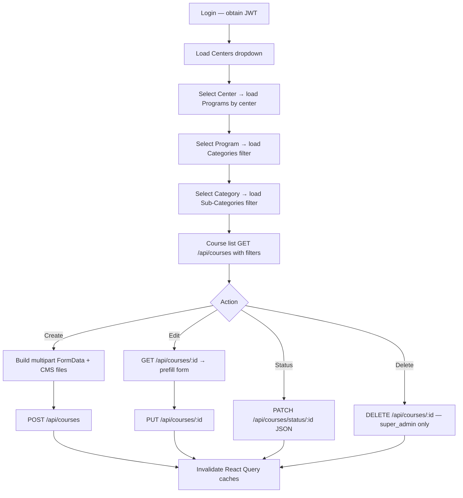

# Academics → Categories → Courses — Frontend Integration README

> **Single source of truth** for integrating the React + Vite Admin Panel with the existing Courses backend APIs.  
> **Documentation only** — generated entirely from the current backend implementation.  
> **Last verified against:** `routes/courseRoutes.js`, `controllers/courseController.js`, `models/Course.js`, and related `utils/*` helpers.

---

## Table of Contents

1. [Module Overview](#1-module-overview)
2. [API Base URL](#2-api-base-url)
3. [Complete API List](#3-complete-api-list)
4. [List API](#4-list-api)
5. [Get By ID API](#5-get-by-id-api)
6. [Quick View API](#6-quick-view-api)
7. [Dropdown APIs](#7-dropdown-apis)
8. [Create Course API](#8-create-course-api)
9. [Update API](#9-update-api)
10. [Delete API](#10-delete-api)
11. [Status APIs](#11-status-apis)
12. [Bulk APIs](#12-bulk-apis)
13. [File Upload APIs](#13-file-upload-apis)
14. [Complete Request Examples](#14-complete-request-examples)
15. [Complete Response Examples](#15-complete-response-examples)
16. [Validation Rules](#16-validation-rules)
17. [Enums](#17-enums)
18. [Error Codes](#18-error-codes)
19. [Pagination](#19-pagination)
20. [Sorting](#20-sorting)
21. [Search](#21-search)
22. [Filters](#22-filters)
23. [Relationships](#23-relationships)
24. [Frontend Integration Guide](#24-frontend-integration-guide)
25. [React Query Integration](#25-react-query-integration)
26. [Service Layer Structure](#26-service-layer-structure)
27. [Custom Hooks](#27-custom-hooks)
28. [Frontend Folder Structure](#28-frontend-folder-structure)
29. [Integration Checklist](#29-integration-checklist)
30. [Backend Compatibility Guarantee](#30-backend-compatibility-guarantee)

---

## 1. Module Overview

### Purpose

The **Courses** module is the leaf node of the academic hierarchy. It defines enrollable academic offerings with ERP metadata (center, program, category chain, status) and **CMS v2.1** website content (overview, key features, why-choose, feature cards, help section, and media).

Human-readable course IDs are auto-generated in the format `CRS001`, `CRS002`, … (`utils/courseIdGenerator.js`).

### Position in Academics → Categories

```
Center → Program → Academic Category (Exam Category) → Academic Sub Category (Exam Sub Category) → Course
```

| UI Label | Backend Model | MongoDB Collection | API Prefix |
|----------|---------------|--------------------|------------|
| Center | `Center` | `centers` | `/api/centers` |
| Program | `Program` | `programs` | `/api/programs` |
| Exam Category | `AcademicCategory` | `academiccategories` | `/api/categories` |
| Exam Sub Category | `AcademicSubCategory` | `academicsubcategories` | `/api/sub-categories` |
| Course | `Course` | `courses` | `/api/courses` |

> **Naming trap:** Do not confuse `/api/categories` (Academic Categories) with `/api/resources` (Free Resources) or `/api/test-categories` (Test module).

### Relationships with Other Modules

| Module | Relationship |
|--------|--------------|
| **Batches** | `Batch.course` references `Course`; fees and batch dates live on **Batch**, not Course |
| **Enrollments / Payments** | Students purchase/enroll via course + batch |
| **LMS** | `CourseSubject`, `RecordedLecture`, `CourseProgress`, `LmsTest`, etc. reference `courseId` |
| **Enquiries / CRM** | `GET /api/courses/enquiry` supplies active courses for enquiry forms |
| **Public website** | `GET /api/courses/slug/:slug`, `/api/public/*` course endpoints |
| **Homepage** | Featured courses may use `pickCourseBannerImage()` from CMS media |

### Dependencies (must exist and be ACTIVE before create)

1. Center (`status: ACTIVE`)
2. Program (`status: ACTIVE`, includes center in `program.centers`)
3. Academic Category (`status: ACTIVE`, matches `centerId` + `programId`)
4. Academic Sub Category (`status: ACTIVE`, matches full chain)

Validated by `utils/courseHierarchyValidation.js`.

### Backend File Inventory

| Layer | File Path |
|-------|-----------|
| Route mount | `app.js` → `app.use('/api/courses', courseRoutes)` |
| Routes | `routes/courseRoutes.js` |
| Controller | `controllers/courseController.js` |
| Model | `models/Course.js` |
| Upload middleware | `middleware/courseUpload.js` |
| Auth middleware | `middleware/authMiddleware.js` (`protect`) |
| Role middleware | `middleware/roleMiddleware.js` (`allowRoles`) |
| Super admin gate | `middleware/requireSuperAdmin.js` |
| Hierarchy validation | `utils/courseHierarchyValidation.js` |
| Payload helpers | `utils/coursePayloadHelpers.js` |
| CMS validation | `utils/courseCmsValidation.js` |
| CMS media builder | `utils/courseCmsMedia.js` |
| CMS DTO / warnings | `utils/courseCmsDto.js` |
| CMS constants | `utils/courseCmsConstants.js` |
| Base64 feature-card upload | `utils/courseCmsBase64.js` |
| Response formatter | `utils/formatCourseResponse.js` |
| ID generator | `utils/courseIdGenerator.js` |
| API envelope | `utils/apiResponse.js` |
| Cloudinary upload | `utils/uploadToCloudinary.js` |
| Audit logging | `services/auditLogService.js` |
| Parent categories | `routes/academicCategoryRoutes.js`, `routes/academicSubCategoryRoutes.js` |
| Parent controllers | `controllers/academicCategoryController.js`, `controllers/academicSubCategoryController.js` |

**Not present for Courses:** dedicated repository, Joi validator, service class, or feature-permission middleware on course routes.

### Complete Frontend Flow



---

## 2. API Base URL

| Setting | Value |
|---------|-------|
| **Default host** | `http://localhost:5000` (`process.env.PORT \|\| 5000` in `server.js`) |
| **API prefix** | `/api` |
| **Courses base** | `/api/courses` |
| **Swagger docs** | `/api-docs` (optional reference) |

Configure the frontend via environment variable, e.g. `VITE_API_BASE_URL=http://localhost:5000/api`.

### Authentication Requirements

| Operation | Auth |
|-----------|------|
| List, get by id/slug, enquiry, grouped | **None** (public) |
| Create, update, status patch | `protect` + `allowRoles('super_admin', 'center_admin')` |
| Delete | `protect` + `allowRoles('super_admin')` |
| Courses dropdown | `protect` + `requireSuperAdmin` |
| Hierarchy dropdowns (categories, sub-categories, programs) | `protect` + `requireSuperAdmin` |
| Centers dropdown | `protect` + `requireStaffAdmin` |

### Headers

| Header | Value | When |
|--------|-------|------|
| `Authorization` | `Bearer <jwt>` | All protected routes |
| `Accept` | `application/json` | Always |
| `Content-Type` | `application/json` | GET, PATCH status, category/sub-category CRUD |
| `Content-Type` | `multipart/form-data` | `POST /api/courses`, `PUT /api/courses/:id` (browser sets boundary automatically) |

### Bearer Token Usage

Token is read from `Authorization: Bearer <token>`. Obtained via auth routes (`/api/auth/login`, `/api/auth/login-admin`, etc.). The `protect` middleware verifies JWT with `process.env.JWT_SECRET`.

### Response Envelope (Course APIs)

Course endpoints use `utils/apiResponse.js`:

```json
{
  "success": true,
  "statusCode": 10000,
  "message": "Human-readable message",
  "data": { }
}
```

> **Note:** Category and Sub-Category list APIs use a **different** shape (pagination fields at root, not nested under `data`).

---

## 3. Complete API List

### Course Endpoints (`/api/courses`)

| # | Method | URL | Description | Auth | Permission | Controller | Route File | Service | Validation |
|---|--------|-----|-------------|------|------------|------------|------------|---------|------------|
| 1 | `GET` | `/api/courses` | Paginated course list with filters | None | — | `getCourses` | `courseRoutes.js` | Inline Mongoose in controller | Query param parsing in controller |
| 2 | `GET` | `/api/courses/:id` | Get course by MongoDB `_id` | None | — | `getCourseById` | `courseRoutes.js` | Inline | ID required |
| 3 | `POST` | `/api/courses/find` | Get course by id (body) | None | — | `getCourseById` | `courseRoutes.js` | Inline | `body.id` required |
| 4 | `GET` | `/api/courses/slug/:slug` | Get course by slug | None | — | `getCourseBySlug` | `courseRoutes.js` | Inline | — |
| 5 | `GET` | `/api/courses/dropdown` | Lightweight course dropdown | Bearer JWT | `super_admin` | `getCoursesDropdown` | `courseRoutes.js` | Inline | Query validation in controller |
| 6 | `GET` | `/api/courses/enquiry` | Active courses for enquiry forms | None | — | `getCoursesForEnquiry` | `courseRoutes.js` | Inline | — |
| 7 | `GET` | `/api/courses/grouped` | Active courses grouped by center → category | None | — | `getCoursesGrouped` | `courseRoutes.js` | Inline | — |
| 8 | `POST` | `/api/courses` | Create course (ERP + CMS multipart) | Bearer JWT | `super_admin` \| `center_admin` | `createCourse` | `courseRoutes.js` | `buildCourseCmsPayload` | `courseHierarchyValidation`, `courseCmsValidation`, `courseUpload` |
| 9 | `PUT` | `/api/courses/:id` | Update course (partial multipart) | Bearer JWT | `super_admin` \| `center_admin` | `updateCourse` | `courseRoutes.js` | `buildCourseCmsPayload` | Same as create |
| 10 | `PATCH` | `/api/courses/status/:id` | Toggle ACTIVE/INACTIVE | Bearer JWT | `super_admin` \| `center_admin` | `updateCourseStatus` | `courseRoutes.js` | Inline | `status` enum check |
| 11 | `DELETE` | `/api/courses/:id` | Soft delete course | Bearer JWT | `super_admin` only | `deleteCourse` | `courseRoutes.js` | Inline | Role + not-deleted check |

> **RBAC note:** `config/permissionModules.js` lists `Course Management` under ACADEMICS, but course routes enforce **role middleware**, not feature-permission middleware.

### Related Hierarchy Endpoints (used by Course forms)

| Method | URL | Purpose | Auth | Permission |
|--------|-----|---------|------|------------|
| `GET` | `/api/centers/dropdown` | Centers dropdown | Bearer JWT | `requireStaffAdmin` |
| `GET` | `/api/programs/by-center/:centerId` | Programs for center | Bearer JWT | `super_admin` |
| `GET` | `/api/categories/filter?centerId=&programId=` | Exam categories dropdown | Bearer JWT | `super_admin` |
| `GET` | `/api/sub-categories/filter?centerId=&programId=&categoryId=` | Exam sub-categories dropdown | Bearer JWT | `super_admin` |

---

## 4. List API

### Endpoint

`GET /api/courses`

### Authentication

None (public).

### Query Parameters

| Parameter | Type | Required | Default | Description |
|-----------|------|----------|---------|-------------|
| `page` | number | No | `1` | Page number (min 1) |
| `limit` | number \| `'all'` | No | `10` | Page size; max `100`; `'all'` returns entire result set |
| `search` | string | No | — | Case-insensitive regex on `courseName`, `title`, `courseId` |
| `center` / `centerId` | ObjectId | No | — | Filter by center |
| `program` / `programId` | ObjectId | No | — | Filter by program |
| `categoryId` | ObjectId | No | — | Filter by `academicCategory` |
| `subCategoryId` | ObjectId | No | — | Filter by `academicSubCategory` |
| `category` | ObjectId | No | — | Legacy global `Category` ref (deprecated) |
| `status` | `'ACTIVE'` \| `'INACTIVE'` | No | — | Sets both `status` and `isActive` |
| `isActive` | `'true'` \| `'false'` | No | — | Used only when `status` is not provided |
| `isFeatured` | truthy | No | — | When present, filters `isFeatured: true` |
| `centerName` | string | No | — | Resolves centers by `centerName`, `name`, `city`, `centerCode` |
| `categoryName` | string | No | — | Legacy category name filter; value `'All'` is ignored |

### Pagination Defaults

- `page`: `1`
- `limit`: `10` (capped at `100`)
- `limit=all`: returns all matching records; `pages` = `1`, `limit` in response = `'all'`

### Sorting

List endpoint sorts by **`createdAt` descending** (hardcoded). No `sortBy` / `sortOrder` query params on courses list.

### Soft Delete

All list queries exclude `isDeleted: true` via filter `{ isDeleted: { $ne: true } }`.

### Example Requests

```http
GET /api/courses?page=1&limit=20&status=ACTIVE&centerId=665a1b2c3d4e5f6789012345
```

```http
GET /api/courses?search=UPSC&programId=665a1b2c3d4e5f6789012346&categoryId=665a1b2c3d4e5f6789012347
```

```http
GET /api/courses?limit=all&centerName=Delhi
```

### Success Response `200`

```json
{
  "success": true,
  "statusCode": 10000,
  "message": "Courses fetched successfully",
  "data": {
    "count": 10,
    "total": 45,
    "page": 1,
    "limit": 10,
    "pages": 5,
    "courses": []
  }
}
```

Access courses array via **`response.data.courses`**.

---

## 5. Get By ID API

### Endpoints

| Method | URL | Notes |
|--------|-----|-------|
| `GET` | `/api/courses/:id` | `:id` = MongoDB ObjectId |
| `POST` | `/api/courses/find` | Body: `{ "id": "<objectId>" }` |

### Authentication

None (public).

### Path / Body Parameters

| Parameter | Required | Description |
|-----------|----------|-------------|
| `id` | Yes | MongoDB `_id` of the course |

### Behavior

- Populates: `center`, `program`, `academicCategory`, `academicSubCategory`, `category` (legacy)
- Excludes soft-deleted courses
- Returns formatted course via `formatCourseResponse()`

### Success Response `200`

```json
{
  "success": true,
  "statusCode": 10000,
  "message": "Course fetched successfully",
  "data": {
    "course": {
      "_id": "665a1b2c3d4e5f6789012345",
      "courseId": "CRS001",
      "courseName": "UPSC Foundation",
      "title": "UPSC Foundation",
      "slug": "upsc-foundation-1719398400000",
      "center": { "_id": "...", "centerName": "Delhi", "name": "Delhi", "city": "New Delhi" },
      "program": { "_id": "...", "programId": "PRG001", "programName": "IAS" },
      "academicCategory": { "_id": "...", "categoryId": "CAT001", "categoryName": "Prelims" },
      "academicSubCategory": { "_id": "...", "subCategoryId": "SUB001", "subCategoryName": "General Studies" },
      "courseOverview": "",
      "courseOverviewSectionTitle": "",
      "keyFeaturesSectionTitle": "",
      "keyFeatures": [],
      "keyFeatureImage": null,
      "whyChooseTitle": "",
      "whyChooseImages": [],
      "whyChooseVideo": null,
      "featureCards": [],
      "helpSectionTitle": "",
      "helpSectionPoints": [],
      "helpSectionImages": [],
      "helpSectionVideo": null,
      "status": "ACTIVE",
      "isActive": true,
      "isFeatured": false,
      "isDeleted": false,
      "deletedAt": null,
      "createdBy": null,
      "createdAt": "2025-06-01T10:00:00.000Z",
      "updatedAt": "2025-06-01T10:00:00.000Z"
    }
  }
}
```

### Get By Slug

`GET /api/courses/slug/:slug` — same response shape as get by ID.

### Error Responses

| HTTP | Message |
|------|---------|
| `400` | `Course ID is required` |
| `404` | `Course not found` |
| `500` | `Error fetching course` |

---

## 6. Quick View API

**Not implemented.** There is no dedicated quick-view or summary endpoint for courses in the backend. Use:

- `GET /api/courses/:id` for full detail, or
- `GET /api/courses/dropdown` for minimal fields (`_id`, `courseId`, `courseName`) when authenticated as super admin.

---

## 7. Dropdown APIs

Dropdowns required for the **Course create/edit form** (cascading hierarchy):

### 7.1 Centers

| Property | Value |
|----------|-------|
| **Endpoint** | `GET /api/centers/dropdown` |
| **Auth** | Bearer JWT + `requireStaffAdmin` |
| **Route** | Registered directly in `app.js` (not `centerDataRoutes`) |
| **Controller** | `centerManagementController.getCentersDropdown` |
| **Filter** | `status: ACTIVE` only |
| **Sort** | `centerName` ascending |
| **Label field** | `centerName` (fallback `name`) |
| **Value field** | `_id` |

**Response:**

```json
{
  "success": true,
  "count": 2,
  "data": [
    {
      "_id": "665a1b2c3d4e5f6789012345",
      "centerName": "Delhi Center",
      "centerCode": "DEL",
      "city": "New Delhi",
      "state": "Delhi"
    }
  ]
}
```

### 7.2 Programs (by Center)

| Property | Value |
|----------|-------|
| **Endpoint** | `GET /api/programs/by-center/:centerId` |
| **Auth** | Bearer JWT + `requireSuperAdmin` |
| **Controller** | `programController.getProgramsByCenter` |
| **Filter** | `centers` includes `centerId`, `status: ACTIVE` |
| **Sort** | `programName` ascending |
| **Label field** | `programName` |
| **Value field** | `_id` |

**Response:**

```json
{
  "success": true,
  "count": 1,
  "data": [
    { "_id": "...", "programId": "PRG001", "programName": "IAS" }
  ]
}
```

### 7.3 Exam Categories (Academic Categories)

| Property | Value |
|----------|-------|
| **Endpoint** | `GET /api/categories/filter?centerId={id}&programId={id}` |
| **Auth** | Bearer JWT + `requireSuperAdmin` |
| **Controller** | `academicCategoryController.getCategoriesFilter` |
| **Required query** | `centerId`, `programId` |
| **Filter** | `status: ACTIVE`, matching center + program |
| **Sort** | `categoryName` ascending |
| **Label field** | `categoryName` |
| **Value field** | `_id` |

**Response:**

```json
{
  "success": true,
  "count": 1,
  "data": [
    { "_id": "...", "categoryId": "CAT001", "categoryName": "Prelims" }
  ]
}
```

### 7.4 Exam Sub Categories

| Property | Value |
|----------|-------|
| **Endpoint** | `GET /api/sub-categories/filter?centerId={id}&programId={id}&categoryId={id}` |
| **Auth** | Bearer JWT + `requireSuperAdmin` |
| **Controller** | `academicSubCategoryController.getSubCategoriesFilter` |
| **Required query** | `centerId`, `programId`, `categoryId` |
| **Filter** | `status: ACTIVE`, full chain match |
| **Sort** | `subCategoryName` ascending |
| **Label field** | `subCategoryName` |
| **Value field** | `_id` |

**Response:**

```json
{
  "success": true,
  "count": 1,
  "data": [
    { "_id": "...", "subCategoryId": "SUB001", "subCategoryName": "General Studies" }
  ]
}
```

### 7.5 Courses Dropdown (reference / other modules)

| Property | Value |
|----------|-------|
| **Endpoint** | `GET /api/courses/dropdown` |
| **Auth** | Bearer JWT + `requireSuperAdmin` |
| **Controller** | `courseController.getCoursesDropdown` |
| **Label field** | `courseName` |
| **Value field** | `_id` |
| **Sort** | `courseName`, `title` ascending |
| **Default status** | `ACTIVE` |

**Query params:** `search`, `status`, `centerId`/`center`, `programId`/`program`, `excludeCourseId`, `page` (default 1), `limit` (default 100, max 200).

**Response items in `data.data`** (double-nested):

```json
{
  "success": true,
  "statusCode": 10000,
  "message": "Courses dropdown fetched successfully",
  "data": {
    "count": 1,
    "total": 1,
    "page": 1,
    "limit": 100,
    "totalPages": 1,
    "data": [
      { "_id": "...", "courseId": "CRS001", "courseName": "UPSC Foundation" }
    ]
  }
}
```

### Dropdowns NOT Used by Course Module

The following are **not referenced** in `courseController.js` or `Course` model create/update flows:

| Dropdown | Status |
|----------|--------|
| Faculties | Not used in Course ERP |
| Subjects | Not used in Course ERP (used in `CourseSubject` LMS module) |
| Cities | Not a direct Course field (center has city) |
| Classrooms | Not used in Course ERP |
| Mentors | Not used in Course ERP |
| Statuses | Hardcoded enum `ACTIVE` / `INACTIVE` in frontend — no status dropdown API |

---

## 8. Create Course API

### Endpoint

`POST /api/courses`

### Content-Type

**`multipart/form-data`** (required when files are present; recommended always for consistency).

JSON-only create is **not supported** by the route middleware (`courseUpload` runs on all POST requests).

### Authentication

Bearer JWT. Roles: `super_admin` or `center_admin`.

**Center admin scoping:** On create, `center_admin` must be the `centerAdmin` of the selected center (`Center.centerAdmin === user._id`). Otherwise `403`.

### Required Fields

| Field | Alias | Type | Validation |
|-------|-------|------|------------|
| `courseName` | `title` | string | Non-empty after trim |
| `centerId` | `center` | ObjectId string | Valid; active center |
| `programId` | `program` | ObjectId string | Valid; active; linked to center |
| `categoryId` | `academicCategory` | ObjectId string | Valid; ACTIVE; matches center + program |
| `subCategoryId` | `academicSubCategory` | ObjectId string | Valid; ACTIVE; matches full chain |

### Optional ERP Fields

| Field | Alias | Type | Default | Notes |
|-------|-------|------|---------|-------|
| `courseOverview` | — | string | `''` | |
| `courseOverviewSectionTitle` | — | string | `''` | |
| `keyFeaturesSectionTitle` | — | string | `''` | |
| `helpSectionTitle` | `howWillSectionTitle` | string | `''` | |
| `status` | — | enum | `ACTIVE` | `ACTIVE` \| `INACTIVE` |
| `isActive` | — | boolean/string | derived | `false` → `INACTIVE` |

### Optional CMS Text / Array Fields

Send as plain string, JSON string, or newline-separated text in FormData.

| Field | Format | Limits (when field is sent) |
|-------|--------|----------------------------|
| `keyFeatures` | JSON array or newline-separated | 1–10 points |
| `featureCards` | JSON array string | Max 20 cards |
| `helpSectionPoints` | JSON array or newline-separated | 1–10 points |
| `whyChooseTitle` | string | — |

**Feature card object shape:**

```json
{
  "title": "string",
  "description": "string",
  "image": "https://... OR data:image/png;base64,...",
  "displayOrder": 1,
  "highlightOnWebsite": false
}
```

Aliases accepted in `featureCards`: `featureTitle`, `featureDescription`.

### Optional CMS Control Fields (update-oriented, accepted on create)

| Field | Type | Purpose |
|-------|------|---------|
| `keyFeatureRemoveImage` | boolean | `true` removes key feature image |
| `whyChooseKeepImages` | JSON URL array | Retain specific why-choose images on update |
| `whyChooseRemoveVideo` | boolean | `true` removes why-choose video |
| `helpSectionKeepImages` | JSON URL array | Retain specific help images on update |
| `helpSectionRemoveVideo` | boolean | `true` removes help section video |

### File Upload Fields (multipart)

| Field | Max files | Max size | MIME types | Cloudinary folder |
|-------|-----------|----------|------------|-------------------|
| `keyFeatureImage` | 1 | 5 MB | JPEG, PNG, WEBP | `courses/key-features` |
| `whyChooseImages` | multiple | 5 MB each | JPEG, PNG, WEBP | `courses/why-choose/images` |
| `whyChooseVideo` | 1 | 50 MB | MP4, WebM | `courses/why-choose/videos` |
| `helpSectionImages` | multiple | 5 MB each | JPEG, PNG, WEBP | `courses/help-images` |
| `helpSectionVideo` | 1 | 50 MB | MP4, WebM | `courses/help-videos` |
| `featureCards[].image` | per card | 1 MB | base64 data URI or existing URL | `courses/feature-cards` |

**Multer global limits** (`courseUpload.js`): 50 MB per file, max 50 files. SVG allowed at multer layer but **rejected** by CMS image validation for image fields.

### Auto-Generated Fields (not sent by frontend)

| Field | Behavior |
|-------|----------|
| `courseId` | Auto `CRS###` |
| `slug` | Auto from title + timestamp on first save |
| `title` | Synced with `courseName` |
| `isActive` | Derived from `status` |
| `createdBy` | From `req.user._id` |

### Legacy Fields — Rejected

Body keys `whyChoose`, `helpSection`, `featureCardsMetadata`, and indexed upload patterns (`keyFeatureImage_*`, `featureCard_*`, etc.) return `400`.

Fields stripped from model JSON output (not accepted on create): `brochure`, `bannerImage`, `fees`, `modes`, `duration`, etc.

### Success Response `201`

```json
{
  "success": true,
  "statusCode": 10000,
  "message": "Course created successfully",
  "data": {
    "warnings": [
      {
        "field": "courseOverview",
        "message": "Course overview is missing. Add content to describe the course."
      }
    ],
    "course": { }
  }
}
```

Warnings are **advisory only** — they do not block save (`utils/courseCmsDto.getCourseCmsWarnings`).

---

## 9. Update API

### Endpoint

`PUT /api/courses/:id`

### Content-Type

`multipart/form-data`

### Authentication

Bearer JWT. Roles: `super_admin` or `center_admin`.

**Center admin scoping:** Must be `centerAdmin` of the course's **existing** center.

### Partial Update

All fields are optional. Only sent fields are updated.

### Editable Fields

Same as create (ERP + CMS fields + file fields + CMS control fields).

Hierarchy fields (`centerId`, `programId`, `categoryId`, `subCategoryId` and aliases) are re-validated only when any hierarchy field is present in the body.

CMS sections are rebuilt when `shouldRebuildCms()` is true — i.e., when any CMS body key is sent or any CMS file is attached.

### Immutable / Not Editable via API

| Field | Reason |
|-------|--------|
| `courseId` | Auto-generated; never in update payload |
| `slug` | Auto-generated on first save; not updated by controller |
| `createdBy` | Set only on create |
| `createdAt` | Mongoose timestamp |
| `isDeleted` / `deletedAt` | Only changed via DELETE |
| `isFeatured` | Exists on model but **not exposed** in create/update controller |

### Status on Update

Send `status: 'ACTIVE'|'INACTIVE'` or `isActive: false` in FormData to change status via PUT (alternative to PATCH status endpoint).

---

## 10. Delete API

### Endpoint

`DELETE /api/courses/:id`

### Authentication

Bearer JWT. **`super_admin` only.**

### Delete Type

**Soft delete** — record is not removed from MongoDB.

### Behavior

Sets on the course document:

- `isDeleted: true`
- `deletedAt: new Date()`
- `status: 'INACTIVE'`
- `isActive: false`

Enrollments and related records **remain linked**.

### Validations / Restrictions

- Course must exist and not already be soft-deleted
- `center_admin` receives `403` — only super admin may delete
- No cascade delete to batches, enrollments, or LMS content

### Success Response `200`

```json
{
  "success": true,
  "statusCode": 10000,
  "message": "Course deleted successfully (soft delete — enrollments remain linked)",
  "data": null
}
```

---

## 11. Status APIs

### Patch Status

| Property | Value |
|----------|-------|
| **Endpoint** | `PATCH /api/courses/status/:id` |
| **Content-Type** | `application/json` |
| **Auth** | `super_admin` \| `center_admin` |
| **Body** | `{ "status": "ACTIVE" \| "INACTIVE" }` |

**Note:** No `center_admin` center-ownership check on this endpoint (unlike PUT update).

### Status via PUT

`PUT /api/courses/:id` with `status` or `isActive` in FormData.

### Available Status Values

| Status | `isActive` |
|--------|------------|
| `ACTIVE` | `true` |
| `INACTIVE` | `false` |

### Not Implemented

| Feature | Status |
|---------|--------|
| Archive | Not implemented |
| Publish / Unpublish | Not implemented (use ACTIVE/INACTIVE) |
| Separate activate/deactivate endpoints | Not implemented (use PATCH status) |

---

## 12. Bulk APIs

**Not implemented** for the Courses module. The backend provides no endpoints for:

- Bulk delete
- Bulk status update
- Bulk import
- Bulk export

> Category/sub-category modules also have no bulk course operations. Batch module has `PUT /api/course-subjects/reorder` for LMS subjects only.

---

## 13. File Upload APIs

**No standalone file upload endpoints exist** for courses. All media is uploaded as part of:

- `POST /api/courses`
- `PUT /api/courses/:id`

### Upload Flow

```
courseUpload (multer memory)
  → validateCourseUploadFiles
  → buildCourseCmsPayload
  → uploadToCloudinary
  → URL stored on Course document
```

### Supported Media Types

| Asset | Field | Brochure/PDF | Thumbnail/Banner |
|-------|-------|--------------|------------------|
| Key feature image | `keyFeatureImage` | No | Acts as primary banner candidate |
| Why-choose images | `whyChooseImages` | No | Max 3 |
| Why-choose video | `whyChooseVideo` | No | — |
| Feature card images | `featureCards[].image` (base64) | No | — |
| Help section images | `helpSectionImages` | No | Max 3 |
| Help section video | `helpSectionVideo` | No | — |

**Brochure upload:** Not implemented (legacy `brochure` field stripped from API responses).

**PDF upload:** Not implemented for course CMS (multer accepts PDF mime in `uploadMediaUrl` helper but no course field uses it).

### Update Media Patterns

| Type | Replace behavior |
|------|------------------|
| Single image (`keyFeatureImage`) | New file replaces; `keyFeatureRemoveImage=true` clears |
| Single video | New file replaces; `*RemoveVideo=true` clears |
| Multi images | Send `whyChooseKeepImages` / `helpSectionKeepImages` JSON URL array + new files; merged up to max 3 |

### Example FormData (create)

```
courseName: UPSC Foundation Batch 2026
centerId: 665a1b2c3d4e5f6789012345
programId: 665a1b2c3d4e5f6789012346
categoryId: 665a1b2c3d4e5f6789012347
subCategoryId: 665a1b2c3d4e5f6789012348
courseOverview: Comprehensive foundation program for UPSC CSE.
keyFeatures: ["Daily classes","Test series","Mentorship"]
whyChooseTitle: Why Sriram IAS?
featureCards: [{"title":"Expert Faculty","description":"Learn from top educators","displayOrder":1,"highlightOnWebsite":true,"image":"data:image/png;base64,iVBOR..."}]
helpSectionPoints: ["Doubt clearing","Study material"]
status: ACTIVE
keyFeatureImage: (file)
whyChooseImages: (file)
whyChooseImages: (file)
```

---

## 14. Complete Request Examples

### 14.1 List with filters

```http
GET /api/courses?page=1&limit=10&status=ACTIVE&centerId=665a1b2c3d4e5f6789012345&search=Foundation
Authorization: (optional — public endpoint)
```

### 14.2 Get by ID

```http
GET /api/courses/665a1b2c3d4e5f6789012345
```

### 14.3 Find by ID (POST)

```http
POST /api/courses/find
Content-Type: application/json

{
  "id": "665a1b2c3d4e5f6789012345"
}
```

### 14.4 Create (minimal ERP only)

```http
POST /api/courses
Authorization: Bearer <token>
Content-Type: multipart/form-data

courseName=UPSC Foundation
centerId=665a1b2c3d4e5f6789012345
programId=665a1b2c3d4e5f6789012346
categoryId=665a1b2c3d4e5f6789012347
subCategoryId=665a1b2c3d4e5f6789012348
status=ACTIVE
```

### 14.5 Update status (JSON)

```http
PATCH /api/courses/status/665a1b2c3d4e5f6789012345
Authorization: Bearer <token>
Content-Type: application/json

{
  "status": "INACTIVE"
}
```

### 14.6 Update with media retention

```http
PUT /api/courses/665a1b2c3d4e5f6789012345
Authorization: Bearer <token>
Content-Type: multipart/form-data

courseName=UPSC Foundation Updated
whyChooseKeepImages=["https://res.cloudinary.com/.../image1.jpg"]
whyChooseImages=(new file)
keyFeatureRemoveImage=true
```

### 14.7 Delete

```http
DELETE /api/courses/665a1b2c3d4e5f6789012345
Authorization: Bearer <super_admin_token>
```

### 14.8 Hierarchy dropdown chain

```http
GET /api/centers/dropdown
GET /api/programs/by-center/665a1b2c3d4e5f6789012345
GET /api/categories/filter?centerId=665a1b2c3d4e5f6789012345&programId=665a1b2c3d4e5f6789012346
GET /api/sub-categories/filter?centerId=665a1b2c3d4e5f6789012345&programId=665a1b2c3d4e5f6789012346&categoryId=665a1b2c3d4e5f6789012347
```

---

## 15. Complete Response Examples

### 15.1 Success — List `200`

```json
{
  "success": true,
  "statusCode": 10000,
  "message": "Courses fetched successfully",
  "data": {
    "count": 1,
    "total": 1,
    "page": 1,
    "limit": 10,
    "pages": 1,
    "courses": [
      {
        "_id": "665a1b2c3d4e5f6789012345",
        "courseId": "CRS001",
        "courseName": "UPSC Foundation",
        "title": "UPSC Foundation",
        "slug": "upsc-foundation-1719398400000",
        "center": { "_id": "...", "centerName": "Delhi", "name": "Delhi", "city": "New Delhi" },
        "program": { "_id": "...", "programId": "PRG001", "programName": "IAS" },
        "academicCategory": { "_id": "...", "categoryId": "CAT001", "categoryName": "Prelims" },
        "academicSubCategory": { "_id": "...", "subCategoryId": "SUB001", "subCategoryName": "GS" },
        "courseOverview": "Overview text",
        "keyFeatures": ["Point 1", "Point 2"],
        "keyFeatureImage": "https://res.cloudinary.com/.../key.jpg",
        "status": "ACTIVE",
        "isActive": true,
        "isFeatured": false,
        "isDeleted": false,
        "createdAt": "2025-06-01T10:00:00.000Z",
        "updatedAt": "2025-06-01T10:00:00.000Z"
      }
    ]
  }
}
```

### 15.2 Success — Create `201`

```json
{
  "success": true,
  "statusCode": 10000,
  "message": "Course created successfully. Some recommended sections are incomplete.",
  "data": {
    "warnings": [
      { "field": "whyChooseTitle", "message": "Why Choose section is missing. Add a title, media, or feature cards." }
    ],
    "course": { "_id": "...", "courseId": "CRS002", "courseName": "UPSC Foundation" }
  }
}
```

### 15.3 Validation failure `400`

```json
{
  "success": false,
  "statusCode": 11000,
  "message": "centerId, programId, categoryId, and subCategoryId are required",
  "data": null,
  "error": null
}
```

**Hierarchy failure:**

```json
{
  "success": false,
  "statusCode": 11000,
  "message": "Invalid hierarchy selection",
  "data": null,
  "error": null,
  "reason": "SubCategory does not match center, program, and category"
}
```

**CMS validation failure:**

```json
{
  "success": false,
  "statusCode": 11000,
  "message": "Maximum 3 Why Choose images allowed",
  "data": null,
  "error": null
}
```

**Upload middleware failure (non-envelope):**

```json
{
  "success": false,
  "message": "File too large. Max video 50 MB; key/help images 5 MB; feature icons 1 MB."
}
```

### 15.4 Unauthorized `401`

```json
{
  "success": false,
  "statusCode": 11001,
  "message": "Not authorized, no token",
  "data": null,
  "error": null
}
```

### 15.5 Forbidden `403`

```json
{
  "success": false,
  "statusCode": 11002,
  "message": "Access denied. You are not the admin of this center.",
  "data": null,
  "error": null
}
```

**Delete forbidden:**

```json
{
  "success": false,
  "statusCode": 11002,
  "message": "Access denied. Only Super Admin can delete courses.",
  "data": null,
  "error": null
}
```

### 15.6 Not found `404`

```json
{
  "success": false,
  "statusCode": 11003,
  "message": "Course not found",
  "data": null,
  "error": null
}
```

### 15.7 Server error `500`

```json
{
  "success": false,
  "statusCode": 13000,
  "message": "Error creating course",
  "data": null,
  "error": "Detailed error message"
}
```

---

## 16. Validation Rules

| Field | Type | Required (Create) | Nullable | Enum | Validation | Backend Location |
|-------|------|-------------------|----------|------|------------|------------------|
| `courseName` | string | Yes | No | — | Non-empty trim | `courseController.createCourse` |
| `title` | string | Alias for `courseName` | No | — | Same as `courseName` | `coursePayloadHelpers.resolveCourseName` |
| `centerId` | ObjectId | Yes | No | — | Valid ObjectId; active center | `courseHierarchyValidation` |
| `programId` | ObjectId | Yes | No | — | Active; linked to center | `courseHierarchyValidation` |
| `categoryId` | ObjectId | Yes | No | — | ACTIVE; matches center+program | `courseHierarchyValidation` |
| `subCategoryId` | ObjectId | Yes | No | — | ACTIVE; matches full chain | `courseHierarchyValidation` |
| `courseOverview` | string | No | Yes | — | — | `Course` schema |
| `courseOverviewSectionTitle` | string | No | Yes | — | Trimmed | `coursePayloadHelpers` |
| `keyFeaturesSectionTitle` | string | No | Yes | — | Trimmed | `coursePayloadHelpers` |
| `helpSectionTitle` | string | No | Yes | — | Trimmed; alias `howWillSectionTitle` | `coursePayloadHelpers` |
| `status` | string | No | No | `ACTIVE`, `INACTIVE` | Default `ACTIVE` | `Course` schema + `resolveCourseStatus` |
| `isActive` | boolean | No | No | — | Synced from `status` | `Course` pre-save |
| `keyFeatures` | string[] | No | Yes | — | 1–10 if sent | `courseCmsValidation.validateCmsLimits` |
| `featureCards` | JSON array | No | Yes | — | Max 20; valid JSON | `courseCmsValidation` |
| `featureCards[].image` | base64/URL | No | Yes | — | Max 1 MB base64 | `courseCmsValidation.validateFeatureCardsField` |
| `whyChooseTitle` | string | No | Yes | — | — | `courseCmsMedia` |
| `helpSectionPoints` | string[] | No | Yes | — | 1–10 if sent | `courseCmsValidation` |
| `keyFeatureImage` | file | No | Yes | — | 1 file; 5 MB; JPEG/PNG/WEBP | `courseCmsValidation` |
| `whyChooseImages` | file[] | No | Yes | — | Max 3 total; 5 MB each | `courseCmsValidation` |
| `whyChooseVideo` | file | No | Yes | — | 1 file; 50 MB; MP4/WebM | `courseCmsValidation` |
| `helpSectionImages` | file[] | No | Yes | — | Max 3 total; 5 MB each | `courseCmsValidation` |
| `helpSectionVideo` | file | No | Yes | — | 1 file; 50 MB; MP4/WebM | `courseCmsValidation` |
| `keyFeatureRemoveImage` | boolean | No | — | — | `true` clears image | `courseCmsMedia` |
| `whyChooseKeepImages` | JSON URL[] | No | Yes | — | Max 3 with new files | `courseCmsValidation` |
| `whyChooseRemoveVideo` | boolean | No | — | — | `true` clears video | `courseCmsMedia` |
| `helpSectionKeepImages` | JSON URL[] | No | Yes | — | Max 3 with new files | `courseCmsValidation` |
| `helpSectionRemoveVideo` | boolean | No | — | — | `true` clears video | `courseCmsMedia` |
| `status` (PATCH) | string | Yes | No | `ACTIVE`, `INACTIVE` | Exact match | `updateCourseStatus` |

---

## 17. Enums

### Course Model (`models/Course.js`)

| Field | Values | Default |
|-------|--------|---------|
| `status` | `ACTIVE`, `INACTIVE` | `ACTIVE` |

### User Roles (`middleware/roleMiddleware.js`)

| Constant | Value |
|----------|-------|
| `SUPER_ADMIN` | `super_admin` |
| `CENTER_ADMIN` | `center_admin` |
| `EMPLOYEE` | `employee` |
| `STUDENT` | `student` |
| `PARENT` | `parent` |

### Academic Category / Sub-Category Status

| Model | Values |
|-------|--------|
| `AcademicCategory.status` | `ACTIVE`, `INACTIVE` |
| `AcademicSubCategory.status` | `ACTIVE`, `INACTIVE` |

### Audit Actions (`services/auditLogService`)

Course mutations log: `CREATE`, `UPDATE`, `DELETE`, `STATUS_CHANGE` under module `COURSE_MANAGEMENT`.

### Not Present on Course Model

The following enums are **not implemented** in the Course backend:

- Visibility
- Currency
- Language
- Course Type
- Delivery Mode
- Batch Type
- Category (legacy `category` ref exists but is deprecated; use `academicCategory`)

---

## 18. Error Codes

### Course API (`utils/apiResponse.js` + `constants/apiStatusCodes.js`)

| HTTP | JSON `statusCode` | Typical Message | Frontend Handling |
|------|-------------------|-----------------|-------------------|
| `200` | `10000` | Success messages | Render data; check `data.warnings` on create/update |
| `201` | `10000` | Course created | Navigate to detail/list; show warnings toast if present |
| `400` | `11000` | Missing fields, CMS limits, hierarchy, legacy fields | Show `message`; display `reason` if present in response root |
| `401` | `11001` | Not authorized / token failed | Redirect to login; clear stale token |
| `403` | `11002` | Role or center scoping denied | Show permission error; hide action buttons |
| `404` | `11003` | Course not found | Show not-found state; redirect to list |
| `500` | `13000` | Server error | Show generic error; offer retry |

### Upload Middleware Errors

| HTTP | Shape | Frontend Handling |
|------|-------|-------------------|
| `400` | `{ success: false, message }` (no `statusCode`) | Parse `message`; validate file sizes client-side preemptively |

### Role Middleware (`allowRoles`)

| HTTP | Shape |
|------|-------|
| `401` | `{ message: 'Not authenticated' }` |
| `403` | `{ message: 'Access denied. Insufficient permissions.', required: [...], current: '...' }` |

### Hierarchy Dropdown Errors

| HTTP | Message examples |
|------|------------------|
| `400` | `centerId and programId query parameters are required` |
| `400` | `centerId, programId, and categoryId query parameters are required` |

---

## 19. Pagination

### Course List (`GET /api/courses`)

| Field | Location | Description |
|-------|----------|-------------|
| `page` | `data.page` | Current page (1-based) |
| `limit` | `data.limit` | Page size or `'all'` |
| `total` | `data.total` | Total matching documents |
| `pages` | `data.pages` | Total pages |
| `count` | `data.count` | Items in current page |

### Course Dropdown (`GET /api/courses/dropdown`)

| Field | Location |
|-------|----------|
| `page` | `data.page` |
| `limit` | `data.limit` |
| `total` | `data.total` |
| `totalPages` | `data.totalPages` |
| `count` | `data.count` |
| Items | `data.data` |

### Category / Sub-Category Lists

Pagination at **response root**: `total`, `page`, `limit`, `totalPages`, `count`, `data`.

---

## 20. Sorting

### Course List

| Field | Order | Configurable |
|-------|-------|--------------|
| `createdAt` | Descending | **No** — hardcoded |

### Course Dropdown

| Fields | Order |
|--------|-------|
| `courseName`, `title` | Ascending |

### Category List (`GET /api/categories`)

| `sortBy` values | Default |
|-----------------|---------|
| `createdAt`, `categoryName`, `categoryId`, `status` | `createdAt` desc |

Query: `sortBy`, `sortOrder` (`asc` \| `desc`).

### Sub-Category List (`GET /api/sub-categories`)

| `sortBy` values | Default |
|-----------------|---------|
| `createdAt`, `subCategoryName`, `subCategoryId`, `status` | `createdAt` desc |

---

## 21. Search

### Course List — `search` query param

Case-insensitive regex (escaped) on:

- `courseName`
- `title`
- `courseId`

### Course Dropdown — `search` query param

Case-insensitive regex on:

- `courseName`
- `courseId`

### Category List — `search` query param

- `categoryName`

### Sub-Category List — `search` or `subCategoryName` query param

- `subCategoryName`
- `subCategoryId`

---

## 22. Filters

### Course List Filters

| Filter | Query Param | Behavior |
|--------|-------------|----------|
| Center | `center`, `centerId` | Exact ObjectId match |
| Program | `program`, `programId` | Exact ObjectId match |
| Academic category | `categoryId` | Maps to `academicCategory` |
| Academic sub-category | `subCategoryId` | Maps to `academicSubCategory` |
| Legacy category | `category` | Deprecated global Category ref |
| Status | `status` | `ACTIVE` \| `INACTIVE` |
| Active flag | `isActive` | `'true'` \| `'false'` if no `status` |
| Featured | `isFeatured` | Truthy → `isFeatured: true` |
| Center by name | `centerName` | Resolves center IDs first |
| Legacy category name | `categoryName` | Resolves legacy Category IDs; `'All'` ignored |
| Soft delete | (implicit) | Always excludes `isDeleted: true` |

### Course Dropdown Filters

`status` (default `ACTIVE`), `centerId`/`center`, `programId`/`program`, `excludeCourseId`.

### Enquiry Endpoint Filters

`GET /api/courses/enquiry` — always `isActive: true`, `status: ACTIVE`, plus optional `centerName`, `categoryName` (legacy).

### Grouped Endpoint

`GET /api/courses/grouped` — always active, non-deleted courses; grouped by center name → category name.

---

## 23. Relationships

### Direct References on `Course`

| Field | Ref Model | Purpose |
|-------|-----------|---------|
| `center` | `Center` | Physical / operational center |
| `program` | `Program` | Academic program |
| `academicCategory` | `AcademicCategory` | Exam category |
| `academicSubCategory` | `AcademicSubCategory` | Exam sub-category |
| `category` | `Category` | **Deprecated** legacy global category |
| `createdBy` | `User` | Creator |

### Downstream Modules Referencing `Course`

| Module | Connection |
|--------|------------|
| **Batches** | `Batch.course` — pricing, schedule, enrollment capacity |
| **Enrollments** | Student enrollment linked to course (+ batch) |
| **Course Subjects (LMS)** | `/api/course-subjects` — subjects per course |
| **Course Progress** | `/api/course-progress` — student progress |
| **Recorded Lectures / Live Classes** | Content keyed by course |
| **Tests / LMS** | `LmsTest`, attempts, bookmarks reference course |
| **Payments / Orders** | Purchase flow targets course |
| **Enquiries** | CRM references course for lead capture |
| **Homepage** | May surface featured courses using CMS banner image |

### Hierarchy Validation Chain

```
Center (ACTIVE)
  └── Program (ACTIVE, centers[] includes center)
        └── AcademicCategory (ACTIVE, centerId + programId)
              └── AcademicSubCategory (ACTIVE, centerId + programId + categoryId)
                    └── Course (create/update validates full chain)
```

### Students / Teachers / Faculty

- **Students** interact via enrollment/purchase APIs, not course CRUD.
- **Teachers / Faculty** are not direct fields on Course; faculty may appear on center data or LMS modules separately.

---

## 24. Frontend Integration Guide

### Loading Order

1. Authenticate admin user (if protected operations needed).
2. Load course list (`GET /api/courses`) with default pagination.
3. For create form: load centers → programs → categories → sub-categories (cascade).
4. For edit: `GET /api/courses/:id` then load hierarchy dropdowns if hierarchy fields are editable.

### Dropdown Loading Sequence

```
Center selected
  → GET /api/programs/by-center/:centerId
Program selected
  → GET /api/categories/filter?centerId&programId
Category selected
  → GET /api/sub-categories/filter?centerId&programId&categoryId
```

Clear downstream selections when upstream changes.

### Caching Strategy

- Cache hierarchy dropdowns with React Query `staleTime` 5–10 minutes (data changes infrequently).
- Course list: `staleTime` 30–60 seconds; invalidate on mutations.
- Course detail: cache by id; invalidate on update/delete/status change.

### API Calling Order — Create

1. Validate all four hierarchy IDs client-side (non-empty ObjectId format).
2. Build `FormData` with ERP fields.
3. Append CMS text fields (JSON-stringify arrays).
4. Append files with exact field names.
5. `POST /api/courses` with `Authorization` header (do not set `Content-Type` manually).
6. On success: read `data.course` and `data.warnings`.

### Dependent Dropdown Behavior

- Disable Program until Center selected.
- Disable Category until Program selected.
- Disable Sub-Category until Category selected.
- Reset child dropdown value when parent changes.

### Optimistic Updates

- **List status toggle:** Optional optimistic update on `status`; rollback on error.
- **Create/Update with files:** Do **not** optimistically update — wait for server response (Cloudinary upload latency).

### Refetch Strategy

After create/update/delete/status:

- Invalidate `['courses']` list queries.
- Invalidate `['courses', id]` detail query.
- Invalidate `['courses', 'dropdown']` if used.

### Error Handling

- Parse `success === false` and display `message`.
- For hierarchy errors, show `reason` from response root when present.
- Upload errors may lack `statusCode` — handle both envelope shapes.
- Map `403` to permission-specific UI (hide delete for non-super-admin).

### Retry Strategy

- Retry `500` / network errors up to 2 times with exponential backoff.
- Do not retry `400` / `403` / `404`.

### Pagination Handling

- Store `page`, `limit`, `total`, `pages` from `data`.
- Reset to page 1 when search or filters change.
- Support `limit=all` only for export views (can be slow).

### Debounced Search

- Debounce list `search` input 300–500 ms before API call.
- Cancel in-flight requests on new search term (React Query `queryKey` handles this).

### Form Submission Flow

1. Client-side validation (required hierarchy + courseName).
2. Pre-validate file sizes/MIME types against CMS limits.
3. Submit FormData.
4. Show loading overlay (uploads may take several seconds).
5. On success: toast + navigate; show CMS warnings as non-blocking alerts.

### Edit Flow

1. Fetch course by id.
2. Map response to form state (including CMS arrays and media URLs).
3. On save: `PUT` with only changed fields + `*KeepImages` arrays for retained media.
4. Use `keyFeatureRemoveImage` / `*RemoveVideo` flags to delete media without uploading replacements.

### Delete Flow

1. Confirm dialog (soft delete warning).
2. Only show delete button for `super_admin`.
3. `DELETE /api/courses/:id`
4. Invalidate list cache; toast success message about enrollments remaining.

### Status Change Flow

- Prefer `PATCH /api/courses/status/:id` with JSON body for simple toggles.
- Update local row `status` + `isActive` on success.

---

## 25. React Query Integration

### Recommended Query Keys

```typescript
['courses', { page, limit, search, ...filters }]     // list
['courses', courseId]                                 // detail
['courses', 'slug', slug]                             // by slug (if needed)
['courses', 'dropdown', { centerId, programId, ... }] // dropdown
['courses', 'enquiry', { centerName, categoryName }]  // enquiry helper
['courses', 'grouped']                                // grouped view

// Hierarchy (related)
['centers', 'dropdown']
['programs', 'by-center', centerId]
['categories', 'filter', { centerId, programId }]
['sub-categories', 'filter', { centerId, programId, categoryId }]
```

### Mutations

| Mutation | Endpoint | Invalidates |
|----------|----------|-------------|
| `useCreateCourse` | `POST /api/courses` | `['courses']` |
| `useUpdateCourse` | `PUT /api/courses/:id` | `['courses']`, `['courses', id]` |
| `useDeleteCourse` | `DELETE /api/courses/:id` | `['courses']` |
| `useUpdateCourseStatus` | `PATCH /api/courses/status/:id` | `['courses']`, `['courses', id]` |

### Invalidation Strategy

```typescript
queryClient.invalidateQueries({ queryKey: ['courses'] });
```

Use predicate invalidation to avoid refetching unrelated filter combinations if performance is a concern.

### Caching

| Query | `staleTime` | `gcTime` |
|-------|-------------|----------|
| List | 30s | 5m |
| Detail | 60s | 10m |
| Dropdowns | 5m | 30m |

### Refetch Intervals

No polling required for admin CRUD. Optional `refetchOnWindowFocus: true` for list page.

### Optimistic Updates

Apply only to `useUpdateCourseStatus`:

```typescript
onMutate: async ({ id, status }) => {
  await queryClient.cancelQueries({ queryKey: ['courses', id] });
  const previous = queryClient.getQueryData(['courses', id]);
  queryClient.setQueryData(['courses', id], (old) => ({
    ...old,
    course: { ...old.course, status, isActive: status === 'ACTIVE' }
  }));
  return { previous };
},
onError: (_err, _vars, context) => {
  queryClient.setQueryData(['courses', id], context.previous);
}
```

---

## 26. Service Layer Structure

Recommended file: `src/services/courseService.ts`

```typescript
// courseService.ts — recommended functions

getCourses(params: CourseListParams): Promise<CourseListResponse>
getCourse(id: string): Promise<CourseDetailResponse>
findCourse(id: string): Promise<CourseDetailResponse>          // POST /find
getCourseBySlug(slug: string): Promise<CourseDetailResponse>
getCoursesDropdown(params: CourseDropdownParams): Promise<CourseDropdownResponse>
getCoursesForEnquiry(params?: EnquiryParams): Promise<EnquiryCoursesResponse>
getCoursesGrouped(): Promise<GroupedCoursesResponse>

createCourse(formData: FormData): Promise<CreateCourseResponse>
updateCourse(id: string, formData: FormData): Promise<UpdateCourseResponse>
updateCourseStatus(id: string, status: 'ACTIVE' | 'INACTIVE'): Promise<StatusResponse>
deleteCourse(id: string): Promise<void>

// Helpers (not API calls)
buildCourseFormData(input: CourseFormValues): FormData
appendCmsFiles(formData: FormData, files: CourseFileMap): void
```

### Related Services

| Service | Purpose |
|---------|---------|
| `centerService.getCentersDropdown()` | Centers |
| `programService.getProgramsByCenter(centerId)` | Programs |
| `examCategoryService.getCategoriesFilter(centerId, programId)` | Categories |
| `examSubCategoryService.getSubCategoriesFilter(...)` | Sub-categories |

> Existing `src/services/courseService.ts` in the repo implements **read-only** methods only. Extend it for mutations.

### FormData Builder Notes

- JSON-stringify `keyFeatures`, `featureCards`, `helpSectionPoints`, `whyChooseKeepImages`, `helpSectionKeepImages`.
- Append multiple files with the **same field name** for `whyChooseImages` and `helpSectionImages`.
- Feature card images: embed base64 in JSON **or** keep existing Cloudinary URLs on update.
- Never send `Content-Type: application/json` on create/update.

---

## 27. Custom Hooks

| Hook | Calls | Purpose |
|------|-------|---------|
| `useCourses(params)` | `courseService.getCourses` | Paginated list with filters |
| `useCourse(id)` | `courseService.getCourse` | Single course detail |
| `useCreateCourse()` | `courseService.createCourse` | Create mutation |
| `useUpdateCourse()` | `courseService.updateCourse` | Update mutation |
| `useDeleteCourse()` | `courseService.deleteCourse` | Delete mutation (super admin) |
| `useCourseDropdown(params)` | `courseService.getCoursesDropdown` | Course picker |
| `useUpdateCourseStatus()` | `courseService.updateCourseStatus` | Status toggle mutation |
| `useCourseHierarchyDropdowns()` | center + program + category + sub-category services | Cascading selects |
| `useCourseGrouped()` | `courseService.getCoursesGrouped` | Grouped view |

### `useCourseQuickView()`

**Not applicable** — no quick view API exists. Use `useCourse(id)` or `useCourseDropdown()`.

### Example Hook Responsibilities

```typescript
// useCourses — debounced search + pagination state
// useCreateCourse — FormData submission + warning toast on success
// useCourseHierarchyDropdowns — manages cascade reset logic
```

---

## 28. Frontend Folder Structure

Recommended enterprise layout:

```
src/
├── pages/
│   └── academics/
│       └── categories/
│           └── courses/
│               ├── CourseListPage.tsx
│               ├── CourseCreatePage.tsx
│               ├── CourseEditPage.tsx
│               └── CourseDetailPage.tsx
├── components/
│   └── courses/
│       ├── CourseTable.tsx
│       ├── CourseFilters.tsx
│       ├── CourseStatusBadge.tsx
│       ├── CourseHierarchySelects.tsx
│       ├── CourseCmsForm/
│       │   ├── KeyFeaturesSection.tsx
│       │   ├── WhyChooseSection.tsx
│       │   ├── FeatureCardsSection.tsx
│       │   └── HelpSection.tsx
│       └── CourseDeleteDialog.tsx
├── services/
│   ├── api.ts
│   ├── courseService.ts
│   ├── centerService.ts
│   ├── programService.ts
│   ├── examCategoryService.ts
│   └── examSubCategoryService.ts
├── hooks/
│   ├── useCourses.ts
│   ├── useCourse.ts
│   ├── useCreateCourse.ts
│   ├── useUpdateCourse.ts
│   ├── useDeleteCourse.ts
│   ├── useCourseDropdown.ts
│   ├── useUpdateCourseStatus.ts
│   └── useCourseHierarchyDropdowns.ts
├── types/
│   ├── course.types.ts
│   └── api.types.ts
├── utils/
│   ├── stripEmptyParams.ts
│   ├── buildCourseFormData.ts
│   └── formatCourseLabel.ts
├── constants/
│   ├── courseStatus.ts
│   └── cmsLimits.ts
└── schemas/
    └── courseFormSchema.ts        // Zod/Yup — mirror backend limits
```

---

## 29. Integration Checklist

### Authentication & Headers

- [ ] JWT attached as `Bearer` token on all protected routes
- [ ] `multipart/form-data` used for create/update (no manual Content-Type boundary)
- [ ] `application/json` used for PATCH status only

### Hierarchy

- [ ] Centers loaded from `GET /api/centers/dropdown`
- [ ] Programs loaded after center selection
- [ ] Categories loaded after program selection
- [ ] Sub-categories loaded after category selection
- [ ] Downstream selects cleared on upstream change
- [ ] All four hierarchy IDs sent on create

### Query Parameters

- [ ] Empty params stripped before list API calls
- [ ] `page` resets to 1 on filter/search change
- [ ] `limit` capped at 100 (unless `all`)

### Payload Validation

- [ ] `courseName` required on create
- [ ] `keyFeatures` 1–10 items when provided
- [ ] `helpSectionPoints` 1–10 items when provided
- [ ] `featureCards` max 20
- [ ] Image/video size limits enforced client-side
- [ ] Legacy CMS fields not sent

### File Uploads

- [ ] Exact field names: `keyFeatureImage`, `whyChooseImages`, `whyChooseVideo`, `helpSectionImages`, `helpSectionVideo`
- [ ] Feature card images as base64 in JSON or retained URLs
- [ ] Update uses `*KeepImages` and `*RemoveImage`/`*RemoveVideo` correctly

### Pagination & Filters

- [ ] List reads `data.courses`, not root
- [ ] Dropdown reads `data.data` (double nested)
- [ ] Soft-deleted courses never shown (backend enforced)

### Search

- [ ] Debounced 300–500 ms on list search
- [ ] Search targets `courseName`, `title`, `courseId`

### Error Handling

- [ ] Handles both `apiResponse` envelope and upload middleware `{ success, message }`
- [ ] Displays `reason` for hierarchy failures
- [ ] `401` → login redirect
- [ ] `403` → permission messaging
- [ ] `404` → not found state

### Success Handling

- [ ] Create `201` — show warnings array if non-empty
- [ ] Update — show warnings array if non-empty
- [ ] Delete — show soft-delete message

### Cache Invalidation

- [ ] List invalidated after create/update/delete/status
- [ ] Detail cache invalidated after update/status

### UI States

- [ ] Loading skeletons on list and detail
- [ ] Empty state when `total === 0`
- [ ] Upload progress / disabled submit during multipart POST/PUT
- [ ] Delete button visible only for `super_admin`

### Retry Logic

- [ ] Network/500 retry with backoff
- [ ] No retry on 4xx

### Toast Notifications

- [ ] Success toasts for CRUD operations
- [ ] Warning toasts for CMS advisory `warnings` (non-blocking)
- [ ] Error toasts with backend `message`

---

## 30. Backend Compatibility Guarantee

This document was generated by reading the live backend implementation. The following guarantees apply:

| Guarantee | Status |
|-----------|--------|
| Every course endpoint extracted from `routes/courseRoutes.js` | ✅ 11 endpoints documented |
| Related hierarchy dropdown endpoints extracted from actual routes | ✅ 4 endpoints documented |
| No APIs invented | ✅ Quick view, bulk, brochure, publish, and standalone upload APIs explicitly marked **not implemented** |
| No payloads assumed | ✅ All fields sourced from `courseController.js`, `Course.js`, `coursePayloadHelpers.js`, `courseCmsMedia.js`, `courseCmsValidation.js` |
| No response structures modified | ✅ Shapes match `apiResponse.js` and `formatCourseResponse.js` |
| Validation rules match backend helpers | ✅ Limits from `courseCmsConstants.js` |
| Enums match Mongoose schemas | ✅ `ACTIVE` / `INACTIVE` only |
| Upload flow matches `courseUpload.js` → Cloudinary | ✅ |
| Role permissions match route middleware | ✅ |

**Source files verified:**

- `routes/courseRoutes.js`
- `controllers/courseController.js`
- `models/Course.js`
- `middleware/courseUpload.js`, `authMiddleware.js`, `roleMiddleware.js`, `requireSuperAdmin.js`
- `utils/courseHierarchyValidation.js`, `coursePayloadHelpers.js`, `courseCmsValidation.js`, `courseCmsMedia.js`, `courseCmsDto.js`, `courseCmsConstants.js`, `formatCourseResponse.js`, `apiResponse.js`
- `controllers/academicCategoryController.js`, `academicSubCategoryController.js`
- `controllers/programController.js`, `centerManagementController.js`
- `app.js` (route mounts)

When the backend changes, re-scan these files and update this README to remain synchronized.

---

*Document path: `docs/COURSES_FRONTEND_INTEGRATION_README.md`*
