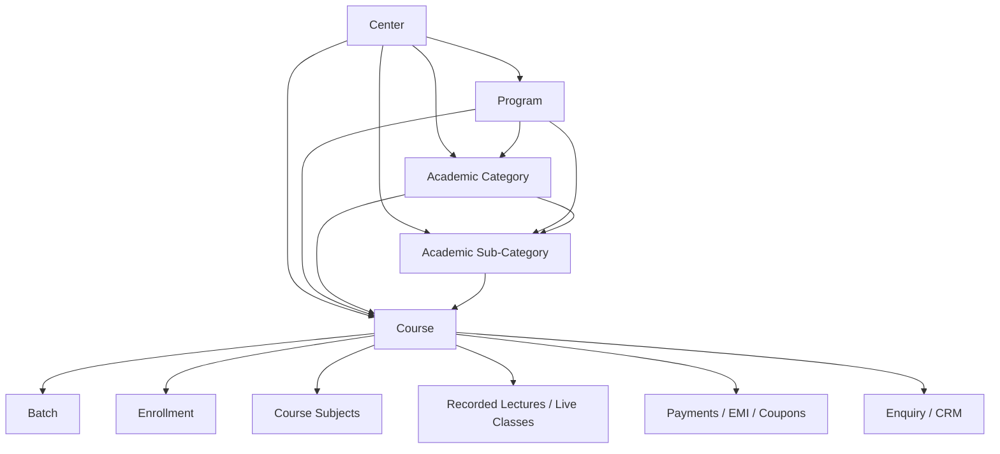
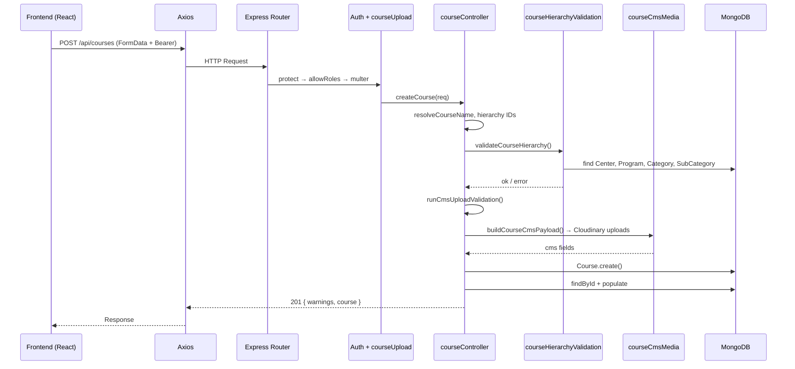
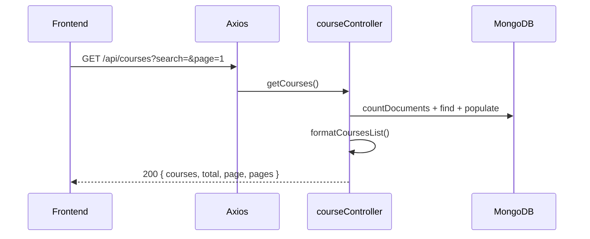

# Course Management — Frontend Integration Guide

**Audience:** React + Vite frontend developers building the **Course Management** module in the LMS Admin Panel.

**Backend module:** `Course` model, `courseController`, `courseRoutes`, CMS helpers (`courseCmsMedia`, `courseCmsValidation`, `courseCmsDto`).

**Base path:** `{VITE_API_BASE_URL}/api/courses`

**Source of truth:** This document is derived directly from the backend implementation. Do not invent fields or endpoints beyond what is documented here.

---

## Table of Contents

1. [Module Overview](#1-module-overview)
2. [API Base URL](#2-api-base-url)
3. [Authentication](#3-authentication)
4. [Complete API List](#4-complete-api-list)
5. [List API](#5-list-api)
6. [Get By ID](#6-get-by-id)
7. [Create Course](#7-create-course)
8. [Update Course](#8-update-course)
9. [Delete Course](#9-delete-course)
10. [Dropdown APIs](#10-dropdown-apis)
11. [Search APIs](#11-search-apis)
12. [Filter APIs](#12-filter-apis)
13. [Pagination](#13-pagination)
14. [Upload APIs](#14-upload-apis)
15. [Response Models](#15-response-models)
16. [Request Models](#16-request-models)
17. [Enum Values](#17-enum-values)
18. [Error Responses](#18-error-responses)
19. [Validation Rules](#19-validation-rules)
20. [Frontend Integration Guide](#20-frontend-integration-guide)
21. [React Query Mapping](#21-react-query-mapping)
22. [Axios Service Examples](#22-axios-service-examples)
23. [Frontend State Mapping](#23-frontend-state-mapping)
24. [UI Behaviour](#24-ui-behaviour)
25. [Integration Flow](#25-integration-flow)
26. [Dependency Graph](#26-dependency-graph)
27. [Sequence Diagram](#27-sequence-diagram)
28. [Frontend Checklist](#28-frontend-checklist)

---

## 1. Module Overview

### What is a Course?

A **Course** is the top-level sellable academic product in the LMS. Each course record combines:

- **ERP metadata** — name, auto-generated `courseId` (e.g. `CRS001`), academic hierarchy (Center → Program → Category → Sub-Category), status.
- **CMS content (v2.1 flat shape)** — overview text, key features, “Why Choose” section, feature cards, help section, demo video URL.

Courses are displayed on the public website and used across enrollment, batches, LMS content, payments, and enquiries.

### Purpose of the Module

The Course Management module lets admins:

- Create and maintain course catalog entries tied to the academic hierarchy.
- Upload/manage marketing media (images, videos) for course landing pages.
- Activate or deactivate courses without removing historical enrollments.
- Soft-delete courses (Super Admin only).

### Relationships with Other Modules

| Module | Relationship | Notes |
|--------|--------------|-------|
| **Center** | Required FK (`center`) | Course belongs to one center. `center_admin` can only create/edit courses for centers they administer. |
| **Program** | Required FK (`program`) | Program must be linked to the selected center and `ACTIVE`. |
| **Academic Category** | Required FK (`academicCategory`) | Scoped to center + program. |
| **Academic Sub-Category** | Required FK (`academicSubCategory`) | Scoped to center + program + category. |
| **Category** (legacy) | Optional FK (`category`) | Deprecated global category — present on old records only; list filter `category` / `categoryName` still supported. |
| **Batch** | Downstream | Batches reference a course (`Batch.course`). |
| **Enrollment** | Downstream | Student enrollments link via `courseId`. Soft delete preserves enrollments. |
| **Course Subjects** | Downstream | LMS subjects under a course (`/api/course-subjects`). |
| **Recorded Lectures / Live Classes / Tests** | Downstream | Content modules reference `courseId`. |
| **Enquiry / CRM** | Downstream | Enquiries can reference a course. |
| **Payments / EMI / Coupons** | Downstream | Transactions and coupons reference courses. |

**Not directly linked in Course CRUD:** Teacher, Mentor, Faculty Subject, Exam Category, Subject (global academics). Those modules consume courses downstream but are not required when creating a course.

### CMS Version

The backend uses **Course CMS v2.1** — a **flat** field structure. Legacy nested wrappers (`whyChoose`, `helpSection`, indexed upload fields) are **rejected**.

---

## 2. API Base URL

```
/api/courses
```

Mounted in `app.js`:

```
app.use('/api/courses', courseRoutes);
```

Full URL example:

```
https://<host>/api/courses
```

---

## 3. Authentication

### Standard Response Envelope

Most course endpoints use `utils/apiResponse.js`. Successful responses:

```json
{
  "success": true,
  "statusCode": 10000,
  "message": "Courses fetched successfully",
  "data": { }
}
```

Error responses include `success: false`, `statusCode` (e.g. `11000`–`11005`), and `message`.

### JWT Bearer Token

Protected routes require:

```
Authorization: Bearer <token>
```

Obtain token via `POST /api/auth/login` (legacy User) or Admin Access login.

### Roles Summary

| Role | Create | Update | Status Patch | Delete | Dropdown (`/courses/dropdown`) |
|------|--------|--------|--------------|--------|-------------------------------|
| `super_admin` | ✅ | ✅ | ✅ | ✅ | ✅ |
| `center_admin` | ✅ (own center only) | ✅ (own center only) | ✅ (own center only) | ❌ | ❌ |
| Unauthenticated | Read-only public GETs | — | — | — | — |

`center_admin` constraint: the authenticated user must be `center.centerAdmin` for the course's center (create) or the existing course's center (update).

### Headers for Create/Update

| Header | Required | Value |
|--------|----------|-------|
| `Authorization` | Yes | `Bearer <token>` |
| `Content-Type` | Yes | `multipart/form-data` (browser/axios sets boundary automatically) |

**Do not** send `application/json` for create/update — media uploads require multipart.

---

## 4. Complete API List

### 4.1 GET `/api/courses/dropdown`

| Property | Value |
|----------|-------|
| **Method** | `GET` |
| **Purpose** | Lightweight course list for select/dropdown controls |
| **Authentication** | Required |
| **Roles** | Super Admin only (`protect` + `requireSuperAdmin`) |

**Query Parameters**

| Param | Type | Default | Description |
|-------|------|---------|-------------|
| `search` | string | `""` | Case-insensitive match on `courseName` or `courseId` |
| `status` | string | `ACTIVE` | `ACTIVE` or `INACTIVE` |
| `centerId` / `center` | ObjectId | — | Filter by center |
| `programId` / `program` | ObjectId | — | Filter by program |
| `excludeCourseId` | ObjectId | — | Exclude one course (e.g. edit sibling picker) |
| `page` | number | `1` | Page ≥ 1 |
| `limit` | number | `100` | 1–200 |

**Response `data`**

```json
{
  "count": 10,
  "total": 42,
  "page": 1,
  "limit": 100,
  "totalPages": 1,
  "data": [
    { "_id": "...", "courseId": "CRS001", "courseName": "GS Foundation 2026" }
  ]
}
```

**Sort:** `courseName` ASC, then `title` ASC.

---

### 4.2 GET `/api/courses`

| Property | Value |
|----------|-------|
| **Method** | `GET` |
| **Purpose** | Paginated course list with search and filters |
| **Authentication** | None (public) |
| **Roles** | — |

See [§5 List API](#5-list-api) for full detail.

---

### 4.3 GET `/api/courses/enquiry`

| Property | Value |
|----------|-------|
| **Method** | `GET` |
| **Purpose** | Minimal active course list for enquiry/demo forms |
| **Authentication** | None |
| **Roles** | — |

**Query Parameters:** `centerName`, `categoryName` (legacy global category name; use `All` to skip).

**Response `data`**

```json
{
  "count": 5,
  "courses": [
    { "_id": "...", "title": "GS Foundation 2026" }
  ]
}
```

Only `ACTIVE` + `isActive: true` + not deleted courses.

---

### 4.4 GET `/api/courses/grouped`

| Property | Value |
|----------|-------|
| **Method** | `GET` |
| **Purpose** | Active courses grouped by center name → category name |
| **Authentication** | None |
| **Roles** | — |

**Response `data`**

```json
{
  "grouped": {
    "Hyderabad": {
      "General Studies": [ { /* full course object */ } ]
    }
  }
}
```

Category label uses `academicCategory.categoryName` or legacy `category.name`.

---

### 4.5 GET `/api/courses/slug/:slug`

| Property | Value |
|----------|-------|
| **Method** | `GET` |
| **Purpose** | Fetch single course by URL slug |
| **Authentication** | None |
| **Path Parameters** | `slug` — string |

**Response `data`:** `{ "course": { /* CourseResponse */ } }`

---

### 4.6 GET `/api/courses/:id`

| Property | Value |
|----------|-------|
| **Method** | `GET` |
| **Purpose** | Fetch single course by MongoDB `_id` |
| **Authentication** | None |
| **Path Parameters** | `id` — MongoDB ObjectId |

**Response `data`:** `{ "course": { /* CourseResponse */ } }`

---

### 4.7 POST `/api/courses/find`

| Property | Value |
|----------|-------|
| **Method** | `POST` |
| **Purpose** | Fetch single course by ID via request body (legacy/alternate) |
| **Authentication** | None |
| **Request Body** | `{ "id": "<ObjectId>" }` |

Same response as GET by ID.

---

### 4.8 POST `/api/courses`

| Property | Value |
|----------|-------|
| **Method** | `POST` |
| **Purpose** | Create course (ERP + CMS multipart) |
| **Authentication** | Required |
| **Roles** | `super_admin`, `center_admin` |
| **Middleware** | `courseUpload` (multer multipart) |

See [§7 Create Course](#7-create-course).

**Success:** `201 Created`

---

### 4.9 PUT `/api/courses/:id`

| Property | Value |
|----------|-------|
| **Method** | `PUT` |
| **Purpose** | Update course (partial updates supported) |
| **Authentication** | Required |
| **Roles** | `super_admin`, `center_admin` |
| **Middleware** | `courseUpload` |

See [§8 Update Course](#8-update-course).

**Success:** `200 OK`

---

### 4.10 PATCH `/api/courses/status/:id`

| Property | Value |
|----------|-------|
| **Method** | `PATCH` |
| **Purpose** | Update status only (`ACTIVE` / `INACTIVE`) |
| **Authentication** | Required |
| **Roles** | `super_admin`, `center_admin` |
| **Request Body** | `{ "status": "ACTIVE" \| "INACTIVE" }` |

**Response `data`:** `{ "course": { /* CourseResponse */ } }`

---

### 4.11 DELETE `/api/courses/:id`

| Property | Value |
|----------|-------|
| **Method** | `DELETE` |
| **Purpose** | Soft delete course |
| **Authentication** | Required |
| **Roles** | `super_admin` only |

See [§9 Delete Course](#9-delete-course).

---

## 5. List API

### Endpoint

```
GET /api/courses
```

### Search

| Query Param | Fields Searched |
|-------------|-----------------|
| `search` | `courseName`, `title`, `courseId` (case-insensitive regex) |

### Pagination

| Param | Default | Rules |
|-------|---------|-------|
| `page` | `1` | Integer ≥ 1 |
| `limit` | `10` | Integer 1–100, or literal `"all"` to return every match |

### Filters

| Query Param | Aliases | Effect |
|-------------|---------|--------|
| `centerId` | `center` | Filter by center ObjectId |
| `programId` | `program` | Filter by program ObjectId |
| `categoryId` | — | Filter by `academicCategory` ObjectId |
| `subCategoryId` | — | Filter by `academicSubCategory` ObjectId |
| `category` | — | Filter by legacy global `category` ObjectId |
| `status` | — | `ACTIVE` or `INACTIVE` (also sets `isActive`) |
| `isActive` | — | `"true"` / `"false"` when `status` not sent |
| `isFeatured` | — | When truthy, `isFeatured: true` only |
| `centerName` | — | Resolves centers by name/city/code; empty result if no match |
| `categoryName` | — | Legacy category name regex; skip with `All` |

**Always applied:** `isDeleted !== true`

### Sort

Fixed: `createdAt` descending (newest first). No `sortBy` query param.

### Response

```json
{
  "success": true,
  "statusCode": 10000,
  "message": "Courses fetched successfully",
  "data": {
    "count": 10,
    "total": 87,
    "page": 1,
    "limit": 10,
    "pages": 9,
    "courses": [ /* CourseResponse[] */ ]
  }
}
```

### Example Request

```
GET /api/courses?search=foundation&centerId=674a1b2c3d4e5f6789012340&status=ACTIVE&page=1&limit=10
```

### Example Response (abbreviated)

```json
{
  "success": true,
  "statusCode": 10000,
  "message": "Courses fetched successfully",
  "data": {
    "count": 1,
    "total": 1,
    "page": 1,
    "limit": 10,
    "pages": 1,
    "courses": [
      {
        "_id": "674a1b2c3d4e5f6789012345",
        "courseId": "CRS001",
        "courseName": "GS Foundation Batch 2026",
        "title": "GS Foundation Batch 2026",
        "slug": "gs-foundation-batch-2026-1738123456789",
        "center": { "_id": "...", "centerName": "Hyderabad", "name": "Hyderabad", "city": "Hyderabad" },
        "program": { "_id": "...", "programId": "PRG001", "programName": "UPSC" },
        "academicCategory": { "_id": "...", "categoryId": "CAT001", "categoryName": "General Studies" },
        "academicSubCategory": { "_id": "...", "subCategoryId": "SUBCAT001", "subCategoryName": "Foundation" },
        "courseOverview": "Complete foundation program.",
        "status": "ACTIVE",
        "isActive": true,
        "isFeatured": false,
        "isDeleted": false,
        "createdAt": "2026-06-01T10:00:00.000Z",
        "updatedAt": "2026-06-01T10:00:00.000Z"
      }
    ]
  }
}
```

---

## 6. Get By ID

### Endpoints

| Method | URL | Notes |
|--------|-----|-------|
| `GET` | `/api/courses/:id` | Primary |
| `GET` | `/api/courses/slug/:slug` | Public slug lookup |
| `POST` | `/api/courses/find` | Body: `{ "id": "..." }` |

### Path / Body Parameters

| Param | Location | Required |
|-------|----------|----------|
| `id` | path or body | Yes (ObjectId) |
| `slug` | path | Yes (string) |

### Response

Full `CourseResponse` under `data.course` (see [§15](#15-response-models)).

### Errors

| HTTP | Message |
|------|---------|
| `400` | `Course ID is required` |
| `404` | `Course not found` |
| `500` | `Error fetching course` |

Soft-deleted courses return `404`.

---

## 7. Create Course

### Endpoint

```
POST /api/courses
Content-Type: multipart/form-data
Authorization: Bearer <token>
```

### Required Fields

| Field | Aliases | Type | Notes |
|-------|---------|------|-------|
| `courseName` | `title` | string | Trimmed; at least one required |
| `centerId` | `center` | ObjectId | Must be active center |
| `programId` | `program` | ObjectId | Must be ACTIVE and linked to center |
| `categoryId` | `academicCategory` | ObjectId | Must match center + program |
| `subCategoryId` | `academicSubCategory` | ObjectId | Must match center + program + category |

### Optional ERP Fields

| Field | Type | Default |
|-------|------|---------|
| `courseOverview` | string | `""` |
| `courseOverviewSectionTitle` | string | `""` |
| `keyFeaturesSectionTitle` | string | `""` |
| `helpSectionTitle` | string | `""` |
| `howWillSectionTitle` | string | Alias for `helpSectionTitle` |
| `status` | `ACTIVE` \| `INACTIVE` | `ACTIVE` |
| `isActive` | boolean/string | Derived from `status` |

### Optional CMS Fields

| Field | Type | Notes |
|-------|------|-------|
| `keyFeatures` | string[] or JSON string or newline text | Max 10 points; min 1 when field is sent |
| `keyFeatureImage` | file | Multipart field name `keyFeatureImage` |
| `whyChooseTitle` | string | |
| `whyChooseImages` | file(s) | Field `whyChooseImages` (repeat for multiple) |
| `whyChooseVideo` | file | Field `whyChooseVideo` |
| `featureCards` | JSON string array | See [Feature Card object](#feature-card-object) |
| `helpSectionPoints` | string[] or JSON/newline | Max 10; min 1 when sent |
| `helpSectionImages` | file(s) | Field `helpSectionImages` |
| `helpSectionVideo` | file | Field `helpSectionVideo` |
| `demoVideo` | string (URL) | **Text only** — not a file upload |

### Feature Card Object

```json
[
  {
    "title": "Expert Faculty",
    "description": "Experienced mentors.",
    "image": "data:image/png;base64,...",
    "displayOrder": 1,
    "highlightOnWebsite": true
  }
]
```

- `image`: base64 data URI on create, or existing Cloudinary URL on update.
- Max **20** cards; empty cards (no title, description, image) are skipped.
- Aliases: `featureTitle`, `featureDescription`.

### Hierarchy Validation

On invalid hierarchy:

```json
{
  "success": false,
  "statusCode": 11000,
  "message": "Invalid hierarchy selection",
  "reason": "Program is not linked to the selected center"
}
```

Possible `reason` values: `Invalid centerId`, `Invalid programId`, `Invalid categoryId`, `Invalid subCategoryId`, `Center not found or inactive`, `Program not found or inactive`, `Program is not linked to the selected center`, `Category does not match center and program`, `SubCategory does not match center, program, and category`.

### Success Response — `201 Created`

```json
{
  "success": true,
  "statusCode": 10000,
  "message": "Course created successfully",
  "data": {
    "warnings": [
      {
        "field": "courseOverview",
        "message": "Course overview is missing. Add content to describe the course."
      }
    ],
    "course": { /* CourseResponse */ }
  }
}
```

Message may be: `"Course created successfully. Some recommended sections are incomplete."` when warnings exist.

`courseId` is auto-generated (format `CRS001`, `CRS002`, …).

### Failure Examples

| HTTP | Message |
|------|---------|
| `400` | `courseName is required` |
| `400` | `centerId, programId, categoryId, and subCategoryId are required` |
| `400` | CMS validation messages (see [§19](#19-validation-rules)) |
| `403` | `Access denied. You are not the admin of this center.` |
| `500` | `Error creating course` |

---

## 8. Update Course

### Endpoint

```
PUT /api/courses/:id
Content-Type: multipart/form-data
```

### Editable Fields

All create fields are optionally editable. Omitted fields are left unchanged (CMS media preserved on update unless explicitly replaced).

**ERP**

- `courseName` / `title`
- `centerId`, `programId`, `categoryId`, `subCategoryId` (hierarchy re-validated when any sent)
- `courseOverview`
- Section titles: `courseOverviewSectionTitle`, `keyFeaturesSectionTitle`, `helpSectionTitle` / `howWillSectionTitle`
- `status` / `isActive`

**CMS text/lists**

- `keyFeatures`, `whyChooseTitle`, `featureCards`, `helpSectionPoints`, `demoVideo`

**CMS media — update patterns**

| Intent | Fields |
|--------|--------|
| Replace key feature image | Upload new `keyFeatureImage` file |
| Remove key feature image | `keyFeatureRemoveImage=true` |
| Replace why-choose images | `whyChooseKeepImages` JSON array of URLs to keep + new `whyChooseImages` files |
| Remove why-choose video | `whyChooseRemoveVideo=true` |
| Replace help images | `helpSectionKeepImages` + new `helpSectionImages` files |
| Remove help video | `helpSectionRemoveVideo=true` |
| Remove demo video URL | `demoVideoRemoveVideo=true` |
| Set demo video URL | `demoVideo` text field |

When `whyChooseKeepImages` / `helpSectionKeepImages` omitted and no new files uploaded → existing images unchanged.

When `whyChooseKeepImages` sent as `[]` → clears images (unless new files appended).

### Success Response — `200 OK`

```json
{
  "success": true,
  "statusCode": 10000,
  "message": "Course updated successfully",
  "data": {
    "warnings": [],
    "course": { /* CourseResponse */ }
  }
}
```

### Errors

| HTTP | Message |
|------|---------|
| `404` | `Course not found` |
| `403` | `Access denied. You can only edit courses for your center.` |
| `400` | Validation / hierarchy errors |
| `500` | `Error updating course` |

---

## 9. Delete Course

### Type

**Soft delete** — record remains in MongoDB.

### Endpoint

```
DELETE /api/courses/:id
Authorization: Bearer <token>  (super_admin only)
```

### Behaviour

Sets:

- `isDeleted: true`
- `deletedAt: new Date()`
- `status: 'INACTIVE'`
- `isActive: false`

### Dependencies

Enrollments and linked records **remain**. Message: `"Course deleted successfully (soft delete — enrollments remain linked)"`.

### Errors

| HTTP | Message |
|------|---------|
| `403` | `Access denied. Only Super Admin can delete courses.` |
| `404` | `Course not found` |
| `500` | `Error deleting course` |

**No bulk delete endpoint** exists.

---

## 10. Dropdown APIs

Course forms use a **cascading hierarchy**. Load in order: Center → Program → Category → Sub-Category.

### 10.1 Centers

```
GET /api/centers/dropdown
Authorization: Bearer <token>
Middleware: protect + requireStaffAdmin
```

**Response:**

```json
{
  "success": true,
  "count": 5,
  "data": [
    {
      "_id": "...",
      "centerName": "Hyderabad",
      "centerCode": "HYD",
      "city": "Hyderabad",
      "state": "Telangana"
    }
  ]
}
```

Only `ACTIVE` centers.

---

### 10.2 Programs by Center

```
GET /api/programs/by-center/:centerId
Authorization: Bearer <token>
Middleware: protect + requireSuperAdmin
```

**Response:**

```json
{
  "success": true,
  "count": 2,
  "data": [
    { "_id": "...", "programId": "PRG001", "programName": "UPSC" }
  ]
}
```

---

### 10.3 Academic Categories (filter)

```
GET /api/categories/filter?centerId=<id>&programId=<id>
Authorization: Bearer <token>
Middleware: protect + requireSuperAdmin
```

**Required query:** `centerId`, `programId`

**Response:**

```json
{
  "success": true,
  "count": 3,
  "data": [
    { "_id": "...", "categoryId": "CAT001", "categoryName": "General Studies" }
  ]
}
```

---

### 10.4 Academic Sub-Categories (filter)

```
GET /api/sub-categories/filter?centerId=<id>&programId=<id>&categoryId=<id>
Authorization: Bearer <token>
Middleware: protect + requireSuperAdmin
```

**Required query:** `centerId`, `programId`, `categoryId`

**Response:**

```json
{
  "success": true,
  "count": 2,
  "data": [
    { "_id": "...", "subCategoryId": "SUBCAT001", "subCategoryName": "Foundation" }
  ]
}
```

---

### 10.5 Courses Dropdown (this module)

```
GET /api/courses/dropdown
Authorization: Bearer <token>
Middleware: protect + requireSuperAdmin
```

See [§4.1](#41-get-apicoursesdropdown).

---

### Important: `center_admin` vs Hierarchy Dropdown Auth

Course **create/update** allows `center_admin`, but the cascading hierarchy dropdown APIs require **Super Admin**:

| API | `center_admin` access |
|-----|----------------------|
| `GET /api/centers/dropdown` | ✅ (`requireStaffAdmin`) |
| `GET /api/programs/by-center/:centerId` | ❌ (`requireSuperAdmin`) |
| `GET /api/categories/filter` | ❌ (`requireSuperAdmin`) |
| `GET /api/sub-categories/filter` | ❌ (`requireSuperAdmin`) |

Frontend options for `center_admin` course forms:

1. Pre-fill `centerId` from the logged-in user's administered center (no centers dropdown needed).
2. Coordinate with backend/product for center-scoped hierarchy endpoints, **or**
3. Restrict course create/edit UI to Super Admin until center-scoped dropdown APIs exist.

This is a current backend authorization boundary — not a documentation omission.

### APIs NOT used by Course CRUD

The following are **not** required for course create/edit forms:

- Teachers (`/api/teachers/dropdown`)
- Mentors
- Faculty Subjects
- Exam Categories
- Global Subjects
- Batches (downstream of course, not parent)

---

## 11. Search APIs

### List (`GET /api/courses`)

| Param | Searchable Fields |
|-------|-------------------|
| `search` | `courseName`, `title`, `courseId` |

### Dropdown (`GET /api/courses/dropdown`)

| Param | Searchable Fields |
|-------|-------------------|
| `search` | `courseName`, `courseId` |

### Enquiry (`GET /api/courses/enquiry`)

No text search — only `centerName` and `categoryName` resolution filters.

---

## 12. Filter APIs

### Admin List Filters

| Filter | Query Param | Type |
|--------|-------------|------|
| Center | `centerId` / `center` | ObjectId |
| Program | `programId` / `program` | ObjectId |
| Academic Category | `categoryId` | ObjectId |
| Academic Sub-Category | `subCategoryId` | ObjectId |
| Legacy Category | `category` | ObjectId |
| Status | `status` | `ACTIVE` \| `INACTIVE` |
| Active flag | `isActive` | `"true"` \| `"false"` |
| Featured | `isFeatured` | any truthy value |
| Center by name | `centerName` | string (regex on center fields) |
| Legacy category by name | `categoryName` | string (`All` = skip) |

### Dropdown Filters

`status`, `centerId`, `programId`, `excludeCourseId`

### Grouped / Enquiry

Pre-filtered to active courses only.

---

## 13. Pagination

### List API (`GET /api/courses`)

| Field | Location | Description |
|-------|----------|-------------|
| `page` | query / `data.page` | Current page (1-based) |
| `limit` | query / `data.limit` | Page size (1–100) or `"all"` |
| `total` | `data.total` | Total matching documents |
| `pages` | `data.pages` | `ceil(total / limit)` |
| `count` | `data.count` | Items in current page |

### Dropdown API

| Field | Description |
|-------|-------------|
| `page` | Current page |
| `limit` | Page size (max 200) |
| `total` | Total matches |
| `totalPages` | Total pages |
| `count` | Items returned |

---

## 14. Upload APIs

Uploads are **embedded in create/update** — there is no separate upload endpoint.

### Multipart File Fields

| Field Name | Type | Max Count | Max Size | Allowed MIME |
|------------|------|-----------|----------|--------------|
| `keyFeatureImage` | image | 1 | 5 MB | JPEG, PNG, WEBP |
| `whyChooseImages` | image | 3 total | 5 MB each | JPEG, PNG, WEBP |
| `whyChooseVideo` | video | 1 | 50 MB | MP4, WebM |
| `helpSectionImages` | image | 3 total | 5 MB each | JPEG, PNG, WEBP |
| `helpSectionVideo` | video | 1 | 50 MB | MP4, WebM |

Multer global limit: 50 MB per file, 50 files max. SVG allowed at multer layer for icons but image field validation restricts to JPEG/PNG/WEBP.

### Feature Card Images

Sent as **base64 data URI** inside `featureCards` JSON (max 1 MB per image). On update, can also pass existing `https://` Cloudinary URL.

### Demo Video

**URL only** — send `demoVideo` as form text (YouTube/external link). Uploading a file with field name `demoVideo` is rejected.

### Cloudinary Folders

| Content | Folder |
|---------|--------|
| Key feature image | `courses/key-features` |
| Why choose images | `courses/why-choose/images` |
| Why choose video | `courses/why-choose/videos` |
| Feature card icons | `courses/feature-cards` |
| Help images | `courses/help-images` |
| Help video | `courses/help-videos` |

### Frontend Upload Flow

1. Build `FormData`.
2. Append text/JSON fields as strings (`featureCards` → `JSON.stringify(...)`).
3. Append files with exact field names above.
4. `POST` or `PUT` with `Authorization` header; let axios set `Content-Type` with boundary.
5. Read returned Cloudinary URLs from `data.course` response fields.

### Not Supported

- Brochure PDF upload
- Banner / thumbnail / cover as separate legacy fields (removed from API)
- Gallery images as separate field
- `demoVideo` as file upload

---

## 15. Response Models

### CourseResponse

Returned as `data.course` (single) or inside `data.courses[]` (list).

| Property | Type | Description |
|----------|------|-------------|
| `_id` | ObjectId | MongoDB ID |
| `courseId` | string | System ID e.g. `CRS001` |
| `courseName` | string | Display name |
| `title` | string | Same as `courseName` (kept in sync) |
| `slug` | string | URL slug (auto-generated on first save) |
| `center` | object \| null | Populated: `_id`, `centerName`, `name`, `city` |
| `program` | object \| null | Populated: `_id`, `programId`, `programName` |
| `academicCategory` | object \| null | Populated: `_id`, `categoryId`, `categoryName` |
| `academicSubCategory` | object \| null | Populated: `_id`, `subCategoryId`, `subCategoryName` |
| `category` | object | Legacy only — `name` |
| `courseOverview` | string | |
| `courseOverviewSectionTitle` | string | |
| `keyFeaturesSectionTitle` | string | |
| `keyFeatures` | string[] | Bullet points (max 10) |
| `keyFeatureImage` | string \| null | Cloudinary URL |
| `whyChooseTitle` | string | |
| `whyChooseImages` | string[] | Up to 3 URLs |
| `whyChooseVideo` | string \| null | Cloudinary URL |
| `featureCards` | FeatureCard[] | |
| `helpSectionTitle` | string | |
| `helpSectionPoints` | string[] | |
| `helpSectionImages` | string[] | |
| `helpSectionVideo` | string \| null | |
| `demoVideo` | string \| null | External video URL |
| `status` | `ACTIVE` \| `INACTIVE` | |
| `isActive` | boolean | Mirrors `status === 'ACTIVE'` |
| `isFeatured` | boolean | Read-only via CRUD (filter only) |
| `isDeleted` | boolean | |
| `deletedAt` | Date \| null | |
| `createdBy` | ObjectId \| null | |
| `createdAt` | ISO Date | |
| `updatedAt` | ISO Date | |
| `extraFields` | object | Only if non-empty legacy data |

### FeatureCard

| Property | Type |
|----------|------|
| `title` | string |
| `description` | string |
| `image` | string (URL) |
| `displayOrder` | number |
| `highlightOnWebsite` | boolean |

### CmsWarning

| Property | Type |
|----------|------|
| `field` | string |
| `message` | string |

### Populated Reference Shapes

**Center:** `{ _id, centerName, name, city }`  
**Program:** `{ _id, programId, programName }`  
**AcademicCategory:** `{ _id, categoryId, categoryName }`  
**AcademicSubCategory:** `{ _id, subCategoryId, subCategoryName }`

---

## 16. Request Models

### CreateCourseRequest (multipart/form-data)

See [§7](#7-create-course).

### UpdateCourseRequest (multipart/form-data)

All create fields optional, plus:

| Field | Type | Purpose |
|-------|------|---------|
| `keyFeatureRemoveImage` | boolean string | Remove key feature image |
| `whyChooseKeepImages` | JSON string array | URLs to retain |
| `whyChooseRemoveVideo` | boolean string | Clear why-choose video |
| `helpSectionKeepImages` | JSON string array | URLs to retain |
| `helpSectionRemoveVideo` | boolean string | Clear help video |
| `demoVideoRemoveVideo` | boolean string | Clear demo video URL |

### UpdateCourseStatusRequest (JSON)

```json
{ "status": "ACTIVE" }
```

### FindCourseRequest (JSON)

```json
{ "id": "674a1b2c3d4e5f6789012345" }
```

### ListQueryParams

All optional query string parameters from [§5](#5-list-api).

---

## 17. Enum Values

| Enum | Values | Default |
|------|--------|---------|
| `status` | `ACTIVE`, `INACTIVE` | `ACTIVE` |
| `isActive` | `true`, `false` | `true` (derived from status) |
| `isFeatured` | `true`, `false` | `false` |
| `isDeleted` | `true`, `false` | `false` |

**No** enums for: course type, delivery mode, visibility, or language on the Course model.

---

## 18. Error Responses

### Standard Error Shape (apiResponse)

```json
{
  "success": false,
  "statusCode": 11000,
  "message": "courseName is required",
  "data": null,
  "error": null
}
```

### HTTP Status Reference

| HTTP | statusCode | When |
|------|------------|------|
| `400` | `11000` | Bad request, validation, CMS limits, hierarchy errors |
| `401` | `11001` | Missing/invalid token (`Not authorized, no token`) |
| `403` | `11002` | Wrong role, center_admin center mismatch, delete denied |
| `404` | `11003` | Course / center / program not found |
| `409` | `11004` | Not used by course module currently |
| `422` | `11005` | JSON parse errors (global error handler) |
| `429` | `12000` | Rate limit (app-level) |
| `500` | `13000` | Server errors |

### Example Errors

**401 Unauthorized**

```json
{
  "success": false,
  "statusCode": 11001,
  "message": "Not authorized, no token",
  "data": null,
  "error": null
}
```

**403 Forbidden (center_admin)**

```json
{
  "success": false,
  "statusCode": 11002,
  "message": "Access denied. You are not the admin of this center.",
  "data": null,
  "error": null
}
```

**403 Forbidden (roleMiddleware — PATCH/POST without role)**

```json
{
  "message": "Access denied. Insufficient permissions.",
  "required": ["super_admin", "center_admin"],
  "current": "employee"
}
```

**404 Not Found**

```json
{
  "success": false,
  "statusCode": 11003,
  "message": "Course not found",
  "data": null,
  "error": null
}
```

**400 CMS Validation**

```json
{
  "success": false,
  "statusCode": 11000,
  "message": "At least 1 key feature point required. Maximum 3 Why Choose images allowed.",
  "data": null,
  "error": null
}
```

**400 Hierarchy**

```json
{
  "success": false,
  "statusCode": 11000,
  "message": "Invalid hierarchy selection",
  "reason": "Category does not match center and program"
}
```

**400 Multer**

```json
{
  "success": false,
  "message": "File too large. Max video 50 MB; key/help images 5 MB; feature icons 1 MB."
}
```

**400 Legacy fields**

```json
{
  "success": false,
  "statusCode": 11000,
  "message": "Legacy CMS field(s) no longer supported: whyChoose. Use flat CMS fields (whyChooseTitle, featureCards, helpSectionPoints, etc.)."
}
```

---

## 19. Validation Rules

### Required (Create)

| Rule | Message |
|------|---------|
| `courseName` or `title` non-empty | `courseName is required` |
| `centerId`, `programId`, `categoryId`, `subCategoryId` present | `centerId, programId, categoryId, and subCategoryId are required` |
| Valid ObjectIds for hierarchy | `Invalid hierarchy selection` + `reason` |
| Center active | `Center not found or inactive` |
| Program ACTIVE + linked to center | Various `reason` strings |
| Category ACTIVE + matches center/program | `Category does not match center and program` |
| SubCategory ACTIVE + matches chain | `SubCategory does not match center, program, and category` |

### CMS Limits (when field is sent)

| Field | Min | Max |
|-------|-----|-----|
| `keyFeatures` | 1 point | 10 points |
| `helpSectionPoints` | 1 point | 10 points |
| `featureCards` | — | 20 cards |
| `whyChooseImages` (keep + new) | — | 3 |
| `helpSectionImages` (keep + new) | — | 3 |
| `keyFeatureImage` files | — | 1 |
| `whyChooseVideo` files | — | 1 |
| `helpSectionVideo` files | — | 1 |

### File Rules

| Field | Max Size | MIME |
|-------|----------|------|
| `keyFeatureImage` | 5 MB | image/jpeg, image/png, image/webp |
| `whyChooseImages` | 5 MB each | image/jpeg, image/png, image/webp |
| `whyChooseVideo` | 50 MB | video/mp4, video/webm |
| `helpSectionImages` | 5 MB each | image/jpeg, image/png, image/webp |
| `helpSectionVideo` | 50 MB | video/mp4, video/webm |
| `featureCards[].image` (base64) | 1 MB | data URI |

### URL Rules

- `demoVideo`: valid `http:` or `https:` URL when non-empty.

### Unique

- `courseId`: auto-generated, unique (`CRS###`).
- `slug`: auto-generated from title + timestamp, unique sparse.

### Conditional

- `center_admin`: must own the center on create/update.
- CMS rebuild on update only when CMS body keys sent or media files attached.
- `status` patch: only `ACTIVE` or `INACTIVE`.

### Rejected Legacy Fields

Body keys: `whyChoose`, `helpSection`, `featureCardsMetadata`  
Patterns: `keyFeatureImage_*`, `featureCardIcon_*`, `featureCard_*`, `helpSectionVideo_*`, `helpSectionImage1`, `helpSectionImage2`, `whyChooseMedia`

---

## 20. Frontend Integration Guide

### Recommended Structure

```
src/
  services/
    api.ts                 # axios instance + interceptors
    courseService.ts       # all /api/courses calls
    hierarchyService.ts    # centers, programs, categories, sub-categories

  hooks/
    useCourses.ts          # list + filters + pagination
    useCourse.ts           # single course by id
    useCreateCourse.ts
    useUpdateCourse.ts
    useDeleteCourse.ts
    useCourseHierarchy.ts  # cascading dropdowns

  pages/
    Courses/
      index.tsx            # list page
      create.tsx
      edit/[id].tsx
      [id].tsx             # details / preview

  components/
  Courses/
    CourseTable.tsx
    CourseForm.tsx
    CourseFilters.tsx
    CourseDetails.tsx
    CourseStatusToggle.tsx
    CmsSections/
      KeyFeaturesSection.tsx
      WhyChooseSection.tsx
      FeatureCardsEditor.tsx
      HelpSection.tsx
```

### Axios Instance

```typescript
// services/api.ts
import axios from 'axios';

export const api = axios.create({
  baseURL: import.meta.env.VITE_API_BASE_URL,
});

api.interceptors.request.use((config) => {
  const token = localStorage.getItem('token');
  if (token) config.headers.Authorization = `Bearer ${token}`;
  return config;
});
```

### Form Strategy

1. Use **react-hook-form** + controlled cascading selects for hierarchy.
2. Build `FormData` manually for create/update.
3. Serialize arrays: `keyFeatures` → JSON string or newline; `featureCards` → `JSON.stringify`.
4. On edit, track existing image URLs for `whyChooseKeepImages` / `helpSectionKeepImages`.
5. Show `data.warnings` as non-blocking banner after save.

### Role Gating

- Hide **Delete** for non–`super_admin`.
- Hide **Courses dropdown** API usage unless `super_admin`.
- For `center_admin`, pre-select / lock center to their administered center.

---

## 21. React Query Mapping

| Endpoint | Hook | Type | queryKey | Invalidation |
|----------|------|------|----------|--------------|
| `GET /courses` | `useCourses` | `useQuery` | `['courses', filters]` | On create/update/delete/status |
| `GET /courses/:id` | `useCourse` | `useQuery` | `['courses', id]` | On update/status |
| `POST /courses` | `useCreateCourse` | `useMutation` | — | `invalidateQueries(['courses'])` |
| `PUT /courses/:id` | `useUpdateCourse` | `useMutation` | — | `['courses']`, `['courses', id]` |
| `PATCH /courses/status/:id` | `useUpdateCourseStatus` | `useMutation` | — | `['courses']`, `['courses', id]` |
| `DELETE /courses/:id` | `useDeleteCourse` | `useMutation` | — | `invalidateQueries(['courses'])` |
| `GET /courses/dropdown` | `useCoursesDropdown` | `useQuery` | `['courses', 'dropdown', params]` | On create/delete/status |
| `GET /centers/dropdown` | `useCentersDropdown` | `useQuery` | `['centers', 'dropdown']` | Rarely |
| `GET /programs/by-center/:id` | `useProgramsByCenter` | `useQuery` | `['programs', centerId]` | enabled: !!centerId |
| `GET /categories/filter` | `useCategoriesFilter` | `useQuery` | `['categories', centerId, programId]` | enabled: both set |
| `GET /sub-categories/filter` | `useSubCategoriesFilter` | `useQuery` | `['subCategories', centerId, programId, categoryId]` | enabled: all set |

### Cache / Refetch

- Set `staleTime: 30_000` on list queries.
- `refetchOnWindowFocus: true` for admin table.
- After mutation success, always invalidate list; optionally invalidate detail.

### Optimistic Updates

Recommended for **status toggle only**:

```typescript
onMutate: async ({ id, status }) => {
  await queryClient.cancelQueries({ queryKey: ['courses', id] });
  const previous = queryClient.getQueryData(['courses', id]);
  queryClient.setQueryData(['courses', id], (old: any) => ({
    ...old,
    data: { course: { ...old?.data?.course, status, isActive: status === 'ACTIVE' } },
  }));
  return { previous };
},
onError: (_err, _vars, ctx) => {
  if (ctx?.previous) queryClient.setQueryData(['courses', id], ctx.previous);
},
```

Avoid optimistic updates for create/update with file uploads.

---

## 22. Axios Service Examples

```typescript
// services/courseService.ts
import { api } from './api';

export interface CourseListParams {
  search?: string;
  centerId?: string;
  programId?: string;
  categoryId?: string;
  subCategoryId?: string;
  status?: 'ACTIVE' | 'INACTIVE';
  isActive?: string;
  isFeatured?: boolean;
  page?: number;
  limit?: number | 'all';
}

export const getCourses = (params: CourseListParams) =>
  api.get('/api/courses', { params });

export const getCourseById = (id: string) =>
  api.get(`/api/courses/${id}`);

export const createCourse = (formData: FormData) =>
  api.post('/api/courses', formData, {
    headers: { 'Content-Type': 'multipart/form-data' },
  });

export const updateCourse = (id: string, formData: FormData) =>
  api.put(`/api/courses/${id}`, formData, {
    headers: { 'Content-Type': 'multipart/form-data' },
  });

export const updateCourseStatus = (id: string, status: 'ACTIVE' | 'INACTIVE') =>
  api.patch(`/api/courses/status/${id}`, { status });

export const deleteCourse = (id: string) =>
  api.delete(`/api/courses/${id}`);

// --- Dropdowns ---

export const getCoursesDropdown = (params?: Record<string, unknown>) =>
  api.get('/api/courses/dropdown', { params });

export const getCentersDropdown = () =>
  api.get('/api/centers/dropdown');

export const getProgramsByCenter = (centerId: string) =>
  api.get(`/api/programs/by-center/${centerId}`);

export const getCategoriesFilter = (centerId: string, programId: string) =>
  api.get('/api/categories/filter', { params: { centerId, programId } });

export const getSubCategoriesFilter = (
  centerId: string,
  programId: string,
  categoryId: string
) =>
  api.get('/api/sub-categories/filter', {
    params: { centerId, programId, categoryId },
  });
```

### Building FormData (create)

```typescript
const formData = new FormData();
formData.append('courseName', values.courseName);
formData.append('centerId', values.centerId);
formData.append('programId', values.programId);
formData.append('categoryId', values.categoryId);
formData.append('subCategoryId', values.subCategoryId);
formData.append('courseOverview', values.courseOverview ?? '');
formData.append('status', values.status ?? 'ACTIVE');
formData.append('keyFeatures', JSON.stringify(values.keyFeatures));
formData.append('featureCards', JSON.stringify(values.featureCards));
formData.append('helpSectionPoints', JSON.stringify(values.helpSectionPoints));
if (values.demoVideo) formData.append('demoVideo', values.demoVideo);
if (values.keyFeatureImageFile) formData.append('keyFeatureImage', values.keyFeatureImageFile);
values.whyChooseImageFiles?.forEach((f) => formData.append('whyChooseImages', f));
```

---

## 23. Frontend State Mapping

| UI State | Source |
|----------|--------|
| **Loading** | `isLoading` / `isFetching` from React Query |
| **Error** | `error.response?.data?.message` |
| **Success** | `data.success === true` |
| **Empty** | `data.courses?.length === 0` or `count === 0` |
| **Refreshing** | `isFetching && !isLoading` |
| **Pagination** | `data.page`, `data.pages`, `data.total` |
| **Selection** | Local state for table row checkboxes |
| **Bulk Actions** | Not supported by backend — disable bulk delete |

### Warnings State

After create/update, read `data.warnings: CmsWarning[]` and show inline field hints (non-blocking).

---

## 24. UI Behaviour

| Feature | Expected Behaviour |
|---------|-------------------|
| **Add button** | Navigate to create form; `super_admin` and `center_admin` only |
| **Edit** | Load `GET /courses/:id`, populate multipart form |
| **Delete confirmation** | Modal → `DELETE /courses/:id`; Super Admin only |
| **Search** | Debounce 300ms → update `search` query param |
| **Filters** | Center, Program, Category, Sub-Category, Status dropdowns |
| **Pagination** | Page size selector 10/25/50/100; sync `page` + `limit` |
| **Sorting** | Display `createdAt` desc only (no UI sort control needed) |
| **Bulk Delete** | Not available |
| **Status Toggle** | Inline switch → `PATCH /courses/status/:id` |
| **Quick View** | Drawer with read-only `CourseDetails` from cached query |
| **CMS warnings** | Yellow banner listing incomplete sections after save |
| **Hierarchy cascade** | Changing center clears program/category/sub-category |
| **Media preview** | Show Cloudinary URLs from response; allow remove flags on edit |
| **Featured filter** | Filter only — no UI to set `isFeatured` via course API |

---

## 25. Integration Flow

```
Open Courses Page
       ↓
Load Filters (centers dropdown if super_admin)
       ↓
GET /api/courses?page=1&limit=10
       ↓
Render CourseTable
       ↓
User searches / filters → update query params → refetch
       ↓
User clicks Add
       ↓
Load hierarchy dropdowns (center → program → category → sub-category)
       ↓
User fills ERP + CMS sections + uploads media
       ↓
POST /api/courses (multipart)
       ↓
Show success + warnings → redirect to list or detail
       ↓
invalidateQueries(['courses'])
       ↓
User edits → GET /courses/:id → PUT /courses/:id
       ↓
User toggles status → PATCH /courses/status/:id
       ↓
Super Admin deletes → DELETE /courses/:id → refetch list
```

---

## 26. Dependency Graph



### Hierarchy Chain (required on create)

```
Center → Program → Academic Category → Academic Sub-Category → Course
```

---

## 27. Sequence Diagram

### Create Course



### List Courses (public)



---

## 28. Frontend Checklist

- [ ] Course list table with pagination
- [ ] Search by name / courseId
- [ ] Filters: center, program, category, sub-category, status
- [ ] CRUD: create, read, update (multipart)
- [ ] Status toggle (`PATCH /status/:id`)
- [ ] Soft delete (Super Admin only)
- [ ] Cascading hierarchy dropdowns
- [ ] CMS sections: overview, key features, why choose, feature cards, help section, demo video
- [ ] File uploads with correct multipart field names
- [ ] Feature card base64 image handling
- [ ] Image keep/remove patterns on edit
- [ ] Client-side validation aligned with backend limits
- [ ] Error handling (`message`, `reason`, `statusCode`)
- [ ] Loading / empty / error states
- [ ] CMS warnings banner after save
- [ ] React Query hooks + cache invalidation
- [ ] Axios service layer
- [ ] Role protection (super_admin vs center_admin)
- [ ] center_admin center ownership check UX
- [ ] Optimistic update for status toggle (optional)
- [ ] No bulk delete UI (not supported)
- [ ] `isFeatured` filter only (no edit field)

---

## Appendix: Related Modules (Out of Scope for Course CRUD)

| Module | Base Path | Notes |
|--------|-----------|-------|
| Course Subjects | `/api/course-subjects` | LMS subjects under a course |
| Course Progress | `/api/course-progress` | Student progress |
| Public Courses | `/api/public/courses` | Student-facing catalog |
| Batches | `/api/batches` | References `course` |

---

## Appendix: Backend Source Files

| File | Purpose |
|------|---------|
| `routes/courseRoutes.js` | Route definitions |
| `controllers/courseController.js` | Request handlers |
| `models/Course.js` | Mongoose schema |
| `middleware/courseUpload.js` | Multer multipart |
| `utils/formatCourseResponse.js` | Response whitelist |
| `utils/coursePayloadHelpers.js` | Body field resolvers |
| `utils/courseHierarchyValidation.js` | Center→Program→Category→SubCategory |
| `utils/courseCmsMedia.js` | CMS build + Cloudinary |
| `utils/courseCmsValidation.js` | CMS limits + file validation |
| `utils/courseCmsDto.js` | CMS DTO + warnings |
| `utils/courseCmsConstants.js` | Limits and MIME types |
| `utils/courseIdGenerator.js` | `CRS###` ID generation |

---

*Document generated from backend implementation. Last verified against `courseRoutes.js`, `courseController.js`, `Course.js`, and CMS utilities.*
