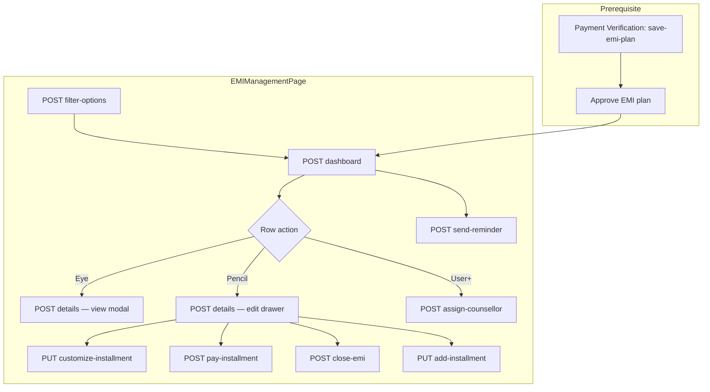

# EMI Management — Frontend Integration Guide (Step-by-Step)

Use this document as the **single source of truth** for integrating **Finance Operations → EMI Management** in the admin panel.

**Base path:** `/api/finance/emi-management`  
**Auth:** Bearer token — **Read:** any authenticated user | **Write:** Super Admin or Finance Admin  
**Postman:** Import `EMI_MANAGEMENT_POSTMAN_COLLECTION.json` from the repo root.

**Prerequisite:** EMI plan must be **approved** in Payment Verification before the student appears here.  
See: `PAYMENT_VERIFICATION_CENTER_FRONTEND_API_GUIDE.md`

**Deep API reference:** `EMI_MANAGEMENT_API_GUIDE.md`

---

## Table of contents

1. [Module overview](#1-module-overview)
2. [Authentication & roles](#2-authentication--roles)
3. [Standard response format](#3-standard-response-format)
4. [API summary](#4-api-summary)
5. [Page layout → API mapping](#5-page-layout--api-mapping)
6. [Step 1 — EMI Management page load](#6-step-1--emi-management-page-load)
7. [Step 2 — Centre tab change](#7-step-2--centre-tab-change)
8. [Step 3 — EMI Students filter & search](#8-step-3--emi-students-filter--search)
9. [Step 4 — Automation reminders table](#9-step-4--automation-reminders-table)
10. [Step 5 — EMI Students table & row actions](#10-step-5--emi-students-table--row-actions)
11. [Step 6 — EMI Student Details modal (eye icon)](#11-step-6--emi-student-details-modal-eye-icon)
12. [Step 7 — Edit EMI Installments drawer (pencil icon)](#12-step-7--edit-emi-installments-drawer-pencil-icon)
13. [Step 8 — Customize Installment modal](#13-step-8--customize-installment-modal)
14. [Step 9 — Pay Installment modal](#14-step-9--pay-installment-modal)
15. [Step 10 — Close EMI Early modal](#15-step-10--close-emi-early-modal)
16. [Step 11 — Add installment row](#16-step-11--add-installment-row)
17. [Step 12 — Assign Counselor modal (user+ icon)](#17-step-12--assign-counselor-modal-user-icon)
18. [Step 13 — After payment / close (refresh)](#18-step-13--after-payment--close-refresh)
19. [Status badges & action visibility](#19-status-badges--action-visibility)
20. [TypeScript interfaces & service layer](#20-typescript-interfaces--service-layer)
21. [Error handling](#21-error-handling)
22. [Testing checklist](#22-testing-checklist)

---

## 1. Module overview

EMI Management is used **after** an EMI plan is approved in Payment Verification. Admins can:

- View dashboard KPIs and centre-wise data
- Track automation reminders (upcoming due dates)
- List all EMI students with filters
- **View details** (eye icon)
- **Edit installments** (pencil icon) — customize, pay, close early, add rows
- **Assign counselor** (user+ icon)



**Important:**

1. Installment **pay**, **customize**, and **close** happen here — **not** in Payment Verification.
2. `POST /pay-installment` and `POST /close-emi` record payments **immediately** (auto-verified). No separate verification step.
3. Use **`POST /dashboard`** as the primary page API (includes KPI cards, centre tabs, reminders, and students table).

---

## 2. Authentication & roles

```http
Authorization: Bearer <token>
Content-Type: application/json
```

For proof uploads use `multipart/form-data`.

### Login

```http
POST /api/auth/login-super-admin
Content-Type: application/json

{
  "email": "admin@sriramias.com",
  "password": "your-password"
}
```

### Permissions

| Action | Any authenticated user | Super Admin / Finance Admin |
|--------|:---------------------:|:---------------------------:|
| Dashboard, list, details, filter options | ✅ | ✅ |
| Pay installment, customize, close, add/remove installment | ❌ | ✅ |
| Assign counselor, send reminder, settle | ❌ | ✅ |

---

## 3. Standard response format

### Success

```json
{
  "success": true,
  "statusCode": 10000,
  "message": "EMI dashboard fetched successfully",
  "data": { },
  "error": null
}
```

### Validation error (400)

```json
{
  "success": false,
  "statusCode": 11000,
  "message": "\"emiPlanId\" is required",
  "data": null,
  "error": "\"emiPlanId\" is required"
}
```

---

## 4. API summary

| # | UI trigger | Method | Endpoint | Auth |
|---|------------|--------|----------|------|
| 1 | Page load — dropdowns | POST | `/filter-options` | Read |
| 2 | Page load / centre / filters | POST | `/dashboard` | Read |
| 3 | View details (eye) | POST | `/details` | Read |
| 4 | Customize installment | PUT | `/customize-installment` | Write |
| 5 | Pay installment | POST | `/pay-installment` | Write |
| 6 | Close EMI early | POST | `/close-emi` | Write |
| 7 | Close EMI (legacy alias) | PUT | `/close` | Write |
| 8 | Add installment row | PUT | `/add-installment` | Write |
| 9 | Remove installment row | DELETE | `/remove-installment` | Write |
| 10 | Assign counselor | POST | `/assign-counsellor` | Write |
| 11 | Resend reminder (bell) | POST | `/send-reminder` | Write |
| 12 | Lump-sum partial settle | POST | `/settle` | Write |
| 13 | Legacy bulk save grid | PUT | `/save` | Write |
| 14 | Upload proof only | POST | `/upload-proof` | Write |

> **Recommended (2026 UI):** Use `/customize-installment`, `/pay-installment`, and `/close-emi` from the Edit EMI drawer. Legacy `PUT /save` still works for bulk grid saves.

---

## 5. Page layout → API mapping

### Dashboard header & KPI cards

| UI element | API field | Notes |
|------------|-----------|-------|
| Total EMI Students | `data.cards.totalEmiStudents` | Always **All Centres** total |
| Active EMI Plans | `data.cards.activeEmiPlans` | Global |
| Pending EMI Collection | `data.cards.pendingEmiCollection` | Global, rupees |
| Overdue EMI | `data.cards.overdueEmi` | Global count |
| EMI Collected This Month | `data.cards.emiCollectedThisMonth` | Global |
| Total EMI Revenue | `data.cards.totalEmiRevenue` | Global |

**KPI cards ignore `centerId`** — they always show organisation-wide totals.

### Centre tabs

| UI | API field |
|----|-----------|
| All Centres / Delhi / Hyderabad / Pune pills | `data.centers[]` |
| Active tab | `data.selectedCenterId` |

### Automation reminders table

| Column | API field |
|--------|-----------|
| Student Name | `studentName` |
| City | `city` |
| Due Date | `dueDate` |
| EMI Amount | `emiAmount` |
| Days Remaining | `daysRemaining` |
| Reminder Status | `reminderStatus` |
| Bell action | `canResend` → `POST /send-reminder` |
| Row keys | `emiPlanId`, `installmentId` |

### EMI Students table

| Column | API field |
|--------|-----------|
| Student Name | `studentName` |
| Student ID | `studentId` |
| City | `city` |
| Course | `courseName` |
| EMI Plan | `emiPlanSummary` (e.g. `5 × ₹15,000 · Monthly EMI`) |
| EMI Amount | `emiAmount` |
| Installments Paid | `installmentsPaid` |
| Remaining Installments | `remainingInstallments` |
| Next Due Date | `nextDueDate` |
| Pending Amount | `pendingAmount` |
| EMI Status badge | `emiStatusLabel` |
| Assigned Counselor | `assignedCounselorName` |
| Eye / Pencil / User+ actions | `emiPlanId` |

### Filter bar (EMI Students section)

| Dropdown | Source | Filter key on dashboard |
|----------|--------|-------------------------|
| Search | — | `search` |
| All courses | `filter-options.data.courses` | `courseId` |
| All EMI statuses | `filter-options.data.emiStatuses` | `emiStatus` |
| All counselors | `filter-options.data.counselors` | `counselorId` |
| All months | `filter-options.data.months` | `month` (`YYYY-MM`) |

---

## 6. Step 1 — EMI Management page load

**Trigger:** User navigates to Finance → EMI Management.

**Parallel API calls:**

```typescript
await Promise.all([
  api.post('/api/finance/emi-management/filter-options', {}),
  api.post('/api/finance/emi-management/dashboard', defaultDashboardBody)
]);
```

### 6.1 Filter options (once per session)

```http
POST /api/finance/emi-management/filter-options
Authorization: Bearer <token>
Content-Type: application/json

{}
```

**Response:**

```json
{
  "success": true,
  "statusCode": 10000,
  "message": "EMI management filter options fetched successfully",
  "data": {
    "courses": [
      {
        "_id": "674course1234567890abcdef",
        "courseName": "GS Mains Comprehensive"
      },
      {
        "_id": "674course2234567890abcdef",
        "courseName": "UPSC Prelims Foundation"
      }
    ],
    "emiStatuses": [
      { "value": "EMI_RUNNING", "label": "EMI Running" },
      { "value": "EMI_COMPLETED", "label": "EMI Completed" },
      { "value": "OVERDUE", "label": "Overdue" },
      { "value": "DUE", "label": "Due" },
      { "value": "CLOSED", "label": "Closed" },
      { "value": "SETTLEMENT_REQUESTED", "label": "Settlement Requested" },
      { "value": "PENDING_VERIFICATION", "label": "Pending Verification" }
    ],
    "counselors": [
      {
        "_id": "674counselor1234567890abcdef",
        "employeeId": "EMP-001",
        "name": "Priya Sharma",
        "fullName": "Priya Sharma",
        "officialEmail": "priya@sriramias.com"
      },
      {
        "_id": "674counselor2234567890abcdef",
        "employeeId": "EMP-002",
        "name": "Rajesh Kumar",
        "fullName": "Rajesh Kumar",
        "officialEmail": "rajesh@sriramias.com"
      }
    ],
    "months": [
      { "value": "2026-06", "label": "Jun 2026" },
      { "value": "2026-03", "label": "Mar 2026" }
    ],
    "paymentModes": [
      {
        "_id": "674pm1234567890abcdef",
        "paymentModeId": "PM004",
        "paymentModeName": "UPI"
      },
      {
        "_id": "674pm2234567890abcdef",
        "paymentModeId": "PM001",
        "paymentModeName": "Cash"
      }
    ]
  },
  "error": null
}
```

Bind EMI Students filter dropdowns. Use `paymentModes` in Pay Installment and Close EMI modals.

**Note:** Centre tabs come from **`dashboard.data.centers`**, not from filter-options.

### 6.2 Dashboard (primary data load)

```http
POST /api/finance/emi-management/dashboard
Authorization: Bearer <token>
Content-Type: application/json

{
  "centerId": null,
  "courseId": null,
  "emiStatus": "ALL",
  "counselorId": null,
  "month": null,
  "search": "",
  "page": 1,
  "limit": 10,
  "sortBy": "updatedAt",
  "sortOrder": "desc",
  "nextDays": 30,
  "reminderPage": 1,
  "reminderLimit": 10
}
```

**Response:**

```json
{
  "success": true,
  "statusCode": 10000,
  "message": "EMI dashboard fetched successfully",
  "data": {
    "selectedCenterId": null,
    "centers": [
      { "_id": null, "centerName": "All Centres", "label": "All Centres" },
      {
        "_id": "674center1234567890abcdef",
        "centerName": "Delhi Center",
        "city": "Delhi",
        "label": "Delhi Center"
      },
      {
        "_id": "674center2234567890abcdef",
        "centerName": "Hyderabad Center",
        "city": "Hyderabad",
        "label": "Hyderabad Center"
      },
      {
        "_id": "674center3234567890abcdef",
        "centerName": "Pune Center",
        "city": "Pune",
        "label": "Pune Center"
      }
    ],
    "cards": {
      "totalEmiStudents": 6,
      "activeEmiPlans": 5,
      "pendingEmiCollection": 360000,
      "overdueEmi": 3,
      "emiCollectedThisMonth": 0,
      "totalEmiRevenue": 230000
    },
    "automationReminders": {
      "page": 1,
      "limit": 10,
      "total": 2,
      "totalPages": 1,
      "items": [
        {
          "emiPlanId": "674emiplan1234567890abcdef",
          "installmentId": "674install3234567890abcdef",
          "studentName": "Arjun Mehta",
          "studentId": "STU-ARJ-01",
          "courseName": "GS Mains Comprehensive",
          "city": "Delhi",
          "dueDate": "2026-06-30T00:00:00.000Z",
          "emiAmount": 15000,
          "pendingAmount": 45000,
          "daysRemaining": 1,
          "reminderStatus": "Upcoming",
          "reminderCount": 0,
          "manualReminderCount": 0,
          "lastReminderSentAt": null,
          "nextReminderDate": "2026-06-29T00:00:00.000Z",
          "autoReminderEnabled": true,
          "canResend": true
        },
        {
          "emiPlanId": "674emiplan2234567890abcdef",
          "installmentId": "674install4234567890abcdef",
          "studentName": "Meera Joshi",
          "studentId": "STU-24005",
          "courseName": "UPSC Prelims Foundation",
          "city": "Pune",
          "dueDate": "2026-07-10T00:00:00.000Z",
          "emiAmount": 20000,
          "pendingAmount": 80000,
          "daysRemaining": 11,
          "reminderStatus": "Upcoming",
          "reminderCount": 0,
          "manualReminderCount": 0,
          "lastReminderSentAt": null,
          "nextReminderDate": "2026-07-07T00:00:00.000Z",
          "autoReminderEnabled": true,
          "canResend": false
        }
      ]
    },
    "emiStudents": {
      "page": 1,
      "limit": 10,
      "total": 6,
      "totalPages": 1,
      "items": [
        {
          "emiPlanId": "674emiplan1234567890abcdef",
          "emiPlanRef": "EMP000012",
          "studentId": "STU-24002",
          "studentName": "Neha Verma",
          "mobileNumber": "9876543212",
          "email": "neha.verma@example.com",
          "city": "Delhi",
          "courseId": "674course1234567890abcdef",
          "courseName": "GS Mains Comprehensive",
          "batchId": "674batch1234567890abcdef",
          "emiPlanSummary": "5 × ₹15,000 · Monthly EMI",
          "emiAmount": 15000,
          "installmentsPaid": 2,
          "remainingInstallments": 3,
          "nextDueDate": "2026-03-10T00:00:00.000Z",
          "pendingAmount": 45000,
          "emiStatus": "OVERDUE",
          "emiStatusLabel": "Overdue",
          "assignedCounselor": "674counselor1234567890abcdef",
          "assignedCounselorName": "Priya Sharma",
          "counselorPriority": "MEDIUM"
        }
      ]
    }
  },
  "error": null
}
```

Bind:
- KPI cards from `data.cards`
- Centre pills from `data.centers`
- Reminders table from `data.automationReminders.items`
- EMI Students table from `data.emiStudents.items`
- Pagination: `Showing 1–6 of 6 students` → `emiStudents.total`, `page`, `limit`

---

## 7. Step 2 — Centre tab change

**Trigger:** User clicks a centre pill (e.g. **Delhi**, **Hyderabad**, **Pune**).

```http
POST /api/finance/emi-management/dashboard
Content-Type: application/json

{
  "centerId": "674center1234567890abcdef",
  "courseId": null,
  "emiStatus": "ALL",
  "counselorId": null,
  "month": null,
  "search": "",
  "page": 1,
  "limit": 10,
  "nextDays": 30,
  "reminderPage": 1,
  "reminderLimit": 10
}
```

| Behaviour | Detail |
|-----------|--------|
| KPI cards | **Unchanged** — still global totals from `data.cards` |
| Centre tabs | `data.selectedCenterId` reflects active tab |
| Reminders table | Filtered to selected centre |
| EMI Students table | Filtered to selected centre |

**All Centres:** send `"centerId": null`.

Do **not** re-call `/filter-options` on centre change.

---

## 8. Step 3 — EMI Students filter & search

**Trigger:** User changes search, course, EMI status, counselor, or month dropdown.

**Rules:**
- Debounce search ~400 ms
- Reset `page` to `1` on any filter change
- Call **`POST /dashboard` only** (not filter-options)

Example filtered body:

```json
{
  "centerId": null,
  "courseId": "674course1234567890abcdef",
  "emiStatus": "OVERDUE",
  "counselorId": "674counselor1234567890abcdef",
  "month": "2026-03",
  "search": "Neha",
  "page": 1,
  "limit": 10,
  "nextDays": 30,
  "reminderPage": 1,
  "reminderLimit": 10
}
```

| Filter | Send when "All" selected |
|--------|--------------------------|
| `emiStatus` | `"ALL"` or omit |
| `courseId` | `null` |
| `counselorId` | `null` |
| `month` | `null` or empty string |

### Pagination (EMI Students)

| User action | API change |
|-------------|------------|
| Next page | `{ "page": 2, ...same filters }` |
| Change rows per page | `{ "limit": 25, "page": 1 }` |
| Go to page input | `{ "page": N }` |

Reminders table has **separate** pagination: `reminderPage`, `reminderLimit`.

---

## 9. Step 4 — Automation reminders table

### Display mapping

| Column | Field | Format |
|--------|-------|--------|
| Student Name | `studentName` | |
| City | `city` | |
| Due Date | `dueDate` | e.g. `30 Jun 2026` |
| EMI Amount | `emiAmount` | `₹15,000` |
| Days Remaining | `daysRemaining` | Orange highlight when ≤ 3 |
| Reminder Status | `reminderStatus` | e.g. `Not sent`, `Reminder 1 Sent` |
| Bell icon | `canResend` | Enabled only when `true` |

### Send / resend reminder

**Trigger:** User clicks bell icon when `canResend === true`.

```http
POST /api/finance/emi-management/send-reminder
Authorization: Bearer <token>
Content-Type: application/json

{
  "emiPlanId": "674emiplan1234567890abcdef",
  "installmentId": "674install3234567890abcdef"
}
```

**Response:**

```json
{
  "success": true,
  "statusCode": 10000,
  "message": "EMI reminder resent successfully",
  "data": {
    "emiPlanId": "674emiplan1234567890abcdef",
    "installmentId": "674install3234567890abcdef",
    "sentTo": "neha.verma@example.com",
    "daysRemaining": 1,
    "reminderStatus": "Reminder 1 Sent",
    "reminderCount": 1,
    "manualReminderCount": 1,
    "lastReminderSentAt": "2026-06-29T10:30:00.000Z",
    "nextReminderDate": "2026-06-30T00:00:00.000Z",
    "message": "EMI reminder resent successfully"
  },
  "error": null
}
```

After success: refresh dashboard or update row in place.

---

## 10. Step 5 — EMI Students table & row actions

Each row exposes three action icons. All require `emiPlanId` from the row.

| Icon | Modal / screen | Primary APIs |
|------|----------------|--------------|
| **Eye** | EMI Student Details (read-only) | `POST /details` |
| **Pencil** | Edit EMI Installments (full drawer) | `POST /details` + write APIs |
| **User+** | Assign Counselor | `POST /assign-counsellor` |

### Action visibility (recommended)

```typescript
const canEditEmi = ['EMI_RUNNING', 'DUE', 'OVERDUE'].includes(row.emiStatus);
const canAssignCounselor = row.emiStatus !== 'CLOSED' && row.emiStatus !== 'PENDING_VERIFICATION';
const showViewDetails = true; // always
```

Only **Finance Admin / Super Admin** should see pencil, pay, close, and assign actions.

---

## 11. Step 6 — EMI Student Details modal (eye icon)

**Trigger:** User clicks **eye** on a row.

```http
POST /api/finance/emi-management/details
Authorization: Bearer <token>
Content-Type: application/json

{
  "emiPlanId": "674emiplan1234567890abcdef"
}
```

**Response:**

```json
{
  "success": true,
  "statusCode": 10000,
  "message": "EMI details fetched successfully",
  "data": {
    "emiPlanId": "674emiplan1234567890abcdef",
    "emiPlanRef": "EMP000012",
    "student": {
      "_id": "674student1234567890abcdef",
      "studentId": "STU-24002",
      "studentName": "Neha Verma",
      "mobileNumber": "9876543212",
      "email": "neha.verma@example.com",
      "city": "Delhi"
    },
    "amountPaid": 30000,
    "installmentPaid": 30000,
    "pendingAmount": 45000,
    "overdueAmount": 45000,
    "nextDueDate": "2026-03-10T00:00:00.000Z",
    "totalFee": 75000,
    "downPayment": 0,
    "emiPlanSummary": "5 × ₹15,000 · Monthly EMI",
    "emiStatus": "OVERDUE",
    "emiStatusLabel": "Overdue",
    "assignedCounselor": "674counselor1234567890abcdef",
    "assignedCounselorName": "Priya Sharma",
    "counselorPriority": "MEDIUM",
    "counselorRemarks": "Follow up before due date",
    "courseName": "GS Mains Comprehensive",
    "batchName": "Morning Batch 2026",
    "centerName": "Delhi Center",
    "schedule": {
      "emiStartDate": "2026-01-10T00:00:00.000Z",
      "emiEndDate": "2026-05-10T00:00:00.000Z",
      "months": 5,
      "completionPercent": 40
    },
    "installmentSchedule": [
      {
        "_id": "674install1234567890abcdef",
        "installmentNo": 1,
        "emiMonth": "Jan 2026",
        "dueDate": "2026-01-10T00:00:00.000Z",
        "amount": 15000,
        "paidAmount": 15000,
        "remainingBalance": 0,
        "status": "PAID",
        "statusLabel": "Paid",
        "paymentModeId": "PM004",
        "paymentModeName": "UPI",
        "receiptNumber": "RCP-E1",
        "utrNumber": "UPI9988776611",
        "paymentProofUrl": "https://res.cloudinary.com/.../upi-screenshot-jan.jpg",
        "hasProof": true,
        "paidDate": "2026-01-10T00:00:00.000Z",
        "remarks": "First EMI collected at counter"
      },
      {
        "_id": "674install2234567890abcdef",
        "installmentNo": 2,
        "emiMonth": "Feb 2026",
        "dueDate": "2026-02-10T00:00:00.000Z",
        "amount": 15000,
        "paidAmount": 15000,
        "remainingBalance": 0,
        "status": "PAID",
        "statusLabel": "Paid",
        "paymentModeId": "PM002",
        "paymentModeName": "Bank Transfer",
        "receiptNumber": "RCP-E2",
        "utrNumber": "NEFT223344",
        "hasProof": true,
        "paidDate": "2026-02-12T00:00:00.000Z",
        "remarks": ""
      },
      {
        "_id": "674install3234567890abcdef",
        "installmentNo": 3,
        "emiMonth": "Mar 2026",
        "dueDate": "2026-03-10T00:00:00.000Z",
        "amount": 15000,
        "paidAmount": 0,
        "remainingBalance": 15000,
        "status": "OVERDUE",
        "statusLabel": "Overdue",
        "paymentModeId": null,
        "paymentModeName": "",
        "receiptNumber": "",
        "utrNumber": "",
        "hasProof": false,
        "paidDate": null,
        "remarks": ""
      }
    ],
    "paymentHistory": [
      {
        "emiInstallmentId": "674install2234567890abcdef",
        "installmentNo": 2,
        "paymentType": "INSTALLMENT_PAYMENT",
        "paidDate": "2026-02-12T00:00:00.000Z",
        "amount": 15000,
        "mode": "Bank Transfer",
        "receiptNumber": "RCP-E2",
        "utrNumber": "NEFT223344",
        "paymentProofUrl": "https://res.cloudinary.com/.../proof-feb.jpg"
      },
      {
        "emiInstallmentId": "674install1234567890abcdef",
        "installmentNo": 1,
        "paymentType": "INSTALLMENT_PAYMENT",
        "paidDate": "2026-01-10T00:00:00.000Z",
        "amount": 15000,
        "mode": "UPI",
        "receiptNumber": "RCP-E1",
        "utrNumber": "UPI9988776611",
        "paymentProofUrl": "https://res.cloudinary.com/.../upi-screenshot-jan.jpg"
      }
    ]
  },
  "error": null
}
```

### View modal field mapping

| UI label | Field |
|----------|-------|
| Title subtitle | `{studentName} · {studentId}` |
| Amount Paid (blue) | `amountPaid` |
| Pending Amount (red) | `pendingAmount` |
| Next Due Date | `nextDueDate` |
| Student ID | `student.studentId` |
| Mobile | `student.mobileNumber` |
| Email | `student.email` |
| City | `student.city` |
| Course | `courseName` |
| Total Fees | `totalFee` |
| EMI Plan | `emiPlanSummary` |
| EMI Status pill | `emiStatusLabel` |
| Assigned Counselor | `assignedCounselorName` |
| Installment schedule table | `installmentSchedule[]` |
| Payment history table | `paymentHistory[]` |

### Installment schedule status pills

| `status` | Badge color | Label |
|----------|-------------|-------|
| `PAID` | Green | Paid |
| `OVERDUE` | Red | Overdue |
| `DUE` | Orange | Due |
| `PARTIAL` | Yellow | Partial |
| `CLOSED` | Grey | Closed |

Footer: **Close** button only (read-only modal — no save).

---

## 12. Step 7 — Edit EMI Installments drawer (pencil icon)

**Trigger:** User clicks **pencil** on a row.

1. Call `POST /details` with `{ emiPlanId }` (same response as Step 6).
2. Open **Edit EMI Installments** drawer with full data.

### Drawer summary cards

| UI card | Field |
|---------|-------|
| EMI Schedule | `schedule.emiStartDate` – `schedule.emiEndDate`, `{schedule.months} installments` |
| Total Fee | `totalFee` |
| Paid Amount | `amountPaid` |
| Pending Amount | `pendingAmount` |
| Overdue Amount | `overdueAmount` |
| EMI Completion Progress | `schedule.completionPercent` % |
| Next Due Date | `nextDueDate` |

### Installment management table

| Column | Field | Actions |
|--------|-------|---------|
| # | `installmentNo` | |
| EMI Month | `emiMonth` | |
| Due Date | `dueDate` | |
| EMI Amount | `amount` | |
| Paid Amount | `paidAmount` | |
| Balance | `remainingBalance` | |
| Status | `statusLabel` | Colored pill |
| Edit (pencil) | — | Opens Customize modal → Step 8 |
| Pay (blue button) | — | Opens Pay modal → Step 9 (only if unpaid) |

### Early EMI closure banner

Show when `pendingAmount > 0` and plan is active:

- Text: *"Student paying full remaining balance (₹{pendingAmount}). Future installments will be closed automatically."*
- Button **Close EMI & collect full balance** → Step 10

### Per-row action rules

```typescript
const canCustomize = !['PAID', 'CLOSED'].includes(row.status);
const canPay = row.remainingBalance > 0 && !['PAID', 'CLOSED'].includes(row.status);
```

---

## 13. Step 8 — Customize Installment modal

**Trigger:** User clicks pencil on an installment row in Edit drawer.

**Pre-fill from row:** `emiAmount` = `amount`, `dueDate`, `lateFee`, `discount`, `customCharge` (defaults 0).

```http
PUT /api/finance/emi-management/customize-installment
Authorization: Bearer <token>
Content-Type: application/json

{
  "emiPlanId": "674emiplan1234567890abcdef",
  "installmentId": "674install3234567890abcdef",
  "emiAmount": 15000,
  "dueDate": "2026-03-15",
  "lateFee": 0,
  "discount": 0,
  "customCharge": 0,
  "autoRebalance": true,
  "reason": "Extended due date for student request"
}
```

| Field | Required | Notes |
|-------|----------|-------|
| `emiPlanId` | Yes | From row / drawer |
| `installmentId` | Yes | Installment `_id` |
| `emiAmount` | Yes | Base EMI amount (₹) |
| `dueDate` | No | ISO date — defaults to current |
| `lateFee` | No | Default `0` |
| `discount` | No | Default `0` |
| `customCharge` | No | Default `0` |
| `autoRebalance` | No | When `true`, redistributes remaining unpaid installments |
| `reason` | No | Audit note, max 500 chars |

**Final amount** = `emiAmount + lateFee + customCharge - discount`.

**Response:** Full EMI details payload (same shape as `/details`) with updated schedule and recalculated balances.

```json
{
  "success": true,
  "statusCode": 10000,
  "message": "Installment customized successfully",
  "data": {
    "emiPlanId": "674emiplan1234567890abcdef",
    "pendingAmount": 45000,
    "overdueAmount": 45000,
    "schedule": { "completionPercent": 40 },
    "installmentSchedule": [ "...updated rows..." ]
  },
  "error": null
}
```

**Rules:**
- Plan must be **`ACTIVE`**
- Cannot customize **paid** or **closed** installments

After success: close modal, refresh drawer from response `data`, optionally refresh dashboard.

---

## 14. Step 9 — Pay Installment modal

**Trigger:** User clicks **Pay** on an unpaid installment row.

Pre-fill:
- Title: `Installment #{installmentNo} - {emiMonth}`
- Amount is the **full remaining balance** (backend pays entire balance automatically)

```http
POST /api/finance/emi-management/pay-installment
Authorization: Bearer <token>
Content-Type: multipart/form-data
```

| Form field | Required | Notes |
|------------|----------|-------|
| `emiPlanId` | Yes | |
| `installmentId` | Yes | |
| `paymentModeId` | Recommended | e.g. `PM004` (UPI) |
| `paymentDate` | No | Defaults to today |
| `receiptNumber` | No | Auto-generated if empty |
| `referenceNumber` or `utrNumber` | No | UPI ref, cheque no. |
| `remarks` | No | Max 500 chars |
| `paymentProof` or `proofFile` | Recommended | JPG, PNG, PDF |

Example FormData:

```
emiPlanId: 674emiplan1234567890abcdef
installmentId: 674install3234567890abcdef
paymentModeId: PM004
paymentDate: 2026-03-10
receiptNumber: RCP-E3
referenceNumber: UPI9988776622
remarks: Third EMI collected at counter
paymentProof: <file>
```

**Response:**

```json
{
  "success": true,
  "statusCode": 10000,
  "message": "Installment payment recorded successfully",
  "data": {
    "emiPlanId": "674emiplan1234567890abcdef",
    "installmentId": "674install3234567890abcdef",
    "amountPaid": 15000,
    "receiptNumber": "RCP-E3",
    "pendingAmount": 30000,
    "completionPercentage": 60,
    "emiPlanStatus": "ACTIVE",
    "studentPaymentReport": {
      "transactionId": "SPT-2026-042",
      "paidAmount": 45000,
      "pendingAmount": 30000,
      "status": "PARTIAL"
    },
    "receipt": { "receiptNumber": "RCP-E3" },
    "message": "Installment payment recorded successfully"
  },
  "error": null
}
```

**Rules:**
- Payment recorded **immediately** (no Payment Verification queue)
- Pays **full remaining balance** of that installment
- Cannot pay already paid/closed installments
- Plan → `PAID` when all installments fully paid

After success: close modal, refresh drawer (`POST /details`) and dashboard.

---

## 15. Step 10 — Close EMI Early modal

**Trigger:** User clicks **Close EMI & collect full balance** in Edit drawer.

Pre-fill **Amount Collecting Now** with exact `pendingAmount` from details (e.g. `45000`).

```http
POST /api/finance/emi-management/close-emi
Authorization: Bearer <token>
Content-Type: multipart/form-data
```

Also works: `PUT /api/finance/emi-management/close` (same fields).

| Form field | Required | Notes |
|------------|----------|-------|
| `emiPlanId` | Yes | |
| `amountCollected` | Yes* | Must **exactly equal** pending balance |
| `remainingAmount` | Alt* | Same as `amountCollected` |
| `paymentModeId` | Recommended | e.g. `PM001` (Cash) |
| `paymentDate` | No | |
| `receiptNumber` | No | |
| `referenceNumber` / `utrNumber` | No | |
| `remarks` / `closureRemarks` | No | |
| `paymentProof` or `proofFile` | **Yes** | Mandatory for closure |

Example FormData:

```
emiPlanId: 674emiplan1234567890abcdef
amountCollected: 45000
paymentModeId: PM001
paymentDate: 2026-06-30
receiptNumber: RCP-CLOSE-001
referenceNumber: UPI-CLOSE-9988
remarks: Student paid remaining balance at counter
paymentProof: <file>
```

**Response:**

```json
{
  "success": true,
  "statusCode": 10000,
  "message": "EMI closed successfully",
  "data": {
    "emiPlanId": "674emiplan1234567890abcdef",
    "amountCollected": 45000,
    "pendingAmount": 0,
    "completionPercentage": 100,
    "emiPlanStatus": "CLOSED",
    "closureReceipt": "RCP-CLOSE-001",
    "closureReference": "UPI-CLOSE-9988",
    "closedDate": "2026-06-30T12:00:00.000Z",
    "studentPaymentReport": {
      "transactionId": "SPT-2026-042",
      "paidAmount": 75000,
      "pendingAmount": 0,
      "status": "PAID"
    },
    "message": "EMI closed successfully"
  },
  "error": null
}
```

**Rules:**
- `amountCollected` must **exactly match** current `pendingAmount` — no partial close via this endpoint (use `POST /settle` for partial lump sums)
- Closes **immediately** — all future installments marked `CLOSED`
- Plan status → `CLOSED`, completion → 100%
- **`paymentProof` is mandatory**

After success: close modals, refresh dashboard. Row shows **Closed** badge.

---

## 16. Step 11 — Add installment row

**Trigger:** User clicks **+ Add Installment** in Edit drawer.

```http
PUT /api/finance/emi-management/add-installment
Authorization: Bearer <token>
Content-Type: application/json

{
  "emiPlanId": "674emiplan1234567890abcdef"
}
```

**Response:** Full EMI details payload with new row appended at end:
- Next `installmentNo`
- Due date = last installment + 1 month
- Initial `amount: 0` — customize before collecting

**Rules:** Plan must be **`ACTIVE`**.

To remove an unpaid row:

```http
DELETE /api/finance/emi-management/remove-installment
Content-Type: application/json

{
  "emiPlanId": "674emiplan1234567890abcdef",
  "installmentId": "674install5234567890abcdef"
}
```

Cannot remove installments with `paidAmount > 0`.

---

## 17. Step 12 — Assign Counselor modal (user+ icon)

**Trigger:** User clicks **user+** on EMI Students table row.

Pre-fill student card from row: name, `studentId`, course, `pendingAmount`.

Counselor dropdown from `filter-options.data.counselors`.

```http
POST /api/finance/emi-management/assign-counsellor
Authorization: Bearer <token>
Content-Type: application/json

{
  "emiPlanId": "674emiplan1234567890abcdef",
  "counsellorId": "674counselor1234567890abcdef",
  "priority": "MEDIUM",
  "remarks": "Follow-up notes for counselor"
}
```

| Field | Required | Values |
|-------|----------|--------|
| `emiPlanId` | Yes | Row `emiPlanId` |
| `counsellorId` or `counselorId` | Yes | Counselor `_id` from filter-options |
| `priority` | No | `HIGH`, `MEDIUM`, `LOW` (default `MEDIUM`) |
| `remarks` | No | Max 500 chars |

**Response:**

```json
{
  "success": true,
  "statusCode": 10000,
  "message": "Counselor assigned successfully",
  "data": {
    "emiPlanId": "674emiplan1234567890abcdef",
    "assignedCounselor": "674counselor1234567890abcdef",
    "assignedCounselorName": "Priya Sharma",
    "counselorPriority": "MEDIUM",
    "counselorRemarks": "Follow-up notes for counselor",
    "message": "Counselor assigned successfully"
  },
  "error": null
}
```

After success:
- Close modal
- Update row `assignedCounselorName` in table
- Optional: refresh dashboard

Helper text under dropdown: *"Assigning to {assignedCounselorName}"*

---

## 18. Step 13 — After payment / close (refresh)

After any write action, refresh affected UI:

| Action | Refresh |
|--------|---------|
| Pay installment | Edit drawer (`POST /details`) + dashboard |
| Customize installment | Edit drawer from response + dashboard |
| Close EMI | Close all modals + dashboard |
| Assign counselor | Update table row or dashboard |
| Send reminder | Update reminders row or dashboard |

Recommended pattern:

```typescript
const refreshAfterWrite = async (emiPlanId: string) => {
  await fetchEmiDashboard(currentFilters);
  if (editDrawerOpen) await fetchEmiDetails(emiPlanId);
};
```

---

## 19. Status badges & action visibility

### Plan-level EMI status (`emiStatus`)

| Value | Label | Badge |
|-------|-------|-------|
| `EMI_RUNNING` | EMI Running | Blue |
| `DUE` | Due | Orange |
| `OVERDUE` | Overdue | Red |
| `EMI_COMPLETED` | EMI Completed | Green |
| `CLOSED` | Closed | Dark grey |
| `SETTLEMENT_REQUESTED` | Settlement Requested | Light grey |
| `PENDING_VERIFICATION` | Pending Verification | Yellow |

Use `emiStatusLabel` from API for display text.

### Installment-level status

| Value | Label | Color |
|-------|-------|-------|
| `PAID` | Paid | Green |
| `OVERDUE` | Overdue | Red |
| `DUE` | Due | Orange |
| `PARTIAL` | Partial | Yellow |
| `CLOSED` | Closed | Grey |

### Edit drawer action matrix

| Plan status | Customize | Pay | Close early | Add row |
|-------------|:---------:|:---:|:-----------:|:-------:|
| `EMI_RUNNING` / `DUE` / `OVERDUE` | ✅ | ✅ | ✅ | ✅ |
| `CLOSED` / `EMI_COMPLETED` | ❌ | ❌ | ❌ | ❌ |
| `PENDING_VERIFICATION` | ❌ | ❌ | ❌ | ❌ |

---

## 20. TypeScript interfaces & service layer

```typescript
const BASE = '/api/finance/emi-management';

export interface EmiStudentRow {
  emiPlanId: string;
  emiPlanRef: string;
  studentId: string;
  studentName: string;
  mobileNumber: string;
  email: string;
  city: string;
  courseName: string;
  emiPlanSummary: string;
  emiAmount: number;
  installmentsPaid: number;
  remainingInstallments: number;
  nextDueDate: string | null;
  pendingAmount: number;
  emiStatus: string;
  emiStatusLabel: string;
  assignedCounselor: string | null;
  assignedCounselorName: string;
  counselorPriority: string | null;
}

export interface EmiInstallmentRow {
  _id: string;
  installmentNo: number;
  emiMonth: string;
  dueDate: string;
  amount: number;
  paidAmount: number;
  remainingBalance: number;
  status: string;
  statusLabel: string;
  paymentModeId: string | null;
  paymentModeName: string;
  receiptNumber: string;
  utrNumber: string;
  paymentProofUrl: string;
  hasProof: boolean;
  paidDate: string | null;
  remarks: string;
}

export interface EmiDetails {
  emiPlanId: string;
  emiPlanRef: string;
  student: {
    _id: string;
    studentId: string;
    studentName: string;
    mobileNumber: string;
    email: string;
    city: string;
  };
  amountPaid: number;
  pendingAmount: number;
  overdueAmount: number;
  nextDueDate: string | null;
  totalFee: number;
  emiPlanSummary: string;
  emiStatus: string;
  emiStatusLabel: string;
  assignedCounselorName: string;
  courseName: string;
  schedule: {
    emiStartDate: string;
    emiEndDate: string;
    months: number;
    completionPercent: number;
  };
  installmentSchedule: EmiInstallmentRow[];
  paymentHistory: Array<{
    installmentNo: number;
    paidDate: string;
    amount: number;
    mode: string;
    receiptNumber: string;
    utrNumber: string;
  }>;
}

export const emiManagementApi = {
  filterOptions: () => api.post(`${BASE}/filter-options`, {}),

  dashboard: (body: Record<string, unknown>) => api.post(`${BASE}/dashboard`, body),

  details: (emiPlanId: string) => api.post(`${BASE}/details`, { emiPlanId }),

  customizeInstallment: (body: {
    emiPlanId: string;
    installmentId: string;
    emiAmount: number;
    dueDate?: string;
    lateFee?: number;
    discount?: number;
    customCharge?: number;
    autoRebalance?: boolean;
    reason?: string;
  }) => api.put(`${BASE}/customize-installment`, body),

  payInstallment: (formData: FormData) =>
    api.post(`${BASE}/pay-installment`, formData, {
      headers: { 'Content-Type': 'multipart/form-data' }
    }),

  closeEmi: (formData: FormData) =>
    api.post(`${BASE}/close-emi`, formData, {
      headers: { 'Content-Type': 'multipart/form-data' }
    }),

  addInstallment: (emiPlanId: string) =>
    api.put(`${BASE}/add-installment`, { emiPlanId }),

  removeInstallment: (emiPlanId: string, installmentId: string) =>
    api.delete(`${BASE}/remove-installment`, { data: { emiPlanId, installmentId } }),

  assignCounselor: (body: {
    emiPlanId: string;
    counsellorId: string;
    priority?: string;
    remarks?: string;
  }) => api.post(`${BASE}/assign-counsellor`, body),

  sendReminder: (emiPlanId: string, installmentId: string) =>
    api.post(`${BASE}/send-reminder`, { emiPlanId, installmentId }),

  settle: (formData: FormData) =>
    api.post(`${BASE}/settle`, formData, {
      headers: { 'Content-Type': 'multipart/form-data' }
    })
};
```

### Recommended file structure

```
services/emiManagement.service.ts
hooks/useEmiDashboard.ts
hooks/useEmiDetails.ts
components/finance/emi/EmiDashboard.tsx
components/finance/emi/EmiKpiCards.tsx
components/finance/emi/CentreTabs.tsx
components/finance/emi/AutomationRemindersTable.tsx
components/finance/emi/EmiStudentsTable.tsx
components/finance/emi/EmiStudentDetailsModal.tsx
components/finance/emi/EditEmiInstallmentsDrawer.tsx
components/finance/emi/CustomizeInstallmentModal.tsx
components/finance/emi/PayInstallmentModal.tsx
components/finance/emi/CloseEmiEarlyModal.tsx
components/finance/emi/AssignCounselorModal.tsx
types/emiManagement.types.ts
```

---

## 21. Error handling

| Scenario | HTTP | Frontend action |
|----------|------|-----------------|
| Not authenticated | 401 | Redirect to login |
| Write without admin role | 403 | Hide pay/customize/close/assign |
| Missing `emiPlanId` | 400 | Validate before call |
| Installment already paid | 400 | Disable Pay button |
| Close amount mismatch | 400 | Show: must equal pending balance exactly |
| Missing closure proof | 400 | Highlight upload field |
| Invalid counselor | 400 | Refresh counselor dropdown |
| Reminder not in window | 409 | Disable bell, show tooltip |
| Plan not ACTIVE | 400 | Hide edit actions |

---

## 22. Testing checklist

- [ ] Page load: `filter-options` + `dashboard` in parallel
- [ ] KPI cards show global totals regardless of centre tab
- [ ] Centre tab filters reminders + students tables only
- [ ] Search debounce triggers dashboard with `search` param
- [ ] Course / status / counselor / month filters reset page to 1
- [ ] Reminders bell enabled only when `canResend === true`
- [ ] Eye opens view modal with schedule + payment history
- [ ] Pencil opens edit drawer with summary cards + installment table
- [ ] Customize updates schedule; auto-rebalance redistributes amounts
- [ ] Pay installment records payment immediately with proof upload
- [ ] Close EMI requires exact pending amount + mandatory proof
- [ ] User+ assigns counselor; name appears in table column
- [ ] After pay/close/customize, dashboard and drawer refresh
- [ ] Closed plan hides pay/customize/close actions
- [ ] Finance Admin only sees write actions

---

*Last updated: June 2026 — aligns with `/customize-installment`, `/pay-installment`, `/close-emi` in EMI Management module.*
