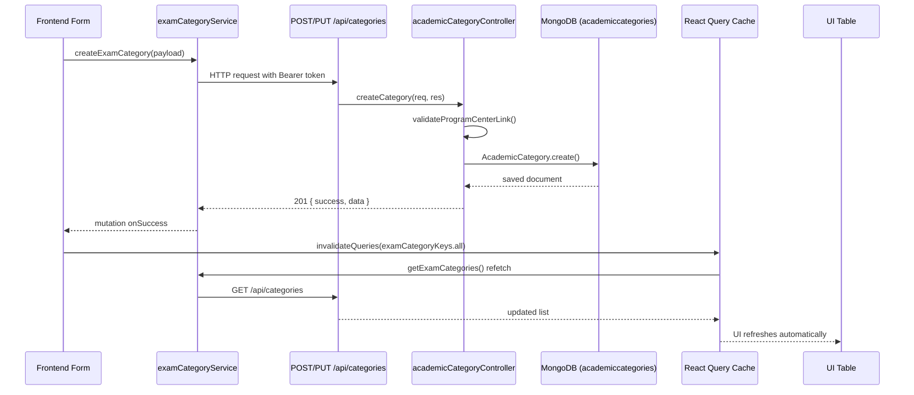

# Exam Category — Frontend Integration Guide

**Admin UI path:** `Academics → Categories → Exam Category` (`/academics/categories/exam-category`)

**Backend resource:** `AcademicCategory` model exposed at **`/api/categories`**

> **Important naming note:** There is no `/api/exam-categories` route in this backend. The admin label **"Exam Category"** maps to the **Academic Category** CRUD module. All API calls must use `/api/categories` with the field names documented below — do not rename backend fields on the wire.

**Base URL:** `https://sriramias-backend.onrender.com` (or `VITE_API_BASE_URL` in the frontend)

**Auth:** Super Admin only — `Authorization: Bearer <JWT>`

**Source files (read-only reference):**

| Layer | File |
|-------|------|
| Route registration | `app.js` → `app.use('/api/categories', academicCategoryRoutes)` |
| Routes | `routes/academicCategoryRoutes.js` |
| Controller | `controllers/academicCategoryController.js` |
| Model | `models/AcademicCategory.js` |
| Hierarchy validation | `utils/academicHierarchyHelpers.js` |
| ID generator | `utils/academicIdGenerator.js` |

---

## Table of Contents

1. [Module Overview](#module-overview)
2. [API Inventory](#api-inventory)
3. [Database Fields](#database-fields)
4. [API Endpoints](#api-endpoints)
5. [Frontend Integration Guide](#frontend-integration-guide)
6. [Service Layer Guide](#service-layer-guide)
7. [React Query Guide](#react-query-guide)
8. [Table Integration Guide](#table-integration-guide)
9. [Form Integration Guide](#form-integration-guide)
10. [Server Persistence Validation](#server-persistence-validation)
11. [Error Handling Guide](#error-handling-guide)
12. [Success Verification Checklist](#success-verification-checklist)
13. [Production Readiness Checklist](#production-readiness-checklist)

---

## Module Overview

### Purpose

The **Exam Category** module manages top-level academic exam categories (e.g. UPSC, APPSC) scoped to a **Center + Program** pair. Each record is a node in the academic hierarchy:

```text
Center → Program → Exam Category (AcademicCategory) → Exam Sub Category → Course → Batch
```

### What the frontend is responsible for

- CRUD UI for exam categories (list table, add/edit form, status toggle, delete)
- Cascading dropdowns: Center → Program (required on create/edit)
- Search, filter, pagination, and sorting on the list table
- React Query cache management after mutations

### What the backend handles

- Auto-generating display IDs (`CAT001`, `CAT002`, …)
- Validating center ↔ program linkage (`program.centers` must include `centerId`)
- Enforcing unique category names per center + program (case-insensitive)
- Populating `centerName` and `programName` in responses
- Computing `linkedSubCategories` and `linkedCourses` on detail view

### Authentication

Every `/api/categories` route applies:

```text
protect → requireSuperAdmin
```

Login endpoints:

| Endpoint | Notes |
|----------|-------|
| `POST /api/auth/login-super-admin` | Legacy super admin user |
| `POST /api/auth/login-admin` | AdminAccess with `roleCode: SUPER_ADMIN` |

---

## API Inventory

| # | Method | URL | Controller | Purpose |
|---|--------|-----|------------|---------|
| 1 | `GET` | `/api/categories/filter` | `getCategoriesFilter` | Dropdown — ACTIVE categories for center + program |
| 2 | `PATCH` | `/api/categories/status/:id` | `updateCategoryStatus` | Status-only toggle |
| 3 | `POST` | `/api/categories` | `createCategory` | Create exam category |
| 4 | `GET` | `/api/categories` | `getCategories` | Paginated list with search/filter/sort |
| 5 | `GET` | `/api/categories/:id` | `getCategoryById` | Detail + linked counts |
| 6 | `PUT` | `/api/categories/:id` | `updateCategory` | Partial update |
| 7 | `DELETE` | `/api/categories/:id` | `deleteCategory` | Hard delete |

### Supporting dropdown APIs (create/edit form)

| Method | URL | Auth | Purpose |
|--------|-----|------|---------|
| `GET` | `/api/admin/centers/dropdown` | Staff Admin+ | Center picker |
| `GET` | `/api/programs/by-center/:centerId` | Super Admin | Program picker after center selected |

### Service layer

There is **no dedicated backend service file** for categories. Business logic lives in `academicCategoryController.js` with shared helpers from `academicHierarchyHelpers.js`.

### Validation (no Joi/Zod middleware)

| Rule | Trigger | HTTP | Message |
|------|---------|------|---------|
| `categoryName` required | Create | 400 | `Category name is required` |
| `categoryName` non-empty | Update | 400 | `Category name cannot be empty` |
| `status` enum | Update / status patch | 400 | `Status must be ACTIVE or INACTIVE` |
| `centerId` + `programId` required | Filter dropdown | 400 | `centerId and programId query parameters are required` |
| Center active | Create / update / filter | 400 | `Invalid or inactive center` |
| Program active | Create / update / filter | 400 | `Invalid or inactive program` |
| Program includes center | Create / update / filter | 400 | `Selected program is not available for the selected center` |
| Duplicate name | Create / update | 400 | `Category name already exists for this center and program` |
| Not found | Get / update / delete | 404 | `Category not found` |

### Relationships

| Entity | Relationship |
|--------|--------------|
| **Centers** | Parent via `centerId` (required) |
| **Programs** | Parent via `programId` (required); must be linked to center |
| **Exam Sub Categories** | Child via `AcademicSubCategory.categoryId`; counted as `linkedSubCategories` |
| **Courses** | Child via `Course.academicCategory`; counted as `linkedCourses` |
| **Batches** | Indirect — `Batch.course` → `Course.academicCategory` |
| **Subjects** | No direct FK to exam category |
| **Topics** | No direct FK — linked via `subjectId` only |
| **Faculty** | No direct FK to exam category |
| **Bookstore** | `BookstoreProduct.examCategoryId` references `AcademicCategory` (separate module) |
| **Free Resources** | Uses string enum (`UPSC`, `APPSC`, …) — **not** this CRUD module |

---

## Database Fields

### Mongoose schema (`AcademicCategory`)

| Field | Type | Required | Default | Notes |
|-------|------|----------|---------|-------|
| `_id` | ObjectId | auto | — | MongoDB primary key |
| `categoryId` | String | no* | — | Auto-generated `CAT###`; unique |
| `categoryName` | String | **yes** | — | Trimmed; unique per center+program |
| `centerId` | ObjectId → `Center` | **yes** | — | Reference |
| `programId` | ObjectId → `Program` | **yes** | — | Reference |
| `status` | String | no | `'ACTIVE'` | Enum: `ACTIVE`, `INACTIVE` |
| `createdAt` | Date | auto | — | ISO timestamp |
| `updatedAt` | Date | auto | — | ISO timestamp |

> There is **no `description` field** in the backend model or API responses.

### API response fields (`formatCategory` DTO)

Fields returned to the frontend on list/create/update/detail:

| Field | Type | Always present | Notes |
|-------|------|----------------|-------|
| `_id` | string | yes | MongoDB ObjectId |
| `categoryId` | string | yes | Display ID e.g. `CAT001` |
| `categoryName` | string | yes | |
| `centerId` | string | yes | ObjectId string |
| `centerName` | string | yes* | Populated from Center |
| `programId` | string | yes | ObjectId string |
| `programName` | string | yes* | Populated from Program |
| `status` | `'ACTIVE' \| 'INACTIVE'` | yes | |
| `linkedSubCategories` | number | yes | `0` on list; computed on detail |
| `linkedCourses` | number | yes | `0` on list; computed on detail |
| `createdAt` | string (ISO) | yes | |
| `updatedAt` | string (ISO) | yes | |

### Filter/dropdown item fields

| Field | Type |
|-------|------|
| `_id` | string |
| `categoryId` | string |
| `categoryName` | string |

---

## API Endpoints

All endpoints require:

```http
Authorization: Bearer <JWT>
Content-Type: application/json
```

---

### 1. List Exam Categories

| | |
|---|---|
| **Method** | `GET` |
| **URL** | `/api/categories` |
| **Auth** | Super Admin required |

**Query parameters:**

| Param | Type | Default | Description |
|-------|------|---------|-------------|
| `search` | string | `""` | Case-insensitive contains match on `categoryName` |
| `center` | ObjectId | — | Filter by `centerId` |
| `program` | ObjectId | — | Filter by `programId` |
| `status` | string | — | `ACTIVE` or `INACTIVE` |
| `page` | number | `1` | Min `1` |
| `limit` | number | `10` | Min `1`, max `100` |
| `sortBy` | string | `createdAt` | `createdAt`, `categoryName`, `categoryId`, `status` |
| `sortOrder` | string | `desc` | `asc` or `desc` |

**Example request:**

```http
GET /api/categories?search=upsc&center=674a...&program=674b...&status=ACTIVE&page=1&limit=10&sortBy=categoryName&sortOrder=asc
Authorization: Bearer <token>
```

**Success response `200`:**

```json
{
  "success": true,
  "total": 25,
  "page": 1,
  "limit": 10,
  "totalPages": 3,
  "count": 10,
  "data": [
    {
      "_id": "674c1234567890abcdef00001",
      "categoryId": "CAT001",
      "categoryName": "UPSC",
      "centerId": "674a1234567890abcdef00001",
      "centerName": "Delhi Center",
      "programId": "674b1234567890abcdef00001",
      "programName": "UPSC Complete Program",
      "status": "ACTIVE",
      "linkedSubCategories": 0,
      "linkedCourses": 0,
      "createdAt": "2026-06-18T10:00:00.000Z",
      "updatedAt": "2026-06-18T10:00:00.000Z"
    }
  ]
}
```

**Error responses:**

| HTTP | Body |
|------|------|
| 401 | `{ "success": false, "message": "Not authorized, no token" }` |
| 403 | `{ "success": false, "message": "Access denied. Super Admin only." }` |
| 500 | `{ "success": false, "message": "Server error", "error": "<details>" }` |

---

### 2. Get Exam Category by ID

| | |
|---|---|
| **Method** | `GET` |
| **URL** | `/api/categories/:id` |
| **Auth** | Super Admin required |

**Example request:**

```http
GET /api/categories/674c1234567890abcdef00001
Authorization: Bearer <token>
```

**Success response `200`:**

```json
{
  "success": true,
  "data": {
    "_id": "674c1234567890abcdef00001",
    "categoryId": "CAT001",
    "categoryName": "UPSC",
    "centerId": "674a1234567890abcdef00001",
    "centerName": "Delhi Center",
    "programId": "674b1234567890abcdef00001",
    "programName": "UPSC Complete Program",
    "status": "ACTIVE",
    "linkedSubCategories": 3,
    "linkedCourses": 5,
    "createdAt": "2026-06-18T10:00:00.000Z",
    "updatedAt": "2026-06-18T10:00:00.000Z"
  }
}
```

**Error responses:**

| HTTP | Body |
|------|------|
| 404 | `{ "success": false, "message": "Category not found" }` |
| 500 | `{ "success": false, "message": "Server error", "error": "<details>" }` |

---

### 3. Create Exam Category

| | |
|---|---|
| **Method** | `POST` |
| **URL** | `/api/categories` |
| **Auth** | Super Admin required |

**Request body:**

```json
{
  "centerId": "674a1234567890abcdef00001",
  "programId": "674b1234567890abcdef00001",
  "categoryName": "UPSC",
  "status": "ACTIVE"
}
```

| Field | Required | Notes |
|-------|----------|-------|
| `centerId` | **yes** | Active center ObjectId |
| `programId` | **yes** | Active program ObjectId linked to center |
| `categoryName` | **yes** | Non-empty string |
| `status` | no | Defaults to `ACTIVE`; only `INACTIVE` changes default |

**Success response `201`:**

```json
{
  "success": true,
  "message": "Category created successfully",
  "data": {
    "_id": "674c1234567890abcdef00001",
    "categoryId": "CAT001",
    "categoryName": "UPSC",
    "centerId": "674a1234567890abcdef00001",
    "centerName": "Delhi Center",
    "programId": "674b1234567890abcdef00001",
    "programName": "UPSC Complete Program",
    "status": "ACTIVE",
    "linkedSubCategories": 0,
    "linkedCourses": 0,
    "createdAt": "2026-06-18T10:00:00.000Z",
    "updatedAt": "2026-06-18T10:00:00.000Z"
  }
}
```

**Error responses:**

| HTTP | Body |
|------|------|
| 400 | `{ "success": false, "message": "Category name is required" }` |
| 400 | `{ "success": false, "message": "Invalid or inactive center" }` |
| 400 | `{ "success": false, "message": "Invalid or inactive program" }` |
| 400 | `{ "success": false, "message": "Selected program is not available for the selected center" }` |
| 400 | `{ "success": false, "message": "Category name already exists for this center and program" }` |

---

### 4. Update Exam Category

| | |
|---|---|
| **Method** | `PUT` |
| **URL** | `/api/categories/:id` |
| **Auth** | Super Admin required |

**Request body (all fields optional — partial update):**

```json
{
  "centerId": "674a1234567890abcdef00001",
  "programId": "674b1234567890abcdef00001",
  "categoryName": "UPSC Updated",
  "status": "INACTIVE"
}
```

**Success response `200`:**

```json
{
  "success": true,
  "message": "Category updated successfully",
  "data": { /* formatCategory object */ }
}
```

**Error responses:** Same 400/404/500 patterns as create.

---

### 5. Update Exam Category Status

| | |
|---|---|
| **Method** | `PATCH` |
| **URL** | `/api/categories/status/:id` |
| **Auth** | Super Admin required |

**Request body:**

```json
{
  "status": "INACTIVE"
}
```

**Success response `200`:**

```json
{
  "success": true,
  "message": "Category status updated",
  "data": { /* formatCategory object */ }
}
```

---

### 6. Delete Exam Category

| | |
|---|---|
| **Method** | `DELETE` |
| **URL** | `/api/categories/:id` |
| **Auth** | Super Admin required |

**Request body:** none

**Success response `200`:**

```json
{
  "success": true,
  "message": "Category deleted successfully",
  "data": {
    "_id": "674c1234567890abcdef00001"
  }
}
```

> **Hard delete** — record is permanently removed from MongoDB. No soft-delete endpoint exists.

---

### 7. Filter Exam Categories (Dropdown)

| | |
|---|---|
| **Method** | `GET` |
| **URL** | `/api/categories/filter` |
| **Auth** | Super Admin required |

**Query parameters (both required):**

| Param | Required | Description |
|-------|----------|-------------|
| `centerId` | **yes** | Center ObjectId |
| `programId` | **yes** | Program ObjectId |

**Example request:**

```http
GET /api/categories/filter?centerId=674a...&programId=674b...
Authorization: Bearer <token>
```

**Success response `200`:**

```json
{
  "success": true,
  "count": 2,
  "data": [
    {
      "_id": "674c1234567890abcdef00001",
      "categoryId": "CAT001",
      "categoryName": "UPSC"
    },
    {
      "_id": "674c1234567890abcdef00002",
      "categoryId": "CAT002",
      "categoryName": "APPSC"
    }
  ]
}
```

Returns only `status: 'ACTIVE'` records, sorted by `categoryName` ascending.

---

## Frontend Integration Guide

### Recommended directory structure

```text
src/
├── services/
│   ├── api.ts                          # Centralized Axios instance (existing)
│   ├── centerService.ts                # Center dropdown (existing)
│   ├── programService.ts               # Program dropdown (existing)
│   └── examCategoryService.ts          # NEW — all /api/categories calls
├── types/
│   └── examCategory.ts                 # NEW — TypeScript interfaces
├── hooks/
│   ├── queryKeys.ts                    # Add examCategoryKeys
│   ├── useExamCategories.ts            # NEW — list query
│   ├── useExamCategory.ts              # NEW — detail query (optional)
│   ├── useExamCategoryDropdown.ts      # NEW — filter dropdown query
│   ├── useCreateExamCategory.ts        # NEW — create mutation
│   ├── useUpdateExamCategory.ts        # NEW — update mutation
│   ├── useUpdateExamCategoryStatus.ts  # NEW — status mutation (optional)
│   └── useDeleteExamCategory.ts        # NEW — delete mutation
├── pages/
│   └── academics/
│       └── exam-category/
│           ├── ExamCategoryListPage.tsx
│           ├── ExamCategoryFormPage.tsx   # or modal
│           └── index.ts
└── components/
    └── exam-category/
        ├── ExamCategoryTable.tsx
        ├── ExamCategoryFilters.tsx
        ├── ExamCategoryForm.tsx
        ├── ExamCategoryStatusBadge.tsx
        └── DeleteExamCategoryDialog.tsx
```

### Integration steps

1. **Add TypeScript types** — `src/types/examCategory.ts` (see [Service Layer Guide](#service-layer-guide))
2. **Create `examCategoryService.ts`** — wrap all 7 endpoints using `api` from `./api`
3. **Add `examCategoryKeys`** to `src/hooks/queryKeys.ts`
4. **Create React Query hooks** — mirror `usePrograms` / `useCreateProgram` patterns
5. **Build list page** — wire table to `useExamCategories(params)`
6. **Build form** — cascade Center → Program dropdowns, then submit via create/update mutations
7. **Wire filters** — map UI filter state to `center`, `program`, `status` query params
8. **Handle errors** — use `handleApiError` from `src/utils/errorHandler.ts`
9. **Export from barrels** — add to `src/services/index.ts` and `src/hooks/index.ts`

### Dropdown chaining (create/edit form)

```text
Step 1: User selects Center
        → GET /api/admin/centers/dropdown

Step 2: User selects Program
        → GET /api/programs/by-center/:centerId

Step 3: User enters categoryName + status
        → POST /api/categories { centerId, programId, categoryName, status }
```

When center changes, reset program selection and clear program dropdown cache.

---

## Service Layer Guide

### `src/types/examCategory.ts`

```typescript
import type { PaginatedQuery } from './api';

export type ExamCategoryStatus = 'ACTIVE' | 'INACTIVE';

export interface ExamCategory {
  _id: string;
  categoryId: string;
  categoryName: string;
  centerId: string;
  centerName?: string;
  programId: string;
  programName?: string;
  status: ExamCategoryStatus;
  linkedSubCategories: number;
  linkedCourses: number;
  createdAt?: string;
  updatedAt?: string;
}

export interface ExamCategoryDropdownItem {
  _id: string;
  categoryId: string;
  categoryName: string;
}

export interface ExamCategoryListParams extends PaginatedQuery {
  center?: string;
  program?: string;
  status?: ExamCategoryStatus;
}

export interface CreateExamCategoryPayload {
  centerId: string;
  programId: string;
  categoryName: string;
  status?: ExamCategoryStatus;
}

export interface UpdateExamCategoryPayload {
  centerId?: string;
  programId?: string;
  categoryName?: string;
  status?: ExamCategoryStatus;
}

export interface ExamCategoryFilterParams {
  centerId: string;
  programId: string;
}
```

### `src/services/examCategoryService.ts`

```typescript
import api from './api';
import type { ApiSuccessResponse } from '../types/api';
import type {
  CreateExamCategoryPayload,
  ExamCategory,
  ExamCategoryDropdownItem,
  ExamCategoryFilterParams,
  ExamCategoryListParams,
  ExamCategoryStatus,
  UpdateExamCategoryPayload,
} from '../types/examCategory';
import { stripEmptyParams } from './commonService';

const CATEGORIES_BASE = '/api/categories';

export const examCategoryService = {
  /** GET /api/categories — paginated list */
  getExamCategories: async (params?: ExamCategoryListParams) => {
    const { data } = await api.get<
      ApiSuccessResponse<ExamCategory[]> & {
        total: number;
        page: number;
        limit: number;
        totalPages: number;
        count: number;
      }
    >(CATEGORIES_BASE, { params: stripEmptyParams(params) });
    return data;
  },

  /** GET /api/categories/:id — single record with linked counts */
  getExamCategoryById: async (id: string) => {
    const { data } = await api.get<ApiSuccessResponse<ExamCategory>>(
      `${CATEGORIES_BASE}/${id}`
    );
    return data;
  },

  /** POST /api/categories — create */
  createExamCategory: async (payload: CreateExamCategoryPayload) => {
    const { data } = await api.post<ApiSuccessResponse<ExamCategory>>(
      CATEGORIES_BASE,
      payload
    );
    return data;
  },

  /** PUT /api/categories/:id — partial update */
  updateExamCategory: async (id: string, payload: UpdateExamCategoryPayload) => {
    const { data } = await api.put<ApiSuccessResponse<ExamCategory>>(
      `${CATEGORIES_BASE}/${id}`,
      payload
    );
    return data;
  },

  /** PATCH /api/categories/status/:id — status-only update */
  updateExamCategoryStatus: async (id: string, status: ExamCategoryStatus) => {
    const { data } = await api.patch<ApiSuccessResponse<ExamCategory>>(
      `${CATEGORIES_BASE}/status/${id}`,
      { status }
    );
    return data;
  },

  /** DELETE /api/categories/:id — hard delete */
  deleteExamCategory: async (id: string) => {
    const { data } = await api.delete<ApiSuccessResponse<{ _id: string }>>(
      `${CATEGORIES_BASE}/${id}`
    );
    return data;
  },

  /** GET /api/categories/filter — ACTIVE dropdown for center + program */
  getExamCategoryDropdown: async (params: ExamCategoryFilterParams) => {
    const { data } = await api.get<ApiSuccessResponse<ExamCategoryDropdownItem[]>>(
      `${CATEGORIES_BASE}/filter`,
      { params }
    );
    return data;
  },
};

export default examCategoryService;
```

**Rules:**

- Import `api` only from `./api` — never use raw `axios` in components or hooks
- Use `stripEmptyParams()` for list queries to avoid sending empty filter keys
- Do not rename payload fields — backend expects exact names: `centerId`, `programId`, `categoryName`, `status`

---

## React Query Guide

### Query keys — add to `src/hooks/queryKeys.ts`

```typescript
import type { ExamCategoryFilterParams, ExamCategoryListParams } from '../types/examCategory';

export const examCategoryKeys = {
  all: ['exam-categories'] as const,
  list: (params?: ExamCategoryListParams) =>
    [...examCategoryKeys.all, 'list', params ?? {}] as const,
  detail: (id: string) => [...examCategoryKeys.all, 'detail', id] as const,
  dropdown: (params: ExamCategoryFilterParams) =>
    [...examCategoryKeys.all, 'dropdown', params] as const,
};
```

### `useExamCategories.ts`

```typescript
import { useQuery, type UseQueryOptions } from '@tanstack/react-query';
import { examCategoryService } from '../services/examCategoryService';
import { examCategoryKeys } from './queryKeys';
import type { ApiSuccessResponse } from '../types/api';
import type { ExamCategory, ExamCategoryListParams } from '../types/examCategory';

type ExamCategoriesResponse = ApiSuccessResponse<ExamCategory[]> & {
  total: number;
  page: number;
  limit: number;
  totalPages: number;
  count: number;
};

export const useExamCategories = (
  params?: ExamCategoryListParams,
  options?: Omit<UseQueryOptions<ExamCategoriesResponse>, 'queryKey' | 'queryFn'>
) =>
  useQuery({
    queryKey: examCategoryKeys.list(params),
    queryFn: () => examCategoryService.getExamCategories(params),
    ...options,
  });
```

| State | Access |
|-------|--------|
| Loading | `isLoading` (initial) / `isFetching` (background refetch) |
| Error | `isError`, `error` → pass to `handleApiError(error)` |
| Data | `data?.data` (rows), `data?.total`, `data?.totalPages` |

**Refetch strategy:**

- `staleTime`: 60_000 ms (match existing `QueryProvider` default)
- Refetch on window focus: enabled by default
- Manual refresh: `refetch()` from hook return or `queryClient.invalidateQueries({ queryKey: examCategoryKeys.all })`

### `useCreateExamCategory.ts`

```typescript
import { useMutation, useQueryClient } from '@tanstack/react-query';
import { examCategoryService } from '../services/examCategoryService';
import { examCategoryKeys } from './queryKeys';
import { handleApiError } from '../utils/errorHandler';
import type { CreateExamCategoryPayload } from '../types/examCategory';

export const useCreateExamCategory = () => {
  const queryClient = useQueryClient();

  return useMutation({
    mutationFn: (payload: CreateExamCategoryPayload) =>
      examCategoryService.createExamCategory(payload),
    onSuccess: () => {
      queryClient.invalidateQueries({ queryKey: examCategoryKeys.all });
    },
    onError: (error) => handleApiError(error),
  });
};
```

| State | Access |
|-------|--------|
| Loading | `isPending` |
| Error | `isError`, `error` |
| Success | `isSuccess`, `data` |

### `useUpdateExamCategory.ts`

```typescript
import { useMutation, useQueryClient } from '@tanstack/react-query';
import { examCategoryService } from '../services/examCategoryService';
import { examCategoryKeys } from './queryKeys';
import { handleApiError } from '../utils/errorHandler';
import type { UpdateExamCategoryPayload } from '../types/examCategory';

export const useUpdateExamCategory = () => {
  const queryClient = useQueryClient();

  return useMutation({
    mutationFn: ({ id, payload }: { id: string; payload: UpdateExamCategoryPayload }) =>
      examCategoryService.updateExamCategory(id, payload),
    onSuccess: (_data, variables) => {
      queryClient.invalidateQueries({ queryKey: examCategoryKeys.all });
      queryClient.invalidateQueries({ queryKey: examCategoryKeys.detail(variables.id) });
    },
    onError: (error) => handleApiError(error),
  });
};
```

### `useDeleteExamCategory.ts`

```typescript
import { useMutation, useQueryClient } from '@tanstack/react-query';
import { examCategoryService } from '../services/examCategoryService';
import { examCategoryKeys } from './queryKeys';
import { handleApiError } from '../utils/errorHandler';

export const useDeleteExamCategory = () => {
  const queryClient = useQueryClient();

  return useMutation({
    mutationFn: (id: string) => examCategoryService.deleteExamCategory(id),
    onSuccess: (_data, id) => {
      queryClient.invalidateQueries({ queryKey: examCategoryKeys.all });
      queryClient.removeQueries({ queryKey: examCategoryKeys.detail(id) });
    },
    onError: (error) => handleApiError(error),
  });
};
```

### Cache invalidation matrix

| Mutation | Invalidate |
|----------|------------|
| Create | `examCategoryKeys.all` |
| Update | `examCategoryKeys.all` + `examCategoryKeys.detail(id)` |
| Status patch | `examCategoryKeys.all` + `examCategoryKeys.detail(id)` |
| Delete | `examCategoryKeys.all` + remove `examCategoryKeys.detail(id)` |

Dropdown queries (`examCategoryKeys.dropdown`) should also be invalidated on create/update/delete/status change since they only return ACTIVE records.

---

## Table Integration Guide

### Recommended columns

Map API fields directly — do not invent columns the API does not provide.

| Column label | API field | Sortable (`sortBy`) | Notes |
|--------------|-----------|---------------------|-------|
| ID | `categoryId` | `categoryId` | Display ID e.g. `CAT001` |
| Category Name | `categoryName` | `categoryName` | Primary search target |
| Center | `centerName` | — | Filter via `center` query param |
| Program | `programName` | — | Filter via `program` query param |
| Status | `status` | `status` | Badge: ACTIVE / INACTIVE |
| Created At | `createdAt` | `createdAt` | Format as locale date/time |
| Updated At | `updatedAt` | — | Not a `sortBy` option on backend |
| Actions | — | — | Edit, Toggle Status, Delete |

> **Description column:** The backend has **no `description` field**. Do not add a Description column unless a future backend migration adds it. Use Center and Program columns instead — they are returned by the list API.

### Search integration

```typescript
const [search, setSearch] = useState('');
const [debouncedSearch] = useDebounce(search, 300);

const { data, isLoading, isFetching, refetch } = useExamCategories({
  search: debouncedSearch,
  page,
  limit,
  sortBy,
  sortOrder,
  center: centerFilter || undefined,
  program: programFilter || undefined,
  status: statusFilter || undefined,
});
```

- Backend performs case-insensitive **contains** match on `categoryName`
- Special regex characters in search are escaped server-side

### Filter integration

| UI filter | Query param | Source |
|-----------|-------------|--------|
| Center | `center` | Center dropdown ObjectId |
| Program | `program` | Program dropdown ObjectId |
| Status | `status` | `ACTIVE` / `INACTIVE` / all |

Reset `page` to `1` when any filter changes.

### Pagination integration

```typescript
// Read from API response
const rows = data?.data ?? [];
const total = data?.total ?? 0;
const totalPages = data?.totalPages ?? 0;
const currentPage = data?.page ?? 1;

// Page change handler
const onPageChange = (newPage: number) => setPage(newPage);

// Page size change handler
const onLimitChange = (newLimit: number) => {
  setLimit(Math.min(100, Math.max(1, newLimit)));
  setPage(1);
};
```

### Sorting integration

```typescript
const onSort = (column: string) => {
  const allowed = ['createdAt', 'categoryName', 'categoryId', 'status'];
  if (!allowed.includes(column)) return;

  if (sortBy === column) {
    setSortOrder((prev) => (prev === 'asc' ? 'desc' : 'asc'));
  } else {
    setSortBy(column);
    setSortOrder('asc');
  }
  setPage(1);
};
```

### Refresh integration

```typescript
// Manual refresh button
<Button onClick={() => refetch()} disabled={isFetching}>
  {isFetching ? 'Refreshing…' : 'Refresh'}
</Button>

// After mutation — automatic via invalidateQueries in hooks
```

---

## Form Integration Guide

### Add / Edit form field mapping

| Backend field | Frontend component | Validation rule | Required | Default value |
|---------------|-------------------|-----------------|----------|---------------|
| `centerId` | Select (searchable) | Must be valid active center ObjectId | **Yes** (create) | `""` — load from `GET /api/admin/centers/dropdown` |
| `programId` | Select (searchable) | Must belong to selected center | **Yes** (create) | `""` — load from `GET /api/programs/by-center/:centerId` after center selected |
| `categoryName` | Input Text | Non-empty, trimmed | **Yes** | `""` |
| `status` | Select or Toggle | `ACTIVE` or `INACTIVE` | No | `"ACTIVE"` |

> There is no `description` field — do not add a Description textarea to the form.

### Create form submit

```typescript
const createMutation = useCreateExamCategory();

const onSubmit = (values: FormValues) => {
  createMutation.mutate({
    centerId: values.centerId,
    programId: values.programId,
    categoryName: values.categoryName.trim(),
    status: values.status ?? 'ACTIVE',
  });
};
```

**API that persists data:** `POST /api/categories`

### Edit form submit

Pre-populate from `GET /api/categories/:id` or list row data.

```typescript
const updateMutation = useUpdateExamCategory();

const onSubmit = (values: FormValues) => {
  updateMutation.mutate({
    id: categoryId,
    payload: {
      centerId: values.centerId,
      programId: values.programId,
      categoryName: values.categoryName.trim(),
      status: values.status,
    },
  });
};
```

**API that persists data:** `PUT /api/categories/:id`

### Status toggle (table action)

```typescript
examCategoryService.updateExamCategoryStatus(id, newStatus);
// or dedicated useUpdateExamCategoryStatus hook
```

**API that persists data:** `PATCH /api/categories/status/:id`

### Cascading dropdown behavior

| Event | Action |
|-------|--------|
| Center changes | Clear `programId`, refetch programs for new center |
| Program changes | (no category dropdown needed on this form) |
| Edit mode load | Fetch programs for existing `centerId`, then set `programId` |

### Client-side validation (recommended, in addition to backend)

```typescript
const schema = {
  centerId: { required: 'Center is required' },
  programId: { required: 'Program is required' },
  categoryName: {
    required: 'Category name is required',
    minLength: { value: 1, message: 'Category name cannot be empty' },
  },
  status: {
    validate: (v: string) => ['ACTIVE', 'INACTIVE'].includes(v) || 'Invalid status',
  },
};
```

---

## Server Persistence Validation

### Data flow diagram



### Persistence verification by operation

| UI action | Service method | API endpoint | DB operation |
|-----------|---------------|--------------|--------------|
| Add exam category | `createExamCategory()` | `POST /api/categories` | `AcademicCategory.create()` |
| Edit exam category | `updateExamCategory()` | `PUT /api/categories/:id` | `category.save()` |
| Toggle status | `updateExamCategoryStatus()` | `PATCH /api/categories/status/:id` | `findByIdAndUpdate()` |
| Delete | `deleteExamCategory()` | `DELETE /api/categories/:id` | `findByIdAndDelete()` (hard delete) |

**Confirmed:** Data entered from the frontend form is persisted to the server/database through the existing backend APIs. No local-only state is used for persistence.

### Read-back verification

After create/update, verify persistence by:

1. Checking mutation response `data` contains the saved record with `categoryId`
2. Observing list table refresh (React Query invalidation)
3. Optional: `GET /api/categories/:id` to confirm `linkedSubCategories` / `linkedCourses` counts

---

## Error Handling Guide

Use `handleApiError(error)` from `src/utils/errorHandler.ts` in all mutation `onError` handlers and query error boundaries.

### Validation errors (400)

Backend returns plain message strings (no field-level error array):

```json
{
  "success": false,
  "message": "Category name is required"
}
```

```json
{
  "success": false,
  "message": "Category name already exists for this center and program"
}
```

```json
{
  "success": false,
  "message": "Selected program is not available for the selected center"
}
```

**Frontend handling:**

```typescript
const parsed = handleApiError(error, { showToast: true });
// parsed.message → display in toast or inline form error
```

Map known messages to form fields where helpful (e.g. duplicate name → `categoryName` field).

### 401 errors

```json
{ "success": false, "message": "Not authorized, no token" }
```

```json
{ "success": false, "message": "Not authorized, token failed" }
```

```json
{ "success": false, "message": "Not authenticated" }
```

**Frontend handling:** Axios interceptor dispatches `auth:unauthorized` event → redirect to login.

### 403 errors

```json
{ "success": false, "message": "Access denied. Super Admin only." }
```

```json
{ "success": false, "message": "Account is deactivated" }
```

**Frontend handling:** Show permission denied message; do not retry.

### 404 errors

```json
{ "success": false, "message": "Category not found" }
```

**Frontend handling:** Redirect to list page or show "Record not found" empty state.

### 500 errors

```json
{
  "success": false,
  "message": "Server error",
  "error": "Internal error details"
}
```

**Frontend handling:** Show generic server error toast; log `error` field in dev console.

### Network errors

Detected when `error.message === 'Network Error'` or no `response`:

```typescript
{ success: false, message: 'Unable to connect to server', code: 'NETWORK_ERROR' }
```

Timeout (`ECONNABORTED`):

```typescript
{ success: false, message: 'Request timed out...', code: 'TIMEOUT' }
```

---

## Success Verification Checklist

Use this checklist during QA integration testing:

- [ ] **Create Exam Category** — `POST /api/categories` returns `201` with `categoryId` like `CAT001`
- [ ] **Update Exam Category** — `PUT /api/categories/:id` returns updated `categoryName`
- [ ] **Delete Exam Category** — `DELETE /api/categories/:id` removes record; subsequent `GET` returns `404`
- [ ] **Search Exam Category** — `search` param filters by `categoryName` (case-insensitive)
- [ ] **Filter Exam Category** — `center`, `program`, `status` params narrow results correctly
- [ ] **Pagination Works** — `page`/`limit`/`total`/`totalPages`/`count` match backend response
- [ ] **Sorting Works** — `sortBy` + `sortOrder` reorder table correctly
- [ ] **Data Saved In Database** — created record appears after page reload (not just cache)
- [ ] **Data Retrieved From Server** — `GET /api/categories/:id` returns persisted values
- [ ] **React Query Cache Updated** — list refreshes after create/update/delete without manual reload
- [ ] **UI Refreshed Automatically** — `invalidateQueries(examCategoryKeys.all)` triggers refetch
- [ ] **Status Toggle** — `PATCH /api/categories/status/:id` updates badge in table
- [ ] **Dropdown Filter** — `GET /api/categories/filter` returns only ACTIVE records
- [ ] **Center-Program Validation** — invalid center/program combo shows backend error message
- [ ] **Duplicate Name Rejected** — same name for same center+program returns `400`

---

## Production Readiness Checklist

### API integration

- [ ] All calls use centralized `api` instance from `src/services/api.ts`
- [ ] `VITE_API_BASE_URL` configured for target environment
- [ ] Bearer token attached automatically via request interceptor
- [ ] No hardcoded API URLs in components
- [ ] Payload field names match backend exactly (`centerId`, `programId`, `categoryName`, `status`)

### UX

- [ ] Loading skeleton/spinner on initial table load (`isLoading`)
- [ ] Subtle loading indicator on background refetch (`isFetching`)
- [ ] Empty state when `data.length === 0`
- [ ] Confirmation dialog before delete (hard delete is irreversible)
- [ ] Center → Program cascade resets dependent fields
- [ ] Form disabled while `isPending` on mutations

### Error handling

- [ ] 401 redirects to login
- [ ] 403 shows permission message
- [ ] 400 validation messages shown in toast or inline
- [ ] Network/timeout errors handled gracefully

### Performance

- [ ] Search input debounced (300ms recommended)
- [ ] `stripEmptyParams` used on list queries
- [ ] `staleTime: 60_000` on list queries
- [ ] Dropdown queries keyed by `{ centerId, programId }`

### Security

- [ ] JWT stored securely (localStorage per existing auth pattern)
- [ ] No Super Admin token in URL query params
- [ ] Module route guarded client-side (in addition to backend `requireSuperAdmin`)

### Type safety

- [ ] `ExamCategory` interface matches `formatCategory` DTO
- [ ] `ExamCategoryListParams` extends `PaginatedQuery`
- [ ] Mutation payloads typed as `CreateExamCategoryPayload` / `UpdateExamCategoryPayload`

---

## Related documentation

| Document | Path |
|----------|------|
| API Integration Guide (global) | `docs/api-integration-guide.md` |
| Frontend Architecture | `docs/frontend-architecture.md` |
| Program → Category → SubCategory API Guide | `PROGRAM_CATEGORY_SUBCATEGORY_API_GUIDE.md` |
| Academics audit (UI route mapping) | `qa-audit/output/academics/ACADEMICS_AUDIT_REPORT.md` |

---

*Generated from backend source analysis. No backend code was modified. All endpoints and field names reflect the live implementation as of June 2026.*
