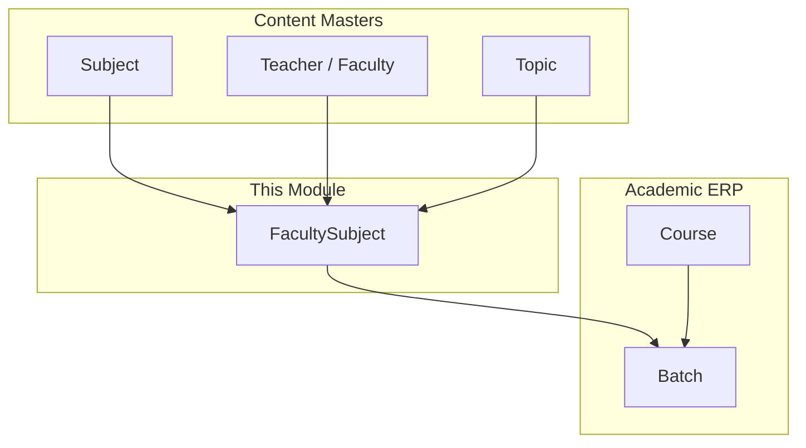
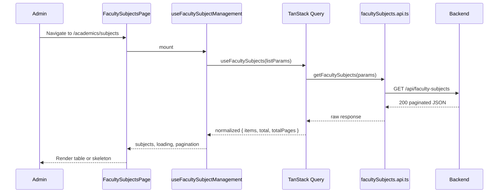
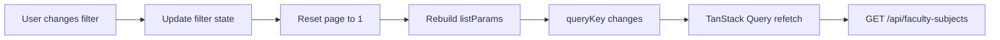
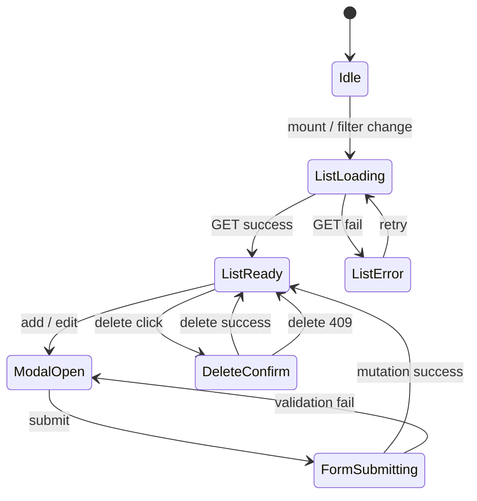
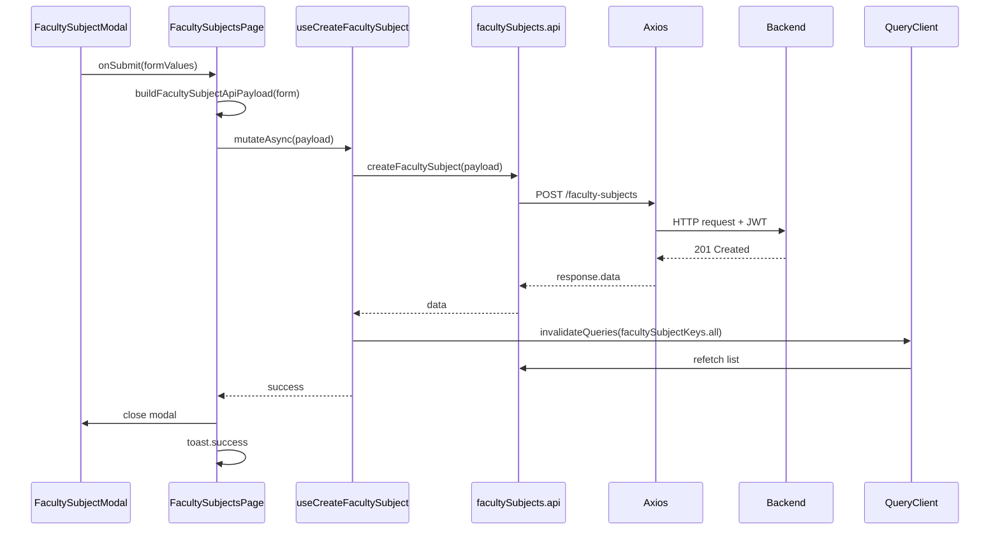

# Faculty Subjects Frontend Integration Guide

> **Official integration source of truth for Faculty Subjects frontend development**  
> Backend resource: `FacultySubject` · API base: `/api/faculty-subjects` · MongoDB collection: `facultysubjects`  
> Admin route (UI): `/academics/subjects` · Sidebar label: **Academics → Faculty Subjects**

---

## Table of Contents

1. [Module Overview](#1-module-overview)
2. [Complete User Flow](#2-complete-user-flow)
3. [Complete Frontend Folder Structure](#3-complete-frontend-folder-structure)
4. [Component Architecture](#4-component-architecture)
5. [Frontend Page Layout](#5-frontend-page-layout)
6. [Table Design](#6-table-design)
7. [Filters](#7-filters)
8. [Add Faculty Subject Flow](#8-add-faculty-subject-flow)
9. [Edit Faculty Subject Flow](#9-edit-faculty-subject-flow)
10. [Delete Flow](#10-delete-flow)
11. [Enable / Disable Flow](#11-enable--disable-flow)
12. [Frontend State Management](#12-frontend-state-management)
13. [API Layer](#13-api-layer)
14. [React Query / TanStack Query Integration](#14-react-query--tanstack-query-integration)
15. [Form Validation](#15-form-validation)
16. [API Integration Flow](#16-api-integration-flow)
17. [Loading States](#17-loading-states)
18. [Empty States](#18-empty-states)
19. [Error Handling](#19-error-handling)
20. [Toast Notifications](#20-toast-notifications)
21. [Permissions](#21-permissions)
22. [Performance Optimizations](#22-performance-optimizations)
23. [Responsive Behaviour](#23-responsive-behaviour)
24. [Accessibility](#24-accessibility)
25. [Reusable Hooks](#25-reusable-hooks)
26. [Constants](#26-constants)
27. [Types](#27-types)
28. [Utilities](#28-utilities)
29. [Testing Checklist](#29-testing-checklist)
30. [Integration Checklist](#30-integration-checklist)

---

## Critical Naming — Read First

The admin panel uses **three different “Faculty / Subject” concepts**. This document covers **Faculty Subjects only**.

| Concept | Model | API Base | Admin Location | In Scope |
|---------|-------|----------|----------------|----------|
| **Faculty Subjects (this doc)** | `FacultySubject` | `/api/faculty-subjects` | Academics → Faculty Subjects | **Yes — primary** |
| Master Subject (catalog) | `Subject` | `/api/subjects` | Academics → Categories → Subject | Dependency only |
| Academic Faculty (instructor) | `Teacher` | `/api/teachers` | Academics → Categories → Faculty | Dependency only |
| Center website profiles | `Faculty` | `/api/centers/:id/faculty` | Marketing / Centers | **No** |

**Faculty Subject** is **not** a Course. It links a **master Subject + Teacher + optional Topics + delivery categories**. Courses and Batches consume Faculty Subjects indirectly via `Batch.facultySubjects[]`.

### Repo Migration Note

The current page at `src/pages/academics/SubjectsPage.jsx` uses **localStorage** via `useAcademicsSubjects()`. The API client (`src/api/facultySubjectsAPI.js`) and helpers (`src/utils/facultySubjectHelpers.js`) already exist but are **not fully wired** to the list page. This document describes the **target production integration** using TanStack Query + Axios. Mirror the proven pattern from **Academics → Categories → Subject** (`useSubjectManagement` + mutation hooks).

---

## 1. Module Overview

### What Faculty Subjects Are

A **Faculty Subject** is a CMS content assignment that binds:

- One **master Subject** (`Subject._id`) — e.g. “Indian Polity”
- One **Teacher / Faculty** (`Teacher._id`) — e.g. “Dr Rajesh Kumar”
- Zero or more **Topics** (`Topic._id[]`) — must belong to the selected subject
- One or more **delivery categories** — content types enabled for this assignment (`LIVE_CLASS`, `RECORDING`, `PRELIMS_TEST`, `MAINS_ANSWER_WRITING`, `PDF`)
- A display name (`subjectName`) — often “Subject — Faculty” for admin clarity
- Lifecycle **status**: `ACTIVE` | `INACTIVE`
- Server-generated code (`facultySubjectId`, e.g. `FSU012`)

Faculty Subjects are the **bridge between content masters and batches**. When an admin creates a Batch and assigns faculty subjects, LMS modules (live classes, recordings, CBT tests, PDFs, mains answer writing) scope content under that Faculty Subject.

### Why This Module Exists

| Need | How Faculty Subjects solve it |
|------|-------------------------------|
| Same subject taught by different faculty | Separate Faculty Subject rows per teacher |
| Different delivery modes per assignment | `categories[]` controls which content tabs appear |
| Batch composition | `Batch.facultySubjects[]` references Faculty Subject `_id` |
| Content organization | Folders and items live under a Faculty Subject + category |
| Operational control | `ACTIVE` / `INACTIVE` hides assignments from dropdowns without deleting history |

### How It Fits in the Admin Panel

```text
Admin Panel
└── Academics
    ├── Batch                          ← consumes Faculty Subjects via dropdown
    ├── Faculty Subjects  ← THIS MODULE (/academics/subjects)
    ├── Live Classes
    ├── Content Library
    ├── Free Resources
    ├── Current Affairs
    └── Categories
        ├── Subject                    ← master catalog (dependency)
        ├── Topic                      ← dependency for form dropdowns
        └── Faculty                    ← Teacher records (dependency)
```

**Navigation:** Sidebar group **Academics** → item **Faculty Subjects** → route `/academics/subjects`.

**Related routes (out of scope for CRUD, but linked from table actions):**

| Route | Purpose |
|-------|---------|
| `/academics/subjects/:id/content` | Manage folders and content per delivery category |
| `/academics/subjects/:id` | Subject view list (legacy detail route) |

### Position in the Data Hierarchy



### Backend Authorization

All `/api/faculty-subjects/*` routes require:

- **Authentication:** Bearer JWT (`Authorization: Bearer <token>`)
- **Authorization:** **Super Admin only** (`superAdminAuth` on route mount)
- Login: `POST /api/auth/login-super-admin`

Non–Super Admin roles receive **403** with `"Access denied. Super Admin only."`

---

## 2. Complete User Flow

### End-to-End Admin Journey

```text
Super Admin logs in
        ↓
Opens sidebar → Academics
        ↓
Clicks "Faculty Subjects" (/academics/subjects)
        ↓
FacultySubjectsPage mounts
        ↓
useFacultySubjectManagement() builds list params
        ↓
useFacultySubjects() → GET /api/faculty-subjects
        ↓
normalizeFacultySubjectsListResponse() maps API → table rows
        ↓
FacultySubjectsTable renders paginated data
        ↓
[Optional] Admin types in search box (300ms debounce)
        ↓
Query refetches with ?search=...
        ↓
[Optional] Admin selects Status / Category / Faculty filters
        ↓
Server-side filters applied (status, category, search)
Client-side faculty filter applied if no backend param
        ↓
[Optional] Admin clicks column header → sortBy / sortOrder sent to API
        ↓
Admin clicks "Add Subject" (Add Faculty Subject)
        ↓
FacultySubjectModal opens (mode: create)
        ↓
useFacultySubjectFormOptions loads:
  GET /api/subjects/dropdown
  GET /api/faculty-subjects/categories
        ↓
Admin selects master Subject
        ↓
GET /api/faculty-subjects/create-form?subjectId=...
  → loads topics[] + teachers[] for that subject
        ↓
Admin fills subjectName, topics, faculty, categories, status
        ↓
Zod + React Hook Form validate
        ↓
POST /api/faculty-subjects
        ↓
Toast: "Subject created"
        ↓
invalidateQueries(facultySubjectKeys.all)
        ↓
Table refetches — new row visible
        ↓
Admin clicks Edit on a row
        ↓
GET /api/faculty-subjects/:id (if row not fully hydrated)
        ↓
Form populated via mapApiFacultySubjectToFormRow()
        ↓
Admin updates fields → PUT /api/faculty-subjects/:id
        ↓
Toast + table refresh
        ↓
Admin clicks status toggle (Enable / Disable)
        ↓
ConfirmFacultySubjectStatusModal (optional)
        ↓
PATCH /api/faculty-subjects/status/:id { status: "INACTIVE" }
        ↓
Toast + table refresh
        ↓
Admin clicks Delete
        ↓
FacultySubjectDeleteDialog confirms
        ↓
DELETE /api/faculty-subjects/:id
        ↓
Success → toast + refresh
409 → toast: linked to N batches — cannot delete
        ↓
Admin clicks "Manage Content"
        ↓
Navigate to /academics/subjects/:id/content
  (separate content module — uses facultySubjectFoldersAPI)
```

### Sequence: Initial Page Load



---

## 3. Complete Frontend Folder Structure

### Target Module Layout (Recommended)

Organize as a self-contained feature module under `src/modules/academics/faculty-subjects/`:

```text
src/
├── modules/
│   └── academics/
│       └── faculty-subjects/
│           ├── components/
│           │   ├── FacultySubjectsTable.tsx
│           │   ├── FacultySubjectForm.tsx
│           │   ├── FacultySubjectFilters.tsx
│           │   ├── FacultySubjectStatusBadge.tsx
│           │   ├── FacultySubjectActions.tsx
│           │   ├── FacultySubjectModal.tsx
│           │   ├── FacultySubjectDeleteDialog.tsx
│           │   ├── FacultySubjectDetails.tsx
│           │   ├── FacultySubjectHeader.tsx
│           │   ├── FacultySubjectEmptyState.tsx
│           │   └── FacultySubjectBulkActionsBar.tsx
│           ├── hooks/
│           │   ├── useFacultySubjects.ts
│           │   ├── useFacultySubject.ts
│           │   ├── useFacultySubjectManagement.ts
│           │   ├── useFacultySubjectFilters.ts
│           │   ├── useFacultySubjectPagination.ts
│           │   ├── useFacultySubjectForm.ts
│           │   ├── useFacultySubjectFormOptions.ts
│           │   ├── useCreateFacultySubject.ts
│           │   ├── useUpdateFacultySubject.ts
│           │   ├── useDeleteFacultySubject.ts
│           │   └── useToggleFacultySubjectStatus.ts
│           ├── services/
│           │   └── facultySubjects.api.ts
│           ├── types/
│           │   └── facultySubject.types.ts
│           ├── validation/
│           │   └── facultySubject.schema.ts
│           ├── constants/
│           │   └── facultySubject.constants.ts
│           ├── utils/
│           │   └── facultySubjectHelpers.ts
│           └── pages/
│               └── FacultySubjectsPage.tsx
├── api/
│   └── axiosInstance.js              ← shared Axios (existing)
├── hooks/
│   └── queryKeys.ts                  ← add facultySubjectKeys
├── components/
│   └── figma/
│       └── PaginatedFigmaTable.jsx   ← shared table shell
└── routes/
    └── moduleRoutes.jsx              ← lazy-load FacultySubjectsPage
```

### Folder Responsibilities

| Folder | Responsibility |
|--------|----------------|
| `pages/` | Route entry point. Orchestrates hooks, modals, dialogs. No direct Axios calls. |
| `components/` | Presentational and container UI. Receive data/callbacks via props. |
| `hooks/` | Server state (TanStack Query), list management, form logic, debounced filters. |
| `services/` | Pure HTTP functions. One function per API endpoint. No React imports. |
| `types/` | TypeScript interfaces for API payloads, table rows, form values, filters. |
| `validation/` | Zod schemas shared by create/edit forms and optional API response parsing. |
| `constants/` | Status enums, column definitions, API route fragments, UI copy keys. |
| `utils/` | Mappers (`mapApiFacultySubjectToRow`), payload builders, formatters. |

### Mapping to Existing Repo Files (Migration)

| Target (new) | Current (existing) | Action |
|--------------|-------------------|--------|
| `services/facultySubjects.api.ts` | `src/api/facultySubjectsAPI.js` | Port to TypeScript or re-export |
| `utils/facultySubjectHelpers.ts` | `src/utils/facultySubjectHelpers.js` | Extend — already comprehensive |
| `hooks/useFacultySubjectFormOptions.ts` | `src/hooks/useFacultySubjectFormOptions.js` | Reuse |
| `pages/FacultySubjectsPage.tsx` | `src/pages/academics/SubjectsPage.jsx` | Replace localStorage with API |
| `components/FacultySubjectsTable.tsx` | `src/components/subjects/SubjectTable.jsx` | Rename / wrap |
| `components/FacultySubjectModal.tsx` | `src/components/subjects/SubjectModal.jsx` | Wire API dropdowns |

---

## 4. Component Architecture

Every component below lists **Purpose**, **Props**, **State**, **Events**, **API dependencies**, and **Reusable logic**.

---

### FacultySubjectsPage

| Aspect | Detail |
|--------|--------|
| **Purpose** | Route orchestrator for `/academics/subjects`. Composes header, filters, table, modals, and bulk actions. |
| **Props** | None (page component). |
| **State** | Modal open/mode, active row, delete target, bulk selection, view detail item. Delegates list state to management hook. |
| **Events** | `openCreate`, `openEdit(row)`, `handleDelete(row)`, `handleStatusToggle(row)`, `handleBulkStatus`, `navigateToContent(row)`. |
| **API dependencies** | Indirect — via hooks only. |
| **Reusable logic** | `useFacultySubjectManagement`, mutation hooks, `PermissionGate`. |

**Calls:** No Axios directly. Triggers mutations on user actions.

---

### FacultySubjectHeader

| Aspect | Detail |
|--------|--------|
| **Purpose** | Page title, breadcrumb context, primary **Add Subject** CTA. |
| **Props** | `onAdd: () => void`, `canCreate?: boolean`, `title?: string`. |
| **State** | None. |
| **Events** | `onAdd` click. |
| **API dependencies** | None. |
| **Reusable logic** | Uses `facultySubjectLabels` constants. |

**Existing equivalent:** `src/components/subjects/SubjectHeader.jsx`

---

### FacultySubjectFilters

| Aspect | Detail |
|--------|--------|
| **Purpose** | Search input, status tabs/dropdown, category filter, faculty filter, date range (optional), reset button. |
| **Props** | `search`, `onSearchChange`, `statusFilter`, `onStatusChange`, `categoryFilter`, `onCategoryChange`, `teacherFilter`, `onTeacherChange`, `onReset`, `teacherOptions`, `categoryOptions`. |
| **State** | Local UI state for expanded mobile filter drawer (optional). |
| **Events** | Filter change handlers bubble to page → management hook updates `listParams`. |
| **API dependencies** | Category options: prefetched from `GET /api/faculty-subjects/categories` or derived from list. Faculty options: derived from current page data or `GET /api/teachers/dropdown`. |
| **Reusable logic** | Debounce applied in parent hook (`useDebouncedValue(search, 300)`). |

**Existing equivalent:** `src/components/subjects/SubjectListingToolbar.jsx`

---

### FacultySubjectsTable

| Aspect | Detail |
|--------|--------|
| **Purpose** | Displays paginated faculty subjects with sorting, selection, status badges, and row actions. |
| **Props** | `data`, `loading`, `controlledPagination`, `onView`, `onEdit`, `onDelete`, `onStatusToggle`, `onManageContent`, `selectedIds`, `onToggleSelect`, `sortBy`, `sortOrder`, `onSort`, `emptyMessage`, `statusChangingId`. |
| **State** | None (controlled). |
| **Events** | Row action callbacks, sort header clicks, checkbox selection. |
| **API dependencies** | **Consumes** data from `GET /api/faculty-subjects` (via parent). Does not fetch. |
| **Reusable logic** | Wraps `PaginatedFigmaTable`, `StatusBadge`, `createActionsColumn`, chip popovers for topics/categories. |

**Supports:** Sorting (server), pagination (server), search/filter reset deps, status badges, 4-action column, loading skeleton, empty state, row selection for bulk.

**Existing equivalent:** `src/components/subjects/SubjectTable.jsx`

---

### FacultySubjectActions

| Aspect | Detail |
|--------|--------|
| **Purpose** | Inline row action buttons: View, Edit, Manage Content, Status toggle, Delete. |
| **Props** | `row`, `onView`, `onEdit`, `onManageContent`, `onStatusToggle`, `onDelete`, `statusLoading`, `permissions: { view, edit, delete, toggleStatus }`. |
| **State** | None. |
| **Events** | Button clicks → parent handlers. |
| **API dependencies** | None. |
| **Reusable logic** | Hides buttons based on `permissions`. Shows spinner on `statusLoading`. |

**Existing equivalent:** `src/components/subjects/FacultySubjectTableActions.jsx`

---

### FacultySubjectStatusBadge

| Aspect | Detail |
|--------|--------|
| **Purpose** | Renders `Active` / `In Active` pill with consistent colors. |
| **Props** | `status: 'Active' | 'In Active'`. |
| **State** | None. |
| **Events** | None (display only). |
| **API dependencies** | None — maps from API `ACTIVE` / `INACTIVE` in helpers. |
| **Reusable logic** | Uses shared `StatusBadge` from `components/academics/AcademicsUi`. |

---

### FacultySubjectModal

| Aspect | Detail |
|--------|--------|
| **Purpose** | Create and edit modal shell with form fields. |
| **Props** | `open`, `mode: 'add' | 'edit'`, `facultySubject?: FacultySubjectRow`, `onClose`, `onSubmit`, `submitting`, `detailLoading`. |
| **State** | React Hook Form state; delegates dropdown loading to `useFacultySubjectFormOptions`. |
| **Events** | `onSubmit(formValues)`, `onClose`. |
| **API dependencies** | **On open:** `GET /api/subjects/dropdown`, `GET /api/faculty-subjects/categories`. **On subject change:** `GET /api/faculty-subjects/create-form?subjectId=`. **On submit:** `POST` or `PUT /api/faculty-subjects`. |
| **Reusable logic** | `useInitOnModalOpen`, `getModalEditKey`, `buildFacultySubjectApiPayload`, Zod resolver. |

**Existing equivalent:** `src/components/subjects/SubjectModal.jsx` (needs API wiring)

---

### FacultySubjectForm

| Aspect | Detail |
|--------|--------|
| **Purpose** | Form field layout inside modal (extracted for testability). |
| **Props** | RHF `control`, `register`, `errors`, dropdown options + loading flags, `mode`. |
| **State** | None (controlled by RHF). |
| **Events** | Field changes via RHF; `watch('subject')` triggers create-form reload. |
| **API dependencies** | Indirect via parent's `loadCreateFormOptions(subjectId)`. |
| **Reusable logic** | Multi-select for topics and categories; disabled state while dropdowns load. |

---

### FacultySubjectDeleteDialog

| Aspect | Detail |
|--------|--------|
| **Purpose** | Destructive confirmation before hard delete. |
| **Props** | `open`, `target: FacultySubjectRow`, `loading`, `onConfirm`, `onCancel`. |
| **Events** | Confirm → parent calls `deleteFacultySubject(id)`. |
| **API dependencies** | Parent calls `DELETE /api/faculty-subjects/:id`. |
| **Reusable logic** | Shows `subjectName` and `facultySubjectId` in warning copy. |

**Existing equivalent:** `src/components/subjects/ConfirmDeleteDialog.jsx`

---

### FacultySubjectDetails

| Aspect | Detail |
|--------|--------|
| **Purpose** | Read-only view modal or drawer for quick inspection. |
| **Props** | `open`, `item`, `onClose`, `loading`. |
| **State** | None. |
| **Events** | Close, optional **Edit** navigation. |
| **API dependencies** | Optional `GET /api/faculty-subjects/:id` if list row lacks populated fields. |
| **Reusable logic** | `mapApiFacultySubjectToRow` for display formatting. |

**Existing equivalent:** `src/components/subjects/ViewFacultySubjectModal.jsx`

---

### FacultySubjectEmptyState

| Aspect | Detail |
|--------|--------|
| **Purpose** | Zero-data CTA when no faculty subjects exist and no filters active. |
| **Props** | `onCreate`, `canCreate`. |
| **API dependencies** | None. |

**Existing equivalent:** `src/components/subjects/SubjectEmptyState.jsx`

---

## 5. Frontend Page Layout

### UI Hierarchy

```text
FacultySubjectsPage
├── FacultySubjectHeader
│   ├── Title: "Faculty Subjects"
│   ├── Subtitle / breadcrumb: Academics
│   └── Primary button: "Add Subject"
├── [Optional] Statistics Cards Row
│   ├── Total Active
│   ├── Total Inactive
│   └── Total Categories Used
├── FacultySubjectFilters
│   ├── Search input (full-width on mobile)
│   ├── Status segmented control / tabs
│   ├── Category dropdown
│   ├── Faculty dropdown
│   └── Reset filters link
├── [Optional] Bulk Actions Bar (when rows selected)
├── FacultySubjectsTable
│   ├── Column headers + sort indicators
│   ├── Data rows
│   └── Inline pagination footer
└── Portals / Modals (siblings, not nested in table)
    ├── FacultySubjectModal (create/edit)
    ├── FacultySubjectDetails (view)
    ├── FacultySubjectDeleteDialog
    └── ConfirmFacultySubjectStatusModal
```

### Spacing and Layout Tokens

| Region | Spacing | Notes |
|--------|---------|-------|
| Page padding | `px-4 md:px-6 lg:px-8 py-6` | Matches other Academics pages |
| Header → filters | `mb-6` | Clear section separation |
| Filters → table | `mb-4` | Compact on desktop |
| Table container | `rounded-2xl shadow ring-1 ring-slate-100` | Existing Figma table style |
| Modal max width | `max-w-2xl` for form; `max-w-lg` for delete confirm | |

### Responsive Behaviour Summary

| Breakpoint | Layout changes |
|------------|----------------|
| **Desktop (≥1024px)** | Filters in horizontal row; full table visible; sticky actions column |
| **Tablet (768–1023px)** | Filters wrap to two rows; horizontal scroll on table (`min-width: 1180px`) |
| **Mobile (<768px)** | Stacked filters; collapsible filter drawer; table scrolls horizontally; FAB or header-only Add button |

---

## 6. Table Design

### Columns

| Column | Key | Width | Align | Sortable | Description |
|--------|-----|-------|-------|----------|-------------|
| Checkbox | `_select` | 44px | center | No | Bulk selection; optional |
| ID | `displayId` | 7% | left | Yes (`facultySubjectId`) | Shows `FSU012` or padded numeric; monospace |
| Faculty Subject Name | `subjectName` | 18% | left | Yes (`subjectName`) | Primary label; truncate + tooltip |
| Master Subject | `subjectLabel` | 12% | left | No | Populated subject name from `subject` ref |
| Faculty | `teacher` | 12% | left | No | Teacher display name |
| Status | `status` | 9% | center | Yes (`status`) | `StatusBadge` component |
| Topics | `topics` | 14% | left | No | Chip popover; max 2 visible |
| Categories | `categories` | 18% | left | No | Delivery category chips |
| Created Date | `createdAt` | 10% | left | Yes (`createdAt`) | Formatted `DD MMM YYYY` |
| Actions | `_actions` | sticky right | right | No | View, Edit, Content, Status, Delete |

> **Note:** There is no **Course** column on Faculty Subjects — Courses link via Batches. The **Master Subject** column maps to the `subject` ObjectId reference.

### Alignment and Width Rules

- Text columns: `text-left`, `truncate`, `title` attribute for overflow
- Status: `text-center`, badge centered in cell
- Actions: `sticky right-0 bg-white/95 backdrop-blur` on horizontal scroll
- Table uses `table-layout: fixed` with `min-width: 1180px`

### Sorting

Server-side via query params:

```typescript
sortBy: 'createdAt' | 'subjectName' | 'facultySubjectId' | 'status'
sortOrder: 'asc' | 'desc'
```

Click column header → toggle order if same column, else set new column asc.

### Status Colors

| UI Status | API Value | Badge style |
|-----------|-----------|-------------|
| Active | `ACTIVE` | Green / success token |
| In Active | `INACTIVE` | Gray / muted token |

Mapping: `mapApiStatusToUi` / `mapUiStatusToApi` in `programHelpers.js`.

### Loading Skeleton

- `skeletonRowCount={8}` on `PaginatedFigmaTable`
- Pulse placeholders per column width
- Disable row actions while `loading={true}`

### Empty State Messages

| Condition | Message |
|-----------|---------|
| No data, no filters | `No Faculty Subjects Found` + Create CTA |
| Search/filter no match | `No faculty subjects match your filters.` |
| API error | Error banner above table + retry button |

### Pagination

Server-controlled via `controlledPagination`:

```typescript
{
  page, pageSize, totalItems, totalPages,
  startIndex, endIndex,
  onPageChange, onPageSizeChange
}
```

Default `pageSize: 10`, options `[10, 25, 50]`, API `limit` max **100**.

---

## 7. Filters

### Filter Inventory

| Filter | UI control | API param | Server / Client |
|--------|------------|-----------|-----------------|
| **Search** | Text input | `search` or `q` | **Server** — regex on `subjectName` |
| **Status** | Tabs: All / Active / In Active | `status`: `ACTIVE` \| `INACTIVE` | **Server** |
| **Category** | Dropdown (delivery) | `category`: e.g. `LIVE_CLASS` | **Server** |
| **Faculty** | Dropdown | — (no backend param documented) | **Client** — filter `row.teacher` on loaded set, or extend backend with `teacherId` |
| **Date** | Date range picker | — | **Client** — filter `createdAt` locally unless backend adds `from`/`to` |
| **Reset** | Button | Clears all → refetch defaults | Both |

### Search Debounce

```typescript
const debouncedSearch = useDebouncedValue(search, 300)
// Include debouncedSearch in listParams → queryKey
// Reset page to 1 when filterSignature changes
```

Pattern: `useSubjectManagement.js` + `useDebouncedValue`.

### Filter State Shape

```typescript
interface FacultySubjectFilterState {
  search: string
  statusFilter: 'all' | 'Active' | 'In Active'
  categoryFilter: 'all' | FacultySubjectCategory
  teacherFilter: 'all' | string  // teacher name or id
  dateFrom?: string
  dateTo?: string
}
```

### URL Sync (Optional)

Recommended query params for shareable list state:

```text
/academics/subjects?page=2&limit=10&status=ACTIVE&search=polity&category=LIVE_CLASS
```

Implementation: `useSearchParams` from React Router; sync on filter change with `replace: true` to avoid history spam.

### API Integration per Filter Change



**Component calling API:** None directly — `useFacultySubjects(listParams)` inside `useFacultySubjectManagement`.

---

## 8. Add Faculty Subject Flow

### Step-by-Step

```text
Click "Add Subject"
  → setModalMode('add'); setModalOpen(true)
  → FacultySubjectModal mounts open
  → useFacultySubjectFormOptions({ open: true })
      → GET /api/subjects/dropdown
      → GET /api/faculty-subjects/categories
  → Admin selects Master Subject (subjectId)
  → watch('subject') fires
      → GET /api/faculty-subjects/create-form?subjectId=<id>
      → populate topicOptions, teacherOptions
  → Admin fills remaining fields
  → Client validation (Zod)
  → buildFacultySubjectApiPayload(form)
  → useCreateFacultySubject.mutateAsync(payload)
      → POST /api/faculty-subjects
  → onSuccess: toast.success, invalidateQueries, close modal
```

### Form Fields

| Field | Form key | Required | Type | API field | Validation |
|-------|----------|----------|------|-----------|------------|
| Faculty Subject Name | `subjectName` | **Yes** | text | `subjectName` | Min 2, max 200 chars |
| Master Subject | `subject` | **Yes** | select (ObjectId) | `subjectId` | Valid Mongo ObjectId; must be ACTIVE |
| Faculty / Teacher | `teacher` / `teacherId` | **Yes** | select | `teacherId` | Valid ObjectId; ACTIVE teacher |
| Topics | `topicIds` | No | multi-select | `topicIds[]` | Each must belong to selected subject |
| Delivery Categories | `categories` | **Yes** (min 1 on create) | multi-select | `categories[]` | Enum values from API |
| Status | `status` | No (default Active) | select | `status` | `ACTIVE` \| `INACTIVE` |

### Optional Fields (Not in API create payload)

Do **not** send: `facultySubjectId` (auto-generated), `_id`, live class/recording nested forms (those belong to content management, not Faculty Subject CRUD).

### Validation Error Messages (Zod)

| Rule | Message |
|------|---------|
| Missing subjectName | `Faculty subject name is required` |
| subjectName too short | `Name must be at least 2 characters` |
| Missing subject | `Please select a master subject` |
| Missing teacher | `Please select a faculty member` |
| No categories | `Select at least one delivery category` |
| Invalid ObjectId | `Invalid selection — please re-select` |

### API Call Location

| Step | Caller |
|------|--------|
| Load subjects/categories | `useFacultySubjectFormOptions` → `facultySubjects.api.ts` |
| Load topics/teachers | `useFacultySubjectFormOptions.loadCreateFormOptions` |
| Submit create | `FacultySubjectsPage.handleCreate` → `useCreateFacultySubject` |

---

## 9. Edit Faculty Subject Flow

```text
Click Edit on row
  → setActiveRow(row); setModalMode('edit'); setModalOpen(true)
  → If row lacks topicIds / hydrated refs:
      GET /api/faculty-subjects/:id
      → mapApiFacultySubjectToFormRow(response)
  → useInitOnModalOpen resets form with edit values
  → loadCreateFormOptions(row.subject, { merge: true })
      → seed topic/teacher dropdowns including existing selections
  → Admin modifies fields
  → Zod validate
  → buildFacultySubjectApiPayload(form)
  → useUpdateFacultySubject.mutateAsync({ id, payload })
      → PUT /api/faculty-subjects/:id
  → toast.success('Subject updated')
  → invalidateQueries(facultySubjectKeys.all)
  → close modal
```

### Edit-Specific Rules

- Use Mongo `_id` as URL param, **not** `facultySubjectId` code
- Changing master subject clears incompatible topic selections and reloads create-form
- Status can be edited in form **or** via inline toggle (prefer toggle for quick changes)

### API Call Location

| Step | Caller |
|------|--------|
| Fetch detail (if needed) | `useFacultySubject(id)` or `getFacultySubjectById` in modal |
| Submit update | `useUpdateFacultySubject` → `updateFacultySubject(id, payload)` |

---

## 10. Delete Flow

```text
Click Delete on row
  → setDeleteTarget(row)
  → FacultySubjectDeleteDialog opens
  → Admin confirms
  → useDeleteFacultySubject.mutateAsync(row.id)
      → DELETE /api/faculty-subjects/:id
  → Success (200):
      toast.success('Subject deleted')
      invalidateQueries
      close dialog
  → Conflict (409):
      toast.error('Cannot delete — linked to N batch(es). Remove from batches first.')
      close dialog (row remains)
  → Other errors:
      toast.error(getApiErrorMessage(error))
```

### Error Handling Notes

- Delete is **hard delete** with cascade (folders, content) on backend
- Always show backend `message` on 409 — do not retry automatically
- Clear detail cache: `clearFacultySubjectDetailCache(id)` after delete

### API Call Location

`FacultySubjectsPage.handleDeleteConfirm` → `useDeleteFacultySubject`

---

## 11. Enable / Disable Flow

```text
Click status toggle on row (or bulk Enable/Disable)
  → [Optional] ConfirmFacultySubjectStatusModal
  → Compute nextStatus: Active ↔ In Active
  → mapUiStatusToApi(nextStatus) → 'ACTIVE' | 'INACTIVE'
  → useToggleFacultySubjectStatus.mutateAsync({ id, status })
      → PATCH /api/faculty-subjects/status/:id { status }
  → toast.success('Status updated' / 'Subject disabled')
  → invalidateQueries
  → INACTIVE rows hidden from /dropdown endpoints used by Batch forms
```

### Optimistic Update (Optional)

```typescript
onMutate: async ({ id, status }) => {
  await queryClient.cancelQueries({ queryKey: facultySubjectKeys.lists() })
  // snapshot + patch cache row status
}
onError: (_err, _vars, context) => { /* rollback */ }
```

### API Call Location

`FacultySubjectActions.onStatusToggle` → page handler → `useToggleFacultySubjectStatus`

---

## 12. Frontend State Management

### State Categories

| State | Owner | Storage | Lifecycle |
|-------|-------|---------|-----------|
| **Loading (list)** | `useFacultySubjects` | TanStack Query `isLoading` / `isFetching` | Auto during fetch |
| **Loading (mutations)** | Mutation hooks | `isPending` per mutation | During POST/PUT/PATCH/DELETE |
| **Error (list)** | `useFacultySubjects` | `isError`, `error` | Until refetch success |
| **Error (form)** | RHF + Zod | `formState.errors` | Until field corrected |
| **Success** | Mutations | Implicit via `onSuccess` + toast | Transient |
| **Selected rows** | `FacultySubjectsPage` | `useState<string[]>` | Until cleared or bulk complete |
| **Pagination** | `useFacultySubjectManagement` | `page`, `pageSize`, derived totals | URL-sync optional |
| **Filters** | `useFacultySubjectManagement` | `search`, `statusFilter`, etc. | Session / URL |
| **Search (raw)** | Same | Immediate input value | Debounced before API |
| **Modal state** | Page | `modalOpen`, `modalMode`, `activeRow` | Open/close |
| **Form state** | `FacultySubjectModal` | React Hook Form | Reset on modal open via `useInitOnModalOpen` |
| **Delete dialog** | Page | `deleteTarget`, `deleteLoading` | Per action |
| **Status changing** | Page | `statusChangingId` | Per-row spinner |

### State Flow Diagram



### Server vs Client State Boundary

| Data | Source |
|------|--------|
| Faculty subject list | **Server** (TanStack Query cache) |
| Dropdown options (subjects, topics, teachers) | **Server** (query or dedicated hook cache) |
| Filter UI values | **Client** (drives query key) |
| Selected checkboxes | **Client** |
| Form draft | **Client** (RHF) until submit |

---

## 13. API Layer

### File: `facultySubjects.api.ts`

All functions use `axiosInstance` from `src/api/axiosInstance.js`:

- **baseURL:** `/api` (dev proxy) or `${BASE_URL}/api` (prod)
- **timeout:** 30 seconds
- **Headers:** `Content-Type: application/json`, `Authorization: Bearer <token>`

### Function Reference

---

#### `getFacultySubjects(params?, options?)`

| | |
|---|---|
| **Method** | `GET` |
| **Endpoint** | `/faculty-subjects` |
| **Full URL** | `/api/faculty-subjects` |
| **Query params** | `search`, `q`, `status`, `category`, `page`, `limit`, `sortBy`, `sortOrder` |
| **Request body** | None |
| **Success response** | Paginated list (flexible shape — normalize with `normalizeFacultySubjectsListResponse`) |
| **Called by** | `useFacultySubjects` query hook |

**Example request:**

```http
GET /api/faculty-subjects?page=1&limit=10&status=ACTIVE&search=polity&sortBy=createdAt&sortOrder=desc
Authorization: Bearer eyJhbG...
```

**Example response:**

```json
{
  "success": true,
  "data": [
    {
      "_id": "665d1b2c3d4e5f6789012340",
      "facultySubjectId": "FSU012",
      "subjectName": "Indian Polity — Dr Rajesh",
      "subject": { "_id": "665a...", "subjectName": "Indian Polity" },
      "topics": [{ "_id": "665b...", "topicName": "Constitution" }],
      "teacher": { "_id": "665c...", "teacherName": "Dr Rajesh Kumar" },
      "categories": ["LIVE_CLASS", "RECORDING"],
      "status": "ACTIVE",
      "createdAt": "2025-03-15T10:00:00.000Z",
      "updatedAt": "2025-03-15T10:00:00.000Z"
    }
  ],
  "pagination": {
    "page": 1,
    "limit": 10,
    "total": 42,
    "totalPages": 5
  }
}
```

---

#### `getFacultySubject(id, options?)`

| | |
|---|---|
| **Method** | `GET` |
| **Endpoint** | `/faculty-subjects/:id` |
| **Params** | `:id` — Mongo `_id` |
| **Success** | Single document (may wrap in `{ data: {...} }`) |
| **Called by** | `useFacultySubject(id)`, edit modal hydration |

**Existing:** `getFacultySubjectById` in `facultySubjectsAPI.js` (includes 120s detail cache)

---

#### `createFacultySubject(payload)`

| | |
|---|---|
| **Method** | `POST` |
| **Endpoint** | `/faculty-subjects` |
| **Request body** | See below |
| **Success** | `201` + created document |
| **Called by** | `useCreateFacultySubject` |

**Request body:**

```json
{
  "subjectName": "Indian Polity — Dr Rajesh",
  "subjectId": "665a11111111111111111111",
  "topicIds": ["665b22222222222222222222"],
  "teacherId": "665c33333333333333333333",
  "categories": ["LIVE_CLASS", "RECORDING"],
  "status": "ACTIVE"
}
```

---

#### `updateFacultySubject(id, payload)`

| | |
|---|---|
| **Method** | `PUT` |
| **Endpoint** | `/faculty-subjects/:id` |
| **Request body** | Same shape as create |
| **Success** | `200` + updated document |
| **Called by** | `useUpdateFacultySubject` |
| **Side effect** | Clear detail cache for `id` |

---

#### `deleteFacultySubject(id)`

| | |
|---|---|
| **Method** | `DELETE` |
| **Endpoint** | `/faculty-subjects/:id` |
| **Success** | `200` |
| **Error** | `409` if linked to batches |
| **Called by** | `useDeleteFacultySubject` |

**409 response:**

```json
{
  "success": false,
  "message": "Cannot delete faculty subject linked to 3 batch(es). Remove it from batches first."
}
```

---

#### `toggleFacultySubjectStatus(id, status)`

| | |
|---|---|
| **Method** | `PATCH` |
| **Endpoint** | `/faculty-subjects/status/:id` |
| **Request body** | `{ "status": "ACTIVE" | "INACTIVE" }` |
| **Called by** | `useToggleFacultySubjectStatus` |

**Existing:** `updateFacultySubjectStatus(facultySubjectId, status)`

---

### Supporting API Functions (Forms & Dropdowns)

| Function | Method | Endpoint | Used by |
|----------|--------|----------|---------|
| `getFacultySubjectCategories()` | GET | `/faculty-subjects/categories` | Form category multi-select |
| `getFacultySubjectCreateForm(subjectId)` | GET | `/faculty-subjects/create-form?subjectId=` | Topics + teachers after subject pick |
| `getSubjectsDropdown()` | GET | `/subjects/dropdown` | Master subject select |
| `getFacultySubjectsDropdown(params)` | GET | `/faculty-subjects/dropdown` | Batch picker (not list page) |

---

### Error Response Shape

```json
{
  "success": false,
  "message": "Human-readable error message"
}
```

### Retry Strategy

| Layer | Policy |
|-------|--------|
| TanStack Query | `retry: 1` (global default in `App.jsx`) |
| List fetch | No retry on 4xx; retry once on network error |
| Rate limit (429) | Show toast; use stale cache if available (`isRateLimitError`) |
| Mutations | **No auto-retry** — user must confirm resubmit |

### Loading State Mapping

| API call | UI loading flag |
|----------|-----------------|
| List GET | `loading` on table |
| Detail GET | `detailLoading` on modal |
| Create POST | `submitting` on form footer |
| Dropdown GET | `loadingSubjects`, `loadingFormOptions` |

---

## 14. React Query / TanStack Query Integration

### Query Key Factory

Add to `src/hooks/queryKeys.ts`:

```typescript
export const facultySubjectKeys = {
  all: ['faculty-subjects'] as const,
  lists: () => [...facultySubjectKeys.all, 'list'] as const,
  list: (params: FacultySubjectListParams) =>
    [...facultySubjectKeys.lists(), params ?? {}] as const,
  details: () => [...facultySubjectKeys.all, 'detail'] as const,
  detail: (id: string) => [...facultySubjectKeys.details(), id] as const,
  categories: () => [...facultySubjectKeys.all, 'categories'] as const,
  createForm: (subjectId: string) =>
    [...facultySubjectKeys.all, 'create-form', subjectId] as const,
  dropdown: (params?: Record<string, unknown>) =>
    [...facultySubjectKeys.all, 'dropdown', params ?? {}] as const,
}
```

### Queries

```typescript
// useFacultySubjects.ts
export function useFacultySubjects(params: FacultySubjectListParams) {
  return useQuery({
    queryKey: facultySubjectKeys.list(params),
    queryFn: ({ signal }) =>
      getFacultySubjects(params, { signal }).then((data) =>
        normalizeFacultySubjectsListResponse(data, {
          page: params.page,
          limit: params.limit,
        }),
      ),
    placeholderData: keepPreviousData,
  })
}

// useFacultySubject.ts
export function useFacultySubject(id: string | undefined, enabled = true) {
  return useQuery({
    queryKey: facultySubjectKeys.detail(id!),
    queryFn: ({ signal }) =>
      getFacultySubjectById(id!, { signal }).then(mapApiFacultySubjectToFormRow),
    enabled: Boolean(id) && enabled,
  })
}
```

### Mutations

```typescript
export function useCreateFacultySubject() {
  const queryClient = useQueryClient()
  return useMutation({
    mutationFn: (payload: FacultySubjectCreatePayload) =>
      createFacultySubject(payload),
    onSuccess: () => {
      queryClient.invalidateQueries({ queryKey: facultySubjectKeys.all })
    },
  })
}
```

Same pattern for update, delete, toggle — all invalidate `facultySubjectKeys.all`.

### Cache Invalidation Matrix

| Action | Invalidate |
|--------|------------|
| Create | `facultySubjectKeys.all` |
| Update | `facultySubjectKeys.all` + `facultySubjectKeys.detail(id)` |
| Delete | `facultySubjectKeys.all` |
| Status toggle | `facultySubjectKeys.all` + `facultySubjectKeys.dropdown()` |
| Content change (separate module) | `facultySubjectKeys.detail(id)` only |

### Optimistic Updates

Recommended for **status toggle only** (low risk, high UX value). Avoid optimistic delete/create.

### Refetch Strategy

| Event | Behaviour |
|-------|-----------|
| Window focus | Disabled (`refetchOnWindowFocus: false`) |
| Filter change | New query key → automatic fetch |
| After mutation | `invalidateQueries` |
| Manual refresh | `refetch()` on management hook |
| staleTime | 30_000 ms (match global QueryClient) |

---

## 15. Form Validation

### Stack

- **React Hook Form** — form state, submission, field errors
- **Zod** — schema validation (install: `npm install zod @hookform/resolvers`)
- **@hookform/resolvers/zod** — `zodResolver(schema)`

> The repo currently uses manual validation in some modals. For Faculty Subjects API integration, adopt Zod as specified below.

### Schema: `facultySubject.schema.ts`

```typescript
import { z } from 'zod'

const objectId = z.string().regex(/^[a-f0-9]{24}$/i, 'Invalid selection')

export const facultySubjectCategoryEnum = z.enum([
  'LIVE_CLASS',
  'RECORDING',
  'PRELIMS_TEST',
  'MAINS_ANSWER_WRITING',
  'PDF',
])

export const facultySubjectFormSchema = z.object({
  subjectName: z
    .string()
    .trim()
    .min(2, 'Faculty subject name must be at least 2 characters')
    .max(200, 'Name must be at most 200 characters'),
  subject: objectId.nonempty('Please select a master subject'),
  teacherId: objectId.nonempty('Please select a faculty member'),
  topicIds: z.array(objectId).optional().default([]),
  categories: z
    .array(facultySubjectCategoryEnum)
    .min(1, 'Select at least one delivery category'),
  status: z.enum(['Active', 'In Active']).default('Active'),
})

export type FacultySubjectFormValues = z.infer<typeof facultySubjectFormSchema>
```

### RHF Integration

```typescript
const form = useForm<FacultySubjectFormValues>({
  resolver: zodResolver(facultySubjectFormSchema),
  defaultValues: EMPTY_FACULTY_SUBJECT_FORM,
})
```

### Dropdown Validation

- Disable submit while `loadingFormOptions === true`
- If selected subject changes, clear `topicIds` and re-validate
- Merge `topicMeta` / `teacherMeta` from edit row into options so Zod ids pass

### Server Validation Errors

Map 400 response to RHF field errors:

```typescript
catch (error) {
  const message = getApiErrorMessage(error)
  if (message.toLowerCase().includes('subject')) {
    form.setError('subject', { message })
  } else {
    toast.error(message)
  }
}
```

---

## 16. API Integration Flow

### Layered Architecture

```text
┌─────────────────────────────────────────────────────────────┐
│                         UI Layer                            │
│  FacultySubjectsPage → Table / Filters / Modals             │
└───────────────────────────┬─────────────────────────────────┘
                            │
┌───────────────────────────▼─────────────────────────────────┐
│                      Hooks Layer                            │
│  useFacultySubjectManagement → useFacultySubjects (Query)   │
│  useCreateFacultySubject / useUpdate... (Mutations)         │
└───────────────────────────┬─────────────────────────────────┘
                            │
┌───────────────────────────▼─────────────────────────────────┐
│                    Service Layer                            │
│  facultySubjects.api.ts — getFacultySubjects(), etc.          │
└───────────────────────────┬─────────────────────────────────┘
                            │
┌───────────────────────────▼─────────────────────────────────┐
│                     Axios Instance                          │
│  Interceptors: Auth header, 401 redirect, FormData handling │
└───────────────────────────┬─────────────────────────────────┘
                            │
┌───────────────────────────▼─────────────────────────────────┐
│                  Backend API (existing)                     │
│  /api/faculty-subjects/*                                    │
└───────────────────────────┬─────────────────────────────────┘
                            │
┌───────────────────────────▼─────────────────────────────────┐
│              Response → normalize → Query cache             │
│              → React state → UI re-render                   │
└─────────────────────────────────────────────────────────────┘
```

### Sequence: Create Faculty Subject



### Which Component Calls Which API

| User action | Component | Hook | API function | Endpoint |
|-------------|-----------|------|--------------|----------|
| Page load | `FacultySubjectsPage` | `useFacultySubjects` | `getFacultySubjects` | GET list |
| Open create modal | `FacultySubjectModal` | `useFacultySubjectFormOptions` | `getSubjectsDropdown`, `getFacultySubjectCategories` | GET dropdowns |
| Select subject | `FacultySubjectForm` | `loadCreateFormOptions` | `getFacultySubjectCreateForm` | GET create-form |
| Save create | `FacultySubjectsPage` | `useCreateFacultySubject` | `createFacultySubject` | POST |
| Open edit | `FacultySubjectModal` | `useFacultySubject` | `getFacultySubjectById` | GET :id |
| Save edit | `FacultySubjectsPage` | `useUpdateFacultySubject` | `updateFacultySubject` | PUT :id |
| Toggle status | `FacultySubjectActions` | `useToggleFacultySubjectStatus` | `updateFacultySubjectStatus` | PATCH status/:id |
| Delete | `FacultySubjectDeleteDialog` | `useDeleteFacultySubject` | `deleteFacultySubject` | DELETE :id |
| Manage content | `FacultySubjectActions` | — (navigate) | — | Route change only |

---

## 17. Loading States

| UI region | Trigger | Implementation |
|-----------|---------|----------------|
| **Table skeleton** | Initial list fetch, filter refetch | `PaginatedFigmaTable loading={isLoading \|\| isFetching}` |
| **Table overlay** | Background refetch | Subtle opacity or `isFetching` indicator in header |
| **Add/Edit button** | Modal closed | Disabled if `!canCreate` |
| **Form submit button** | POST/PUT in flight | `disabled={submitting}` + spinner label "Saving…" |
| **Subject dropdown** | `getSubjectsDropdown` | Placeholder "Loading subjects…" |
| **Category dropdown** | `getFacultySubjectCategories` | Skeleton chips or disabled multi-select |
| **Topics/Teachers** | `getFacultySubjectCreateForm` | Disabled multi-select + inline spinner |
| **Modal detail** | GET :id on edit | `detailLoading` → form skeleton inside modal |
| **Delete confirm** | DELETE in flight | Disable both buttons; show spinner on Confirm |
| **Status toggle** | PATCH in flight | `statusChangingId === row.id` → action button spinner |
| **Bulk actions** | Sequential PATCH loop | `bulkActionLoading` on bulk bar |

---

## 18. Empty States

| Scenario | Condition | UI |
|----------|-----------|-----|
| **No data** | `total === 0` && no active filters | `FacultySubjectEmptyState` with illustration + "Create Subject" CTA |
| **No search results** | `total === 0` && `search.trim()` | Inline table message: "No faculty subjects match your search." |
| **No filter results** | `total === 0` && status/category/faculty filter active | "No faculty subjects match your filters." + Reset link |
| **API error** | `isError === true` | Error banner with `getApiErrorMessage(error)` + Retry button calling `refetch()` |
| **Permission denied** | 403 on list | Full-page or inline: "You don't have permission to view faculty subjects." |
| **401 session expired** | Axios interceptor | Redirect to `/login` (handled globally) |

---

## 19. Error Handling

| HTTP Code | Meaning | Frontend action |
|-----------|---------|-----------------|
| **401** | Unauthorized / expired token | Clear auth, redirect login (axios interceptor) |
| **403** | Not Super Admin | Toast + hide CRUD buttons; show read-only or block page |
| **404** | Faculty subject not found | Toast on edit/delete; remove stale row on list refresh |
| **409** | Delete blocked by batch links | Toast with backend message; keep row |
| **422** | Validation (if used) | Map to form field errors or toast |
| **429** | Rate limit | Toast: "Too many requests…"; use cached list if available |
| **500** | Server error | Toast: "Server error. Please try again." + log in DEV |
| **Timeout** | Axios 30s timeout | Toast: "Request timed out. Check your connection." |
| **Network failure** | No response | Toast: "Network error. Please check your connection." |

### Central Error Helper

Use `getApiErrorMessage(error, fallback)` from `src/utils/apiError.js` in all catch blocks and mutation `onError`.

```typescript
onError: (error) => {
  toast.error(getApiErrorMessage(error, 'Failed to save faculty subject'))
}
```

---

## 20. Toast Notifications

Use Sonner via `src/utils/toast.js`:

```typescript
import { toast, TOAST_DURATION } from '@/utils/toast'
```

| Event | Type | Message example |
|-------|------|-----------------|
| Created | `toast.success` | `Subject created` (`facultySubjectLabels.created`) |
| Updated | `toast.success` | `Subject updated` |
| Deleted | `toast.success` | `Subject deleted` |
| Status → Active | `toast.success` | `Subject enabled` |
| Status → In Active | `toast.success` | `Subject disabled` |
| Bulk status | `toast.success` | `Updated 5 subjects` |
| Validation failed (client) | `toast.error` | First Zod message or field summary |
| Validation failed (server) | `toast.error` | Backend `message` |
| Delete 409 | `toast.error` | Backend batch link message |
| Server error | `toast.error` | `Something went wrong` or specific message |
| List load fail | `toast.error` | `Failed to load faculty subjects` |
| Dropdown load fail | `toast.error` | `Failed to load topics and faculty` |

**Duration:** Use `TOAST_DURATION.DEFAULT` for success; longer for errors with actionable text.

---

## 21. Permissions

### Backend Gate

All `/api/faculty-subjects/*` endpoints require **Super Admin** JWT. The backend does not expose granular CRUD permissions per endpoint for this module.

### Frontend Route Access

From `src/config/rbacAccess.js`:

| Role | `/academics/subjects` access |
|------|------------------------------|
| `SUPER_ADMIN` | Yes (`*`) |
| `OPERATION_ADMIN` | Yes |
| `CENTER_ADMIN` | **No** |
| `CONTENT_ADMIN` | **No** |
| Others | **No** (unless explicitly added) |

Enforced by `RoutePermissionGuard` + `usePermissions().canAccessRoute()`.

### RBAC Feature Matrix (UI config)

From `src/data/rbacConfig.js` — feature id `facultySubjects` under module `ACADEMICS`. Use for Role Access admin UI; map to button visibility in the Faculty Subjects page.

### Permission Actions

| Action | Permission key (suggested) | UI element |
|--------|---------------------------|------------|
| View list | `facultySubjects.view` | Page route, table |
| Create | `facultySubjects.create` | Add Subject button |
| Edit | `facultySubjects.edit` | Edit row action |
| Delete | `facultySubjects.delete` | Delete row action |
| Enable | `facultySubjects.enable` | Status toggle → Active |
| Disable | `facultySubjects.disable` | Status toggle → In Active |
| Manage content | `facultySubjects.content` | Manage Content action |

### Implementation Pattern

```tsx
<PermissionGate roles={['super_admin', 'operation_admin']}>
  <Button onClick={openCreate}>Add Subject</Button>
</PermissionGate>
```

For Super-Admin-only API: if user is `OPERATION_ADMIN` with route access but API returns 403, show toast and disable mutations.

### Hide Buttons Based on Permissions

```typescript
const { isSuperAdmin, hasRole } = usePermissions()
const canMutate = isSuperAdmin() // API requires Super Admin

<FacultySubjectActions
  permissions={{
    view: true,
    edit: canMutate,
    delete: canMutate,
    toggleStatus: canMutate,
  }}
/>
```

---

## 22. Performance Optimizations

| Technique | Application |
|-----------|-------------|
| **Debounce search** | 300ms via `useDebouncedValue` before updating query params |
| **Memoization** | `useMemo` for column defs, filtered client-side faculty options, `subjectsById` map |
| **Lazy loading** | `React.lazy(() => import('...FacultySubjectsPage'))` in `moduleRoutes.jsx` |
| **Server pagination** | Never fetch all rows — use `page` + `limit` (max 100) |
| **Virtual table** | Consider `@tanstack/react-virtual` if page size exceeds 50 regularly |
| **Query caching** | TanStack Query `staleTime: 30s`; `keepPreviousData` on list |
| **Detail cache** | Existing 120s TTL on `getFacultySubjectById` |
| **Dropdown cache** | `useFacultySubjectFormOptions` 60s base / 30s create-form cache |
| **Abort in-flight** | Pass `{ signal }` from query/mutation; abort create-form on subject change |
| **Stable query keys** | Serialize `listParams` consistently in `facultySubjectKeys.list()` |
| **Avoid duplicate fetches** | `createListFetchGuard` pattern from `useMasterListQuery.js` |

---

## 23. Responsive Behaviour

### Desktop (≥1024px)

- Full filter toolbar visible in one row
- Table shows all columns without hiding
- Actions column sticky on horizontal scroll
- Modal centered, `max-w-2xl`
- Bulk actions bar fixed below filters when selection active

### Tablet (768px – 1023px)

- Filters wrap to two rows (search full width on first row)
- Table horizontal scroll with shadow hint on right edge
- Pagination controls compact (prev/next + page indicator)
- Modal uses 90vw width

### Mobile (<768px)

- Page title + Add button in header row (Add may icon-only)
- Filters collapsed behind "Filters" drawer/button
- Search always visible at top
- Table: hide Topics column optional; prioritize Name, Faculty, Status, Actions
- Row actions may collapse into overflow menu (`⋯`)
- Modal full-screen sheet from bottom
- Bulk selection disabled or single-column checkbox

### Exact CSS Breakpoints (Tailwind)

| Class | Breakpoint |
|-------|------------|
| `sm:` | 640px |
| `md:` | 768px |
| `lg:` | 1024px |
| `xl:` | 1280px |

Match existing Academics pages for consistency.

---

## 24. Accessibility

### ARIA Labels

```tsx
<input aria-label="Search faculty subjects" ... />
<button aria-label={`Edit ${row.subjectName}`} ... />
<button aria-label={`Delete ${row.subjectName}`} ... />
<table aria-label="Faculty subjects list" ... />
```

### Keyboard Navigation

| Key | Action |
|-----|--------|
| `Tab` | Move through filters, table actions, pagination |
| `Enter` / `Space` | Activate focused button |
| `Escape` | Close modal / dialog |
| Arrow keys | Optional: navigate table rows when row focus enabled |

### Focus Trap

- Modal open: trap focus inside `FacultySubjectModal` (use `@radix-ui/react-dialog` or manual `focus-trap`)
- On close: return focus to triggering button (Edit/Add)

### Screen Reader Support

- Announce loading: `aria-busy="true"` on table during fetch
- Announce results count: live region `"Showing 1–10 of 42 faculty subjects"`
- Status badge: include visually hidden text `"Status: Active"`
- Form errors: `aria-invalid="true"` + `aria-describedby` linking to error message id

### Color Contrast

- Status badges must meet WCAG AA against white/table background
- Do not rely on color alone — include text label in badge

---

## 25. Reusable Hooks

### `useFacultySubjects(params)`

| | |
|---|---|
| **Purpose** | TanStack Query wrapper for paginated list |
| **Input** | `FacultySubjectListParams` |
| **Returns** | `{ data: { items, total, totalPages }, isLoading, isFetching, isError, error, refetch }` |
| **API** | `GET /api/faculty-subjects` |

---

### `useFacultySubjectManagement()`

| | |
|---|---|
| **Purpose** | Page-level orchestration — filters, debounced search, pagination, sort, list query |
| **Pattern** | Mirror `useSubjectManagement.js` |
| **Returns** | `{ subjects, loading, isFetching, listError, search, setSearch, statusFilter, setStatusFilter, categoryFilter, setCategoryFilter, teacherFilter, setTeacherFilter, controlledPagination, sortBy, sortOrder, handleSort, refreshSubjects, listParams }` |
| **API** | Indirect via `useFacultySubjects(listParams)` |

---

### `useFacultySubjectFilters()`

| | |
|---|---|
| **Purpose** | Extract filter state + reset + `hasActiveFilters` computed flag |
| **Returns** | Filter values, setters, `resetFilters()`, `hasActiveFilters`, `filterSignature` |
| **API** | None — pure client state |

Optional split if management hook grows too large.

---

### `useFacultySubjectPagination()`

| | |
|---|---|
| **Purpose** | Controlled pagination math + handlers |
| **Input** | `{ page, setPage, pageSize, setPageSize, totalItems, totalPages }` |
| **Returns** | `controlledPagination` object for `PaginatedFigmaTable` |
| **Reusable logic** | `useEffectivePage` from `useMasterListQuery.js` |

---

### `useFacultySubjectForm()`

| | |
|---|---|
| **Purpose** | Combines RHF + Zod + `useFacultySubjectFormOptions` + submit handler |
| **Input** | `{ open, mode, facultySubject?, onSuccess }` |
| **Returns** | `{ form, submitting, onSubmit, subjectOptions, topicOptions, teacherOptions, categoryOptions, loadingFlags }` |
| **API** | Dropdown APIs on open; create/update via passed mutations |

---

### `useFacultySubjectFormOptions({ open, enabled })`

**Already implemented:** `src/hooks/useFacultySubjectFormOptions.js`

Loads subjects, categories, and cascading topics/teachers from create-form endpoint.

---

## 26. Constants

### File: `facultySubject.constants.ts`

```typescript
export const FACULTY_SUBJECT_API_BASE = '/faculty-subjects'

export const FACULTY_SUBJECT_STATUS = {
  ACTIVE: 'ACTIVE',
  INACTIVE: 'INACTIVE',
} as const

export const FACULTY_SUBJECT_STATUS_UI = {
  ACTIVE: 'Active',
  INACTIVE: 'In Active',
} as const

export const FACULTY_SUBJECT_CATEGORIES = [
  { value: 'LIVE_CLASS', label: 'Live Class' },
  { value: 'RECORDING', label: 'Recording' },
  { value: 'PRELIMS_TEST', label: 'Prelims Test' },
  { value: 'MAINS_ANSWER_WRITING', label: 'Mains Answer Writing' },
  { value: 'PDF', label: 'PDF' },
] as const

export const FACULTY_SUBJECT_SORT_FIELDS = [
  'createdAt',
  'subjectName',
  'facultySubjectId',
  'status',
] as const

export const DEFAULT_PAGE_SIZE = 10
export const PAGE_SIZE_OPTIONS = [10, 25, 50] as const
export const SEARCH_DEBOUNCE_MS = 300

export const FACULTY_SUBJECT_TABLE_COLUMNS = [
  { key: 'displayId', label: 'ID', sortable: true, width: '7%' },
  { key: 'subjectName', label: 'Faculty Subject', sortable: true, width: '18%' },
  { key: 'subjectLabel', label: 'Master Subject', sortable: false, width: '12%' },
  { key: 'teacher', label: 'Faculty', sortable: false, width: '12%' },
  { key: 'status', label: 'Status', sortable: true, width: '9%' },
  { key: 'topics', label: 'Topics', sortable: false, width: '14%' },
  { key: 'categories', label: 'Categories', sortable: false, width: '18%' },
  { key: 'createdAt', label: 'Created', sortable: true, width: '10%' },
] as const

export const FACULTY_SUBJECT_ROUTES = {
  list: '/academics/subjects',
  content: (id: string) => `/academics/subjects/${encodeURIComponent(id)}/content`,
  detail: (id: string) => `/academics/subjects/${encodeURIComponent(id)}`,
} as const
```

### UI Labels

Reuse `src/data/facultySubjectLabels.js` for toast and empty state copy.

---

## 27. Types

### File: `facultySubject.types.ts`

```typescript
export type FacultySubjectStatus = 'ACTIVE' | 'INACTIVE'
export type FacultySubjectStatusUi = 'Active' | 'In Active'

export type FacultySubjectCategory =
  | 'LIVE_CLASS'
  | 'RECORDING'
  | 'PRELIMS_TEST'
  | 'MAINS_ANSWER_WRITING'
  | 'PDF'

export interface FacultySubjectListParams {
  page?: number
  limit?: number
  search?: string
  q?: string
  status?: FacultySubjectStatus
  category?: FacultySubjectCategory
  sortBy?: 'createdAt' | 'subjectName' | 'facultySubjectId' | 'status'
  sortOrder?: 'asc' | 'desc'
}

export interface FacultySubjectApiRecord {
  _id: string
  facultySubjectId?: string
  subjectName: string
  subject?: { _id: string; subjectName: string } | string
  topics?: Array<{ _id: string; topicName: string } | string>
  teacher?: { _id: string; teacherName: string } | string
  categories?: FacultySubjectCategory[]
  status: FacultySubjectStatus
  createdAt?: string
  updatedAt?: string
}

export interface FacultySubjectRow {
  id: string
  displayId: string
  facultySubjectId?: string
  subjectName: string
  subjectLabel: string
  subject: string
  teacher: string
  teacherId: string
  topics: string[]
  topic: string
  categories: string[]
  category: string
  status: FacultySubjectStatusUi
  createdAt: string | null
  modifiedAt: string | null
}

export interface FacultySubjectForm {
  subjectName: string
  subject: string
  teacherId: string
  topicIds: string[]
  categories: FacultySubjectCategory[]
  status: FacultySubjectStatusUi
}

export interface FacultySubjectCreatePayload {
  subjectName: string
  subjectId: string
  teacherId: string
  topicIds?: string[]
  categories: FacultySubjectCategory[]
  status?: FacultySubjectStatus
}

export interface FacultySubjectFilters {
  search: string
  statusFilter: 'all' | FacultySubjectStatusUi
  categoryFilter: 'all' | FacultySubjectCategory
  teacherFilter: 'all' | string
  dateFrom?: string
  dateTo?: string
}

export interface PaginationResponse<T> {
  items: T[]
  total: number
  totalPages: number
  page: number
}

export interface FacultySubjectListResponse {
  success?: boolean
  data?: FacultySubjectApiRecord[]
  pagination?: {
    page: number
    limit: number
    total: number
    totalPages: number
  }
}

export interface SelectOption {
  value: string
  label: string
}
```

---

## 28. Utilities

### File: `facultySubjectHelpers.ts`

Port and extend `src/utils/facultySubjectHelpers.js`:

| Function | Purpose |
|----------|---------|
| `mapApiFacultySubjectToRow(data)` | API document → table row |
| `mapApiFacultySubjectToFormRow(data)` | API document → edit form (with ids) |
| `buildFacultySubjectApiPayload(form)` | Form → POST/PUT body |
| `normalizeFacultySubjectsListResponse(data, opts)` | Flexible API list → `{ items, total, totalPages, page }` |
| `normalizeFacultySubjectCreateFormResponse(data)` | create-form → dropdown options |
| `mapFacultySubjectStatusFilterToApi(uiFilter)` | `'Active'` → `'ACTIVE'` |
| `mapApiCategoriesToUi(categories)` | API enums → display labels |
| `mapUiCategoriesToApi(categories)` | UI labels → API enums |
| `matchesFacultySubjectSearch(row, query)` | Client-side search fallback |
| `isMongoObjectId(value)` | Validate ObjectId strings |

### Date Formatting

```typescript
export function formatFacultySubjectDate(iso: string | null): string {
  if (!iso) return '—'
  return new Intl.DateTimeFormat('en-IN', {
    day: '2-digit',
    month: 'short',
    year: 'numeric',
  }).format(new Date(iso))
}
```

### Status Helpers

```typescript
export function nextFacultySubjectStatus(
  current: FacultySubjectStatusUi,
): FacultySubjectStatusUi {
  return current === 'Active' ? 'In Active' : 'Active'
}

export function isFacultySubjectActive(row: FacultySubjectRow): boolean {
  return row.status === 'Active'
}
```

### Search Helpers

```typescript
export function buildFacultySubjectListParams(
  filters: FacultySubjectFilters,
  pagination: { page: number; pageSize: number },
  sort: { sortBy: string; sortOrder: string },
): FacultySubjectListParams {
  const params: FacultySubjectListParams = {
    page: pagination.page,
    limit: pagination.pageSize,
    sortBy: sort.sortBy as FacultySubjectListParams['sortBy'],
    sortOrder: sort.sortOrder as 'asc' | 'desc',
  }
  const q = filters.search.trim()
  if (q) params.search = q
  const status = mapFacultySubjectStatusFilterToApi(filters.statusFilter)
  if (status) params.status = status
  if (filters.categoryFilter !== 'all') params.category = filters.categoryFilter
  return params
}
```

---

## 29. Testing Checklist

### Functional

- [ ] Page loads and calls `GET /api/faculty-subjects` with default params
- [ ] Search debounces 300ms and sends `search` query param
- [ ] Status filter sends `status=ACTIVE` or `INACTIVE`
- [ ] Category filter sends `category=LIVE_CLASS` (etc.)
- [ ] Pagination changes `page` and `limit`; total count matches API
- [ ] Sorting toggles `sortBy` / `sortOrder` on allowed columns
- [ ] Create opens modal, loads dropdowns, POST succeeds, table refreshes
- [ ] Create validation blocks submit without subjectName, subject, teacher, categories
- [ ] Edit loads detail if needed, PUT succeeds, table shows updated name
- [ ] Delete shows confirm dialog; DELETE removes row on success
- [ ] Delete shows 409 toast when batch-linked; row remains
- [ ] Status toggle PATCH succeeds; badge updates
- [ ] Bulk enable/disable works on selected rows
- [ ] Manage Content navigates to `/academics/subjects/:id/content`
- [ ] View modal shows read-only detail

### Non-Functional

- [ ] Loading skeleton shows during initial fetch
- [ ] Empty state shows when no records
- [ ] No-results state shows when filters match nothing
- [ ] 401 redirects to login
- [ ] 403 shows permission message
- [ ] Network error shows toast
- [ ] Permissions hide Add/Edit/Delete for unauthorized roles
- [ ] Keyboard: Escape closes modal; focus trap works
- [ ] Mobile: filters accessible; table scrolls horizontally
- [ ] No duplicate list requests on strict mode double-mount (guard or query dedup)

---

## 30. Integration Checklist

Production readiness checklist for frontend developers:

### Setup

- [ ] ☐ Module folder created under `src/modules/academics/faculty-subjects/`
- [ ] ☐ `facultySubjectKeys` added to `queryKeys.ts`
- [ ] ☐ `facultySubjects.api.ts` service layer created (port from `facultySubjectsAPI.js`)
- [ ] ☐ Types defined in `facultySubject.types.ts`
- [ ] ☐ Zod schema in `facultySubject.schema.ts`
- [ ] ☐ Constants file created
- [ ] ☐ Route registered in `moduleRoutes.jsx` (lazy load)

### Components

- [ ] ☐ `FacultySubjectsPage` orchestrator implemented
- [ ] ☐ `FacultySubjectsTable` with all columns + actions
- [ ] ☐ `FacultySubjectFilters` with search, status, category, faculty, reset
- [ ] ☐ `FacultySubjectModal` + `FacultySubjectForm`
- [ ] ☐ `FacultySubjectDeleteDialog`
- [ ] ☐ `FacultySubjectDetails` view modal
- [ ] ☐ Empty state + error state components

### Data Layer

- [ ] ☐ API connected — list uses `GET /api/faculty-subjects` (not localStorage)
- [ ] ☐ `useFacultySubjects` query hook
- [ ] ☐ `useFacultySubjectManagement` management hook
- [ ] ☐ `useCreateFacultySubject` mutation
- [ ] ☐ `useUpdateFacultySubject` mutation
- [ ] ☐ `useDeleteFacultySubject` mutation
- [ ] ☐ `useToggleFacultySubjectStatus` mutation
- [ ] ☐ `useFacultySubjectFormOptions` wired to modal

### Forms & Validation

- [ ] ☐ React Hook Form + Zod resolver integrated
- [ ] ☐ Create-form cascade: subject → topics + teachers
- [ ] ☐ `buildFacultySubjectApiPayload` used on submit
- [ ] ☐ Server 400 errors mapped to fields or toast

### Table & Filters

- [ ] ☐ Table completed with sorting, pagination, selection
- [ ] ☐ Search working (debounced, server-side)
- [ ] ☐ Filters working (status + category server-side)
- [ ] ☐ Faculty filter working (client or server)
- [ ] ☐ Pagination working (server-controlled)

### CRUD Lifecycle

- [ ] ☐ Create flow end-to-end
- [ ] ☐ Edit flow end-to-end
- [ ] ☐ Delete flow with 409 handling
- [ ] ☐ Enable/disable flow

### UX & Quality

- [ ] ☐ Loading implemented (table, modal, buttons, dropdowns)
- [ ] ☐ Empty states implemented (no data, no results, error)
- [ ] ☐ Error handling done (401, 403, 404, 409, 500, network)
- [ ] ☐ Toasts done (success + error messages)
- [ ] ☐ Permissions done (route guard + button visibility)
- [ ] ☐ Responsive done (desktop, tablet, mobile)
- [ ] ☐ Accessibility: ARIA labels, focus trap, keyboard nav
- [ ] ☐ Performance: debounce, query cache, abort signals
- [ ] ☐ Removed localStorage dependency from `SubjectsPage` (`useAcademicsSubjects`)
- [ ] ☐ **Production ready** — QA sign-off against Section 29

---

## Appendix A — Related APIs (Out of Scope for List CRUD)

These endpoints support **content management** and **batch pickers**, not the main list page:

| Feature | Method | Endpoint |
|---------|--------|----------|
| Content folders list | GET | `/api/faculty-subjects/content/folders` |
| Create folder | POST | `/api/faculty-subjects/content/folders` |
| List category content | POST | `/api/faculty-subjects/content/categories` |
| Faculty subject dropdown | GET | `/api/faculty-subjects/dropdown` |
| Summary | GET | `/api/faculty-subjects/summary/:id` |
| Content tree | GET | `/api/faculty-subjects/:id/content-tree` |

See `src/api/facultySubjectFoldersAPI.js` for content folder integration.

---

## Appendix B — Reference Implementation Files

| File | Role |
|------|------|
| `src/api/facultySubjectsAPI.js` | Existing HTTP client |
| `src/api/axiosInstance.js` | Shared Axios + auth |
| `src/utils/facultySubjectHelpers.js` | Mappers and normalizers |
| `src/hooks/useFacultySubjectFormOptions.js` | Form dropdown loader |
| `src/hooks/useFacultySubjectsManagement.js` | List hook (migrate to TanStack Query) |
| `src/hooks/useSubjectManagement.js` | **Pattern reference** for management hook |
| `src/pages/academics/categories/subject/index.jsx` | **Pattern reference** for API CRUD page |
| `src/pages/academics/SubjectsPage.jsx` | Current UI (localStorage — replace) |
| `src/components/subjects/SubjectTable.jsx` | Current table |
| `docs/ACADEMICS_CATEGORIES_FACULTY_INTEGRATION_README.md` | Appendix A backend spec |

---

*Document generated for the Sriram IAS Admin Panel frontend. Backend contracts sourced from `docs/ACADEMICS_CATEGORIES_FACULTY_INTEGRATION_README.md` Appendix A and `src/api/facultySubjectsAPI.js`. Follow Categories → Subject module patterns for TanStack Query integration.*

