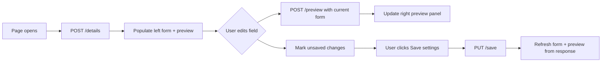

# GST & Invoice Settings — Complete API & Frontend Integration Guide

Use this document as the **single source of truth** for integrating **Finance Operations → GST & Invoice Settings** in the admin panel.

**Base path:** `/api/finance/gst-settings`  
**Auth:** Bearer token — **Super Admin** or **Finance Admin** only  
**HTTP rule:** Reads use **POST**; save uses **PUT** (never GET)

**Postman:** Import `GST_INVOICE_SETTINGS_POSTMAN_COLLECTION.json` from the repo root.

---

## Table of contents

1. [Module overview](#1-module-overview)
2. [Authentication](#2-authentication)
3. [Standard response format](#3-standard-response-format)
4. [API summary](#4-api-summary)
5. [Page layout → API mapping](#5-page-layout--api-mapping)
6. [Step-by-step frontend flow](#6-step-by-step-frontend-flow)
7. [API 1 — Get details (page load)](#7-api-1--get-details-page-load)
8. [API 2 — Preview (live invoice preview)](#8-api-2--preview-live-invoice-preview)
9. [API 3 — Save settings](#9-api-3--save-settings)
10. [GST enable/disable logic (critical)](#10-gst-enabledisable-logic-critical)
11. [Invoice preview panel mapping](#11-invoice-preview-panel-mapping)
12. [Unsaved changes tracking](#12-unsaved-changes-tracking)
13. [TypeScript interfaces](#13-typescript-interfaces)
14. [Recommended file structure](#14-recommended-file-structure)
15. [Error handling](#15-error-handling)
16. [Common mistakes to avoid](#16-common-mistakes-to-avoid)
17. [Testing checklist](#17-testing-checklist)

---

## 1. Module overview

**Purpose:** Configure global GST, branch GSTIN, invoice/receipt prefixes, receipt branding, PDF watermark, and auto-send receipt — with a **live invoice preview** on the right side.

The page has **exactly 3 APIs**:

| # | When | Method | Endpoint |
|---|------|--------|----------|
| 1 | Page load | POST | `/details` |
| 2 | Form changes (debounced) | POST | `/preview` |
| 3 | Save settings button | PUT | `/save` |



**There is no separate API per section.** One save payload covers global settings, all branches, branding, and automation.

---

## 2. Authentication

Every request must include:

```http
Authorization: Bearer <token>
Content-Type: application/json
```

### Login

```http
POST /api/auth/login-super-admin
Content-Type: application/json

{
  "email": "admin@sriramias.com",
  "password": "your-password"
}
```

Store the returned token. **403** if the role is not Super Admin or Finance Admin.

---

## 3. Standard response format

### Success

```json
{
  "success": true,
  "statusCode": 10000,
  "message": "GST settings fetched successfully",
  "data": { },
  "error": null
}
```

### Validation error (400)

```json
{
  "success": false,
  "statusCode": 11000,
  "message": "Validation failed",
  "data": null,
  "error": {
    "errors": ["\"globalSettings.gstPercent\" is required"]
  }
}
```

---

## 4. API summary

| UI area | API | Notes |
|---------|-----|-------|
| Page load — all left-column fields | `POST /details` | Includes saved `preview` snapshot |
| Right panel — live preview | `POST /preview` | Uses **unsaved** form values |
| **Save settings** button | `PUT /save` | Persists everything; response = same as `/details` |

---

## 5. Page layout → API mapping

Based on your UI screenshots:

### Top bar

| UI element | API |
|------------|-----|
| **Save settings** button | `PUT /save` |
| Breadcrumb "Finance > GST & Invoice Settings" | Static |

### Left column — Global tax settings

| UI field | API path |
|----------|----------|
| GST percent | `globalSettings.gstPercent` |
| Invoice prefix | `globalSettings.invoicePrefix` |
| Receipt prefix | `globalSettings.receiptPrefix` |
| Enable tax on invoices (checkbox) | `globalSettings.enableTax` |

### Left column — Branch GST numbers

One card per active center (Delhi, Hyderabad, Pune, etc.):

| UI field | API path |
|----------|----------|
| Center name label (e.g. "Delhi Center DEL") | `branchSettings[i].centerName` + `branchSettings[i].branchCode` |
| Branch code | `branchSettings[i].branchCode` |
| GST enabled (checkbox) | `branchSettings[i].gstEnabled` |
| GSTIN | `branchSettings[i].gstin` |
| Hidden key | `branchSettings[i].centerId` |

Branch list is **synced from active centers** on the backend. Do not invent centers on the frontend.

### Left column — Receipt template & branding

| UI field | API path |
|----------|----------|
| Company name | `branding.companyName` |
| Company address | `branding.companyAddress` |
| Financial year | `branding.financialYear` |
| Logo URL | `branding.logoUrl` |
| Signature image URL | `branding.signatureImageUrl` |
| Signatory name | `branding.signatoryName` |
| Signatory designation | `branding.signatoryDesignation` |
| Footer notes | `branding.footerNotes` |
| Terms & conditions | `branding.termsAndConditions` |

### Left column — Automation

| UI field | API path |
|----------|----------|
| PDF watermark (checkbox) | `automation.pdfWatermarkEnabled` |
| Auto-send receipt after generation (checkbox) | `automation.autoSendReceiptEnabled` |

### Right column — Invoice preview

All preview fields come from **`POST /preview`** response (or `data.preview` on page load from `/details`):

| Preview label | API field |
|---------------|-----------|
| Company name header | `preview.companyName` |
| "Tax Invoice Preview - FY 2026" | `preview.financialYear` |
| Invoice # | `preview.invoiceNumber` |
| Receipt # | `preview.receiptNumber` |
| GST rate | `preview.gstRateLabel` |
| Taxable amount | `preview.taxableAmount` |
| CGST row | `preview.cgst` + `preview.cgstRate` |
| SGST row | `preview.sgst` + `preview.sgstRate` |
| Total | `preview.total` |
| Branch format footer | `preview.branchFormatExamples[]` |
| "You have unsaved changes" | Frontend-only dirty flag |

---

## 6. Step-by-step frontend flow

### Phase A — Page opens

1. Show skeleton loaders for left form and right preview.
2. Call **`POST /details`** with `{}`.
3. Store response in form state (`globalSettings`, `branchSettings`, `branding`, `automation`).
4. Bind left-column inputs from `data`.
5. Bind right preview from `data.preview`.
6. Store a **saved snapshot** (deep copy) for dirty-state comparison.
7. Set `isDirty = false`.

### Phase B — User edits any field

1. Update local form state immediately (inputs feel responsive).
2. Set `isDirty = true` → show orange **"You have unsaved changes"** under preview.
3. **Debounce** (~300–500ms) then call **`POST /preview`** with the **full current form payload** (same shape as save, minus nothing).
4. Replace right preview panel from `data` response.
5. Do **not** call `/details` on every keystroke.

### Phase C — User clicks Save settings

1. Validate required fields client-side (see [API 3](#9-api-3--save-settings)).
2. Disable button + show loading on Save.
3. Call **`PUT /save`** with full form payload.
4. On success:
   - Toast "GST settings saved successfully"
   - Replace form state from `data`
   - Update preview from `data.preview`
   - Update saved snapshot
   - Set `isDirty = false`
5. On validation error: show field/toast errors, keep dirty state.

### Phase D — User leaves page with unsaved changes

Optional: browser `beforeunload` warning when `isDirty === true`.

### Which API when?

| User action | API |
|-------------|-----|
| Opens page | `POST /details` |
| Changes GST %, prefix, checkbox, GSTIN, branding, etc. | `POST /preview` (debounced) |
| Clicks Save settings | `PUT /save` |
| After successful save | Use save response — **no extra `/details` call needed** |

---

## 7. API 1 — Get details (page load)

**When:** Page opens (once).

### Request

```http
POST /api/finance/gst-settings/details
Authorization: Bearer <token>
Content-Type: application/json

{}
```

### Response

```json
{
  "success": true,
  "statusCode": 10000,
  "message": "GST settings fetched successfully",
  "data": {
    "globalSettings": {
      "gstPercent": 18,
      "invoicePrefix": "INV-SRI-",
      "receiptPrefix": "RCP-SRI-",
      "enableTax": true
    },
    "branchSettings": [
      {
        "centerId": "674abc111111111111111111",
        "centerName": "Delhi Center",
        "branchCode": "DEL",
        "gstEnabled": true,
        "gstin": "29ABCDEDLHFIZ5"
      },
      {
        "centerId": "674abc222222222222222222",
        "centerName": "Hyderabad Center",
        "branchCode": "HYD",
        "gstEnabled": true,
        "gstin": "36ABCDE1234F1Z5"
      },
      {
        "centerId": "674abc333333333333333333",
        "centerName": "Pune Center",
        "branchCode": "PUN",
        "gstEnabled": true,
        "gstin": "27ABCDE1234F1Z5"
      }
    ],
    "branding": {
      "companyName": "Sriram IAS",
      "companyAddress": "New Delhi, India",
      "financialYear": "2026",
      "logoUrl": "",
      "signatureImageUrl": "",
      "signatoryName": "Finance Manager",
      "signatoryDesignation": "Authorized Signatory",
      "footerNotes": "Thank you for your payment. This is a computer-generated receipt.",
      "termsAndConditions": "Fees once paid are non-refundable except as per institute policy."
    },
    "automation": {
      "pdfWatermarkEnabled": true,
      "autoSendReceiptEnabled": false
    },
    "preview": {
      "companyName": "Sriram IAS",
      "financialYear": "2026",
      "invoiceNumber": "DEL-INV-SRI-2026-00125",
      "receiptNumber": "DEL-RCP-SRI-2026-00125",
      "gstRateLabel": "18%",
      "showTaxRows": true,
      "taxableAmount": 100000,
      "cgstRate": 9,
      "sgstRate": 9,
      "cgst": 9000,
      "sgst": 9000,
      "total": 118000,
      "branchFormatExamples": [
        "DEL-INV-SRI-2026-00125",
        "HYD-INV-SRI-2026-00125",
        "PUN-INV-SRI-2026-00125"
      ],
      "footerNotes": "Thank you for your payment. This is a computer-generated receipt.",
      "termsAndConditions": "Fees once paid are non-refundable except as per institute policy."
    },
    "updatedAt": "2026-06-30T10:00:00.000Z"
  },
  "error": null
}
```

### Notes

- `data.preview` is computed from **saved** DB values — use it for initial right panel.
- `branchSettings` always includes **all active centers** merged with saved branch data.
- If no settings exist yet, backend auto-seeds defaults on first access.

---

## 8. API 2 — Preview (live invoice preview)

**When:** Any form field changes (debounced). Does **not** read or write the database.

### Request

Send the **complete current form state** — same structure as save:

```http
POST /api/finance/gst-settings/preview
Authorization: Bearer <token>
Content-Type: application/json

{
  "globalSettings": {
    "gstPercent": 18,
    "invoicePrefix": "INV-SRI-",
    "receiptPrefix": "RCP-SRI-",
    "enableTax": false
  },
  "branchSettings": [
    {
      "centerId": "674abc111111111111111111",
      "centerName": "Delhi Center",
      "branchCode": "DEL",
      "gstEnabled": true,
      "gstin": "29ABCDEDLHFIZ5"
    },
    {
      "centerId": "674abc222222222222222222",
      "centerName": "Hyderabad Center",
      "branchCode": "HYD",
      "gstEnabled": true,
      "gstin": "36ABCDE1234F1Z5"
    },
    {
      "centerId": "674abc333333333333333333",
      "centerName": "Pune Center",
      "branchCode": "PUN",
      "gstEnabled": true,
      "gstin": "27ABCDE1234F1Z5"
    }
  ],
  "branding": {
    "companyName": "Sriram IAS",
    "companyAddress": "New Delhi, India",
    "financialYear": "2026",
    "logoUrl": "",
    "signatureImageUrl": "",
    "signatoryName": "Finance Manager",
    "signatoryDesignation": "Authorized Signatory",
    "footerNotes": "Thank you for your payment. This is a computer-generated receipt.",
    "termsAndConditions": "Fees once paid are non-refundable except as per institute policy."
  },
  "automation": {
    "pdfWatermarkEnabled": true,
    "autoSendReceiptEnabled": false
  }
}
```

### Response — Tax enabled (matches first screenshot)

When `enableTax: true`, branch `gstEnabled: true`, and GSTIN is set:

```json
{
  "success": true,
  "statusCode": 10000,
  "message": "GST settings preview generated successfully",
  "data": {
    "companyName": "Sriram IAS",
    "financialYear": "2026",
    "invoiceNumber": "DEL-INV-SRI-2026-00125",
    "receiptNumber": "DEL-RCP-SRI-2026-00125",
    "gstRateLabel": "18%",
    "showTaxRows": true,
    "taxableAmount": 100000,
    "cgstRate": 9,
    "sgstRate": 9,
    "cgst": 9000,
    "sgst": 9000,
    "total": 118000,
    "branchFormatExamples": [
      "DEL-INV-SRI-2026-00125",
      "HYD-INV-SRI-2026-00125",
      "PUN-INV-SRI-2026-00125"
    ],
    "footerNotes": "Thank you for your payment. This is a computer-generated receipt.",
    "termsAndConditions": "Fees once paid are non-refundable except as per institute policy."
  },
  "error": null
}
```

### Response — Tax disabled (matches second screenshot)

When `enableTax: false`:

```json
{
  "success": true,
  "statusCode": 10000,
  "message": "GST settings preview generated successfully",
  "data": {
    "companyName": "Sriram IAS",
    "financialYear": "2026",
    "invoiceNumber": "DEL-INV-SRI-2026-00125",
    "receiptNumber": "DEL-RCP-SRI-2026-00125",
    "gstRateLabel": "Disabled",
    "showTaxRows": false,
    "taxableAmount": 100000,
    "cgstRate": 0,
    "sgstRate": 0,
    "cgst": 0,
    "sgst": 0,
    "total": 100000,
    "branchFormatExamples": [
      "DEL-INV-SRI-2026-00125",
      "HYD-INV-SRI-2026-00125",
      "PUN-INV-SRI-2026-00125"
    ],
    "footerNotes": "Thank you for your payment. This is a computer-generated receipt.",
    "termsAndConditions": "Fees once paid are non-refundable except as per institute policy."
  },
  "error": null
}
```

### Preview behavior rules

| Rule | Detail |
|------|--------|
| Sample branch | Preview uses **`branchSettings[0]`** (first branch, usually Delhi) for invoice/receipt numbers and tax calculation |
| Fixed sample amount | `taxableAmount` is always **₹1,00,000** (backend constant for preview) |
| CGST / SGST split | Each is half of total GST (18% → 9% + 9%) |
| Branch format footer | First **3 branches** shown in `branchFormatExamples` |
| Document number format | `{branchCode}-{prefix}{financialYear}-{00000}` e.g. `DEL-INV-SRI-2026-00125` |

### UI binding for tax rows

```typescript
if (preview.showTaxRows) {
  // Show CGST row: preview.cgstRate + '%' → ₹preview.cgst
  // Show SGST row: preview.sgstRate + '%' → ₹preview.sgst
} else {
  // Hide CGST/SGST rows
  // Show gstRateLabel as "Disabled"
  // Total = preview.taxableAmount
}
```

Format amounts as Indian currency: `₹1,00,000`.

---

## 9. API 3 — Save settings

**When:** User clicks **Save settings** (top-right blue button).

### Request

```http
PUT /api/finance/gst-settings/save
Authorization: Bearer <token>
Content-Type: application/json

{
  "globalSettings": {
    "gstPercent": 18,
    "invoicePrefix": "INV-SRI-",
    "receiptPrefix": "RCP-SRI-",
    "enableTax": true
  },
  "branchSettings": [
    {
      "centerId": "674abc111111111111111111",
      "centerName": "Delhi Center",
      "branchCode": "DEL",
      "gstEnabled": true,
      "gstin": "29ABCDEDLHFIZ5"
    },
    {
      "centerId": "674abc222222222222222222",
      "centerName": "Hyderabad Center",
      "branchCode": "HYD",
      "gstEnabled": true,
      "gstin": "36ABCDE1234F1Z5"
    },
    {
      "centerId": "674abc333333333333333333",
      "centerName": "Pune Center",
      "branchCode": "PUN",
      "gstEnabled": true,
      "gstin": "27ABCDE1234F1Z5"
    }
  ],
  "branding": {
    "companyName": "Sriram IAS",
    "companyAddress": "New Delhi, India",
    "financialYear": "2026",
    "logoUrl": "https://example.com/logo.png",
    "signatureImageUrl": "https://example.com/signature.png",
    "signatoryName": "Finance Manager",
    "signatoryDesignation": "Authorized Signatory",
    "footerNotes": "Thank you for your payment. This is a computer-generated receipt.",
    "termsAndConditions": "Fees once paid are non-refundable except as per institute policy."
  },
  "automation": {
    "pdfWatermarkEnabled": true,
    "autoSendReceiptEnabled": false
  }
}
```

### Required fields

| Section | Required |
|---------|----------|
| `globalSettings.gstPercent` | 0–100 |
| `globalSettings.invoicePrefix` | Non-empty |
| `globalSettings.receiptPrefix` | Non-empty |
| `globalSettings.enableTax` | boolean |
| `branchSettings` | At least 1 branch; each needs `centerId`, `branchCode` |
| `branding.companyName` | Non-empty |
| `branding.financialYear` | Non-empty |
| `automation.pdfWatermarkEnabled` | boolean |
| `automation.autoSendReceiptEnabled` | boolean |

### GSTIN validation on save

When `gstEnabled === true` and `gstin` is provided, backend validates 15-character GSTIN format. Invalid GSTIN returns **400**.

### Response

Same shape as **`POST /details`** — includes updated `globalSettings`, `branchSettings`, `branding`, `automation`, `preview`, and `updatedAt`.

```json
{
  "success": true,
  "statusCode": 10000,
  "message": "GST settings saved successfully",
  "data": {
    "globalSettings": { },
    "branchSettings": [ ],
    "branding": { },
    "automation": { },
    "preview": { },
    "updatedAt": "2026-06-30T15:50:00.000Z"
  },
  "error": null
}
```

### After save

1. Replace entire form state from `data`.
2. Update preview from `data.preview`.
3. Clear `isDirty`.
4. Toast success.

---

## 10. GST enable/disable logic (critical)

GST is applied in preview and in real receipts **only when all three are true**:

```
globalSettings.enableTax === true
AND branchSettings[i].gstEnabled === true
AND branchSettings[i].gstin is non-empty
```

### Scenarios

| Global enableTax | Branch gstEnabled | Branch GSTIN | Preview result |
|:----------------:|:-----------------:|:------------:|----------------|
| ✅ true | ✅ true | ✅ set | `gstRateLabel: "18%"`, tax rows shown |
| ❌ false | ✅ true | ✅ set | `gstRateLabel: "Disabled"`, no tax rows |
| ✅ true | ❌ false | ✅ set | `gstRateLabel: "Disabled"`, no tax rows |
| ✅ true | ✅ true | ❌ empty | `gstRateLabel: "Disabled"`, no tax rows |

**Do not calculate tax on the frontend.** Always use `POST /preview` response values.

---

## 11. Invoice preview panel mapping

### Tax enabled view (screenshot 1)

```
Sriram IAS
Tax Invoice Preview - FY {preview.financialYear}

Invoice #:  {preview.invoiceNumber}
Receipt #:  {preview.receiptNumber}

Taxable amount:  ₹{preview.taxableAmount formatted}
CGST ({preview.cgstRate}%):  ₹{preview.cgst formatted}
SGST ({preview.sgstRate}%):  ₹{preview.sgst formatted}
Total:  ₹{preview.total formatted}

Branch format: {preview.branchFormatExamples joined by space}
```

### Tax disabled view (screenshot 2)

```
Sriram IAS
Tax Invoice Preview - FY {preview.financialYear}

Invoice #:  {preview.invoiceNumber}
Receipt #:  {preview.receiptNumber}

GST rate:  Disabled
Taxable amount:  ₹{preview.taxableAmount formatted}
Total:  ₹{preview.total formatted}   ← equals taxable amount

Branch format: DEL-INV-SRI-2026-00125 HYD-INV-SRI-2026-00125 ...
```

When `showTaxRows === false`, hide CGST and SGST rows entirely.

---

## 12. Unsaved changes tracking

The orange **"You have unsaved changes"** text is **frontend-only** — no API field.

### Recommended approach

```typescript
const [formState, setFormState] = useState<GstSettingsForm | null>(null);
const [savedSnapshot, setSavedSnapshot] = useState<string>('');

const isDirty = useMemo(() => {
  if (!formState) return false;
  return JSON.stringify(formState) !== savedSnapshot;
}, [formState, savedSnapshot]);

// After /details or successful /save:
setSavedSnapshot(JSON.stringify(normalizeForm(data)));

// On any input change:
setFormState(updated);
// debounce → POST /preview
```

Show warning when `isDirty === true`. Hide after successful save.

---

## 13. TypeScript interfaces

```typescript
// types/gstSettings.types.ts

export interface ApiResponse<T> {
  success: boolean;
  statusCode: number;
  message: string;
  data: T;
  error: unknown;
}

export interface GlobalSettings {
  gstPercent: number;
  invoicePrefix: string;
  receiptPrefix: string;
  enableTax: boolean;
}

export interface BranchSetting {
  centerId: string;
  centerName: string;
  branchCode: string;
  gstEnabled: boolean;
  gstin: string;
}

export interface BrandingSettings {
  companyName: string;
  companyAddress: string;
  financialYear: string;
  logoUrl: string;
  signatureImageUrl: string;
  signatoryName: string;
  signatoryDesignation: string;
  footerNotes: string;
  termsAndConditions: string;
}

export interface AutomationSettings {
  pdfWatermarkEnabled: boolean;
  autoSendReceiptEnabled: boolean;
}

export interface GstSettingsPayload {
  globalSettings: GlobalSettings;
  branchSettings: BranchSetting[];
  branding: BrandingSettings;
  automation: AutomationSettings;
}

export interface GstPreview {
  companyName: string;
  financialYear: string;
  invoiceNumber: string;
  receiptNumber: string;
  gstRateLabel: string;
  showTaxRows: boolean;
  taxableAmount: number;
  cgstRate: number;
  sgstRate: number;
  cgst: number;
  sgst: number;
  total: number;
  branchFormatExamples: string[];
  footerNotes: string;
  termsAndConditions: string;
}

export interface GstSettingsDetails extends GstSettingsPayload {
  preview: GstPreview;
  updatedAt: string;
}
```

### Example service

```typescript
// services/gstSettings.service.ts
import axios from './axios';
import type { ApiResponse, GstSettingsDetails, GstSettingsPayload, GstPreview } from '../types/gstSettings.types';

const BASE = '/api/finance/gst-settings';

export const fetchGstSettingsDetails = () =>
  axios.post<ApiResponse<GstSettingsDetails>>(`${BASE}/details`, {});

export const previewGstSettings = (payload: GstSettingsPayload) =>
  axios.post<ApiResponse<GstPreview>>(`${BASE}/preview`, payload);

export const saveGstSettings = (payload: GstSettingsPayload) =>
  axios.put<ApiResponse<GstSettingsDetails>>(`${BASE}/save`, payload);
```

### Example hook

```typescript
// hooks/useGstSettings.ts
import { useCallback, useEffect, useRef, useState } from 'react';
import debounce from 'lodash/debounce';
import {
  fetchGstSettingsDetails,
  previewGstSettings,
  saveGstSettings
} from '../services/gstSettings.service';

export function useGstSettings() {
  const [form, setForm] = useState<GstSettingsPayload | null>(null);
  const [preview, setPreview] = useState<GstPreview | null>(null);
  const [savedSnapshot, setSavedSnapshot] = useState('');
  const [loading, setLoading] = useState(true);
  const [saving, setSaving] = useState(false);

  const load = useCallback(async () => {
    setLoading(true);
    const { data } = await fetchGstSettingsDetails();
    const payload = {
      globalSettings: data.data.globalSettings,
      branchSettings: data.data.branchSettings,
      branding: data.data.branding,
      automation: data.data.automation
    };
    setForm(payload);
    setPreview(data.data.preview);
    setSavedSnapshot(JSON.stringify(payload));
    setLoading(false);
  }, []);

  const debouncedPreview = useRef(
    debounce(async (payload: GstSettingsPayload) => {
      const { data } = await previewGstSettings(payload);
      setPreview(data.data);
    }, 400)
  ).current;

  const updateForm = (updater: (prev: GstSettingsPayload) => GstSettingsPayload) => {
    setForm((prev) => {
      if (!prev) return prev;
      const next = updater(prev);
      debouncedPreview(next);
      return next;
    });
  };

  const save = async () => {
    if (!form) return;
    setSaving(true);
    try {
      const { data } = await saveGstSettings(form);
      const payload = {
        globalSettings: data.data.globalSettings,
        branchSettings: data.data.branchSettings,
        branding: data.data.branding,
        automation: data.data.automation
      };
      setForm(payload);
      setPreview(data.data.preview);
      setSavedSnapshot(JSON.stringify(payload));
    } finally {
      setSaving(false);
    }
  };

  useEffect(() => {
    load();
    return () => debouncedPreview.cancel();
  }, [load, debouncedPreview]);

  const isDirty = form ? JSON.stringify(form) !== savedSnapshot : false;

  return { form, preview, loading, saving, isDirty, updateForm, save, reload: load };
}
```

---

## 14. Recommended file structure

```
services/gstSettings.service.ts
hooks/useGstSettings.ts
types/gstSettings.types.ts
utils/formatIndianCurrency.ts
components/finance/gst/
  GlobalTaxSettingsSection.tsx
  BranchGstSection.tsx
  ReceiptBrandingSection.tsx
  AutomationSection.tsx
  InvoicePreviewPanel.tsx
  UnsavedChangesNotice.tsx
pages/finance/GstInvoiceSettingsPage.tsx
```

---

## 15. Error handling

| Scenario | HTTP | Frontend action |
|----------|------|-----------------|
| Not logged in | 401 | Redirect to login |
| Wrong role | 403 | Show access denied |
| Validation error | 400 | Show errors from `error.errors` |
| Invalid GSTIN | 400 | Highlight branch GSTIN field |
| Duplicate branch code | 400 | Toast error message |
| Preview failure | 500 | Keep last good preview; toast warning |
| Save failure | 500 | Toast "Failed to save settings"; keep dirty state |

Show skeleton on page load. Disable Save button while `saving === true`.

---

## 16. Common mistakes to avoid

1. **Using GET** — `/details` and `/preview` are POST.
2. **Calculating CGST/SGST on frontend** — always use `/preview` response.
3. **Calling `/details` on every field change** — use `/preview` instead.
4. **Partial save payload** — always send full `globalSettings`, `branchSettings`, `branding`, `automation`.
5. **Omitting branches** — include all branches from initial `/details` response.
6. **Assuming tax ON = show rows** — also need branch GST enabled + GSTIN filled.
7. **Local preview only after save** — preview must update live via `/preview` while editing.
8. **Wrong document number format** — use `preview.invoiceNumber` as-is from API.

---

## 17. Testing checklist

- [ ] Page load populates all left-column sections from `/details`
- [ ] Initial preview matches `data.preview`
- [ ] Changing GST % updates preview totals via `/preview`
- [ ] Unchecking "Enable tax" → `gstRateLabel: "Disabled"`, no CGST/SGST rows
- [ ] Unchecking branch "GST enabled" → preview tax disabled
- [ ] Empty branch GSTIN → preview tax disabled even if global tax ON
- [ ] Changing invoice/receipt prefix updates preview document numbers
- [ ] Changing financial year updates preview numbers and FY label
- [ ] Changing company name updates preview header
- [ ] Branch format footer shows up to 3 branch examples
- [ ] "You have unsaved changes" appears on edit, clears on save
- [ ] Save persists all sections; response refreshes form + preview
- [ ] Invalid GSTIN shows validation error on save
- [ ] PDF watermark / auto-send checkboxes save correctly
- [ ] 403 for non-admin roles

---

## Quick API reference

| Step | Method | Endpoint | Body |
|------|--------|----------|------|
| Page load | POST | `/api/finance/gst-settings/details` | `{}` |
| Live preview | POST | `/api/finance/gst-settings/preview` | Full settings payload |
| Save | PUT | `/api/finance/gst-settings/save` | Full settings payload |
