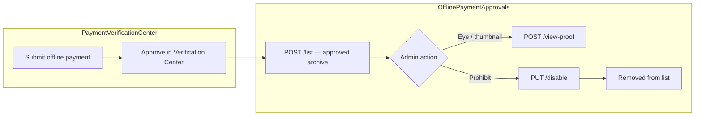

# Offline Payment Approvals — Frontend Integration Guide (Step-by-Step)

Use this document as the **single source of truth** for integrating **Finance Operations → Offline Payment Approval** in the admin panel.

**Base path:** `/api/finance/offline-payment-approvals`  
**Auth:** Bearer token — **Super Admin or Finance Admin only**  
**Postman:** Import `OFFLINE_PAYMENT_APPROVALS_POSTMAN_COLLECTION.json` from the repo root.

**Related guides:**
- Pending verify / reject flow → `PAYMENT_VERIFICATION_CENTER_FRONTEND_API_GUIDE.md`
- Receipts after approval → `RECEIPT_MANAGEMENT_FRONTEND_API_GUIDE.md`

---

## Table of contents

1. [Module overview](#1-module-overview)
2. [Authentication & roles](#2-authentication--roles)
3. [Standard response format](#3-standard-response-format)
4. [API summary](#4-api-summary)
5. [Page layout → API mapping](#5-page-layout--api-mapping)
6. [Step 1 — Page load](#6-step-1--page-load)
7. [Step 2 — Centre tab change](#7-step-2--centre-tab-change)
8. [Step 3 — Search, date & payment mode filters](#8-step-3--search-date--payment-mode-filters)
9. [Step 4 — Pagination](#9-step-4--pagination)
10. [Step 5 — CSV export (header download icon)](#10-step-5--csv-export-header-download-icon)
11. [Step 6 — Table row & proof thumbnail](#11-step-6--table-row--proof-thumbnail)
12. [Step 7 — Uploaded proof modal (eye icon)](#12-step-7--uploaded-proof-modal-eye-icon)
13. [Step 8 — Disable offline payment (prohibit icon)](#13-step-8--disable-offline-payment-prohibit-icon)
14. [Proof type rendering (IMAGE vs PDF)](#14-proof-type-rendering-image-vs-pdf)
15. [TypeScript interfaces & service layer](#15-typescript-interfaces--service-layer)
16. [Error handling](#16-error-handling)
17. [Testing checklist](#17-testing-checklist)

---

## 1. Module overview

**Offline Payment Approval** is an **archive of already approved** offline payments. Records appear here **after** finance approves them in **Payment Verification Center**.

This screen is **not** the pending approval queue. There is **no verify (tick) or reject** action here — payments are already `VERIFIED` + `APPROVED`.



### What appears in this list

Backend filter (`APPROVED_OFFLINE_FILTER`):

| Condition | Value |
|-----------|-------|
| `verificationStatus` | `VERIFIED` |
| `financeHeadStatus` | `APPROVED` |
| `gateway` | `OFFLINE` |
| `paymentProofUrl` | Non-empty (must have uploaded proof) |
| `isDisabled` | `false` |
| `isDeleted` | `false` |

### Admin actions on this screen

| UI action | API | Purpose |
|-----------|-----|---------|
| View list + filters | `POST /list` | Main table |
| Eye / proof thumbnail | `POST /view-proof` | Full proof viewer modal |
| Prohibit / disable icon | `PUT /disable` | Soft-disable — record removed from list |
| Header download icon | Client-side CSV | Export filtered rows |

---

## 2. Authentication & roles

```http
Authorization: Bearer <token>
Content-Type: application/json
```

### Login

```http
POST /api/auth/login-super-admin
Content-Type: application/json

{
  "email": "admin@sriramias.com",
  "password": "your-password"
}
```

### Permissions

| Action | Super Admin / Finance Admin | Others |
|--------|:---------------------------:|:------:|
| List approved payments | ✅ | ❌ 403 |
| View proof | ✅ | ❌ |
| Disable payment | ✅ | ❌ |

All three endpoints use `paymentAttemptAdminAuth` — **Super Admin or Finance Admin only**.

---

## 3. Standard response format

### Success

```json
{
  "success": true,
  "statusCode": 10000,
  "message": "Offline payment approvals fetched successfully",
  "data": { },
  "error": null
}
```

### Validation error (400)

```json
{
  "success": false,
  "statusCode": 11000,
  "message": "Validation failed",
  "data": null,
  "error": {
    "errors": [
      "\"reason\" length must be at least 3 characters long"
    ]
  }
}
```

### Not found (404)

```json
{
  "success": false,
  "statusCode": 404,
  "message": "Approved offline payment not found",
  "data": null,
  "error": "Approved offline payment not found"
}
```

---

## 4. API summary

| # | UI trigger | Method | Endpoint | Body |
|---|------------|--------|----------|------|
| 1 | Page load / filter / pagination | POST | `/list` | Filters + page |
| 2 | Eye icon / proof thumbnail click | POST | `/view-proof` | `{ paymentId }` |
| 3 | Disable confirmation | PUT | `/disable` | `{ paymentId, reason }` |

**There is no separate `/filter-options` endpoint.** Centre tabs and payment mode dropdown come from **`POST /list`** response (`data.centres`, `data.paymentModes`).

**There is no backend CSV export endpoint.** Export client-side using paginated `/list`.

---

## 5. Page layout → API mapping

### Filter bar

| UI element | API source | Request key |
|------------|------------|---------------|
| Centre pills (All / Delhi / Hyderabad / Pune) | `data.centres` from list | `centreId` (empty = All) |
| Search "Payment ID / Student Name" | — | `search` |
| Date picker (`dd-mm-yyyy`) | — | `date` (ISO `YYYY-MM-DD`) |
| All Modes dropdown | `data.paymentModes` from list | `paymentMode` (mode name string) |
| Download icon (header) | Client CSV export | Same filters as list |

### Table columns

| Column | API field | Notes |
|--------|-----------|-------|
| Student Name | `studentName` | |
| Branch | `branch` | Centre code e.g. `DEL`, `PUN`, `HYD` |
| Payment Mode | `paymentMode` | e.g. Cash, UPI Offline, Bank Transfer |
| Receipt Number | `receiptNumber` | e.g. `CSH-DEL-24001`, `UTR8829103344` |
| Uploaded Proof / PDF | `proofType`, `proofUrl` | Thumbnail for IMAGE; doc icon for PDF |
| Approved By | `approvedBy` | Verifier / finance admin name |
| Updated On | `updatedOn` | Format e.g. `11:46 pm, 29 Jun 2026` |
| Amount | `amount` | Format `₹20,000` |
| Actions | `paymentId` | Eye + Disable icons |

### Row identifier

Use `paymentId` from list for all actions. Backend resolves:

1. `submissionRef` (e.g. `OFF-001`) — preferred display ID
2. Or `verificationId` if no submission ref

---

## 6. Step 1 — Page load

**Trigger:** User navigates to Finance → Offline Payment Approval.

**Single API call:**

```http
POST /api/finance/offline-payment-approvals/list
Authorization: Bearer <token>
Content-Type: application/json

{
  "page": 1,
  "limit": 10,
  "search": "",
  "centreId": "",
  "paymentMode": "",
  "date": ""
}
```

**Response:**

```json
{
  "success": true,
  "statusCode": 10000,
  "message": "Offline payment approvals fetched successfully",
  "data": {
    "summary": {
      "totalRecords": 8
    },
    "centres": [
      { "centreId": "", "centreName": "All Centres" },
      {
        "centreId": "674center1234567890abcdef",
        "centreName": "Delhi Center"
      },
      {
        "centreId": "674center2234567890abcdef",
        "centreName": "Hyderabad Center"
      },
      {
        "centreId": "674center3234567890abcdef",
        "centreName": "Pune Center"
      }
    ],
    "paymentModes": [
      { "value": "", "label": "All Modes" },
      {
        "value": "Cash",
        "label": "Cash",
        "paymentModeId": "PM001"
      },
      {
        "value": "UPI",
        "label": "UPI",
        "paymentModeId": "PM004"
      },
      {
        "value": "Bank Transfer",
        "label": "Bank Transfer",
        "paymentModeId": "PM002"
      },
      {
        "value": "Cheque",
        "label": "Cheque",
        "paymentModeId": "PM003"
      }
    ],
    "list": {
      "page": 1,
      "limit": 10,
      "totalCount": 8,
      "totalPages": 1,
      "items": [
        {
          "paymentId": "OFF-001",
          "studentId": "STU-24010",
          "studentName": "Vikram Singh",
          "branch": "DEL",
          "paymentMode": "Cash",
          "receiptNumber": "CSH-DEL-24001",
          "proofType": "IMAGE",
          "proofUrl": "https://res.cloudinary.com/.../cash-receipt.jpg",
          "approvedBy": "Priya Sharma",
          "updatedOn": "2026-06-29T18:16:00.000Z",
          "amount": 20000,
          "isDisabled": false
        },
        {
          "paymentId": "OFF-002",
          "studentId": "STU-24011",
          "studentName": "Anita Das",
          "branch": "PUN",
          "paymentMode": "UPI",
          "receiptNumber": "UTR8829103344",
          "proofType": "IMAGE",
          "proofUrl": "https://res.cloudinary.com/.../upi-screenshot.jpg",
          "approvedBy": "Rahul Verma",
          "updatedOn": "2026-06-28T14:30:00.000Z",
          "amount": 35000,
          "isDisabled": false
        },
        {
          "paymentId": "OFF-003",
          "studentId": "STU-24012",
          "studentName": "Rohan Patel",
          "branch": "HYD",
          "paymentMode": "Bank Transfer",
          "receiptNumber": "NEFT-HYD-8899",
          "proofType": "PDF",
          "proofUrl": "https://res.cloudinary.com/.../bank-transfer.pdf",
          "approvedBy": "Priya Sharma",
          "updatedOn": "2026-06-27T10:00:00.000Z",
          "amount": 50000,
          "isDisabled": false
        }
      ]
    }
  },
  "error": null
}
```

### Bind on page load

1. **Centre pills** → `data.centres` (first item = All Centres, `centreId: ""`)
2. **Payment mode dropdown** → `data.paymentModes`
3. **Table rows** → `data.list.items`
4. Optional record count → `data.summary.totalRecords` or `data.list.totalCount`

**Cache `centres` and `paymentModes`** from first list response — they rarely change. Re-bind only if list returns updated options.

---

## 7. Step 2 — Centre tab change

**Trigger:** User clicks **Delhi**, **Hyderabad**, **Pune**, or **All Centres**.

```http
POST /api/finance/offline-payment-approvals/list
Content-Type: application/json

{
  "page": 1,
  "limit": 10,
  "search": "",
  "centreId": "674center1234567890abcdef",
  "paymentMode": "",
  "date": ""
}
```

| Tab | `centreId` value |
|-----|------------------|
| All Centres | `""` or omit |
| Delhi | Mongo `_id` from `centres` array |
| Hyderabad | Mongo `_id` |
| Pune | Mongo `_id` |

Reset `page` to `1` when centre changes.

---

## 8. Step 3 — Search, date & payment mode filters

**Trigger:** User types in search, picks a date, or selects payment mode.

**Debounce search:** 400–500 ms.

### Search

Matches (case-insensitive):
- Payment ID (`verificationId`, `submissionRef`)
- Student name
- Student ID (`studentCode`)

```json
{
  "page": 1,
  "limit": 10,
  "search": "Vikram",
  "centreId": "",
  "paymentMode": "",
  "date": ""
}
```

### Date filter

Filters by **`updatedAt`** on the record (not `paymentDate`).

Send ISO date string:

```json
{
  "page": 1,
  "limit": 10,
  "search": "",
  "centreId": "",
  "paymentMode": "",
  "date": "2026-06-29"
}
```

UI shows `dd-mm-yyyy` — convert to `YYYY-MM-DD` before API call.

### Payment mode filter

Send the **mode name** string (from dropdown `value` / `label`):

```json
{
  "page": 1,
  "limit": 10,
  "search": "",
  "centreId": "",
  "paymentMode": "Cash",
  "date": ""
}
```

For **All Modes**, send `""` or omit `paymentMode`.

### Combined filters example

```json
{
  "page": 1,
  "limit": 10,
  "search": "CSH-DEL",
  "centreId": "674center1234567890abcdef",
  "paymentMode": "Cash",
  "date": "2026-06-29"
}
```

---

## 9. Step 4 — Pagination

| User action | API change |
|-------------|------------|
| Next page | `{ "page": 2, ...same filters }` |
| Change rows per page | `{ "limit": 25, "page": 1 }` |

Pagination fields in response:

| Field | Path |
|-------|------|
| Current page | `data.list.page` |
| Page size | `data.list.limit` |
| Total records | `data.list.totalCount` |
| Total pages | `data.list.totalPages` |

Display: `Showing 1–8 of 8 records`.

---

## 10. Step 5 — CSV export (header download icon)

**Trigger:** User clicks **Download** icon in the global header.

There is **no backend CSV endpoint**. Export client-side using the **same filter body** as the current list.

```typescript
const exportCsv = async (filters: ListFilters) => {
  const allRows: OfflinePaymentRow[] = [];
  let page = 1;
  const limit = 100;

  while (true) {
    const { data } = await api.post(`${BASE}/list`, { ...filters, page, limit });
    allRows.push(...data.list.items);
    if (page >= data.list.totalPages) break;
    page += 1;
  }

  const headers = [
    'Payment ID', 'Student Name', 'Student ID', 'Branch',
    'Payment Mode', 'Receipt Number', 'Approved By',
    'Updated On', 'Amount', 'Proof URL'
  ];

  const rows = allRows.map((r) => [
    r.paymentId,
    r.studentName,
    r.studentId,
    r.branch,
    r.paymentMode,
    r.receiptNumber,
    r.approvedBy,
    r.updatedOn,
    r.amount,
    r.proofUrl
  ]);

  downloadCsv('offline-payment-approvals-export.csv', headers, rows);
};
```

Filename suggestion: `offline-payment-approvals-export.csv`.

---

## 11. Step 6 — Table row & proof thumbnail

### Proof column rendering

Use list row fields directly for thumbnails (no extra API needed for thumbnail):

| `proofType` | UI |
|-------------|-----|
| `IMAGE` | Show `` thumbnail |
| `PDF` | Show document/PDF icon |
| `null` | Empty (should not appear — list excludes records without proof) |

Clicking thumbnail **or** eye icon → open Uploaded Proof modal (Step 7).

### Approved By column

Display `approvedBy` from list. This is resolved from the user who approved/verified the payment in Payment Verification Center.

If empty string, show `—`.

### Actions column

| Icon | Show when | Action |
|------|-----------|--------|
| **Eye** | Always | Step 7 — `POST /view-proof` |
| **Prohibit / disable** | `isDisabled === false` | Step 8 — disable modal |

There is **no verify tick** on this screen — records are already approved.

---

## 12. Step 7 — Uploaded proof modal (eye icon)

**Trigger:** User clicks **eye** or proof thumbnail on a row.

```http
POST /api/finance/offline-payment-approvals/view-proof
Authorization: Bearer <token>
Content-Type: application/json

{
  "paymentId": "OFF-001"
}
```

Accepts `paymentId` as:
- `submissionRef` (e.g. `OFF-001`)
- `verificationId`
- Mongo `_id` of PaymentVerification record

**Response:**

```json
{
  "success": true,
  "statusCode": 10000,
  "message": "Payment proof fetched successfully",
  "data": {
    "paymentId": "OFF-001",
    "referenceNumber": "CSH-DEL-24001",
    "proofType": "IMAGE",
    "proofUrl": "https://res.cloudinary.com/.../cash-receipt.jpg",
    "fileName": "cash-receipt.jpg",
    "uploadedAt": "2026-06-29T18:16:00.000Z"
  },
  "error": null
}
```

**PDF example:**

```json
{
  "success": true,
  "statusCode": 10000,
  "message": "Payment proof fetched successfully",
  "data": {
    "paymentId": "OFF-003",
    "referenceNumber": "NEFT-HYD-8899",
    "proofType": "PDF",
    "proofUrl": "https://res.cloudinary.com/.../bank-transfer.pdf",
    "fileName": "bank-transfer.pdf",
    "uploadedAt": "2026-06-27T10:00:00.000Z"
  },
  "error": null
}
```

### Modal field mapping

| UI element | Field |
|------------|-------|
| Title | "Uploaded proof" |
| Type badge | `proofType === 'PDF'` → "PDF Document" ; `IMAGE` → "Screenshot / Image" |
| UTR / Reference line | `referenceNumber` (UTR or receipt number) |
| Image preview | `proofUrl` when `proofType === 'IMAGE'` |
| PDF viewer / embed | `proofUrl` when `proofType === 'PDF'` |
| Download button | Fetch/download `proofUrl` as `fileName` |
| Open in tab | `window.open(proofUrl, '_blank')` |
| Zoom controls | Frontend-only on image preview |

### Optional optimization

You may skip `/view-proof` for thumbnails and use list row `proofUrl` directly. Call `/view-proof` when opening the full modal to get `referenceNumber`, `fileName`, and `uploadedAt`.

---

## 13. Step 8 — Disable offline payment (prohibit icon)

**Trigger:** User clicks **prohibit / disable** icon → confirmation modal **"Disable offline payment?"**

Modal text pattern:
> *This will disable the offline payment request **{paymentId}** for **{studentName}**. It will no longer appear in active approval workflows.*

### Validation (frontend)

| Field | Rule |
|-------|------|
| `reason` | Required — min **3** chars, max 500 |

Disable **Disable** button until reason is valid (optional: collect reason in a textarea before confirm).

```http
PUT /api/finance/offline-payment-approvals/disable
Authorization: Bearer <token>
Content-Type: application/json

{
  "paymentId": "OFF-001",
  "reason": "Duplicate submission — disabled from offline payment approvals"
}
```

**Response:**

```json
{
  "success": true,
  "statusCode": 10000,
  "message": "Offline payment disabled successfully.",
  "data": {
    "message": "Offline payment disabled successfully.",
    "paymentId": "OFF-001",
    "isDisabled": true
  },
  "error": null
}
```

### After success

1. Close modal.
2. Toast: "Offline payment disabled successfully."
3. Refresh list (`POST /list`) — row disappears (disabled records excluded from list).
4. Audit trail written server-side (`DISABLED` action on PaymentVerification).

### Disable rules (backend)

| Rule | Error |
|------|-------|
| Payment not found | 404 |
| Already disabled | 400 |
| Not offline gateway | 400 |
| Not VERIFIED + APPROVED | 400 |
| Reason < 3 chars | 400 validation |

**Note:** Disable is a **soft-disable** (`isDisabled: true`). Record is hidden from this list but not hard-deleted.

---

## 14. Proof type rendering (IMAGE vs PDF)

Backend logic (`resolveProofType`):

| Condition | `proofType` |
|-----------|-------------|
| URL ends with `.pdf` or contains `/raw/upload` | `PDF` |
| Public ID ends with `.pdf` | `PDF` |
| Otherwise | `IMAGE` |

### Frontend rendering

```typescript
function ProofThumbnail({ proofType, proofUrl }: { proofType: string; proofUrl: string }) {
  if (proofType === 'PDF') {
    return <PdfIcon onClick={() => openProofModal()} />;
  }
  return  openProofModal()} />;
}
```

In proof modal:
- **IMAGE:** `` with zoom in/out/reset (frontend state)
- **PDF:** `<iframe src={proofUrl}>` or PDF.js viewer, plus Download + Open in tab

---

## 15. TypeScript interfaces & service layer

```typescript
const BASE = '/api/finance/offline-payment-approvals';

export interface CentreOption {
  centreId: string;
  centreName: string;
}

export interface PaymentModeOption {
  value: string;
  label: string;
  paymentModeId?: string;
}

export interface OfflinePaymentRow {
  paymentId: string;
  studentId: string;
  studentName: string;
  branch: string;
  paymentMode: string;
  receiptNumber: string;
  proofType: 'IMAGE' | 'PDF' | null;
  proofUrl: string;
  approvedBy: string;
  updatedOn: string | null;
  amount: number;
  isDisabled: boolean;
}

export interface OfflinePaymentListResponse {
  summary: { totalRecords: number };
  centres: CentreOption[];
  paymentModes: PaymentModeOption[];
  list: {
    page: number;
    limit: number;
    totalCount: number;
    totalPages: number;
    items: OfflinePaymentRow[];
  };
}

export interface ProofViewResponse {
  paymentId: string;
  referenceNumber: string;
  proofType: 'IMAGE' | 'PDF';
  proofUrl: string;
  fileName: string;
  uploadedAt: string | null;
}

export interface ListFilters {
  page?: number;
  limit?: number;
  search?: string;
  centreId?: string;
  paymentMode?: string;
  date?: string;
}

export const offlinePaymentApprovalsApi = {
  list: (body: ListFilters) =>
    api.post<{ data: OfflinePaymentListResponse }>(`${BASE}/list`, body),

  viewProof: (paymentId: string) =>
    api.post<{ data: ProofViewResponse }>(`${BASE}/view-proof`, { paymentId }),

  disable: (paymentId: string, reason: string) =>
    api.put(`${BASE}/disable`, { paymentId, reason })
};
```

### Recommended file structure

```
services/offlinePaymentApprovals.service.ts
hooks/useOfflinePaymentApprovalsList.ts
components/finance/offline-approvals/OfflinePaymentApprovalsPage.tsx
components/finance/offline-approvals/CentreTabs.tsx
components/finance/offline-approvals/ApprovalsFilterBar.tsx
components/finance/offline-approvals/ApprovalsTable.tsx
components/finance/offline-approvals/UploadedProofModal.tsx
components/finance/offline-approvals/DisablePaymentModal.tsx
types/offlinePaymentApprovals.types.ts
```

### Default list state

```typescript
const defaultFilters: ListFilters = {
  page: 1,
  limit: 10,
  search: '',
  centreId: '',
  paymentMode: '',
  date: ''
};
```

---

## 16. Error handling

| Scenario | HTTP | Frontend action |
|----------|------|-----------------|
| Not authenticated | 401 | Redirect to login |
| Not Super Admin / Finance Admin | 403 | Hide page or show access denied |
| Validation failed | 400 | Show field errors |
| Payment / proof not found | 404 | Toast + close modal |
| Already disabled | 400 | Toast + refresh list |
| Disable reason too short | 400 | Highlight reason field |

---

## 17. Testing checklist

- [ ] Page load: single `POST /list` binds table, centres, payment modes
- [ ] Centre tab filters table; All Centres sends empty `centreId`
- [ ] Search debounce matches payment ID, student name, student ID
- [ ] Date filter converts UI `dd-mm-yyyy` → ISO `YYYY-MM-DD`
- [ ] Payment mode filter sends mode name string (e.g. `"Cash"`)
- [ ] Pagination updates `page` / `limit` correctly
- [ ] CSV export downloads all rows matching current filters
- [ ] IMAGE proof shows thumbnail; PDF shows document icon
- [ ] Eye opens proof modal with reference, zoom, download, open in tab
- [ ] Disable requires reason (min 3 chars); row removed after success
- [ ] `approvedBy` shows verifier name from Payment Verification approval
- [ ] Only Super Admin / Finance Admin can access all three endpoints
- [ ] Records only appear after approve in Payment Verification Center

---

## Module relationship (quick reference)

| Screen | When to use | Base path |
|--------|-------------|-----------|
| **Payment Verification Center** | Pending payments — verify / reject | `/api/finance/payment-verification` |
| **Offline Payment Approval** | Approved archive — view proof / disable | `/api/finance/offline-payment-approvals` |
| **Receipt Management** | Tax invoices / fee receipts | `/api/finance/receipt-management` |

**Data flow:** Admin submits offline payment → Verification Center approves → Record appears in Offline Payment Approval list (if proof was uploaded).

---

*Last updated: June 2026 — 3 endpoints: `/list`, `/view-proof`, `/disable`.*
