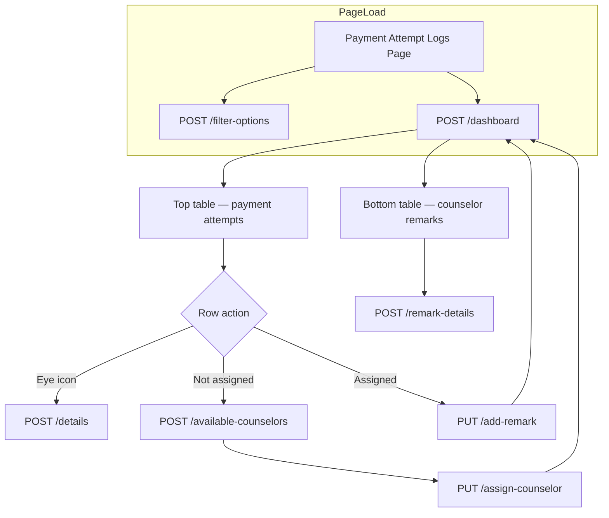

# Payment Attempt Logs — Complete API & Frontend Integration Guide

Use this document as the **single source of truth** for integrating **Finance Operations → Payment Attempt Logs** in the admin panel.

**Base path:** `/api/finance/payment-attempt`  
**Auth:** Bearer token — **Super Admin**, **Finance Admin**, or **Counselor** (`COUNSELING_ADMIN`)  
**HTTP rule:** All read APIs use **POST** (never GET). Writes use **PUT** or **DELETE**.

**Postman:** Import `PAYMENT_ATTEMPT_LOGS_POSTMAN_COLLECTION.json` from the repo root.

---

## Table of contents

1. [Module overview](#1-module-overview)
2. [Authentication & roles](#2-authentication--roles)
3. [Standard response format](#3-standard-response-format)
4. [API summary](#4-api-summary)
5. [Page layout → API mapping](#5-page-layout--api-mapping)
6. [Step-by-step frontend flow](#6-step-by-step-frontend-flow)
7. [API 1 — Filter options](#7-api-1--filter-options)
8. [API 2 — Dashboard (main page data)](#8-api-2--dashboard-main-page-data)
9. [API 3 — Attempt details (View modal)](#9-api-3--attempt-details-view-modal)
10. [API 4 — Available counselors (Assign modal dropdown)](#10-api-4--available-counselors-assign-modal-dropdown)
11. [API 5 — Assign counselor](#11-api-5--assign-counselor)
12. [API 6 — Add remark](#12-api-6--add-remark)
13. [API 7 — List remarks for attempt (optional)](#13-api-7--list-remarks-for-attempt-optional)
14. [API 8 — Remark details (Remarks table view)](#14-api-8--remark-details-remarks-table-view)
15. [API 9 — Assigned dashboard (optional)](#15-api-9--assigned-dashboard-optional)
16. [API 10 — Delete remark (Super Admin only)](#16-api-10--delete-remark-super-admin-only)
17. [Actions column logic (Assign vs Remark)](#17-actions-column-logic-assign-vs-remark)
18. [Failure reason badge colors](#18-failure-reason-badge-colors)
19. [TypeScript interfaces](#19-typescript-interfaces)
20. [Recommended file structure](#20-recommended-file-structure)
21. [Error handling](#21-error-handling)
22. [Common mistakes to avoid](#22-common-mistakes-to-avoid)
23. [Testing checklist](#23-testing-checklist)

---

## 1. Module overview

**Purpose:** Track failed online payment attempts during course checkout, assign counselors for follow-up, and log remarks from admin or counselor.

The screen has **two tables** on one page:

| Section | UI label | Data source |
|---------|----------|-------------|
| Top | Payment Attempt Logs | `dashboard.paymentAttempts.items` |
| Bottom | Counselor Remarks | `dashboard.remarks.items` |



---

## 2. Authentication & roles

Every request must include:

```http
Authorization: Bearer <token>
Content-Type: application/json
```

### Login — Super Admin / Finance Admin

```http
POST /api/auth/login-super-admin
Content-Type: application/json

{
  "email": "admin@sriramias.com",
  "password": "your-password"
}
```

### Login — Counselor

```http
POST /api/auth/login
Content-Type: application/json

{
  "roleCode": "COUNSELING_ADMIN",
  "email": "counselor@sriramias.com",
  "password": "your-password"
}
```

### Role permissions

| Action | Super Admin | Finance Admin | Counselor |
|--------|:-----------:|:-------------:|:---------:|
| View dashboard / details / remarks | ✅ | ✅ | ✅ (assigned only) |
| Assign counselor | ✅ | ✅ | ❌ |
| Add remark | ✅ | ✅ | ✅ (assigned only) |
| Delete remark | ✅ | ❌ | ❌ |

**Counselor scope:** Backend automatically filters attempts and remarks to only those where `assignedCounselorId` matches the logged-in counselor. Counselors **cannot** assign counselors.

---

## 3. Standard response format

### Success

```json
{
  "success": true,
  "statusCode": 10000,
  "message": "Payment attempt dashboard fetched successfully",
  "data": { },
  "error": null
}
```

Always read **`data`** for the payload.

### Validation error (400)

```json
{
  "success": false,
  "statusCode": 11000,
  "message": "\"attemptId\" is required",
  "data": null,
  "error": "\"attemptId\" is required"
}
```

---

## 4. API summary

| # | UI trigger | Method | Endpoint | Who can call |
|---|------------|--------|----------|--------------|
| 1 | Page load (once) | POST | `/filter-options` | All readers |
| 2 | Page load + filters/pagination | POST | `/dashboard` | All readers |
| 3 | Eye icon → View modal | POST | `/details` | All readers |
| 4 | Assign modal opens | POST | `/available-counselors` | Admin only |
| 5 | Assign modal → Save | PUT | `/assign-counselor` | Admin only |
| 6 | Remark modal → Save | PUT | `/add-remark` | Admin + Counselor |
| 7 | Optional: remark history per attempt | POST | `/remarks` | All readers |
| 8 | Remarks table → View | POST | `/remark-details` | All readers |
| 9 | Optional: assigned-only view | POST | `/assigned-dashboard` | All readers |
| 10 | Delete remark | DELETE | `/delete-remark` | Super Admin only |

---

## 5. Page layout → API mapping

Based on your UI screenshots:

### Top filter bar

| UI control | API field | Endpoint |
|------------|-----------|----------|
| Centre tabs (All / Delhi / Hyderabad / Pune) | `centerId` | `/dashboard` |
| Search box | `search` | `/dashboard` |
| "All gateways" dropdown | `gateway` | `/dashboard` |
| "All failure reasons" dropdown | `failureReason` | `/dashboard` |
| "All" assignment dropdown | `assignmentStatus` | `/dashboard` |
| Date range (from / to) | `startDate`, `endDate` | `/dashboard` |

Dropdown options for gateways, failure reasons, and assignment statuses come from **`/filter-options`** (not from dashboard).

### Top table — Payment Attempt Logs

| Column | API field |
|--------|-----------|
| Student | `studentName` |
| Contact | `mobile` + `email` |
| Course | `courseName` |
| Amount | `amount` → format as `₹{amount.toLocaleString('en-IN')}` |
| Failure Reason | `failureReasonLabel` (badge) |
| Retries | `retryCount` |
| Last Attempt | `lastAttemptAt` → e.g. `9:06 pm, 29 Jun 2026` |
| Counselor | `assignedCounselorName` or `—` if empty |
| Actions | See [Section 17](#17-actions-column-logic-assign-vs-remark) |

Pagination: `paymentAttempts.page`, `paymentAttempts.limit`, `paymentAttempts.total`, `paymentAttempts.totalPages`.

### Bottom table — Counselor Remarks

| Column | API field |
|--------|-----------|
| Attempt ID | `attemptId` |
| Center | `center` |
| Student | `student` |
| Assigned Counselor | `assignedCounselor` |
| Remark Subject | `remarkSubject` |
| Remark Preview | `remarkPreview` |
| Created Date | `createdDate` |
| Actions | View → `/remark-details` |

Pagination: `remarks.page`, `remarks.limit`, `remarks.total`, `remarks.totalPages`.

Empty state message: **"No counselor remarks yet. Remarks saved from assigned payment attempts will appear here."**

---

## 6. Step-by-step frontend flow

### Phase A — Page opens

1. Show skeleton loaders for both tables.
2. Call **`POST /filter-options`** once → populate centre tabs and dropdowns.
3. Call **`POST /dashboard`** with default filters → bind both tables.

### Phase B — User changes filters / pagination

1. Debounce search input (~300ms).
2. Re-call **`POST /dashboard`** with updated `centerId`, `search`, `gateway`, `failureReason`, `assignmentStatus`, `startDate`, `endDate`, `page`, `limit`, `remarksPage`, `remarksLimit`.
3. Do **not** re-call `/filter-options` unless page is refreshed.

### Phase C — Eye icon (View attempt details modal)

Screenshot: **"Payment attempt details"** modal for Sanjay Pillai.

1. User clicks **eye icon** on a row.
2. Call **`POST /details`** with `{ "attemptId": "<row.attemptId>" }`.
3. Open modal and bind fields (see [API 3](#9-api-3--attempt-details-view-modal)).
4. **Close** button dismisses modal — no API call.

### Phase D — Assign counselor (when Counselor column shows `—`)

Screenshot: **"Assign Counselor"** modal — "Sanjay Pillai · Optional Sociology".

**Who:** Super Admin or Finance Admin only. Hide assign icon for counselors.

1. User clicks **person+ icon** on an **unassigned** row (`isAssigned === false`).
2. Store row context: `attemptId`, `studentName`, `courseName`, `centerId`.
3. Call **`POST /available-counselors`** with `{ "centerId": "<row.centerId>" }`.
4. Populate **Select Counselor** dropdown from `data.counselors[]`.
5. User selects counselor → clicks **Save/Assign**.
6. Call **`PUT /assign-counselor`**:
   ```json
   {
     "attemptId": "PAY-002-05",
     "counselorId": "<selected counselor _id>"
   }
   ```
7. On success: toast "Counselor assigned successfully", close modal, **re-fetch `/dashboard`**.
8. Row updates: Counselor column shows name; action icon switches from **Assign** to **Add Remark**.

### Phase E — Add counselor remark (when counselor is assigned)

Screenshot: **"Add Counselor Remark"** modal — "Aarav Kapoor · PAY-001-01".

**Who:** Super Admin, Finance Admin, or assigned Counselor.

1. User clicks **message+ icon** on an **assigned** row (`isAssigned === true`).
2. Store row context: `attemptId`, `studentName`, `failureMessage` (optional pre-fill).
3. Open modal with three fields:
   - **Remark Subject** → `remarkSubject` (required)
   - **Failure Analysis** → `failureAnalysis` (optional; pre-fill from `failureMessage` if helpful)
   - **Counselor Remark** → `counselorRemark` (required)
4. User clicks **Save Remark**.
5. Call **`PUT /add-remark`**:
   ```json
   {
     "attemptId": "PAY-001-01",
     "remarkSubject": "Payment Follow-up",
     "failureAnalysis": "Gateway timeout during transaction.",
     "counselorRemark": "Called student. Will retry payment tomorrow evening."
   }
   ```
6. On success: toast "Remark saved successfully", close modal, **re-fetch `/dashboard`**.
7. New row appears in **Counselor Remarks** table at the bottom.

### Phase F — View remark from bottom table

1. User clicks **View** on a remark row.
2. Call **`POST /remark-details`** with `{ "remarkId": "<row.remarkId>" }`.
3. Show full remark in modal/drawer.

### Complete workflow summary

```
Payment failed (student checkout)
        ↓
Row appears in top table (unassigned, Counselor = —)
        ↓
Admin clicks Assign → selects counselor → PUT /assign-counselor
        ↓
Row shows counselor name; icon changes to Add Remark
        ↓
Admin OR assigned Counselor clicks Add Remark → PUT /add-remark
        ↓
Remark appears in bottom Counselor Remarks table
```

---

## 7. API 1 — Filter options

**When:** Page load (once).

### Request

```http
POST /api/finance/payment-attempt/filter-options
Authorization: Bearer <token>
Content-Type: application/json

{}
```

### Response

```json
{
  "success": true,
  "statusCode": 10000,
  "message": "Payment attempt filter options fetched successfully",
  "data": {
    "centers": [
      { "_id": null, "centerName": "All Centres", "label": "All Centres" },
      {
        "_id": "674abc1234567890abcdef01",
        "centerName": "Delhi",
        "city": "New Delhi",
        "label": "Delhi"
      },
      {
        "_id": "674abc1234567890abcdef02",
        "centerName": "Hyderabad",
        "city": "Hyderabad",
        "label": "Hyderabad"
      }
    ],
    "gateways": [
      { "value": "ALL", "label": "All gateways" },
      { "value": "RAZORPAY", "label": "Razorpay" },
      { "value": "CASHFREE", "label": "Cashfree" },
      { "value": "PAYU", "label": "Payu" }
    ],
    "failureReasons": [
      { "value": "ALL", "label": "All failure reasons" },
      { "value": "INSUFFICIENT_BALANCE", "label": "Insufficient Balance" },
      { "value": "OTP_FAILURE", "label": "OTP Failure" },
      { "value": "GATEWAY_TIMEOUT", "label": "Gateway Timeout" },
      { "value": "BANK_DECLINED", "label": "Bank Declined" },
      { "value": "PAYMENT_DECLINED", "label": "Payment Declined" },
      { "value": "BANK_SERVER_ERROR", "label": "Bank Server Error" },
      { "value": "SESSION_EXPIRED", "label": "Session Expired" },
      { "value": "UNKNOWN_ERROR", "label": "Unknown Error" }
    ],
    "assignmentStatuses": [
      { "value": "ALL", "label": "All" },
      { "value": "ASSIGNED", "label": "Assigned" },
      { "value": "UNASSIGNED", "label": "Unassigned" }
    ]
  },
  "error": null
}
```

### UI binding

| UI control | Bind from |
|------------|-----------|
| Centre tabs | `data.centers` — use `_id: null` for "All Centres" |
| Gateway dropdown | `data.gateways` |
| Failure reason dropdown | `data.failureReasons` |
| Assignment dropdown | `data.assignmentStatuses` |

---

## 8. API 2 — Dashboard (main page data)

**When:** Page load, filter change, pagination change, after assign/remark success.

### Request

```http
POST /api/finance/payment-attempt/dashboard
Authorization: Bearer <token>
Content-Type: application/json

{
  "centerId": null,
  "search": "",
  "gateway": "ALL",
  "failureReason": "ALL",
  "assignmentStatus": "ALL",
  "startDate": "2026-06-01",
  "endDate": "2026-06-30",
  "page": 1,
  "limit": 10,
  "remarksPage": 1,
  "remarksLimit": 10
}
```

| Field | Type | Default | Description |
|-------|------|---------|-------------|
| `centerId` | string \| null | null | Centre tab `_id`; `null` = All Centres |
| `search` | string | `""` | Search attempt ID, student name, mobile, email |
| `gateway` | string | `ALL` | `ALL` or `RAZORPAY`, `CASHFREE`, `PAYU` |
| `failureReason` | string | `ALL` | `ALL` or enum value e.g. `OTP_FAILURE` |
| `assignmentStatus` | string | `ALL` | `ALL`, `ASSIGNED`, `UNASSIGNED` |
| `startDate` | ISO date \| null | null | Filter by `lastAttemptAt` from |
| `endDate` | ISO date \| null | null | Filter by `lastAttemptAt` to |
| `page` | number | 1 | Top table page |
| `limit` | number | 25 | Top table rows per page |
| `remarksPage` | number | 1 | Bottom table page |
| `remarksLimit` | number | 25 | Bottom table rows per page |

### Response

```json
{
  "success": true,
  "statusCode": 10000,
  "message": "Payment attempt dashboard fetched successfully",
  "data": {
    "assignedCounselorCount": 12,
    "paymentAttempts": {
      "page": 1,
      "limit": 10,
      "total": 30,
      "totalPages": 3,
      "items": [
        {
          "attemptId": "PAY-002-05",
          "attemptLogId": "674abc1234567890abcdef01",
          "centerId": "674center1234567890abcdef",
          "centerName": "Delhi",
          "studentId": "STU24001",
          "studentObjectId": "674student1234567890abcdef",
          "studentName": "Sanjay Pillai",
          "mobile": "9876543224",
          "email": "sanjay@example.com",
          "courseId": "674course1234567890abcdef",
          "courseName": "Optional Sociology",
          "amount": 75000,
          "gateway": "RAZORPAY",
          "failureReason": "BANK_DECLINED",
          "failureReasonLabel": "Bank Declined",
          "failureMessage": "Payment declined by issuing bank",
          "retryCount": 2,
          "lastAttemptAt": "2026-06-29T15:36:00.000Z",
          "assignedCounselorId": null,
          "assignedCounselorName": "",
          "isAssigned": false,
          "remarksCount": 0
        },
        {
          "attemptId": "PAY-001-01",
          "attemptLogId": "674abc1234567890abcdef02",
          "centerId": "674center1234567890abcdef",
          "centerName": "Delhi",
          "studentId": "STU24002",
          "studentObjectId": "674student2234567890abcdef",
          "studentName": "Aarav Kapoor",
          "mobile": "9876543210",
          "email": "aarav@example.com",
          "courseId": "674course2234567890abcdef",
          "courseName": "UPSC Prelims Foundation",
          "amount": 45000,
          "gateway": "RAZORPAY",
          "failureReason": "INSUFFICIENT_BALANCE",
          "failureReasonLabel": "Insufficient Balance",
          "failureMessage": "",
          "retryCount": 0,
          "lastAttemptAt": "2026-06-29T15:36:00.000Z",
          "assignedCounselorId": "674counselor1234567890abcdef",
          "assignedCounselorName": "Anita Desai",
          "isAssigned": true,
          "remarksCount": 1
        }
      ]
    },
    "remarks": {
      "page": 1,
      "limit": 10,
      "total": 5,
      "totalPages": 1,
      "items": [
        {
          "remarkId": "REM-001-01",
          "attemptId": "PAY-001-01",
          "centerId": "674center1234567890abcdef",
          "center": "Delhi",
          "student": "Aarav Kapoor",
          "assignedCounselor": "Anita Desai",
          "remarkSubject": "Payment Follow-up",
          "remarkPreview": "Called student. Will retry payment tomorrow evening.",
          "createdDate": "2026-06-29T16:00:00.000Z",
          "createdBy": "Anita Desai",
          "createdByRole": "COUNSELING_ADMIN"
        }
      ]
    }
  },
  "error": null
}
```

---

## 9. API 3 — Attempt details (View modal)

**When:** User clicks **eye icon** on a payment attempt row.

Screenshot fields: Attempt ID, Mobile, Course, Retries | Student Name, Email, Amount.

### Request

```http
POST /api/finance/payment-attempt/details
Authorization: Bearer <token>
Content-Type: application/json

{
  "attemptId": "PAY-002-05"
}
```

`attemptId` accepts business code (`PAY-002-05`) or Mongo `_id` (`attemptLogId`).

### Response

```json
{
  "success": true,
  "statusCode": 10000,
  "message": "Payment attempt details fetched successfully",
  "data": {
    "attemptId": "PAY-002-05",
    "attemptLogId": "674abc1234567890abcdef01",
    "studentId": "STU24001",
    "studentObjectId": "674student1234567890abcdef",
    "studentName": "Sanjay Pillai",
    "mobileNumber": "9876543224",
    "email": "sanjay@example.com",
    "studentType": "ONLINE",
    "centerId": "674center1234567890abcdef",
    "centerName": "Delhi",
    "courseId": "674course1234567890abcdef",
    "courseName": "Optional Sociology",
    "amount": 75000,
    "gateway": "RAZORPAY",
    "gatewayPaymentId": "pay_test_001",
    "gatewayOrderId": "order_test_001",
    "failureReason": "BANK_DECLINED",
    "failureReasonLabel": "Bank Declined",
    "failureMessage": "Payment declined by issuing bank",
    "retryCount": 2,
    "lastAttemptAt": "2026-06-29T15:36:00.000Z",
    "assignedCounselorId": null,
    "assignedCounselorName": "",
    "assignedAt": null,
    "isAssigned": false,
    "remarksCount": 0,
    "attemptHistory": [
      {
        "attemptNo": 1,
        "failureReason": "OTP_FAILURE",
        "failureReasonLabel": "OTP Failure",
        "failureMessage": "Incorrect OTP entered",
        "gatewayErrorCode": "BAD_REQUEST_ERROR",
        "gatewayPaymentId": "pay_test_001",
        "attemptedAt": "2026-06-29T14:00:00.000Z"
      },
      {
        "attemptNo": 2,
        "failureReason": "BANK_DECLINED",
        "failureReasonLabel": "Bank Declined",
        "failureMessage": "Payment declined by issuing bank",
        "gatewayErrorCode": "BAD_REQUEST_ERROR",
        "gatewayPaymentId": "pay_test_002",
        "attemptedAt": "2026-06-29T15:36:00.000Z"
      }
    ],
    "status": "OPEN",
    "createdAt": "2026-06-29T14:00:00.000Z",
    "updatedAt": "2026-06-29T15:36:00.000Z"
  },
  "error": null
}
```

### Modal field mapping

| Modal label (left) | API field |
|--------------------|-----------|
| ATTEMPT ID | `attemptId` |
| MOBILE NUMBER | `mobileNumber` |
| COURSE | `courseName` |
| RETRIES | `retryCount` |

| Modal label (right) | API field |
|---------------------|-----------|
| STUDENT NAME | `studentName` |
| EMAIL ADDRESS | `email` |
| AMOUNT | `amount` → `₹75,000` |

Modal subtitle: `studentName` (shown in blue header).

---

## 10. API 4 — Available counselors (Assign modal dropdown)

**When:** **Assign Counselor** modal opens.

**Auth:** Super Admin or Finance Admin only.

### Request

```http
POST /api/finance/payment-attempt/available-counselors
Authorization: Bearer <token>
Content-Type: application/json

{
  "centerId": "674center1234567890abcdef"
}
```

Use `centerId` from the payment attempt row being assigned.

### Response

```json
{
  "success": true,
  "statusCode": 10000,
  "message": "Available counselors fetched successfully",
  "data": {
    "counselors": [
      { "_id": "674counselor111111111111111111", "employeeId": "EMP001", "name": "Anita Desai" },
      { "_id": "674counselor222222222222222222", "employeeId": "EMP002", "name": "Vikram Singh" },
      { "_id": "674counselor333333333333333333", "employeeId": "EMP003", "name": "Priya Sharma" },
      { "_id": "674counselor444444444444444444", "employeeId": "EMP004", "name": "Rahul Gupta" }
    ]
  },
  "error": null
}
```

### UI binding

| Dropdown option | API field |
|-----------------|-----------|
| Display text | `name` |
| Value sent to assign API | `_id` |

Modal subtitle: `{studentName} · {courseName}` from the selected row.

---

## 11. API 5 — Assign counselor

**When:** User selects counselor and confirms in **Assign Counselor** modal.

**Auth:** Super Admin or Finance Admin only.

### Request

```http
PUT /api/finance/payment-attempt/assign-counselor
Authorization: Bearer <token>
Content-Type: application/json

{
  "attemptId": "PAY-002-05",
  "counselorId": "674counselor111111111111111111"
}
```

### Response

```json
{
  "success": true,
  "statusCode": 10000,
  "message": "Counselor assigned successfully",
  "data": {
    "attemptId": "PAY-002-05",
    "assignedCounselorId": "674counselor111111111111111111",
    "assignedCounselorName": "Anita Desai",
    "assignedAt": "2026-06-29T16:30:00.000Z",
    "isAssigned": true,
    "message": "Counselor assigned successfully"
  },
  "error": null
}
```

### After success

1. Toast success message.
2. Close assign modal.
3. Re-fetch **`POST /dashboard`**.
4. Row now shows counselor name; **Assign** icon becomes **Add Remark** icon.

### Error cases

| Error | When |
|-------|------|
| 403 | Counselor role tries to assign |
| 409 | Counselor belongs to different center |
| 400 | Invalid/inactive counselor |

---

## 12. API 6 — Add remark

**When:** User saves **Add Counselor Remark** modal.

**Auth:** Super Admin, Finance Admin, or assigned Counselor.

Screenshot fields: Remark Subject, Failure Analysis, Counselor Remark.

### Request

```http
PUT /api/finance/payment-attempt/add-remark
Authorization: Bearer <token>
Content-Type: application/json

{
  "attemptId": "PAY-001-01",
  "remarkSubject": "Payment Follow-up",
  "failureAnalysis": "Gateway timeout during transaction.",
  "counselorRemark": "Called student. Will retry payment tomorrow evening."
}
```

| Field | Required | Max length |
|-------|----------|------------|
| `attemptId` | Yes | — |
| `remarkSubject` | Yes | 200 |
| `failureAnalysis` | No | 2000 |
| `counselorRemark` | Yes | 5000 |

### Response

```json
{
  "success": true,
  "statusCode": 10000,
  "message": "Remark saved successfully",
  "data": {
    "remarkId": "REM-001-02",
    "attemptId": "PAY-001-01",
    "remarkSubject": "Payment Follow-up",
    "createdAt": "2026-06-29T17:00:00.000Z",
    "message": "Remark saved successfully"
  },
  "error": null
}
```

### After success

1. Toast "Remark saved successfully".
2. Close remark modal.
3. Re-fetch **`POST /dashboard`** — new row appears in **Counselor Remarks** table.

### Who created the remark

Backend stores `createdByName` and `createdByRole` on each remark:
- Admin adds remark → `createdByRole`: `SUPER_ADMIN` or finance admin role code
- Counselor adds remark → `createdByRole`: `COUNSELING_ADMIN`

Both appear in the bottom remarks table.

### UI rule

Show **Add Remark** icon only when `isAssigned === true`. Recommended order: **assign first, then remark** (matches your UI screenshots).

---

## 13. API 7 — List remarks for attempt (optional)

**When:** Optional — if you build a "View all remarks" panel inside attempt details.

### Request

```http
POST /api/finance/payment-attempt/remarks
Authorization: Bearer <token>
Content-Type: application/json

{
  "attemptId": "PAY-001-01"
}
```

### Response

```json
{
  "success": true,
  "statusCode": 10000,
  "message": "Payment attempt remarks fetched successfully",
  "data": {
    "attemptId": "PAY-001-01",
    "items": [
      {
        "remarkId": "REM-001-01",
        "remarkSubject": "Payment Follow-up",
        "failureAnalysis": "Gateway timeout during transaction.",
        "counselorRemark": "Called student. Will retry payment tomorrow evening.",
        "assignedCounselorName": "Anita Desai",
        "createdBy": "Anita Desai",
        "createdByRole": "COUNSELING_ADMIN",
        "createdAt": "2026-06-29T16:00:00.000Z"
      }
    ]
  },
  "error": null
}
```

The main page bottom table already comes from **`/dashboard`** — you do not need this API unless building extra UI.

---

## 14. API 8 — Remark details (Remarks table view)

**When:** User clicks **View** on a row in the **Counselor Remarks** table.

### Request

```http
POST /api/finance/payment-attempt/remark-details
Authorization: Bearer <token>
Content-Type: application/json

{
  "remarkId": "REM-001-01"
}
```

### Response

```json
{
  "success": true,
  "statusCode": 10000,
  "message": "Remark details fetched successfully",
  "data": {
    "remarkId": "REM-001-01",
    "attemptId": "PAY-001-01",
    "center": "Delhi",
    "centerId": "674center1234567890abcdef",
    "studentName": "Aarav Kapoor",
    "studentId": "STU24002",
    "assignedCounselor": "Anita Desai",
    "assignedCounselorId": "674counselor111111111111111111",
    "remarkSubject": "Payment Follow-up",
    "failureAnalysis": "Gateway timeout during transaction.",
    "counselorRemark": "Called student. Will retry payment tomorrow evening.",
    "createdDate": "2026-06-29T16:00:00.000Z",
    "createdBy": "Anita Desai",
    "createdByRole": "COUNSELING_ADMIN"
  },
  "error": null
}
```

---

## 15. API 9 — Assigned dashboard (optional)

**When:** Optional separate view showing only assigned attempts (same shape as `/dashboard` but `assignedOnly: true` internally).

### Request

```http
POST /api/finance/payment-attempt/assigned-dashboard
Authorization: Bearer <token>
Content-Type: application/json

{
  "centerId": null,
  "search": "",
  "gateway": "ALL",
  "failureReason": "ALL",
  "page": 1,
  "limit": 25,
  "remarksPage": 1,
  "remarksLimit": 25
}
```

Response shape is identical to `/dashboard`, but top table only includes rows where `isAssigned === true`.

For the main Finance screen, use **`/dashboard`** with `assignmentStatus: "ASSIGNED"` instead if you prefer one endpoint.

---

## 16. API 10 — Delete remark (Super Admin only)

**When:** Super Admin deletes a remark (optional admin action).

### Request

```http
DELETE /api/finance/payment-attempt/delete-remark
Authorization: Bearer <token>
Content-Type: application/json

{
  "remarkId": "REM-001-01"
}
```

### Response

```json
{
  "success": true,
  "statusCode": 10000,
  "message": "Remark deleted successfully",
  "data": {
    "remarkId": "REM-001-01",
    "message": "Remark deleted successfully"
  },
  "error": null
}
```

---

## 17. Actions column logic (Assign vs Remark)

This matches your screenshot behavior exactly.

### Always show

| Icon | Action | API |
|------|--------|-----|
| 👁 Eye | View attempt details | `POST /details` |

### Conditional second icon

```typescript
const showAssignIcon = !row.isAssigned && isAdmin; // Super Admin or Finance Admin
const showRemarkIcon = row.isAssigned && (isAdmin || isCounselor);
```

| Row state | Counselor column | Second icon | Opens | API on save |
|-----------|------------------|-------------|-------|-------------|
| Not assigned | `—` | **Assign** (person+) | Assign Counselor modal | `PUT /assign-counselor` |
| Assigned | Counselor name | **Add Remark** (message+) | Add Counselor Remark modal | `PUT /add-remark` |

### Role-based UI

| Role | Assign icon | Remark icon |
|------|:-----------:|:-----------:|
| Super Admin | ✅ when unassigned | ✅ when assigned |
| Finance Admin | ✅ when unassigned | ✅ when assigned |
| Counselor | ❌ hidden | ✅ when assigned (own rows only) |

Counselors never see unassigned attempts in their dashboard (backend filters automatically).

---

## 18. Failure reason badge colors

Use `failureReason` (enum) for badge color. Display `failureReasonLabel` as text.

| `failureReason` | Label | Suggested badge color |
|-----------------|-------|----------------------|
| `INSUFFICIENT_BALANCE` | Insufficient Balance | Yellow |
| `OTP_FAILURE` | OTP Failure | Orange |
| `GATEWAY_TIMEOUT` | Gateway Timeout | Blue |
| `BANK_DECLINED` | Bank Declined | Red |
| `PAYMENT_DECLINED` | Payment Declined | Red |
| `BANK_SERVER_ERROR` | Bank Server Error | Red |
| `SESSION_EXPIRED` | Session Expired | Purple |
| `UNKNOWN_ERROR` | Unknown Error | Grey |
| `NETWORK_FAILURE` | Network Failure | Grey |
| `USER_CANCELLED` | User Cancelled | Grey |

---

## 19. TypeScript interfaces

```typescript
// types/paymentAttempt.types.ts

export interface ApiResponse<T> {
  success: boolean;
  statusCode: number;
  message: string;
  data: T;
  error: unknown;
}

export interface FilterOption {
  value: string;
  label: string;
}

export interface CenterOption {
  _id: string | null;
  centerName: string;
  label: string;
  city?: string;
}

export interface PaymentAttemptFilterOptions {
  centers: CenterOption[];
  gateways: FilterOption[];
  failureReasons: FilterOption[];
  assignmentStatuses: FilterOption[];
}

export interface PaymentAttemptRow {
  attemptId: string;
  attemptLogId: string;
  centerId: string | null;
  centerName: string;
  studentId: string;
  studentObjectId: string | null;
  studentName: string;
  mobile: string;
  email: string;
  courseId: string | null;
  courseName: string;
  amount: number;
  gateway: string;
  failureReason: string;
  failureReasonLabel: string;
  failureMessage: string;
  retryCount: number;
  lastAttemptAt: string;
  assignedCounselorId: string | null;
  assignedCounselorName: string;
  isAssigned: boolean;
  remarksCount: number;
}

export interface CounselorRemarkRow {
  remarkId: string;
  attemptId: string;
  centerId: string | null;
  center: string;
  student: string;
  assignedCounselor: string;
  remarkSubject: string;
  remarkPreview: string;
  createdDate: string;
  createdBy: string;
  createdByRole: string;
}

export interface Paginated<T> {
  page: number;
  limit: number;
  total: number;
  totalPages: number;
  items: T[];
}

export interface PaymentAttemptDashboard {
  assignedCounselorCount: number;
  paymentAttempts: Paginated<PaymentAttemptRow>;
  remarks: Paginated<CounselorRemarkRow>;
}

export interface PaymentAttemptDetails extends PaymentAttemptRow {
  mobileNumber: string;
  studentType: string;
  gatewayPaymentId: string;
  gatewayOrderId: string;
  assignedAt: string | null;
  attemptHistory: Array<{
    attemptNo: number;
    failureReason: string;
    failureReasonLabel: string;
    failureMessage: string;
    gatewayErrorCode: string;
    gatewayPaymentId: string;
    attemptedAt: string;
  }>;
  status: string;
  createdAt: string;
  updatedAt: string;
}

export interface CounselorOption {
  _id: string;
  employeeId: string;
  name: string;
}

export interface DashboardFilters {
  centerId?: string | null;
  search?: string;
  gateway?: string;
  failureReason?: string;
  assignmentStatus?: string;
  startDate?: string | null;
  endDate?: string | null;
  page?: number;
  limit?: number;
  remarksPage?: number;
  remarksLimit?: number;
}

export interface AssignCounselorPayload {
  attemptId: string;
  counselorId: string;
}

export interface AddRemarkPayload {
  attemptId: string;
  remarkSubject: string;
  failureAnalysis?: string;
  counselorRemark: string;
}
```

### Example service

```typescript
// services/paymentAttempt.service.ts
import axios from './axios';

const BASE = '/api/finance/payment-attempt';

export const fetchFilterOptions = () =>
  axios.post(`${BASE}/filter-options`, {});

export const fetchDashboard = (filters: DashboardFilters) =>
  axios.post(`${BASE}/dashboard`, filters);

export const fetchAttemptDetails = (attemptId: string) =>
  axios.post(`${BASE}/details`, { attemptId });

export const fetchAvailableCounselors = (centerId: string) =>
  axios.post(`${BASE}/available-counselors`, { centerId });

export const assignCounselor = (payload: AssignCounselorPayload) =>
  axios.put(`${BASE}/assign-counselor`, payload);

export const addRemark = (payload: AddRemarkPayload) =>
  axios.put(`${BASE}/add-remark`, payload);

export const fetchRemarkDetails = (remarkId: string) =>
  axios.post(`${BASE}/remark-details`, { remarkId });
```

---

## 20. Recommended file structure

```
services/paymentAttempt.service.ts
hooks/usePaymentAttemptFilters.ts
hooks/usePaymentAttemptDashboard.ts
hooks/useAssignCounselor.ts
hooks/useAddRemark.ts
components/finance/PaymentAttemptLogsTable.tsx
components/finance/CounselorRemarksTable.tsx
components/finance/PaymentAttemptDetailsModal.tsx
components/finance/AssignCounselorModal.tsx
components/finance/AddCounselorRemarkModal.tsx
components/finance/RemarkDetailsModal.tsx
types/paymentAttempt.types.ts
utils/paymentAttemptBadgeColors.ts
```

---

## 21. Error handling

| Scenario | HTTP | Frontend action |
|----------|------|-----------------|
| Not logged in | 401 | Redirect to login |
| Wrong role | 403 | Show access denied toast |
| Validation error | 400 | Show field errors from `error` |
| Attempt/remark not found | 404 | Toast + close modal |
| Counselor wrong center | 409 | Toast "Counselor must belong to same center" |
| Server error | 500 | Toast "Unable to load data" |

Always show skeleton loaders during fetch. Never crash the page on API failure.

---

## 22. Common mistakes to avoid

1. **Using GET** — All reads must be POST.
2. **Calling `/filter-options` on every filter change** — Call once on page load only.
3. **Showing Assign icon to counselors** — Admin only.
4. **Showing Add Remark before assign** — UI should require assignment first (`isAssigned === true`).
5. **Wrong counselor center** — Always pass row's `centerId` to `/available-counselors`.
6. **Using `prelimsTestId` pattern** — Here `attemptId` is the business code like `PAY-002-05`.
7. **Forgetting to refresh dashboard** — After assign or remark, re-call `/dashboard` to update both tables.
8. **Separate pagination** — Top table uses `page`/`limit`; bottom table uses `remarksPage`/`remarksLimit`.

---

## 23. Testing checklist

- [ ] Page load: filter-options + dashboard populate both tables
- [ ] Centre tab filter works
- [ ] Search by student name, mobile, attempt ID
- [ ] Gateway / failure reason / assignment dropdowns filter correctly
- [ ] Date range filter works
- [ ] Eye icon opens details modal with correct fields
- [ ] Unassigned row shows Assign icon (admin only)
- [ ] Assign modal loads counselors for correct center
- [ ] Assign success updates row and switches icon to Add Remark
- [ ] Assigned row shows Add Remark icon
- [ ] Remark save appears in bottom Counselor Remarks table
- [ ] Counselor login sees only assigned attempts
- [ ] Counselor can add remark but cannot assign
- [ ] Remark details modal shows full text
- [ ] Empty remarks table shows correct empty state message
- [ ] Pagination works independently for both tables
