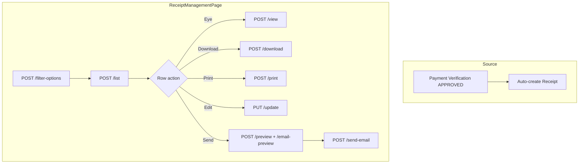

# Receipt Management — Complete API & Frontend Integration Guide

Use this document as the **single source of truth** for integrating **Finance Operations → Receipt Management** in the admin panel.

**Base path:** `/api/finance/receipt-management`  
**Auth:** Bearer token — **Read:** any authenticated user | **Write (edit/send):** Super Admin or Finance Admin  
**HTTP rule:** All reads use **POST** (never GET). Edit uses **PUT**.

**Postman:** Import `RECEIPT_MANAGEMENT_POSTMAN_COLLECTION.json` from the repo root.

Receipts are **auto-created** when offline payments are **approved** in Payment Verification. They are not created manually from this screen.

---

## Table of contents

1. [Module overview](#1-module-overview)
2. [Authentication & roles](#2-authentication--roles)
3. [Standard response format](#3-standard-response-format)
4. [API summary](#4-api-summary)
5. [Page layout → API mapping](#5-page-layout--api-mapping)
6. [Step-by-step frontend flows](#6-step-by-step-frontend-flows)
7. [API 1 — Filter options](#7-api-1--filter-options)
8. [API 2 — List receipts (main table)](#8-api-2--list-receipts-main-table)
9. [API 3 — View receipt (detail modal)](#9-api-3--view-receipt-detail-modal)
10. [API 4 — Preview receipt (no audit)](#10-api-4--preview-receipt-no-audit)
11. [API 5 — Download PDF](#11-api-5--download-pdf)
12. [API 6 — Print receipt](#12-api-6--print-receipt)
13. [API 7 — Edit receipt](#13-api-7--edit-receipt)
14. [API 8 — Send receipt (Email / WhatsApp / SMS)](#14-api-8--send-receipt-email--whatsapp--sms)
15. [Edit modal dropdown APIs](#15-edit-modal-dropdown-apis)
16. [Batch dropdown (Edit modal)](#16-batch-dropdown-edit-modal)
17. [Status badges & communication icons](#17-status-badges--communication-icons)
18. [TypeScript interfaces](#18-typescript-interfaces)
19. [Recommended file structure](#19-recommended-file-structure)
20. [Error handling](#20-error-handling)
21. [Common mistakes to avoid](#21-common-mistakes-to-avoid)
22. [Testing checklist](#22-testing-checklist)

---

## 1. Module overview



| UI screen | APIs |
|-----------|------|
| Receipt Management table + filters | `/filter-options`, `/list` |
| Tax Invoice / Fee Receipt modal (View) | `/view` or `/preview` |
| Print / Download buttons | `/print`, `/download` |
| Edit Receipt modal | `/courses/list`, `/payment-modes/list`, `/receipt-statuses/list`, `PUT /update` |
| Send receipt modal | `/preview`, `/email-preview`, `/send-email` |

---

## 2. Authentication & roles

```http
Authorization: Bearer <token>
Content-Type: application/json
```

### Login

```http
POST /api/auth/login-super-admin
Content-Type: application/json

{
  "email": "admin@sriramias.com",
  "password": "your-password"
}
```

| Action | Who |
|--------|-----|
| List, view, preview, download, print, filter options | Any authenticated user |
| Edit receipt, send email | Super Admin / Finance Admin |

---

## 3. Standard response format

### Success

```json
{
  "success": true,
  "statusCode": 10000,
  "message": "Receipts fetched successfully",
  "data": { },
  "error": null
}
```

### Validation error (400)

```json
{
  "success": false,
  "message": "Validation error",
  "errors": ["\"receiptId\" is required"]
}
```

---

## 4. API summary

| # | UI trigger | Method | Endpoint |
|---|------------|--------|----------|
| 1 | Page load — filters | POST | `/filter-options` |
| 2 | Table + search/filters | POST | `/list` |
| 3 | Eye icon — View modal | POST | `/view` |
| 4 | Send modal left panel / resend preview | POST | `/preview` |
| 5 | Download icon / Download PDF button | POST | `/download` |
| 6 | Print button | POST | `/print` |
| 7 | Edit icon → Save | PUT | `/update` |
| 8 | Send modal — load email defaults | POST | `/email-preview` |
| 9 | Send modal — Send Receipt (Email tab) | POST | `/send-email` |
| 10 | Send modal — WhatsApp tab | POST | `/send-whatsapp` (Coming Soon) |
| 11 | Send modal — SMS tab | POST | `/send-sms` (Coming Soon) |
| 12 | Edit modal — Course dropdown | POST | `/courses/list` |
| 13 | Edit modal — Payment mode dropdown | POST | `/payment-modes/list` |
| 14 | Edit modal — Status dropdown | POST | `/receipt-statuses/list` |
| 15 | Admin backfill (optional) | POST | `/sync-missing` |

---

## 5. Page layout → API mapping

Based on your UI screenshots:

### Top filter bar

| UI control | API field | Endpoint |
|------------|-----------|----------|
| Search "Receipt #, invoice #, student..." | `search` | `/list` |
| Course dropdown | `courseId` | `/list` — options from `/filter-options` |
| Payment Type dropdown | `paymentType` | `/list` |
| Branch dropdown | `branchId` or `centerId` | `/list` |
| Status dropdown | `receiptStatus` | `/list` |
| Center dropdown | `centerId` | `/list` |
| Date From / To | `dateFrom`, `dateTo` | `/list` |

### Main table columns

| Column | API field |
|--------|-----------|
| Checkbox | `receiptId` (Mongo `_id`) for bulk actions |
| RECEIPT # | `receiptNumber` (blue link → open view) |
| INVOICE # | `invoiceNumber` |
| STUDENT | `studentName` + `mobile` |
| BRANCH | `branch` or `branchCode` (badge e.g. DEL) |
| COURSE | `course` |
| PAYMENT MODE | `paymentMode` |
| GST | `gst` → format `₹{gst.toLocaleString('en-IN')}` |
| TOTAL | `total` → format as currency |
| STATUS | `status` / `receiptStatus` |
| GENERATED | `generatedLabel` |
| COMMUNICATION — WhatsApp | `communication.whatsapp.sent` + `enabled` |
| COMMUNICATION — SMS | `communication.sms.sent` + `enabled` |
| COMMUNICATION — Email | `communication.email.sent` + `enabled` |
| ACTIONS — Eye | → `POST /view` |
| ACTIONS — Download | → `POST /download` |
| ACTIONS — Edit | → open Edit modal |
| ACTIONS — Send | → open Send modal |

### View modal — Tax Invoice / Fee Receipt

| UI element | API path (from `/view` or `/preview`) |
|------------|--------------------------------------|
| Header institute name | `institute.name` |
| Address | `institute.address` |
| Invoice # | `invoiceNumber` |
| Receipt # | `receiptNumber` |
| Date/time | `template.generatedLabel` or format `generatedAt` |
| Status badge SENT/GENERATED | `receiptStatus` |
| BILL TO — name | `student.studentName` |
| Student ID | `student.studentCode` |
| Phone | `student.mobile` |
| Email | `student.email` |
| Course | `course.courseName` |
| Mode · Branch | `course.deliveryMode` · `branch.branchCode` |
| Payment ref | `payment.transactionReference` · `payment.paymentMode` |
| Table row Description | `payment.description` or `course.courseName` |
| Table row Mode | `payment.paymentMode` |
| Table row Amount | `payment.amountPaid` |
| Base amount | `tax.baseAmount` |
| CGST | `tax.cgst` + `tax.gstPercentage/2` |
| SGST | `tax.sgst` |
| Total paid | `tax.totalAmount` or `tax.cumulativePaidAmount` |
| GSTIN footer | `institute.gstin` |
| Signature block | `branding.signatoryName`, `signature` |
| HTML render | `html` or `htmlPrint` |
| Print button | `POST /print` |
| Download button | `POST /download` |
| Resend / WhatsApp header buttons | open Send modal |

---

## 6. Step-by-step frontend flows

### Phase A — Receipt Management page opens

1. Show table skeleton.
2. Call **`POST /filter-options`** once → populate Course, Branch, Center, Payment Type, Status dropdowns.
3. Call **`POST /list`** with default filters → bind table rows + pagination.

### Phase B — User changes filters

1. Debounce search (~300ms).
2. Re-call **`POST /list`** with updated filters.
3. Do not re-call `/filter-options` unless page refresh.

### Phase C — Eye icon (View receipt modal)

1. User clicks **eye icon** on row.
2. Call **`POST /view`** with `{ "receiptId": "<row.receiptId>" }`.
3. Render modal using response (`html` iframe/div or bind fields from structured data).
4. **Note:** `/view` writes a VIEWED audit entry. Use `/preview` if you only need data without audit.

### Phase D — Download icon or Download PDF button

1. Call **`POST /download`** with `{ "receiptId": "..." }`.
2. Open `data.downloadUrl` in new tab or trigger file download using `data.fileName`.
3. Status may advance to `DOWNLOADED`.
4. Refresh list row status if open.

### Phase E — Print button

1. Call **`POST /print`** with `{ "receiptId": "..." }`.
2. Option A: Open `data.printUrl` if PDF exists.
3. Option B: Inject `data.html` into hidden iframe and call `window.print()`.

### Phase F — Edit icon (Edit Receipt modal)

Screenshot: Edit Receipt with receipt identity read-only block.

1. Pre-fill form from list row or call **`POST /preview`** for latest values.
2. On modal open, parallel load:
   - **`POST /courses/list`**
   - **`POST /payment-modes/list`**
   - **`POST /receipt-statuses/list`**
3. Load batches when course selected — see [Section 16](#16-batch-dropdown-edit-modal).
4. **Read-only block:** `receiptNumber`, `invoiceNumber` — do not send changes.
5. User clicks **Save Changes**.
6. Call **`PUT /update`** with all editable fields + mandatory **`editReason`**.
7. On success: toast, close modal, refresh list row.

### Phase G — Send icon (Send receipt modal)

Screenshot: Send receipt with WhatsApp / SMS / Email tabs.

1. Open modal with row context (`receiptId`, `studentName`, `receiptNumber`).
2. **Left panel:** Call **`POST /preview`** → render receipt preview (same as view, no audit).
3. **Right panel — Email tab (default functional channel):**
   - Call **`POST /email-preview`** → pre-fill `email`, `subject`, `message`.
   - User edits message if needed.
   - Click **Send Receipt** → **`POST /send-email`**.
4. **WhatsApp tab:** Show UI but call **`POST /send-whatsapp`** only when backend enables it. Currently returns Coming Soon — disable send button.
5. **SMS tab:** Same as WhatsApp — **`POST /send-sms`** → Coming Soon.
6. On email success: refresh list (status → SENT, email communication checkmark).

---

## 7. API 1 — Filter options

**When:** Page load (once).

```http
POST /api/finance/receipt-management/filter-options
Authorization: Bearer <token>
Content-Type: application/json

{}
```

**Response:**

```json
{
  "success": true,
  "statusCode": 10000,
  "message": "Receipt filter options fetched successfully",
  "data": {
    "courses": [
      { "_id": "674course1234567890abcdef", "courseName": "GS Mains Comprehensive" },
      { "_id": "674course2234567890abcdef", "courseName": "UPSC Prelims Foundation" }
    ],
    "branches": [
      { "_id": "674center1234567890abcdef", "branchCode": "DEL", "centerName": "Delhi Center" },
      { "_id": "674center2234567890abcdef", "branchCode": "HYD", "centerName": "Hyderabad Center" }
    ],
    "centers": [
      { "_id": "674center1234567890abcdef", "centerName": "Delhi Center", "centerCode": "DEL" }
    ],
    "paymentTypes": ["FULL_PAYMENT", "DOWN_PAYMENT", "EMI", "EMI_CLOSURE"],
    "receiptStatuses": ["GENERATED", "SENT", "DOWNLOADED", "FAILED", "CANCELLED"]
  },
  "error": null
}
```

Map `paymentTypes` to labels: Full Payment, Down Payment, EMI, EMI Closure.

---

## 8. API 2 — List receipts (main table)

**When:** Page load, filter change, pagination.

```http
POST /api/finance/receipt-management/list
Authorization: Bearer <token>
Content-Type: application/json

{
  "search": "",
  "courseId": "",
  "branchId": "",
  "centerId": "",
  "paymentType": "",
  "paymentMode": "",
  "receiptStatus": "",
  "dateFrom": "2026-06-01",
  "dateTo": "2026-06-30",
  "page": 1,
  "limit": 20,
  "sortBy": "generatedAt",
  "sortOrder": "desc",
  "syncMissing": false,
  "syncLimit": 100
}
```

| Field | Description |
|-------|-------------|
| `search` | Receipt #, invoice #, student, mobile, course, batch, transaction ref |
| `courseId` | Course Mongo `_id` |
| `branchId` / `centerId` | Center Mongo `_id` |
| `paymentType` | `FULL_PAYMENT`, `DOWN_PAYMENT`, `EMI`, `EMI_CLOSURE`, or empty |
| `paymentMode` | e.g. `UPI`, `Cash` |
| `receiptStatus` | `GENERATED`, `SENT`, `DOWNLOADED`, `FAILED`, `CANCELLED` |
| `dateFrom` / `dateTo` | Payment date range (also accepts `fromDate` / `toDate`) |
| `syncMissing` | If `true`, backfills missing receipts before listing |

**Response:**

```json
{
  "success": true,
  "statusCode": 10000,
  "message": "Receipts fetched successfully",
  "data": {
    "data": [
      {
        "receiptId": "674receipt1234567890abcdef",
        "receiptNumber": "RCP-2026-0005",
        "invoiceNumber": "INV-2026-0005",
        "studentName": "Karan Joshi",
        "mobile": "9898989898",
        "email": "karan@example.com",
        "branch": "DEL",
        "branchCode": "DEL",
        "course": "GS Mains Comprehensive",
        "courseId": "674course1234567890abcdef",
        "paymentMode": "UPI",
        "paymentType": "EMI",
        "gst": 11441,
        "total": 75000,
        "amountPaid": 75000,
        "status": "SENT",
        "receiptStatus": "SENT",
        "generatedAt": "2026-06-27T12:29:00.000Z",
        "generatedLabel": "5:59 pm, 27 Jun 2026",
        "communication": {
          "whatsapp": { "sent": false, "enabled": false, "message": "Coming Soon" },
          "sms": { "sent": false, "enabled": false, "message": "Coming Soon" },
          "email": { "sent": true, "enabled": true }
        },
        "centerId": "674center1234567890abcdef",
        "batchId": "674batch1234567890abcdef",
        "batchName": "Morning Batch 2026",
        "transactionReference": "TXN-PAY-005-FINAL",
        "paymentDate": "2026-06-27T00:00:00.000Z",
        "updatedAt": "2026-06-27T12:30:00.000Z"
      },
      {
        "receiptId": "674receipt2234567890abcdef",
        "receiptNumber": "RCP-2026-0001",
        "invoiceNumber": "INV-2026-0001",
        "studentName": "Aarav Sharma",
        "mobile": "9876543210",
        "email": "aarav@example.com",
        "branch": "DEL",
        "branchCode": "DEL",
        "course": "UPSC Prelims Foundation",
        "courseId": "674course2234567890abcdef",
        "paymentMode": "UPI",
        "paymentType": "FULL_PAYMENT",
        "gst": 6864,
        "total": 45000,
        "amountPaid": 45000,
        "status": "GENERATED",
        "receiptStatus": "GENERATED",
        "generatedLabel": "10:22 am, 27 Jun 2026",
        "communication": {
          "whatsapp": { "sent": false, "enabled": false, "message": "Coming Soon" },
          "sms": { "sent": false, "enabled": false, "message": "Coming Soon" },
          "email": { "sent": false, "enabled": true }
        },
        "batchId": "674batch2234567890abcdef",
        "batchName": "Evening Batch 2026",
        "transactionReference": "TXN-PAY-001",
        "paymentDate": "2026-06-27T00:00:00.000Z"
      }
    ],
    "count": 2,
    "total": 30,
    "page": 1,
    "limit": 20,
    "totalPages": 2
  },
  "error": null
}
```

**Pagination:** Bind `data.total`, `data.page`, `data.limit`, `data.totalPages`. Rows are in **`data.data`** (nested array).

---

## 9. API 3 — View receipt (detail modal)

**When:** Eye icon — writes VIEWED audit.

```http
POST /api/finance/receipt-management/view
Authorization: Bearer <token>
Content-Type: application/json

{
  "receiptId": "674receipt1234567890abcdef"
}
```

**Response:**

```json
{
  "success": true,
  "statusCode": 10000,
  "message": "Receipt fetched successfully",
  "data": {
    "receiptId": "674receipt1234567890abcdef",
    "receiptDocumentId": "RCPT000005",
    "receiptNumber": "RCP-2026-0005",
    "invoiceNumber": "INV-2026-0005",
    "student": {
      "studentId": "674student1234567890abcdef",
      "studentName": "Karan Joshi",
      "studentCode": "STU-24005",
      "mobile": "9898989898",
      "email": "karan@example.com"
    },
    "institute": {
      "name": "Sriram IAS",
      "address": "Delhi Center, India",
      "gstin": "29ABCDEDLHFIZ5",
      "logoUrl": "https://...",
      "financialYear": "2026"
    },
    "course": {
      "courseId": "674course1234567890abcdef",
      "courseName": "GS Mains Comprehensive",
      "batchId": "674batch1234567890abcdef",
      "batchName": "Morning Batch 2026",
      "deliveryMode": "OFFLINE"
    },
    "branch": {
      "branchId": "674center1234567890abcdef",
      "branchCode": "DEL",
      "centerId": "674center1234567890abcdef",
      "centerName": "Delhi Center"
    },
    "payment": {
      "paymentType": "EMI",
      "emiNumber": 5,
      "amountPaid": 75000,
      "paymentMode": "UPI",
      "transactionReference": "TXN-PAY-005-FINAL",
      "paymentDate": "2026-06-27T00:00:00.000Z",
      "paymentStatus": "PAID",
      "description": "GS Mains Comprehensive"
    },
    "tax": {
      "gstPercentage": 18,
      "gstRateLabel": "18%",
      "showTaxRows": true,
      "baseAmount": 63559,
      "cgst": 5721,
      "sgst": 5720,
      "gstAmount": 11441,
      "totalAmount": 75000,
      "cumulativePaidAmount": 150000
    },
    "branding": {
      "footerNotes": "Thank you for your payment.",
      "termsAndConditions": "Fees once paid are non-refundable except as per institute policy.",
      "signatoryName": "Finance Manager",
      "signatoryDesignation": "Authorized Signatory",
      "signatureImageUrl": "",
      "pdfWatermarkEnabled": true
    },
    "receiptStatus": "SENT",
    "remarks": "",
    "generatedAt": "2026-06-27T12:29:00.000Z",
    "pdfUrl": "https://res.cloudinary.com/.../receipt_RCP-2026-0005.pdf",
    "watermark": "Sriram IAS",
    "signature": {
      "studentLabel": "Student / Parent",
      "financeLabel": "Finance Manager",
      "financeSubLabel": "Authorized Signatory",
      "signedAt": "2026-06-27T12:29:00.000Z"
    },
    "html": "<!DOCTYPE html>...",
    "htmlPrint": "<!DOCTYPE html>..."
  },
  "error": null
}
```

Use `html` for on-screen preview; `htmlPrint` for print stylesheet.

---

## 10. API 4 — Preview receipt (no audit)

**When:** Send receipt modal left panel, or refresh preview after edit without logging VIEWED.

```http
POST /api/finance/receipt-management/preview
Authorization: Bearer <token>
Content-Type: application/json

{
  "receiptId": "674receipt1234567890abcdef"
}
```

**Response:** Same shape as [API 3](#9-api-3--view-receipt-detail-modal) — does **not** write VIEWED audit.

---

## 11. API 5 — Download PDF

**When:** Download icon in table or Download button in view/send modal.

```http
POST /api/finance/receipt-management/download
Authorization: Bearer <token>
Content-Type: application/json

{
  "receiptId": "674receipt1234567890abcdef"
}
```

**Response:**

```json
{
  "success": true,
  "statusCode": 10000,
  "message": "Receipt download link generated successfully",
  "data": {
    "receiptId": "674receipt1234567890abcdef",
    "receiptNumber": "RCP-2026-0005",
    "downloadUrl": "https://res.cloudinary.com/.../receipt_RCP-2026-0005.pdf",
    "fileName": "receipt_RCP-2026-0005.pdf",
    "receipt": { }
  },
  "error": null
}
```

- Regenerates PDF if needed.
- Status advances to `DOWNLOADED` (never downgrades from higher status).
- Frontend: `window.open(downloadUrl)` or `<a download href={downloadUrl}>`.

---

## 12. API 6 — Print receipt

**When:** Print button in view or send modal.

```http
POST /api/finance/receipt-management/print
Authorization: Bearer <token>
Content-Type: application/json

{
  "receiptId": "674receipt1234567890abcdef"
}
```

**Response:**

```json
{
  "success": true,
  "statusCode": 10000,
  "message": "Receipt print data fetched successfully",
  "data": {
    "receiptId": "674receipt1234567890abcdef",
    "printUrl": "https://res.cloudinary.com/.../receipt_RCP-2026-0005.pdf",
    "html": "<!DOCTYPE html>...",
    "receipt": { }
  },
  "error": null
}
```

Writes PRINTED audit. Prefer `html` + iframe print if `printUrl` is null.

---

## 13. API 7 — Edit receipt

**When:** Edit Receipt modal → Save Changes.

Screenshot fields: Student name, Course, Batch, Payment date, Payment mode, Amount paid, Reference, Receipt status, Remarks, Edit reason.

```http
PUT /api/finance/receipt-management/update
Authorization: Bearer <token>
Content-Type: application/json

{
  "receiptId": "674receipt1234567890abcdef",
  "studentName": "Karan Joshi",
  "courseId": "674course1234567890abcdef",
  "batchId": "674batch1234567890abcdef",
  "paymentDate": "2026-06-27",
  "paymentMode": "UPI",
  "amountPaid": 75000,
  "transactionReference": "TXN-PAY-005-FINAL",
  "receiptStatus": "SENT",
  "remarks": "Optional internal notes",
  "editReason": "Corrected payment mode per finance team verification"
}
```

| Field | Required | Editable |
|-------|----------|----------|
| `receiptId` | Yes | — |
| `editReason` | Yes | Audit trail (min 3 chars) |
| `studentName` | No | Yes |
| `courseId` | No | Yes |
| `batchId` | No | Yes |
| `paymentDate` | No | Yes |
| `paymentMode` | No | Yes |
| `amountPaid` | No | Yes — recalculates GST from center settings |
| `transactionReference` | No | Yes |
| `receiptStatus` | No | Yes |
| `remarks` | No | Yes |
| `receiptNumber` | — | **No** |
| `invoiceNumber` | — | **No** |

**Response:** Full receipt view payload (same as `/view` data shape) with updated values.

**After edit:** PDF is invalidated — next download regenerates PDF.

---

## 14. API 8 — Send receipt (Email / WhatsApp / SMS)

### 14a — Email preview

**When:** Send modal opens on Email tab.

```http
POST /api/finance/receipt-management/email-preview
Authorization: Bearer <token>
Content-Type: application/json

{
  "receiptId": "674receipt1234567890abcdef"
}
```

**Response:**

```json
{
  "success": true,
  "statusCode": 10000,
  "message": "Receipt email preview fetched successfully",
  "data": {
    "receiptId": "674receipt1234567890abcdef",
    "email": "karan@example.com",
    "subject": "Payment Receipt - RCP-2026-0005",
    "message": "Dear Karan Joshi,\n\nYour payment has been received successfully.\n\nCourse: GS Mains Comprehensive\nAmount: ₹75,000\nReceipt Number: RCP-2026-0005\n...",
    "attachmentName": "receipt_RCP-2026-0005.pdf"
  },
  "error": null
}
```

### 14b — Send email

**When:** Send Receipt button (Email tab).

```http
POST /api/finance/receipt-management/send-email
Authorization: Bearer <token>
Content-Type: application/json

{
  "receiptId": "674receipt1234567890abcdef",
  "email": "karan@example.com",
  "subject": "Payment Receipt - RCP-2026-0005",
  "message": "Dear Karan Joshi, Your payment for GS Mains Comprehensive has been successfully completed..."
}
```

**Response:**

```json
{
  "success": true,
  "statusCode": 10000,
  "message": "Receipt email sent successfully",
  "data": {
    "receiptId": "674receipt1234567890abcdef",
    "email": "karan@example.com",
    "status": "SENT",
    "receiptStatus": "SENT"
  },
  "error": null
}
```

- Attaches PDF automatically.
- Updates receipt status to `SENT` if allowed.
- Refresh list communication column (`communication.email.sent = true`).

### 14c — WhatsApp (Coming Soon)

```http
POST /api/finance/receipt-management/send-whatsapp
Content-Type: application/json

{
  "receiptId": "674receipt1234567890abcdef",
  "mobile": "9898989898",
  "message": "Dear Karan, your payment..."
}
```

**Response:**

```json
{
  "success": true,
  "statusCode": 10000,
  "message": "Coming Soon",
  "data": {
    "enabled": false,
    "message": "Coming Soon"
  },
  "error": null
}
```

Show WhatsApp tab UI but **disable send** until `enabled: true`.

### 14d — SMS (Coming Soon)

Same as WhatsApp — `POST /send-sms` returns `{ enabled: false, message: "Coming Soon" }`.

### Send modal tab behavior

| Tab | Input field | API on send |
|-----|-------------|-------------|
| WhatsApp | Mobile number | `/send-whatsapp` (disabled) |
| SMS | Mobile number | `/send-sms` (disabled) |
| Email | Email ID | `/send-email` |

Switching tabs should swap the contact input label (Mobile vs Email).

---

## 15. Edit modal dropdown APIs

### Courses

```http
POST /api/finance/receipt-management/courses/list
Content-Type: application/json

{
  "search": "",
  "centerId": "",
  "page": 1,
  "limit": 100
}
```

**Response:**

```json
{
  "success": true,
  "data": {
    "courses": [
      {
        "_id": "674course1234567890abcdef",
        "courseId": "674course1234567890abcdef",
        "courseName": "GS Mains Comprehensive",
        "label": "GS Mains Comprehensive",
        "centerId": "674center1234567890abcdef"
      }
    ],
    "total": 1,
    "page": 1,
    "limit": 100
  }
}
```

### Payment modes

```http
POST /api/finance/receipt-management/payment-modes/list
Content-Type: application/json

{
  "search": "",
  "category": ""
}
```

**Response:**

```json
{
  "success": true,
  "data": {
    "paymentModes": [
      {
        "paymentModeId": "PM004",
        "paymentModeName": "UPI",
        "label": "UPI",
        "value": "UPI",
        "category": "ONLINE",
        "icon": "upi"
      },
      {
        "paymentModeId": "PM001",
        "paymentModeName": "Offline Cash",
        "label": "Offline Cash",
        "value": "Offline Cash",
        "category": "OFFLINE",
        "icon": "cash"
      }
    ]
  }
}
```

Send `paymentModeName` / `value` in `PUT /update` → `paymentMode`.

### Receipt statuses

```http
POST /api/finance/receipt-management/receipt-statuses/list
Content-Type: application/json

{}
```

**Response:**

```json
{
  "success": true,
  "data": {
    "statuses": [
      { "value": "GENERATED", "label": "Generated" },
      { "value": "SENT", "label": "Sent" },
      { "value": "DOWNLOADED", "label": "Downloaded" },
      { "value": "FAILED", "label": "Failed" },
      { "value": "CANCELLED", "label": "Cancelled" }
    ]
  }
}
```

---

## 16. Batch dropdown (Edit modal)

There is **no dedicated batch list API** in receipt-management. When user changes **Course** in Edit modal:

```http
POST /api/finance/payment-verification/batches-by-course
Content-Type: application/json

{
  "courseId": "<selected courseId>"
}
```

**Response:**

```json
{
  "success": true,
  "data": {
    "count": 1,
    "items": [
      {
        "_id": "674batch1234567890abcdef",
        "batchId": "BAT001",
        "batchName": "Morning Batch 2026",
        "courseId": "674course1234567890abcdef",
        "status": "ACTIVE"
      }
    ]
  }
}
```

Pre-select `batchId` from list row or preview response when opening Edit modal.

---

## 17. Status badges & communication icons

### Receipt status badges

| `receiptStatus` | Label | Suggested color |
|-----------------|-------|-----------------|
| `GENERATED` | Generated | Grey |
| `SENT` | Sent | Light blue |
| `DOWNLOADED` | Downloaded | Blue |
| `FAILED` | Failed | Red |
| `CANCELLED` | Cancelled | Dark grey |

Status **never auto-downgrades** (e.g. SENT stays SENT after download).

### Communication column

```typescript
const showCheck = (channel: { sent: boolean; enabled: boolean }) =>
  channel.enabled && channel.sent;

const showDash = (channel: { sent: boolean; enabled: boolean }) =>
  !channel.sent;

const showDisabled = (channel: { enabled: boolean }) =>
  !channel.enabled; // WhatsApp/SMS — show dash + tooltip "Coming Soon"
```

---

## 18. TypeScript interfaces

```typescript
export interface ReceiptListRow {
  receiptId: string;
  receiptNumber: string;
  invoiceNumber: string;
  studentName: string;
  mobile: string;
  email: string;
  branch: string;
  branchCode: string;
  course: string;
  courseId: string;
  paymentMode: string;
  paymentType: string;
  gst: number;
  total: number;
  amountPaid: number;
  status: string;
  receiptStatus: string;
  generatedLabel: string;
  communication: {
    whatsapp: { sent: boolean; enabled: boolean; message?: string };
    sms: { sent: boolean; enabled: boolean; message?: string };
    email: { sent: boolean; enabled: boolean };
  };
  batchId?: string;
  batchName?: string;
  transactionReference?: string;
  paymentDate?: string;
}

export interface ReceiptViewPayload {
  receiptId: string;
  receiptNumber: string;
  invoiceNumber: string;
  receiptStatus: string;
  student: {
    studentName: string;
    studentCode: string;
    mobile: string;
    email: string;
  };
  institute: {
    name: string;
    address: string;
    gstin: string;
    logoUrl: string;
    financialYear: string;
  };
  course: {
    courseName: string;
    batchName: string;
    deliveryMode: string;
  };
  branch: {
    branchCode: string;
    centerName: string;
  };
  payment: {
    amountPaid: number;
    paymentMode: string;
    transactionReference: string;
    paymentDate: string;
    paymentType: string;
    description: string;
  };
  tax: {
    baseAmount: number;
    cgst: number;
    sgst: number;
    gstAmount: number;
    totalAmount: number;
    gstRateLabel: string;
    showTaxRows: boolean;
    cumulativePaidAmount?: number;
  };
  html: string;
  htmlPrint: string;
  pdfUrl: string;
}

export interface UpdateReceiptPayload {
  receiptId: string;
  editReason: string;
  studentName?: string;
  courseId?: string;
  batchId?: string;
  paymentDate?: string;
  paymentMode?: string;
  amountPaid?: number;
  transactionReference?: string;
  receiptStatus?: string;
  remarks?: string;
}

export interface SendEmailPayload {
  receiptId: string;
  email: string;
  subject?: string;
  message?: string;
}
```

### Example service

```typescript
const BASE = '/api/finance/receipt-management';

export const fetchReceiptFilterOptions = () =>
  axios.post(`${BASE}/filter-options`, {});

export const fetchReceiptList = (filters: Record<string, unknown>) =>
  axios.post(`${BASE}/list`, filters);

export const viewReceipt = (receiptId: string) =>
  axios.post(`${BASE}/view`, { receiptId });

export const previewReceipt = (receiptId: string) =>
  axios.post(`${BASE}/preview`, { receiptId });

export const downloadReceipt = (receiptId: string) =>
  axios.post(`${BASE}/download`, { receiptId });

export const printReceipt = (receiptId: string) =>
  axios.post(`${BASE}/print`, { receiptId });

export const updateReceipt = (payload: UpdateReceiptPayload) =>
  axios.put(`${BASE}/update`, payload);

export const emailPreview = (receiptId: string) =>
  axios.post(`${BASE}/email-preview`, { receiptId });

export const sendReceiptEmail = (payload: SendEmailPayload) =>
  axios.post(`${BASE}/send-email`, payload);
```

---

## 19. Recommended file structure

```
services/receiptManagement.service.ts
hooks/useReceiptList.ts
hooks/useReceiptDetail.ts
hooks/useReceiptSend.ts
hooks/useReceiptEdit.ts
components/finance/receipts/ReceiptManagementTable.tsx
components/finance/receipts/ReceiptFilters.tsx
components/finance/receipts/ReceiptViewModal.tsx
components/finance/receipts/ReceiptEditModal.tsx
components/finance/receipts/ReceiptSendModal.tsx
types/receiptManagement.types.ts
utils/receiptStatusBadges.ts
```

---

## 20. Error handling

| Scenario | HTTP | Frontend action |
|----------|------|-----------------|
| Not authenticated | 401 | Redirect to login |
| Edit/send without admin role | 403 | Hide buttons |
| Invalid receiptId | 400 | Toast validation error |
| Receipt not found | 404 | Toast + close modal |
| Edit without editReason | 400 | Highlight edit reason field |
| No changes on edit | 400 | Toast "No changes detected" |
| Email not configured | 503 | Toast on send-email |
| WhatsApp/SMS | 200 + Coming Soon | Disable send, show tooltip |

---

## 21. Common mistakes to avoid

1. **Using GET for list/view** — all reads are POST except none; everything is POST.
2. **Wrong list path** — rows are in `data.data`, not `data.items`.
3. **Using `/view` for send preview** — use `/preview` to avoid extra VIEWED audits.
4. **Forgetting `editReason`** — mandatory on every edit.
5. **Trying to edit receipt/invoice numbers** — read-only in UI and API.
6. **Enabling WhatsApp/SMS send** — only Email works today.
7. **Not refreshing list after send/download** — status and communication icons change.
8. **Missing batch dropdown API** — use payment-verification `batches-by-course`.

---

## 22. Testing checklist

- [ ] Page load: filter-options + list populate table
- [ ] Search by receipt #, student name, invoice #
- [ ] Filter by course, branch, status, date range
- [ ] View modal renders HTML or structured fields
- [ ] Download opens PDF URL; status → DOWNLOADED
- [ ] Print opens print dialog
- [ ] Edit modal loads dropdowns; save with editReason works
- [ ] Amount edit recalculates GST in preview
- [ ] Send modal: preview left, email-preview right
- [ ] Send email updates status to SENT + email checkmark
- [ ] WhatsApp/SMS tabs show Coming Soon
- [ ] Communication column matches sent state
- [ ] Pagination works with `page` / `limit`

---

## Quick reference

| User action | API |
|-------------|-----|
| Open Receipt Management | `POST /filter-options` + `POST /list` |
| View (eye) | `POST /view` |
| Download | `POST /download` |
| Print | `POST /print` |
| Edit → Save | `PUT /update` |
| Send → Email | `POST /email-preview` → `POST /send-email` |
| Send modal preview | `POST /preview` |

**Receipt source:** Auto-created on Payment Verification **approve** — see `PAYMENT_VERIFICATION_CENTER_API_GUIDE.md`.
