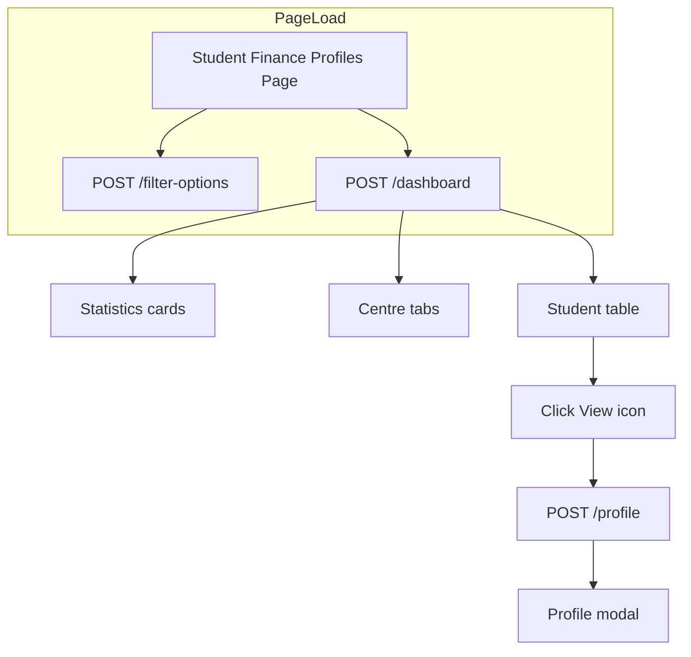

# Student Finance Profiles — Complete API & Frontend Integration Guide

Use this document as the **single source of truth** for integrating the **Finance → Student Finance Profiles** screen in the admin panel.

**Base path:** `/api/finance/student-finance`  
**Auth:** Bearer token — **Super Admin** or **Finance Admin** only  
**HTTP rule:** All read APIs use **POST** (never GET)

---

## Table of contents

1. [Module overview](#1-module-overview)
2. [Authentication](#2-authentication)
3. [Standard response format](#3-standard-response-format)
4. [API summary](#4-api-summary)
5. [API 1 — Filter options](#5-api-1--filter-options)
6. [API 2 — Dashboard (list + stats)](#6-api-2--dashboard-list--stats)
7. [API 3 — Student profile (modal)](#7-api-3--student-profile-modal)
8. [Enums & badge mapping](#8-enums--badge-mapping)
9. [Amount calculation rules (important)](#9-amount-calculation-rules-important)
10. [Frontend integration — step by step](#10-frontend-integration--step-by-step)
11. [UI field mapping (screenshot → API)](#11-ui-field-mapping-screenshot--api)
12. [TypeScript interfaces](#12-typescript-interfaces)
13. [Example API calls](#13-example-api-calls)
14. [Error handling](#14-error-handling)
15. [Common mistakes to avoid](#15-common-mistakes-to-avoid)
16. [Testing checklist](#16-testing-checklist)

---

## 1. Module overview

**Purpose:** Show a finance dashboard of all students with payment summaries, filters, risk scores, and a detail modal per student.

**Data source:** Primarily `StudentPaymentTransaction` records, enriched with EMI plans/installments and enrollment metadata.



**There are exactly 3 APIs.** No create/update/delete APIs in this module.

---

## 2. Authentication

Every request must include:

```http
Authorization: Bearer <token>
Content-Type: application/json
```

### Login (get token)

```http
POST /api/auth/login-super-admin
Content-Type: application/json

{
  "email": "admin@sriram.com",
  "password": "admin123"
}
```

**Response (typical):**

```json
{
  "success": true,
  "token": "eyJhbGciOiJIUzI1NiIsInR5cCI6IkpXVCJ9..."
}
```

Store `token` and send it on all Student Finance Profiles requests.

**403 if wrong role:** Only Super Admin and Finance Admin can access this module.

---

## 3. Standard response format

### Success

```json
{
  "success": true,
  "statusCode": 10000,
  "message": "Student finance profiles fetched successfully",
  "data": { },
  "error": null
}
```

Always read **`data`** for the payload. Ignore wrapping fields for UI binding except `success` for error checks.

### Validation error (400)

```json
{
  "success": false,
  "statusCode": 11000,
  "message": "Validation failed",
  "data": null,
  "error": {
    "errors": ["\"studentId\" is required"]
  }
}
```

### Not found (404)

```json
{
  "success": false,
  "message": "Student not found",
  "error": "Student not found"
}
```

---

## 4. API summary

| # | Method | Path | When to call |
|---|--------|------|--------------|
| 1 | POST | `/filter-options` | Once on page load — populate dropdown filters |
| 2 | POST | `/dashboard` | On load, filter change, search, pagination, sort, centre tab change |
| 3 | POST | `/profile` | When user clicks **View** (eye icon) on a table row |

---

## 5. API 1 — Filter options

### Request

```http
POST /api/finance/student-finance/filter-options
Authorization: Bearer {{token}}
Content-Type: application/json

{}
```

**Body:** empty object `{}` (required — do not use GET).

### Response

```json
{
  "success": true,
  "statusCode": 10000,
  "message": "Student finance filter options fetched successfully",
  "data": {
    "courses": [
      { "courseId": "64a1b2c3d4e5f6789012345", "courseName": "UPSC Prelims Foundation" },
      { "courseId": "64a1b2c3d4e5f6789012346", "courseName": "GS Mains Comprehensive" }
    ],
    "sources": [
      { "label": "Website", "value": "Website" },
      { "label": "Counselor", "value": "Counselor" },
      { "label": "Referral", "value": "Referral" },
      { "label": "Offline Center", "value": "Offline Center" }
    ],
    "loanStatuses": [
      { "label": "Not Applied", "value": "Not Applied" },
      { "label": "Applied", "value": "Applied" },
      { "label": "Under Review", "value": "Under Review" },
      { "label": "Approved", "value": "Approved" },
      { "label": "Rejected", "value": "Rejected" },
      { "label": "Disbursed", "value": "Disbursed" },
      { "label": "EMI Active", "value": "EMI Active" },
      { "label": "Closed", "value": "Closed" }
    ],
    "paymentStatuses": [
      { "label": "Paid", "value": "Paid" },
      { "label": "Partial", "value": "Partial" },
      { "label": "Pending", "value": "Pending" },
      { "label": "EMI Running", "value": "EMI Running" }
    ],
    "centres": [
      { "centreId": "6a240c46687eddba52c0cfcb", "centreName": "New Delhi" },
      { "centreId": "6a23e7f6687eddba52c0cfb6", "centreName": "HYDERABAD" }
    ]
  },
  "error": null
}
```

### Frontend usage

| UI control | Bind to |
|------------|---------|
| **All courses** dropdown | `data.courses` — value = `courseId`, label = `courseName` |
| **All sources** dropdown | `data.sources` — value = `value` |
| **All loan statuses** dropdown | `data.loanStatuses` — value = `value` |
| **All statuses** (payment) dropdown | `data.paymentStatuses` — value = `value` |

**Note:** Centre tabs on the dashboard come from **`/dashboard`** response (`data.centres`), not from filter-options. Filter-options `centres` is optional backup only.

---

## 6. API 2 — Dashboard (list + stats)

### Request

```http
POST /api/finance/student-finance/dashboard
Authorization: Bearer {{token}}
Content-Type: application/json
```

```json
{
  "page": 1,
  "limit": 10,
  "search": "",
  "centreId": "",
  "courseId": "",
  "source": "",
  "loanStatus": "",
  "paymentStatus": "",
  "fromDate": "",
  "toDate": "",
  "sortBy": "lastUpdated",
  "sortOrder": "desc"
}
```

### Request fields

| Field | Type | Default | Description |
|-------|------|---------|-------------|
| `page` | number | `1` | Page number (min 1) |
| `limit` | number | `10` | Rows per page (1–100) |
| `search` | string | `""` | Search student name, student ID, course, email, mobile |
| `centreId` | ObjectId string | `""` | Filter by centre. Empty = all centres |
| `courseId` | ObjectId string | `""` | Filter by course. Empty = all courses |
| `source` | string | `""` | One of: `Website`, `Counselor`, `Referral`, `Offline Center` |
| `loanStatus` | string | `""` | One of loan status enum values |
| `paymentStatus` | string | `""` | One of: `Paid`, `Partial`, `Pending`, `EMI Running` |
| `fromDate` | ISO date | `""` | Filter transactions updated on/after this date |
| `toDate` | ISO date | `""` | Filter transactions updated on/before end of this date |
| `sortBy` | string | `lastUpdated` | `lastUpdated` \| `studentName` \| `pendingAmount` \| `riskScore` |
| `sortOrder` | string | `desc` | `asc` or `desc` (case insensitive) |

**Send empty string `""` or omit optional filters for "All".**

### Response

```json
{
  "success": true,
  "statusCode": 10000,
  "message": "Student finance profiles fetched successfully",
  "data": {
    "statistics": {
      "totalProfiles": 5,
      "totalCollected": 175000,
      "totalPending": 100000,
      "averageRiskScore": 46
    },
    "centres": [
      { "centreId": "", "centreName": "All Centres" },
      { "centreId": "6a240c46687eddba52c0cfcb", "centreName": "New Delhi" },
      { "centreId": "6a23e7f6687eddba52c0cfb6", "centreName": "HYDERABAD" },
      { "centreId": "6a23e824687eddba52c0cfb7", "centreName": "PUNE" }
    ],
    "table": {
      "page": 1,
      "limit": 10,
      "totalCount": 5,
      "totalPages": 1,
      "items": [
        {
          "studentId": "STU24001",
          "studentName": "Aarav Sharma",
          "profileImage": "",
          "course": "UPSC Prelims Foundation",
          "source": "Counselor",
          "totalFees": 45000,
          "paidAmount": 45000,
          "pendingAmount": 0,
          "emiStatus": "-",
          "loanStatus": "Not Applied",
          "wallet": 0,
          "riskScore": 20,
          "updatedAt": "2026-06-22T12:29:00.000Z"
        },
        {
          "studentId": "STU24002",
          "studentName": "Neha Verma",
          "profileImage": "",
          "course": "GS Mains Comprehensive",
          "source": "Referral",
          "totalFees": 75000,
          "paidAmount": 30000,
          "pendingAmount": 45000,
          "emiStatus": "EMI Running",
          "loanStatus": "EMI Active",
          "wallet": 0,
          "riskScore": 70,
          "updatedAt": "2026-06-22T12:29:00.000Z"
        }
      ]
    }
  },
  "error": null
}
```

### Response field reference

#### `statistics` (top KPI cards)

| UI label | API field | Format |
|----------|-----------|--------|
| Total profiles | `statistics.totalProfiles` | Integer count |
| Total collected | `statistics.totalCollected` | Number (₹) — sum of `paidAmount` |
| Total pending | `statistics.totalPending` | Number (₹) — sum of `pendingAmount` |
| Avg risk score | `statistics.averageRiskScore` | Integer 0–100 |

**Important:** Statistics are recalculated **after** all filters (including source, loan, payment status) are applied. When user changes any filter, stats and table both refresh from one `/dashboard` call.

#### `centres` (centre tab buttons)

| Field | Usage |
|-------|-------|
| `centreId: ""` | **All Centres** tab — send this as `centreId: ""` in dashboard request |
| `centreId: "<ObjectId>"` | Specific centre tab — send that ID in dashboard request |
| `centreName` | Tab label |

#### `table.items[]` (each row)

| UI column | API field | Notes |
|-----------|-----------|-------|
| Student | `studentName` | Primary text |
| (avatar) | `profileImage` | URL or empty string — show initials if empty |
| Course | `course` | Course name string |
| Source | `source` | Badge — see [Enums](#8-enums--badge-mapping) |
| Total fees | `totalFees` | Format as ₹ with Indian locale |
| Paid | `paidAmount` | |
| Pending | `pendingAmount` | |
| EMI | `emiStatus` | `"-"` or `"EMI Running"` or `"Completed"` |
| Loan | `loanStatus` | Badge text |
| Wallet | `wallet` | Always `0` today (wallet feature coming later) |
| Risk | `riskScore` | Integer 0–100 |
| Updated | `updatedAt` | ISO date — format e.g. `5:59 pm, 22 Jun 2026` |
| View action | `studentId` | **Use this value** in `/profile` request |

#### Pagination

| Field | Usage |
|-------|-------|
| `table.page` | Current page |
| `table.limit` | Page size |
| `table.totalCount` | Total rows after filters |
| `table.totalPages` | Use for pagination UI |

---

## 7. API 3 — Student profile (modal)

Opens when user clicks the **eye / view** icon on a table row.

### Request

```http
POST /api/finance/student-finance/profile
Authorization: Bearer {{token}}
Content-Type: application/json
```

```json
{
  "studentId": "STU24001"
}
```

### `studentId` — accepted formats

| Format | Example | Supported |
|--------|---------|-----------|
| Business student ID | `STU24001`, `STU-24001` | ✅ Yes (case-insensitive for lookup) |
| MongoDB ObjectId | `64a1b2c3d4e5f6789012345` | ✅ Yes |

**Use the `studentId` from the table row** (`table.items[].studentId`). Do not invent or use course/enrollment IDs.

### Response

```json
{
  "success": true,
  "statusCode": 10000,
  "message": "Student finance profile fetched successfully",
  "data": {
    "studentName": "Aarav Sharma",
    "studentId": "STU24001",
    "profileImage": "",
    "branch": "New Delhi",
    "counselor": "Priya Sharma",
    "financialHealth": "Fully Paid",
    "progress": 100,
    "cards": {
      "totalFees": 45000,
      "totalPaid": 45000,
      "pending": 0,
      "scholarship": {
        "enabled": false,
        "message": "Coming Soon"
      },
      "discount": 1350,
      "refund": 0,
      "wallet": {
        "enabled": false,
        "message": "Coming Soon"
      }
    },
    "enrollmentSource": "Counselor",
    "enrollmentDate": "2026-06-16T12:29:00.000Z"
  },
  "error": null
}
```

### Response field reference (modal UI)

#### Header

| UI | API field |
|----|-----------|
| Student name (title) | `studentName` |
| Subtitle `STU-24001 · Delhi HQ · Counselor` | `studentId` · `branch` · `enrollmentSource` |
| Avatar | `profileImage` |

#### Financial health section

| UI | API field |
|----|-----------|
| Status text ("Fully paid") | `financialHealth` — values: `Fully Paid`, `Partially Paid`, `Pending`, `EMI Running` |
| Progress bar width | `progress` (0–100) |
| Circular % badge | `progress` |

#### Summary cards (7 cards)

| Card label | API path | Notes |
|------------|----------|-------|
| Total Fees | `cards.totalFees` | Number |
| Total Paid | `cards.totalPaid` | Number |
| Pending | `cards.pending` | Number |
| Scholarship | `cards.scholarship` | **Coming Soon** — show `message`, disable interaction |
| Discount | `cards.discount` | Number |
| Refund | `cards.refund` | Number |
| Wallet | `cards.wallet` | **Coming Soon** — show `message`, disable interaction |

**Coming Soon object shape:**

```json
{
  "enabled": false,
  "message": "Coming Soon"
}
```

When `enabled === false`, grey out the card and show the message (do not call another API).

#### Enrollment source section

| UI | API field |
|----|-----------|
| Source badge | `enrollmentSource` |
| Counselor | `counselor` — may be `"—"` if unknown |
| Branch | `branch` |
| Enrollment date | `enrollmentDate` — ISO string, format on frontend |

---

## 8. Enums & badge mapping

### Source (`source` / `enrollmentSource`)

| Value | Suggested badge color (UI) |
|-------|----------------------------|
| `Counselor` | Green |
| `Referral` | Orange |
| `Offline Center` | Purple |
| `Website` | Cyan / Blue |

### EMI status (`emiStatus` — table only)

| Value | Display |
|-------|---------|
| `-` | Em dash or "—" |
| `EMI Running` | Blue badge |
| `Completed` | Green/grey badge |

### Loan status (`loanStatus` — table only)

| Value | Suggested badge |
|-------|-----------------|
| `Not Applied` | Grey |
| `Under Review` | Yellow |
| `EMI Active` | Light blue |
| `Rejected` | Red |
| `Closed` | Green |

### Payment status (filter only — not a table column)

`Paid` | `Partial` | `Pending` | `EMI Running`

### Financial health (modal only)

`Fully Paid` | `Partially Paid` | `Pending` | `EMI Running`

---

## 9. Amount calculation rules (important)

Frontend **must not** recalculate totals. Always display API numbers.

Backend logic (for debugging only):

1. **EMI students:** Amounts come from EMI plan + installments (same engine as EMI Management). Pending reflects unpaid installments, not raw transaction sums.
2. **Non-EMI students:** Amounts come from deduplicated `StudentPaymentTransaction` rows per enrollment.
3. **Risk score:** Computed from pending ratio, overdue EMI installments, and failed payments (0–100).
4. **Wallet:** Hardcoded `0` in table; profile wallet is Coming Soon.
5. **Discount:** From linked enrollment/transaction discount fields.

If dashboard shows ₹0 pending but EMI Management shows pending for same student, report to backend — do not override in UI.

---

## 10. Frontend integration — step by step

### Step 0 — Project setup

```ts
const API_BASE = process.env.NEXT_PUBLIC_API_URL; // e.g. http://localhost:5000
const FINANCE_BASE = `${API_BASE}/api/finance/student-finance`;

const authHeaders = (token: string) => ({
  Authorization: `Bearer ${token}`,
  'Content-Type': 'application/json'
});
```

---

### Step 1 — Page mount (initial load)

On `StudentFinanceProfilesPage` mount:

```
1. Ensure admin token exists (redirect to login if not)
2. Parallel requests:
   a. POST /filter-options  → store in filterOptions state
   b. POST /dashboard       → default body (page 1, limit 10, all filters empty)
3. Bind response:
   - statistics → 4 KPI cards
   - centres    → centre tab bar (first tab = All Centres)
   - table      → data table + pagination
```

**Default dashboard body for first load:**

```json
{
  "page": 1,
  "limit": 10,
  "search": "",
  "centreId": "",
  "courseId": "",
  "source": "",
  "loanStatus": "",
  "paymentStatus": "",
  "fromDate": "",
  "toDate": "",
  "sortBy": "lastUpdated",
  "sortOrder": "desc"
}
```

---

### Step 2 — Centre tabs

```
User clicks centre tab
  → set selectedCentreId = tab.centreId   // "" for All Centres
  → set page = 1
  → POST /dashboard with { ...filters, centreId: selectedCentreId, page: 1 }
  → replace statistics + table from response
```

Highlight active tab when `centreId` in request matches tab's `centreId`.

---

### Step 3 — Dropdown filters

Dropdowns populated from **Step 1 filter-options** (not from dashboard).

```
User changes course / source / loan / payment dropdown
  → update filter state
  → set page = 1
  → POST /dashboard with merged filters
```

| Dropdown | Request field | "All" value |
|----------|---------------|-------------|
| All courses | `courseId` | `""` |
| All sources | `source` | `""` |
| All loan statuses | `loanStatus` | `""` |
| All statuses | `paymentStatus` | `""` |

---

### Step 4 — Search

```
User types in search box
  → debounce 300–500ms
  → set page = 1
  → POST /dashboard with { ...filters, search: query, page: 1 }
```

Search matches: student name, student ID, course name, email, mobile.

---

### Step 5 — Date range

```
User selects from / to date
  → convert to ISO date strings (YYYY-MM-DD or full ISO)
  → set page = 1
  → POST /dashboard with { ...filters, fromDate, toDate, page: 1 }
```

Both dates optional. `toDate` includes entire day (backend uses end-of-day).

---

### Step 6 — Pagination

```
User clicks page 2 / next
  → POST /dashboard with { ...filters, page: 2 }
  → update table only (statistics also refresh — same call)
```

Show: `Showing page {table.page} of {table.totalPages} ({table.totalCount} profiles)`.

---

### Step 7 — Sorting (optional column headers)

If implementing sortable columns:

| Column | sortBy value |
|--------|--------------|
| Updated | `lastUpdated` |
| Student | `studentName` |
| Pending | `pendingAmount` |
| Risk | `riskScore` |

Toggle `sortOrder` between `asc` and `desc` on repeated clicks.

---

### Step 8 — Open profile modal

```
User clicks View (eye) on row
  → set modalOpen = true
  → set loading = true
  → POST /profile with { studentId: row.studentId }
  → bind data to modal
  → set loading = false
```

On close: clear modal state (do not cache stale profile unless intentional).

**Loading / error states:**

- Loading: skeleton inside modal
- 404: "Finance profile not found for this student"
- Network error: retry button

---

### Step 9 — Currency & date formatting

```ts
const formatInr = (amount: number) =>
  `₹${Number(amount || 0).toLocaleString('en-IN')}`;

const formatUpdated = (iso: string) =>
  new Date(iso).toLocaleString('en-IN', {
    hour: 'numeric',
    minute: '2-digit',
    hour12: true,
    day: 'numeric',
    month: 'short',
    year: 'numeric'
  });
```

---

### Step 10 — Recommended React state shape

```ts
type PageState = {
  token: string;
  loading: boolean;
  filterOptions: FilterOptions | null;
  filters: {
    search: string;
    centreId: string;
    courseId: string;
    source: string;
    loanStatus: string;
    paymentStatus: string;
    fromDate: string;
    toDate: string;
    page: number;
    limit: number;
    sortBy: 'lastUpdated' | 'studentName' | 'pendingAmount' | 'riskScore';
    sortOrder: 'asc' | 'desc';
  };
  statistics: Statistics | null;
  centres: CentreTab[];
  table: TableData | null;
  profileModal: {
    open: boolean;
    loading: boolean;
    studentId: string | null;
    data: StudentProfile | null;
    error: string | null;
  };
};
```

---

### Step 11 — Single fetch function (copy-paste ready)

```ts
async function fetchDashboard(token: string, filters: DashboardFilters) {
  const res = await fetch(`${FINANCE_BASE}/dashboard`, {
    method: 'POST',
    headers: authHeaders(token),
    body: JSON.stringify({
      page: filters.page ?? 1,
      limit: filters.limit ?? 10,
      search: filters.search ?? '',
      centreId: filters.centreId ?? '',
      courseId: filters.courseId ?? '',
      source: filters.source ?? '',
      loanStatus: filters.loanStatus ?? '',
      paymentStatus: filters.paymentStatus ?? '',
      fromDate: filters.fromDate ?? '',
      toDate: filters.toDate ?? '',
      sortBy: filters.sortBy ?? 'lastUpdated',
      sortOrder: filters.sortOrder ?? 'desc'
    })
  });
  const json = await res.json();
  if (!json.success) throw new Error(json.message || 'Dashboard fetch failed');
  return json.data;
}

async function fetchProfile(token: string, studentId: string) {
  const res = await fetch(`${FINANCE_BASE}/profile`, {
    method: 'POST',
    headers: authHeaders(token),
    body: JSON.stringify({ studentId })
  });
  const json = await res.json();
  if (!json.success) throw new Error(json.message || 'Profile fetch failed');
  return json.data;
}

async function fetchFilterOptions(token: string) {
  const res = await fetch(`${FINANCE_BASE}/filter-options`, {
    method: 'POST',
    headers: authHeaders(token),
    body: JSON.stringify({})
  });
  const json = await res.json();
  if (!json.success) throw new Error(json.message || 'Filter options failed');
  return json.data;
}
```

---

## 11. UI field mapping (screenshot → API)

### Dashboard page

```
┌─────────────────────────────────────────────────────────────┐
│  Total profiles          → statistics.totalProfiles         │
│  Total collected         → statistics.totalCollected        │
│  Total pending           → statistics.totalPending          │
│  Avg risk score          → statistics.averageRiskScore      │
├─────────────────────────────────────────────────────────────┤
│  [All Centres][Delhi]... → centres[].centreName             │
│                            active = request.centreId match  │
├─────────────────────────────────────────────────────────────┤
│  Search input            → request.search                   │
│  Course dropdown         → request.courseId                 │
│  Source dropdown         → request.source                   │
│  Loan dropdown           → request.loanStatus               │
│  Status dropdown         → request.paymentStatus            │
│  Date from / to          → request.fromDate / toDate        │
├─────────────────────────────────────────────────────────────┤
│  Table rows              → table.items[]                    │
│  Pagination              → table.page, totalPages, totalCount│
│  Eye icon                → POST /profile { studentId }        │
└─────────────────────────────────────────────────────────────┘
```

### Profile modal

```
┌──────────────────────────────────────┐
│  Aarav Sharma                    [X] │  ← studentName
│  STU24001 · New Delhi · Counselor    │  ← studentId · branch · enrollmentSource
├──────────────────────────────────────┤
│  Fully Paid                    100%  │  ← financialHealth · progress
│  ████████████████████░░  Collection  │  ← progress (bar width %)
├──────────────────────────────────────┤
│  Total Fees    → cards.totalFees     │
│  Total Paid    → cards.totalPaid     │
│  Pending       → cards.pending       │
│  Scholarship   → cards.scholarship   │  (Coming Soon)
│  Discount      → cards.discount      │
│  Refund        → cards.refund        │
│  Wallet        → cards.wallet        │  (Coming Soon)
├──────────────────────────────────────┤
│  Enrollment source → enrollmentSource│
│  Counselor         → counselor        │
│  Branch            → branch            │
│  Enrollment date   → enrollmentDate  │
└──────────────────────────────────────┘
```

---

## 12. TypeScript interfaces

```ts
export interface FilterOptions {
  courses: { courseId: string; courseName: string }[];
  sources: { label: string; value: string }[];
  loanStatuses: { label: string; value: string }[];
  paymentStatuses: { label: string; value: string }[];
  centres: { centreId: string; centreName: string }[];
}

export interface Statistics {
  totalProfiles: number;
  totalCollected: number;
  totalPending: number;
  averageRiskScore: number;
}

export interface CentreTab {
  centreId: string;
  centreName: string;
}

export interface StudentFinanceRow {
  studentId: string;
  studentName: string;
  profileImage: string;
  course: string;
  source: string;
  totalFees: number;
  paidAmount: number;
  pendingAmount: number;
  emiStatus: '-' | 'EMI Running' | 'Completed';
  loanStatus: string;
  wallet: number;
  riskScore: number;
  updatedAt: string;
}

export interface DashboardTable {
  page: number;
  limit: number;
  totalCount: number;
  totalPages: number;
  items: StudentFinanceRow[];
}

export interface DashboardResponse {
  statistics: Statistics;
  centres: CentreTab[];
  table: DashboardTable;
}

export interface ComingSoonFeature {
  enabled: false;
  message: 'Coming Soon';
}

export interface StudentProfile {
  studentName: string;
  studentId: string;
  profileImage: string;
  branch: string;
  counselor: string;
  financialHealth: 'Fully Paid' | 'Partially Paid' | 'Pending' | 'EMI Running';
  progress: number;
  cards: {
    totalFees: number;
    totalPaid: number;
    pending: number;
    scholarship: ComingSoonFeature;
    discount: number;
    refund: number;
    wallet: ComingSoonFeature;
  };
  enrollmentSource: string;
  enrollmentDate: string | null;
}
```

---

## 13. Example API calls

### cURL — Dashboard with filters

```bash
curl -X POST "http://localhost:5000/api/finance/student-finance/dashboard" \
  -H "Authorization: Bearer YOUR_TOKEN" \
  -H "Content-Type: application/json" \
  -d '{
    "page": 1,
    "limit": 10,
    "search": "Neha",
    "centreId": "",
    "courseId": "",
    "source": "Referral",
    "loanStatus": "",
    "paymentStatus": "EMI Running",
    "fromDate": "2026-06-01",
    "toDate": "2026-06-30",
    "sortBy": "pendingAmount",
    "sortOrder": "desc"
  }'
```

### cURL — Profile

```bash
curl -X POST "http://localhost:5000/api/finance/student-finance/profile" \
  -H "Authorization: Bearer YOUR_TOKEN" \
  -H "Content-Type: application/json" \
  -d '{ "studentId": "STU24001" }'
```

---

## 14. Error handling

| HTTP | Cause | Frontend action |
|------|-------|-----------------|
| 401 | Missing/invalid token | Redirect to login |
| 403 | Not Finance Admin / Super Admin | Show access denied page |
| 400 | Invalid filter value | Show validation message from `error.errors` |
| 404 | Student or finance profile not found | Show empty state in modal |
| 500 | Server error | Toast + retry |

Always check `response.success === true` before using `data`.

---

## 15. Common mistakes to avoid

| Mistake | Correct approach |
|---------|------------------|
| Using GET for list/profile | Always **POST** with JSON body |
| Passing Mongo `_id` from wrong field | Use `table.items[].studentId` (business ID) |
| Recalculating pending from total − paid | Use API `pendingAmount` / `cards.pending` |
| Calling `/profile` on page load for every row | Only call when modal opens |
| Expecting wallet/scholarship amounts | Show **Coming Soon** UI |
| Using filter-options centres for tabs | Use **`dashboard.centres`** (includes "All Centres") |
| Forgetting to reset `page` to 1 on filter change | Always reset page when filters change |
| Showing risk score in modal | Risk is **table only** — not in profile API |

---

## 16. Testing checklist

- [ ] Page load shows KPI cards + table + centre tabs
- [ ] "All Centres" tab sends `centreId: ""`
- [ ] Each centre tab filters table correctly
- [ ] Search by student name and student ID works
- [ ] Each dropdown filter works and resets pagination
- [ ] Date range filter works
- [ ] Pagination next/prev works
- [ ] View icon opens modal with correct student
- [ ] Modal shows progress bar matching `progress` %
- [ ] Scholarship & Wallet show "Coming Soon"
- [ ] EMI student row shows correct pending (matches EMI module)
- [ ] Fully paid student shows `financialHealth: "Fully Paid"`, progress 100
- [ ] 401 redirects to login
- [ ] Invalid `studentId` shows 404 in modal

---

## Related backend files (reference)

| File | Purpose |
|------|---------|
| `routes/studentFinanceRoutes.js` | Route definitions |
| `controllers/studentFinanceController.js` | HTTP handlers |
| `services/studentFinanceService.js` | Business logic |
| `repositories/studentFinanceRepository.js` | DB queries |
| `validations/studentFinanceValidation.js` | Joi schemas |
| `utils/studentFinanceConstants.js` | Enums & mappers |
| `utils/studentFinanceHelpers.js` | EMI-aware amount calculation |

---

**Document version:** 1.0  
**Module path:** `/api/finance/student-finance`  
**Last updated:** June 2026
