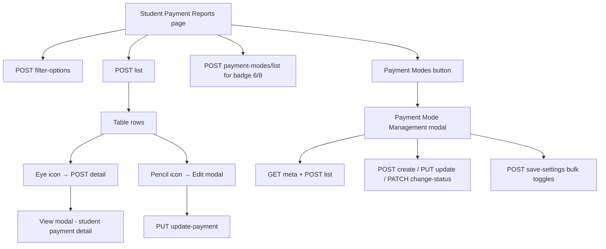

# Student Payment Reports — Frontend Integration Guide

Complete API reference and step-by-step frontend wiring for **Finance Operations → Student Payment Reports**, including the **Payment Mode Management** modal opened from the reports page.

| Item | Value |
|------|-------|
| Reports base URL | `{{BASE_URL}}/api/finance/student-payment-reports` |
| Payment modes base URL | `{{BASE_URL}}/api/finance/payment-modes` |
| Postman (reports) | `STUDENT_PAYMENT_REPORTS_POSTMAN_COLLECTION.json` |
| Postman (payment modes) | `PAYMENT_MODE_MANAGEMENT_POSTMAN.json` |
| Related backend doc | `PAYMENT_MODE_MANAGEMENT_API.md` |

---

## Table of Contents

1. [How to read this document](#1-how-to-read-this-document)
2. [Screen overview & API map](#2-screen-overview--api-map)
3. [Authentication & permissions](#3-authentication--permissions)
4. [Standard response envelope](#4-standard-response-envelope)
5. [Enums & UI label mapping](#5-enums--ui-label-mapping)
6. [API reference — Student Payment Reports](#6-api-reference--student-payment-reports)
7. [API reference — Payment Mode Management](#7-api-reference--payment-mode-management)
8. [Step-by-step frontend integration](#8-step-by-step-frontend-integration)
9. [Shared utilities (formatting & badges)](#9-shared-utilities-formatting--badges)
10. [Error handling](#10-error-handling)
11. [TypeScript types](#11-typescript-types)
12. [Testing checklist](#12-testing-checklist)
13. [Quick API summary](#13-quick-api-summary)

---

## 1. How to read this document

Every screen section follows the same pattern:

| Step | Meaning |
|------|---------|
| **When** | User action or lifecycle trigger |
| **Call** | HTTP method, path, request body |
| **Populate** | Which response fields map to which UI element |
| **Refresh** | When to re-fetch after a mutation |
| **Do NOT call** | Actions that should not trigger an API |

### Golden rules

| Rule | Detail |
|------|--------|
| POST for reads | List, filter-options, and detail use **POST** with JSON body (IDs in body, not URL) |
| PUT for edit | Payment update uses **PUT** `/update-payment` |
| Bearer token | All endpoints require `Authorization: Bearer <token>` |
| Use `data` | Response payload is always in `response.data.data` |
| No mock data | Table rows, counts, dropdowns, and modals must come from API |
| Debounce search | 300 ms debounce on search input before calling list |
| Store `_id` | Row `_id` is `paymentId` for detail, edit, and comment APIs |
| Filter options once | Load filter-options on page mount; reuse for dropdowns |
| Payment modes badge | `activeCount/totalCount` from payment-modes list `summary` |

---

## 2. Screen overview & API map



### Screens → APIs

| UI screen / modal | Primary APIs |
|-------------------|--------------|
| **Student Payment Reports** (main table) | `filter-options`, `list`, `payment-modes/list` (badge) |
| **View payment detail** (eye icon modal) | `detail` |
| **Edit payment details** (pencil modal) | `filter-options` (reasons), `update-payment` |
| **Payment Mode Management** modal | `payment-modes/meta`, `payment-modes/list`, `change-status` or `save-settings` |
| **Add payment mode** modal | `payment-modes/meta`, `payment-modes/create` |
| **Edit payment mode** (pencil in modes list) | `payment-modes/update` |

---

## 3. Authentication & permissions

### Login — Super Admin

```http
POST /api/auth/login-super-admin
Content-Type: application/json

{
  "email": "admin@sriram.com",
  "password": "admin123"
}
```

**Response:**

```json
{
  "success": true,
  "token": "eyJhbGciOiJIUzI1NiIs...",
  "user": { "role": "super_admin" }
}
```

Store `token` and send on every request:

```
Authorization: Bearer <token>
```

### Login — Finance Admin (alternative)

```http
POST /api/auth/login-admin-access
```

Then verify OTP. Role must be `FINANCE_ADMIN`.

### Permission matrix

| Action | Super Admin | Finance Admin | Other authenticated |
|--------|-------------|---------------|---------------------|
| Read reports (list, detail, filter-options, comment) | Yes | Yes | Yes |
| Update payment (`PUT /update-payment`) | Yes | Yes | **403** |
| Payment mode read (list, meta, dropdown) | Yes | Yes | Yes |
| Payment mode write (create, update, delete, save-settings) | Yes | Yes | **403** |

---

## 4. Standard response envelope

All student payment report endpoints return:

```json
{
  "success": true,
  "statusCode": 10000,
  "message": "Student payment reports fetched successfully",
  "data": { },
  "error": null
}
```

| Field | Use |
|-------|-----|
| `success` | `true` / `false` |
| `statusCode` | `10000` = success; `11000` = validation error |
| `message` | Toast / snackbar text |
| `data` | **All UI data lives here** |
| `error` | Validation details on failure |

Payment mode list spreads `summary` and `groups` at root **in addition** to `data` in some responses — always read `response.data.data` first; fall back to top-level `summary` / `groups` if your axios interceptor unwraps differently.

---

## 5. Enums & UI label mapping

### 5.1 Payment status (table badges)

| API value | UI label (design) | Suggested badge color |
|-----------|-------------------|------------------------|
| `PAID` | Paid | Green |
| `PARTIAL` | Partially Paid | Orange |
| `PENDING` | Pending | Light blue |
| `FAILED` | Failed | Red |
| `REFUNDED` | Refunded | Gray |
| `EMI_RUNNING` | EMI Completed | Dark navy blue |

List items return `status` as the API enum string. Use the table above for display labels.

### 5.2 Edit payment — status dropdown

Send API enum values (not display labels):

| UI label | API value |
|----------|-----------|
| Paid | `PAID` |
| Partial | `PARTIAL` |
| Pending | `PENDING` |
| Failed | `FAILED` |
| Refunded | `REFUNDED` |

### 5.3 Edit payment — reason dropdown

Load from `filter-options` → `data.reasons`. Each item: `{ value, label }`.

| UI label | API `value` |
|----------|-------------|
| Cash Payment | `CASH_PAYMENT` |
| Payment Received in Another Account | `PAYMENT_RECEIVED_IN_ANOTHER_ACCOUNT` |
| Technical Issue | `TECHNICAL_ISSUE` |
| Bank Transfer Verified | `BANK_TRANSFER_VERIFIED` |
| Manual Approval | `MANUAL_APPROVAL` |
| Other | `OTHER` |

### 5.4 Gateway (table column)

| API value | UI label |
|-----------|----------|
| `RAZORPAY` | Razorpay |
| `CASHFREE` | Cashfree |
| `OFFLINE` | Offline |
| `MANUAL` | Offline |
| `OTHER` | Other |

### 5.5 Verification status (detail modal badge)

| API value | UI label |
|-----------|----------|
| `VERIFIED` | Verified |
| `AUTO_VERIFIED` | Auto Verified |
| `PENDING_VERIFICATION` | Pending Verification |
| `VERIFICATION_PENDING` | Pending Verification |
| `UNDER_REVIEW` | Under Review |
| `REJECTED` | Rejected |
| `ESCALATED` | Escalated |

### 5.6 Payment mode category (Add mode modal)

| UI label | API value |
|----------|-----------|
| Online | `ONLINE` |
| Offline | `OFFLINE` |
| Banking | `BANKING` |
| Wallet | `WALLET` |
| Other | `OTHER` |

Load full list from `GET /api/finance/payment-modes/meta` → `data.categories`.

### 5.7 Payment mode icon

Load from `GET /api/finance/payment-modes/meta` → `data.icons`.

| UI label | API value |
|----------|-----------|
| Mobile / UPI | `MOBILE_UPI` |
| Card | `CARD` |
| Banking | `BANKING` |
| Cash | `CASH` |
| Wallet | `WALLET` |
| Cheque / DD | `CHEQUE_DD` |
| EMI | `EMI` |
| Gateway | `GATEWAY` |
| Other | `OTHER` |

---

## 6. API reference — Student Payment Reports

**Base:** `/api/finance/student-payment-reports`

---

### 6.1 Get filter options

Load once when the reports page mounts. Powers center dropdown and edit-modal reason dropdown.

```http
POST /api/finance/student-payment-reports/filter-options
Content-Type: application/json
Authorization: Bearer <token>

{}
```

**Response `data`:**

```json
{
  "centers": [
    {
      "_id": "665a1b2c3d4e5f6789012345",
      "centerName": "Delhi Center",
      "centerCode": "DEL",
      "city": "Delhi"
    }
  ],
  "courses": [
    {
      "_id": "665a1b2c3d4e5f6789012346",
      "courseName": "UPSC Prelims Foundation",
      "courseId": "CRS001",
      "centerId": "665a1b2c3d4e5f6789012345"
    }
  ],
  "batches": [
    {
      "_id": "665a1b2c3d4e5f6789012347",
      "batchId": "BAT001",
      "batchName": "Morning Batch 2025",
      "courseId": "665a1b2c3d4e5f6789012346"
    }
  ],
  "paymentModes": [
    {
      "paymentModeId": "PM001",
      "paymentModeName": "UPI",
      "category": "ONLINE",
      "icon": "MOBILE_UPI"
    }
  ],
  "gateways": [
    { "value": "RAZORPAY", "label": "Razorpay" },
    { "value": "CASHFREE", "label": "Cashfree" },
    { "value": "OFFLINE", "label": "Offline" },
    { "value": "MANUAL", "label": "Manual" }
  ],
  "statuses": [
    { "value": "PAID", "label": "Paid" },
    { "value": "PARTIAL", "label": "Partial" },
    { "value": "PENDING", "label": "Pending" },
    { "value": "FAILED", "label": "Failed" },
    { "value": "REFUNDED", "label": "Refunded" },
    { "value": "EMI_RUNNING", "label": "EMI Running" }
  ],
  "paymentTypes": [
    { "value": "FULL", "label": "Full" },
    { "value": "EMI", "label": "EMI" }
  ],
  "refundStatuses": [
    { "value": "NOT_REFUNDED", "label": "Not Refunded" },
    { "value": "PARTIALLY_REFUNDED", "label": "Partially Refunded" },
    { "value": "REFUND_PENDING", "label": "Refund Pending" },
    { "value": "REFUNDED", "label": "Refunded" }
  ],
  "accessStatuses": [
    { "value": "ACTIVE", "label": "Active" },
    { "value": "EXPIRED", "label": "Expired" },
    { "value": "BLOCKED_NON_PAYMENT", "label": "Blocked due to non-payment" },
    { "value": "INACTIVE", "label": "Inactive" }
  ],
  "verificationStatuses": [
    { "value": "PENDING_VERIFICATION", "label": "Pending Verification" },
    { "value": "UNDER_REVIEW", "label": "Under Review" },
    { "value": "VERIFIED", "label": "Verified" },
    { "value": "REJECTED", "label": "Rejected" },
    { "value": "ESCALATED", "label": "Escalated" },
    { "value": "AUTO_VERIFIED", "label": "Auto Verified" }
  ],
  "sortOptions": [
    { "value": "updatedAt_desc", "label": "Recently Updated", "sortBy": "updatedAt", "sortOrder": "desc" },
    { "value": "createdAt_asc", "label": "Oldest First", "sortBy": "createdAt", "sortOrder": "asc" },
    { "value": "paidAmount_desc", "label": "Amount High → Low", "sortBy": "paidAmount", "sortOrder": "desc" },
    { "value": "paidAmount_asc", "label": "Amount Low → High", "sortBy": "paidAmount", "sortOrder": "asc" },
    { "value": "studentName_asc", "label": "Student A-Z", "sortBy": "studentName", "sortOrder": "asc" },
    { "value": "studentName_desc", "label": "Student Z-A", "sortBy": "studentName", "sortOrder": "desc" }
  ],
  "reasons": [
    { "value": "CASH_PAYMENT", "label": "Cash Payment" },
    { "value": "PAYMENT_RECEIVED_IN_ANOTHER_ACCOUNT", "label": "Payment Received in Another Account" },
    { "value": "TECHNICAL_ISSUE", "label": "Technical Issue" },
    { "value": "BANK_TRANSFER_VERIFIED", "label": "Bank Transfer Verified" },
    { "value": "MANUAL_APPROVAL", "label": "Manual Approval" },
    { "value": "OTHER", "label": "Other" }
  ]
}
```

---

### 6.2 List student payment reports

Powers the main data table and record count ("23 records").

```http
POST /api/finance/student-payment-reports/list
Content-Type: application/json
Authorization: Bearer <token>
```

**Request body (all fields optional):**

```json
{
  "search": "",
  "status": "ALL",
  "gateway": "ALL",
  "paymentMode": "ALL",
  "paymentType": "ALL",
  "refundStatus": "ALL",
  "accessStatus": "ALL",
  "verificationStatus": "ALL",
  "centerId": "",
  "courseId": "",
  "batchId": "",
  "studentId": "",
  "fromDate": "2026-01-01",
  "toDate": "2026-12-31",
  "sortBy": "updatedAt",
  "sortOrder": "desc",
  "sort": "NEWEST",
  "page": 1,
  "limit": 25
}
```

#### Filter reference

| Body field | UI control | Notes |
|------------|------------|-------|
| `search` | "Search student" input | Matches name, code, course, batch, center, transaction ID, receipt, invoice, Razorpay IDs, enrollment ref, payment mode name |
| `centerId` | Center dropdown | MongoDB `_id` from `filter-options.centers` |
| `fromDate` / `toDate` | Date range picker | Also accepts `dateFrom` / `dateTo`. Format `YYYY-MM-DD` |
| `status` | Status filter | `PAID`, `PARTIAL`, `PENDING`, `FAILED`, `REFUNDED`, `EMI_RUNNING`, or `ALL` |
| `gateway` | Gateway filter | `RAZORPAY`, `CASHFREE`, `OFFLINE` (maps to MANUAL+OFFLINE), or `ALL` |
| `paymentMode` | Payment mode filter | `PM001` business ID, or `ALL` |
| `paymentType` | Payment type | `FULL`, `EMI`, or `ALL` |
| `refundStatus` | Refund filter | See filter-options |
| `accessStatus` | Access filter | See filter-options |
| `verificationStatus` | Verification filter | See filter-options |
| `studentId` | Student filter | MongoDB ObjectId or business code e.g. `STU-24001` |
| `sort` | Preset sort | `NEWEST` or `OLDEST` (by `transactionDate`) — overrides `sortBy`/`sortOrder` |
| `sortBy` | Column sort | `updatedAt`, `createdAt`, `transactionDate`, `paidAmount`, `totalAmount`, `studentName` |
| `sortOrder` | Sort direction | `asc` or `desc` |
| `page` | Pagination | Default `1` |
| `limit` | Page size | Default `25`, max `100` |

**Response `data`:**

```json
{
  "summary": {
    "paidCount": 12,
    "partialCount": 5,
    "pendingCount": 4,
    "totalCount": 23
  },
  "count": 23,
  "totalCount": 23,
  "page": 1,
  "limit": 25,
  "totalPages": 1,
  "items": [
    {
      "_id": "665a1b2c3d4e5f6789012348",
      "transactionId": "TXN-PAY-001-A3",
      "student": "665a1b2c3d4e5f6789012349",
      "studentName": "Aarav Sharma",
      "studentCode": "STU-24001",
      "center": "665a1b2c3d4e5f6789012345",
      "centerName": "Delhi Center",
      "course": "665a1b2c3d4e5f6789012346",
      "courseName": "UPSC Prelims Foundation",
      "batch": "665a1b2c3d4e5f6789012347",
      "batchName": "Morning Batch 2025",
      "enrollment": "665a1b2c3d4e5f6789012350",
      "enrollmentRef": "ENR-2026-0001",
      "deliveryMode": "OFFLINE",
      "paymentType": "FULL",
      "paymentModeId": "PM001",
      "paymentModeName": "UPI",
      "paymentMethod": "UPI",
      "gateway": "RAZORPAY",
      "razorpayOrderId": "order_xxx",
      "razorpayPaymentId": "pay_xxx",
      "totalAmount": 45000,
      "paidAmount": 45000,
      "pendingAmount": 0,
      "discountAmount": 0,
      "gstAmount": 8100,
      "baseAmount": 36900,
      "status": "PAID",
      "refundStatus": "NOT_REFUNDED",
      "accessStatus": "ACTIVE",
      "verificationStatus": "VERIFIED",
      "financeHeadStatus": "APPROVED",
      "receiptNumber": "RCP-2026-0001",
      "invoiceNumber": "INV-2026-0001",
      "invoiceUrl": "",
      "transactionDate": "2026-06-22T12:28:00.000Z",
      "reason": {
        "value": "MANUAL_APPROVAL",
        "label": "Manual Approval"
      },
      "comment": "UPI receipt matched",
      "createdAt": "2026-06-20T10:00:00.000Z",
      "updatedAt": "2026-06-22T12:30:00.000Z"
    }
  ]
}
```

#### Table column mapping

| UI column | Response field | Notes |
|-----------|----------------|-------|
| Student ID | `studentCode` | e.g. `STU-24001` |
| Student Name | `studentName` | |
| Center | `centerName` | |
| Course | `courseName` | |
| Batch | `batchName` | |
| Payment Status | `status` | Map to badge (see §5.1) |
| Paid Amount | `paidAmount` | Format as ₹ (see §9) |
| Pending Amount | `pendingAmount` | Format as ₹ |
| Payment Mode | `paymentModeName` | Fallback: `paymentMethod` |
| Payment Gateway | `gateway` | Map label (see §5.4) |
| Payment Date | `transactionDate` | Format datetime; show `—` if null |
| Reason | `reason.label` | `reason` is `{ value, label }` or null |
| Comments | `comment` | Show `—` if null |
| Actions — View | — | Call detail with `id: row._id` |
| Actions — Edit | — | Open edit modal with `paymentId: row._id` |

Store per row: `_id` (paymentId), `enrollment`, `transactionId`, `studentCode`, `studentName`, `paidAmount`, `status`, `reason`, `comment`.

---

### 6.3 Get payment detail (view modal)

Opened when user clicks the **eye** icon on a table row.

```http
POST /api/finance/student-payment-reports/detail
Content-Type: application/json
Authorization: Bearer <token>
```

**Request body — use one lookup key:**

```json
{ "id": "665a1b2c3d4e5f6789012348" }
```

| Field | Description |
|-------|-------------|
| `id` | MongoDB `_id` of payment record (preferred — from list `items[]._id`) |
| `reportId` | Alias for `id` |
| `enrollmentId` | MongoDB `_id` of enrollment |
| `transactionId` | Business ID e.g. `TXN-PAY-001-A3` |

**Response `data` (full structure):**

```json
{
  "header": {
    "studentName": "Aarav Sharma",
    "paymentReference": "TXN-PAY-001-A3",
    "courseName": "UPSC Prelims Foundation",
    "subtitle": "TXN-PAY-001-A3 · UPSC Prelims Foundation",
    "enrollmentRef": "ENR-2026-0001"
  },
  "badges": {
    "status": "PAID",
    "statusLabel": "Paid",
    "refundStatus": "NOT_REFUNDED",
    "refundStatusLabel": "Not Refunded",
    "accessStatus": "ACTIVE",
    "accessStatusLabel": "Active",
    "paymentType": "FULL",
    "paymentTypeLabel": "Full",
    "verificationStatus": "VERIFIED",
    "verificationStatusLabel": "Verified"
  },
  "paymentReport": {
    "_id": "665a1b2c3d4e5f6789012348",
    "transactionId": "TXN-PAY-001-A3",
    "studentName": "Aarav Sharma",
    "studentCode": "STU-24001",
    "centerName": "Delhi Center",
    "paymentModeName": "UPI",
    "gateway": "RAZORPAY",
    "paidAmount": 45000,
    "pendingAmount": 0,
    "totalAmount": 45000,
    "receiptNumber": "RCP-2026-0001",
    "transactionDate": "2026-06-22T12:28:00.000Z",
    "verificationStatus": "VERIFIED",
    "reason": { "value": "MANUAL_APPROVAL", "label": "Manual Approval" },
    "comment": "UPI receipt matched"
  },
  "student": {
    "_id": "665a1b2c3d4e5f6789012349",
    "studentCode": "STU-24001",
    "studentName": "Aarav Sharma",
    "email": "aarav@example.com",
    "mobileNumber": "9876543210",
    "centerId": "665a1b2c3d4e5f6789012345"
  },
  "enrollment": {
    "_id": "665a1b2c3d4e5f6789012350",
    "enrollmentRef": "ENR-2026-0001",
    "enrollmentDate": "2026-06-20T10:00:00.000Z",
    "status": "ACTIVE",
    "paymentStatus": "PAID",
    "deliveryMode": "OFFLINE",
    "razorpayOrderId": "order_xxx",
    "razorpayPaymentId": "pay_xxx"
  },
  "billingSummary": {
    "baseAmount": 36900,
    "discountAmount": 0,
    "gstAmount": 8100,
    "totalAmount": 45000,
    "paidAmount": 45000,
    "pendingAmount": 0
  },
  "paymentDetails": [
    { "label": "Student ID", "value": "STU-24001" },
    { "label": "Mobile", "value": "9876543210" },
    { "label": "Email", "value": "aarav@example.com" },
    { "label": "Payment Mode", "value": "UPI" },
    { "label": "Payment Gateway", "value": "RAZORPAY" },
    { "label": "Transaction ID", "value": "TXN-PAY-001-A3" },
    { "label": "Payment Date", "value": "2026-06-22T12:28:00.000Z" },
    { "label": "Amount Paid", "value": 45000 }
  ],
  "actions": {
    "invoiceUrl": "",
    "receiptNumber": "RCP-2026-0001",
    "downloadEnabled": false,
    "printEnabled": true,
    "copyReceiptEnabled": true,
    "resendEnabled": false,
    "whatsappEnabled": true,
    "resendNote": "Resend receipt — coming soon",
    "whatsappNote": "WhatsApp share — coming soon"
  },
  "timeline": [
    {
      "key": "ENROLLMENT_CREATED",
      "label": "Registration",
      "status": "completed",
      "timestamp": "2026-06-20T10:00:00.000Z"
    },
    {
      "key": "PAYMENT_SUCCESS",
      "label": "Successful Payment",
      "status": "completed",
      "timestamp": "2026-06-22T12:28:00.000Z"
    }
  ],
  "events": [],
  "attempts": [
    {
      "index": 1,
      "transactionId": "TXN-PAY-001-A3",
      "txnId": "TXN-PAY-001-A3",
      "mode": "UPI",
      "status": "SUCCESS",
      "gateway": "RAZORPAY",
      "failureReason": null,
      "date": "2026-06-22T12:28:00.000Z"
    }
  ],
  "adminLogs": [],
  "sections": {
    "timeline": { "available": true, "source": "derived" },
    "events": { "available": true, "source": "derived" },
    "attempts": { "available": true, "source": "derived", "partial": true },
    "adminLogs": { "available": false, "placeholder": "No admin activity available", "source": "future" }
  }
}
```

#### View modal field mapping (simple key-value layout)

| UI label | Source |
|----------|--------|
| Header title | `header.studentName` |
| Header subtitle | `` `${student.studentCode} · ${paymentReport.centerName}` `` |
| Center | `paymentReport.centerName` |
| Mobile | `student.mobileNumber` |
| Email | `student.email` |
| Payment status badge | `badges.statusLabel` + `badges.status` for color |
| Payment mode | `paymentReport.paymentModeName` |
| Amount | `paymentReport.paidAmount` (format ₹) |
| Receipt number | `paymentReport.receiptNumber` |
| Transaction ID | `paymentReport.transactionId` |
| Payment date | `paymentReport.transactionDate` |
| Gateway | `paymentReport.gateway` (map label) |
| Verification status badge | `badges.verificationStatusLabel` |
| Reason | `paymentReport.reason?.label` or `—` |
| Comments | `paymentReport.comment` or `—` |

> **Alias route:** `POST /by-enrollment` accepts the same body and returns the same response as `/detail`.

---

### 6.4 Update payment (edit modal)

Opened when user clicks the **pencil** icon. Requires **Super Admin** or **Finance Admin**.

```http
PUT /api/finance/student-payment-reports/update-payment
Content-Type: application/json
Authorization: Bearer <token>
```

**Request body:**

```json
{
  "paymentId": "665a1b2c3d4e5f6789012348",
  "status": "PAID",
  "paidAmount": 45000,
  "reason": "CASH_PAYMENT",
  "comment": "UPI receipt matched"
}
```

| Field | Required | Notes |
|-------|----------|-------|
| `paymentId` | Yes | MongoDB `_id` from list row |
| `status` | Yes | `PAID` \| `PARTIAL` \| `PENDING` \| `FAILED` \| `REFUNDED` |
| `paidAmount` | Yes | Number ≥ 0. See amount rules below |
| `reason` | Yes | Enum from §5.3 |
| `comment` | No | Max 500 chars |

#### Amount rules (critical for frontend validation)

| Status | `paidAmount` behavior |
|--------|----------------------|
| `PAID` | Backend sets `paidAmount = totalAmount`, `pendingAmount = 0` (input ignored) |
| `PENDING`, `FAILED`, `REFUNDED` | Backend sets `paidAmount = 0`, `pendingAmount = totalAmount` (input ignored) |
| `PARTIAL` | **Must** be > 0 and **<** `totalAmount`. Backend uses your value |

Pre-fill edit modal from list row:
- `status` → `row.status`
- `paidAmount` → `row.paidAmount`
- `reason` → `row.reason?.value` or first reason option
- `comment` → `row.comment` or `''`

**Response `data`:** Updated payment record (same shape as a list `items[]` entry).

**After success:**
1. Close edit modal
2. Re-fetch list with current filters
3. If view modal is open for same row, re-fetch detail

---

### 6.5 Get comment details

Optional — for comment tooltip or lightweight modal without full detail.

```http
POST /api/finance/student-payment-reports/comment-details
Content-Type: application/json
Authorization: Bearer <token>

{
  "paymentId": "665a1b2c3d4e5f6789012348"
}
```

**Response `data`:**

```json
{
  "studentName": "Aarav Sharma",
  "comment": "UPI receipt matched"
}
```

---

## 7. API reference — Payment Mode Management

**Base:** `/api/finance/payment-modes`

Used by the **Payment Modes 6/8** button and the Payment Mode Management / Add mode modals.

---

### 7.1 Get meta (categories & icons)

```http
GET /api/finance/payment-modes/meta
Authorization: Bearer <token>
```

**Response `data`:**

```json
{
  "categories": ["ONLINE", "OFFLINE", "BANKING", "WALLET", "INTERNATIONAL", "OTHER"],
  "icons": ["MOBILE_UPI", "CARD", "BANKING", "CASH", "WALLET", "CHEQUE_DD", "EMI", "INTERNATIONAL", "GATEWAY", "OTHER"],
  "sortOptions": ["NAME_ASC", "RECENTLY_UPDATED"]
}
```

---

### 7.2 List payment modes (grouped)

Powers the Payment Mode Management modal list and the **Payment Modes X/Y** badge on the reports page.

```http
POST /api/finance/payment-modes/list
Content-Type: application/json
Authorization: Bearer <token>

{
  "search": "",
  "category": "ALL",
  "status": "ALL",
  "sort": "NAME_ASC"
}
```

| Filter | Values |
|--------|--------|
| `search` | Name, ID, category, description |
| `category` | `ONLINE`, `OFFLINE`, `BANKING`, `WALLET`, `OTHER`, or `ALL` |
| `status` | `ACTIVE`, `INACTIVE`, or `ALL` |
| `sort` | `NAME_ASC` or `RECENTLY_UPDATED` |

**Response:**

```json
{
  "success": true,
  "message": "Payment modes fetched successfully",
  "summary": {
    "activeCount": 6,
    "inactiveCount": 2,
    "totalCount": 8
  },
  "groups": [
    {
      "category": "ONLINE",
      "count": 4,
      "items": [
        {
          "_id": "...",
          "paymentModeId": "PM001",
          "paymentModeName": "UPI",
          "category": "ONLINE",
          "description": "UPI apps and collect requests",
          "icon": "MOBILE_UPI",
          "isActive": true,
          "displayOrder": 1,
          "createdAt": "2026-06-01T08:00:00.000Z",
          "updatedAt": "2026-06-30T12:28:00.000Z"
        }
      ]
    },
    {
      "category": "OFFLINE",
      "count": 1,
      "items": []
    }
  ],
  "items": [],
  "count": 8
}
```

#### UI mapping — Payment Mode Management modal

| UI element | Source |
|------------|--------|
| "6 Active" chip | `summary.activeCount` |
| "2 Deactivated" chip | `summary.inactiveCount` |
| "8 Total" chip | `summary.totalCount` |
| "Payment Modes 6/8" button on reports page | `` `${summary.activeCount}/${summary.totalCount}` `` |
| Section headers (ONLINE, OFFLINE) | `groups[].category` + `groups[].count` |
| Mode cards | `groups[].items[]` |
| Card title | `paymentModeName` |
| Category badge | `category` |
| Active badge | `isActive` → "ACTIVE" / "DEACTIVATED" |
| Description | `description` |
| Updated timestamp | `updatedAt` |
| Toggle switch | `isActive` (local state until save) |
| Edit button | Opens edit with `paymentModeId` |

---

### 7.3 Create payment mode

```http
POST /api/finance/payment-modes/create
Content-Type: application/json
Authorization: Bearer <token>

{
  "paymentModeName": "Paytm",
  "category": "ONLINE",
  "description": "Optional — shown in settings and admin help text",
  "icon": "OTHER",
  "isActive": true
}
```

| Field | Required | Notes |
|-------|----------|-------|
| `paymentModeName` | Yes | 2–100 chars, unique |
| `category` | Yes | From meta categories |
| `icon` | Yes | From meta icons |
| `description` | No | Max 500 chars |
| `isActive` | No | Default `true` ("Active on save" toggle) |

**Response (201) `data`:**

```json
{
  "_id": "...",
  "paymentModeId": "PM009",
  "paymentModeName": "Paytm",
  "category": "ONLINE",
  "description": "...",
  "icon": "OTHER",
  "isActive": true,
  "displayOrder": 9,
  "createdAt": "...",
  "updatedAt": "..."
}
```

---

### 7.4 Update payment mode

```http
PUT /api/finance/payment-modes/update
Content-Type: application/json
Authorization: Bearer <token>

{
  "paymentModeId": "PM001",
  "paymentModeName": "UPI",
  "category": "ONLINE",
  "description": "Updated description",
  "icon": "MOBILE_UPI",
  "isActive": true
}
```

`paymentModeId` required; all other fields optional (partial update).

---

### 7.5 Change status (single toggle)

Use when saving one toggle immediately:

```http
PATCH /api/finance/payment-modes/change-status
Content-Type: application/json
Authorization: Bearer <token>

{
  "paymentModeId": "PM001",
  "isActive": false
}
```

---

### 7.6 Save settings (bulk toggles)

Use when the design batches toggle changes until user clicks **Save Settings**:

```http
POST /api/finance/payment-modes/save-settings
Content-Type: application/json
Authorization: Bearer <token>

{
  "updates": [
    { "paymentModeId": "PM001", "isActive": false },
    { "paymentModeId": "PM002", "isActive": true }
  ]
}
```

**Response `data`:**

```json
{
  "updatedCount": 2,
  "summary": { "activeCount": 6, "inactiveCount": 2, "totalCount": 8 },
  "items": []
}
```

**Cancel** → discard local toggle state and re-fetch list.

---

### 7.7 Delete payment mode

```http
DELETE /api/finance/payment-modes/delete
Content-Type: application/json
Authorization: Bearer <token>

{
  "paymentModeId": "PM009"
}
```

Hard delete — show confirmation dialog first.

---

## 8. Step-by-step frontend integration

### Phase 1 — Project setup

#### Step 1.1 — API client

Use the project's existing axios instance. Add finance base paths:

```typescript
const REPORTS_BASE = '/api/finance/student-payment-reports';
const PAYMENT_MODES_BASE = '/api/finance/payment-modes';

const authHeaders = () => ({
  Authorization: `Bearer ${getToken()}`,
  'Content-Type': 'application/json'
});
```

#### Step 1.2 — Route

Mount the page at e.g. `/finance/student-payment-reports` under **Finance Operations** sidebar.

---

### Phase 2 — Main reports page

#### Step 2.1 — Page mount (parallel requests)

On `useEffect` / page load, fire **three** requests in parallel:

```typescript
const [filterOptions, listData, modeSummary] = await Promise.all([
  fetch(`${REPORTS_BASE}/filter-options`, { method: 'POST', headers: authHeaders(), body: '{}' }).then(r => r.json()),
  fetch(`${REPORTS_BASE}/list`, {
    method: 'POST',
    headers: authHeaders(),
    body: JSON.stringify({ page: 1, limit: 25, sortBy: 'updatedAt', sortOrder: 'desc' })
  }).then(r => r.json()),
  fetch(`${PAYMENT_MODES_BASE}/list`, {
    method: 'POST',
    headers: authHeaders(),
    body: JSON.stringify({ category: 'ALL', status: 'ALL', sort: 'NAME_ASC' })
  }).then(r => r.json())
]);
```

Store:
- `filterOptions.data` → centers dropdown, future advanced filters, edit reasons
- `listData.data` → table rows + pagination + `summary`
- `modeSummary.summary` → Payment Modes badge `activeCount/totalCount`

Show skeleton loaders until all three resolve.

#### Step 2.2 — Center dropdown

Populate from `filterOptions.centers`:

```typescript
options = [
  { value: '', label: 'All centers' },
  ...filterOptions.centers.map(c => ({ value: c._id, label: c.centerName }))
];
```

On change → update `filters.centerId` → call list API.

#### Step 2.3 — Search input

Debounce 300 ms:

```typescript
const onSearchChange = debounce((search: string) => {
  fetchList({ ...filters, search, page: 1 });
}, 300);
```

#### Step 2.4 — Date range picker

Convert UI `dd-mm-yyyy` to API `YYYY-MM-DD`:

```typescript
const toApiDate = (ddmmyyyy: string) => {
  const [dd, mm, yyyy] = ddmmyyyy.split('-');
  return `${yyyy}-${mm}-${dd}`;
};

fetchList({
  ...filters,
  fromDate: toApiDate(startDate),
  toDate: toApiDate(endDate),
  page: 1
});
```

#### Step 2.5 — Render table

Map `listData.data.items` to rows. Display `listData.data.totalCount` as **"23 records"**.

Pagination: on page change, call list with `{ ...filters, page, limit }`.

#### Step 2.6 — Payment Modes button

Label: `` `Payment Modes ${activeCount}/${totalCount}` ``

On click → open Payment Mode Management modal (Phase 4).

---

### Phase 3 — View & edit modals

#### Step 3.1 — View modal (eye icon)

**When:** User clicks eye on a row.

**Call:**

```typescript
const res = await fetch(`${REPORTS_BASE}/detail`, {
  method: 'POST',
  headers: authHeaders(),
  body: JSON.stringify({ id: row._id })
});
const detail = res.data.data;
```

**Populate:** Use mapping table in §6.3.

**Do NOT call** detail API on table pagination or filter change.

#### Step 3.2 — Edit modal (pencil icon)

**When:** User clicks pencil on a row.

**No API on open** — pre-fill from list row + `filterOptions.reasons`:

```typescript
setForm({
  paymentId: row._id,
  status: row.status,
  paidAmount: row.paidAmount,
  reason: row.reason?.value || filterOptions.reasons[0]?.value,
  comment: row.comment || ''
});
setEditSubtitle(`${row.transactionId} · Edit payment details`);
setStudentName(row.studentName);
```

Status dropdown options (hardcode or from constants):

```typescript
const EDIT_STATUSES = [
  { value: 'PAID', label: 'Paid' },
  { value: 'PARTIAL', label: 'Partial' },
  { value: 'PENDING', label: 'Pending' },
  { value: 'FAILED', label: 'Failed' },
  { value: 'REFUNDED', label: 'Refunded' }
];
```

Reason dropdown: `filterOptions.reasons`.

#### Step 3.3 — Client-side validation before save

```typescript
function validateEditForm(form, totalAmount) {
  if (!form.paymentId || !form.status || !form.reason) return 'Required fields missing';
  if (form.status === 'PARTIAL') {
    if (form.paidAmount <= 0) return 'Partial amount must be greater than 0';
    if (form.paidAmount >= totalAmount) return 'Partial amount must be less than total fees';
  }
  if (form.comment && form.comment.length > 500) return 'Comment max 500 characters';
  return null;
}
```

Pass `totalAmount` from list row (`row.totalAmount`).

#### Step 3.4 — Save edit

```typescript
await fetch(`${REPORTS_BASE}/update-payment`, {
  method: 'PUT',
  headers: authHeaders(),
  body: JSON.stringify({
    paymentId: form.paymentId,
    status: form.status,
    paidAmount: Number(form.paidAmount),
    reason: form.reason,
    comment: form.comment
  })
});
```

On success:
1. Toast `message` from response
2. Close modal
3. Re-fetch list with current filters
4. Update reports page payment modes badge if needed

---

### Phase 4 — Payment Mode Management modal

#### Step 4.1 — Open modal

**When:** User clicks **Payment Modes X/Y** button.

**Call (parallel):**

```typescript
const [meta, list] = await Promise.all([
  fetch(`${PAYMENT_MODES_BASE}/meta`, { headers: authHeaders() }).then(r => r.json()),
  fetch(`${PAYMENT_MODES_BASE}/list`, {
    method: 'POST',
    headers: authHeaders(),
    body: JSON.stringify({ search: '', category: 'ALL', status: 'ALL', sort: 'NAME_ASC' })
  }).then(r => r.json())
]);
```

Render `list.groups` as categorized sections. Summary chips from `list.summary`.

#### Step 4.2 — Search & filters in modal

Debounce search 300 ms → re-call `POST /list` with `{ search, category, status, sort }`.

| UI filter | Body field |
|-----------|------------|
| All categories | `category: 'ALL'` or specific enum |
| All status | `status: 'ALL'` \| `'ACTIVE'` \| `'INACTIVE'` |
| Sort A-Z | `sort: 'NAME_ASC'` |
| Recently updated | `sort: 'RECENTLY_UPDATED'` |

#### Step 4.3 — Toggle switches

**Option A (immediate):** On toggle → `PATCH /change-status`.

**Option B (batch — matches design with Save Settings):**
1. Keep `pendingUpdates` in local state keyed by `paymentModeId`
2. On Save → `POST /save-settings` with `{ updates: [...] }`
3. On Cancel → reset local state, re-fetch list

#### Step 4.4 — Add mode modal

**When:** User clicks **+ Add mode**.

1. Load `meta` if not cached (categories + icons dropdowns)
2. On submit:

```typescript
await fetch(`${PAYMENT_MODES_BASE}/create`, {
  method: 'POST',
  headers: authHeaders(),
  body: JSON.stringify({
    paymentModeName: form.name,
    category: form.category,      // e.g. 'ONLINE'
    description: form.description,
    icon: form.icon,              // e.g. 'OTHER'
    isActive: form.activeOnSave
  })
});
```

3. Close add modal → re-fetch payment modes list → update reports page badge

#### Step 4.5 — Edit mode (pencil in mode card)

```typescript
await fetch(`${PAYMENT_MODES_BASE}/update`, {
  method: 'PUT',
  headers: authHeaders(),
  body: JSON.stringify({
    paymentModeId: mode.paymentModeId,
    paymentModeName: form.name,
    category: form.category,
    description: form.description,
    icon: form.icon,
    isActive: form.isActive
  })
});
```

---

### Phase 5 — State management pattern

Recommended React state shape:

```typescript
interface ReportsPageState {
  loading: boolean;
  filterOptions: FilterOptions | null;
  filters: {
    search: string;
    centerId: string;
    fromDate: string;
    toDate: string;
    page: number;
    limit: number;
    sortBy: string;
    sortOrder: 'asc' | 'desc';
  };
  list: {
    items: PaymentReportItem[];
    totalCount: number;
    summary: { paidCount: number; partialCount: number; pendingCount: number; totalCount: number };
    page: number;
    totalPages: number;
  };
  paymentModeBadge: { active: number; total: number };
  viewModal: { open: boolean; paymentId: string | null; detail: PaymentDetail | null };
  editModal: { open: boolean; row: PaymentReportItem | null; form: EditPaymentForm };
  modesModal: { open: boolean; groups: PaymentModeGroup[]; summary: ModeSummary };
}
```

---

## 9. Shared utilities (formatting & badges)

### 9.1 Indian Rupee formatting

```typescript
export const formatINR = (amount: number | null | undefined): string => {
  if (amount == null) return '—';
  return new Intl.NumberFormat('en-IN', {
    style: 'currency',
    currency: 'INR',
    maximumFractionDigits: 0
  }).format(amount);
};
// 45000 → "₹45,000"
```

### 9.2 Date/time formatting

```typescript
export const formatPaymentDate = (iso: string | null | undefined): string => {
  if (!iso) return '—';
  const d = new Date(iso);
  return d.toLocaleString('en-IN', {
    day: '2-digit',
    month: 'short',
    year: 'numeric',
    hour: 'numeric',
    minute: '2-digit',
    hour12: true
  });
};
// "22 Jun 2026, 12:28 pm"
```

For "Updated 12:28 pm, 30 Jun 2026" on mode cards, format `updatedAt` similarly.

### 9.3 Payment status badge

```typescript
const STATUS_BADGE: Record<string, { label: string; className: string }> = {
  PAID: { label: 'Paid', className: 'badge-paid' },
  PARTIAL: { label: 'Partially Paid', className: 'badge-partial' },
  PENDING: { label: 'Pending', className: 'badge-pending' },
  FAILED: { label: 'Failed', className: 'badge-failed' },
  REFUNDED: { label: 'Refunded', className: 'badge-refunded' },
  EMI_RUNNING: { label: 'EMI Completed', className: 'badge-emi' }
};
```

### 9.4 Gateway label

```typescript
const GATEWAY_LABELS: Record<string, string> = {
  RAZORPAY: 'Razorpay',
  CASHFREE: 'Cashfree',
  OFFLINE: 'Offline',
  MANUAL: 'Offline',
  OTHER: 'Other'
};
```

### 9.5 Icon mapping for payment mode cards

```typescript
const PAYMENT_MODE_ICONS: Record<string, string> = {
  MOBILE_UPI: 'PhoneIcon',
  CARD: 'CreditCardIcon',
  GATEWAY: 'GlobeIcon',
  CASH: 'BanknoteIcon',
  BANKING: 'BuildingIcon',
  WALLET: 'WalletIcon',
  EMI: 'CalendarIcon',
  OTHER: 'MoreHorizontalIcon'
};
```

---

## 10. Error handling

### 10.1 HTTP status codes

| HTTP | Meaning | Frontend action |
|------|---------|-----------------|
| 401 | Missing / invalid token | Redirect to login |
| 403 | Not Finance Admin on write | Toast "Access denied" |
| 404 | Payment / mode not found | Toast + close modal |
| 400 | Validation error | Show field errors |
| 500 | Server error | Toast generic error; keep previous data |

### 10.2 Validation error shape (update payment)

```json
{
  "success": false,
  "statusCode": 11000,
  "message": "Validation failed",
  "data": null,
  "error": {
    "errors": [
      { "field": "status", "message": "status must be one of: PAID, PARTIAL, PENDING, FAILED, REFUNDED" },
      { "field": "paidAmount", "message": "paidAmount must be greater than or equal to 0" }
    ]
  }
}
```

Map `error.errors[]` to form field messages.

### 10.3 Business validation (update payment amounts)

Backend may return 400 with messages like:
- `For PARTIAL payment, paid amount must be greater than 0`
- `For PARTIAL payment, paid amount must be less than total amount`

Show these on the amount field in the edit modal.

### 10.4 Loading & error UX

| State | Behavior |
|-------|----------|
| Initial load | Full-page skeleton |
| Filter change | Table skeleton only; keep filters visible |
| Modal load | Modal skeleton |
| API error | Toast; retain last successful list data |
| Empty list | "No payment records found" empty state |

---

## 11. TypeScript types

```typescript
export interface PaymentReportItem {
  _id: string;
  transactionId: string;
  studentName: string;
  studentCode: string;
  centerName: string;
  courseName: string;
  batchName: string;
  paymentModeName: string;
  gateway: string;
  paidAmount: number;
  pendingAmount: number;
  totalAmount: number;
  status: 'PAID' | 'PARTIAL' | 'PENDING' | 'FAILED' | 'REFUNDED' | 'EMI_RUNNING';
  transactionDate: string | null;
  reason: { value: string; label: string } | null;
  comment: string | null;
  enrollment: string;
}

export interface ListReportsResponse {
  summary: { paidCount: number; partialCount: number; pendingCount: number; totalCount: number };
  count: number;
  totalCount: number;
  page: number;
  limit: number;
  totalPages: number;
  items: PaymentReportItem[];
}

export interface EditPaymentForm {
  paymentId: string;
  status: 'PAID' | 'PARTIAL' | 'PENDING' | 'FAILED' | 'REFUNDED';
  paidAmount: number;
  reason: string;
  comment: string;
}

export interface PaymentModeItem {
  paymentModeId: string;
  paymentModeName: string;
  category: string;
  description: string;
  icon: string;
  isActive: boolean;
  updatedAt: string;
}

export interface ApiEnvelope<T> {
  success: boolean;
  statusCode: number;
  message: string;
  data: T;
  error: unknown;
}
```

---

## 12. Testing checklist

### Reports page

- [ ] Page loads with filter-options + list + payment modes badge
- [ ] Center dropdown filters list
- [ ] Search debounced; matches student name/code
- [ ] Date range filters by `transactionDate`
- [ ] Record count matches `totalCount`
- [ ] Status badges render correctly for all statuses including EMI_RUNNING
- [ ] Currency columns show ₹ format
- [ ] Null payment date shows `—`
- [ ] Pagination works (`page`, `limit`, `totalPages`)

### View modal

- [ ] Eye icon opens modal with `POST /detail` using row `_id`
- [ ] All key-value fields populated
- [ ] Verification and payment status badges correct

### Edit modal

- [ ] Pre-filled from row data
- [ ] Reason dropdown from filter-options
- [ ] PARTIAL validation enforced client-side
- [ ] Save calls `PUT /update-payment`
- [ ] Table refreshes after save
- [ ] 403 shown for non-finance users

### Payment Mode Management

- [ ] Badge shows `activeCount/totalCount`
- [ ] Modal lists grouped by category
- [ ] Search, category, status filters work
- [ ] Add mode creates via `POST /create`
- [ ] Toggle + save updates via `change-status` or `save-settings`
- [ ] Edit updates via `PUT /update`
- [ ] Badge updates after mode changes

### Postman

Import `STUDENT_PAYMENT_REPORTS_POSTMAN_COLLECTION.json` and run folders 1–6 in order.

---

## 13. Quick API summary

### Student Payment Reports

| # | Method | Path | Auth | Purpose |
|---|--------|------|------|---------|
| 1 | POST | `/filter-options` | Read | Dropdowns + reasons |
| 2 | POST | `/list` | Read | Main table + pagination |
| 3 | POST | `/detail` | Read | View modal |
| 4 | POST | `/by-enrollment` | Read | Detail alias |
| 5 | PUT | `/update-payment` | **Write** | Edit modal save |
| 6 | POST | `/comment-details` | Read | Comment tooltip |

### Payment Mode Management

| # | Method | Path | Auth | Purpose |
|---|--------|------|------|---------|
| 1 | GET | `/meta` | Read | Category + icon enums |
| 2 | POST | `/list` | Read | Grouped list + badge counts |
| 3 | POST | `/create` | Write | Add mode |
| 4 | PUT | `/update` | Write | Edit mode |
| 5 | PATCH | `/change-status` | Write | Single toggle |
| 6 | POST | `/save-settings` | Write | Bulk toggles |
| 7 | DELETE | `/delete` | Write | Delete mode |

---

*Generated from backend routes: `routes/studentPaymentReportRoutes.js`, `routes/paymentModeRoutes.js`, services, and Postman collections in this repository.*
