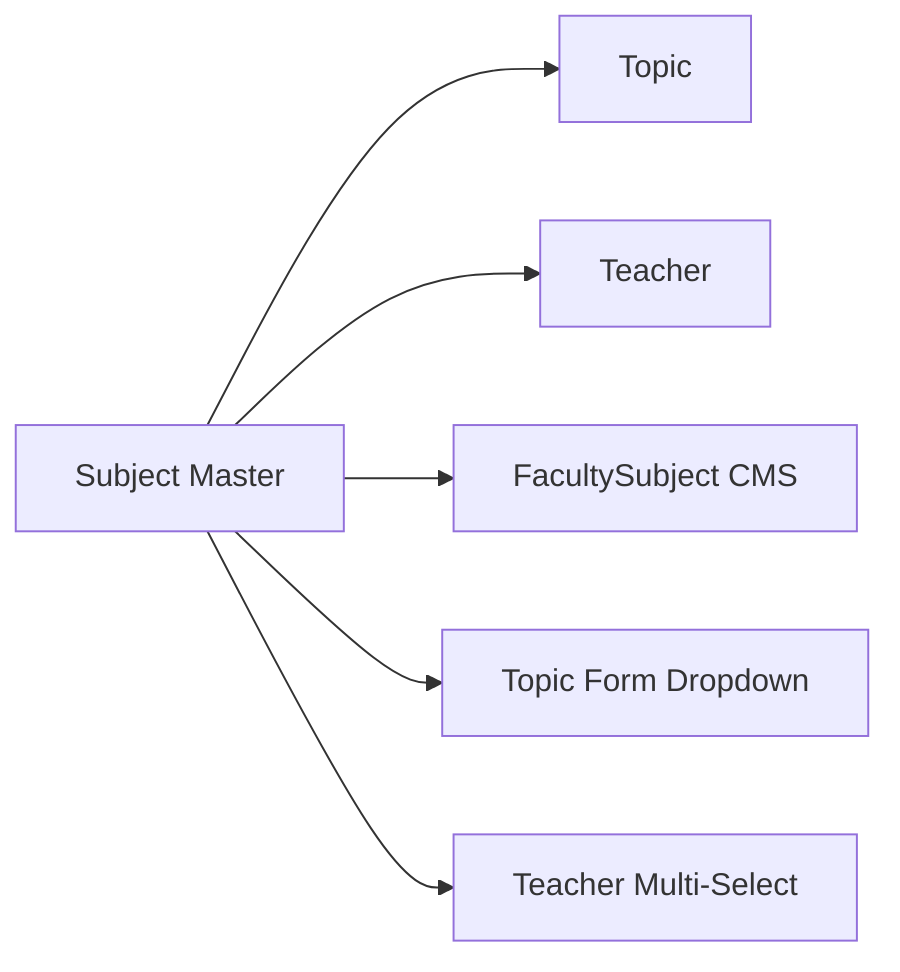
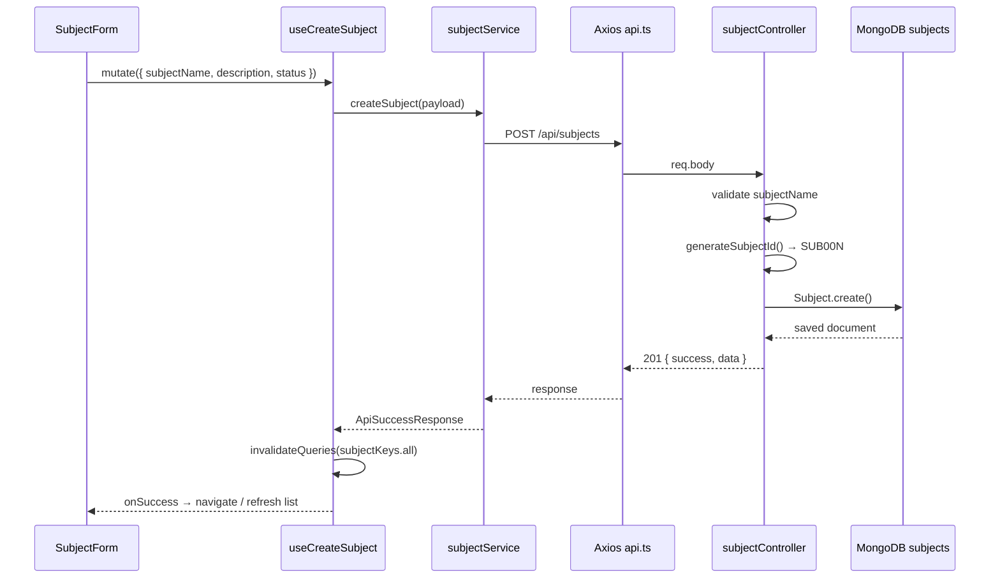

# Subject — Frontend Integration Guide

> **Academics → Categories → Subject**  
> Backend resource: `Subject` · API base: `/api/subjects` · MongoDB collection: `subjects`  
> Admin route (UI): `/academics/categories/subject`

---

## Module Overview

### Purpose

The **Subject** module manages **global content masters** — reusable subject definitions (e.g. Indian Polity, Ethics, Geography) that power the content hierarchy across the LMS. Subjects are **not** scoped to a center, program, or course. They are shared across topics, teachers, faculty-subject assignments, tests, and recordings.

### Position in the Admin Hierarchy

```text
ACADEMIC ERP (center-scoped)
Center → Program → Exam Category → Exam Sub Category → Course → Batch

CONTENT MASTERS (global — this module)
Subject → Topic
Teacher → subjects[] (many-to-many)
FacultySubject → subject (CMS bridge to teacher + topics)
```

The admin sidebar places **Subject** under **Academics → Categories** alongside Programs, Exam Category, Courses, Topic, and Teachers. That navigation grouping is organizational; the Subject API itself has **no** `centerId`, `programId`, or `courseId` fields.

### User Flow

1. Super Admin logs in (`POST /api/auth/login-super-admin`).
2. Opens **Academics → Categories → Subject**.
3. Lists subjects with search, status filter, pagination, and sorting.
4. **Create**: enters subject name, optional description, status → server auto-generates `subjectId` (e.g. `SUB001`).
5. **Edit**: updates name, description, or status.
6. **Toggle status**: `ACTIVE` ↔ `INACTIVE` via `PATCH /api/subjects/status/:id`.
7. **Delete**: soft delete — blocked if active topics still reference the subject.
8. **Detail view**: shows `linkedTopics` and `linkedTeachers` counts.

### Design Rules (from backend)

| Rule | Detail |
|------|--------|
| Global scope | Subjects are not tied to center, program, or exam category |
| Auto ID | `subjectId` is generated server-side (`SUB001`, `SUB002`, …) — never send on create |
| Soft delete | `DELETE` sets `isDeleted: true`, `status: INACTIVE` — record remains in DB |
| Delete guard | Cannot delete while **active** topics exist |
| List counts | `linkedTopics` / `linkedTeachers` are always `0` in list — use detail endpoint for real counts |

---

## Backend Architecture

### Layer Stack

```text
routes/subjectRoutes.js
  └── middleware: protect → requireSuperAdmin (all routes)
  └── controllers/subjectController.js
        └── models/Subject.js (Mongoose)
        └── models/Topic.js (linked count + delete guard)
        └── models/Teacher.js (linked count)
        └── utils/contentIdGenerator.js (generateSubjectId)
        └── utils/contentMastersHelpers.js (pagination, sort, search, NOT_DELETED)
```

There is **no** dedicated `subjectService.js` in the backend. All business logic lives in `subjectController.js`.

### Route Registration

```text
app.js → app.use('/api/subjects', subjectRoutes);
```

**Source files:**

| File | Role |
|------|------|
| `routes/subjectRoutes.js` | Route definitions |
| `controllers/subjectController.js` | CRUD, dropdown, status, soft delete |
| `models/Subject.js` | Schema |
| `middleware/authMiddleware.js` | JWT `protect` |
| `middleware/requireSuperAdmin.js` | Super Admin gate |

### Authentication & Permissions

| Requirement | Value |
|-------------|-------|
| Header | `Authorization: Bearer <JWT>` |
| Role | **Super Admin only** (`protect` + `requireSuperAdmin` on entire router) |
| Login | `POST /api/auth/login-super-admin` |
| 401 | Missing/invalid token |
| 403 | Authenticated but not Super Admin |

---

## API Inventory

| # | Method | Endpoint | Controller | Purpose |
|---|--------|----------|------------|---------|
| 1 | GET | `/api/subjects` | `getSubjects` | Paginated list with search/filter/sort |
| 2 | GET | `/api/subjects/dropdown` | `getSubjectsDropdown` | ACTIVE subjects for dropdowns |
| 3 | GET | `/api/subjects/:id` | `getSubjectById` | Detail with linked counts |
| 4 | POST | `/api/subjects` | `createSubject` | Create subject |
| 5 | PUT | `/api/subjects/:id` | `updateSubject` | Partial update |
| 6 | PATCH | `/api/subjects/status/:id` | `updateSubjectStatus` | Status-only toggle |
| 7 | DELETE | `/api/subjects/:id` | `deleteSubject` | Soft delete |

> **Route order note:** `/dropdown` and `/status/:id` are registered **before** `/:id` to avoid param conflicts.

---

## Request & Response Documentation

### 1. List Subjects

| | |
|---|---|
| **Method** | GET |
| **URL** | `/api/subjects` |
| **Authentication** | Required — Super Admin |
| **Headers** | `Authorization: Bearer <token>`, `Accept: application/json` |

**Query Parameters:**

| Param | Type | Default | Description |
|-------|------|---------|-------------|
| `search` | string | `""` | Case-insensitive match on `subjectName` or `subjectId` |
| `status` | string | — | `ACTIVE` or `INACTIVE` |
| `page` | number | `1` | Page number (min 1) |
| `limit` | number | `10` | Page size (1–100) |
| `sortBy` | string | `createdAt` | Allowed: `createdAt`, `subjectName`, `subjectId`, `status` |
| `sortOrder` | string | `desc` | `asc` or `desc` |

**Success Response (200):**

```json
{
  "success": true,
  "total": 25,
  "page": 1,
  "limit": 10,
  "totalPages": 3,
  "count": 10,
  "data": [
    {
      "_id": "665a1b2c3d4e5f6789012345",
      "subjectId": "SUB001",
      "subjectName": "Indian Polity",
      "description": "Constitution, governance, and polity for UPSC",
      "status": "ACTIVE",
      "linkedTopics": 0,
      "linkedTeachers": 0,
      "createdAt": "2025-06-01T10:00:00.000Z",
      "updatedAt": "2025-06-01T10:00:00.000Z"
    }
  ]
}
```

**Validation Rules:**

- Invalid `sortBy` falls back to `createdAt`.
- Invalid `status` values are ignored (no filter applied).
- `search` is trimmed; empty string matches all.

**Error Responses:**

| Status | Body |
|--------|------|
| 401 | `{ "success": false, "message": "Not authenticated" }` or `"Not authorized, no token"` |
| 403 | `{ "success": false, "message": "Access denied. Super Admin only." }` |
| 500 | `{ "success": false, "message": "Server error", "error": "<details>" }` |

---

### 2. Subjects Dropdown

| | |
|---|---|
| **Method** | GET |
| **URL** | `/api/subjects/dropdown` |
| **Authentication** | Required — Super Admin |

**Query Parameters:** None.

**Success Response (200):**

```json
{
  "success": true,
  "count": 8,
  "data": [
    {
      "_id": "665a1b2c3d4e5f6789012345",
      "subjectId": "SUB001",
      "subjectName": "Indian Polity"
    }
  ]
}
```

**Notes:**

- Returns only `status: ACTIVE` and `isDeleted: false` records.
- Sorted by `subjectName` ascending.
- Used by **Topic** and **Teacher** forms — not required for Subject create/edit.

---

### 3. Get Subject by ID

| | |
|---|---|
| **Method** | GET |
| **URL** | `/api/subjects/:id` |
| **Authentication** | Required — Super Admin |

**URL Params:** `id` — MongoDB `_id` (ObjectId string).

**Success Response (200):**

```json
{
  "success": true,
  "data": {
    "_id": "665a1b2c3d4e5f6789012345",
    "subjectId": "SUB001",
    "subjectName": "Indian Polity",
    "description": "Constitution, governance, and polity for UPSC",
    "status": "ACTIVE",
    "linkedTopics": 5,
    "linkedTeachers": 2,
    "createdAt": "2025-06-01T10:00:00.000Z",
    "updatedAt": "2025-06-01T10:00:00.000Z"
  }
}
```

**Error Responses:**

| Status | Body |
|--------|------|
| 404 | `{ "success": false, "message": "Subject not found" }` |
| 500 | `{ "success": false, "message": "Server error", "error": "..." }` |

---

### 4. Create Subject

| | |
|---|---|
| **Method** | POST |
| **URL** | `/api/subjects` |
| **Authentication** | Required — Super Admin |
| **Headers** | `Content-Type: application/json` |

**Request Payload:**

```json
{
  "subjectName": "Indian Polity",
  "description": "Constitution, governance, and polity for UPSC",
  "status": "ACTIVE"
}
```

| Field | Required | Type | Default | Validation |
|-------|----------|------|---------|------------|
| `subjectName` | **Yes** | string | — | Non-empty after trim |
| `description` | No | string | `""` | Trimmed |
| `status` | No | string | `ACTIVE` | `ACTIVE` or `INACTIVE`; any other value → `ACTIVE` |

**Fields NOT accepted on create:**

- `subjectId` — auto-generated (`SUB001`, `SUB002`, …)
- `centerId`, `programId`, `courseId` — not part of Subject schema
- `createdBy` — not tracked

**Success Response (201):**

```json
{
  "success": true,
  "message": "Subject created successfully",
  "data": {
    "_id": "665a1b2c3d4e5f6789012345",
    "subjectId": "SUB001",
    "subjectName": "Indian Polity",
    "description": "Constitution, governance, and polity for UPSC",
    "status": "ACTIVE",
    "linkedTopics": 0,
    "linkedTeachers": 0,
    "createdAt": "2025-06-01T10:00:00.000Z",
    "updatedAt": "2025-06-01T10:00:00.000Z"
  }
}
```

**Error Responses:**

| Status | Body |
|--------|------|
| 400 | `{ "success": false, "message": "subjectName is required" }` |
| 500 | `{ "success": false, "message": "Server error", "error": "..." }` |

---

### 5. Update Subject

| | |
|---|---|
| **Method** | PUT |
| **URL** | `/api/subjects/:id` |
| **Authentication** | Required — Super Admin |
| **Headers** | `Content-Type: application/json` |

**Request Payload (all fields optional — partial update):**

```json
{
  "subjectName": "Indian Polity & Governance",
  "description": "Updated description",
  "status": "ACTIVE"
}
```

| Field | Required | Validation |
|-------|----------|------------|
| `subjectName` | No | If sent, must be non-empty after trim |
| `description` | No | Trimmed string |
| `status` | No | Must be `ACTIVE` or `INACTIVE` |

**Success Response (200):**

```json
{
  "success": true,
  "message": "Subject updated successfully",
  "data": { /* formatSubject object */ }
}
```

**Error Responses:**

| Status | Body |
|--------|------|
| 400 | `{ "success": false, "message": "subjectName cannot be empty" }` |
| 400 | `{ "success": false, "message": "Status must be ACTIVE or INACTIVE" }` |
| 404 | `{ "success": false, "message": "Subject not found" }` |
| 500 | `{ "success": false, "message": "Server error", "error": "..." }` |

---

### 6. Update Subject Status

| | |
|---|---|
| **Method** | PATCH |
| **URL** | `/api/subjects/status/:id` |
| **Authentication** | Required — Super Admin |
| **Headers** | `Content-Type: application/json` |

**Request Payload:**

```json
{
  "status": "INACTIVE"
}
```

| Field | Required | Validation |
|-------|----------|------------|
| `status` | **Yes** | `ACTIVE` or `INACTIVE` |

**Success Response (200):**

```json
{
  "success": true,
  "message": "Subject status updated",
  "data": { /* formatSubject object */ }
}
```

**Error Responses:**

| Status | Body |
|--------|------|
| 400 | `{ "success": false, "message": "Status must be ACTIVE or INACTIVE" }` |
| 404 | `{ "success": false, "message": "Subject not found" }` |

---

### 7. Delete Subject (Soft Delete)

| | |
|---|---|
| **Method** | DELETE |
| **URL** | `/api/subjects/:id` |
| **Authentication** | Required — Super Admin |

**Success Response (200):**

```json
{
  "success": true,
  "message": "Subject deleted successfully",
  "data": {
    "_id": "665a1b2c3d4e5f6789012345"
  }
}
```

**Side effects on delete:**

- `isDeleted` → `true`
- `deletedAt` → current timestamp
- `status` → `INACTIVE`

**Error Responses:**

| Status | Body |
|--------|------|
| 400 | `{ "success": false, "message": "Cannot delete subject with active topics. Deactivate topics first." }` |
| 404 | `{ "success": false, "message": "Subject not found" }` |
| 500 | `{ "success": false, "message": "Server error", "error": "..." }` |

---

## Database Field Mapping

| Field Name | Data Type | Required | Description | Relationship | Default |
|------------|-----------|----------|-------------|--------------|---------|
| `_id` | ObjectId | Auto | MongoDB primary key | Used in URLs and FK refs | Auto-generated |
| `subjectId` | String | Auto | Human-readable code (`SUB001`) | Unique business ID | Auto-generated on create |
| `subjectName` | String | **Yes** | Display name | — | — |
| `description` | String | No | Free-text description | — | `""` |
| `status` | String (enum) | No | `ACTIVE` \| `INACTIVE` | — | `ACTIVE` |
| `isDeleted` | Boolean | No | Soft-delete flag | — | `false` |
| `deletedAt` | Date | No | Deletion timestamp | — | `null` |
| `createdAt` | Date | Auto | Created timestamp (Mongoose) | — | Auto |
| `updatedAt` | Date | Auto | Updated timestamp (Mongoose) | — | Auto |

### Computed Response Fields (not stored on Subject)

| Field | Source | Available On |
|-------|--------|--------------|
| `linkedTopics` | `Topic.countDocuments({ subject, isDeleted: false })` | Detail only (list returns `0`) |
| `linkedTeachers` | `Teacher.countDocuments({ subjects: subject._id, isDeleted: false })` | Detail only (list returns `0`) |

### Fields NOT in Backend (do not send or expect)

| Frontend Label | Backend Reality |
|----------------|-----------------|
| Subject Code | Use `subjectId` (`SUB001`) — no `subjectCode` field |
| Program | Not on Subject — global master |
| Course | Not on Subject — see `CourseSubject` (separate LMS entity) |
| Exam Category / Sub Category | Not on Subject |
| Center / Batch | Not on Subject |
| Created By | Not tracked on Subject model |

### ID Format

| Entity | Field | Example | Generator |
|--------|-------|---------|-----------|
| Subject | `subjectId` | `SUB001` | `generateSubjectId()` — sequential, zero-padded 3 digits |

---

## Relationship Mapping

### Direct Relationships

| Related Entity | Relationship | Direction | API / Model |
|----------------|--------------|-----------|-------------|
| **Topic** | Parent | Subject ← Topic (`Topic.subject` FK) | `GET /api/topics?subject=:subjectId` |
| **Teacher** | Many-to-many | Teacher.subjects[] contains Subject `_id` | `GET /api/teachers?subject=:subjectId` |
| **FacultySubject** | Reference | `FacultySubject.subject` FK | `GET /api/faculty-subjects` (separate CMS module) |

### Indirect / No Direct FK

| Entity | Relationship to Subject |
|--------|-------------------------|
| **Program** | None — academic ERP layer is separate |
| **Course** | None on Subject master; `CourseSubject` is a different LMS model under `/api/course-subjects` |
| **Exam Category** | None |
| **Exam Sub Category** | None |
| **Batch** | None — batches link to courses and faculty-subjects, not global subjects |
| **Center** | None on Subject; teachers are center-scoped and link to subjects via `Teacher.subjects[]` |

### Downstream Impact Diagram



---

## Frontend Architecture Guide

### Directory Structure

```text
src/
├── services/
│   ├── api.ts                    # Centralized Axios instance
│   └── subjectService.ts         # Subject API methods
├── hooks/
│   ├── queryKeys.ts              # Add subjectKeys
│   ├── useSubjects.ts            # List query
│   ├── useSubject.ts             # Detail query (recommended)
│   ├── useCreateSubject.ts       # Create mutation
│   ├── useUpdateSubject.ts       # Update mutation
│   ├── useDeleteSubject.ts       # Delete mutation
│   └── useToggleSubjectStatus.ts # Status mutation (recommended)
├── types/
│   └── subject.types.ts          # TypeScript interfaces
├── pages/
│   └── academics/
│       └── subject/
│           ├── SubjectListPage.tsx
│           ├── SubjectFormPage.tsx
│           └── SubjectDetailPage.tsx
└── components/
    └── academics/
        └── subject/
            ├── SubjectTable.tsx
            ├── SubjectForm.tsx
            ├── SubjectStatusBadge.tsx
            └── SubjectDeleteDialog.tsx
```

---

## Centralized API Layer

Use the existing `src/services/api.ts` pattern. **Never** hardcode URLs or use localhost/Render URLs in source code.

### Environment Variables

| Variable | Purpose |
|----------|---------|
| `VITE_API_BASE_URL` | Backend base URL (e.g. `https://your-api.example.com`) |
| `VITE_AUTH_TOKEN_KEY` | localStorage key for JWT (default: `authToken`) |

### `api.ts` Requirements (already implemented)

| Feature | Implementation |
|---------|----------------|
| Single Axios instance | `axios.create({ baseURL: import.meta.env.VITE_API_BASE_URL })` |
| Request interceptor | Attaches `Authorization: Bearer <token>` |
| Response interceptor | Dispatches `auth:unauthorized` on 401 |
| Global error handling | `handleApiError()` from `utils/errorHandler.ts` |
| Timeout | 30 seconds |

---

## Service Layer Documentation

### `src/types/subject.types.ts`

```typescript
import type { PaginatedQuery } from './api';

export type SubjectStatus = 'ACTIVE' | 'INACTIVE';

export interface Subject {
  _id: string;
  subjectId: string;
  subjectName: string;
  description: string;
  status: SubjectStatus;
  linkedTopics: number;
  linkedTeachers: number;
  createdAt?: string;
  updatedAt?: string;
}

export interface SubjectDropdownItem {
  _id: string;
  subjectId: string;
  subjectName: string;
}

export interface SubjectListParams extends PaginatedQuery {
  status?: SubjectStatus;
}

export interface CreateSubjectPayload {
  subjectName: string;
  description?: string;
  status?: SubjectStatus;
}

export interface UpdateSubjectPayload {
  subjectName?: string;
  description?: string;
  status?: SubjectStatus;
}
```

### `src/services/subjectService.ts`

```typescript
import api from './api';
import { stripEmptyParams } from './commonService';
import type { ApiSuccessResponse } from '../types/api';
import type {
  CreateSubjectPayload,
  Subject,
  SubjectDropdownItem,
  SubjectListParams,
  SubjectStatus,
  UpdateSubjectPayload,
} from '../types/subject.types';

const SUBJECTS_BASE = '/api/subjects';

type PaginatedSubjectsResponse = ApiSuccessResponse<Subject[]> & {
  total: number;
  page: number;
  limit: number;
  totalPages: number;
  count: number;
};

export const subjectService = {
  /** GET /api/subjects — paginated list */
  getSubjects: async (params?: SubjectListParams) => {
    const { data } = await api.get<PaginatedSubjectsResponse>(SUBJECTS_BASE, {
      params: stripEmptyParams(params),
    });
    return data;
  },

  /** GET /api/subjects/dropdown — ACTIVE subjects for child forms */
  getSubjectsDropdown: async () => {
    const { data } = await api.get<ApiSuccessResponse<SubjectDropdownItem[]>>(
      `${SUBJECTS_BASE}/dropdown`
    );
    return data;
  },

  /** GET /api/subjects/:id */
  getSubjectById: async (id: string) => {
    const { data } = await api.get<ApiSuccessResponse<Subject>>(`${SUBJECTS_BASE}/${id}`);
    return data;
  },

  /** POST /api/subjects */
  createSubject: async (payload: CreateSubjectPayload) => {
    const { data } = await api.post<ApiSuccessResponse<Subject>>(SUBJECTS_BASE, payload);
    return data;
  },

  /** PUT /api/subjects/:id */
  updateSubject: async (id: string, payload: UpdateSubjectPayload) => {
    const { data } = await api.put<ApiSuccessResponse<Subject>>(
      `${SUBJECTS_BASE}/${id}`,
      payload
    );
    return data;
  },

  /** PATCH /api/subjects/status/:id */
  updateSubjectStatus: async (id: string, status: SubjectStatus) => {
    const { data } = await api.patch<ApiSuccessResponse<Subject>>(
      `${SUBJECTS_BASE}/status/${id}`,
      { status }
    );
    return data;
  },

  /** DELETE /api/subjects/:id — soft delete */
  deleteSubject: async (id: string) => {
    const { data } = await api.delete<ApiSuccessResponse<{ _id: string }>>(
      `${SUBJECTS_BASE}/${id}`
    );
    return data;
  },
};

export default subjectService;
```

### API Mapping Table

| UI Action | Service Method | HTTP | Endpoint |
|-----------|----------------|------|----------|
| List | `getSubjects(params)` | GET | `/api/subjects` |
| Dropdown | `getSubjectsDropdown()` | GET | `/api/subjects/dropdown` |
| Detail | `getSubjectById(id)` | GET | `/api/subjects/:id` |
| Create | `createSubject(payload)` | POST | `/api/subjects` |
| Update | `updateSubject(id, payload)` | PUT | `/api/subjects/:id` |
| Toggle status | `updateSubjectStatus(id, status)` | PATCH | `/api/subjects/status/:id` |
| Delete | `deleteSubject(id)` | DELETE | `/api/subjects/:id` |

---

## React Query Integration

### Query Keys (`src/hooks/queryKeys.ts`)

Add to existing `queryKeys.ts`:

```typescript
import type { SubjectListParams } from '../types/subject.types';

export const subjectKeys = {
  all: ['subjects'] as const,
  lists: () => [...subjectKeys.all, 'list'] as const,
  list: (params?: SubjectListParams) => [...subjectKeys.lists(), params ?? {}] as const,
  details: () => [...subjectKeys.all, 'detail'] as const,
  detail: (id: string) => [...subjectKeys.details(), id] as const,
  dropdown: () => [...subjectKeys.all, 'dropdown'] as const,
};
```

### `useSubjects.ts`

```typescript
import { useQuery, type UseQueryOptions } from '@tanstack/react-query';
import { subjectService } from '../services/subjectService';
import { subjectKeys } from './queryKeys';
import type { ApiSuccessResponse } from '../types/api';
import type { Subject, SubjectListParams } from '../types/subject.types';

type SubjectsResponse = ApiSuccessResponse<Subject[]> & {
  total: number;
  page: number;
  limit: number;
  totalPages: number;
  count: number;
};

export const useSubjects = (
  params?: SubjectListParams,
  options?: Omit<UseQueryOptions<SubjectsResponse>, 'queryKey' | 'queryFn'>
) =>
  useQuery({
    queryKey: subjectKeys.list(params),
    queryFn: () => subjectService.getSubjects(params),
    ...options,
  });
```

### `useSubject.ts` (detail)

```typescript
import { useQuery, type UseQueryOptions } from '@tanstack/react-query';
import { subjectService } from '../services/subjectService';
import { subjectKeys } from './queryKeys';
import type { ApiSuccessResponse } from '../types/api';
import type { Subject } from '../types/subject.types';

export const useSubject = (
  id: string | undefined,
  options?: Omit<UseQueryOptions<ApiSuccessResponse<Subject>>, 'queryKey' | 'queryFn'>
) =>
  useQuery({
    queryKey: subjectKeys.detail(id ?? ''),
    queryFn: () => subjectService.getSubjectById(id!),
    enabled: Boolean(id),
    ...options,
  });
```

### `useCreateSubject.ts`

```typescript
import { useMutation, useQueryClient } from '@tanstack/react-query';
import { subjectService } from '../services/subjectService';
import { subjectKeys } from './queryKeys';
import { handleApiError } from '../utils/errorHandler';
import type { CreateSubjectPayload } from '../types/subject.types';

export const useCreateSubject = () => {
  const queryClient = useQueryClient();

  return useMutation({
    mutationFn: (payload: CreateSubjectPayload) => subjectService.createSubject(payload),
    onSuccess: () => {
      queryClient.invalidateQueries({ queryKey: subjectKeys.all });
    },
    onError: (error) => handleApiError(error),
  });
};
```

### `useUpdateSubject.ts`

```typescript
import { useMutation, useQueryClient } from '@tanstack/react-query';
import { subjectService } from '../services/subjectService';
import { subjectKeys } from './queryKeys';
import { handleApiError } from '../utils/errorHandler';
import type { UpdateSubjectPayload } from '../types/subject.types';

export const useUpdateSubject = () => {
  const queryClient = useQueryClient();

  return useMutation({
    mutationFn: ({ id, payload }: { id: string; payload: UpdateSubjectPayload }) =>
      subjectService.updateSubject(id, payload),
    onSuccess: (_data, variables) => {
      queryClient.invalidateQueries({ queryKey: subjectKeys.all });
      queryClient.invalidateQueries({ queryKey: subjectKeys.detail(variables.id) });
    },
    onError: (error) => handleApiError(error),
  });
};
```

### `useDeleteSubject.ts`

```typescript
import { useMutation, useQueryClient } from '@tanstack/react-query';
import { subjectService } from '../services/subjectService';
import { subjectKeys } from './queryKeys';
import { handleApiError } from '../utils/errorHandler';

export const useDeleteSubject = () => {
  const queryClient = useQueryClient();

  return useMutation({
    mutationFn: (id: string) => subjectService.deleteSubject(id),
    onSuccess: (_data, id) => {
      queryClient.invalidateQueries({ queryKey: subjectKeys.all });
      queryClient.removeQueries({ queryKey: subjectKeys.detail(id) });
    },
    onError: (error) => handleApiError(error),
  });
};
```

### `useToggleSubjectStatus.ts` (optimistic updates)

```typescript
import { useMutation, useQueryClient } from '@tanstack/react-query';
import { subjectService } from '../services/subjectService';
import { subjectKeys } from './queryKeys';
import { handleApiError } from '../utils/errorHandler';
import type { ApiSuccessResponse } from '../types/api';
import type { Subject, SubjectStatus } from '../types/subject.types';

export const useToggleSubjectStatus = () => {
  const queryClient = useQueryClient();

  return useMutation({
    mutationFn: ({ id, status }: { id: string; status: SubjectStatus }) =>
      subjectService.updateSubjectStatus(id, status),
    onMutate: async ({ id, status }) => {
      await queryClient.cancelQueries({ queryKey: subjectKeys.detail(id) });
      const previous = queryClient.getQueryData<ApiSuccessResponse<Subject>>(
        subjectKeys.detail(id)
      );
      if (previous?.data) {
        queryClient.setQueryData(subjectKeys.detail(id), {
          ...previous,
          data: { ...previous.data, status },
        });
      }
      return { previous };
    },
    onError: (error, variables, context) => {
      if (context?.previous) {
        queryClient.setQueryData(subjectKeys.detail(variables.id), context.previous);
      }
      handleApiError(error);
    },
    onSettled: (_data, _error, variables) => {
      queryClient.invalidateQueries({ queryKey: subjectKeys.all });
      queryClient.invalidateQueries({ queryKey: subjectKeys.detail(variables.id) });
      queryClient.invalidateQueries({ queryKey: subjectKeys.dropdown() });
    },
  });
};
```

### React Query Behavior Summary

| Concern | Implementation |
|---------|----------------|
| **useQuery** | `useSubjects`, `useSubject` |
| **useMutation** | `useCreateSubject`, `useUpdateSubject`, `useDeleteSubject`, `useToggleSubjectStatus` |
| **Cache invalidation** | `subjectKeys.all` after create/update/delete; `subjectKeys.detail(id)` after update |
| **Refetching** | `refetch()` on list query for manual refresh button |
| **Loading states** | `isLoading`, `isFetching`, `isPending` from hooks |
| **Error states** | `isError`, `error` + `handleApiError()` in mutation `onError` |
| **Optimistic updates** | Status toggle via `onMutate` / rollback on `onError` |

---

## Table Integration Guide

### List Page State

```typescript
const [page, setPage] = useState(1);
const [search, setSearch] = useState('');
const [statusFilter, setStatusFilter] = useState<SubjectStatus | undefined>();
const [sortBy, setSortBy] = useState<'createdAt' | 'subjectName' | 'subjectId' | 'status'>('createdAt');
const [sortOrder, setSortOrder] = useState<'asc' | 'desc'>('desc');

const debouncedSearch = useDebouncedValue(search, 300);

const { data, isLoading, isFetching, refetch } = useSubjects({
  page,
  limit: 10,
  search: debouncedSearch,
  status: statusFilter,
  sortBy,
  sortOrder,
});
```

### Column Mapping (actual backend fields)

| UI Column | Backend Field | Sortable | Notes |
|-----------|---------------|----------|-------|
| ID | `subjectId` | Yes (`sortBy=subjectId`) | Display `SUB001` — not MongoDB `_id` |
| Subject Name | `subjectName` | Yes | Primary label |
| Subject Code | `subjectId` | Yes | **No separate `subjectCode`** — use `subjectId` |
| Program | — | No | **Not available** — omit column or show "—" |
| Course | — | No | **Not available** — omit column or show "—" |
| Status | `status` | Yes | Badge: `ACTIVE` / `INACTIVE` |
| Linked Topics | `linkedTopics` | No | Always `0` in list — fetch detail for real count |
| Linked Teachers | `linkedTeachers` | No | Always `0` in list — fetch detail for real count |
| Created By | — | No | **Not tracked** — omit column |
| Created At | `createdAt` | Yes (`sortBy=createdAt`) | Format with locale |
| Updated At | `updatedAt` | No | Not in allowed `sortBy` list |
| Actions | — | — | Edit, Toggle Status, Delete |

### Search

- Bind search input to `search` query param.
- Backend matches `subjectName` OR `subjectId` (case-insensitive).
- Debounce 300ms before updating query key.

### Pagination

```typescript
const total = data?.total ?? 0;
const totalPages = data?.totalPages ?? 0;
// page, limit from response mirror request
```

### Filtering

| Filter | Query Param | Values |
|--------|-------------|--------|
| Status | `status` | `ACTIVE`, `INACTIVE`, or omit for all |

> Subject list has **no** center/program/course filters — those belong to Exam Category, not Subject.

### Sorting

| Column Click | `sortBy` | `sortOrder` |
|--------------|----------|-------------|
| Subject Name | `subjectName` | toggle `asc`/`desc` |
| Subject ID | `subjectId` | toggle |
| Status | `status` | toggle |
| Created At | `createdAt` | toggle (default) |

### Refresh

```typescript
<Button onClick={() => refetch()} disabled={isFetching}>
  {isFetching ? 'Refreshing…' : 'Refresh'}
</Button>
```

### Row Actions

| Action | Hook | Confirmation |
|--------|------|--------------|
| Edit | Navigate to form with `_id` | — |
| Toggle Status | `useToggleSubjectStatus` | Optional confirm for INACTIVE |
| Delete | `useDeleteSubject` | Confirm dialog; show linked topic warning from detail |

---

## Form Integration Guide

The Subject create/edit form is **simple** — no cascading dropdowns for Program, Course, or Center.

### Field Mapping

| Backend Field | Frontend Component | Validation | Required | Default |
|---------------|-------------------|------------|----------|---------|
| `subjectName` | Text Input | Non-empty, trimmed, max reasonable length (UI) | **Yes** | `""` |
| `description` | Textarea | Optional string | No | `""` |
| `status` | Select / Toggle | `ACTIVE` \| `INACTIVE` | No | `ACTIVE` |
| `subjectId` | Read-only (edit only) | Server-generated | N/A | Shown after create |

### Fields NOT on Subject Form

| Requested Field | Action |
|-----------------|--------|
| Subject Code input | **Do not add** — display auto-generated `subjectId` as read-only |
| Program dropdown | **Not used** — no backend field |
| Course dropdown | **Not used** — no backend field |
| Center dropdown | **Not used** — no backend field |
| Category / Sub Category | **Not used** — no backend field |

### Create Form Submit

```typescript
const createMutation = useCreateSubject();

const onSubmit = (values: CreateSubjectPayload) => {
  createMutation.mutate(
    {
      subjectName: values.subjectName.trim(),
      description: values.description?.trim() ?? '',
      status: values.status ?? 'ACTIVE',
    },
    {
      onSuccess: () => navigate('/academics/categories/subject'),
    }
  );
};
```

### Edit Form Load

```typescript
const { data, isLoading } = useSubject(subjectId);
const subject = data?.data;

// Populate: subjectName, description, status
// Display read-only: subjectId, linkedTopics, linkedTeachers
```

### Edit Form Submit

```typescript
const updateMutation = useUpdateSubject();

updateMutation.mutate({
  id: subjectId,
  payload: {
    subjectName: values.subjectName.trim(),
    description: values.description?.trim(),
    status: values.status,
  },
});
```

### Client-Side Validation (mirror backend)

```typescript
const subjectSchema = z.object({
  subjectName: z.string().trim().min(1, 'Subject name is required'),
  description: z.string().optional(),
  status: z.enum(['ACTIVE', 'INACTIVE']).default('ACTIVE'),
});
```

---

## Dropdown API Guide

### Subject Module — Own Dropdown

| Dropdown | Method | Endpoint | Auth | Returns |
|----------|--------|----------|------|---------|
| Subjects (ACTIVE) | GET | `/api/subjects/dropdown` | Super Admin | `_id`, `subjectId`, `subjectName` |

**Used by:** Topic create/edit (parent subject), Teacher multi-select, Faculty Subject CMS.

**NOT used by:** Subject create/edit form (no parent entity).

### Sibling Module Dropdowns (Categories menu — NOT for Subject CRUD)

These APIs exist in the backend but are **not consumed** by the Subject module form. Documented here for cross-module context:

| Dropdown | Method | Endpoint | Used By Module |
|----------|--------|----------|----------------|
| Centers | GET | `/api/admin/centers/dropdown` | Programs, Exam Category, Teachers |
| Programs by center | GET | `/api/programs/by-center/:centerId` | Exam Category, Courses |
| Exam Categories filter | GET | `/api/categories/filter?centerId=&programId=` | Exam Sub Category, Courses |
| Exam Sub Categories filter | GET | `/api/sub-categories/filter` | Courses |
| Courses | GET | `/api/courses/dropdown` | Batch create |
| Teachers | GET | `/api/teachers/dropdown` | Faculty Subject CMS |
| Topics by subject | GET | `/api/topics/by-subject/:subjectId` | Faculty Subject, recordings |
| Faculty Subjects | GET/POST | `/api/faculty-subjects/dropdown` | Batch create |
| Batches | POST | `/api/batches/dropdown` | Batch filters |
| Classrooms | GET | `/api/classrooms/dropdown` | Live classes |

### Status Values (all dropdowns / forms)

| Value | Meaning |
|-------|---------|
| `ACTIVE` | Visible, selectable in child dropdowns |
| `INACTIVE` | Hidden from `/dropdown`; still in list with filter |

---

## Server Save Flow

### Create Flow



| Step | API | Persists |
|------|-----|----------|
| Create | `POST /api/subjects` | New row in `subjects` collection |
| Update | `PUT /api/subjects/:id` | Updates `subjectName`, `description`, `status` |
| Status | `PATCH /api/subjects/status/:id` | Updates `status` only |
| Delete | `DELETE /api/subjects/:id` | Soft delete: `isDeleted`, `deletedAt`, `status=INACTIVE` |
| List | `GET /api/subjects` | Reads non-deleted subjects |

### Data Persistence Verification

After create, verify persistence:

1. `POST /api/subjects` returns `201` with `data._id` and `data.subjectId`.
2. `GET /api/subjects/:id` returns the same record.
3. `GET /api/subjects` includes the new row (may need page navigation).
4. `GET /api/subjects/dropdown` includes the row when `status: ACTIVE`.
5. React Query list refetches after `invalidateQueries({ queryKey: subjectKeys.all })`.

---

## Error Handling

### HTTP Status Reference

| Status | When | Actual Response Shape | Frontend Action |
|--------|------|----------------------|-----------------|
| **400** | Missing `subjectName`, empty name on update, invalid status, delete with active topics | `{ "success": false, "message": "<reason>" }` | Show `message` in form toast/alert |
| **401** | No/invalid JWT | `{ "success": false, "message": "Not authorized, no token" }` or `"Not authenticated"` | Clear token, redirect login; `auth:unauthorized` event |
| **403** | Non–Super Admin | `{ "success": false, "message": "Access denied. Super Admin only." }` | Show permission error |
| **404** | Subject not found (get/update/delete/status) | `{ "success": false, "message": "Subject not found" }` | Redirect to list or show not-found state |
| **409** | — | **Not used** by Subject controller | N/A for this module |
| **422** | — | **Not used** — Subject uses plain `400` for validation | N/A for this module |
| **500** | Unhandled server error | `{ "success": false, "message": "Server error", "error": "<details>" }` | Generic error toast via `handleApiError` |
| **Network** | Offline, timeout, DNS | Axios `Network Error` / `ECONNABORTED` | `parseApiError` → "Unable to connect to server" |

### Known 400 Messages

```json
{ "success": false, "message": "subjectName is required" }
{ "success": false, "message": "subjectName cannot be empty" }
{ "success": false, "message": "Status must be ACTIVE or INACTIVE" }
{ "success": false, "message": "Cannot delete subject with active topics. Deactivate topics first." }
```

### Error Handler Integration

```typescript
import { handleApiError, parseApiError } from '../utils/errorHandler';

// In mutation onError:
onError: (error) => {
  const parsed = handleApiError(error);
  // parsed.message is user-facing
  // parsed.statusCode for conditional UI
};
```

### Delete Error UX

When delete returns 400 with active topics message:

1. Fetch `useSubject(id)` to show `linkedTopics` count.
2. Link user to **Academics → Categories → Topic** filtered by this subject.
3. Suggest deactivating topics first (`PATCH /api/topics/status/:id`).

---

## Production Readiness Checklist

| # | Item | Verification |
|---|------|--------------|
| ✓ | Create Subject | `POST /api/subjects` → 201; row in list |
| ✓ | Update Subject | `PUT /api/subjects/:id` → 200; changes reflected |
| ✓ | Delete Subject | `DELETE /api/subjects/:id` → 200; removed from list |
| ✓ | Search Works | `search` param matches name and `subjectId` |
| ✓ | Filters Work | `status=ACTIVE` / `INACTIVE` filters list |
| ✓ | Pagination Works | `page`, `limit`, `total`, `totalPages` wired to UI |
| ✓ | Sorting Works | `sortBy` + `sortOrder` on all four allowed fields |
| ✓ | Dropdown APIs Connected | `GET /api/subjects/dropdown` for child modules (Topic, Teacher) |
| ✓ | Data Saved In Database | Create → GET by id returns same payload |
| ✓ | Data Retrieved From Server | List/detail load from API, not mock data |
| ✓ | React Query Cache Updated | `invalidateQueries(subjectKeys.all)` after mutations |
| ✓ | UI Refreshes Automatically | List refetches after create/update/delete |
| ✓ | No Hardcoded URLs | All requests via `VITE_API_BASE_URL` |
| ✓ | Environment Variables Used | `.env` has `VITE_API_BASE_URL`, `VITE_AUTH_TOKEN_KEY` |
| ✓ | API Errors Handled | 400/401/403/404/500 + network via `handleApiError` |
| ✓ | Status Toggle | `PATCH /api/subjects/status/:id` works independently |
| ✓ | Delete Guard | Active topics block delete with clear message |
| ✓ | Auto subjectId | UI shows server-generated `SUB00N` — never user-entered |

---

## Quick Reference

| Resource | Base Path |
|----------|-----------|
| Subjects | `/api/subjects` |
| Topics (child) | `/api/topics` |
| Teachers (related) | `/api/teachers` |
| Auth | `/api/auth/login-super-admin` |

### Related Backend Docs

| Document | Content |
|----------|---------|
| `SUBJECT_TOPIC_TEACHER_API_GUIDE.md` | Authoritative API examples for Subject, Topic, Teacher |
| `docs/academics/exam-category-integration-guide.md` | Sibling module pattern reference |
| `docs/frontend-architecture.md` | Shared React Query / service architecture |
| `qa-audit/output/academics/ACADEMICS_AUDIT_REPORT.md` | Confirms `GET /api/subjects` returns 200 in production |

---

*Generated from backend source analysis — `routes/subjectRoutes.js`, `controllers/subjectController.js`, `models/Subject.js`. No backend code was modified.*
