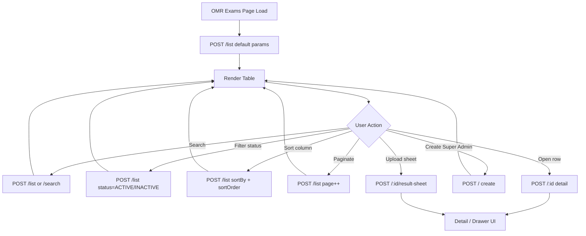
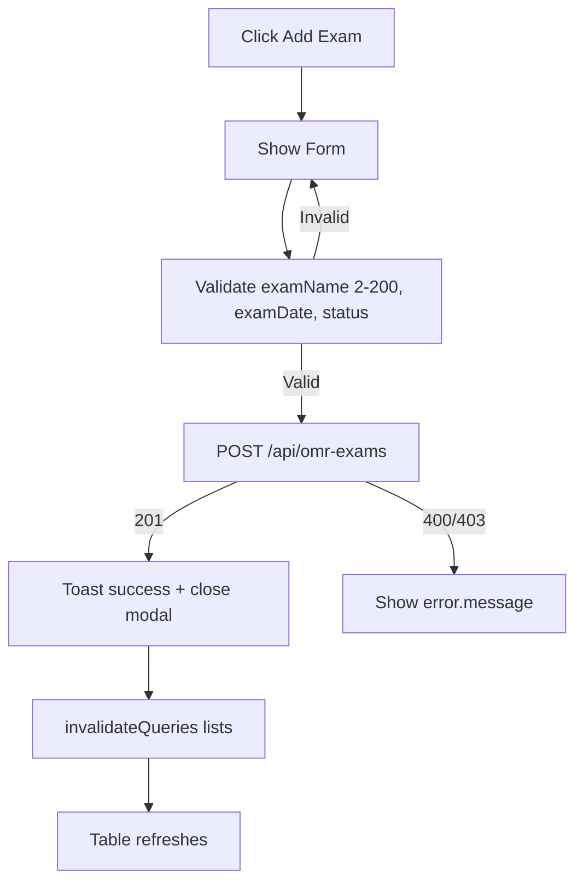
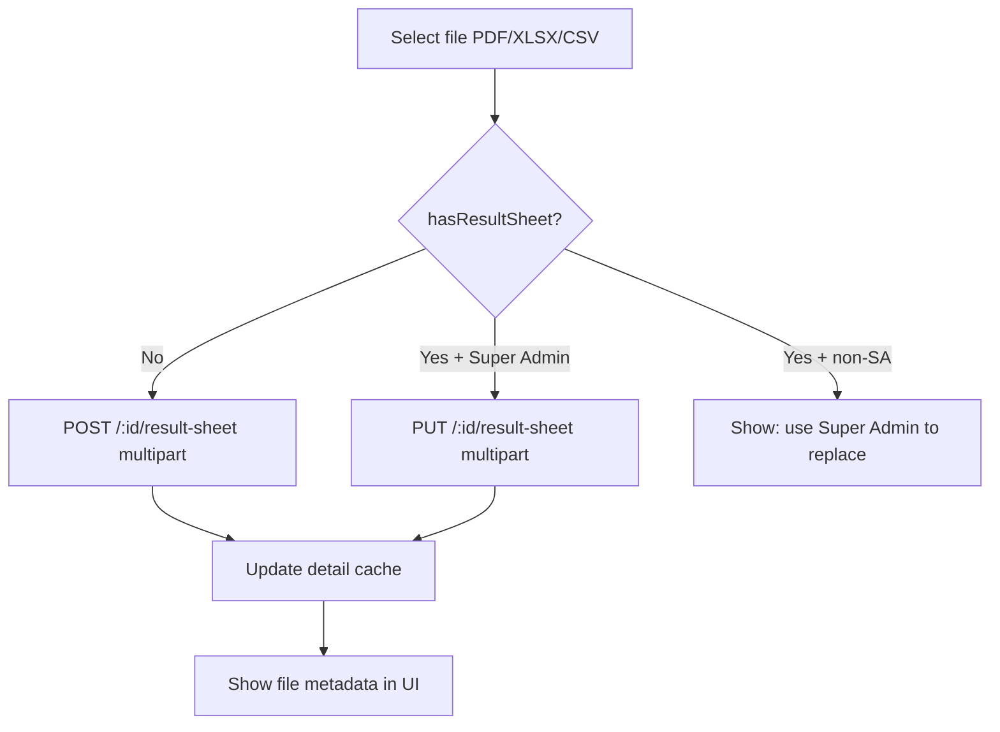
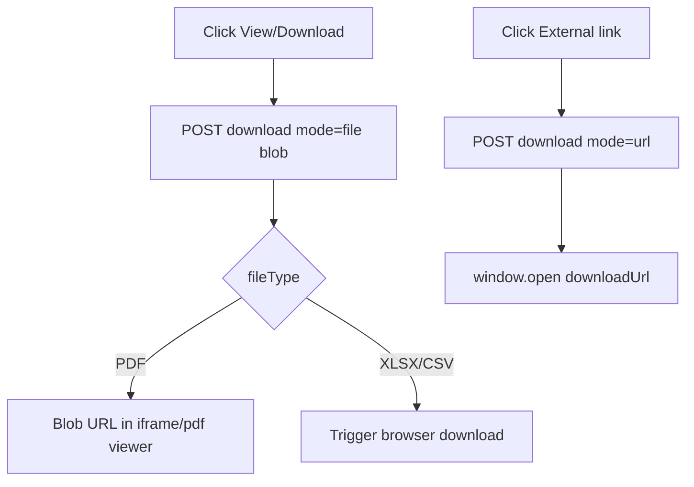
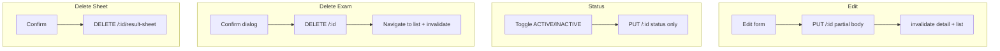
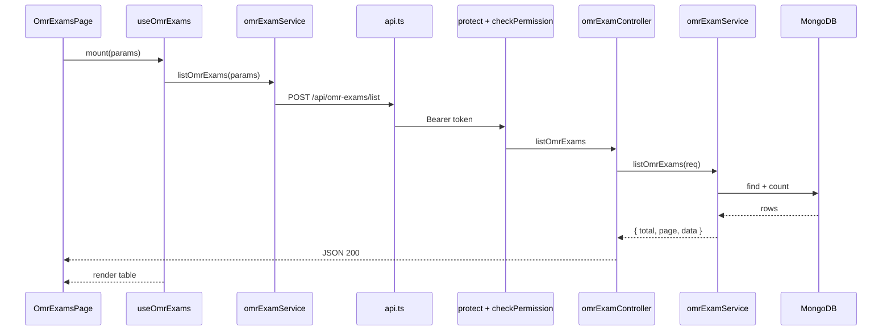
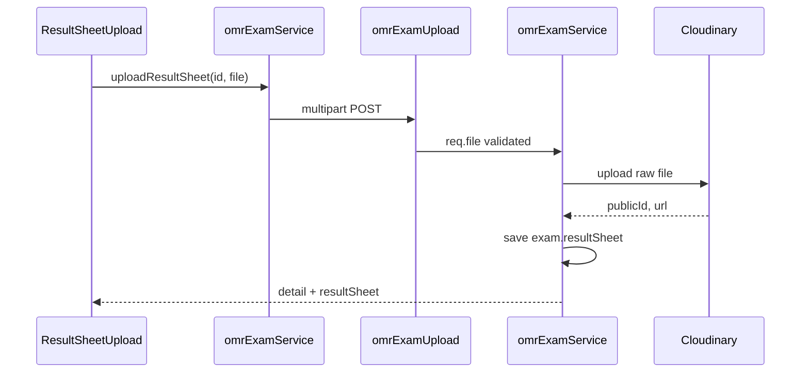
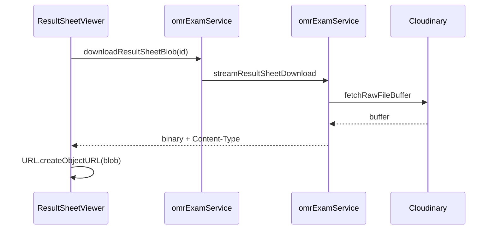

# Test Management → CBT Management → OMR Exams — Frontend Integration Guide

**Audience:** React + Vite frontend developers integrating the **OMR Exams** module under **Test Management → CBT Management → OMR Exams**.

**Backend module:** **OMR Exams** (`OmrExam` model, `omrExamController`, `omrExamService`, `omrExamRoutes`).

**Base path:** `{VITE_API_BASE_URL}/api/omr-exams`

**Suggested frontend route:** `/test-management/cbt-management/omr-exams`

**Auth:** `Authorization: Bearer <token>` on every request.

**Permission module:** Admin Access → **Test Management** → **OMR Management** (`featureKey: OMR_MANAGEMENT`).

**Reference Postman collection:** `OMR_MANAGEMENT_POSTMAN_COLLECTION.json` (repo root).

---

## Critical naming distinction

| Layer | Name | Notes |
|-------|------|-------|
| Frontend page | **OMR Exams** | UI under Test Management → CBT Management |
| Backend model | **OmrExam** | MongoDB collection for offline OMR exam records |
| API path `:id` | MongoDB `_id` | Use `_id` from list/create/detail for all `:id` routes |
| Permission feature | `OMR_MANAGEMENT` | Derived from feature title `"OMR Management"` |
| Result file field | `file` | Multipart form field name (not `resultSheet`) |

**Not the same as:**

- **CBT / online test exams** (`/api/test-exams`, LMS tests)
- **Test results** (`/api/test-results`)
- **Question bank / evaluations** (separate Test Management modules)

---

## 1. Module Overview

### Purpose

The **OMR Exams** module manages **offline OMR (Optical Mark Recognition) exam records** for the admin panel. Each record represents a named offline test with an exam date, active/inactive status, and an optional **result sheet** file (PDF, XLSX, or CSV) uploaded to Cloudinary.

This module is **admin-centric record + file management**. It does **not** implement online CBT delivery, OMR sheet scanning, answer-key configuration, automated evaluation, student attempts, statistics dashboards, or import/export pipelines in the current backend.

### What each record contains

| Field (API) | Description |
|-------------|-------------|
| `examName` | Display name of the offline exam |
| `examDate` | Scheduled/conducted date |
| `status` | `ACTIVE` or `INACTIVE` |
| `hasResultSheet` | Boolean — whether a result file exists (list/detail) |
| `resultSheet` | Nested object with file metadata + `downloadUrl` (detail only) |
| `createdDate` / `createdAt` | Record creation timestamp |
| `uploadDate` | Result sheet upload timestamp (null if none) |

### Admin flow

```
Login (Admin with OMR Management permission OR Super Admin)
  → Navigate to OMR Exams list
  → View paginated table (POST /list)
  → Optional: search by exam name, filter by status, sort, paginate
  → Super Admin: Create exam (POST /)
  → Super Admin: Edit exam name / date / status (PUT /:id)
  → Admin with permission: Upload result sheet (POST /:id/result-sheet) — first upload only
  → Super Admin: Replace result sheet (PUT /:id/result-sheet)
  → Any permitted admin: Download result sheet (POST /:id/result-sheet/download)
  → Super Admin: Delete result sheet (DELETE /:id/result-sheet)
  → Super Admin: Delete entire exam (DELETE /:id) — also removes Cloudinary file
```

### User / student flow

**Not implemented in this backend module.** There are no student-facing attempt, submission, or result-view APIs under `/api/omr-exams`. Student result delivery (if any) would be handled outside this module.

### Frontend interaction lifecycle

```
App load → Auth token available
  → Permission gate (OMR_MANAGEMENT or Super Admin)
  → List page mounts → POST /list
  → User searches → POST /list with search OR POST /search (dedicated typeahead)
  → User opens detail → POST /:id
  → Create/Edit modal (Super Admin) → POST / or PUT /:id
  → Upload widget → multipart POST /:id/result-sheet
  → Preview/download → POST /:id/result-sheet/download { mode: "file" | "url" }
  → Delete actions (Super Admin) → DELETE endpoints + invalidateQueries
```

### Features supported vs not supported

| Feature | Supported |
|---------|-----------|
| Create OMR exam | Yes — Super Admin only |
| List (paginated) | Yes — OMR Management permission |
| Search by exam name | Yes — via `/list` or `/search` |
| Get by ID | Yes — `POST /:id` |
| Update exam fields | Yes — Super Admin only |
| Delete exam | Yes — Super Admin only (hard delete) |
| Upload result sheet | Yes — first upload; OMR permission |
| Replace result sheet | Yes — Super Admin only |
| Delete result sheet | Yes — Super Admin only |
| Download result sheet (URL) | Yes |
| Download result sheet (stream) | Yes — `mode: "file"` |
| Status ACTIVE / INACTIVE | Yes — via create/update |
| Sorting | Yes — list endpoint only |
| Pagination | Yes — max 100 per page |
| Dropdown API | **No** |
| Publish / draft workflow | **No** — use `status` only |
| Answer key | **No** |
| OMR sheet processing / scanning | **No** |
| Student attempts | **No** |
| Evaluation | **No** |
| Statistics / reports | **No** |
| Import / export | **No** |
| Bulk actions | **No** |
| Soft delete | **No** — hard delete |
| Audit log (dedicated) | **No** OMR-specific audit hooks |

---

## 2. Backend Architecture Overview

### Request flow

```
HTTP Request
  ↓
app.js  →  app.use('/api/omr-exams', omrExamRoutes)
  ↓
routes/omrExamRoutes.js  →  middleware chain + Joi validation
  ↓
controllers/omrExamController.js  →  try/catch, HTTP status, JSON shape
  ↓
services/omrExamService.js  →  business rules, pagination, Cloudinary
  ↓
models/OmrExam.js  →  MongoDB (Mongoose)
  ↓
Response JSON (or binary stream for file download)
```

### Middleware chains

| Chain | Middleware | Used for |
|-------|------------|----------|
| `omrAuth` | `protect` → `checkPermission('TEST_MANAGEMENT', 'OMR_MANAGEMENT')` | List, search, get, upload (first), download |
| `omrSuperAdminAuth` | `protect` → `requireSuperAdmin` | Create, update, delete exam; replace/delete result sheet |

**Super Admin bypass:** `checkPermission` allows Super Admin through without matrix lookup.

### Authentication flow

1. Client sends `Authorization: Bearer <JWT>`.
2. `protect` (`middleware/authMiddleware.js`) validates token against `JWT_SECRET`.
3. Token with `authType: 'admin_access'` loads `AdminAccess` → `req.adminAccess`.
4. Legacy user token loads `User` → `req.user`.
5. Missing/invalid token → **401** (`Not authorized, no token` / `Not authorized, token failed`).

### Authorization flow

| Action | Requirement |
|--------|-------------|
| Read list/search/detail, upload (first), download | `OMR_MANAGEMENT` permission **or** Super Admin |
| Create, update, delete exam, replace/delete sheet | **Super Admin only** (middleware + service double-check on mutations) |

Permission denial responses:

- Matrix missing feature: `{ success: false, message: "Permission denied", moduleKey: "TEST_MANAGEMENT", featureKey: "OMR_MANAGEMENT" }`
- No role: `{ success: false, message: "Access denied. No role assigned for permission check." }`
- Super Admin route: `{ success: false, message: "Access denied. Super Admin only." }`
- Service-level Super Admin check: `{ success: false, message: "Only Super Admin can perform this action" }`

### Validation flow

Joi schemas in `validations/omrExamValidation.js` run **before** controller. Failures return **400**:

```json
{ "success": false, "message": "Exam name is required, Status must be ACTIVE or INACTIVE" }
```

Upload validation is handled by `middleware/omrExamUpload.js` (Multer): file type, size limit.

### File upload flow

```
multipart/form-data  field: "file"
  ↓
handleOmrResultSheetUpload (multer memory, 10 MB, PDF/XLSX/CSV)
  ↓
omrExamService.saveResultSheet
  ↓
uploadOmrResultSheet → Cloudinary folder omr-exams/result-sheets (raw resource)
  ↓
Exam document updated with resultSheet subdocument
  ↓
formatOmrExamDetail response
```

---

## 3. API Inventory

**All 10 endpoints** (base: `/api/omr-exams`):

| # | Method | Endpoint | Auth | Super Admin | Purpose |
|---|--------|----------|------|-------------|---------|
| 1 | `POST` | `/` | Yes | **Required** | Create OMR exam |
| 2 | `POST` | `/list` | Yes | No* | Paginated list with search, filter, sort |
| 3 | `POST` | `/search` | Yes | No* | Search-focused list (fixed sort) |
| 4 | `POST` | `/:id` | Yes | No* | Get exam by MongoDB `_id` |
| 5 | `PUT` | `/:id` | Yes | **Required** | Update exam |
| 6 | `DELETE` | `/:id` | Yes | **Required** | Delete exam (+ Cloudinary file) |
| 7 | `POST` | `/:id/result-sheet` | Yes | No* | Upload result sheet (first time) |
| 8 | `PUT` | `/:id/result-sheet` | Yes | **Required** | Replace existing result sheet |
| 9 | `POST` | `/:id/result-sheet/download` | Yes | No* | Download URL or file stream |
| 10 | `DELETE` | `/:id/result-sheet` | Yes | **Required** | Remove result sheet only |

\*Super Admin always passes permission checks.

> **Route ordering:** Static paths `/list` and `/search` are registered before `/:id`. Result-sheet routes are registered before `/:id` to avoid param collisions.

---

### 3.1 Create OMR Exam

| Property | Value |
|----------|-------|
| **Method** | `POST` |
| **URL** | `/api/omr-exams` |
| **Authentication** | Required |
| **Authorization** | Super Admin only |

**Headers**

| Header | Required | Value |
|--------|----------|-------|
| `Authorization` | Yes | `Bearer <token>` |
| `Content-Type` | Yes | `application/json` |

**Request body**

| Field | Type | Required | Validation |
|-------|------|----------|------------|
| `examName` | `string` | Yes | Trim; min 2; max 200 |
| `examDate` | `string` (ISO date) | Yes | Valid ISO date (e.g. `"2026-05-20"`) |
| `status` | `string` | Yes | `ACTIVE` or `INACTIVE` |

**Success — `201 Created`**

```json
{
  "success": true,
  "message": "OMR exam created successfully",
  "data": {
    "_id": "674a1b2c3d4e5f6789012345",
    "examName": "GS Paper I - Offline Test",
    "examDate": "2026-05-20T00:00:00.000Z",
    "status": "ACTIVE",
    "hasResultSheet": false,
    "uploadDate": null,
    "createdDate": "2026-06-27T10:00:00.000Z",
    "resultSheet": null,
    "createdAt": "2026-06-27T10:00:00.000Z",
    "updatedAt": "2026-06-27T10:00:00.000Z"
  }
}
```

**Example request**

```http
POST /api/omr-exams
Authorization: Bearer <token>
Content-Type: application/json

{
  "examName": "GS Paper I - Offline Test",
  "examDate": "2026-05-20",
  "status": "ACTIVE"
}
```

---

### 3.2 List OMR Exams

| Property | Value |
|----------|-------|
| **Method** | `POST` |
| **URL** | `/api/omr-exams/list` |
| **Authentication** | Required |
| **Authorization** | OMR Management permission or Super Admin |

**Request body**

| Field | Type | Required | Default | Validation |
|-------|------|----------|---------|------------|
| `page` | `number` | No | `1` | Integer ≥ 1 |
| `limit` | `number` | No | `10` | Integer 1–100 |
| `search` | `string` | No | `""` | Case-insensitive partial match on `examName` |
| `status` | `string` | No | `ALL` | `ALL`, `ACTIVE`, or `INACTIVE` |
| `sortBy` | `string` | No | `createdAt` | `examName`, `examDate`, `createdAt`, `uploadDate` |
| `sortOrder` | `string` | No | `desc` | `asc` or `desc` |

**Sort field mapping (server-side)**

| `sortBy` | MongoDB field |
|----------|---------------|
| `examName` | `examName` |
| `examDate` | `examDate` |
| `createdAt` | `createdAt` |
| `uploadDate` | `resultSheet.uploadedAt` |

**Success — `200 OK`**

```json
{
  "success": true,
  "total": 42,
  "page": 1,
  "limit": 10,
  "totalPages": 5,
  "data": [
    {
      "_id": "674a1b2c3d4e5f6789012345",
      "examName": "GS Paper I - Offline Test",
      "examDate": "2026-05-20T00:00:00.000Z",
      "status": "ACTIVE",
      "hasResultSheet": true,
      "uploadDate": "2026-06-25T14:30:00.000Z",
      "createdDate": "2026-06-20T09:00:00.000Z"
    }
  ]
}
```

**Example request**

```json
{
  "page": 1,
  "limit": 10,
  "search": "",
  "status": "ALL",
  "sortBy": "createdAt",
  "sortOrder": "desc"
}
```

---

### 3.3 Search OMR Exams

| Property | Value |
|----------|-------|
| **Method** | `POST` |
| **URL** | `/api/omr-exams/search` |
| **Authentication** | Required |
| **Authorization** | OMR Management permission or Super Admin |

**Request body**

| Field | Type | Required | Default | Validation |
|-------|------|----------|---------|------------|
| `search` | `string` | **Yes** | — | Trim; min length 1 |
| `status` | `string` | No | `ALL` | `ALL`, `ACTIVE`, `INACTIVE` |
| `page` | `number` | No | `1` | ≥ 1 |
| `limit` | `number` | No | `10` | 1–100 |

**Behaviour:** Same filter logic as list, but **`search` is mandatory** and sort is fixed to `examName` ascending (not configurable).

**Success — `200 OK`:** Same pagination shape as §3.2.

**Example request**

```json
{
  "search": "GS Paper",
  "status": "ALL",
  "page": 1,
  "limit": 10
}
```

---

### 3.4 Get OMR Exam by ID

| Property | Value |
|----------|-------|
| **Method** | `POST` |
| **URL** | `/api/omr-exams/:id` |
| **Authentication** | Required |
| **Authorization** | OMR Management permission or Super Admin |

> **Note:** Detail fetch uses **POST**, not GET. Body may be `{}` or omitted.

**Path parameters**

| Param | Type | Required | Description |
|-------|------|----------|-------------|
| `id` | `string` | Yes | MongoDB ObjectId |

**Success — `200 OK`**

```json
{
  "success": true,
  "data": {
    "_id": "674a1b2c3d4e5f6789012345",
    "examName": "GS Paper I - Offline Test",
    "examDate": "2026-05-20T00:00:00.000Z",
    "status": "ACTIVE",
    "hasResultSheet": true,
    "uploadDate": "2026-06-25T14:30:00.000Z",
    "createdDate": "2026-06-20T09:00:00.000Z",
    "resultSheet": {
      "fileName": "results-gs-paper-1.pdf",
      "fileType": "PDF",
      "fileSize": 204800,
      "uploadedBy": "Admin User",
      "uploadedDate": "2026-06-25T14:30:00.000Z",
      "downloadUrl": "https://res.cloudinary.com/.../signed-url..."
    },
    "createdAt": "2026-06-20T09:00:00.000Z",
    "updatedAt": "2026-06-25T14:30:00.000Z"
  }
}
```

**Error — `404`:** `{ "success": false, "message": "OMR exam not found" }`

---

### 3.5 Update OMR Exam

| Property | Value |
|----------|-------|
| **Method** | `PUT` |
| **URL** | `/api/omr-exams/:id` |
| **Authentication** | Required |
| **Authorization** | Super Admin only |

**Request body** (at least one field required)

| Field | Type | Required | Validation |
|-------|------|----------|------------|
| `examName` | `string` | No | Trim; min 2; max 200 |
| `examDate` | `string` (ISO) | No | Valid ISO date |
| `status` | `string` | No | `ACTIVE` or `INACTIVE` |

**Success — `200 OK`**

```json
{
  "success": true,
  "message": "OMR exam updated successfully",
  "data": { "...full detail object..." }
}
```

---

### 3.6 Delete OMR Exam

| Property | Value |
|----------|-------|
| **Method** | `DELETE` |
| **URL** | `/api/omr-exams/:id` |
| **Authentication** | Required |
| **Authorization** | Super Admin only |

**Request body:** None

**Behaviour:** Hard-deletes MongoDB document. If a result sheet exists on Cloudinary, it is deleted first.

**Success — `200 OK`**

```json
{
  "success": true,
  "message": "OMR exam deleted successfully"
}
```

---

### 3.7 Upload Result Sheet (first upload)

| Property | Value |
|----------|-------|
| **Method** | `POST` |
| **URL** | `/api/omr-exams/:id/result-sheet` |
| **Authentication** | Required |
| **Authorization** | OMR Management permission or Super Admin |
| **Content-Type** | `multipart/form-data` |

**Form fields**

| Field | Type | Required | Validation |
|-------|------|----------|------------|
| `file` | File | Yes | PDF, XLSX, or CSV; max **10 MB** |

**Allowed types**

| Extension | MIME (examples) |
|-----------|-----------------|
| `.pdf` | `application/pdf` |
| `.xlsx` | `application/vnd.openxmlformats-officedocument.spreadsheetml.sheet` |
| `.csv` | `text/csv`, `application/csv` |

**Success — `200 OK`**

```json
{
  "success": true,
  "message": "Result sheet uploaded successfully",
  "data": { "...full detail with resultSheet..." }
}
```

**Errors**

| Status | Message |
|--------|---------|
| `400` | `File is required` |
| `400` | `Result sheet already exists. Use replace instead.` |
| `400` | `Allowed file types: PDF, XLSX, CSV` |
| `400` | `File size must not exceed 10 MB` |
| `404` | `OMR exam not found` |

---

### 3.8 Replace Result Sheet

| Property | Value |
|----------|-------|
| **Method** | `PUT` |
| **URL** | `/api/omr-exams/:id/result-sheet` |
| **Authentication** | Required |
| **Authorization** | Super Admin only |

Same multipart body as §3.7.

**Errors**

| Status | Message |
|--------|---------|
| `400` | `No result sheet exists to replace` |
| `403` | Super Admin only |

---

### 3.9 Download Result Sheet

| Property | Value |
|----------|-------|
| **Method** | `POST` |
| **URL** | `/api/omr-exams/:id/result-sheet/download` |
| **Authentication** | Required |
| **Authorization** | OMR Management permission or Super Admin |

**Request body**

| Field | Type | Required | Default | Description |
|-------|------|----------|---------|-------------|
| `mode` | `string` | No | `url` | `url` = JSON with signed URL; `file` = binary stream |

#### Mode: `url` (default)

**Success — `200 OK`**

```json
{
  "success": true,
  "data": {
    "fileName": "results-gs-paper-1.pdf",
    "fileType": "PDF",
    "downloadUrl": "https://res.cloudinary.com/.../signed-url..."
  }
}
```

Use when triggering browser download via `<a href>` or opening in new tab. **Note:** Direct Cloudinary URLs may return HTTP 401 in some browser contexts; prefer `file` mode for in-app PDF preview.

#### Mode: `file`

**Success — `200 OK`** with binary body (not JSON).

**Headers set by backend:**

- `Content-Type`: `application/pdf` | spreadsheet MIME | `text/csv`
- `Content-Disposition`: `inline; filename="<encoded-fileName>"`

**Frontend:** Use `responseType: 'blob'` in Axios. Recommended for PDF viewer components.

**Errors — `404`:** `{ "success": false, "message": "No result sheet found" }`

---

### 3.10 Delete Result Sheet

| Property | Value |
|----------|-------|
| **Method** | `DELETE` |
| **URL** | `/api/omr-exams/:id/result-sheet` |
| **Authentication** | Required |
| **Authorization** | Super Admin only |

**Success — `200 OK`**

```json
{
  "success": true,
  "message": "Result sheet deleted successfully"
}
```

Exam record remains; only `resultSheet` subdocument is removed.

---

## 4. Frontend Folder Structure

Recommended React + Vite layout:

```
src/
├── services/
│   ├── api.ts                      # Shared Axios instance + interceptors
│   └── omrExamService.ts           # All /api/omr-exams calls
├── hooks/
│   └── omr-exams/
│       ├── useOmrExams.ts          # List query + filters
│       ├── useOmrExamDetail.ts     # Detail by id
│       ├── useCreateOmrExam.ts     # Create mutation
│       ├── useUpdateOmrExam.ts     # Update mutation
│       ├── useDeleteOmrExam.ts     # Delete mutation
│       ├── useUploadResultSheet.ts # Upload / replace mutations
│       ├── useDeleteResultSheet.ts
│       └── useDownloadResultSheet.ts
├── types/
│   └── omrExam.types.ts            # OmrExam, ResultSheet, list params
├── pages/
│   └── test-management/
│       └── cbt-management/
│           └── omr-exams/
│               ├── OmrExamsPage.tsx
│               ├── OmrExamDetailPage.tsx
│               └── components/
│                   ├── OmrExamTable.tsx
│                   ├── OmrExamForm.tsx
│                   ├── ResultSheetUpload.tsx
│                   └── ResultSheetViewer.tsx
├── components/
│   └── common/
│       ├── DataTable.tsx
│       ├── StatusBadge.tsx
│       └── ConfirmDeleteDialog.tsx
├── utils/
│   ├── queryKeys.ts
│   └── formatDate.ts
└── providers/
    └── AuthProvider.tsx
```

**Do not create** `usePublishOmrExam.ts` or `useExamStatistics.ts` — no matching backend endpoints exist. Map "publish" UI to `status: ACTIVE` / `INACTIVE` via update if needed.

---

## 5. API Service Layer

Base constant:

```typescript
const OMR_EXAMS_BASE = '/api/omr-exams';
```

### 5.1 Service method reference

| Function | HTTP | Endpoint | Returns |
|----------|------|----------|---------|
| `createOmrExam(payload)` | POST | `/` | `OmrExamDetail` |
| `listOmrExams(params)` | POST | `/list` | `PaginatedOmrExams` |
| `searchOmrExams(params)` | POST | `/search` | `PaginatedOmrExams` |
| `getOmrExamById(id)` | POST | `/:id` | `OmrExamDetail` |
| `updateOmrExam(id, payload)` | PUT | `/:id` | `OmrExamDetail` |
| `deleteOmrExam(id)` | DELETE | `/:id` | `{ message }` |
| `uploadResultSheet(id, file)` | POST | `/:id/result-sheet` | `OmrExamDetail` |
| `replaceResultSheet(id, file)` | PUT | `/:id/result-sheet` | `OmrExamDetail` |
| `downloadResultSheetUrl(id)` | POST | `/:id/result-sheet/download` | `{ fileName, fileType, downloadUrl }` |
| `downloadResultSheetBlob(id)` | POST | `/:id/result-sheet/download` | `Blob` |
| `deleteResultSheet(id)` | DELETE | `/:id/result-sheet` | `{ message }` |

### 5.2 Example `omrExamService.ts`

```typescript
import api from './api';
import type {
  CreateOmrExamPayload,
  UpdateOmrExamPayload,
  ListOmrExamsParams,
  SearchOmrExamsParams,
  PaginatedOmrExams,
  OmrExamDetail,
} from '../types/omrExam.types';

const BASE = '/api/omr-exams';

export const createOmrExam = async (payload: CreateOmrExamPayload) => {
  const { data } = await api.post<{ success: boolean; data: OmrExamDetail }>(BASE, payload);
  return data.data;
};

export const listOmrExams = async (params: ListOmrExamsParams) => {
  const { data } = await api.post<PaginatedOmrExams>(`${BASE}/list`, params);
  return data;
};

export const searchOmrExams = async (params: SearchOmrExamsParams) => {
  const { data } = await api.post<PaginatedOmrExams>(`${BASE}/search`, params);
  return data;
};

export const getOmrExamById = async (id: string) => {
  const { data } = await api.post<{ success: boolean; data: OmrExamDetail }>(`${BASE}/${id}`, {});
  return data.data;
};

export const updateOmrExam = async (id: string, payload: UpdateOmrExamPayload) => {
  const { data } = await api.put<{ success: boolean; data: OmrExamDetail }>(`${BASE}/${id}`, payload);
  return data.data;
};

export const deleteOmrExam = async (id: string) => {
  const { data } = await api.delete<{ success: boolean; message: string }>(`${BASE}/${id}`);
  return data;
};

export const uploadResultSheet = async (id: string, file: File) => {
  const form = new FormData();
  form.append('file', file);
  const { data } = await api.post<{ success: boolean; data: OmrExamDetail }>(
    `${BASE}/${id}/result-sheet`,
    form,
    { headers: { 'Content-Type': 'multipart/form-data' } }
  );
  return data.data;
};

export const replaceResultSheet = async (id: string, file: File) => {
  const form = new FormData();
  form.append('file', file);
  const { data } = await api.put<{ success: boolean; data: OmrExamDetail }>(
    `${BASE}/${id}/result-sheet`,
    form,
    { headers: { 'Content-Type': 'multipart/form-data' } }
  );
  return data.data;
};

export const downloadResultSheetUrl = async (id: string) => {
  const { data } = await api.post<{ success: boolean; data: { fileName: string; fileType: string; downloadUrl: string } }>(
    `${BASE}/${id}/result-sheet/download`,
    { mode: 'url' }
  );
  return data.data;
};

export const downloadResultSheetBlob = async (id: string) => {
  const response = await api.post(`${BASE}/${id}/result-sheet/download`, { mode: 'file' }, { responseType: 'blob' });
  return response.data as Blob;
};

export const deleteResultSheet = async (id: string) => {
  const { data } = await api.delete<{ success: boolean; message: string }>(`${BASE}/${id}/result-sheet`);
  return data;
};
```

### 5.3 TypeScript types (`omrExam.types.ts`)

```typescript
export type OmrExamStatus = 'ACTIVE' | 'INACTIVE';

export interface OmrExamListItem {
  _id: string;
  examName: string;
  examDate: string;
  status: OmrExamStatus;
  hasResultSheet: boolean;
  uploadDate: string | null;
  createdDate: string;
}

export interface ResultSheet {
  fileName: string;
  fileType: string;
  fileSize: number;
  uploadedBy: string;
  uploadedDate: string | null;
  downloadUrl: string;
}

export interface OmrExamDetail extends OmrExamListItem {
  resultSheet: ResultSheet | null;
  createdAt: string;
  updatedAt: string;
}

export interface PaginatedOmrExams {
  success: boolean;
  total: number;
  page: number;
  limit: number;
  totalPages: number;
  data: OmrExamListItem[];
}

export interface CreateOmrExamPayload {
  examName: string;
  examDate: string;
  status: OmrExamStatus;
}

export interface UpdateOmrExamPayload {
  examName?: string;
  examDate?: string;
  status?: OmrExamStatus;
}

export interface ListOmrExamsParams {
  page?: number;
  limit?: number;
  search?: string;
  status?: 'ALL' | OmrExamStatus;
  sortBy?: 'examName' | 'examDate' | 'createdAt' | 'uploadDate';
  sortOrder?: 'asc' | 'desc';
}

export interface SearchOmrExamsParams {
  search: string;
  status?: 'ALL' | OmrExamStatus;
  page?: number;
  limit?: number;
}
```

---

## 6. React Query Integration

### Query keys

```typescript
export const omrExamKeys = {
  all: ['omr-exams'] as const,
  lists: () => [...omrExamKeys.all, 'list'] as const,
  list: (params: ListOmrExamsParams) => [...omrExamKeys.lists(), params] as const,
  searches: () => [...omrExamKeys.all, 'search'] as const,
  search: (params: SearchOmrExamsParams) => [...omrExamKeys.searches(), params] as const,
  details: () => [...omrExamKeys.all, 'detail'] as const,
  detail: (id: string) => [...omrExamKeys.details(), id] as const,
};
```

### Hook mapping

| Hook | React Query | Service | Invalidates |
|------|-------------|---------|-------------|
| `useOmrExams(params)` | `useQuery` | `listOmrExams` | — |
| `useOmrExamSearch(params)` | `useQuery` (`enabled: search.length >= 1`) | `searchOmrExams` | — |
| `useOmrExamDetail(id)` | `useQuery` | `getOmrExamById` | — |
| `useCreateOmrExam` | `useMutation` | `createOmrExam` | `omrExamKeys.lists()` |
| `useUpdateOmrExam` | `useMutation` | `updateOmrExam` | `lists()` + `detail(id)` |
| `useDeleteOmrExam` | `useMutation` | `deleteOmrExam` | `lists()`; remove `detail(id)` |
| `useUploadResultSheet` | `useMutation` | `uploadResultSheet` | `detail(id)` + `lists()` |
| `useReplaceResultSheet` | `useMutation` | `replaceResultSheet` | same |
| `useDeleteResultSheet` | `useMutation` | `deleteResultSheet` | same |

### Example list hook

```typescript
import { useQuery, keepPreviousData } from '@tanstack/react-query';
import { listOmrExams } from '@/services/omrExamService';
import { omrExamKeys } from '@/utils/queryKeys';

export function useOmrExams(params: ListOmrExamsParams) {
  return useQuery({
    queryKey: omrExamKeys.list(params),
    queryFn: () => listOmrExams(params),
    placeholderData: keepPreviousData,
    staleTime: 30_000,
  });
}
```

### Example create mutation

```typescript
import { useMutation, useQueryClient } from '@tanstack/react-query';
import { createOmrExam } from '@/services/omrExamService';
import { omrExamKeys } from '@/utils/queryKeys';

export function useCreateOmrExam() {
  const qc = useQueryClient();
  return useMutation({
    mutationFn: createOmrExam,
    onSuccess: () => {
      qc.invalidateQueries({ queryKey: omrExamKeys.lists() });
    },
  });
}
```

### Optimistic updates

Recommended for **status toggle** on update:

1. `onMutate`: snapshot list cache, patch row `status`.
2. `onError`: rollback snapshot.
3. `onSettled`: invalidate list + detail.

Not recommended for file upload/delete — wait for server response (Cloudinary side effects).

### Refetch strategy

| Scenario | Strategy |
|----------|----------|
| List page focus | `refetchOnWindowFocus: true` |
| After mutation | `invalidateQueries` on list + affected detail |
| Upload progress | Disable auto-refetch until upload completes |
| Detail drawer open | `staleTime: 60s` for detail query |

---

## 7. Integration Flow Charts

### 7.1 Main dashboard flow



### 7.2 Create exam flow



### 7.3 Result sheet upload flow



### 7.4 Download / preview flow



### 7.5 Edit / delete / status change



### 7.6 Flows not applicable (no backend)

The following flows have **no API** in the current implementation. Do not build UI that depends on them without a backend change:

- Import / Export
- Answer key management
- OMR sheet batch upload / scanning
- Student attempts
- Evaluation pipeline
- Statistics / reports
- Publish vs draft (use `status` only)
- Dedicated "publish" endpoint

---

## 8. Component Integration Flow

| UI Component | Hook | Service | API |
|--------------|------|---------|-----|
| `OmrExamsPage` | `useOmrExams` | `listOmrExams` | `POST /list` |
| `OmrExamSearchInput` | `useOmrExamSearch` | `searchOmrExams` | `POST /search` |
| `OmrExamTable` | (props from page) | — | — |
| `OmrExamDetailDrawer` | `useOmrExamDetail` | `getOmrExamById` | `POST /:id` |
| `OmrExamForm` (create) | `useCreateOmrExam` | `createOmrExam` | `POST /` |
| `OmrExamForm` (edit) | `useUpdateOmrExam` | `updateOmrExam` | `PUT /:id` |
| `DeleteExamButton` | `useDeleteOmrExam` | `deleteOmrExam` | `DELETE /:id` |
| `ResultSheetUpload` | `useUploadResultSheet` | `uploadResultSheet` | `POST /:id/result-sheet` |
| `ReplaceSheetButton` | `useReplaceResultSheet` | `replaceResultSheet` | `PUT /:id/result-sheet` |
| `ResultSheetViewer` | `useDownloadResultSheet` | `downloadResultSheetBlob` | `POST .../download` |
| `DeleteSheetButton` | `useDeleteResultSheet` | `deleteResultSheet` | `DELETE /:id/result-sheet` |

**Chain:**

```
Component → Custom Hook → omrExamService → api (Axios) → /api/omr-exams → Controller → Service → MongoDB/Cloudinary → JSON/Blob → React Query cache → UI re-render
```

---

## 9. Dropdown Integration

**No dedicated dropdown API exists** for OMR Exams.

| UI need | Recommended approach |
|---------|---------------------|
| Status filter | **Client-side constants:** `ALL`, `ACTIVE`, `INACTIVE` |
| Status form field | Static select: Active / Inactive |
| Exam picker elsewhere | `POST /search` with debounced `search` term, or `POST /list` with `limit: 100` |
| Sort preset | Map UI labels to `sortBy` + `sortOrder` (see §3.2) |

**Caching:** Status options never hit the network. For exam pickers, cache search results with `staleTime: 5 * 60_000` keyed by search term.

---

## 10. Table Integration

### Columns (suggested)

| Column | Source field | Sortable (`sortBy`) |
|--------|--------------|---------------------|
| Exam Name | `examName` | `examName` |
| Exam Date | `examDate` | `examDate` |
| Status | `status` | — (filter only) |
| Result Sheet | `hasResultSheet` | — |
| Upload Date | `uploadDate` | `uploadDate` |
| Created | `createdDate` | `createdAt` |
| Actions | — | — |

### Search

- **Inline table search:** Update `search` in list params → `POST /list` (search optional, can be empty).
- **Typeahead / dedicated search bar:** Use `POST /search` when term length ≥ 1.

### Pagination

- Server-driven: `page`, `limit`, `total`, `totalPages` from response.
- Max `limit`: 100.

### Sorting

- Send `sortBy` + `sortOrder` on `POST /list` only.
- `/search` ignores client sort (fixed `examName` asc).

### Filtering

- Status dropdown → `status: 'ACTIVE' | 'INACTIVE' | 'ALL'`.

### Refresh

- Manual refresh button → `refetch()` on list query.
- After any mutation → `invalidateQueries`.

### Bulk actions

**Not supported** by backend.

### Row selection

Client-only if needed for future features; no bulk API.

### Actions menu (by role)

| Action | Visible when |
|--------|--------------|
| View | OMR permission |
| Edit | Super Admin |
| Delete exam | Super Admin |
| Upload sheet | OMR permission + `!hasResultSheet` |
| Replace sheet | Super Admin + `hasResultSheet` |
| Download | OMR permission + `hasResultSheet` |
| Delete sheet | Super Admin + `hasResultSheet` |

### Status badges

| Status | Suggested UI |
|--------|--------------|
| `ACTIVE` | Green badge |
| `INACTIVE` | Gray/red badge |

---

## 11. Form Integration

### Create form

| Field | Input | Required | Validation (mirror backend) |
|-------|-------|----------|----------------------------|
| `examName` | Text | Yes | 2–200 chars after trim |
| `examDate` | Date picker | Yes | ISO date string |
| `status` | Select | Yes | `ACTIVE` or `INACTIVE` |

**Submit:** `POST /` → on success close modal, toast, invalidate list.

### Edit form

Same fields; all optional in API but send only changed fields. At least one field required (enforce in UI).

**Submit:** `PUT /:id`.

### View (read-only)

Load via `POST /:id`. Display all detail fields + result sheet metadata.

### Delete

Confirm dialog with exam name. `DELETE /:id`. No request body.

### Result sheet upload form

| Field | Input | Validation |
|-------|-------|------------|
| `file` | File input | PDF/XLSX/CSV; ≤ 10 MB |

Show client-side validation before upload to avoid unnecessary round trips.

### Reset behaviour

- Close modal → reset React Hook Form defaults.
- After successful create → clear form.
- After failed submit → keep user input, show `error.response.data.message`.

### Error handling on forms

Display backend `message` string (may contain comma-separated Joi errors).

---

## 12. Authentication

### Bearer token

Every request:

```http
Authorization: Bearer <jwt>
```

Obtain token from your existing admin login flow (`authType: 'admin_access'` recommended for permission matrix).

### Headers by content type

| Operation | Content-Type |
|-----------|--------------|
| JSON CRUD / list | `application/json` |
| File upload | `multipart/form-data` (let Axios set boundary) |
| File download (blob) | `application/json` body `{ "mode": "file" }` |

### Refresh behaviour

Implement in shared `api.ts` interceptor (project-wide). OMR module does not define token refresh endpoints.

### 401 handling

Redirect to login or trigger token refresh. Messages: `Not authorized, no token`, `Not authorized, token failed`, `Not authenticated`.

### 403 handling

| Source | Message | UI |
|--------|---------|-----|
| `requireSuperAdmin` | `Access denied. Super Admin only.` | Hide Super Admin actions; show upgrade message |
| `checkPermission` | `Permission denied` + module/feature keys | Block route `/omr-exams` entirely |
| Service | `Only Super Admin can perform this action` | Toast on mutation attempt |

### Route protection

```typescript
// Pseudocode — integrate with your permission context
const canAccessOmr = isSuperAdmin || hasFeature('TEST_MANAGEMENT', 'OMR_MANAGEMENT');
const canMutateExam = isSuperAdmin;
```

---

## 13. Error Handling

### HTTP status reference

| Code | Typical cause | Frontend action |
|------|---------------|-----------------|
| `400` | Joi validation, missing file, wrong upload state | Show `message`; highlight fields |
| `401` | Missing/expired token | Redirect login |
| `403` | Permission / Super Admin | Toast + hide action |
| `404` | Exam or sheet not found | Toast; navigate back to list |
| `409` | Not used by OMR module | — |
| `422` | Not used (validation uses 400) | — |
| `429` | Rate limit (global) | Retry with backoff |
| `500` | Server error | Generic toast; log details |

### Common messages

| Message | Context |
|---------|---------|
| `Exam name is required` | Create validation |
| `Status must be ACTIVE or INACTIVE` | Invalid status |
| `Search term is required` | `/search` without search |
| `OMR exam not found` | Invalid `:id` |
| `Result sheet already exists. Use replace instead.` | Second POST upload |
| `No result sheet exists to replace` | PUT replace without file |
| `No result sheet found` | Download/delete sheet |
| `File is required` | Upload without file |
| `Allowed file types: PDF, XLSX, CSV` | Wrong MIME/extension |
| `File size must not exceed 10 MB` | Oversized file |

### Toast strategy

- Success mutations: use backend `message` when present.
- Validation: show full `message` (may list multiple Joi errors).
- Network errors: "Unable to reach server. Check connection."

### Retry logic

- Safe to retry: GET-like reads (`list`, `search`, `detail`, `download url`).
- Do **not** auto-retry: create, upload, delete without idempotency keys.

---

## 14. State Management

| Concern | Tool |
|---------|------|
| Server state | **TanStack Query v5** |
| HTTP client | **Axios** via `services/api.ts` |
| Form state | React Hook Form + Zod (mirror Joi rules) |
| Auth / permissions | Existing auth context |
| UI state | Local `useState` (modals, filters) |

**Environment variables**

```env
VITE_API_BASE_URL=http://localhost:5000
```

**Rule:** Never call Axios directly inside page components — always go through `omrExamService.ts`.

---

## 15. Loading States

| UI area | Pattern |
|---------|---------|
| Page initial load | Full-page skeleton or table skeleton |
| Table refetch | Subtle loading overlay; keep previous data (`keepPreviousData`) |
| Create/Update button | `isPending` disables button + spinner |
| File upload | Progress indicator; disable form during upload |
| Detail drawer | Skeleton until detail query resolves |
| Download | Button spinner; for blob, show loading before blob URL |
| Background refetch | Optional subtle indicator in table header |

---

## 16. Complete Integration Checklist

- [ ] Axios instance with Bearer interceptor (`services/api.ts`)
- [ ] `VITE_API_BASE_URL` configured
- [ ] `omrExamService.ts` with all 10 endpoints
- [ ] TypeScript types matching API shapes
- [ ] TanStack Query provider
- [ ] Query keys factory (`omrExamKeys`)
- [ ] `useOmrExams` list hook with pagination/filter/sort state
- [ ] `useOmrExamDetail` hook
- [ ] Create / update / delete mutations with invalidation
- [ ] Upload / replace / delete sheet mutations
- [ ] Download helper (blob for preview, url for external)
- [ ] OMR Exams list page + table
- [ ] Create/Edit modal (Super Admin gated)
- [ ] Detail view with result sheet section
- [ ] Status filter (`ALL` / `ACTIVE` / `INACTIVE`)
- [ ] Search (list or search endpoint)
- [ ] Column sorting via `sortBy` / `sortOrder`
- [ ] Pagination controls wired to `page` / `limit` / `totalPages`
- [ ] Static status dropdown (no API)
- [ ] Error toasts from `response.data.message`
- [ ] 401 → login redirect
- [ ] 403 → permission denied UI
- [ ] Route guard: `OMR_MANAGEMENT` or Super Admin
- [ ] Super Admin only actions hidden/disabled for other roles
- [ ] File validation client-side (type + 10 MB)
- [ ] PDF preview via `mode: file` blob (avoid Cloudinary 401)
- [ ] Cache invalidation after all mutations
- [ ] No fabricated endpoints (statistics, publish, answer key, etc.)

---

## 17. Sequence Diagrams

### 17.1 List exams



### 17.2 Upload result sheet



### 17.3 Download (blob mode)



---

## 18. Data Flow Diagrams

### Create exam

```
Form state { examName, examDate, status }
  → validate (client)
  → POST /api/omr-exams
  → OmrExam.create in MongoDB
  → formatOmrExamDetail
  → 201 + data
  → invalidate list cache
  → table shows new row
```

### Edit exam

```
Detail cache + form dirty state
  → PUT /api/omr-exams/:id { changed fields }
  → exam.save()
  → 200 + updated data
  → invalidate list + detail
```

### Delete exam

```
Confirm → DELETE /api/omr-exams/:id
  → delete Cloudinary file if present
  → findByIdAndDelete
  → 200 message
  → remove detail cache + invalidate list
```

### Upload / replace result sheet

```
File input → FormData file
  → POST or PUT .../result-sheet
  → Multer → Cloudinary upload
  → embed resultSheet on document
  → response hasResultSheet=true + resultSheet metadata
```

### Download

```
POST .../download { mode }
  → mode=url: signed downloadUrl in JSON
  → mode=file: buffer streamed with Content-Type
```

### Flows not in backend

Student attempt, evaluation, statistics, and reports — **no data flow**; not implemented.

---

## 19. Backend File Mapping

| Backend file | Purpose | Frontend service | Frontend hook | Frontend component |
|--------------|---------|------------------|---------------|-------------------|
| `app.js` | Mount `/api/omr-exams` | `api.ts` base URL | — | — |
| `routes/omrExamRoutes.js` | Route definitions | `omrExamService.ts` | all hooks | all pages |
| `controllers/omrExamController.js` | HTTP handlers | service methods | mutations/queries | — |
| `services/omrExamService.js` | Business logic | service methods | — | — |
| `models/OmrExam.js` | Schema | `omrExam.types.ts` | — | forms/table |
| `validations/omrExamValidation.js` | Joi rules | Zod schemas (optional) | — | form validation |
| `middleware/omrExamAuth.js` | Permission gates | — | — | route guards |
| `middleware/omrExamUpload.js` | Multer upload | upload/replace fns | upload hooks | `ResultSheetUpload` |
| `middleware/authMiddleware.js` | JWT `protect` | Axios interceptor | — | `AuthProvider` |
| `middleware/requireSuperAdmin.js` | SA gate | — | — | conditional UI |
| `middleware/permissionMiddleware.js` | Matrix check | — | — | `canAccessOmr` |
| `utils/omrExamEnums.js` | Status, sort, file rules | types/constants | — | badges, file input accept |
| `utils/omrExamHelpers.js` | Formatters, query builder | map response types | — | table formatters |
| `utils/omrExamSheetMedia.js` | Cloudinary upload/delete | — | — | — |
| `utils/cloudinaryRawFileUrls.js` | Signed URLs / buffer fetch | download helpers | download hook | viewer |
| `utils/permissionHelpers.js` | SA detection | auth context | — | role guards |
| `config/permissionModules.js` | Module/feature registry | permission constants | — | admin access UI |

---

## 20. API-to-Frontend Mapping Matrix

| Backend endpoint | Service function | React Query hook | Component | UI screen |
|------------------|------------------|------------------|-----------|-----------|
| `POST /api/omr-exams` | `createOmrExam` | `useCreateOmrExam` | `OmrExamForm` | List → Add modal |
| `POST /api/omr-exams/list` | `listOmrExams` | `useOmrExams` | `OmrExamTable` | OMR Exams list |
| `POST /api/omr-exams/search` | `searchOmrExams` | `useOmrExamSearch` | `OmrExamSearchInput` | List search bar |
| `POST /api/omr-exams/:id` | `getOmrExamById` | `useOmrExamDetail` | `OmrExamDetailDrawer` | Detail / edit view |
| `PUT /api/omr-exams/:id` | `updateOmrExam` | `useUpdateOmrExam` | `OmrExamForm` | Edit modal |
| `DELETE /api/omr-exams/:id` | `deleteOmrExam` | `useDeleteOmrExam` | `DeleteExamButton` | Row actions |
| `POST /api/omr-exams/:id/result-sheet` | `uploadResultSheet` | `useUploadResultSheet` | `ResultSheetUpload` | Detail upload |
| `PUT /api/omr-exams/:id/result-sheet` | `replaceResultSheet` | `useReplaceResultSheet` | `ReplaceSheetButton` | Detail (SA) |
| `POST /api/omr-exams/:id/result-sheet/download` | `downloadResultSheetUrl` / `Blob` | `useDownloadResultSheet` | `ResultSheetViewer` | Preview/download |
| `DELETE /api/omr-exams/:id/result-sheet` | `deleteResultSheet` | `useDeleteResultSheet` | `DeleteSheetButton` | Detail (SA) |

---

## 21. Integration Best Practices

1. **Centralized Axios** — One instance, Bearer token, global 401 handler.
2. **TanStack Query** — All server state; no duplicating list data in Redux.
3. **Service layer** — Components never import Axios directly.
4. **Permission-aware UI** — Hide Super Admin actions instead of letting users hit 403.
5. **POST for detail** — Do not use GET for `/:id`; backend expects POST.
6. **Multipart field name** — Must be exactly `file`.
7. **PDF preview** — Prefer download `mode: file` over opening raw Cloudinary URL.
8. **Upload vs replace** — Check `hasResultSheet` before choosing POST vs PUT.
9. **Search endpoints** — Use `/search` only when term is non-empty; otherwise `/list`.
10. **Date handling** — API returns ISO datetime strings; display with local timezone in UI.
11. **Shared error handler** — Parse `{ success: false, message }` consistently.
12. **Reusable table** — Server pagination/sort/filter pattern matches other Test Management modules.
13. **Do not invent APIs** — No publish, statistics, answer key, or evaluation until backend adds them.

---

## Appendix A — Permission matrix setup

Admins need **Test Management → OMR Management** enabled on their role in Admin Access. Feature key stored in DB: `OMR_MANAGEMENT`. Super Admin bypasses the matrix for all OMR routes and additionally required for create/update/delete exam and replace/delete result sheet.

---

## Appendix B — Postman / manual QA order

1. Login as Super Admin → set Bearer token.
2. `POST /api/omr-exams` — create → save `_id`.
3. `POST /api/omr-exams/list` — verify row appears.
4. `POST /api/omr-exams/:id` — detail.
5. `POST /api/omr-exams/:id/result-sheet` — upload PDF.
6. `POST /api/omr-exams/:id/result-sheet/download` — `{ "mode": "file" }`.
7. `PUT /api/omr-exams/:id` — update name/status.
8. `PUT /api/omr-exams/:id/result-sheet` — replace file (SA).
9. `DELETE /api/omr-exams/:id/result-sheet` — remove sheet.
10. `DELETE /api/omr-exams/:id` — delete exam.

Use `OMR_MANAGEMENT_POSTMAN_COLLECTION.json` in the repository root for copy-paste requests.

---

*Document generated from backend source: `routes/omrExamRoutes.js`, `controllers/omrExamController.js`, `services/omrExamService.js`, `models/OmrExam.js`, `validations/omrExamValidation.js`, `middleware/omrExamAuth.js`, `middleware/omrExamUpload.js`, `utils/omrExam*.js`. No backend APIs were invented or modified.*
