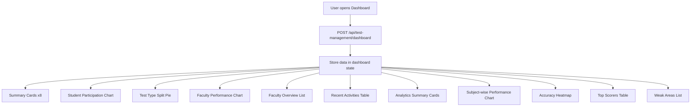

# Test Management Dashboard — Frontend Integration Guide

Integrate **Test Management → Dashboard** using a **single POST API**. Do not change UI layout, CSS, or component structure — only wire data.

**Backend reference:** `TEST_MANAGEMENT_DASHBOARD_TESTING_GUIDE.md`  
**Postman:** `TEST_MANAGEMENT_DASHBOARD_POSTMAN_COLLECTION.json`  
**Base path:** `/api/test-management`  
**Auth:** `Authorization: Bearer <token>` + `TEST_MANAGEMENT` → **Test Reports** (Super Admin bypasses)

---

## How to read this document

| Think this way | Not this way |
|----------------|--------------|
| User opens Dashboard → call one API | Wire each widget to a different endpoint |
| Store full `data` in state → map sections | Hardcode chart/table values |
| Page open / manual refresh only | Reload on tab change or table pagination |

Every section follows:

1. **When** (trigger)
2. **Call** (API)
3. **Populate** (UI widget)
4. **Empty / fallback**
5. **Do NOT call**

---

# 1. Screen Overview

| Screen | Route (example) | Purpose |
|--------|-----------------|---------|
| **Test Management Dashboard** | `/test-management/dashboard` | Summary cards, charts, faculty overview, recent activities, analytics, top scorers, weak areas |



---

# 2. Golden Rules

| Rule | Detail |
|------|--------|
| POST only | Dashboard uses POST, not GET |
| Single API on load | `POST /api/test-management/dashboard` with `{}` — no other APIs for this screen |
| No mock data | All numbers, labels, rows from API |
| No UI changes | Do not modify design, CSS, or component hierarchy |
| Existing axios | Use project axios instance + Bearer token |
| Skeleton while loading | Show existing skeleton loaders; never flash empty dashboard |
| Keep previous data on error | On failure, toast + retain last successful payload |
| Pagination is client-side | Recent activities / top scorers pagination does **not** call API again |
| Optional filters later | Use `POST /api/test-management/dashboard/filter` only when global filter UI is wired (same response shape) |

---

# 3. Page Load Flow

## 3.1 When this screen opens

User navigates to **Test Management → Dashboard**.

## 3.2 Call (once)

```http
POST /api/test-management/dashboard
Content-Type: application/json
Authorization: Bearer <token>

{}
```

## 3.3 On success

Store `response.data.data` (entire dashboard object) in state.

```ts
const dashboard = response.data.data;
// dashboard.summary
// dashboard.studentParticipation
// ... all sections
```

## 3.4 Do NOT call dashboard API when

- Switching sidebar tabs within the page
- Changing table pagination (recent activities, top scorers)
- Clicking charts
- Hovering tooltips

## 3.5 When to call again

- Page first mount
- User clicks explicit **Refresh** control (if present)
- User applies global dashboard filters (future — use `/dashboard/filter`)

---

# 4. API Contract

## 4.1 Endpoint

| Method | Path | Body | Description |
|--------|------|------|-------------|
| POST | `/api/test-management/dashboard` | `{}` | Full dashboard (all widgets) |
| POST | `/api/test-management/dashboard/filter` | Optional filters | Same response; filters apply globally |

### Optional filter body (for future center/batch filters)

```json
{
  "batchId": "",
  "programId": "",
  "subjectId": "",
  "facultyId": "",
  "centerId": "",
  "fromDate": "",
  "toDate": ""
}
```

All filter fields are optional. Empty string or omit = no filter.

## 4.2 Success envelope

```json
{
  "success": true,
  "statusCode": 10000,
  "message": "Test management dashboard",
  "data": { },
  "error": null
}
```

Use **`data`** for all widgets.

## 4.3 Sample response (reference)

```json
{
  "success": true,
  "statusCode": 10000,
  "message": "Test management dashboard",
  "data": {
    "summary": {
      "totalCbtTests": 8,
      "totalMainsTests": 2,
      "totalSubjects": 3,
      "totalFaculty": 3,
      "studentsAttempted": 13,
      "avgPerformance": 78.2,
      "pendingEvaluations": 1,
      "avgAttemptRate": 75,
      "topScorerAvg": 95,
      "weakTopics": 1,
      "accuracyIndex": 68.7
    },
    "studentParticipation": [
      { "month": "Feb", "attempts": 0 },
      { "month": "Mar", "attempts": 0 },
      { "month": "Apr", "attempts": 0 },
      { "month": "May", "attempts": 0 },
      { "month": "Jun", "attempts": 14 }
    ],
    "facultyPerformance": [
      { "faculty": "Darshan", "avgScore": 93.3 }
    ],
    "facultyOverview": [
      {
        "facultyName": "Darshan",
        "subject": "Polity By New Lecture",
        "testsConducted": 4,
        "studentsHandled": 3,
        "avgPerformance": 93.3
      }
    ],
    "testTypeSplit": { "cbt": 8, "mains": 2 },
    "recentActivities": [
      {
        "testName": "Mains Test name",
        "faculty": "Polity By New Lecture - Darshan",
        "activity": "Evaluation pending",
        "timeAgo": "2 min ago",
        "status": "Pending"
      }
    ],
    "subjectWisePerformance": [
      {
        "subject": "Polity By New Lecture",
        "attempts": 3,
        "avgPercentage": 93.3
      }
    ],
    "accuracyHeatmap": [
      {
        "subject": "Polity By New Lecture",
        "easy": 0,
        "medium": 20,
        "hard": 0
      }
    ],
    "topScorers": [
      {
        "rank": 1,
        "studentName": "abc",
        "rollNumber": "STU012",
        "score": 100,
        "subject": "Polity By New Lecture"
      }
    ],
    "weakAreas": [
      {
        "topic": "Test-1",
        "subject": "Polity By New Lecture",
        "accuracy": 20
      }
    ]
  },
  "error": null
}
```

---

# 5. TypeScript Interfaces

```ts
export interface DashboardSummary {
  totalCbtTests: number;
  totalMainsTests: number;
  totalSubjects: number;
  totalFaculty: number;
  studentsAttempted: number;
  avgPerformance: number;
  pendingEvaluations: number;
  avgAttemptRate: number;
  topScorerAvg: number;
  weakTopics: number;
  accuracyIndex: number;
}

export interface StudentParticipationPoint {
  month: string;
  attempts: number;
}

export interface FacultyPerformancePoint {
  faculty: string;
  avgScore: number;
}

export interface FacultyOverviewItem {
  facultyName: string;
  subject: string;
  testsConducted: number;
  studentsHandled: number;
  avgPerformance: number;
}

export interface TestTypeSplit {
  cbt: number;
  mains: number;
}

export interface RecentActivityItem {
  testName: string;
  faculty: string;
  activity: string;
  timeAgo: string;
  status: string; // Pending | Published | Scheduled | Draft | Live
}

export interface SubjectWisePerformanceItem {
  subject: string;
  attempts: number;
  avgPercentage: number;
}

export interface AccuracyHeatmapRow {
  subject: string;
  easy: number;
  medium: number;
  hard: number;
}

export interface TopScorerItem {
  rank: number;
  studentName: string;
  rollNumber: string;
  score: number;
  subject: string;
}

export interface WeakAreaItem {
  topic: string;
  subject: string;
  accuracy: number;
}

export interface TestManagementDashboardData {
  summary: DashboardSummary;
  studentParticipation: StudentParticipationPoint[];
  facultyPerformance: FacultyPerformancePoint[];
  facultyOverview: FacultyOverviewItem[];
  testTypeSplit: TestTypeSplit;
  recentActivities: RecentActivityItem[];
  subjectWisePerformance: SubjectWisePerformanceItem[];
  accuracyHeatmap: AccuracyHeatmapRow[];
  topScorers: TopScorerItem[];
  weakAreas: WeakAreaItem[];
}

export interface TestManagementDashboardResponse {
  success: boolean;
  statusCode: number;
  message: string;
  data: TestManagementDashboardData;
  error: unknown;
}
```

---

# 6. Code Structure

Create these files (paths may match your frontend conventions):

```
services/testManagementDashboard.service.ts
hooks/useTestManagementDashboard.ts
types/testManagementDashboard.types.ts   // optional; interfaces above
```

## 6.1 Service

```ts
import axiosInstance from '@/lib/axios'; // use existing instance
import type { TestManagementDashboardData } from '@/types/testManagementDashboard.types';

export async function fetchTestManagementDashboard(
  filters: Record<string, unknown> = {}
): Promise<TestManagementDashboardData> {
  const hasFilters = Object.values(filters).some(
    (v) => v !== null && v !== undefined && v !== ''
  );

  const url = hasFilters
    ? '/api/test-management/dashboard/filter'
    : '/api/test-management/dashboard';

  const { data } = await axiosInstance.post(url, filters);
  return data.data;
}
```

## 6.2 Hook (React Query example)

```ts
import { useQuery } from '@tanstack/react-query';
import { fetchTestManagementDashboard } from '@/services/testManagementDashboard.service';

export function useTestManagementDashboard(filters = {}) {
  return useQuery({
    queryKey: ['test-management-dashboard', filters],
    queryFn: () => fetchTestManagementDashboard(filters),
    staleTime: 5 * 60 * 1000, // backend caches ~5 min
    refetchOnWindowFocus: false,
    keepPreviousData: true
  });
}
```

Keep mapping logic in the hook or small selector helpers — UI components stay dumb.

---

# 7. Widget Mapping (Section by Section)

## 7.1 Top summary cards (8 cards)

Source: `data.summary`

| # | UI label | API field | Display |
|---|----------|-----------|---------|
| 1 | Total CBT Tests | `totalCbtTests` | number as-is |
| 2 | Total Mains Tests | `totalMainsTests` | number as-is |
| 3 | Total Subjects | `totalSubjects` | number as-is |
| 4 | Total Faculty | `totalFaculty` | number as-is |
| 5 | Students Attempted | `studentsAttempted` | number as-is |
| 6 | Average Performance | `avgPerformance` | `{value}%` e.g. `78.2%` |
| 7 | Average Attempt Rate | `avgAttemptRate` | `{value}%` e.g. `75%` |
| 8 | Pending Evaluations | `pendingEvaluations` | number as-is |

**Fallback:** `0` for missing numbers; `—` only if field is `null`/`undefined`.

---

## 7.2 Student participation chart

Source: `data.studentParticipation`

| Chart axis | Field |
|------------|-------|
| X | `month` |
| Y | `attempts` |

**Empty array:** show *No Participation Data Available* (or existing empty chart state).

**Note:** Backend returns last 5 months; do not hardcode month labels.

---

## 7.3 Test type split (pie chart)

Source: `data.testTypeSplit`

| Slice | Field |
|-------|-------|
| CBT | `testTypeSplit.cbt` |
| Mains | `testTypeSplit.mains` |

Do not hardcode counts. If both are `0`, show empty pie state.

---

## 7.4 Faculty performance (bar chart)

Source: `data.facultyPerformance`

| Axis | Field |
|------|-------|
| X | `faculty` |
| Y | `avgScore` (append `%` in tooltip/label) |

**Empty array:** *No Performance Data*.

---

## 7.5 Faculty overview list

Source: `data.facultyOverview`

Each row/card:

| UI | Field |
|----|-------|
| Name | `facultyName` |
| Subject | `subject` |
| Tests count | `testsConducted` |
| Students | `studentsHandled` |
| Avg performance | `avgPerformance` → display as `{value}%` |

**Empty array:** *No Faculty Available*.

---

## 7.6 Recent test activities table

Source: `data.recentActivities`

| Column | Field |
|--------|-------|
| Test | `testName` |
| Faculty | `faculty` |
| Activity | `activity` |
| Time | `timeAgo` |
| Status | `status` |

### Status badge colors (match existing UI — do not change CSS classes)

| `status` value (case-insensitive) | Badge |
|-----------------------------------|-------|
| `Pending` | Orange |
| `Published` | Green |
| `Scheduled` | Blue |
| `Draft` | Gray |
| `Live` | Red |

Compare with `.toLowerCase()` for safety (`Live`, `live`, etc.).

**Empty array:** *No Activities Found*.

**Pagination:** client-side only — slice `recentActivities` in component; **no API call**.

---

## 7.7 Analytics summary cards (4 cards)

Source: `data.summary` (same object as top row)

| Card | Field | Format |
|------|-------|--------|
| Average Attempt Rate | `avgAttemptRate` | `{value}%` |
| Top Scorer Average | `topScorerAvg` | number (no `%` unless design shows it) |
| Weak Topics | `weakTopics` | number |
| Accuracy Index | `accuracyIndex` | `{value}%` |

---

## 7.8 Subject-wise performance chart

Source: `data.subjectWisePerformance`

| Axis / series | Field |
|-----------------|-------|
| X | `subject` |
| Bar height | `attempts` |
| Tooltip | `avgPercentage` → `Avg: {avgPercentage}%` |

**Empty array:** use chart empty state.

---

## 7.9 Accuracy heatmap

Source: `data.accuracyHeatmap`

Each row:

| Column | Field |
|--------|-------|
| Subject | `subject` |
| Easy | `easy` → display `{easy}%` |
| Medium | `medium` → display `{medium}%` |
| Hard | `hard` → display `{hard}%` |

Use existing heatmap component + color scale — **do not invent fake values or colors**.

**Empty array:** empty heatmap state.

---

## 7.10 Top scorers table

Source: `data.topScorers`

| Column | Field |
|--------|-------|
| Rank | `rank` |
| Student | `studentName` |
| Roll Number | `rollNumber` |
| Score | `score` |
| Subject | `subject` |

**Empty array:** *No Top Scorers*.

**Pagination:** client-side only.

---

## 7.11 Weak areas list

Source: `data.weakAreas`

| UI | Field |
|----|-------|
| Topic | `topic` |
| Subject | `subject` |
| Accuracy | `accuracy` → `{accuracy}%` |

**Empty array:** *No Weak Areas*.

---

# 8. Loading, Empty, and Error States

## 8.1 Loading

When `isLoading === true`:

- Show **existing skeleton loaders** for each section
- Do not render `0` or empty arrays as if loaded

## 8.2 Empty states

| Section | Condition | Message |
|---------|-----------|---------|
| Student participation | `length === 0` | No Participation Data Available |
| Faculty overview | `length === 0` | No Faculty Available |
| Faculty performance | `length === 0` | No Performance Data |
| Recent activities | `length === 0` | No Activities Found |
| Top scorers | `length === 0` | No Top Scorers |
| Weak areas | `length === 0` | No Weak Areas |

Use existing empty-state components if available.

## 8.3 Error handling

```ts
onError: () => {
  toast.error('Unable to load dashboard.');
}
```

- Do **not** clear previous dashboard data on error (`keepPreviousData: true` / retain last state)
- Stop skeletons; show last good data or full-page error if first load failed

---

# 9. Display Helpers (recommended)

```ts
export const formatPercent = (value?: number | null, fallback = '0') => {
  if (value === null || value === undefined || Number.isNaN(value)) return `${fallback}%`;
  return `${value}%`;
};

export const formatNumber = (value?: number | null, fallback = 0) =>
  value ?? fallback;

export const normalizeActivityStatus = (status?: string) =>
  (status || '').trim().toLowerCase();
```

---

# 10. Refresh Rules Summary

| Action | Call dashboard API? |
|--------|---------------------|
| Page mount | Yes |
| Manual refresh button | Yes |
| Global filter apply (future) | Yes → `/dashboard/filter` |
| Tab change inside dashboard | No |
| Table pagination | No |
| Chart interaction | No |
| Navigate away and back | Yes (on remount) |

---

# 11. Integration Checklist

- [ ] `services/testManagementDashboard.service.ts` created
- [ ] `hooks/useTestManagementDashboard.ts` created
- [ ] Types/interfaces match API
- [ ] Dashboard page calls API once on mount
- [ ] All 8 top summary cards bound to `summary`
- [ ] Student participation chart uses `studentParticipation`
- [ ] Pie chart uses `testTypeSplit.cbt` / `.mains`
- [ ] Faculty performance bar chart uses `facultyPerformance`
- [ ] Faculty overview list uses `facultyOverview`
- [ ] Recent activities table uses `recentActivities` + status badges
- [ ] Analytics cards use `summary` (avgAttemptRate, topScorerAvg, weakTopics, accuracyIndex)
- [ ] Subject chart uses `subjectWisePerformance`
- [ ] Heatmap uses `accuracyHeatmap`
- [ ] Top scorers table uses `topScorers`
- [ ] Weak areas uses `weakAreas`
- [ ] Skeleton loaders while loading
- [ ] Empty states for empty arrays
- [ ] Toast on error; previous data retained
- [ ] No hardcoded dashboard values
- [ ] No UI/CSS/structure changes

---

# 12. Related Docs

| File | Purpose |
|------|---------|
| `TEST_MANAGEMENT_DASHBOARD_TESTING_GUIDE.md` | Backend testing, data sources, cache |
| `TEST_MANAGEMENT_DASHBOARD_POSTMAN_COLLECTION.json` | Postman requests |
| `EVALUATION_OVERSIGHT_FRONTEND_INTEGRATION.md` | Evaluation Oversight (separate screen) |
| `CBT_MANAGEMENT_API_GUIDE.md` | CBT Management module |

---

*Last updated: backend unified dashboard API — single POST returns all widgets for Test Management Dashboard screen.*
