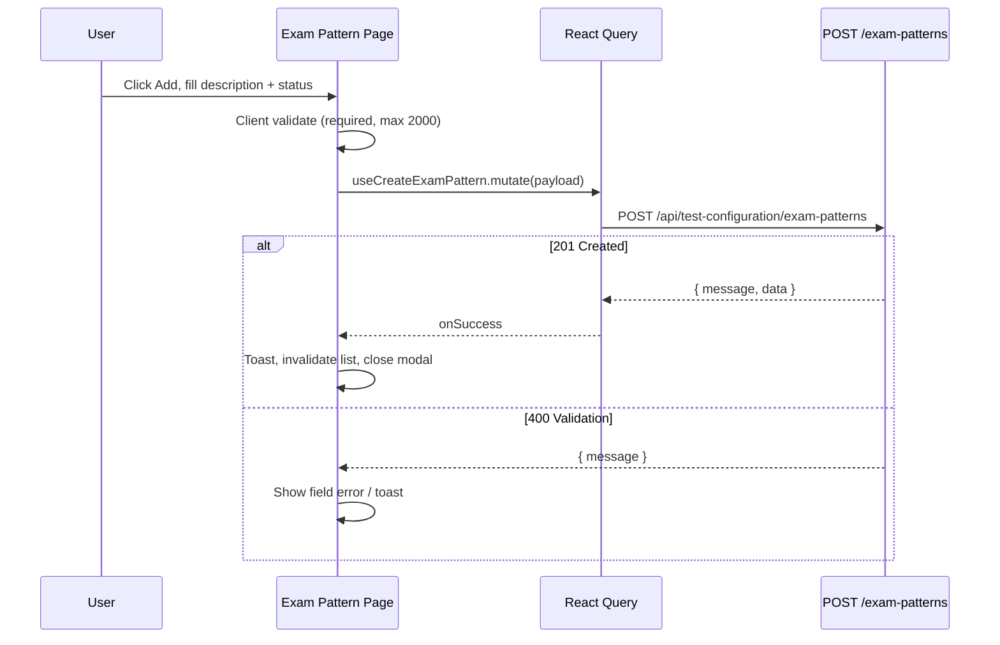
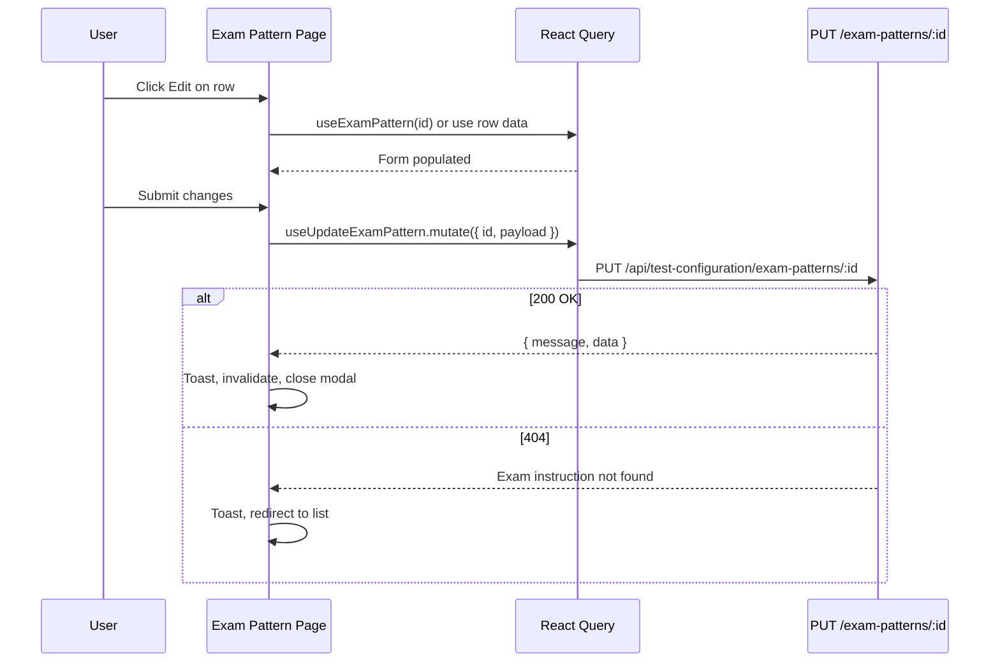
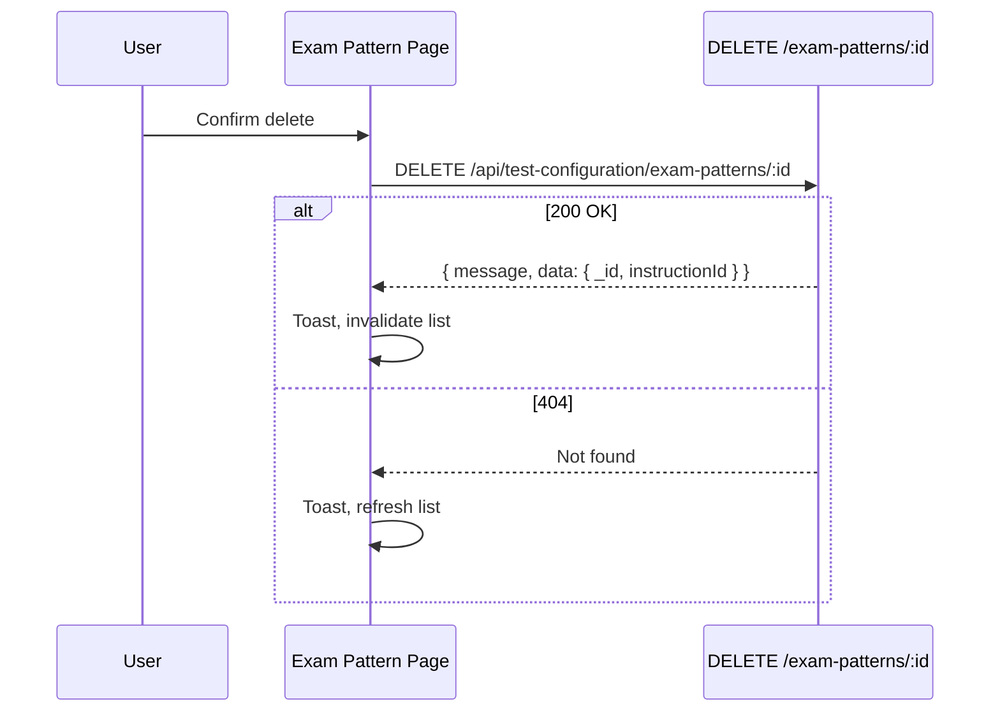
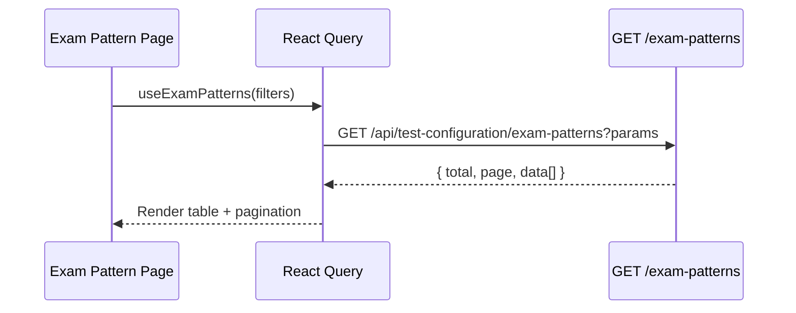
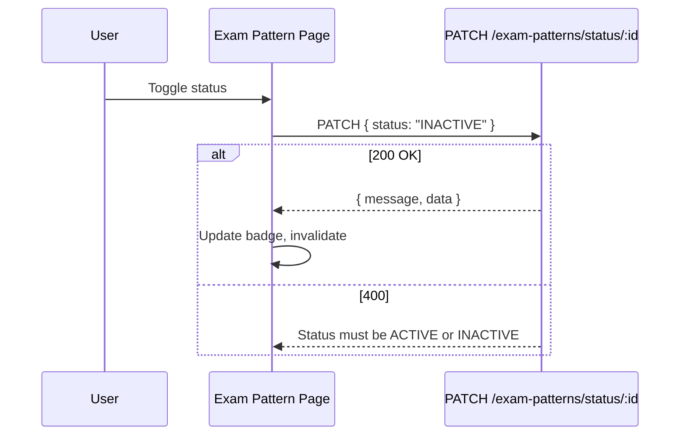
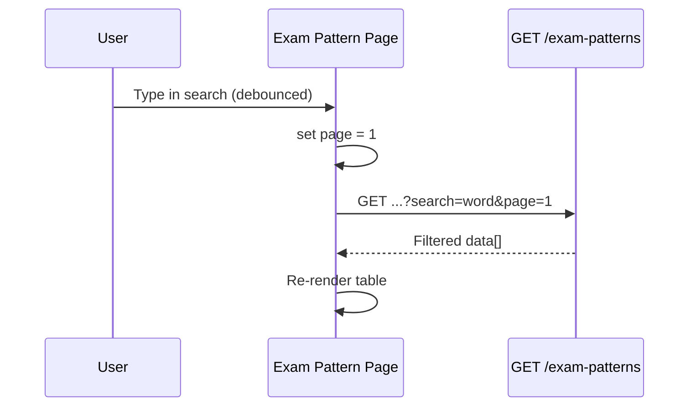

# Test Management → Test Configuration → Exam Pattern — Frontend Integration Guide

**Audience:** React + Vite frontend developers integrating the **Exam Pattern** page under **Test Management → Test Configuration**.

**Backend module:** **Exam Pattern** (`ExamPatternInstruction` model, `examPatternController`, `testConfigurationRoutes`).

**Base path:** `{VITE_API_BASE_URL}/api/test-configuration/exam-patterns`

**Frontend route (product UI):** `/test-management/test-configuration/exam-pattern`

**Auth:** `Authorization: Bearer <token>` — **Super Admin only**

---

## Critical naming distinction

| Layer | Name | Notes |
|-------|------|-------|
| Frontend page | **Exam Pattern** | UI route under Test Management → Test Configuration |
| Backend model | **ExamPatternInstruction** | MongoDB model; stores exam **instructions** shown to candidates |
| Backend display ID | `instructionId` | Sequential code (e.g. `S-1001`) — **not** the API path `:id` |
| API path `:id` | MongoDB `_id` | Always use `_id` from list/create/detail for update, delete, status |
| UI label vs API message | "Exam Pattern" vs "Exam instruction" | Backend success/error messages say **"Exam instruction"** |

Exam Pattern records are **instruction templates** (text shown before/during tests). They are referenced downstream by **Subject Prelims Test** via `examPatternId`.

---

## 1. Module Overview

### What Exam Pattern is

**Exam Pattern** (backend: `ExamPatternInstruction`) manages reusable **exam instruction text** — rules and guidance shown to candidates before or during tests (e.g. "Descriptive answers must be within word limit.").

Each record contains:

- A system-generated **`instructionId`** (format `S-1001`, `S-1002`, …)
- An **`instructionDescription`** (required text, max 2000 characters)
- A **`status`** (`ACTIVE` | `INACTIVE`)

### Purpose

- Centralize exam instruction content in Test Configuration
- Allow admins to create, edit, activate/deactivate, and soft-delete instructions
- Provide a dropdown of active instructions for downstream modules (e.g. Prelims Test creation)

### How it fits inside Test Management

```
Test Management
  └── Test Configuration
        ├── Exam Pattern          ← this module
        ├── Section Management    (separate module)
        ├── Language Settings     (separate module)
        └── Marking Rules         (separate module)
```

All Test Configuration sub-modules share the mount path prefix `/api/test-configuration` and the same auth gate (`protect` + `requireSuperAdmin`).

### Complete backend architecture

There is **no** dedicated Service, Repository, DTO, Joi validation middleware, or Swagger/OpenAPI spec for Exam Pattern. Logic lives directly in the controller with shared helpers.

| Layer | File | Role |
|-------|------|------|
| Route mount | `app.js` | `app.use('/api/test-configuration', testConfigurationRoutes)` |
| Routes | `routes/testConfigurationRoutes.js` | Registers 8 Exam Pattern endpoints; applies `protect`, `requireSuperAdmin` to entire router |
| Controller | `controllers/examPatternController.js` | Validation, CRUD, formatting, list query building |
| Model | `models/ExamPatternInstruction.js` | Mongoose schema, indexes |
| Helpers | `utils/testConfigurationHelpers.js` | Pagination, sort presets, status normalization, search filter |
| Helpers | `utils/contentMastersHelpers.js` | `NOT_DELETED`, `parsePagination`, `parseSort`, regex escape |
| ID generator | `utils/contentIdGenerator.js` | `generateExamInstructionId()` → prefix `S-`, 4-digit padding |
| Auth | `middleware/authMiddleware.js` | `protect` — JWT Bearer validation |
| Auth | `middleware/requireSuperAdmin.js` | Super Admin role gate |
| Permissions | `utils/permissionHelpers.js` | `isSuperAdminRequest()` |

**Not implemented for Exam Pattern:** separate service layer, repository, DTOs, Joi/Zod middleware, OpenAPI/Swagger, restore endpoint, bulk actions, export/import, hard delete.

### Available features (current implementation)

| Feature | Supported |
|---------|-----------|
| Create | Yes |
| List (paginated) | Yes |
| Get by ID | Yes |
| Update (full PUT) | Yes |
| Status change (dedicated PATCH) | Yes |
| Status change via PUT | Yes (optional `status` in body) |
| Soft delete | Yes |
| Hard delete | **No** |
| Restore deleted record | **No** |
| Bulk delete | **No** |
| Bulk status update | **No** |
| Search | Yes — `instructionDescription`, `instructionId` |
| Pagination | Yes — `page`, `limit` (max 100) |
| Sorting | Yes — `sortBy` + `sortOrder` or `sortPreset` |
| Status filter | Yes — `ACTIVE` / `INACTIVE` |
| Dropdown (active only) | Yes — GET and POST |
| Export | **No** |
| Import | **No** |

### Downstream consumer

`SubjectPrelimsTest` references `examPatternId` (ObjectId → `ExamPatternInstruction`). Prelims Test forms load options from `GET` or `POST /api/test-configuration/exam-patterns/dropdown`. That is documented in [§13 Dropdown Dependencies](#13-dropdown-dependencies).

---

## 2. Architecture Flow

```
Frontend (Exam Pattern Page)
        ↓
React Query Hook (useExamPatterns, useCreateExamPattern, …)
        ↓
Service Layer (examPatternService.ts)
        ↓
Axios Instance (api.ts — Bearer token, base URL)
        ↓
Backend API  /api/test-configuration/exam-patterns/*
        ↓
Middleware   protect → requireSuperAdmin
        ↓
Controller   examPatternController.js
        ↓
Helpers      testConfigurationHelpers.js, contentMastersHelpers.js
        ↓
Model        ExamPatternInstruction (Mongoose)
        ↓
Database     MongoDB
```

### Layer explanations

| Layer | Responsibility |
|-------|----------------|
| **Frontend page** | Table, search, filters, create/edit modal, status toggle, delete confirm |
| **React Query** | Caching, loading/error states, mutation invalidation |
| **Service layer** | Typed HTTP calls; no business logic |
| **Axios** | Base URL, auth header, interceptors |
| **Backend API** | REST endpoints under `/api/test-configuration` |
| **Middleware** | JWT auth + Super Admin role check on every route |
| **Controller** | Inline validation, query building, response formatting |
| **Helpers** | Shared pagination, sort, search, status normalization |
| **Model / DB** | Persistence, soft-delete flags, indexes |

---

## 3. API Inventory

All Exam Pattern routes require authentication and **Super Admin** role.

**Middleware chain (every route):**

```javascript
router.use(protect, requireSuperAdmin);
```

| # | Method | Endpoint | Purpose |
|---|--------|----------|---------|
| 1 | `POST` | `/api/test-configuration/exam-patterns` | Create exam instruction |
| 2 | `GET` | `/api/test-configuration/exam-patterns` | Paginated list with search, filter, sort |
| 3 | `GET` | `/api/test-configuration/exam-patterns/dropdown` | Active instructions for dropdowns |
| 4 | `POST` | `/api/test-configuration/exam-patterns/dropdown` | Same as GET dropdown |
| 5 | `GET` | `/api/test-configuration/exam-patterns/:id` | Get single record by MongoDB `_id` |
| 6 | `PUT` | `/api/test-configuration/exam-patterns/:id` | Update description and/or status |
| 7 | `PATCH` | `/api/test-configuration/exam-patterns/status/:id` | Update status only |
| 8 | `DELETE` | `/api/test-configuration/exam-patterns/:id` | Soft delete |

---

### 3.1 Create Exam Pattern

| Property | Value |
|----------|-------|
| **HTTP Method** | `POST` |
| **URL** | `/api/test-configuration/exam-patterns` |
| **Purpose** | Create a new exam instruction |
| **Authentication** | Required — Bearer token |
| **Role** | Super Admin only |

**Headers**

| Header | Required | Value |
|--------|----------|-------|
| `Authorization` | Yes | `Bearer <token>` |
| `Content-Type` | Yes | `application/json` |

**Path parameters:** None

**Query parameters:** None

**Request body**

| Field | Type | Required | Validation |
|-------|------|----------|------------|
| `instructionDescription` | `string` | Yes* | Trimmed; non-empty; max 2000 chars |
| `instruction_description` | `string` | Alt key | Same as above (alias) |
| `description` | `string` | Alt key | Same as above (alias) |
| `status` | `string` | No | `ACTIVE` or `INACTIVE`; default `ACTIVE` |

\*Backend resolves description from `instructionDescription` → `instruction_description` → `description` (first defined wins).

**Validation rules (controller)**

- Missing/blank description after trim → `400` — `"instructionDescription is required"`
- Description length > 2000 → `400` — `"instructionDescription cannot exceed 2000 characters"`
- Invalid `status` (when explicitly provided) → `400` — `"Status must be ACTIVE or INACTIVE"`
- Empty/missing `status` → defaults to `ACTIVE`

**Success response — `201 Created`**

```json
{
  "success": true,
  "message": "Exam instruction created successfully",
  "data": {
    "_id": "674a1b2c3d4e5f6789012345",
    "instructionId": "S-1008",
    "instructionDescription": "Descriptive answers must be within word limit.",
    "status": "ACTIVE",
    "createdAt": "2026-03-20T10:00:00.000Z",
    "updatedAt": "2026-03-20T10:00:00.000Z",
    "createdOn": "2026-03-20",
    "modifiedOn": "2026-03-20"
  }
}
```

**Error responses:** See [§16 Error Handling](#16-error-handling).

**Frontend notes**

- Auto-generated fields (`instructionId`, timestamps) are read-only in the UI.
- Prefer sending `instructionDescription` (camelCase) for consistency with responses.
- On success, store `data._id` for subsequent edit/delete/status calls.

**Example request**

```http
POST /api/test-configuration/exam-patterns
Authorization: Bearer <token>
Content-Type: application/json

{
  "instructionDescription": "Descriptive answers must be within word limit.",
  "status": "ACTIVE"
}
```

---

### 3.2 List Exam Patterns

| Property | Value |
|----------|-------|
| **HTTP Method** | `GET` |
| **URL** | `/api/test-configuration/exam-patterns` |
| **Purpose** | Paginated list with search, status filter, sorting |
| **Authentication** | Required |
| **Role** | Super Admin only |

**Headers:** `Authorization: Bearer <token>` (no body)

**Query parameters**

| Param | Type | Required | Default | Validation | Description |
|-------|------|----------|---------|------------|-------------|
| `page` | `number` | No | `1` | ≥ 1 | Page number (1-based) |
| `limit` | `number` | No | `10` | 1–100 | Items per page |
| `search` | `string` | No | `""` | — | Case-insensitive partial match on `instructionDescription` OR `instructionId` |
| `status` | `string` | No | — | `ACTIVE` \| `INACTIVE` | Omit for all non-deleted statuses |
| `sortBy` | `string` | No | `createdAt` | See allowed fields | Sort field |
| `sortOrder` | `string` | No | `desc` | `asc` \| `desc` | Sort direction |
| `sortPreset` | `string` | No | — | See presets | UI-friendly sort; overrides `sortBy`/`sortOrder` when valid |

**Allowed `sortBy` values:** `createdAt`, `updatedAt`, `instructionDescription`, `instructionId`, `status`

**Allowed `sortPreset` values (Exam Pattern):**

| Preset | Maps to |
|--------|---------|
| `createdOn_newest` | `createdAt` desc |
| `createdOn_oldest` | `createdAt` asc |
| `modifiedOn_newest` | `updatedAt` desc |
| `modifiedOn_oldest` | `updatedAt` asc |

**Success response — `200 OK`**

```json
{
  "success": true,
  "total": 25,
  "page": 1,
  "limit": 10,
  "totalPages": 3,
  "count": 10,
  "data": [
    {
      "_id": "674a1b2c3d4e5f6789012345",
      "instructionId": "S-1008",
      "instructionDescription": "Descriptive answers must be within word limit.",
      "status": "ACTIVE",
      "createdAt": "2026-03-20T10:00:00.000Z",
      "updatedAt": "2026-03-20T10:00:00.000Z",
      "createdOn": "2026-03-20",
      "modifiedOn": "2026-03-20"
    }
  ]
}
```

**Frontend notes**

- List uses **GET with query string** (not POST body).
- Deleted records (`isDeleted: true`) are excluded automatically.
- Use `placeholderData: keepPreviousData` during pagination/filter changes.

**Example request**

```http
GET /api/test-configuration/exam-patterns?page=1&limit=10&search=word&status=ACTIVE&sortPreset=createdOn_newest
Authorization: Bearer <token>
```

---

### 3.3 Get Exam Pattern Dropdown

| Property | Value |
|----------|-------|
| **HTTP Method** | `GET` or `POST` |
| **URL** | `/api/test-configuration/exam-patterns/dropdown` |
| **Purpose** | Active, non-deleted instructions for select/dropdown UI |
| **Authentication** | Required |
| **Role** | Super Admin only |

**Path parameters:** None

**Query parameters:** None

**Request body (POST only):** Ignored — handler does not read body.

**Success response — `200 OK`**

```json
{
  "success": true,
  "count": 2,
  "data": [
    {
      "_id": "674a1b2c3d4e5f6789012345",
      "instructionId": "S-1008",
      "instructionDescription": "Descriptive answers must be within word limit."
    }
  ]
}
```

**Frontend notes**

- Returns only `status: ACTIVE` and `isDeleted: false` records.
- Sorted by `instructionId` descending (newest codes first).
- Dropdown items are **not** passed through `formatExamPattern` — no `createdOn`/`modifiedOn`.
- Both GET and POST work identically; Prelims Test module documents POST for form wizards.

**Label / value mapping**

| UI use | Field |
|--------|-------|
| **Value** | `_id` |
| **Label** | `instructionDescription` (or combine `instructionId` + description) |

---

### 3.4 Get Exam Pattern by ID

| Property | Value |
|----------|-------|
| **HTTP Method** | `GET` |
| **URL** | `/api/test-configuration/exam-patterns/:id` |
| **Purpose** | Fetch single record for view/edit form |
| **Authentication** | Required |
| **Role** | Super Admin only |

**Path parameters**

| Param | Type | Required | Description |
|-------|------|----------|-------------|
| `id` | `string` | Yes | MongoDB `_id` |

**Success response — `200 OK`**

```json
{
  "success": true,
  "data": {
    "_id": "674a1b2c3d4e5f6789012345",
    "instructionId": "S-1008",
    "instructionDescription": "Descriptive answers must be within word limit.",
    "status": "ACTIVE",
    "createdAt": "2026-03-20T10:00:00.000Z",
    "updatedAt": "2026-03-20T10:00:00.000Z",
    "createdOn": "2026-03-20",
    "modifiedOn": "2026-03-20"
  }
}
```

**Error — `404`:** `{ "success": false, "message": "Exam instruction not found" }`

**Frontend notes**

- Invalid MongoDB ObjectId may result in `500` (Mongoose CastError) — validate `_id` format client-side when possible.

---

### 3.5 Update Exam Pattern

| Property | Value |
|----------|-------|
| **HTTP Method** | `PUT` |
| **URL** | `/api/test-configuration/exam-patterns/:id` |
| **Purpose** | Update instruction description and/or status |
| **Authentication** | Required |
| **Role** | Super Admin only |

**Path parameters:** `id` — MongoDB `_id`

**Request body** (at least one field should be sent for a meaningful update)

| Field | Type | Required | Validation |
|-------|------|----------|------------|
| `instructionDescription` | `string` | No | If sent: trimmed, non-empty, max 2000 |
| `instruction_description` | `string` | Alt key | Same |
| `description` | `string` | Alt key | Same |
| `status` | `string` | No | `ACTIVE` or `INACTIVE` |

**Validation rules**

- Record not found → `404`
- Empty description after trim (when field is sent) → `400` — `"instructionDescription cannot be empty"`
- Length > 2000 → `400`
- Invalid status → `400` — `"Status must be ACTIVE or INACTIVE"`
- Omitted fields are left unchanged

**Success response — `200 OK`**

```json
{
  "success": true,
  "message": "Exam instruction updated successfully",
  "data": {
    "_id": "674a1b2c3d4e5f6789012345",
    "instructionId": "S-1008",
    "instructionDescription": "Updated exam instruction text.",
    "status": "ACTIVE",
    "createdAt": "2026-03-20T10:00:00.000Z",
    "updatedAt": "2026-03-20T11:30:00.000Z",
    "createdOn": "2026-03-20",
    "modifiedOn": "2026-03-20"
  }
}
```

**Example request**

```http
PUT /api/test-configuration/exam-patterns/674a1b2c3d4e5f6789012345
Authorization: Bearer <token>
Content-Type: application/json

{
  "instructionDescription": "Updated exam instruction text.",
  "status": "ACTIVE"
}
```

---

### 3.6 Update Exam Pattern Status

| Property | Value |
|----------|-------|
| **HTTP Method** | `PATCH` |
| **URL** | `/api/test-configuration/exam-patterns/status/:id` |
| **Purpose** | Update status only (list toggle) |
| **Authentication** | Required |
| **Role** | Super Admin only |

**Path parameters:** `id` — MongoDB `_id`

**Request body**

| Field | Type | Required | Validation |
|-------|------|----------|------------|
| `status` | `string` | Yes | `ACTIVE` or `INACTIVE` |

**Success response — `200 OK`**

```json
{
  "success": true,
  "message": "Exam instruction status updated",
  "data": {
    "_id": "674a1b2c3d4e5f6789012345",
    "instructionId": "S-1008",
    "instructionDescription": "Updated exam instruction text.",
    "status": "INACTIVE",
    "createdAt": "2026-03-20T10:00:00.000Z",
    "updatedAt": "2026-03-20T12:00:00.000Z",
    "createdOn": "2026-03-20",
    "modifiedOn": "2026-03-20"
  }
}
```

**Frontend notes**

- Prefer this endpoint for status toggles instead of full PUT.
- Status is case-insensitive on input (`active` → `ACTIVE`).

---

### 3.7 Delete Exam Pattern

| Property | Value |
|----------|-------|
| **HTTP Method** | `DELETE` |
| **URL** | `/api/test-configuration/exam-patterns/:id` |
| **Purpose** | Soft delete exam instruction |
| **Authentication** | Required |
| **Role** | Super Admin only |

**Path parameters:** `id` — MongoDB `_id`

**Request body:** None

**Backend behaviour on delete**

- Sets `isDeleted: true`
- Sets `deletedAt: <current date>`
- Sets `status: INACTIVE`
- Record hidden from list, detail, and dropdown queries

**Success response — `200 OK`**

```json
{
  "success": true,
  "message": "Exam instruction deleted successfully",
  "data": {
    "_id": "674a1b2c3d4e5f6789012345",
    "instructionId": "S-1008"
  }
}
```

**Frontend notes**

- There is **no** linked-record guard in Exam Pattern delete (unlike Class Sections + NCERT).
- **Hard delete** and **restore** are **not implemented**.

---

### HTTP status codes summary

| Code | When |
|------|------|
| `200` | Successful GET, PUT, PATCH, DELETE |
| `201` | Successful POST create |
| `400` | Validation error (missing description, empty description, invalid status, text too long) |
| `401` | Missing/invalid token, not authenticated |
| `403` | Valid token but not Super Admin; account disabled |
| `404` | Record not found (get/update/status/delete) |
| `409` | **Not used** by Exam Pattern |
| `500` | Server error (includes possible invalid ObjectId CastError) |

---

## 4. CRUD Flow

### Create Exam Pattern

1. User opens Add modal.
2. User enters `instructionDescription` (required) and optional `status`.
3. Frontend validates length ≤ 2000 client-side.
4. `POST /api/test-configuration/exam-patterns`
5. On `201`: toast `"Exam instruction created successfully"`, invalidate list query, close modal.

### Read List

1. Page load → `GET /api/test-configuration/exam-patterns?page=1&limit=10`
2. Pass `search`, `status`, `sortPreset` / `sortBy`+`sortOrder` as user interacts.
3. Render table from `data[]`; bind pagination to `page`, `total`, `totalPages`.

### Read Details

1. User clicks view/edit → take row `_id`.
2. `GET /api/test-configuration/exam-patterns/:id`
3. Populate form fields from `data`.

Alternatively, reuse row data from list if all fields are present (list returns same shape as detail).

### Update

1. Load detail (or use list row).
2. User edits description and/or status.
3. `PUT /api/test-configuration/exam-patterns/:id`
4. On `200`: toast `"Exam instruction updated successfully"`, invalidate list + detail.

### Delete

1. Confirm dialog.
2. `DELETE /api/test-configuration/exam-patterns/:id`
3. On `200`: toast `"Exam instruction deleted successfully"`, invalidate list.

### Restore

**Not implemented.** Deleted records cannot be restored via API.

### Status Change

- **Dedicated:** `PATCH /api/test-configuration/exam-patterns/status/:id` with `{ "status": "ACTIVE" | "INACTIVE" }`
- **Via edit:** include `status` in PUT body

### Bulk Actions

**Not implemented** — no bulk delete or bulk status endpoints.

### Search

- Query param `search` on list GET
- Matches `instructionDescription` or `instructionId` (case-insensitive regex)
- Debounce 300–500ms; reset `page` to 1 on change

### Pagination

- `page` (default 1), `limit` (default 10, max 100)
- Response: `total`, `page`, `limit`, `totalPages`, `count`

### Sorting

- **Preset (recommended for UI):** `sortPreset=createdOn_newest|createdOn_oldest|modifiedOn_newest|modifiedOn_oldest`
- **Manual:** `sortBy` + `sortOrder`

### Filtering

- `status=ACTIVE` or `status=INACTIVE` — omit for all

### Export / Import

**Not implemented.**

### Soft Delete vs Hard Delete

- **Soft delete only** — `DELETE` sets `isDeleted: true`
- **Hard delete** — **not available**

---

## 5. Frontend Folder Structure

Recommended React + Vite layout for Exam Pattern:

```
src/
├── services/
│   ├── api.ts
│   └── examPatternService.ts
├── hooks/
│   ├── useExamPatterns.ts
│   ├── useExamPattern.ts
│   ├── useCreateExamPattern.ts
│   ├── useUpdateExamPattern.ts
│   ├── useUpdateExamPatternStatus.ts
│   └── useDeleteExamPattern.ts
├── pages/
│   └── TestManagement/
│         └── TestConfiguration/
│               └── ExamPattern/
│                     ├── index.tsx
│                     ├── ExamPatternTable.tsx
│                     ├── ExamPatternForm.tsx
│                     └── ExamPatternFilters.tsx
├── components/
│   └── common/
│         ├── StatusBadge.tsx
│         └── ConfirmDeleteDialog.tsx
├── types/
│   └── examPattern.types.ts
├── constants/
│   └── examPattern.constants.ts
├── validation/
│   └── examPattern.schema.ts
├── providers/
│   └── QueryProvider.tsx
└── routes/
    └── testManagement.routes.tsx
```

---

## 6. Service Layer Integration

Production-ready service examples using real endpoints:

```typescript
// services/examPatternService.ts
import api from './api';

const BASE = '/api/test-configuration/exam-patterns';

export type ExamPatternStatus = 'ACTIVE' | 'INACTIVE';

export interface ExamPatternListParams {
  page?: number;
  limit?: number;
  search?: string;
  status?: ExamPatternStatus;
  sortBy?: 'createdAt' | 'updatedAt' | 'instructionDescription' | 'instructionId' | 'status';
  sortOrder?: 'asc' | 'desc';
  sortPreset?: 'createdOn_newest' | 'createdOn_oldest' | 'modifiedOn_newest' | 'modifiedOn_oldest';
}

export interface CreateExamPatternPayload {
  instructionDescription: string;
  status?: ExamPatternStatus;
}

export interface UpdateExamPatternPayload {
  instructionDescription?: string;
  status?: ExamPatternStatus;
}

export const getExamPatterns = (params: ExamPatternListParams = {}) =>
  api.get(BASE, { params });

export const getExamPattern = (id: string) =>
  api.get(`${BASE}/${id}`);

export const getExamPatternsDropdown = () =>
  api.get(`${BASE}/dropdown`);

/** Same handler as GET — supported for Prelims Test wizard parity */
export const postExamPatternsDropdown = () =>
  api.post(`${BASE}/dropdown`);

export const createExamPattern = (payload: CreateExamPatternPayload) =>
  api.post(BASE, payload);

export const updateExamPattern = (id: string, payload: UpdateExamPatternPayload) =>
  api.put(`${BASE}/${id}`, payload);

export const updateExamPatternStatus = (id: string, status: ExamPatternStatus) =>
  api.patch(`${BASE}/status/${id}`, { status });

export const deleteExamPattern = (id: string) =>
  api.delete(`${BASE}/${id}`);
```

**Not available (do not implement calls):**

- `restoreExamPattern()`
- `bulkDeleteExamPatterns()`
- `bulkStatusUpdate()`
- `exportExamPatterns()` / `importExamPatterns()`

---

## 7. TanStack Query Integration

### Query keys

```typescript
export const examPatternKeys = {
  all: ['examPatterns'] as const,
  lists: () => [...examPatternKeys.all, 'list'] as const,
  list: (filters: ExamPatternListParams) =>
    [...examPatternKeys.lists(), filters] as const,
  details: () => [...examPatternKeys.all, 'detail'] as const,
  detail: (id: string) => [...examPatternKeys.details(), id] as const,
  dropdown: () => [...examPatternKeys.all, 'dropdown'] as const,
};
```

### useQuery — list

```typescript
export function useExamPatterns(filters: ExamPatternListParams) {
  return useQuery({
    queryKey: examPatternKeys.list(filters),
    queryFn: () => getExamPatterns(filters).then((r) => r.data),
    placeholderData: (prev) => prev,
    staleTime: 30_000,
  });
}
```

### useQuery — detail

```typescript
export function useExamPattern(id: string, enabled = true) {
  return useQuery({
    queryKey: examPatternKeys.detail(id),
    queryFn: () => getExamPattern(id).then((r) => r.data.data),
    enabled: Boolean(id) && enabled,
  });
}
```

### useQuery — dropdown

```typescript
export function useExamPatternsDropdown() {
  return useQuery({
    queryKey: examPatternKeys.dropdown(),
    queryFn: () => getExamPatternsDropdown().then((r) => r.data.data),
    staleTime: 5 * 60 * 1000,
  });
}
```

### useMutation — create / update / delete / status

```typescript
export function useCreateExamPattern() {
  const qc = useQueryClient();
  return useMutation({
    mutationFn: createExamPattern,
    onSuccess: (res) => {
      qc.invalidateQueries({ queryKey: examPatternKeys.lists() });
      qc.invalidateQueries({ queryKey: examPatternKeys.dropdown() });
      // toast.success(res.data.message)
    },
  });
}

export function useUpdateExamPatternStatus() {
  const qc = useQueryClient();
  return useMutation({
    mutationFn: ({ id, status }: { id: string; status: ExamPatternStatus }) =>
      updateExamPatternStatus(id, status),
    onSuccess: (_, { id }) => {
      qc.invalidateQueries({ queryKey: examPatternKeys.lists() });
      qc.invalidateQueries({ queryKey: examPatternKeys.detail(id) });
      qc.invalidateQueries({ queryKey: examPatternKeys.dropdown() });
    },
  });
}
```

### Cache invalidation

| Mutation | Invalidate |
|----------|------------|
| Create | `lists()`, `dropdown()` |
| Update | `lists()`, `detail(id)`, `dropdown()` |
| Status change | `lists()`, `detail(id)`, `dropdown()` |
| Delete | `lists()`, `dropdown()` |

### Optimistic updates

Optional for status toggle:

```typescript
onMutate: async ({ id, status }) => {
  await qc.cancelQueries({ queryKey: examPatternKeys.lists() });
  // snapshot + update cache row status
},
onError: (_err, _vars, context) => {
  // rollback from snapshot
},
```

### Retry

- Queries: retry 1–2 times; skip retry on 400/401/403/404.
- Mutations: `retry: false`.

### Loading states

- `isLoading` — initial fetch (no cached data)
- `isFetching` — background refetch (pagination/filter)
- `isPending` — mutation in flight

### Error handling

Surface `response.data.message` in toast; log `response.data.error` for 500.

---

## 8. Axios Integration

```typescript
// services/api.ts
import axios from 'axios';

const api = axios.create({
  baseURL: import.meta.env.VITE_API_BASE_URL,
  timeout: 30_000,
  headers: { 'Content-Type': 'application/json' },
});

api.interceptors.request.use((config) => {
  const token = localStorage.getItem('token'); // or auth store
  if (token) {
    config.headers.Authorization = `Bearer ${token}`;
  }
  return config;
});

api.interceptors.response.use(
  (response) => response,
  (error) => {
    const status = error.response?.status;
    const message = error.response?.data?.message;

    if (status === 401) {
      // Clear token, redirect to login
    }
    if (status === 403) {
      // Show "Super Admin access required" or account disabled message
    }

    return Promise.reject(error);
  }
);

export default api;
```

| Concern | Guidance |
|---------|----------|
| **Base URL** | `import.meta.env.VITE_API_BASE_URL` — no trailing slash |
| **Authorization** | `Bearer <JWT>` on every Exam Pattern request |
| **Token storage** | Read from auth store / localStorage in request interceptor |
| **Timeout** | 30s recommended |
| **401** | Invalid/missing token → redirect login |
| **403** | Not Super Admin or account disabled → block page or show forbidden state |
| **Global errors** | Centralize in `errorHandler.ts`; map `message` to toast |

Exam Pattern list uses **GET with query params** — use `api.get(url, { params })`.

---

## 9. Environment Variables

| Variable | Required | Description |
|----------|----------|-------------|
| `VITE_API_BASE_URL` | Yes | Backend origin without trailing slash |

**Example `.env`**

```env
VITE_API_BASE_URL=http://localhost:5000
```

**Not required for Exam Pattern module:**

- `VITE_UPLOAD_URL` — no file uploads in this module

Obtain Super Admin JWT via your existing login flow (e.g. `POST /api/auth/login-super-admin`).

---

## 10. Validation Mapping

All validation is **inline in the controller** — no Joi middleware.

### Create

| Field | Required | Min | Max | Enum | Unique | Notes |
|-------|----------|-----|-----|------|--------|-------|
| `instructionDescription` | Yes | 1 (after trim) | 2000 | — | No | Aliases: `instruction_description`, `description` |
| `status` | No | — | — | `ACTIVE`, `INACTIVE` | — | Default `ACTIVE`; invalid explicit value → 400 |

### Update (PUT)

| Field | Required | Min | Max | Enum | Notes |
|-------|----------|-----|-----|------|-------|
| `instructionDescription` | No* | 1 (if sent) | 2000 | — | Omitted = unchanged; empty string → 400 |
| `status` | No | — | — | `ACTIVE`, `INACTIVE` | Omitted = unchanged |

### Status (PATCH)

| Field | Required | Enum |
|-------|----------|------|
| `status` | Yes | `ACTIVE`, `INACTIVE` |

### List query params

| Param | Default | Limits |
|-------|---------|--------|
| `page` | 1 | ≥ 1 |
| `limit` | 10 | 1–100 |
| `search` | `""` | Any string; regex-escaped server-side |
| `status` | all | `ACTIVE` or `INACTIVE` when set |
| `sortBy` | `createdAt` | Must be in allowed list or falls back to default |
| `sortOrder` | `desc` | `asc` or `desc` |

### Model-level constraints (Mongoose)

| Field | Constraint |
|-------|------------|
| `instructionDescription` | `required: true`, `trim: true`, `maxlength: 2000` |
| `status` | `enum: ['ACTIVE', 'INACTIVE']`, default `ACTIVE` |
| `instructionId` | `unique: true`, auto-generated |
| `isDeleted` | `default: false`, indexed |

**No regex, date, or numeric field validations** apply to user input (only timestamps are dates).

---

## 11. Response Mapping

```
API response (formatExamPattern)
        ↓
Transform (optional — mostly pass-through)
        ↓
Frontend Interface (ExamPattern)
        ↓
UI Component (table, form, badge)
```

### API → Frontend interface

```typescript
// types/examPattern.types.ts
export interface ExamPattern {
  id: string;                      // from _id
  instructionId: string;           // display ID (S-1001)
  instructionDescription: string;
  status: 'ACTIVE' | 'INACTIVE';
  createdAt: string;
  updatedAt: string;
  createdOn: string | null;        // YYYY-MM-DD
  modifiedOn: string | null;
}

export function mapExamPatternFromApi(raw: Record<string, unknown>): ExamPattern {
  return {
    id: String(raw._id),
    instructionId: String(raw.instructionId),
    instructionDescription: String(raw.instructionDescription),
    status: raw.status as ExamPattern['status'],
    createdAt: String(raw.createdAt),
    updatedAt: String(raw.updatedAt),
    createdOn: (raw.createdOn as string) ?? null,
    modifiedOn: (raw.modifiedOn as string) ?? null,
  };
}
```

### UI mapping

| UI element | Source |
|------------|--------|
| Table ID column | `instructionId` |
| Table description column | `instructionDescription` |
| Status badge | `status` → "Active" / "Inactive" |
| Created column | `createdOn` or formatted `createdAt` |
| Modified column | `modifiedOn` or formatted `updatedAt` |
| Edit/Delete/Status actions | `id` (MongoDB `_id`) |
| Form description textarea | `instructionDescription` |
| Form status select | `status` |

**Internal fields never returned:** `isDeleted`, `deletedAt`

---

## 12. Frontend Integration Flow

```
User opens Exam Pattern page (/test-management/test-configuration/exam-pattern)
        ↓
React Query: useExamPatterns({ page: 1, limit: 10, sortPreset: 'createdOn_newest' })
        ↓
GET /api/test-configuration/exam-patterns?...
        ↓
API returns { total, page, data[] }
        ↓
Table renders rows (instructionId, description, status, dates)
        ↓
── Search ──
User types in search box (debounced)
        ↓
Reset page → 1; refetch with search param
        ↓
── Filter ──
User selects status filter (ACTIVE / INACTIVE / All)
        ↓
Reset page → 1; refetch with status param
        ↓
── Sort ──
User picks sort preset
        ↓
Refetch with sortPreset param
        ↓
── Pagination ──
User changes page or page size
        ↓
Refetch with page / limit
        ↓
── Create ──
User clicks Add → modal opens
        ↓
Client validation (required description, max 2000)
        ↓
POST /api/test-configuration/exam-patterns
        ↓
201 → success toast → invalidate queries → close modal → table refresh
        ↓
── View / Edit ──
User clicks Edit → GET by _id (or use row data)
        ↓
Form populated → user submits
        ↓
PUT /api/test-configuration/exam-patterns/:id
        ↓
200 → success toast → invalidate → close modal
        ↓
── Status toggle ──
User toggles status on row
        ↓
PATCH /api/test-configuration/exam-patterns/status/:id
        ↓
200 → update row / invalidate
        ↓
── Delete ──
User confirms delete
        ↓
DELETE /api/test-configuration/exam-patterns/:id
        ↓
200 → success toast → row removed from list
```

---

## 13. Dropdown Dependencies

### Dependencies required by Exam Pattern page itself

**None.** The create/edit form only needs:

- `instructionDescription` (textarea)
- `status` (select: Active / Inactive)

No Courses, Subjects, Centers, Mentors, Programs, or Languages dropdowns are used by Exam Pattern backend code.

### Exam Pattern dropdown (this module — consumed by other pages)

Used when **other modules** (e.g. Prelims Test) need to pick an exam instruction.

| Property | Value |
|----------|-------|
| **Endpoint** | `GET` or `POST` `/api/test-configuration/exam-patterns/dropdown` |
| **Auth** | Super Admin |
| **Filters** | Active + non-deleted only |

**Response item shape**

```json
{
  "_id": "674a1b2c3d4e5f6789012345",
  "instructionId": "S-1008",
  "instructionDescription": "Descriptive answers must be within word limit."
}
```

| Mapping | Field |
|---------|-------|
| **Value** | `_id` → send as `examPatternId` in Prelims Test APIs |
| **Label** | `instructionDescription` (optionally prefix with `instructionId`) |

| Strategy | Recommendation |
|----------|----------------|
| **Loading** | `useQuery` with loading spinner in select |
| **Caching** | `staleTime: 5 * 60 * 1000`; invalidate on Exam Pattern CRUD mutations |

### Dropdowns not used by Exam Pattern

The following are **not** referenced by Exam Pattern code: Courses, Subjects, Centers, Mentors, Exam Categories, Programs, Languages, Question Types, Sections.

---

## 14. Complete Field Mapping

| Frontend Field | Backend Field | Type | Required | Validation | Example Value | Display Format | API Key |
|----------------|---------------|------|----------|------------|---------------|----------------|---------|
| Record ID (internal) | `_id` | `string` (ObjectId) | Auto | MongoDB ObjectId | `674a1b2c3d4e5f6789012345` | Hidden / actions only | `_id` |
| Instruction ID | `instructionId` | `string` | Auto | Unique, `S-` + 4 digits | `S-1008` | Table column "ID" | `instructionId` |
| Instruction Text | `instructionDescription` | `string` | Yes (create) | Trim, 1–2000 chars | `Descriptive answers must be within word limit.` | Textarea / table column | `instructionDescription` |
| Status | `status` | `enum` | No (default ACTIVE) | `ACTIVE` \| `INACTIVE` | `ACTIVE` | Badge: Active / Inactive | `status` |
| Created At (ISO) | `createdAt` | `ISO date` | Auto | — | `2026-03-20T10:00:00.000Z` | Optional raw timestamp | `createdAt` |
| Updated At (ISO) | `updatedAt` | `ISO date` | Auto | — | `2026-03-20T11:30:00.000Z` | Optional raw timestamp | `updatedAt` |
| Created On | `createdOn` | `string` | Auto | `YYYY-MM-DD` from `createdAt` | `2026-03-20` | Table "Created" column | `createdOn` |
| Modified On | `modifiedOn` | `string` | Auto | `YYYY-MM-DD` from `updatedAt` | `2026-03-20` | Table "Modified" column | `modifiedOn` |

**Request body aliases (create/update only — prefer `instructionDescription`):**

| Frontend alias | Backend accepts |
|----------------|-----------------|
| `instruction_description` | Yes |
| `description` | Yes |

**Not exposed in API responses:** `isDeleted`, `deletedAt`

---

## 15. State Management

| State | Recommended approach |
|-------|---------------------|
| **Server list / detail / dropdown** | TanStack Query |
| **Pagination, search, filters, sort** | URL search params or local `useState` synced to query key |
| **Form fields** | React Hook Form / Formik local state |
| **Modal open (create/edit)** | Local `useState` |
| **Delete confirm dialog** | Local `useState` + selected row id |
| **Row selection (bulk)** | Not needed — bulk actions not supported |
| **Optimistic status** | Optional local override until mutation settles |

No Redux/Zustand required for this module unless your app uses global auth only.

---

## 16. Error Handling

Exam Pattern controller returns simplified JSON (`success`, `message`, optional `error`). Auth middleware may include `statusCode`.

### 400 Bad Request — validation

```json
{ "success": false, "message": "instructionDescription is required" }
```

```json
{ "success": false, "message": "instructionDescription cannot exceed 2000 characters" }
```

```json
{ "success": false, "message": "instructionDescription cannot be empty" }
```

```json
{ "success": false, "message": "Status must be ACTIVE or INACTIVE" }
```

**Frontend:** Show `message` in toast or inline under the relevant field.

### 401 Unauthorized

```json
{ "success": false, "statusCode": 11001, "message": "Not authorized, no token", "data": null, "error": null }
```

Other messages: `"Not authorized, token failed"`, `"Not authorized, admin not found"`, `"User not found"`, `"Not authenticated"`.

**Frontend:** Redirect to login.

### 403 Forbidden

```json
{ "success": false, "message": "Access denied. Super Admin only." }
```

Account disabled: `"Account is disabled"` or `"Account is deactivated"`.

**Frontend:** Show forbidden page or toast; do not retry.

### 404 Not Found

```json
{ "success": false, "message": "Exam instruction not found" }
```

**Frontend:** On edit/view — navigate back to list with error toast.

### 409 Conflict

**Not used** by Exam Pattern.

### 500 Server Error

```json
{ "success": false, "message": "Server error", "error": "<details>" }
```

**Frontend:** Generic error toast; log `error` in dev.

---

## 17. Loading States

| Scenario | Query/Mutation flag | UI behaviour |
|----------|---------------------|--------------|
| **Initial list load** | `isLoading` | Full-page skeleton or table spinner |
| **Pagination / filter / search refetch** | `isFetching && !isLoading` | Subtle table overlay; keep previous rows |
| **Create mutation** | `isPending` | Disable submit button; show "Saving…" |
| **Update mutation** | `isPending` | Disable submit button |
| **Delete mutation** | `isPending` | Disable confirm button; optional row spinner |
| **Status mutation** | `isPending` | Disable toggle until complete |
| **Detail fetch (edit modal)** | `isLoading` on detail query | Form skeleton inside modal |
| **Dropdown load** (other modules) | `isLoading` | Disable select with placeholder |

---

## 18. Success Messages

| Action | HTTP | Backend `message` | Frontend handling |
|--------|------|-------------------|-------------------|
| Create | `201` | `Exam instruction created successfully` | Success toast; close modal; invalidate list |
| Update | `200` | `Exam instruction updated successfully` | Success toast; invalidate list + detail |
| Status change | `200` | `Exam instruction status updated` | Success toast; update row status |
| Delete | `200` | `Exam instruction deleted successfully` | Success toast; remove from list |
| List | `200` | *(no message)* | Render table silently |
| Detail | `200` | *(no message)* | Populate form |
| Dropdown | `200` | *(no message)* | Populate select options |

Use backend `message` verbatim in toasts for consistency with API docs and Postman collection.

---

## 19. Sequence Diagrams

### Create



### Edit



### Delete



### Fetch (list)



### Status update



### Search



---

## 20. Production Integration Checklist

- [ ] **API connected** — `VITE_API_BASE_URL` points to correct backend
- [ ] **Authentication header** — Bearer token on all requests
- [ ] **Super Admin route protection** — page gated for Super Admin role
- [ ] **React Query provider** — `QueryClientProvider` wraps app
- [ ] **Service layer** — `examPatternService.ts`; no raw axios in components
- [ ] **List hook** — `useExamPatterns` with pagination params
- [ ] **Detail hook** — `useExamPattern` for edit modal (optional if using row data)
- [ ] **Create mutation** — POST with client validation
- [ ] **Update mutation** — PUT with partial fields
- [ ] **Status mutation** — PATCH `/status/:id`
- [ ] **Delete mutation** — DELETE with confirm dialog
- [ ] **Validation** — required description, max 2000 chars, status enum
- [ ] **Toasts** — use backend `message` strings
- [ ] **Error handling** — 400/401/403/404/500 mapped
- [ ] **Empty state** — when `data.length === 0`
- [ ] **Loading state** — initial + refetch indicators
- [ ] **Pagination** — `page`, `limit`, `total`, `totalPages`
- [ ] **Search** — debounced query param
- [ ] **Filters** — status filter (ACTIVE / INACTIVE / All)
- [ ] **Sorting** — `sortPreset` wired to UI
- [ ] **CRUD complete** — create, read, update, delete
- [ ] **Status update** — toggle or select
- [ ] **Query invalidation** — after every mutation
- [ ] **Optimistic update** — optional for status toggle
- [ ] **Type safety** — `ExamPattern` interface + mapper
- [ ] **ID discipline** — `_id` for API paths; `instructionId` for display only
- [ ] **Dropdown cache** — invalidate on CRUD if other pages use dropdown
- [ ] **Restore / bulk / export** — confirmed **not implemented** (do not build UI)
- [ ] **Final testing** — run through Postman collection `TEST_CONFIGURATION_POSTMAN_COLLECTION.json` §1 Exam Pattern

---

## Appendix A — Backend file reference

| File | Purpose |
|------|---------|
| `app.js` | Mounts router at `/api/test-configuration` |
| `routes/testConfigurationRoutes.js` | Exam Pattern route definitions |
| `controllers/examPatternController.js` | All Exam Pattern handlers |
| `models/ExamPatternInstruction.js` | Mongoose schema |
| `utils/testConfigurationHelpers.js` | Shared list/sort/search helpers |
| `utils/contentMastersHelpers.js` | Pagination, NOT_DELETED |
| `utils/contentIdGenerator.js` | `generateExamInstructionId` |
| `middleware/authMiddleware.js` | JWT `protect` |
| `middleware/requireSuperAdmin.js` | Role gate |
| `TEST_CONFIGURATION_API_GUIDE.md` | Internal API reference |
| `TEST_CONFIGURATION_POSTMAN_COLLECTION.json` | Postman tests |

**Not present:** `examPatternService.js`, `examPatternRepository.js`, DTOs, Joi validators, Swagger spec.

---

## Appendix B — Related modules (out of scope for this page)

These share `/api/test-configuration` but are **separate** frontend pages:

| UI page | Base path |
|---------|-----------|
| Section Management | `/api/test-configuration/sections` |
| Language Settings | `/api/test-configuration/languages` |
| Marking Rules | `/api/test-configuration/marking-rules` |

Integrate Exam Pattern **only** against `/api/test-configuration/exam-patterns` endpoints documented above.
