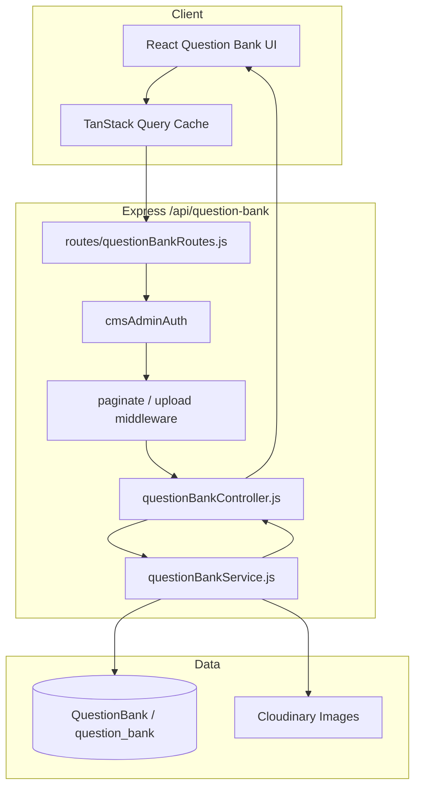
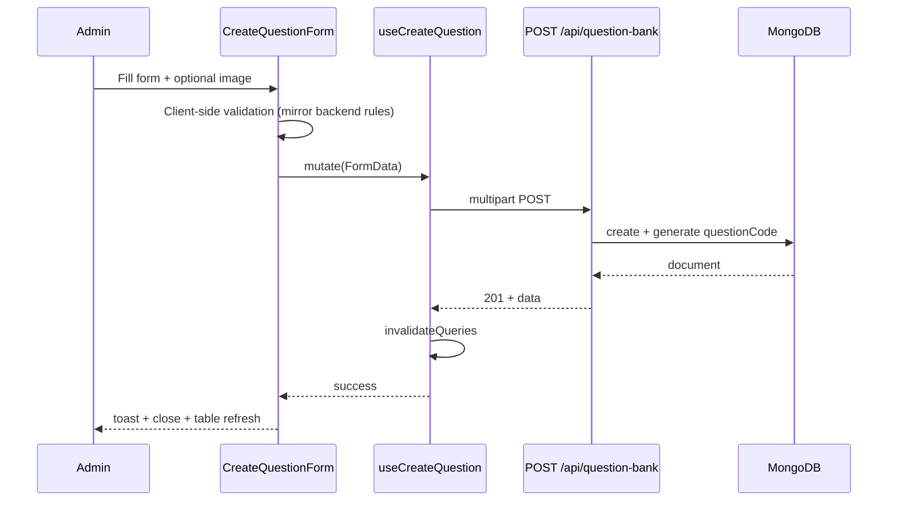
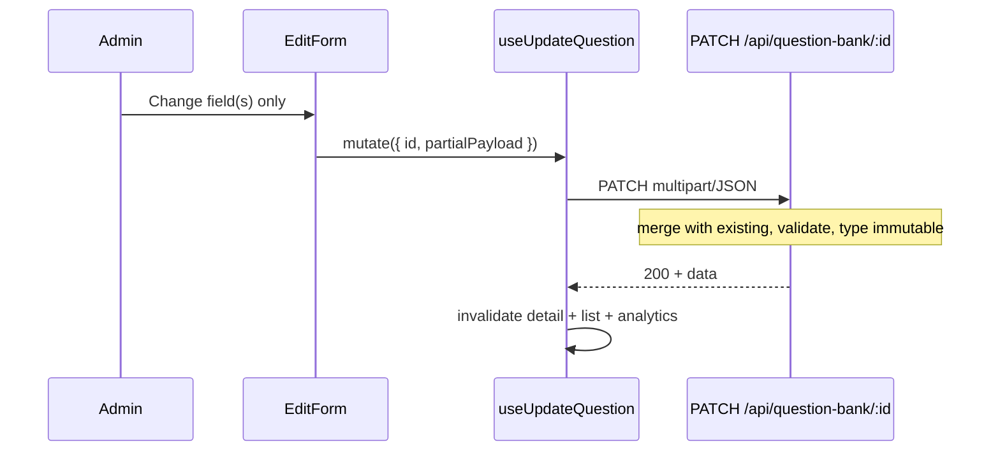
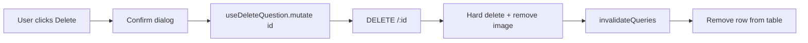
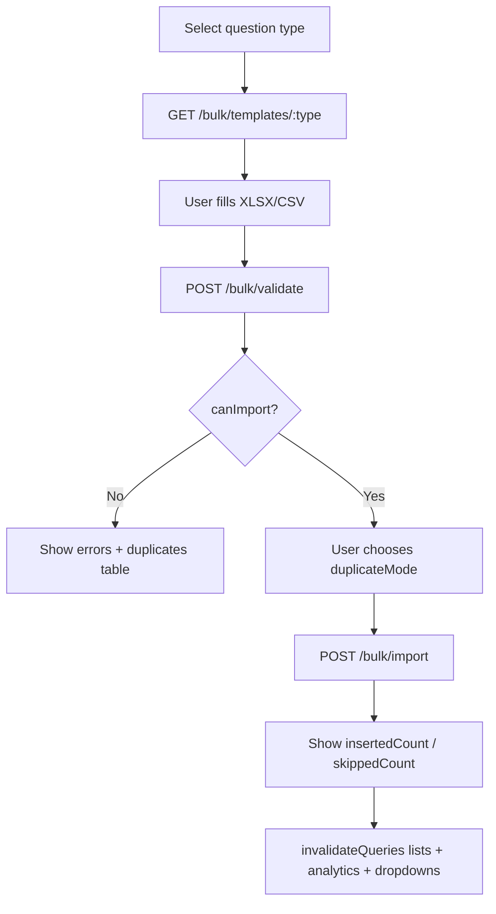
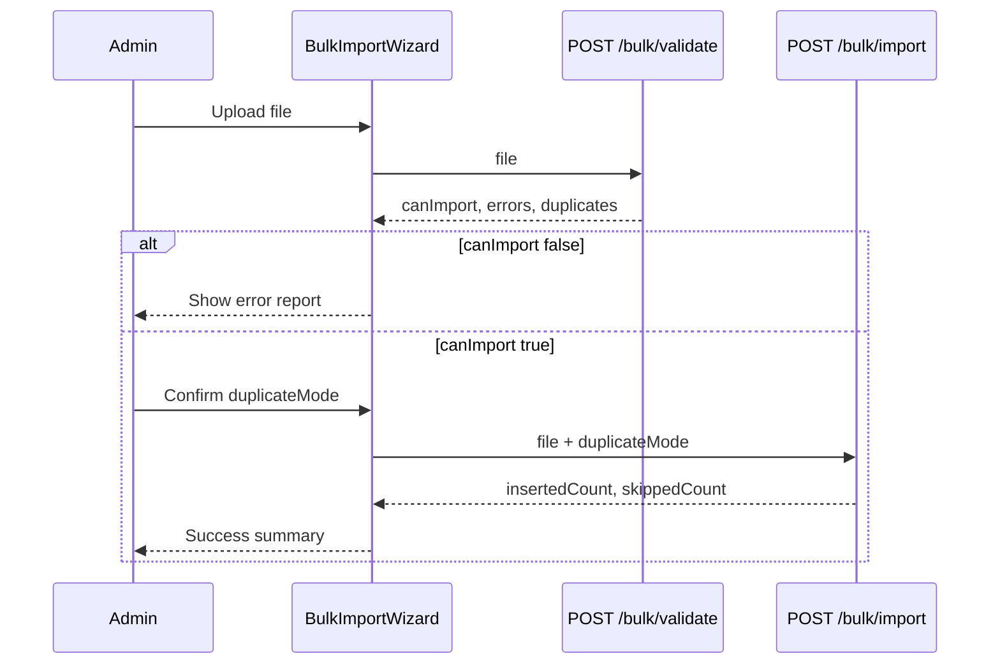
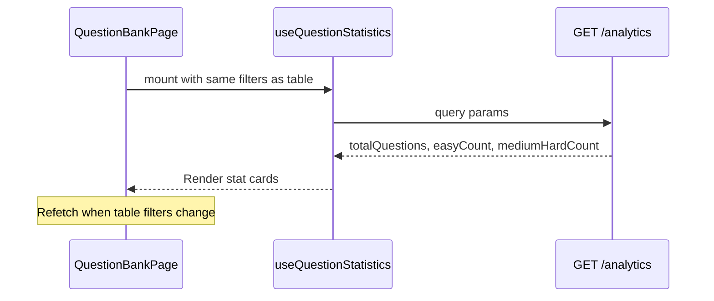
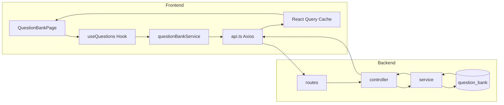

# Test Management → Question Bank — Frontend Integration Guide

**Audience:** React + Vite frontend developers integrating the **Question Bank** module under **Test Management**.

**Backend module:** **Question Bank** (`QuestionBank` model, `questionBankController`, `questionBankService`, `questionBankRoutes`).

**Base path:** `{VITE_API_BASE_URL}/api/question-bank`

**Frontend route (product UI):** `/test-management/question-bank`

**Auth:** `Authorization: Bearer <token>` — **CMS Admin** (`SUPER_ADMIN` or `CENTER_ADMIN`)

**Reference collection:** `QUESTION_BANK_POSTMAN_COLLECTION.json` in the repo root.

---

## Critical naming distinction

| Layer | Name | Notes |
|-------|------|-------|
| Frontend page | **Question Bank** | UI route under Test Management |
| Backend model | **QuestionBank** | MongoDB collection `question_bank` |
| Backend display ID | `questionCode` | Sequential code (e.g. `QB-000001`) — **not** the API path `:id` |
| API path `:id` | MongoDB `_id` | Always use `_id` from list/create/detail for update, delete, status, duplicate |
| Distinct from | `TestQuestion`, `Question`, `LmsTestQuestion` | Separate models/routes — **not** Question Bank |

Question Bank is a **central reusable question repository** for MCQ, Numerical, Match-the-Following, Assertion-Reason, and Descriptive questions. It is **not** the same as per-test question assignment (`/api/test-questions`) or legacy `/api/questions`.

---

## 1. Module Overview

### What is the Question Bank?

The Question Bank is the **master repository** of exam questions used across Test Management (CBT/OMR exam building, mock tests, etc.). Admins create, filter, bulk-import, edit, activate/deactivate, duplicate, and permanently delete questions. Each question receives a system-generated `questionCode` (`QB-` + 6-digit suffix).

### Module purpose

| Capability | Description |
|------------|-------------|
| CRUD | Create, read, update, hard-delete questions of 5 types |
| Filtering | Type, category, subject, topic, difficulty, status, tags, full-text search |
| Analytics | Total questions, easy count, medium+hard count (filter-aware) |
| Bulk import | XLSX/CSV validate → import with duplicate handling |
| Templates | Download type-specific Excel templates |
| Partial update | Send only changed fields on PUT/PATCH |
| Image support | Optional question image (JPG/PNG/WEBP, max 5 MB) via Cloudinary |
| Status | `ACTIVE` / `INACTIVE` (no separate publish/archive/restore) |
| Duplicate | Prefill payload for "Save as new" — does **not** persist until POST |

### Supported question types

| Type | Enum value | Category typical use |
|------|------------|---------------------|
| MCQ | `MCQ` | PRELIMS / MAINS |
| Numerical | `NUMERICAL` | PRELIMS |
| Match the Following | `MATCH_THE_FOLLOWING` | PRELIMS |
| Assertion-Reason | `ASSERTION_REASON` | PRELIMS |
| Descriptive | `DESCRIPTIVE` | MAINS |

**Not supported:** coding questions, OMR sheet scanning APIs, JSON bulk upload, data export of existing questions.

### User journey

```
Login (Super Admin or Center Admin)
  → Navigate to Test Management → Question Bank
  → View analytics cards + paginated question table
  → Apply filters (type, category, subject, topic, difficulty, status, tags, search)
  → Create question manually (form) OR bulk import (template → validate → import)
  → View / Edit / Toggle status / Duplicate / Delete
  → Table refreshes via React Query invalidation
```

### Admin workflow

1. **List page** — Load analytics + dropdown filter options + paginated questions.
2. **Create** — Select type → dynamic form fields → optional image → POST.
3. **Edit** — Load by `_id` → partial PATCH/PUT (type is immutable) → invalidate cache.
4. **Status** — PATCH `/status` with `ACTIVE` or `INACTIVE`.
5. **Duplicate** — POST duplicate → receive prefill object → open create form → POST as new.
6. **Delete** — Confirm → DELETE (permanent; Cloudinary image removed).
7. **Bulk** — Download template → upload file → validate → import with `duplicateMode`.

### Frontend lifecycle

```
Mount QuestionBankPage
  → useQuestionStatistics()     → GET /analytics
  → useQuestionTypes/Categories/Difficulties() → static enum endpoints
  → useSubjects() / useTopics() / useTags()    → dynamic dropdowns
  → useQuestions(filters)       → GET / (paginated list)
User action (create/edit/delete/import)
  → mutation → service → axios → backend
  → onSuccess: invalidateQueries(['questionBank', ...])
  → UI refetch / optimistic update where safe
```

### Available features (verified against backend)

| Feature | Supported |
|---------|-----------|
| Create (manual) | Yes — multipart or JSON (no image) |
| List (paginated) | Yes |
| Get by ID | Yes |
| Update (PUT/PATCH, partial) | Yes |
| Status change (ACTIVE/INACTIVE) | Yes — dedicated PATCH |
| Hard delete | Yes — permanent |
| Soft delete / restore | **No** |
| Archive / publish / unpublish | **No** — use status only |
| Duplicate (prefill) | Yes — not auto-save |
| Bulk import (CSV/XLSX) | Yes |
| Bulk validate | Yes |
| Template download | Yes — per question type |
| Bulk delete | **No** |
| Bulk update | **No** |
| Export existing questions | **No** |
| JSON upload | **No** |
| Search | Yes |
| Pagination | Yes — `page`, `limit` |
| Sorting | Yes — `sortBy`, `sortOrder` |
| Image upload | Yes — field name `image` |
| Languages / Courses / Programs / Faculty dropdowns | **No** — not part of this module |
| Coding questions | **No** |

---

## 2. Backend Architecture

### Request flow

```
HTTP Request
  ↓
app.js  →  app.use('/api/question-bank', questionBankRoutes)
  ↓
routes/questionBankRoutes.js
  ↓  cmsAdminAuth [protect + allowCmsAdmin]
  ↓  paginate (list only)
  ↓  handleQuestionImageUpload | handleBulkFileUpload (where applicable)
  ↓
controllers/questionBankController.js
  ↓
services/questionBankService.js
  ↓
models/QuestionBank.js  →  MongoDB collection `question_bank`
  ↓
utils/* (enums, validators, helpers, bulk parser, duplicate detection, editable fields)
  ↓
JSON Response { success, message?, data?, ...pagination }
```

### Architecture diagram



### Layer reference

| Layer | File | Role |
|-------|------|------|
| Route mount | `app.js` | `app.use('/api/question-bank', questionBankRoutes)` |
| Routes | `routes/questionBankRoutes.js` | 19 endpoints; auth on all |
| Controller | `controllers/questionBankController.js` | HTTP handling, status codes, file checks |
| Service | `services/questionBankService.js` | Business logic, queries, bulk import |
| Model | `models/QuestionBank.js` | Mongoose schema, indexes |
| Auth | `middleware/cmsAdminAuth.js` | `protect` + CMS admin role gate |
| Auth | `middleware/authMiddleware.js` | JWT Bearer validation |
| Pagination | `middleware/resourceMiddleware.js` | `paginate`, `buildPaginationResponse` |
| Upload | `middleware/questionBankUpload.js` | Image + bulk file multer |
| Enums | `utils/questionBankEnums.js` | Types, categories, status, difficulty |
| Validators | `utils/questionBankTypeValidators.js` | Per-type validation + persist payload |
| Helpers | `utils/questionBankHelpers.js` | Normalize form, format response, duplicate prefill |
| Editable fields | `utils/questionBankEditableFields.js` | Partial update merge/sanitize |
| Bulk parser | `utils/questionBankBulkParser.js` | CSV/XLSX parse, templates |
| Duplicate detection | `utils/questionBankDuplicate.js` | Batch + DB duplicate checks |
| ID generator | `utils/contentIdGenerator.js` | `generateQuestionBankCode()` → `QB-` + 6 digits |

**Not implemented:** separate repository layer, DTO classes, Joi/Zod route middleware, Swagger spec, public REST export endpoint.

---

## 3. Complete API Inventory

**Middleware chain (every route):**

```javascript
const adminAuth = cmsAdminAuth; // [protect, allowCmsAdmin]
```

**Allowed roles:** `SUPER_ADMIN`, `CENTER_ADMIN` (via `AdminAccess.roleId.roleCode` or legacy `User.role` of `super_admin` / `center_admin`).

| # | Method | Endpoint | Purpose |
|---|--------|----------|---------|
| 1 | `GET` | `/api/question-bank/analytics` | Dashboard stats |
| 2 | `GET` | `/api/question-bank/types` | Question type enum |
| 3 | `GET` | `/api/question-bank/subjects` | Distinct subjects |
| 4 | `GET` | `/api/question-bank/topics` | Distinct topics (optional subject filter) |
| 5 | `GET` | `/api/question-bank/tags` | Distinct tags (optional subject filter) |
| 6 | `GET` | `/api/question-bank/difficulties` | Difficulty enum |
| 7 | `GET` | `/api/question-bank/categories` | Category enum |
| 8 | `GET` | `/api/question-bank/bulk/templates/:type` | Download XLSX template |
| 9 | `POST` | `/api/question-bank/bulk/validate` | Validate bulk file |
| 10 | `POST` | `/api/question-bank/bulk/import` | Import bulk file |
| 11 | `GET` | `/api/question-bank/editable-fields/:type` | Editable field metadata |
| 12 | `GET` | `/api/question-bank` | Paginated list |
| 13 | `POST` | `/api/question-bank` | Create question |
| 14 | `GET` | `/api/question-bank/:id` | Get by MongoDB `_id` |
| 15 | `PUT` | `/api/question-bank/:id` | Update (partial supported) |
| 16 | `PATCH` | `/api/question-bank/:id` | Update (partial supported) |
| 17 | `DELETE` | `/api/question-bank/:id` | Permanent delete |
| 18 | `PATCH` | `/api/question-bank/:id/status` | Update status only |
| 19 | `POST` | `/api/question-bank/:id/duplicate` | Duplicate prefill |

> **Route ordering:** Bulk and metadata routes are registered **before** `/:id` to avoid path conflicts.

---

### 3.1 GET Analytics

| Property | Value |
|----------|-------|
| **Method** | `GET` |
| **URL** | `/api/question-bank/analytics` |
| **Auth** | Required — CMS Admin |

**Query parameters** (optional filters — same semantics as list):

| Param | Type | Description |
|-------|------|-------------|
| `type` | string | Exact match |
| `category` | string | `PRELIMS` \| `MAINS` |
| `subject` | string | Case-insensitive exact |
| `topic` | string | Case-insensitive exact |
| `difficulty` | string | `EASY` \| `MEDIUM` \| `HARD` |
| `status` | string | `ACTIVE` \| `INACTIVE` |
| `tags` | string | Exact tag match in array |
| `search` | string | Partial match on code, text, subject, topic, tags |

**Success — `200 OK`**

```json
{
  "success": true,
  "message": "Analytics fetched successfully",
  "data": {
    "totalQuestions": 1250,
    "easyCount": 400,
    "mediumHardCount": 850
  }
}
```

---

### 3.2 GET Types

| Property | Value |
|----------|-------|
| **Method** | `GET` |
| **URL** | `/api/question-bank/types` |

**Success — `200 OK`**

```json
{
  "success": true,
  "count": 5,
  "data": ["MCQ", "NUMERICAL", "MATCH_THE_FOLLOWING", "ASSERTION_REASON", "DESCRIPTIVE"]
}
```

---

### 3.3 GET Subjects

| Property | Value |
|----------|-------|
| **Method** | `GET` |
| **URL** | `/api/question-bank/subjects` |

Returns **distinct** `subject` values from existing questions, sorted alphabetically.

**Success — `200 OK`**

```json
{
  "success": true,
  "count": 12,
  "data": ["Economy", "Geography", "Polity"]
}
```

---

### 3.4 GET Topics

| Property | Value |
|----------|-------|
| **Method** | `GET` |
| **URL** | `/api/question-bank/topics` |

**Query parameters**

| Param | Required | Description |
|-------|----------|-------------|
| `subject` | No | When provided, topics filtered to that subject (case-insensitive exact) |

**Success — `200 OK`**

```json
{
  "success": true,
  "count": 8,
  "data": ["Basics", "Constitution", "Preamble"]
}
```

---

### 3.5 GET Tags

| Property | Value |
|----------|-------|
| **Method** | `GET` |
| **URL** | `/api/question-bank/tags` |

**Query parameters**

| Param | Required | Description |
|-------|----------|-------------|
| `subject` | No | Filter tags to questions with matching subject |

**Success — `200 OK`**

```json
{
  "success": true,
  "count": 15,
  "data": ["capital", "constitution", "india"]
}
```

---

### 3.6 GET Difficulties

| Property | Value |
|----------|-------|
| **Method** | `GET` |
| **URL** | `/api/question-bank/difficulties` |

**Success — `200 OK`**

```json
{
  "success": true,
  "count": 3,
  "data": ["EASY", "MEDIUM", "HARD"]
}
```

---

### 3.7 GET Categories

| Property | Value |
|----------|-------|
| **Method** | `GET` |
| **URL** | `/api/question-bank/categories` |

**Success — `200 OK`**

```json
{
  "success": true,
  "count": 2,
  "data": ["PRELIMS", "MAINS"]
}
```

---

### 3.8 GET Bulk Template

| Property | Value |
|----------|-------|
| **Method** | `GET` |
| **URL** | `/api/question-bank/bulk/templates/:type` |
| **Response** | Binary XLSX file (not JSON) |

**Path `:type` values** (case-sensitive keys in `BULK_TEMPLATE_TYPES`):

| URL segment | Maps to type |
|-------------|--------------|
| `mcq` | MCQ |
| `numerical` | NUMERICAL |
| `match-the-following` | MATCH_THE_FOLLOWING |
| `assertion-reason` | ASSERTION_REASON |
| `descriptive` | DESCRIPTIVE |

**Headers on success:**

- `Content-Type: application/vnd.openxmlformats-officedocument.spreadsheetml.sheet`
- `Content-Disposition: attachment; filename="question-bank-{type}-template.xlsx"`

**Error — `400`:** `{ "success": false, "message": "Invalid template type" }`

---

### 3.9 POST Bulk Validate

| Property | Value |
|----------|-------|
| **Method** | `POST` |
| **URL** | `/api/question-bank/bulk/validate` |
| **Content-Type** | `multipart/form-data` |

**Body**

| Field | Required | Rules |
|-------|----------|-------|
| `file` | Yes | CSV or XLSX/XLS; max 5 MB |

**Success — `200 OK`**

```json
{
  "success": true,
  "message": "File is valid and ready to import",
  "data": {
    "totalRows": 10,
    "validRows": 10,
    "invalidRows": 0,
    "duplicateRows": 2,
    "duplicates": [
      {
        "row": 5,
        "reason": "Duplicate within uploaded file (same category + type + content)",
        "category": "PRELIMS",
        "type": "MCQ",
        "questionText": "...",
        "duplicateOfRow": 3
      }
    ],
    "errors": [],
    "canImport": true
  }
}
```

When validation errors exist: `message: "File has validation errors"`, `canImport: false`.

**Error — `400` (no file):**

```json
{
  "success": false,
  "message": "Validation failed",
  "errors": [{ "field": "file", "message": "XLSX or CSV file is required" }]
}
```

---

### 3.10 POST Bulk Import

| Property | Value |
|----------|-------|
| **Method** | `POST` |
| **URL** | `/api/question-bank/bulk/import` |
| **Content-Type** | `multipart/form-data` |

**Body**

| Field | Required | Rules |
|-------|----------|-------|
| `file` | Yes | Valid CSV/XLSX (must pass validation) |
| `duplicateMode` | No | `SKIP` (default) or `UPLOAD_ANYWAY` |

**Duplicate logic:** Same `category + type + content` (content = questionText, assertion, or match prompt). `SKIP` skips duplicate rows; `UPLOAD_ANYWAY` inserts duplicates anyway.

**Success — `201 Created`**

```json
{
  "success": true,
  "message": "8 question(s) imported successfully",
  "data": {
    "insertedCount": 8,
    "duplicateCount": 2,
    "skippedCount": 2,
    "failedCount": 0,
    "questionCodes": ["QB-000101", "QB-000102"],
    "errors": []
  }
}
```

**Error — `400` (validation failed):**

```json
{
  "success": false,
  "message": "Bulk upload validation failed",
  "data": { "...validation object..." }
}
```

---

### 3.11 GET Editable Fields

| Property | Value |
|----------|-------|
| **Method** | `GET` |
| **URL** | `/api/question-bank/editable-fields/:type` |

**Path `:type`:** One of `MCQ`, `NUMERICAL`, `MATCH_THE_FOLLOWING`, `ASSERTION_REASON`, `DESCRIPTIVE`.

**Success — `200 OK`**

```json
{
  "success": true,
  "message": "Editable fields fetched successfully",
  "data": {
    "type": "MCQ",
    "commonFields": ["category", "status", "subject", "topic", "difficulty", "tags", "questionText", "explanation"],
    "typeSpecificFields": ["optionA", "optionB", "optionC", "optionD", "correctAnswer"],
    "imageField": "image",
    "removeImageField": "removeImage",
    "nonEditableFields": ["_id", "questionCode", "type", "usageCount", "createdBy", "updatedBy", "createdAt", "updatedAt"]
  }
}
```

---

### 3.12 GET List Questions

| Property | Value |
|----------|-------|
| **Method** | `GET` |
| **URL** | `/api/question-bank` |

**Query parameters**

| Param | Default | Description |
|-------|---------|-------------|
| `page` | `1` | Page number |
| `limit` | `10` | Page size |
| `sortBy` | `createdAt` | See allowed sort fields |
| `sortOrder` | `desc` | `asc` or `desc` |
| `type` | — | Exact enum match |
| `category` | — | `PRELIMS` \| `MAINS` |
| `subject` | — | Case-insensitive exact |
| `topic` | — | Case-insensitive exact |
| `difficulty` | — | `EASY` \| `MEDIUM` \| `HARD` |
| `status` | — | `ACTIVE` \| `INACTIVE` |
| `tags` | — | Exact tag string match |
| `search` | — | Partial match on questionCode, questionText, subject, topic, tags |

**Allowed `sortBy`:** `createdAt`, `questionCode`, `subject`, `difficulty`, `usageCount`, `type`, `category`

**Success — `200 OK`**

```json
{
  "success": true,
  "message": "Questions fetched successfully",
  "count": 10,
  "total": 125,
  "page": 1,
  "limit": 10,
  "totalPages": 13,
  "hasNextPage": true,
  "hasPrevPage": false,
  "data": [
    {
      "_id": "674a1b2c3d4e5f6789012345",
      "questionCode": "QB-000042",
      "category": "PRELIMS",
      "type": "MCQ",
      "subject": "Polity",
      "topic": "Basics",
      "difficulty": "EASY",
      "tags": ["india", "capital"],
      "status": "ACTIVE",
      "questionText": "What is the capital of India?",
      "questionPreview": "What is the capital of India?",
      "explanation": "New Delhi is the capital",
      "imageUrl": null,
      "usageCount": 3,
      "optionA": "Mumbai",
      "optionB": "New Delhi",
      "optionC": "Kolkata",
      "optionD": "Chennai",
      "correctAnswer": "B",
      "createdBy": null,
      "updatedBy": null,
      "createdAt": "2026-06-27T10:00:00.000Z",
      "updatedAt": "2026-06-27T10:00:00.000Z"
    }
  ]
}
```

---

### 3.13 POST Create Question

| Property | Value |
|----------|-------|
| **Method** | `POST` |
| **URL** | `/api/question-bank` |
| **Content-Type** | `multipart/form-data` (with optional image) **or** `application/json` (no image) |

**Common fields (all types)**

| Field | Required | Validation |
|-------|----------|------------|
| `category` | Yes | `PRELIMS` \| `MAINS` |
| `type` | Yes | One of 5 question types (alias `questionType` accepted on normalize) |
| `subject` | Yes | Non-empty string |
| `topic` | Yes | Non-empty string |
| `difficulty` | Yes | `EASY` \| `MEDIUM` \| `HARD` |
| `questionText` | Yes | Non-empty string |
| `status` | No | Default `ACTIVE` |
| `tags` | No | Comma-separated string or array |
| `explanation` | No | String |
| `image` | No | JPG/PNG/WEBP, max 5 MB |

**Type-specific fields**

| Type | Additional required fields |
|------|---------------------------|
| MCQ | `optionA`–`optionD`, `correctAnswer` (A/B/C/D or 1–4) |
| NUMERICAL | `numericalAnswer` (valid number string) |
| MATCH_THE_FOLLOWING | `prompt`, `left1`/`right1`, `left2`/`right2`, … (min 2 pairs) |
| ASSERTION_REASON | `assertion`, `reason`, `correctAnswer` (assertion-reason label or enum) |
| DESCRIPTIVE | None beyond common fields |

**Success — `201 Created`**

```json
{
  "success": true,
  "message": "Question created successfully",
  "data": { "...formatted question..." }
}
```

**Error — `400` validation:**

```json
{
  "success": false,
  "message": "Validation failed",
  "errors": [{ "field": "optionA", "message": "optionA is required" }]
}
```

---

### 3.14 GET Question by ID

| Property | Value |
|----------|-------|
| **Method** | `GET` |
| **URL** | `/api/question-bank/:id` |

**Error — `404`:** `{ "success": false, "message": "Question not found" }`

---

### 3.15 PUT / PATCH Update Question

| Property | Value |
|----------|-------|
| **Method** | `PUT` or `PATCH` |
| **URL** | `/api/question-bank/:id` |
| **Content-Type** | `multipart/form-data` or `application/json` |

**Partial update rules:**

- Send **only fields you want to change**.
- Backend merges with existing values internally.
- **`type` cannot be changed** — returns `400` if attempted.
- At least one editable field, new `image`, or `removeImage: true` required.
- Protected fields ignored: `_id`, `questionCode`, `usageCount`, `type`, `imageUrl`, etc.

**Special fields**

| Field | Purpose |
|-------|---------|
| `image` | Replace existing image |
| `removeImage` | `true` / `"true"` / `"1"` — deletes Cloudinary image |

**Success — `200 OK`**

```json
{
  "success": true,
  "message": "Question updated successfully",
  "data": { "...updated question..." }
}
```

---

### 3.16 DELETE Question

| Property | Value |
|----------|-------|
| **Method** | `DELETE` |
| **URL** | `/api/question-bank/:id` |

**Permanent hard delete** — removes MongoDB document and Cloudinary image.

**Success — `200 OK`**

```json
{
  "success": true,
  "message": "Question permanently deleted",
  "data": { "...deleted question snapshot..." }
}
```

---

### 3.17 PATCH Status

| Property | Value |
|----------|-------|
| **Method** | `PATCH` |
| **URL** | `/api/question-bank/:id/status` |
| **Content-Type** | `application/json` |

**Body**

```json
{ "status": "INACTIVE" }
```

| Field | Required | Values |
|-------|----------|--------|
| `status` | Yes | `ACTIVE` \| `INACTIVE` |

**Success — `200 OK`**

```json
{
  "success": true,
  "message": "Status updated successfully",
  "data": { "...question with new status..." }
}
```

---

### 3.18 POST Duplicate (Prefill)

| Property | Value |
|----------|-------|
| **Method** | `POST` |
| **URL** | `/api/question-bank/:id/duplicate` |

Does **not** create a DB record. Returns prefill payload for the create form.

**Success — `200 OK`**

```json
{
  "success": true,
  "message": "Duplicate prefill generated — save as new question",
  "data": {
    "category": "PRELIMS",
    "type": "MCQ",
    "status": "ACTIVE",
    "subject": "Polity",
    "...": "all fields except _id, questionCode, timestamps, usageCount"
  }
}
```

Frontend must call **POST /** to persist the duplicate.

---

## 4. API-to-Frontend Mapping

| Backend Endpoint | Frontend Service Method | React Query Hook | React Component | Screen |
|------------------|------------------------|------------------|-----------------|--------|
| `GET /analytics` | `getAnalytics(filters)` | `useQuestionStatistics` | `QuestionBankStatsCards` | Question Bank List |
| `GET /types` | `getTypes()` | `useQuestionTypes` | `QuestionTypeFilter`, `QuestionTypeSelect` | List / Create / Edit |
| `GET /subjects` | `getSubjects()` | `useSubjects` | `SubjectFilter`, `SubjectSelect` | List / Create / Edit |
| `GET /topics?subject=` | `getTopics(subject?)` | `useTopics(subject)` | `TopicFilter`, `TopicSelect` | List / Create / Edit |
| `GET /tags?subject=` | `getTags(subject?)` | `useTags(subject)` | `TagsFilter`, `TagsInput` | List / Create / Edit |
| `GET /difficulties` | `getDifficulties()` | `useDifficultyLevels` | `DifficultyFilter`, `DifficultySelect` | List / Create / Edit |
| `GET /categories` | `getCategories()` | `useQuestionCategories` | `CategorySelect` | Create / Edit / Filter |
| `GET /editable-fields/:type` | `getEditableFields(type)` | `useEditableFields(type)` | `DynamicQuestionForm` | Edit |
| `GET /` | `listQuestions(params)` | `useQuestions(params)` | `QuestionBankTable` | Question Bank List |
| `GET /:id` | `getQuestion(id)` | `useQuestion(id)` | `QuestionDetailDrawer`, `QuestionEditForm` | View / Edit |
| `POST /` | `createQuestion(payload, file?)` | `useCreateQuestion` | `CreateQuestionModal` | Create |
| `PUT\|PATCH /:id` | `updateQuestion(id, payload, file?)` | `useUpdateQuestion` | `QuestionEditForm` | Edit |
| `DELETE /:id` | `deleteQuestion(id)` | `useDeleteQuestion` | `DeleteQuestionDialog` | List |
| `PATCH /:id/status` | `updateQuestionStatus(id, status)` | `useUpdateQuestionStatus` | `StatusToggle`, `StatusBadge` | List / Edit |
| `POST /:id/duplicate` | `duplicateQuestion(id)` | `useDuplicateQuestion` | `DuplicateQuestionAction` | List |
| `GET /bulk/templates/:type` | `downloadTemplate(type)` | `useDownloadTemplate` | `BulkImportWizard` | Bulk Import |
| `POST /bulk/validate` | `validateBulkFile(file)` | `useValidateBulkFile` | `BulkImportWizard` | Bulk Import |
| `POST /bulk/import` | `importBulkFile(file, mode)` | `useImportBulkFile` | `BulkImportWizard` | Bulk Import |

---

## 5. Frontend Folder Structure

Recommended enterprise layout:

```
src/
├── services/
│   ├── api.ts                          # Axios instance + interceptors
│   └── questionBankService.ts          # All /api/question-bank calls
├── hooks/
│   └── questionBank/
│       ├── useQuestions.ts
│       ├── useQuestion.ts
│       ├── useCreateQuestion.ts
│       ├── useUpdateQuestion.ts
│       ├── useDeleteQuestion.ts
│       ├── useQuestionStatistics.ts
│       ├── useQuestionTypes.ts
│       ├── useSubjects.ts
│       ├── useTopics.ts
│       ├── useTags.ts
│       ├── useDifficultyLevels.ts
│       ├── useDuplicateQuestion.ts
│       ├── useBulkImport.ts
│       └── queryKeys.ts
├── components/
│   └── questionBank/
│       ├── QuestionBankTable.tsx
│       ├── QuestionBankFilters.tsx
│       ├── QuestionBankStatsCards.tsx
│       ├── QuestionTypeFormFields/
│       │   ├── McqFields.tsx
│       │   ├── NumericalFields.tsx
│       │   ├── MatchFields.tsx
│       │   ├── AssertionReasonFields.tsx
│       │   └── DescriptiveFields.tsx
│       ├── CreateQuestionModal.tsx
│       ├── QuestionDetailDrawer.tsx
│       ├── DeleteQuestionDialog.tsx
│       ├── BulkImportWizard.tsx
│       └── StatusBadge.tsx
├── pages/
│   └── testManagement/
│       └── QuestionBankPage.tsx
├── types/
│   └── questionBank.ts
├── providers/
│   └── QueryProvider.tsx
├── utils/
│   ├── formDataBuilder.ts              # Build multipart from form state
│   └── questionBankErrors.ts
└── routes/
    └── testManagementRoutes.tsx
```

---

## 6. Centralized Axios Integration

### `api.ts`

```typescript
import axios from 'axios';

const api = axios.create({
  baseURL: import.meta.env.VITE_API_BASE_URL,
  timeout: 30000,
});

api.interceptors.request.use((config) => {
  const token = localStorage.getItem('authToken'); // or your auth store
  if (token) {
    config.headers.Authorization = `Bearer ${token}`;
  }
  return config;
});

api.interceptors.response.use(
  (response) => response,
  (error) => {
    const status = error.response?.status;
    if (status === 401) {
      // redirect to login / clear token
    }
    if (status === 403) {
      // show insufficient permissions toast
    }
    return Promise.reject(error);
  }
);

export default api;
```

### Environment variables

| Variable | Example | Purpose |
|----------|---------|---------|
| `VITE_API_BASE_URL` | `https://sriramias-backend.onrender.com` | Backend origin — **never hardcode** |

Service paths append `/api/question-bank`.

---

## 7. TanStack Query Integration

### Query keys (`queryKeys.ts`)

```typescript
export const questionBankKeys = {
  all: ['questionBank'] as const,
  lists: () => [...questionBankKeys.all, 'list'] as const,
  list: (filters: Record<string, unknown>) =>
    [...questionBankKeys.lists(), filters] as const,
  details: () => [...questionBankKeys.all, 'detail'] as const,
  detail: (id: string) => [...questionBankKeys.details(), id] as const,
  analytics: (filters: Record<string, unknown>) =>
    [...questionBankKeys.all, 'analytics', filters] as const,
  types: () => [...questionBankKeys.all, 'types'] as const,
  subjects: () => [...questionBankKeys.all, 'subjects'] as const,
  topics: (subject?: string) => [...questionBankKeys.all, 'topics', subject] as const,
  tags: (subject?: string) => [...questionBankKeys.all, 'tags', subject] as const,
  difficulties: () => [...questionBankKeys.all, 'difficulties'] as const,
  categories: () => [...questionBankKeys.all, 'categories'] as const,
  editableFields: (type: string) =>
    [...questionBankKeys.all, 'editableFields', type] as const,
};
```

### List query

```typescript
export function useQuestions(filters: QuestionListFilters) {
  return useQuery({
    queryKey: questionBankKeys.list(filters),
    queryFn: () => questionBankService.listQuestions(filters),
    placeholderData: keepPreviousData,
  });
}
```

### Create mutation

```typescript
export function useCreateQuestion() {
  const queryClient = useQueryClient();
  return useMutation({
    mutationFn: questionBankService.createQuestion,
    onSuccess: () => {
      queryClient.invalidateQueries({ queryKey: questionBankKeys.lists() });
      queryClient.invalidateQueries({ queryKey: questionBankKeys.all });
    },
  });
}
```

### Update mutation (no optimistic type change)

```typescript
export function useUpdateQuestion() {
  const queryClient = useQueryClient();
  return useMutation({
    mutationFn: ({ id, payload, file }: UpdateArgs) =>
      questionBankService.updateQuestion(id, payload, file),
    onSuccess: (_data, { id }) => {
      queryClient.invalidateQueries({ queryKey: questionBankKeys.detail(id) });
      queryClient.invalidateQueries({ queryKey: questionBankKeys.lists() });
      queryClient.invalidateQueries({ queryKey: questionBankKeys.all });
    },
  });
}
```

### Status toggle — optional optimistic update

```typescript
onMutate: async ({ id, status }) => {
  await queryClient.cancelQueries({ queryKey: questionBankKeys.lists() });
  // snapshot + patch list cache for instant UI
},
onError: (_err, _vars, context) => {
  // rollback from context
},
```

### Cache strategy

| Data | `staleTime` suggestion | Notes |
|------|------------------------|-------|
| types, categories, difficulties | 24h | Static enums from backend |
| subjects, topics, tags | 5–10 min | Invalidate after create/update if new values |
| list, analytics | 0–30s | Invalidate on every mutation |
| detail | 30s | Invalidate on update/delete/status |

---

## 8. Custom Hooks

| Hook | API | Used by |
|------|-----|---------|
| `useQuestions(filters)` | `GET /` | Table, filters |
| `useQuestion(id)` | `GET /:id` | Detail drawer, edit form |
| `useCreateQuestion()` | `POST /` | Create modal |
| `useUpdateQuestion()` | `PUT/PATCH /:id` | Edit form |
| `useDeleteQuestion()` | `DELETE /:id` | Delete dialog |
| `useQuestionStatistics(filters)` | `GET /analytics` | Stats cards |
| `useQuestionTypes()` | `GET /types` | Type select/filter |
| `useSubjects()` | `GET /subjects` | Subject select/filter |
| `useTopics(subject?)` | `GET /topics` | Topic select — refetch when subject changes |
| `useTags(subject?)` | `GET /tags` | Tag autocomplete |
| `useDifficultyLevels()` | `GET /difficulties` | Difficulty select |
| `useQuestionCategories()` | `GET /categories` | Category select |
| `useDuplicateQuestion()` | `POST /:id/duplicate` | Duplicate action |
| `useUpdateQuestionStatus()` | `PATCH /:id/status` | Status toggle |
| `useValidateBulkFile()` | `POST /bulk/validate` | Import wizard step 2 |
| `useImportBulkFile()` | `POST /bulk/import` | Import wizard step 3 |

**Dependency example — topics depend on subject:**

```typescript
const subject = watch('subject');
const { data: topics } = useTopics(subject || undefined);
```

Clear `topic` field when subject changes in the form.

---

## 9. Component Integration Flow

```
QuestionBankTable
  → useQuestions({ page, limit, search, type, ... })
    → questionBankService.listQuestions(params)
      → api.get('/api/question-bank', { params })
        → Backend listQuestions
          → MongoDB find + count
            → formatQuestionBankResponse
              → React Query cache ['questionBank', 'list', filters]
                → Table re-renders with rows + pagination
```

```
CreateQuestionModal.onSubmit
  → useCreateQuestion.mutate(formData)
    → questionBankService.createQuestion (FormData)
      → api.post('/api/question-bank', formData)
        → createQuestion + optional Cloudinary upload
          → 201 + data
            → invalidateQueries lists + analytics
              → Close modal + toast success
```

---

## 10. Dropdown APIs

| Dropdown | Endpoint | Static / Dynamic | Depends on | Default | Cache |
|----------|----------|------------------|------------|---------|-------|
| Question Types | `GET /types` | Static enum | — | — | Long TTL |
| Categories | `GET /categories` | Static enum | — | `PRELIMS` for MCQ types | Long TTL |
| Difficulties | `GET /difficulties` | Static enum | — | `MEDIUM` (UI choice) | Long TTL |
| Subjects | `GET /subjects` | Dynamic distinct | — | Empty until user selects | Medium TTL |
| Topics | `GET /topics?subject=` | Dynamic distinct | `subject` | Clear when subject empty | Refetch on subject |
| Tags | `GET /tags?subject=` | Dynamic distinct | `subject` (optional) | `[]` | Medium TTL |
| Status | **No API** | Hardcode `ACTIVE`, `INACTIVE` | — | `ACTIVE` on create | N/A |

**Not available in Question Bank module:** Languages, Courses, Programs, Faculty — do not call other modules unless product explicitly requires cross-module subject masters.

### Validation alignment

- Subject/topic on create are **free-text** — not validated against dropdown lists.
- Dropdown values are suggestions from existing questions; admins may enter new subject/topic strings.

---

## 11. Question Management Flows

### Create Question



### Edit Question



### Delete Question



### View Question

`GET /:id` → `QuestionDetailDrawer` — read-only display of formatted response including type-specific fields and `questionPreview`.

### Duplicate Question

1. `POST /:id/duplicate` → prefill object (no `_id`, no `questionCode`).
2. Open create form pre-populated.
3. User edits if needed → `POST /` → new question with new `questionCode`.

### Status (Activate / Deactivate)

Use `PATCH /:id/status` with `{ "status": "ACTIVE" | "INACTIVE" }`.

**There is no** separate archive, restore, publish, or unpublish endpoint.

### Bulk Import



### Not implemented — do not build UI expecting these APIs

| Flow | Status |
|------|--------|
| Bulk Delete | **No backend endpoint** |
| Bulk Export (existing data) | **No backend endpoint** |
| Archive / Restore | **No** — use status |
| Publish / Unpublish | **No** — use status |
| Reports (beyond analytics) | **No** |

---

## 12. Table Integration

| Feature | Implementation |
|---------|----------------|
| Pagination | `page`, `limit` query params; render `total`, `totalPages`, `hasNextPage`, `hasPrevPage` |
| Sorting | Column headers → update `sortBy` + `sortOrder`; allowed fields from §3.12 |
| Searching | Debounced `search` input (300–500ms) |
| Filtering | `type`, `category`, `subject`, `topic`, `difficulty`, `status`, `tags` |
| Selection | Client-side only — **no bulk delete API** |
| Bulk Actions | Only **Bulk Import** entry point — not row multi-select delete |
| Actions menu | View, Edit, Duplicate, Toggle Status, Delete |
| Refresh | `refetch()` or `invalidateQueries` |
| Optimistic updates | Safe for status toggle only |
| Status badges | `ACTIVE` → green; `INACTIVE` → gray/red |
| Columns suggested | questionCode, questionPreview, type, category, subject, topic, difficulty, status, usageCount, createdAt |

---

## 13. Form Integration

### Common fields

| Field | Required | Default | Validation |
|-------|----------|---------|------------|
| `category` | Yes | — | PRELIMS \| MAINS |
| `type` | Yes (create only) | — | Immutable on update |
| `subject` | Yes | — | Non-empty |
| `topic` | Yes | — | Non-empty |
| `difficulty` | Yes | — | EASY \| MEDIUM \| HARD |
| `questionText` | Yes | — | Non-empty |
| `status` | No | ACTIVE | ACTIVE \| INACTIVE |
| `tags` | No | [] | Comma-separated → array |
| `explanation` | No | — | Optional string |
| `image` | No | — | JPG/PNG/WEBP ≤ 5MB |

### MCQ fields

| Field | Required |
|-------|----------|
| optionA–optionD | Yes |
| correctAnswer | Yes — A/B/C/D or 1–4 |

### NUMERICAL

| Field | Required |
|-------|----------|
| numericalAnswer | Yes — numeric string |

### MATCH_THE_FOLLOWING

| Field | Required |
|-------|----------|
| prompt | Yes |
| left1/right1, left2/right2, … | Min 2 complete pairs |

### ASSERTION_REASON

| Field | Required |
|-------|----------|
| assertion | Yes |
| reason | Yes |
| correctAnswer | Yes — see assertion answer labels below |

**Assertion answer values (API enum):**

| Enum | UI label (accepted on input) |
|------|------------------------------|
| `BOTH_TRUE_REASON_EXPLAINS` | Both true & R explains A |
| `BOTH_TRUE_REASON_NOT_EXPLAINS` | Both true but R not explanation |
| `ASSERTION_TRUE_REASON_FALSE` | A true, R false |
| `ASSERTION_FALSE_REASON_TRUE` | A false, R true |

### DESCRIPTIVE

No type-specific fields beyond common fields.

### Submission flow

1. Build `FormData` for multipart (recommended when image present).
2. POST or PATCH to backend.
3. On success: toast, reset form (create), navigate/close (edit).
4. On `400`: map `errors[]` to field-level messages.

### Reset behaviour

- Create: reset all fields; keep `type` if user creates multiple of same type.
- Edit: revert to last fetched `useQuestion` data on cancel.

---

## 14. File Upload Integration

### Question image (create/update)

| Property | Value |
|----------|-------|
| Field name | `image` |
| Formats | JPG, PNG, WEBP |
| Max size | 5 MB |
| Content-Type | `multipart/form-data` |
| Remove | `removeImage: true` on PATCH (no file) |

### Bulk import file

| Property | Value |
|----------|-------|
| Field name | `file` |
| Formats | CSV, XLSX, XLS |
| Max size | 5 MB |
| Extra field | `duplicateMode`: `SKIP` \| `UPLOAD_ANYWAY` |

### Template download

Use `responseType: 'blob'` in Axios:

```typescript
const response = await api.get(`/api/question-bank/bulk/templates/mcq`, {
  responseType: 'blob',
});
const url = window.URL.createObjectURL(new Blob([response.data]));
// trigger download with filename from Content-Disposition or default
```

### Bulk CSV/XLSX column headers

See `utils/questionBankBulkParser.js` `TEMPLATE_HEADERS` — e.g. MCQ: `category`, `questionType`, `questionText`, `optionA`–`optionD`, `correctAnswer`, `explanation`, `difficulty`, `subject`, `topic`, `tags`, `status`.

### Progress

Backend does not stream progress — show indeterminate spinner during validate/import.

---

## 15. Authentication

| Requirement | Detail |
|-------------|--------|
| Header | `Authorization: Bearer <JWT>` |
| Roles | `SUPER_ADMIN`, `CENTER_ADMIN` |
| 401 | Missing/invalid token — redirect to login |
| 403 | `"Access denied. Insufficient permissions."` — hide Question Bank route |
| Role guard | Wrap route with CMS admin check matching backend |

Login endpoints (outside this module): e.g. `POST /api/auth/login-super-admin` per Postman collection.

---

## 16. Error Handling

| Status | When | Frontend action |
|--------|------|-----------------|
| 400 | Validation failed | Show `message` + field `errors[]` |
| 401 | No/invalid token | Logout + redirect |
| 403 | Wrong role | Toast + redirect |
| 404 | Question not found | Toast + remove stale cache |
| 409 | — | Not used by Question Bank |
| 422 | — | Not used — validation is 400 |
| 500 | Server error | Generic toast + optional retry |

### Validation error shape

```json
{
  "success": false,
  "message": "Validation failed",
  "errors": [
    { "field": "correctAnswer", "message": "correctAnswer must be A, B, C, or D" },
    { "row": 5, "field": "subject", "message": "subject is required" }
  ]
}
```

Bulk errors include `row` (Excel row number, 1-based header + data).

### Centralized handler

```typescript
export function getApiErrorMessage(error: unknown): string {
  if (axios.isAxiosError(error)) {
    return error.response?.data?.message ?? error.message;
  }
  return 'Something went wrong';
}
```

---

## 17. Loading States

| UI area | Pattern |
|---------|---------|
| Page initial load | Full-page skeleton or spinner while `useQuestions` + stats loading |
| Table refetch | Subtle overlay or `isFetching` indicator — keep previous data via `keepPreviousData` |
| Create/Edit submit | Disable button + spinner on `isPending` |
| Delete | Confirm dialog button loading |
| Bulk validate/import | Step wizard with progress text |
| Dropdowns | Small skeleton or cached stale data |
| Background refetch | `isFetching && !isLoading` — optional refresh icon animation |

---

## 18. Sequence Diagrams

### Import Questions



### Statistics



---

## 19. Data Flow Diagrams



---

## 20. Backend File Mapping

| Backend File | Purpose | Frontend Service | React Hook | Frontend Component |
|--------------|---------|------------------|------------|-------------------|
| `app.js` | Mount `/api/question-bank` | — | — | — |
| `routes/questionBankRoutes.js` | Route definitions | `questionBankService.*` | All hooks | All pages |
| `controllers/questionBankController.js` | HTTP layer | Service methods | — | — |
| `services/questionBankService.js` | Business logic | Service methods | — | — |
| `models/QuestionBank.js` | Schema | Types in `questionBank.ts` | — | — |
| `middleware/cmsAdminAuth.js` | Auth gate | Axios Bearer token | — | Route guard |
| `middleware/authMiddleware.js` | JWT protect | Axios Bearer token | — | — |
| `middleware/resourceMiddleware.js` | Pagination | `listQuestions` params | `useQuestions` | Table |
| `middleware/questionBankUpload.js` | Multer upload | FormData builder | Mutations | Create/Edit/Import |
| `utils/questionBankEnums.js` | Constants | Type definitions | Dropdown hooks | Selects |
| `utils/questionBankTypeValidators.js` | Validation rules | Client form validation | — | Forms |
| `utils/questionBankHelpers.js` | Response shape | Type definitions | — | Display components |
| `utils/questionBankEditableFields.js` | Partial update rules | Update payload builder | `useEditableFields` | Edit form |
| `utils/questionBankBulkParser.js` | Bulk parse/template | `downloadTemplate`, import | `useBulkImport` | Import wizard |
| `utils/questionBankDuplicate.js` | Duplicate detection | — | — | Import validation UI |
| `utils/contentIdGenerator.js` | QB- code generation | Display only | — | Table column |
| `config/cloudinary.js` | Image storage | — | — | Image preview |
| `utils/uploadToCloudinary.js` | Image upload | — | — | — |
| `QUESTION_BANK_POSTMAN_COLLECTION.json` | API examples | Dev reference | — | QA |

**Internal only (no API):** `incrementQuestionBankUsage` in service — used internally for future test assignment; **not exposed to frontend**.

---

## 21. Enterprise Integration Standards

1. **Centralized API layer** — All URLs in `questionBankService.ts` only.
2. **Axios instance** — Single `api.ts` with interceptors.
3. **Environment variables** — `VITE_API_BASE_URL` for all requests.
4. **TanStack Query** — No raw `useEffect` fetches in components.
5. **Service layer** — Components never call `axios` directly.
6. **Custom hooks** — One hook per API concern; co-locate query keys.
7. **Shared error handler** — Map backend `message` + `errors` consistently.
8. **Protected routes** — CMS admin role guard on `/test-management/question-bank`.
9. **Role guards** — Match `SUPER_ADMIN` and `CENTER_ADMIN`.
10. **Shared loading components** — `TableSkeleton`, `ButtonSpinner`.
11. **Shared error components** — `FormFieldError`, `ApiErrorAlert`.
12. **Type safety** — `types/questionBank.ts` mirrors response shapes.
13. **FormData builder** — Central utility for multipart create/update.
14. **No invented APIs** — Bulk delete/export/archive REST endpoints do not exist.

---

## 22. Complete Frontend Integration Checklist

Verify each item against the backend implementation above:

| Item | Verified | Notes |
|------|----------|-------|
| Environment Variables | ✅ | `VITE_API_BASE_URL` |
| Axios Instance | ✅ | Bearer token on all routes |
| Service Layer | ✅ | 19 endpoints in `questionBankService.ts` |
| React Query | ✅ | List, detail, dropdowns, mutations |
| Custom Hooks | ✅ | See §8 |
| Authentication | ✅ | `cmsAdminAuth` — JWT required |
| Role Guards | ✅ | SUPER_ADMIN + CENTER_ADMIN |
| Dropdown APIs | ✅ | types, subjects, topics, tags, difficulties, categories |
| CRUD APIs | ✅ | Create, read, update, hard delete |
| Search | ✅ | `search` query param |
| Filters | ✅ | type, category, subject, topic, difficulty, status, tags |
| Pagination | ✅ | page, limit + response metadata |
| Sorting | ✅ | sortBy, sortOrder |
| Bulk Actions | ⚠️ | Import only — **no bulk delete** |
| Import | ✅ | validate + import + templates |
| Export | ⚠️ | Template download only — **no data export** |
| File Upload | ✅ | image + bulk file |
| Error Handling | ✅ | 400/401/403/404/500 patterns |
| Loading States | ✅ | Query + mutation pending states |
| Cache Management | ✅ | invalidate on mutations |
| UI Synchronization | ✅ | Shared filters for table + analytics |
| Status toggle | ✅ | PATCH `/:id/status` |
| Duplicate flow | ✅ | Prefill + separate POST |
| Partial update | ✅ | PUT/PATCH with merge semantics |
| Type immutability | ✅ | Disable type field on edit |
| Archive/Restore | ❌ | Not implemented — use status |
| Publish/Unpublish | ❌ | Not implemented — use status |
| Languages/Courses/Faculty | ❌ | Not in this module |
| Coding questions | ❌ | Not supported |

---

## Appendix A — TypeScript types (reference)

```typescript
export type QuestionType =
  | 'MCQ'
  | 'NUMERICAL'
  | 'MATCH_THE_FOLLOWING'
  | 'ASSERTION_REASON'
  | 'DESCRIPTIVE';

export type QuestionCategory = 'PRELIMS' | 'MAINS';
export type QuestionStatus = 'ACTIVE' | 'INACTIVE';
export type QuestionDifficulty = 'EASY' | 'MEDIUM' | 'HARD';
export type DuplicateMode = 'SKIP' | 'UPLOAD_ANYWAY';

export interface QuestionBankItem {
  _id: string;
  questionCode: string;
  category: QuestionCategory;
  type: QuestionType;
  subject: string;
  topic: string;
  difficulty: QuestionDifficulty;
  tags: string[];
  status: QuestionStatus;
  questionText: string;
  questionPreview: string;
  explanation: string | null;
  imageUrl: string | null;
  usageCount: number;
  createdBy: string | null;
  updatedBy: string | null;
  createdAt: string;
  updatedAt: string;
  // MCQ
  optionA?: string;
  optionB?: string;
  optionC?: string;
  optionD?: string;
  correctAnswer?: string;
  // NUMERICAL
  numericalAnswer?: string;
  // MATCH
  matchData?: { prompt: string; pairs: { left: string; right: string }[] };
  prompt?: string;
  left1?: string;
  right1?: string;
  // ASSERTION_REASON
  assertion?: string;
  reason?: string;
  correctAnswerLabel?: string;
}

export interface QuestionListFilters {
  page?: number;
  limit?: number;
  sortBy?: string;
  sortOrder?: 'asc' | 'desc';
  type?: QuestionType;
  category?: QuestionCategory;
  subject?: string;
  topic?: string;
  difficulty?: QuestionDifficulty;
  status?: QuestionStatus;
  tags?: string;
  search?: string;
}
```

---

## Appendix B — Sample service implementation

```typescript
// services/questionBankService.ts
import api from './api';
import type { QuestionListFilters, QuestionBankItem } from '../types/questionBank';

const BASE = '/api/question-bank';

export const questionBankService = {
  getAnalytics: (params?: QuestionListFilters) =>
    api.get(`${BASE}/analytics`, { params }).then((r) => r.data),

  listQuestions: (params: QuestionListFilters) =>
    api.get(BASE, { params }).then((r) => r.data),

  getQuestion: (id: string) =>
    api.get(`${BASE}/${id}`).then((r) => r.data.data as QuestionBankItem),

  createQuestion: (formData: FormData) =>
    api.post(BASE, formData).then((r) => r.data),

  updateQuestion: (id: string, formData: FormData) =>
    api.patch(`${BASE}/${id}`, formData).then((r) => r.data),

  deleteQuestion: (id: string) =>
    api.delete(`${BASE}/${id}`).then((r) => r.data),

  updateStatus: (id: string, status: 'ACTIVE' | 'INACTIVE') =>
    api.patch(`${BASE}/${id}/status`, { status }).then((r) => r.data),

  duplicateQuestion: (id: string) =>
    api.post(`${BASE}/${id}/duplicate`).then((r) => r.data),

  getTypes: () => api.get(`${BASE}/types`).then((r) => r.data.data),
  getSubjects: () => api.get(`${BASE}/subjects`).then((r) => r.data.data),
  getTopics: (subject?: string) =>
    api.get(`${BASE}/topics`, { params: { subject } }).then((r) => r.data.data),
  getTags: (subject?: string) =>
    api.get(`${BASE}/tags`, { params: { subject } }).then((r) => r.data.data),
  getDifficulties: () => api.get(`${BASE}/difficulties`).then((r) => r.data.data),
  getCategories: () => api.get(`${BASE}/categories`).then((r) => r.data.data),

  downloadTemplate: (type: string) =>
    api.get(`${BASE}/bulk/templates/${type}`, { responseType: 'blob' }),

  validateBulkFile: (file: File) => {
    const fd = new FormData();
    fd.append('file', file);
    return api.post(`${BASE}/bulk/validate`, fd).then((r) => r.data);
  },

  importBulkFile: (file: File, duplicateMode: 'SKIP' | 'UPLOAD_ANYWAY' = 'SKIP') => {
    const fd = new FormData();
    fd.append('file', file);
    fd.append('duplicateMode', duplicateMode);
    return api.post(`${BASE}/bulk/import`, fd).then((r) => r.data);
  },
};
```

---

## Appendix C — Assertion answer UI mapping

Use in MCQ-style radio for Assertion-Reason create/edit forms:

```typescript
export const ASSERTION_ANSWER_OPTIONS = [
  { value: 'BOTH_TRUE_REASON_EXPLAINS', label: 'Both true & R explains A' },
  { value: 'BOTH_TRUE_REASON_NOT_EXPLAINS', label: 'Both true but R not explanation' },
  { value: 'ASSERTION_TRUE_REASON_FALSE', label: 'A true, R false' },
  { value: 'ASSERTION_FALSE_REASON_TRUE', label: 'A false, R true' },
] as const;
```

Send as `correctAnswer` on create/update — backend normalizes labels to enum values.

---

## Appendix D — Frontend Integration Prompt (Copy-Paste)

Copy everything inside the block below into Cursor (or your AI assistant) as a **single prompt** to integrate the full Question Bank module. Attach or reference this file: `docs/TEST_MANAGEMENT_QUESTION_BANK_FRONTEND_INTEGRATION_README.md`.

````markdown
# Integrate Test Management → Question Bank (React + Vite Admin Panel)

## Role

You are a **Senior React Frontend Engineer** integrating the **Question Bank** module into an existing React + Vite LMS Admin Panel.

## Single source of truth

Read and follow **every section** of this document end-to-end before writing code:

`docs/TEST_MANAGEMENT_QUESTION_BANK_FRONTEND_INTEGRATION_README.md`

That README is the **only** authority for APIs, payloads, responses, permissions, validations, and workflows. **Do not invent endpoints, fields, or features** not documented there.

Optional QA reference: backend repo `QUESTION_BANK_POSTMAN_COLLECTION.json`.

---

## Scope

Integrate the complete **Test Management → Question Bank** module at frontend route:

`/test-management/question-bank`

Backend base path (via env — never hardcode):

`{VITE_API_BASE_URL}/api/question-bank`

Auth: `Authorization: Bearer <token>` for **CMS Admin** roles only (`SUPER_ADMIN`, `CENTER_ADMIN`).

---

## What to build

### 1. Infrastructure (follow README §5–§7, §21)

- Extend or create centralized `api.ts` (Axios) with Bearer token, 401/403 handling, `VITE_API_BASE_URL`.
- Create `services/questionBankService.ts` — **all 19 endpoints** from README §3.
- Create `types/questionBank.ts` — mirror response shapes from README Appendix A.
- Create `hooks/questionBank/` with TanStack Query:
  - Query keys factory (`queryKeys.ts`)
  - `useQuestions`, `useQuestion`, `useCreateQuestion`, `useUpdateQuestion`, `useDeleteQuestion`
  - `useQuestionStatistics`, `useUpdateQuestionStatus`, `useDuplicateQuestion`
  - `useQuestionTypes`, `useSubjects`, `useTopics`, `useTags`, `useDifficultyLevels`, `useQuestionCategories`
  - `useValidateBulkFile`, `useImportBulkFile`, `useDownloadTemplate`
- Protected route + role guard matching CMS admin roles.

### 2. Question Bank list page

- **Analytics cards** — `GET /analytics` (same filters as table).
- **Filters** — type, category, subject, topic, difficulty, status, tags, debounced search.
- **Table** — pagination, sorting (`sortBy`, `sortOrder`), columns per README §12.
- **Row actions** — View, Edit, Duplicate, Toggle Status, Delete (with confirm).
- **Bulk Import** entry — opens import wizard (not row multi-select delete).
- Status badges: `ACTIVE` / `INACTIVE`.
- Use `keepPreviousData` for smooth pagination.

### 3. Create / Edit question forms

- Dynamic form by question type: `MCQ`, `NUMERICAL`, `MATCH_THE_FOLLOWING`, `ASSERTION_REASON`, `DESCRIPTIVE`.
- Common fields: category, subject, topic, difficulty, tags, questionText, explanation, status, optional image.
- Type-specific fields exactly as README §13 (MCQ options, numerical answer, match pairs left1/right1…, assertion/reason, etc.).
- **Create:** `POST /` with `FormData` when image present; JSON ok without image.
- **Edit:** partial `PATCH /:id` — send **only changed fields**; **type is immutable** (disable type selector on edit).
- Image: field name `image` (JPG/PNG/WEBP, max 5MB); remove via `removeImage: true`.
- Client validation must mirror backend rules before submit.
- Map `400` responses to field-level errors from `errors[]`.

### 4. View question

- Drawer or modal — `GET /:id`, display all type-specific fields + `questionPreview`, `imageUrl`, `usageCount`, `questionCode`.

### 5. Duplicate flow

- `POST /:id/duplicate` → receive prefill (no `_id`, no `questionCode`).
- Open **create** form pre-filled → user saves → `POST /` as new question.

### 6. Status toggle

- `PATCH /:id/status` with JSON body `{ "status": "ACTIVE" | "INACTIVE" }`.
- **Do not** build archive/restore/publish/unpublish — they do not exist; use status only.

### 7. Delete

- Confirm dialog → `DELETE /:id` (permanent hard delete) → invalidate list + analytics.

### 8. Bulk import wizard

1. User picks question type → `GET /bulk/templates/:type` (blob download).
2. User uploads CSV/XLSX → `POST /bulk/validate`.
3. Show validation report: `errors`, `duplicates`, `canImport`.
4. If valid → user picks `duplicateMode`: `SKIP` | `UPLOAD_ANYWAY` → `POST /bulk/import`.
5. Show `insertedCount`, `skippedCount`, `failedCount` → invalidate queries.

Template URL segments: `mcq`, `numerical`, `match-the-following`, `assertion-reason`, `descriptive`.

### 9. Dropdowns (README §10)

| Hook | API |
|------|-----|
| useQuestionTypes | GET /types |
| useQuestionCategories | GET /categories |
| useDifficultyLevels | GET /difficulties |
| useSubjects | GET /subjects |
| useTopics(subject) | GET /topics?subject= |
| useTags(subject?) | GET /tags?subject= |

- Refetch topics when subject changes; clear topic if subject cleared.
- Status dropdown: hardcode `ACTIVE` / `INACTIVE` (no API).

---

## API mapping (implement every row — README §4)

| Method | Endpoint |
|--------|----------|
| GET | /api/question-bank/analytics |
| GET | /api/question-bank/types |
| GET | /api/question-bank/subjects |
| GET | /api/question-bank/topics |
| GET | /api/question-bank/tags |
| GET | /api/question-bank/difficulties |
| GET | /api/question-bank/categories |
| GET | /api/question-bank/editable-fields/:type |
| GET | /api/question-bank |
| POST | /api/question-bank |
| GET | /api/question-bank/:id |
| PUT | /api/question-bank/:id |
| PATCH | /api/question-bank/:id |
| DELETE | /api/question-bank/:id |
| PATCH | /api/question-bank/:id/status |
| POST | /api/question-bank/:id/duplicate |
| GET | /api/question-bank/bulk/templates/:type |
| POST | /api/question-bank/bulk/validate |
| POST | /api/question-bank/bulk/import |

Use MongoDB `_id` for `:id` — **not** `questionCode`.

---

## Do NOT build (not in backend)

- Bulk delete / bulk update APIs
- Export existing questions (template download only)
- Archive, restore, publish, unpublish endpoints
- Soft delete
- Languages, courses, programs, faculty dropdowns for this module
- Coding question type
- JSON bulk upload
- Calls to `/api/questions`, `/api/test-questions` for this page

---

## Architecture rules

1. Components → hooks → service → Axios → backend (never Axios in components).
2. TanStack Query for all server state; invalidate on mutations per README §7.
3. Match existing project folder conventions; reuse shared Table, Modal, Toast, Button, Form components if present.
4. No hardcoded API URLs — use `import.meta.env.VITE_API_BASE_URL`.
5. Loading: skeleton/spinner on initial load; button pending on submit; `isFetching` for background refetch.
6. Errors: toast + field errors from `response.data.message` and `response.data.errors`.

---

## Acceptance checklist (README §22)

Before marking done, verify:

- [ ] All 19 endpoints wired in service + hooks
- [ ] List: pagination, search, all filters, sorting
- [ ] Analytics synced with table filters
- [ ] Create + edit for all 5 question types
- [ ] Partial update + type immutable on edit
- [ ] Image upload + removeImage
- [ ] View, duplicate (prefill → create), status toggle, hard delete
- [ ] Bulk import: template → validate → import with duplicateMode
- [ ] Auth + CMS admin role guard
- [ ] 401 / 403 / 404 / 400 handling
- [ ] Cache invalidation after every mutation
- [ ] No invented APIs or UI for unsupported features

---

## Deliverables

1. `services/questionBankService.ts`
2. `types/questionBank.ts`
3. `hooks/questionBank/*`
4. `pages/testManagement/QuestionBankPage.tsx` (+ subcomponents)
5. Route registration under `/test-management/question-bank`
6. Role guard for CMS admin

Match existing codebase patterns (imports, styling, form library, table component). Keep diffs focused — do not refactor unrelated modules.

Start by reading the integration README, scanning the existing frontend for Axios/Query/route patterns, then implement layer by layer: service → hooks → page → forms → bulk wizard.
````

---

*Document generated from backend source: `routes/questionBankRoutes.js`, `controllers/questionBankController.js`, `services/questionBankService.js`, `models/QuestionBank.js`, and related utils/middleware. Last verified against repository implementation.*
