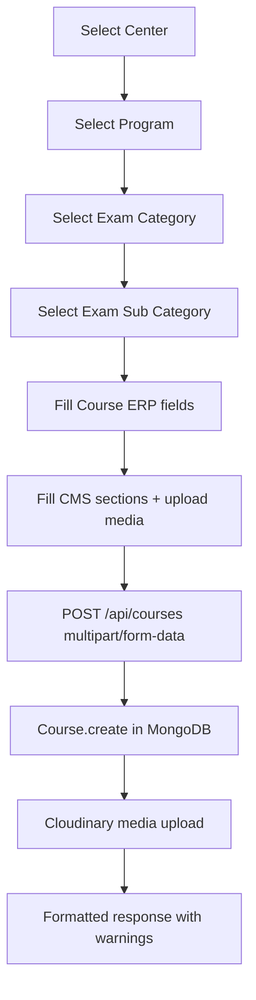

# Academics → Categories → Course — Frontend Integration Guide

> **Audience:** Frontend developers integrating the Course module in the React + Vite ERP.  
> **Backend:** Node.js + Express + MongoDB (read-only reference — do not modify backend).  
> **Last verified against:** `routes/courseRoutes.js`, `controllers/courseController.js`, `models/Course.js`

---

## Table of Contents

1. [Module Overview](#module-overview)
2. [API Inventory Table](#api-inventory-table)
3. [API Documentation](#api-documentation)
4. [Related Category APIs](#related-category-apis)
5. [Data Flow Documentation](#data-flow-documentation)
6. [Request/Response Mapping Table](#requestresponse-mapping-table)
7. [Centralized Service Layer](#centralized-service-layer)
8. [React Query Integration](#react-query-integration)
9. [Frontend Implementation Guide](#frontend-implementation-guide)
10. [MongoDB Persistence Verification](#mongodb-persistence-verification)
11. [Frontend Safety Validation](#frontend-safety-validation)
12. [Frontend Integration Checklist](#frontend-integration-checklist)
13. [Missing Integration Report](#missing-integration-report)

---

# Module Overview

## Purpose

The **Course** module is the leaf node of the academic hierarchy used to define sellable / enrollable academic offerings with CMS-rich content (overview, key features, why-choose, help sections, media).

```
Center → Program → Academic Category (Exam Category) → Academic Sub Category (Exam Sub Category) → Course
```

| UI label | Backend model | API base |
|----------|---------------|----------|
| Exam Category | `AcademicCategory` | `/api/categories` |
| Exam Sub Category | `AcademicSubCategory` | `/api/sub-categories` |
| Course | `Course` | `/api/courses` |

> **Naming trap:** Frontend services are named `examCategoryService` / `examSubCategoryService`, but they call `/api/categories` and `/api/sub-categories`. Do **not** confuse with `/api/resources/dropdowns/exam-categories` (Free Resources static dropdown) or `/api/test-categories` (test module).

## Dependencies

Before creating a course, these records must exist and be **ACTIVE**:

| Dependency | Dropdown API | Required when |
|------------|--------------|---------------|
| Center | `GET /api/centers/dropdown` (via `centerService`) | Always |
| Program | `GET /api/programs/by-center/:centerId` | After center selected |
| Exam Category | `GET /api/categories/filter?centerId=&programId=` | After program selected |
| Exam Sub Category | `GET /api/sub-categories/filter?centerId=&programId=&categoryId=` | After category selected |

Existing frontend implementations:

- `src/services/examCategoryService.ts` — full CRUD ✅
- `src/services/examSubCategoryService.ts` — full CRUD ✅
- `src/services/courseService.ts` — **read-only** (list, by id, dropdown) ⚠️

## Flow



## Frontend Integration Strategy

1. **Reuse existing patterns** from `examCategoryService.ts` + `useExamCategories.ts` for list/detail/mutations.
2. **Course create/update** must use `multipart/form-data` (not JSON) because of file uploads — mirror `batchService.ts` `buildBatchFormData` pattern.
3. **Cascade dropdowns** — each hierarchy level depends on the previous selection; disable downstream selects until parent is chosen.
4. **Response envelope** — Course APIs use `utils/apiResponse` (`{ success, statusCode, message, data }`); Category/SubCategory APIs return pagination at root level.
5. **Auth** — Bearer token auto-attached by `src/services/api.ts` interceptor from `localStorage` (`VITE_AUTH_TOKEN_KEY` or `authToken`).
6. **Role scoping** — `center_admin` can only create/edit courses for centers where they are `centerAdmin`; only `super_admin` can delete.

---

# API Inventory Table

## Course APIs (`/api/courses`)

| # | Method | Endpoint | Auth | Permission | Writes MongoDB |
|---|--------|----------|------|------------|----------------|
| 1 | `GET` | `/api/courses` | Public | — | No |
| 2 | `GET` | `/api/courses/:id` | Public | — | No |
| 3 | `POST` | `/api/courses/find` | Public | — | No |
| 4 | `GET` | `/api/courses/slug/:slug` | Public | — | No |
| 5 | `GET` | `/api/courses/dropdown` | Bearer JWT | `super_admin` | No |
| 6 | `GET` | `/api/courses/enquiry` | Public | — | No |
| 7 | `GET` | `/api/courses/grouped` | Public | — | No |
| 8 | `POST` | `/api/courses` | Bearer JWT | `super_admin` \| `center_admin` | **Yes** (`Course.create`) |
| 9 | `PUT` | `/api/courses/:id` | Bearer JWT | `super_admin` \| `center_admin` | **Yes** (`findByIdAndUpdate`) |
| 10 | `PATCH` | `/api/courses/status/:id` | Bearer JWT | `super_admin` \| `center_admin` | **Yes** (`findOneAndUpdate`) |
| 11 | `DELETE` | `/api/courses/:id` | Bearer JWT | `super_admin` only | **Yes** (soft delete via `save`) |

## Exam Category APIs (`/api/categories`)

| # | Method | Endpoint | Auth | Permission | Writes MongoDB |
|---|--------|----------|------|------------|----------------|
| 1 | `GET` | `/api/categories` | Bearer JWT | `super_admin` | No |
| 2 | `GET` | `/api/categories/:id` | Bearer JWT | `super_admin` | No |
| 3 | `GET` | `/api/categories/filter` | Bearer JWT | `super_admin` | No |
| 4 | `POST` | `/api/categories` | Bearer JWT | `super_admin` | **Yes** |
| 5 | `PUT` | `/api/categories/:id` | Bearer JWT | `super_admin` | **Yes** |
| 6 | `PATCH` | `/api/categories/status/:id` | Bearer JWT | `super_admin` | **Yes** |
| 7 | `DELETE` | `/api/categories/:id` | Bearer JWT | `super_admin` | **Yes** (hard delete) |

## Exam Sub Category APIs (`/api/sub-categories`)

| # | Method | Endpoint | Auth | Permission | Writes MongoDB |
|---|--------|----------|------|------------|----------------|
| 1 | `GET` | `/api/sub-categories` | Bearer JWT | `super_admin` | No |
| 2 | `GET` | `/api/sub-categories/:id` | Bearer JWT | `super_admin` | No |
| 3 | `GET` | `/api/sub-categories/filter` | Bearer JWT | `super_admin` | No |
| 4 | `POST` | `/api/sub-categories` | Bearer JWT | `super_admin` | **Yes** |
| 5 | `PUT` | `/api/sub-categories/:id` | Bearer JWT | `super_admin` | **Yes** |
| 6 | `PATCH` | `/api/sub-categories/status/:id` | Bearer JWT | `super_admin` | **Yes** |
| 7 | `DELETE` | `/api/sub-categories/:id` | Bearer JWT | `super_admin` | **Yes** (hard delete) |

---

# API Documentation

## Common Headers

| Header | Value | When |
|--------|-------|------|
| `Authorization` | `Bearer <jwt>` | Protected routes |
| `Accept` | `application/json` | Always |
| `Content-Type` | `application/json` | GET, PATCH status, Category/SubCategory CRUD |
| `Content-Type` | `multipart/form-data` | Course POST/PUT (with files) |

---

## 1. List Courses

| Property | Value |
|----------|-------|
| **Endpoint** | `GET /api/courses` |
| **Method** | `GET` |
| **Authentication** | None (public) |
| **Headers** | `Accept: application/json` |

### Query Parameters

| Parameter | Type | Required | Description |
|-----------|------|----------|-------------|
| `page` | number | No | Default `1` |
| `limit` | number \| `'all'` | No | Default `10`, max `100`; `'all'` returns entire result set |
| `search` | string | No | Regex on `courseName`, `title`, `courseId` |
| `center` / `centerId` | ObjectId | No | Filter by center |
| `program` / `programId` | ObjectId | No | Filter by program |
| `categoryId` | ObjectId | No | Filter by `academicCategory` |
| `subCategoryId` | ObjectId | No | Filter by `academicSubCategory` |
| `category` | ObjectId | No | Legacy global `Category` ref (deprecated) |
| `status` | `'ACTIVE'` \| `'INACTIVE'` | No | Sets both `status` and `isActive` |
| `isActive` | `'true'` \| `'false'` | No | Used when `status` not provided |
| `isFeatured` | truthy | No | Filter featured courses |
| `centerName` | string | No | Resolves centers by name/city/code |
| `categoryName` | string | No | Legacy category name filter (`'All'` ignored) |

### Success Response `200`

```json
{
  "success": true,
  "statusCode": 200,
  "message": "Courses fetched successfully",
  "data": {
    "count": 10,
    "total": 45,
    "page": 1,
    "limit": 10,
    "pages": 5,
    "courses": [/* formatted course objects */]
  }
}
```

### Error Response

| Status | Condition |
|--------|-----------|
| `500` | Server error |

### Frontend Usage Notes

- Use `stripEmptyParams()` before sending query object.
- Access courses via `response.data.courses` (nested under `data`).
- Soft-deleted courses (`isDeleted: true`) are excluded automatically.

---

## 2. Get Course by ID

| Property | Value |
|----------|-------|
| **Endpoint** | `GET /api/courses/:id` or `POST /api/courses/find` |
| **Method** | `GET` or `POST` |
| **Authentication** | None |

### Request Body (POST /find only)

```json
{ "id": "<mongoObjectId>" }
```

### Success Response `200`

```json
{
  "success": true,
  "statusCode": 200,
  "message": "Course fetched successfully",
  "data": {
    "course": { /* full formatted course */ }
  }
}
```

### Error Responses

| Status | Message |
|--------|---------|
| `400` | Course ID is required |
| `404` | Course not found |

---

## 3. Get Course by Slug

| Property | Value |
|----------|-------|
| **Endpoint** | `GET /api/courses/slug/:slug` |
| **Method** | `GET` |
| **Authentication** | None |

Public storefront / website use. Same response shape as Get by ID.

---

## 4. Course Dropdown

| Property | Value |
|----------|-------|
| **Endpoint** | `GET /api/courses/dropdown` |
| **Method** | `GET` |
| **Authentication** | Bearer JWT |
| **Permission** | `super_admin` only |

### Query Parameters

| Parameter | Type | Default | Description |
|-----------|------|---------|-------------|
| `search` | string | `''` | Regex on `courseName`, `courseId` |
| `status` | `'ACTIVE'` \| `'INACTIVE'` | `ACTIVE` | Status filter |
| `centerId` / `center` | ObjectId | — | Center filter |
| `programId` / `program` | ObjectId | — | Program filter |
| `excludeCourseId` | ObjectId | — | Exclude one course (edit forms) |
| `page` | number | `1` | Page number |
| `limit` | number | `100` | Max `200` |

### Success Response `200`

```json
{
  "success": true,
  "statusCode": 200,
  "message": "Courses dropdown fetched successfully",
  "data": {
    "count": 5,
    "total": 5,
    "page": 1,
    "limit": 100,
    "totalPages": 1,
    "data": [
      { "_id": "...", "courseId": "CRS001", "courseName": "UPSC Foundation" }
    ]
  }
}
```

> **Note:** Dropdown items are in `response.data.data` (double-nested).

### Frontend Usage Notes

- Already implemented: `courseService.getCoursesDropdown()` + `useCoursesDropdown()`.
- Requires Super Admin token — will return `401`/`403` for other roles.

---

## 5. Create Course

| Property | Value |
|----------|-------|
| **Endpoint** | `POST /api/courses` |
| **Method** | `POST` |
| **Authentication** | Bearer JWT |
| **Permission** | `super_admin` or `center_admin` (scoped to their center) |
| **Content-Type** | `multipart/form-data` |

### Required Fields (create)

| Field | Aliases | Validation |
|-------|---------|------------|
| `courseName` | `title` | Non-empty string |
| `centerId` | `center` | Valid ObjectId; active center |
| `programId` | `program` | Valid ObjectId; active; linked to center |
| `categoryId` | `academicCategory` | Valid ObjectId; ACTIVE; matches center+program |
| `subCategoryId` | `academicSubCategory` | Valid ObjectId; ACTIVE; matches full chain |

### Optional Fields

**ERP fields:**

| Field | Aliases | Notes |
|-------|---------|-------|
| `courseOverview` | — | String |
| `courseOverviewSectionTitle` | — | String |
| `keyFeaturesSectionTitle` | — | String |
| `helpSectionTitle` | `howWillSectionTitle` | String |
| `status` | — | `ACTIVE` (default) or `INACTIVE` |
| `isActive` | — | `false` maps to `INACTIVE` |

**CMS text/array fields (send as string or JSON string in FormData):**

| Field | Format | Limits |
|-------|--------|--------|
| `keyFeatures` | JSON array or newline-separated | 1–10 points if provided |
| `featureCards` | JSON array | Max 20 cards |
| `helpSectionPoints` | JSON array or newline-separated | 1–10 if provided |
| `whyChooseTitle` | string | — |

**CMS update-only control fields:**

| Field | Purpose |
|-------|---------|
| `keyFeatureRemoveImage` | `true` to remove key feature image |
| `whyChooseKeepImages` | JSON array of URLs to retain on update |
| `whyChooseRemoveVideo` | `true` to remove why-choose video |
| `helpSectionKeepImages` | JSON array of URLs to retain |
| `helpSectionRemoveVideo` | `true` to remove help video |

**File fields:**

| Field | Max count | Max size | MIME |
|-------|-----------|----------|------|
| `keyFeatureImage` | 1 | 5 MB | JPEG, PNG, WEBP |
| `whyChooseImages` | 3 total (incl. kept) | 5 MB each | JPEG, PNG, WEBP |
| `whyChooseVideo` | 1 | 50 MB | MP4, WebM |
| `helpSectionImages` | 3 total | 5 MB each | JPEG, PNG, WEBP |
| `helpSectionVideo` | 1 | 50 MB | MP4, WebM |

### Rejected (legacy) fields

Do **not** send: `whyChoose`, `helpSection`, `featureCardsMetadata`, or indexed upload keys like `keyFeatureImage_0`, `featureCard_0`, etc.

### Validation Rules

1. Full hierarchy chain validated via `validateCourseHierarchy`.
2. CMS limits enforced when fields are present.
3. `center_admin` must be `centerAdmin` of the target center.

### Success Response `201`

```json
{
  "success": true,
  "statusCode": 201,
  "message": "Course created successfully",
  "data": {
    "warnings": [
      { "field": "courseOverview", "message": "Course overview is missing..." }
    ],
    "course": { /* formatted course with populated refs */ }
  }
}
```

### Error Responses

| Status | Condition |
|--------|-----------|
| `400` | Missing required fields, invalid hierarchy, CMS validation |
| `401` | No/invalid token |
| `403` | Wrong role or center_admin not admin of center |
| `500` | Server / Cloudinary error |

### Frontend Usage Notes

- Build `FormData` manually; set `Content-Type: multipart/form-data` (let axios set boundary).
- Serialize arrays/objects with `JSON.stringify` before appending.
- Show `warnings` array as non-blocking UI hints after save.
- On success, course is persisted in MongoDB `courses` collection immediately.

---

## 6. Update Course

| Property | Value |
|----------|-------|
| **Endpoint** | `PUT /api/courses/:id` |
| **Method** | `PUT` |
| **Authentication** | Bearer JWT |
| **Permission** | `super_admin` or `center_admin` (scoped) |
| **Content-Type** | `multipart/form-data` |

### Required Fields

None — partial update supported. All create fields are optional on update.

### Validation Rules

- Same CMS validation as create when CMS fields/files are sent.
- Hierarchy re-validated only when any hierarchy field is included in body.
- `center_admin` can only edit courses belonging to their center.

### Success Response `200`

```json
{
  "success": true,
  "statusCode": 200,
  "message": "Course updated successfully",
  "data": {
    "warnings": [],
    "course": { /* updated course */ }
  }
}
```

### Error Responses

| Status | Condition |
|--------|-----------|
| `404` | Course not found or soft-deleted |
| `400` / `403` | Same as create |

---

## 7. Toggle Course Status

| Property | Value |
|----------|-------|
| **Endpoint** | `PATCH /api/courses/status/:id` |
| **Method** | `PATCH` |
| **Authentication** | Bearer JWT |
| **Permission** | `super_admin` or `center_admin` |

### Request Body

```json
{ "status": "ACTIVE" }
```

| Field | Required | Values |
|-------|----------|--------|
| `status` | Yes | `ACTIVE` \| `INACTIVE` |

Side effect: `isActive` is synced (`true` when `ACTIVE`).

### Success Response `200`

```json
{
  "success": true,
  "statusCode": 200,
  "message": "Course status updated successfully",
  "data": {
    "course": { /* updated course */ }
  }
}
```

### Error Responses

| Status | Message |
|--------|---------|
| `400` | status must be ACTIVE or INACTIVE |
| `404` | Course not found |

### Frontend Usage Notes

- Status can also be changed via `PUT /api/courses/:id` with `status` or `isActive` in FormData.
- Prefer dedicated PATCH endpoint for list toggle switches.

---

## 8. Delete Course

| Property | Value |
|----------|-------|
| **Endpoint** | `DELETE /api/courses/:id` |
| **Method** | `DELETE` |
| **Authentication** | Bearer JWT |
| **Permission** | `super_admin` only |

### Request Body

None.

### Behavior

**Soft delete** — sets `isDeleted: true`, `deletedAt: now`, `status: INACTIVE`, `isActive: false`. Enrollments remain linked.

### Success Response `200`

```json
{
  "success": true,
  "statusCode": 200,
  "message": "Course deleted successfully (soft delete — enrollments remain linked)"
}
```

### Error Responses

| Status | Condition |
|--------|-----------|
| `403` | Non super_admin |
| `404` | Course not found |

---

## 9. Courses for Enquiry

| Property | Value |
|----------|-------|
| **Endpoint** | `GET /api/courses/enquiry` |
| **Method** | `GET` |
| **Authentication** | None |

Returns active courses with `_id` and `title` only. Filters: `centerName`, `categoryName` (legacy).

---

## 10. Grouped Courses

| Property | Value |
|----------|-------|
| **Endpoint** | `GET /api/courses/grouped` |
| **Method** | `GET` |
| **Authentication** | None |

Returns active courses grouped by `centerName → categoryName → [courses]`.

---

# Related Category APIs

## Exam Category — Quick Reference

Full implementation exists in `examCategoryService.ts` and `useExamCategories.ts`.

| Operation | Method | Endpoint | Body |
|-----------|--------|----------|------|
| List | `GET` | `/api/categories` | Query: `search`, `center`, `program`, `status`, `page`, `limit`, `sortBy`, `sortOrder` |
| Detail | `GET` | `/api/categories/:id` | — |
| Filter dropdown | `GET` | `/api/categories/filter` | Query: `centerId`, `programId` (required) |
| Create | `POST` | `/api/categories` | `{ centerId, programId, categoryName, status? }` |
| Update | `PUT` | `/api/categories/:id` | Partial: `{ centerId?, programId?, categoryName?, status? }` |
| Status | `PATCH` | `/api/categories/status/:id` | `{ status: 'ACTIVE' \| 'INACTIVE' }` |
| Delete | `DELETE` | `/api/categories/:id` | Hard delete |

**List response shape** (pagination at root — differs from Course):

```json
{
  "success": true,
  "total": 20,
  "page": 1,
  "limit": 10,
  "totalPages": 2,
  "count": 10,
  "data": [/* ExamCategory[] */]
}
```

## Exam Sub Category — Quick Reference

Full implementation exists in `examSubCategoryService.ts` and `useExamSubCategories.ts`.

| Operation | Method | Endpoint | Body |
|-----------|--------|----------|------|
| List | `GET` | `/api/sub-categories` | Query: `search` or `subCategoryName`, `center`, `program`, `category`, `status`, `page`, `limit`, `sortBy`, `sortOrder` |
| Detail | `GET` | `/api/sub-categories/:id` | — |
| Filter dropdown | `GET` | `/api/sub-categories/filter` | Query: `centerId`, `programId`, `categoryId` (all required) |
| Create | `POST` | `/api/sub-categories` | `{ centerId, programId, categoryId, subCategoryName, status? }` |
| Update | `PUT` | `/api/sub-categories/:id` | Partial update |
| Status | `PATCH` | `/api/sub-categories/status/:id` | `{ status }` |
| Delete | `DELETE` | `/api/sub-categories/:id` | Hard delete |

---

# Data Flow Documentation

## MongoDB Models

### `Course` collection

| Field | Type | Notes |
|-------|------|-------|
| `courseId` | String | Auto `CRS###` |
| `courseName`, `title` | String | Synced on save |
| `slug` | String | Auto from title |
| `center` | ObjectId → Center | Required on create |
| `program` | ObjectId → Program | Required on create |
| `academicCategory` | ObjectId → AcademicCategory | Required on create |
| `academicSubCategory` | ObjectId → AcademicSubCategory | Required on create |
| `status` | `ACTIVE` \| `INACTIVE` | Default ACTIVE |
| `isActive` | Boolean | Synced from status |
| CMS fields | various | See API section |
| `isDeleted`, `deletedAt` | Boolean, Date | Soft delete |
| `createdBy` | ObjectId → User | Set from JWT |
| `createdAt`, `updatedAt` | timestamps | Auto |

### `AcademicCategory` collection

`categoryId` (CAT###), `categoryName`, `centerId`, `programId`, `status`

### `AcademicSubCategory` collection

`subCategoryId` (SUB###), `subCategoryName`, `centerId`, `programId`, `categoryId`, `status`

---

## Create Course Flow

```
Frontend FormData
  → POST /api/courses
  → courseRoutes.js [protect, allowRoles, courseUpload multer]
  → courseController.createCourse
      → resolveCourseName / resolveCenterId / resolveProgramId / resolveCategoryId / resolveSubCategoryId
      → validateCourseHierarchy (Center, Program, AcademicCategory, AcademicSubCategory lookups)
      → runCmsUploadValidation (legacy reject, limits, files)
      → center_admin scope check (Center.findById)
      → buildCourseCmsPayload (parse body + Cloudinary upload)
      → generateCourseId()
      → Course.create({ ... })          ← MongoDB WRITE
      → Course.findById().populate()
      → formatCourseResponse()
      → logAdminAudit()
  → 201 { warnings, course }
```

## Update Course Flow

```
Frontend FormData
  → PUT /api/courses/:id
  → courseController.updateCourse
      → Course.findOne({ _id, isDeleted != true })
      → runCmsUploadValidation
      → center_admin scope check
      → Build partial $set updates (name, hierarchy, CMS, status)
      → validateCourseHierarchy (if hierarchy fields sent)
      → buildCourseCmsPayload (if CMS fields/files present)
      → Course.findByIdAndUpdate($set)   ← MongoDB WRITE
      → formatCourseResponse + audit
  → 200 { warnings, course }
```

## Delete Course Flow

```
Frontend
  → DELETE /api/courses/:id
  → courseController.deleteCourse
      → super_admin check
      → Course.findOne
      → course.isDeleted = true; course.status = INACTIVE; course.save()  ← MongoDB WRITE
      → audit log
  → 200 success message
```

## List Course Flow

```
Frontend
  → GET /api/courses?filters
  → courseController.getCourses
      → Build MongoDB filter (NOT_DELETED + query params)
      → Course.countDocuments + Course.find().populate().sort().skip().limit  ← READ ONLY
      → formatCoursesList()
  → 200 { courses[], pagination }
```

## Search Course Flow

Search is not a separate endpoint. Pass `search` query param to `GET /api/courses`:

```
GET /api/courses?search=upsc&page=1&limit=10
  → filter.$or = [{ courseName: /upsc/i }, { title: /upsc/i }, { courseId: /upsc/i }]
```

Dropdown search uses `GET /api/courses/dropdown?search=...`.

---

# Request/Response Mapping Table

## Course ERP Fields

| Frontend Form Field | API Body Key (preferred) | Aliases | MongoDB Field | Create Required |
|---------------------|--------------------------|---------|---------------|-----------------|
| Course Name | `courseName` | `title` | `courseName`, `title` | Yes |
| Center | `centerId` | `center` | `center` | Yes |
| Program | `programId` | `program` | `program` | Yes |
| Exam Category | `categoryId` | `academicCategory` | `academicCategory` | Yes |
| Exam Sub Category | `subCategoryId` | `academicSubCategory` | `academicSubCategory` | Yes |
| Overview | `courseOverview` | — | `courseOverview` | No |
| Status | `status` | `isActive` | `status`, `isActive` | No (default ACTIVE) |

## Course CMS Fields

| Frontend Field | API Key | MongoDB Field | Response Key |
|----------------|---------|---------------|--------------|
| Overview title | `courseOverviewSectionTitle` | `courseOverviewSectionTitle` | same |
| Key features title | `keyFeaturesSectionTitle` | `keyFeaturesSectionTitle` | same |
| Key features list | `keyFeatures` | `keyFeatures[]` | `keyFeatures` |
| Key feature image | `keyFeatureImage` (file) | `keyFeatureImage` (URL) | same |
| Why choose title | `whyChooseTitle` | `whyChooseTitle` | same |
| Why choose images | `whyChooseImages` (files) | `whyChooseImages[]` | same |
| Why choose video | `whyChooseVideo` (file) | `whyChooseVideo` | same |
| Feature cards | `featureCards` (JSON) | `featureCards[]` | same |
| Help section title | `helpSectionTitle` | `helpSectionTitle` | same |
| Help points | `helpSectionPoints` | `helpSectionPoints[]` | same |
| Help images | `helpSectionImages` (files) | `helpSectionImages[]` | same |
| Help video | `helpSectionVideo` (file) | `helpSectionVideo` | same |

## API Response → UI Mapping (single course)

| Response path | UI usage |
|---------------|----------|
| `data.course._id` | Edit route param, delete target |
| `data.course.courseId` | Display ID (CRS001) |
| `data.course.courseName` | Title column / heading |
| `data.course.center.centerName` | Center column |
| `data.course.program.programName` | Program column |
| `data.course.academicCategory.categoryName` | Category column |
| `data.course.academicSubCategory.subCategoryName` | Sub-category column |
| `data.course.status` | Status badge / toggle |
| `data.warnings[]` | Inline CMS completeness hints |

## List Response Mapping

| API path | UI binding |
|----------|------------|
| `data.courses` | Table rows |
| `data.total` | Total count label |
| `data.page` | Current page state |
| `data.pages` | Pagination total pages |
| `data.limit` | Page size |

---

# Centralized Service Layer

Extend `src/services/courseService.ts` following `examCategoryService.ts` and `batchService.ts` patterns.

## Types (`src/types/course.ts` — create this file)

```typescript
import type { PaginatedQuery } from './api';

export type CourseStatus = 'ACTIVE' | 'INACTIVE';

export interface CourseListParams extends PaginatedQuery {
  center?: string;
  centerId?: string;
  program?: string;
  programId?: string;
  categoryId?: string;
  subCategoryId?: string;
  status?: CourseStatus;
  isActive?: boolean;
  isFeatured?: boolean;
  centerName?: string;
  categoryName?: string;
}

export interface CourseHierarchyRef {
  _id: string;
  centerName?: string;
  name?: string;
  programId?: string;
  programName?: string;
  categoryId?: string;
  categoryName?: string;
  subCategoryId?: string;
  subCategoryName?: string;
}

export interface FeatureCard {
  title: string;
  description: string;
  image: string;
  displayOrder: number;
  highlightOnWebsite: boolean;
}

export interface Course {
  _id: string;
  courseId: string;
  courseName: string;
  title: string;
  slug: string;
  center: CourseHierarchyRef | null;
  program: CourseHierarchyRef | null;
  academicCategory: CourseHierarchyRef | null;
  academicSubCategory: CourseHierarchyRef | null;
  courseOverview: string;
  courseOverviewSectionTitle: string;
  keyFeaturesSectionTitle: string;
  keyFeatures: string[];
  keyFeatureImage: string | null;
  whyChooseTitle: string;
  whyChooseImages: string[];
  whyChooseVideo: string | null;
  featureCards: FeatureCard[];
  helpSectionTitle: string;
  helpSectionPoints: string[];
  helpSectionImages: string[];
  helpSectionVideo: string | null;
  status: CourseStatus;
  isActive: boolean;
  isFeatured: boolean;
  createdAt?: string;
  updatedAt?: string;
}

export interface CreateCoursePayload {
  courseName: string;
  centerId: string;
  programId: string;
  categoryId: string;
  subCategoryId: string;
  courseOverview?: string;
  courseOverviewSectionTitle?: string;
  keyFeaturesSectionTitle?: string;
  helpSectionTitle?: string;
  status?: CourseStatus;
  keyFeatures?: string[];
  featureCards?: FeatureCard[];
  helpSectionPoints?: string[];
  whyChooseTitle?: string;
  keyFeatureImage?: File;
  whyChooseImages?: File[];
  whyChooseVideo?: File;
  helpSectionImages?: File[];
  helpSectionVideo?: File;
}

export interface UpdateCoursePayload extends Partial<CreateCoursePayload> {
  keyFeatureRemoveImage?: boolean;
  whyChooseKeepImages?: string[];
  whyChooseRemoveVideo?: boolean;
  helpSectionKeepImages?: string[];
  helpSectionRemoveVideo?: boolean;
}

export interface CourseListResponse {
  success: true;
  statusCode: number;
  message: string;
  data: {
    count: number;
    total: number;
    page: number;
    limit: number | 'all';
    pages: number;
    courses: Course[];
  };
}

export interface CourseMutationResponse {
  success: true;
  statusCode: number;
  message: string;
  data: {
    warnings: Array<{ field: string; message: string }>;
    course: Course;
  };
}
```

## `src/services/courseService.ts` (full implementation example)

```typescript
import api from './api';
import { stripEmptyParams } from './commonService';
import type {
  CourseDropdownParams,
  CourseDropdownItem,
} from './courseService'; // keep existing exports
import type {
  CourseListParams,
  CourseListResponse,
  CourseMutationResponse,
  CreateCoursePayload,
  UpdateCoursePayload,
  CourseStatus,
} from '../types/course';
import type { ApiSuccessResponse } from '../types/api';

const COURSES_BASE = '/api/courses';

const isFile = (value: unknown): value is File => value instanceof File;

const appendIfDefined = (form: FormData, key: string, value: unknown): void => {
  if (value === undefined || value === null) return;
  if (Array.isArray(value) && value.every(isFile)) {
    value.forEach((file) => form.append(key, file));
    return;
  }
  if (typeof value === 'object' && !isFile(value)) {
    form.append(key, JSON.stringify(value));
    return;
  }
  form.append(key, String(value));
};

const buildCourseFormData = (payload: CreateCoursePayload | UpdateCoursePayload): FormData => {
  const form = new FormData();
  const {
    keyFeatureImage,
    whyChooseImages,
    whyChooseVideo,
    helpSectionImages,
    helpSectionVideo,
    ...rest
  } = payload;

  Object.entries(rest).forEach(([key, value]) => appendIfDefined(form, key, value));

  if (keyFeatureImage) form.append('keyFeatureImage', keyFeatureImage);
  whyChooseImages?.forEach((file) => form.append('whyChooseImages', file));
  if (whyChooseVideo) form.append('whyChooseVideo', whyChooseVideo);
  helpSectionImages?.forEach((file) => form.append('helpSectionImages', file));
  if (helpSectionVideo) form.append('helpSectionVideo', helpSectionVideo);

  return form;
};

export const courseService = {
  /** GET /api/courses — public list with filters */
  getCourses: async (params?: CourseListParams) => {
    const { data } = await api.get<CourseListResponse>(COURSES_BASE, {
      params: stripEmptyParams(params),
    });
    return data;
  },

  /** GET /api/courses/:id */
  getCourseById: async (id: string) => {
    const { data } = await api.get<ApiSuccessResponse<{ course: import('../types/course').Course }>>(
      `${COURSES_BASE}/${id}`
    );
    return data;
  },

  /** GET /api/courses/dropdown — Super Admin required */
  getCoursesDropdown: async (params?: CourseDropdownParams) => {
    const { data } = await api.get<
      ApiSuccessResponse<{
        count: number;
        total: number;
        page: number;
        limit: number;
        totalPages: number;
        data: CourseDropdownItem[];
      }>
    >(`${COURSES_BASE}/dropdown`, { params: stripEmptyParams(params) });
    return data;
  },

  /** POST /api/courses — multipart create */
  createCourse: async (payload: CreateCoursePayload) => {
    const form = buildCourseFormData(payload);
    const { data } = await api.post<CourseMutationResponse>(COURSES_BASE, form, {
      headers: { 'Content-Type': 'multipart/form-data' },
    });
    return data;
  },

  /** PUT /api/courses/:id — multipart partial update */
  updateCourse: async (id: string, payload: UpdateCoursePayload) => {
    const form = buildCourseFormData(payload);
    const { data } = await api.put<CourseMutationResponse>(`${COURSES_BASE}/${id}`, form, {
      headers: { 'Content-Type': 'multipart/form-data' },
    });
    return data;
  },

  /** PATCH /api/courses/status/:id */
  toggleCourseStatus: async (id: string, status: CourseStatus) => {
    const { data } = await api.patch<ApiSuccessResponse<{ course: import('../types/course').Course }>>(
      `${COURSES_BASE}/status/${id}`,
      { status }
    );
    return data;
  },

  /** DELETE /api/courses/:id — super_admin only, soft delete */
  deleteCourse: async (id: string) => {
    const { data } = await api.delete<ApiSuccessResponse<null>>(`${COURSES_BASE}/${id}`);
    return data;
  },
};

export default courseService;

// Re-export existing interfaces
export type { CourseDropdownItem, CourseDropdownParams };
```

---

# React Query Integration

## Update `src/hooks/queryKeys.ts`

```typescript
import type { CourseListParams } from '../types/course';

export const courseKeys = {
  all: ['courses'] as const,
  lists: () => [...courseKeys.all, 'list'] as const,
  list: (params?: CourseListParams) => [...courseKeys.lists(), params ?? {}] as const,
  details: () => [...courseKeys.all, 'detail'] as const,
  detail: (id: string) => [...courseKeys.details(), id] as const,
  dropdown: (params?: CourseDropdownParams) =>
    [...courseKeys.all, 'dropdown', params ?? {}] as const,
};
```

## `src/hooks/useCourses.ts`

```typescript
import {
  useMutation,
  useQuery,
  useQueryClient,
  type UseQueryOptions,
} from '@tanstack/react-query';
import { courseService } from '../services/courseService';
import { courseKeys } from './queryKeys';
import { handleApiError } from '../utils/errorHandler';
import type { ApiSuccessResponse } from '../types/api';
import type {
  Course,
  CourseListParams,
  CourseListResponse,
  CourseMutationResponse,
  CourseStatus,
  CreateCoursePayload,
  UpdateCoursePayload,
} from '../types/course';

/** GET /api/courses — paginated list */
export const useCourses = (
  params?: CourseListParams,
  options?: Omit<UseQueryOptions<CourseListResponse>, 'queryKey' | 'queryFn'>
) =>
  useQuery({
    queryKey: courseKeys.list(params),
    queryFn: () => courseService.getCourses(params),
    ...options,
  });

/** GET /api/courses/:id */
export const useCourse = (
  id: string | undefined,
  options?: Omit<
    UseQueryOptions<ApiSuccessResponse<{ course: Course }>>,
    'queryKey' | 'queryFn'
  >
) =>
  useQuery({
    queryKey: courseKeys.detail(id ?? ''),
    queryFn: () => courseService.getCourseById(id!),
    enabled: Boolean(id),
    ...options,
  });
```

## `src/hooks/useCreateCourse.ts`

```typescript
import { useMutation, useQueryClient } from '@tanstack/react-query';
import { courseService } from '../services/courseService';
import { courseKeys } from './queryKeys';
import { handleApiError } from '../utils/errorHandler';
import type { CreateCoursePayload } from '../types/course';

export const useCreateCourse = () => {
  const queryClient = useQueryClient();

  return useMutation({
    mutationFn: (payload: CreateCoursePayload) => courseService.createCourse(payload),
    onSuccess: () => {
      queryClient.invalidateQueries({ queryKey: courseKeys.all });
    },
    onError: (error) => handleApiError(error),
  });
};
```

## `src/hooks/useUpdateCourse.ts`

```typescript
import { useMutation, useQueryClient } from '@tanstack/react-query';
import { courseService } from '../services/courseService';
import { courseKeys } from './queryKeys';
import { handleApiError } from '../utils/errorHandler';
import type { UpdateCoursePayload } from '../types/course';

export const useUpdateCourse = () => {
  const queryClient = useQueryClient();

  return useMutation({
    mutationFn: ({ id, payload }: { id: string; payload: UpdateCoursePayload }) =>
      courseService.updateCourse(id, payload),
    onSuccess: (_data, variables) => {
      queryClient.invalidateQueries({ queryKey: courseKeys.all });
      queryClient.invalidateQueries({ queryKey: courseKeys.detail(variables.id) });
    },
    onError: (error) => handleApiError(error),
  });
};
```

## `src/hooks/useDeleteCourse.ts`

```typescript
import { useMutation, useQueryClient } from '@tanstack/react-query';
import { courseService } from '../services/courseService';
import { courseKeys } from './queryKeys';
import { handleApiError } from '../utils/errorHandler';

export const useDeleteCourse = () => {
  const queryClient = useQueryClient();

  return useMutation({
    mutationFn: (id: string) => courseService.deleteCourse(id),
    onSuccess: (_data, id) => {
      queryClient.invalidateQueries({ queryKey: courseKeys.all });
      queryClient.removeQueries({ queryKey: courseKeys.detail(id) });
    },
    onError: (error) => handleApiError(error),
  });
};
```

## Status toggle hook (add to `useCourses.ts` or separate file)

```typescript
export const useToggleCourseStatus = () => {
  const queryClient = useQueryClient();

  return useMutation({
    mutationFn: ({ id, status }: { id: string; status: CourseStatus }) =>
      courseService.toggleCourseStatus(id, status),
    onMutate: async ({ id, status }) => {
      await queryClient.cancelQueries({ queryKey: courseKeys.detail(id) });
      const previous = queryClient.getQueryData<ApiSuccessResponse<{ course: Course }>>(
        courseKeys.detail(id)
      );
      if (previous?.data?.course) {
        queryClient.setQueryData(courseKeys.detail(id), {
          ...previous,
          data: { course: { ...previous.data.course, status, isActive: status === 'ACTIVE' } },
        });
      }
      return { previous };
    },
    onError: (error, variables, context) => {
      if (context?.previous) {
        queryClient.setQueryData(courseKeys.detail(variables.id), context.previous);
      }
      handleApiError(error);
    },
    onSettled: (_data, _error, variables) => {
      queryClient.invalidateQueries({ queryKey: courseKeys.all });
      queryClient.invalidateQueries({ queryKey: courseKeys.detail(variables.id) });
    },
  });
};
```

### Loading & Error States

```tsx
const { data, isLoading, isError, error, isFetching } = useCourses({ page: 1, limit: 10 });

const createMutation = useCreateCourse();
// createMutation.isPending — show submit spinner
// createMutation.isError — handled by handleApiError in onError
// createMutation.isSuccess — navigate or show toast; check data.data.warnings
```

---

# Frontend Implementation Guide

## ✓ Fetch Course List

```tsx
import { useCourses } from '../hooks/useCourses';

function CourseListPage() {
  const [page, setPage] = useState(1);
  const [search, setSearch] = useState('');

  const { data, isLoading, isError } = useCourses({
    page,
    limit: 10,
    search: search || undefined,
    status: 'ACTIVE',
  });

  if (isLoading) return <Spinner />;
  if (isError) return <ErrorState />;

  const { courses, total, pages } = data!.data;

  return (
    <>
      <SearchInput value={search} onChange={setSearch} />
      <Table rows={courses} />
      <Pagination page={page} totalPages={pages} onChange={setPage} />
      <span>Total: {total}</span>
    </>
  );
}
```

## ✓ Create Course

```tsx
import { useCreateCourse } from '../hooks/useCreateCourse';
import { useExamCategoriesFilter } from '../hooks/useExamCategories';
import { useExamSubCategoriesFilter } from '../hooks/useExamSubCategories';

function CreateCourseForm() {
  const createCourse = useCreateCourse();
  const [centerId, setCenterId] = useState('');
  const [programId, setProgramId] = useState('');
  const [categoryId, setCategoryId] = useState('');

  const { data: categories } = useExamCategoriesFilter(
    centerId && programId ? { centerId, programId } : undefined
  );
  const { data: subCategories } = useExamSubCategoriesFilter(
    centerId && programId && categoryId
      ? { centerId, programId, categoryId }
      : undefined
  );

  const handleSubmit = (form: HTMLFormElement) => {
    createCourse.mutate({
      courseName: form.courseName.value,
      centerId,
      programId,
      categoryId,
      subCategoryId: form.subCategoryId.value,
      courseOverview: form.courseOverview.value,
      keyFeatures: ['Feature 1', 'Feature 2'],
      status: 'ACTIVE',
      keyFeatureImage: form.keyFeatureImage.files?.[0],
    }, {
      onSuccess: (res) => {
        if (res.data?.warnings?.length) showWarnings(res.data.warnings);
        navigate('/academics/courses');
      },
    });
  };

  return (
    <form onSubmit={(e) => { e.preventDefault(); handleSubmit(e.currentTarget); }}>
      {/* Center → Program → Category → SubCategory cascade */}
      <select value={categoryId} onChange={(e) => setCategoryId(e.target.value)}>
        {categories?.data?.map((c) => (
          <option key={c._id} value={c._id}>{c.categoryName}</option>
        ))}
      </select>
      <select name="subCategoryId">
        {subCategories?.data?.map((s) => (
          <option key={s._id} value={s._id}>{s.subCategoryName}</option>
        ))}
      </select>
      <button type="submit" disabled={createCourse.isPending}>Save</button>
    </form>
  );
}
```

## ✓ Edit Course

```tsx
import { useCourse, useUpdateCourse } from '../hooks/useCourses';

function EditCoursePage({ id }: { id: string }) {
  const { data, isLoading } = useCourse(id);
  const updateCourse = useUpdateCourse();
  const course = data?.data?.course;

  const handleSave = (payload: UpdateCoursePayload) => {
    updateCourse.mutate({ id, payload });
  };

  if (isLoading || !course) return <Spinner />;

  return <CourseForm initialValues={course} onSubmit={handleSave} isPending={updateCourse.isPending} />;
}
```

## ✓ Delete Course

```tsx
import { useDeleteCourse } from '../hooks/useDeleteCourse';

function DeleteCourseButton({ id }: { id: string }) {
  const deleteCourse = useDeleteCourse();

  return (
    <button
      onClick={() => {
        if (confirm('Soft-delete this course?')) deleteCourse.mutate(id);
      }}
      disabled={deleteCourse.isPending}
    >
      Delete
    </button>
  );
}
```

> Only show delete button for `super_admin` role.

## ✓ Search Courses

```tsx
// Debounce search input, then:
useCourses({ search: debouncedTerm, page: 1, limit: 10 });
```

## ✓ Filter Courses

```tsx
useCourses({
  centerId: selectedCenter,
  programId: selectedProgram,
  categoryId: selectedCategory,
  subCategoryId: selectedSubCategory,
  status: statusFilter,
  page: 1,
});
```

## ✓ Paginate Courses

```tsx
const [page, setPage] = useState(1);
const { data } = useCourses({ page, limit: 10 });
// Use data.data.pages for total pages, data.data.page for current
```

## ✓ Toggle Status

```tsx
import { useToggleCourseStatus } from '../hooks/useCourses';

function StatusSwitch({ course }: { course: Course }) {
  const toggle = useToggleCourseStatus();

  return (
    <Switch
      checked={course.status === 'ACTIVE'}
      onChange={(checked) =>
        toggle.mutate({ id: course._id, status: checked ? 'ACTIVE' : 'INACTIVE' })
      }
      disabled={toggle.isPending}
    />
  );
}
```

## ✓ Populate Dropdowns

**Course form hierarchy (cascading):**

```tsx
// 1. Centers — centerService.getCentersDropdown()
// 2. Programs — programService.getProgramsByCenter(centerId)
// 3. Categories — examCategoryService.getExamCategoriesFilter({ centerId, programId })
// 4. Sub-categories — examSubCategoryService.getExamSubCategoriesFilter({ centerId, programId, categoryId })
```

**Course picker (batch forms, etc.):**

```tsx
import { useCoursesDropdown } from '../hooks/useCoursesDropdown';

const { data } = useCoursesDropdown({
  centerId,
  programId,
  status: 'ACTIVE',
  search: typeahead,
});
const options = data?.data?.data ?? []; // note double-nested data
```

---

# MongoDB Persistence Verification

## APIs that WRITE to MongoDB

| API | Controller method | MongoDB operation | Collection |
|-----|-------------------|-------------------|------------|
| `POST /api/courses` | `createCourse` | `Course.create()` | `courses` |
| `PUT /api/courses/:id` | `updateCourse` | `Course.findByIdAndUpdate()` | `courses` |
| `PATCH /api/courses/status/:id` | `updateCourseStatus` | `Course.findOneAndUpdate()` | `courses` |
| `DELETE /api/courses/:id` | `deleteCourse` | `course.save()` (soft delete fields) | `courses` |
| `POST /api/categories` | `createCategory` | `AcademicCategory.create()` | `academiccategories` |
| `PUT /api/categories/:id` | `updateCategory` | `category.save()` | `academiccategories` |
| `PATCH /api/categories/status/:id` | `updateCategoryStatus` | `findByIdAndUpdate` | `academiccategories` |
| `DELETE /api/categories/:id` | `deleteCategory` | `findByIdAndDelete` | `academiccategories` |
| `POST /api/sub-categories` | `createSubCategory` | `AcademicSubCategory.create()` | `academicsubcategories` |
| `PUT /api/sub-categories/:id` | `updateSubCategory` | `subCategory.save()` | `academicsubcategories` |
| `PATCH /api/sub-categories/status/:id` | `updateSubCategoryStatus` | `findByIdAndUpdate` | `academicsubcategories` |
| `DELETE /api/sub-categories/:id` | `deleteSubCategory` | `findByIdAndDelete` | `academicsubcategories` |

## Persistence confirmation checklist

After frontend create:

1. `POST /api/courses` returns `201` with `data.course._id` and `data.course.courseId` (e.g. `CRS001`).
2. `GET /api/courses/:id` returns the same record with populated hierarchy refs.
3. MongoDB document exists in `courses` collection with:
   - `center`, `program`, `academicCategory`, `academicSubCategory` ObjectIds
   - `courseName` / `title` synced
   - `slug` auto-generated
   - `status` / `isActive` synced
   - CMS URLs pointing to Cloudinary (if files uploaded)
   - `createdBy` set from JWT user
4. `GET /api/courses` list includes new course (unless filtered out).
5. Soft-deleted courses no longer appear in list (`isDeleted: true` excluded).

## Media upload path

```
FormData file fields
  → multer (courseUpload middleware, 50MB limit, memory storage)
  → buildCourseCmsPayload()
  → Cloudinary upload
  → URL stored in MongoDB string fields (keyFeatureImage, whyChooseImages[], etc.)
```

Frontend does **not** upload to Cloudinary directly — all media goes through the backend API.

---

# Frontend Safety Validation

| Check | Status | Notes |
|-------|--------|-------|
| Payload matches backend schema | ✅ | Use exact field names from mapping table; aliases documented |
| Required fields handled | ✅ | Validate `courseName`, `centerId`, `programId`, `categoryId`, `subCategoryId` client-side before submit |
| Optional fields handled | ✅ | Omit undefined keys in FormData; CMS optional but validated if sent |
| Validation rules respected | ✅ | Enforce CMS limits client-side for better UX (1–10 key features, max 3 images, etc.) |
| Search works | ✅ | `search` query on `GET /api/courses` and dropdown |
| Filters work | ✅ | `centerId`, `programId`, `categoryId`, `subCategoryId`, `status` |
| Pagination works | ✅ | `page`, `limit` (max 100); `limit=all` supported |
| Status management works | ✅ | `PATCH /api/courses/status/:id` or `status` in PUT body |
| Authentication works | ✅ | Bearer via `api.ts` interceptor; handle `auth:unauthorized` event |
| MongoDB persistence confirmed | ✅ | `Course.create` / `findByIdAndUpdate` / soft delete `save` |
| Role-based access | ⚠️ | Hide delete for non-`super_admin`; scope center_admin forms |
| Response envelope parsing | ⚠️ | Course list uses `data.courses`; categories use root `data` array |
| Multipart Content-Type | ⚠️ | Must use FormData for create/update; do not send JSON with files |

---

# Frontend Integration Checklist

## Setup

- [ ] `VITE_API_BASE_URL` configured in `.env`
- [ ] `VITE_AUTH_TOKEN_KEY` matches login storage key
- [ ] `@tanstack/react-query` QueryClientProvider wraps app
- [ ] User role available in auth context (`super_admin`, `center_admin`)

## Types & Services

- [ ] Create `src/types/course.ts`
- [ ] Extend `src/services/courseService.ts` with create/update/delete/status
- [ ] Add `courseKeys.list` and `courseKeys.detail` to `queryKeys.ts`
- [ ] Export new hooks from `src/hooks/index.ts` (if barrel exists)

## Hooks

- [ ] `useCourses` — list with filters/pagination
- [ ] `useCourse` — single record for edit/view
- [ ] `useCreateCourse` — mutation + invalidation
- [ ] `useUpdateCourse` — mutation + invalidation
- [ ] `useDeleteCourse` — mutation (super_admin only)
- [ ] `useToggleCourseStatus` — optimistic status toggle
- [ ] `useCoursesDropdown` — already exists ✅

## UI Pages (Academics → Categories → Course)

- [ ] Course list page with search, filters, pagination
- [ ] Create course form with cascading hierarchy dropdowns
- [ ] Edit course form with CMS sections and media preview
- [ ] Status toggle in list and detail views
- [ ] Delete action (super_admin only) with confirmation
- [ ] Display CMS warnings after save
- [ ] Handle 401/403 with redirect to login or permission message

## Category prerequisites (already implemented)

- [ ] Exam Category CRUD via `examCategoryService` ✅
- [ ] Exam Sub Category CRUD via `examSubCategoryService` ✅
- [ ] Filter dropdowns wired in course form cascade

## Verification

- [ ] Create course → appears in list
- [ ] Edit course → changes reflected on reload
- [ ] Toggle status → `isActive` synced
- [ ] Delete course → removed from list (soft delete)
- [ ] Upload image → Cloudinary URL in response
- [ ] Invalid hierarchy → 400 with reason
- [ ] center_admin blocked from other centers → 403

---

# Missing Integration Report

| Item | Status | Priority | Action |
|------|--------|----------|--------|
| `courseService.createCourse` | ❌ Missing | P0 | Add FormData builder + POST |
| `courseService.updateCourse` | ❌ Missing | P0 | Add FormData builder + PUT |
| `courseService.deleteCourse` | ❌ Missing | P1 | Add DELETE call |
| `courseService.toggleCourseStatus` | ❌ Missing | P1 | Add PATCH call |
| `src/types/course.ts` | ❌ Missing | P0 | Create types file |
| `useCourses` (list hook) | ❌ Missing | P0 | Add with `courseKeys.list` |
| `useCourse` (detail hook) | ❌ Missing | P0 | Add with `courseKeys.detail` |
| `useCreateCourse` | ❌ Missing | P0 | Add mutation |
| `useUpdateCourse` | ❌ Missing | P0 | Add mutation |
| `useDeleteCourse` | ❌ Missing | P1 | Add mutation |
| `useToggleCourseStatus` | ❌ Missing | P1 | Add optimistic mutation |
| `courseKeys.list` / `detail` | ❌ Missing | P0 | Extend `queryKeys.ts` |
| `courseService.getCourses` stripEmptyParams | ⚠️ Partial | P2 | Add `stripEmptyParams` wrapper |
| Course list page UI | ❌ Unknown | P0 | Build Academics → Course page |
| Course create/edit form UI | ❌ Unknown | P0 | Build multipart form |
| `examCategoryService` | ✅ Complete | — | Reuse as-is |
| `examSubCategoryService` | ✅ Complete | — | Reuse as-is |
| `useCoursesDropdown` | ✅ Complete | — | Reuse for batch/course pickers |
| Response envelope helper | ⚠️ Gap | P2 | Consider utility to normalize Course vs Category responses |

## Known Backend Behaviors to Respect

1. **Soft delete only** for courses — no hard delete API.
2. **Hard delete** for categories/sub-categories — no linked-record guard in backend.
3. **Category list pagination** is at response root; **course list pagination** is inside `data`.
4. **Dropdown double nesting** — course dropdown items at `response.data.data`.
5. **Legacy `category` field** on Course model is deprecated — always use `academicCategory` / `categoryId`.
6. **CMS warnings** are advisory only — save still succeeds with `201`/`200`.

---

## Source File Reference

| Layer | Path |
|-------|------|
| Routes | `routes/courseRoutes.js` |
| Controller | `controllers/courseController.js` |
| Model | `models/Course.js` |
| Category routes | `routes/academicCategoryRoutes.js` |
| SubCategory routes | `routes/academicSubCategoryRoutes.js` |
| Hierarchy validation | `utils/courseHierarchyValidation.js` |
| CMS validation | `utils/courseCmsValidation.js` |
| Response formatter | `utils/formatCourseResponse.js` |
| Upload middleware | `middleware/courseUpload.js` |
| Frontend API client | `src/services/api.ts` |
| Frontend course service | `src/services/courseService.ts` |
| Frontend category service | `src/services/examCategoryService.ts` |
| Frontend subcategory service | `src/services/examSubCategoryService.ts` |

---

*Generated for frontend-only integration. Backend APIs, payloads, and responses must not be altered.*
