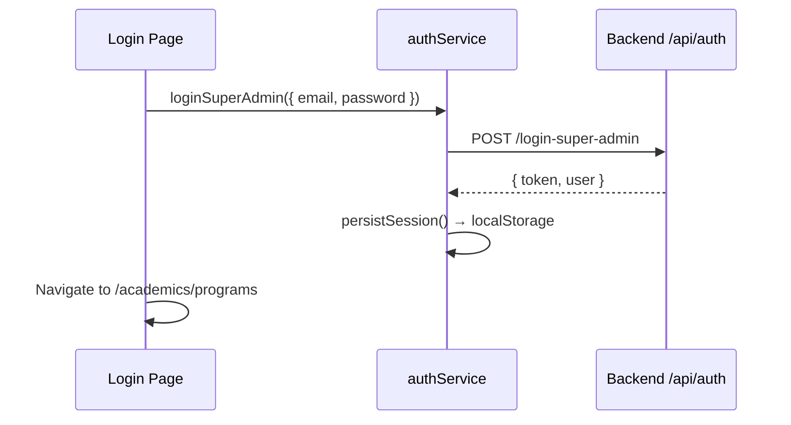
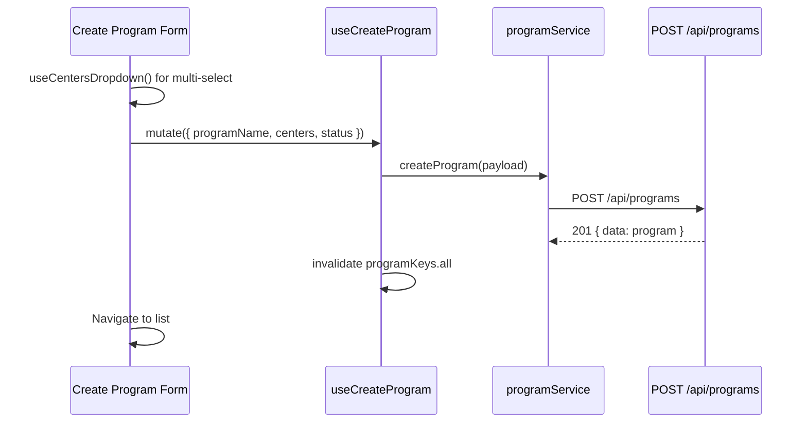
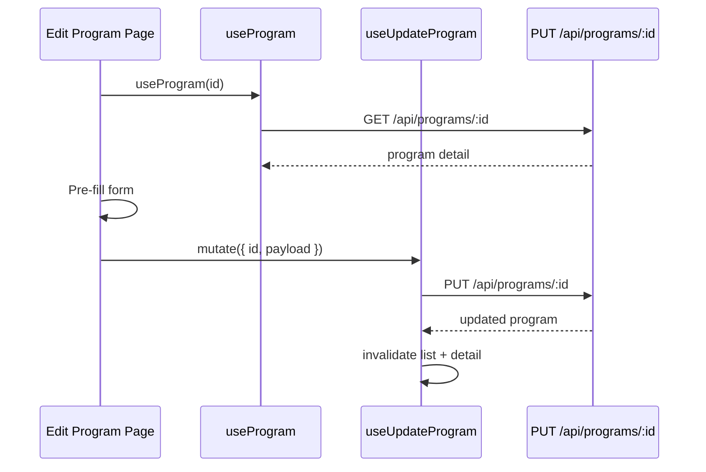
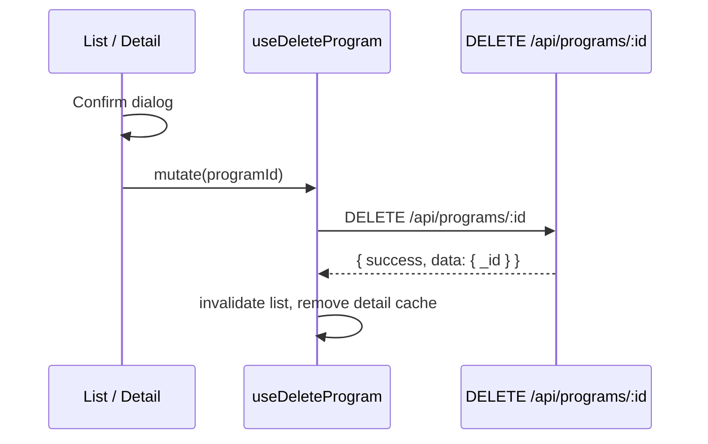
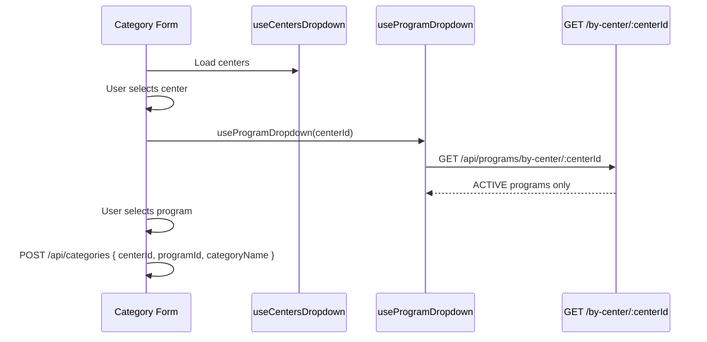

# Program Module — End-to-End Flow

This document maps user journeys in the LMS Admin Panel **Academics → Program Management** module to frontend hooks and backend APIs.

**Backend:** `https://sriramias-backend.onrender.com`  
**Source:** `controllers/programController.js`, `routes/programRoutes.js`

---

## Module Purpose

Programs sit between **Centers** and **Categories** in the academic hierarchy:

```text
Center[] ←→ Program → Category → Sub-Category → Course
```

A program:

- Has a server-generated `programId` (e.g. `PRG001`)
- Links to one or more **active centers** via `centers[]`
- Has `status`: `ACTIVE` | `INACTIVE`
- Reports `linkedCourses` (count of courses referencing this program)

Categories require a valid **center + program** pair where the program includes that center.

---

## Flow 1 — Admin Login



**Roles with program access:** Super Admin only (`requireSuperAdmin` on all `/api/programs` routes).

Frontend: `<RoleGuard allowedRoles={['Admin']} />` maps to `super_admin` / `SUPER_ADMIN`.

---

## Flow 2 — Program List Page

### User actions

- View paginated program table
- Search by program name or center attributes
- Filter by center and status
- Navigate to create / edit
- Toggle status or delete

### Data loading

```tsx
const [filters, setFilters] = useState({
  page: 1,
  limit: 10,
  search: '',
  center: '',
  status: '' as ProgramStatus | '',
});
const { data, isLoading, isError, error, refetch } = usePrograms(filters);
```

### API

```http
GET https://sriramias-backend.onrender.com/api/programs?page=1&limit=10&search=upsc&center=CENTER_ID&status=ACTIVE
Authorization: Bearer <token>
```

### Search behavior (server-side)

| Field | Match rule |
|-------|------------|
| `programName` | Contains search term (case-insensitive) |
| `centerName`, `centerCode`, `state` | Must **start with** term |
| `city` | Starts with term or word after space (e.g. "Delhi" in "New Delhi") |

### UI states

| State | Component |
|-------|-----------|
| Loading | `<PageLoader message="Loading programs…" />` |
| Error | `<ErrorState onRetry={refetch} />` |
| Empty | `<EmptyState title="No programs found" />` |
| Success | Program table |

### Table columns (suggested)

| Column | Source field |
|--------|--------------|
| Program ID | `programId` |
| Name | `programName` |
| Centers | `centers[].centerName` joined |
| Linked courses | `linkedCourses` |
| Status | `status` |
| Actions | Edit, delete, status toggle |

---

## Flow 3 — Create Program



### Form fields

| Field | Required | Notes |
|-------|----------|-------|
| `programName` | Yes | Text input |
| `centers` | Yes | Multi-select from `useCentersDropdown()` |
| `status` | No | Default `ACTIVE` |

### Validation errors (`400`)

- `Program name is required`
- `At least one center is required`
- `Invalid center id in centers array`
- `One or more centers are invalid or inactive`

```tsx
const createProgram = useCreateProgram();

const onSubmit = (values: CreateProgramPayload) => {
  createProgram.mutate(values, {
    onSuccess: () => navigate('/academics/programs'),
  });
};
```

---

## Flow 4 — Edit Program



### Partial update

All body fields are optional on update. Send only changed fields:

```tsx
updateProgram.mutate({
  id: programId,
  payload: {
    programName: 'Updated Name',
    centers: [centerId1, centerId2],
  },
});
```

---

## Flow 5 — Status Toggle

Dedicated endpoint for status-only changes:

```http
PATCH /api/programs/status/:id
{ "status": "INACTIVE" }
```

```ts
await programService.updateProgramStatus(programId, 'INACTIVE');
```

Or include `status` in a full `PUT` update.

---

## Flow 6 — Delete Program



**Warning:** Hard delete — no soft-delete or archive on programs.

---

## Flow 7 — Program Dropdown (Category Create)

Used when creating **Categories** under Academics:



```tsx
const [centerId, setCenterId] = useState<string>();
const { data: centers } = useCentersDropdown();
const { data: programs, isLoading: programsLoading } = useProgramDropdown(centerId);

// programs?.data → [{ _id, programId, programName }]
```

`enabled: Boolean(centerId)` prevents the dropdown query until a center is selected.

---

## Flow 8 — Error Handling

All hooks use `handleApiError` on mutation failure (toast if registered).

| Scenario | HTTP | Hook behavior |
|----------|------|---------------|
| No token | 401 | Axios interceptor fires `auth:unauthorized` |
| Non–Super Admin | 403 | Toast + `ErrorState` |
| Invalid id | 404 | Toast + not found UI |
| Validation | 400 | Toast with server `message` |
| Server error | 500 | Toast + retry |

```tsx
if (isError) {
  return (
    <ErrorState
      message={parseApiError(error).message}
      onRetry={() => refetch()}
    />
  );
}
```

---

## Route Structure (Suggested)

```tsx
<Route element={<ProtectedRoute />}>
  <Route
    path="/academics/programs"
    element={
      <RoleGuard allowedRoles={['Admin']}>
        <ProgramListPage />
      </RoleGuard>
    }
  />
  <Route path="/academics/programs/new" element={<ProgramCreatePage />} />
  <Route path="/academics/programs/:id/edit" element={<ProgramEditPage />} />
</Route>
```

---

## Cache Invalidation Matrix

| Mutation | Invalidated keys |
|----------|------------------|
| `useCreateProgram` | `programKeys.all` |
| `useUpdateProgram` | `programKeys.all`, `programKeys.detail(id)` |
| `useDeleteProgram` | `programKeys.all`, remove `programKeys.detail(id)` |

Dropdown cache (`programKeys.dropdown(centerId)`) is not auto-invalidated on create — refetch on center re-select or set `staleTime` low during admin sessions.

---

## Related Modules

| Next step | Documentation |
|-----------|---------------|
| Categories | `PROGRAM_CATEGORY_SUBCATEGORY_API_GUIDE.md` |
| Full API tables | `docs/api-integration-guide.md` |
| Integration README | `README_PROGRAM_INTEGRATION.md` |
